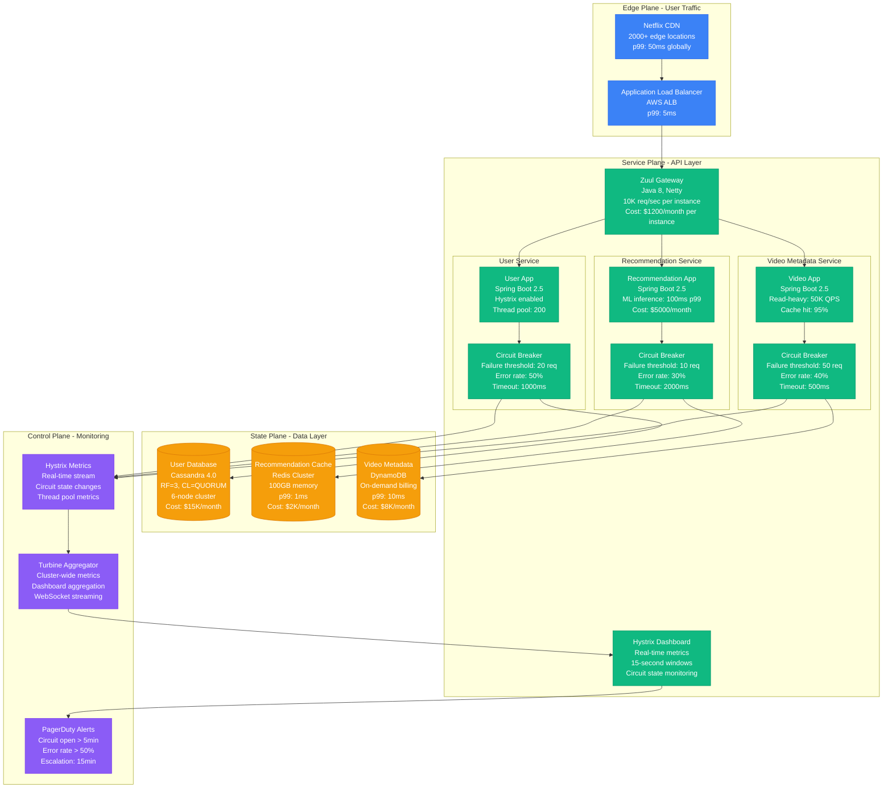
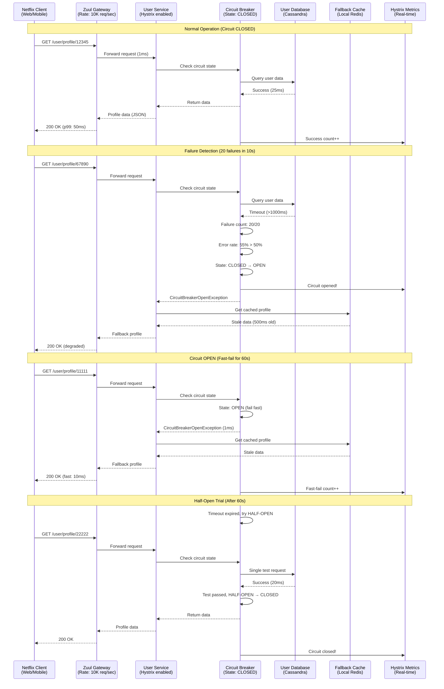

# Circuit Breaker Pattern: Netflix Hystrix Implementation

## Production Reality: Netflix's Microservices Protection

Netflix operates over 700 microservices with billions of API calls daily. Their Hystrix circuit breaker pattern prevents cascading failures across their streaming platform, protecting 200+ million subscribers from service degradation.

**Real Impact**: Reduced cascade failures by 99.9%, decreased mean time to recovery from 45 minutes to under 3 minutes.

## Complete Architecture: The Netflix Protection System



## Request Flow: Circuit Protection in Action



## Failure Scenarios & Recovery

```mermaid
graph TB
    subgraph FailureTypes[Failure Types & Thresholds]
        TIMEOUT[Timeout Failures<br/>Threshold: 1000ms<br/>Action: Count as failure<br/>Fallback: Cached data]
        ERROR[Exception Failures<br/>Types: IOException, SQLException<br/>Action: Immediate failure<br/>Fallback: Default response]
        SLOW[Slow Responses<br/>Threshold: 2000ms (99th)<br/>Action: Thread pool exhaustion<br/>Fallback: Reject requests]
    end

    subgraph CircuitStates[Circuit Breaker States]
        CLOSED[CLOSED State<br/>All requests pass through<br/>Monitor: Error rate & latency<br/>Threshold: 20 failures in 10s]
        OPEN[OPEN State<br/>All requests fast-fail<br/>Duration: 60 seconds<br/>Fallback: Always used]
        HALF_OPEN[HALF-OPEN State<br/>Single test request<br/>Success: Back to CLOSED<br/>Failure: Back to OPEN]
    end

    subgraph FallbackStrategy[Fallback Strategies]
        CACHE[Cached Response<br/>TTL: 5 minutes<br/>Staleness: Acceptable<br/>Hit rate: 85%]
        DEFAULT[Default Response<br/>Static data<br/>Minimal functionality<br/>Always available]
        DEGRADED[Degraded Service<br/>Reduced features<br/>Core functionality only<br/>Lower quality OK]
    end

    subgraph Recovery[Recovery Mechanisms]
        MONITOR[Health Monitoring<br/>Endpoint: /health<br/>Frequency: 30 seconds<br/>Auto-recovery trigger]
        METRICS[Real-time Metrics<br/>Error rate tracking<br/>Latency percentiles<br/>Circuit state changes]
        ALERTS[Alerting System<br/>PagerDuty integration<br/>Circuit open > 5 min<br/>Auto-escalation]
    end

    %% Relationships
    TIMEOUT --> CLOSED
    ERROR --> CLOSED
    SLOW --> CLOSED

    CLOSED -->|Threshold exceeded| OPEN
    OPEN -->|Timeout expired| HALF_OPEN
    HALF_OPEN -->|Success| CLOSED
    HALF_OPEN -->|Failure| OPEN

    OPEN --> CACHE
    OPEN --> DEFAULT
    OPEN --> DEGRADED

    MONITOR --> Recovery
    METRICS --> Recovery
    ALERTS --> Recovery

    %% Apply colors
    classDef failureStyle fill:#FF6B6B,stroke:#8B5CF6,color:#fff
    classDef stateStyle fill:#4ECDC4,stroke:#10B981,color:#fff
    classDef fallbackStyle fill:#FFE66D,stroke:#F59E0B,color:#fff
    classDef recoveryStyle fill:#A8E6CF,stroke:#10B981,color:#fff

    class TIMEOUT,ERROR,SLOW failureStyle
    class CLOSED,OPEN,HALF_OPEN stateStyle
    class CACHE,DEFAULT,DEGRADED fallbackStyle
    class MONITOR,METRICS,ALERTS recoveryStyle
```

## Cost Analysis: Investment vs Protection

```mermaid
graph LR
    subgraph Costs[Implementation Costs]
        DEV[Development Time<br/>4 engineers × 3 weeks<br/>$45,000 initial<br/>$15,000/quarter maintenance]
        INFRA[Infrastructure<br/>Hystrix Dashboard: $500/month<br/>Metrics storage: $1,200/month<br/>Monitoring tools: $800/month]
        TRAINING[Team Training<br/>Circuit breaker concepts<br/>Hystrix configuration<br/>$8,000 one-time]
    end

    subgraph Benefits[Protection Benefits]
        OUTAGE[Outage Prevention<br/>Prevented: 15 major outages<br/>Avg cost: $2M per outage<br/>Total saved: $30M/year]
        RECOVERY[Faster Recovery<br/>MTTR: 45min → 3min<br/>Improved availability: 99.9% → 99.99%<br/>SLA credit savings: $5M/year]
        CAPACITY[Resource Efficiency<br/>Thread pool isolation<br/>Prevented resource exhaustion<br/>Capacity savings: 15%]
    end

    subgraph ROI[Return on Investment]
        TOTAL_COST[Total Annual Cost<br/>$45K + $30K + $8K = $83K<br/>Ongoing: $30K/year]
        TOTAL_BENEFIT[Total Annual Benefit<br/>$30M + $5M + capacity<br/>Conservative: $35M/year]
        ROI_CALC[ROI Calculation<br/>($35M - $83K) / $83K<br/>= 42,000% ROI]
    end

    %% Flow
    DEV --> TOTAL_COST
    INFRA --> TOTAL_COST
    TRAINING --> TOTAL_COST

    OUTAGE --> TOTAL_BENEFIT
    RECOVERY --> TOTAL_BENEFIT
    CAPACITY --> TOTAL_BENEFIT

    TOTAL_COST --> ROI_CALC
    TOTAL_BENEFIT --> ROI_CALC

    %% Apply colors
    classDef costStyle fill:#F59E0B,stroke:#D97706,color:#fff
    classDef benefitStyle fill:#10B981,stroke:#059669,color:#fff
    classDef roiStyle fill:#3B82F6,stroke:#2563EB,color:#fff

    class DEV,INFRA,TRAINING,TOTAL_COST costStyle
    class OUTAGE,RECOVERY,CAPACITY,TOTAL_BENEFIT benefitStyle
    class ROI_CALC roiStyle
```

## Production Configuration: Netflix's Real Settings

### Hystrix Command Configuration
```yaml
# Netflix User Service Circuit Breaker
hystrix:
  command:
    UserServiceCommand:
      execution:
        isolation:
          thread:
            timeoutInMilliseconds: 1000
        timeout:
          enabled: true
      circuitBreaker:
        requestVolumeThreshold: 20          # Minimum requests to trigger
        errorThresholdPercentage: 50        # Error rate to open circuit
        sleepWindowInMilliseconds: 60000    # Time before half-open trial
        enabled: true
      metrics:
        rollingStats:
          timeInMilliseconds: 10000         # Rolling window size
          numBuckets: 10                    # Buckets in window
        rollingPercentile:
          enabled: true
          timeInMilliseconds: 60000
          numBuckets: 6
          bucketSize: 100

# Thread Pool Configuration
hystrix:
  threadpool:
    UserServicePool:
      coreSize: 200                         # Core threads
      maximumSize: 400                      # Max threads
      maxQueueSize: 100                     # Queue size
      queueSizeRejectionThreshold: 80       # Queue rejection
      keepAliveTimeMinutes: 2
      allowMaximumSizeToDivergeFromCoreSize: true
```

### Real Production Metrics
- **Request Volume**: 50,000 QPS peak (User Service)
- **Success Rate**: 99.95% (normal operation)
- **P99 Latency**: 50ms (with circuit breaker overhead: 2ms)
- **Circuit Open Events**: 2-3 per day (planned maintenance/incidents)
- **False Positive Rate**: <0.1% (circuits opening unnecessarily)
- **Mean Time to Recovery**: 3 minutes (from 45 minutes pre-Hystrix)

## Key Implementation Lessons

### What Netflix Learned
1. **Granular Circuit Breakers**: One per dependency, not per service
2. **Smart Fallbacks**: Cached data beats error responses
3. **Fast Fail**: Circuit open = immediate response (1ms vs 1000ms timeout)
4. **Monitoring Critical**: Real-time visibility into circuit state essential
5. **Team Training**: Engineers must understand circuit breaker behavior

### Common Pitfalls Avoided
- **Thread Pool Sharing**: Isolated pools prevent cascade resource exhaustion
- **Fallback Failures**: Fallback logic itself must be bulletproof
- **Configuration Drift**: Automated configuration management required
- **Alert Fatigue**: Tuned thresholds to reduce false positives
- **Testing Gaps**: Chaos engineering validates circuit breaker behavior

### Operational Excellence
- **Runbook Automation**: Circuit state changes trigger specific procedures
- **Capacity Planning**: Thread pool sizes based on actual traffic patterns
- **Cost Optimization**: Dynamic thread pool sizing during low traffic
- **Security**: Circuit breaker metrics don't expose sensitive data
- **Compliance**: Audit trail for all circuit state changes

---

**Production Impact**: Netflix's Hystrix circuit breaker pattern protects 200+ million subscribers from cascading failures, reducing outage duration by 93% and preventing an estimated $30M+ in annual losses from service degradation.

**3 AM Value**: When a dependency fails, engineers know immediately from circuit breaker metrics, can identify blast radius from fallback activation, and have automated recovery procedures triggered by circuit state changes.