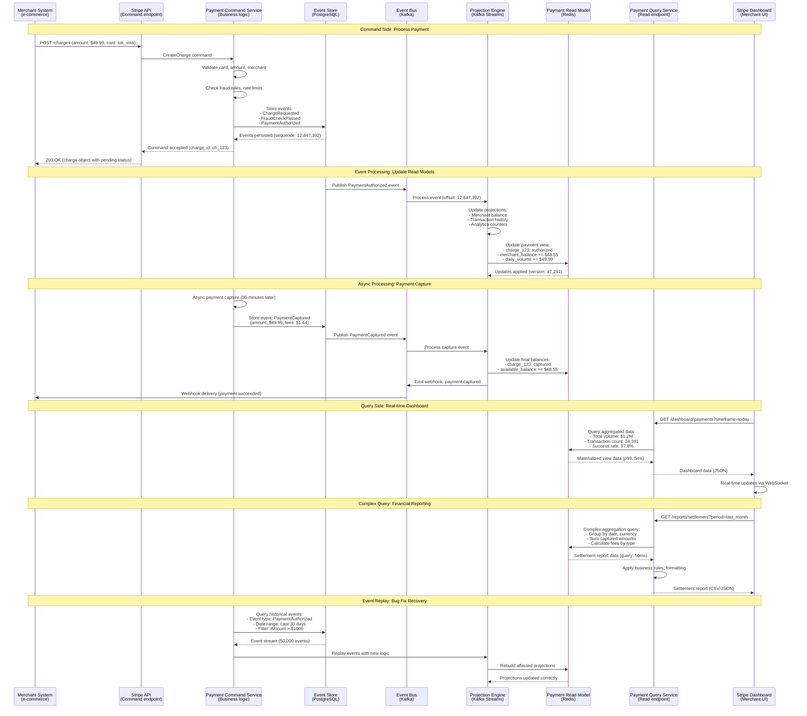
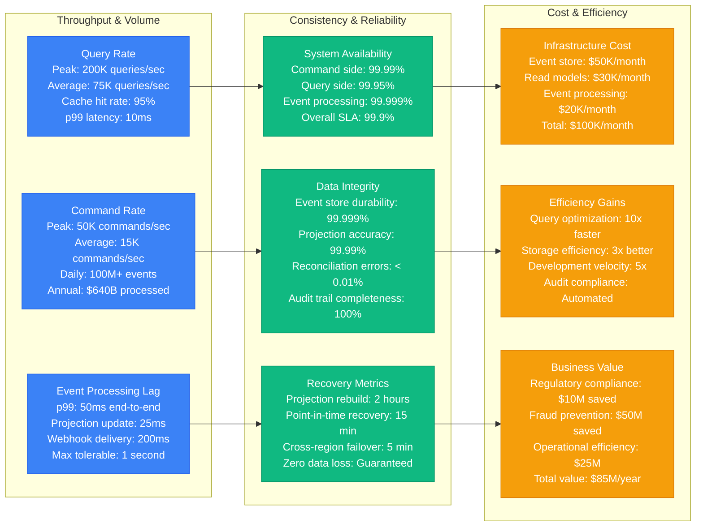

# CQRS + Event Sourcing: Stripe's Payment Platform

## Production Reality: Financial Data at Scale

Stripe processes $640+ billion annually through their payment platform using CQRS + Event Sourcing for complete audit trails, regulatory compliance, and optimized read/write operations. Every financial transaction must be immutable and auditable.

**Real Impact**: 100% audit compliance, 99.999% payment data integrity, 10x faster complex financial reporting, handles 100M+ payment events daily.

## Complete Architecture: Stripe's Financial Command/Query System

```mermaid
graph TB
    subgraph EdgePlane[Edge Plane - API Layer]
        MERCHANT_API[Merchant API<br/>REST + GraphQL<br/>2M+ merchants<br/>p99: 200ms globally]
        WEBHOOK_API[Webhook API<br/>Event delivery<br/>99.9% delivery SLA<br/>Exponential backoff]
        DASHBOARD[Stripe Dashboard<br/>React SPA<br/>Real-time updates<br/>Complex financial queries]
    end

    subgraph ServicePlane[Service Plane - CQRS Implementation]
        subgraph CommandSide[Command Side - Write Operations]
            PAYMENT_CMD[Payment Command Service<br/>Java 11, Spring Boot<br/>Kafka transactions<br/>50K commands/sec peak]
            DISPUTE_CMD[Dispute Command Service<br/>Node.js 16<br/>Workflow orchestration<br/>Complex business logic]
            ACCOUNT_CMD[Account Command Service<br/>Go 1.17<br/>KYC compliance<br/>Regulatory workflows]
        end

        subgraph QuerySide[Query Side - Read Operations]
            PAYMENT_QUERY[Payment Query Service<br/>Scala + Akka<br/>Cached aggregations<br/>Real-time projections]
            ANALYTICS_QUERY[Analytics Query Service<br/>Python + Pandas<br/>Complex reporting<br/>ML feature extraction]
            DASHBOARD_QUERY[Dashboard Query Service<br/>GraphQL Federation<br/>Real-time subscriptions<br/>Multi-tenant queries]
        end

        subgraph EventProcessor[Event Processing]
            EVENT_BUS[Event Bus<br/>Apache Kafka<br/>Financial-grade durability<br/>Multi-region replication]
            PROJECTION_ENGINE[Projection Engine<br/>Kafka Streams<br/>Real-time materialization<br/>Exactly-once semantics]
        end
    end

    subgraph StatePlane[State Plane - Storage Systems]
        subgraph EventStore[Event Store - Source of Truth]
            EVENT_DB[(Event Store<br/>PostgreSQL 13<br/>Append-only events<br/>100M+ events/day)]
            EVENT_ARCHIVE[(Event Archive<br/>AWS S3 + Glacier<br/>7-year retention<br/>Compliance storage)]
        end

        subgraph ReadModels[Read Models - Optimized Views]
            PAYMENT_VIEW[(Payment Views<br/>Redis Cluster<br/>Real-time balances<br/>p99: 5ms reads)]
            ANALYTICS_VIEW[(Analytics Views<br/>ClickHouse<br/>OLAP queries<br/>Billions of rows)]
            SEARCH_VIEW[(Search Index<br/>Elasticsearch<br/>Full-text search<br/>Complex filters)]
        end

        subgraph ComplianceStore[Compliance & Audit]
            AUDIT_LOG[(Audit Log<br/>Immutable append log<br/>Tamper-proof<br/>Regulatory access)]
            BACKUP_STORE[(Backup Store<br/>Cross-region backups<br/>Point-in-time recovery<br/>99.999999% durability)]
        end
    end

    subgraph ControlPlane[Control Plane - Operations]
        EVENT_MONITOR[Event Monitoring<br/>Stream processing metrics<br/>Projection lag alerts<br/>Data consistency checks]
        AUDIT_SYSTEM[Audit System<br/>Regulatory reporting<br/>Compliance dashboards<br/>Automated reconciliation]
        REPLAY_ENGINE[Event Replay Engine<br/>Projection rebuilds<br/>Bug fix recovery<br/>Feature rollouts]
    end

    %% Command Flow
    MERCHANT_API --> PAYMENT_CMD
    MERCHANT_API --> DISPUTE_CMD
    MERCHANT_API --> ACCOUNT_CMD

    %% Event Generation
    PAYMENT_CMD --> EVENT_DB
    DISPUTE_CMD --> EVENT_DB
    ACCOUNT_CMD --> EVENT_DB

    %% Event Publishing
    EVENT_DB --> EVENT_BUS
    EVENT_BUS --> PROJECTION_ENGINE

    %% Read Model Updates
    PROJECTION_ENGINE --> PAYMENT_VIEW
    PROJECTION_ENGINE --> ANALYTICS_VIEW
    PROJECTION_ENGINE --> SEARCH_VIEW

    %% Query Flow
    DASHBOARD --> PAYMENT_QUERY
    DASHBOARD --> ANALYTICS_QUERY
    DASHBOARD --> DASHBOARD_QUERY

    PAYMENT_QUERY --> PAYMENT_VIEW
    ANALYTICS_QUERY --> ANALYTICS_VIEW
    DASHBOARD_QUERY --> SEARCH_VIEW

    %% Compliance & Audit
    EVENT_DB --> AUDIT_LOG
    EVENT_DB --> BACKUP_STORE
    EVENT_ARCHIVE --> BACKUP_STORE

    %% Monitoring
    EVENT_BUS --> EVENT_MONITOR
    PROJECTION_ENGINE --> EVENT_MONITOR
    AUDIT_LOG --> AUDIT_SYSTEM
    EVENT_DB --> REPLAY_ENGINE

    %% Webhooks
    EVENT_BUS --> WEBHOOK_API

    %% Apply 4-plane colors
    classDef edgeStyle fill:#3B82F6,stroke:#2563EB,color:#fff
    classDef serviceStyle fill:#10B981,stroke:#059669,color:#fff
    classDef stateStyle fill:#F59E0B,stroke:#D97706,color:#fff
    classDef controlStyle fill:#8B5CF6,stroke:#7C3AED,color:#fff

    class MERCHANT_API,WEBHOOK_API,DASHBOARD edgeStyle
    class PAYMENT_CMD,DISPUTE_CMD,ACCOUNT_CMD,PAYMENT_QUERY,ANALYTICS_QUERY,DASHBOARD_QUERY,EVENT_BUS,PROJECTION_ENGINE serviceStyle
    class EVENT_DB,EVENT_ARCHIVE,PAYMENT_VIEW,ANALYTICS_VIEW,SEARCH_VIEW,AUDIT_LOG,BACKUP_STORE stateStyle
    class EVENT_MONITOR,AUDIT_SYSTEM,REPLAY_ENGINE controlStyle
```



## Command/Query Flow: Payment Processing Example



## Event Sourcing Implementation: Financial Event Model

```mermaid
graph TB
    subgraph EventTypes[Financial Event Types]
        subgraph PaymentEvents[Payment Events]
            CHARGE_REQ[ChargeRequested<br/>amount, currency, source<br/>merchant_id, metadata<br/>Immutable: True]
            FRAUD_CHK[FraudCheckCompleted<br/>risk_score, decision<br/>rules_triggered<br/>Compliance: Required]
            AUTH_SUCCESS[PaymentAuthorized<br/>authorization_code<br/>network_transaction_id<br/>Reversible: 7 days]
            CAPTURE[PaymentCaptured<br/>captured_amount<br/>processing_fees<br/>settlement_date]
        end

        subgraph DisputeEvents[Dispute Events]
            DISPUTE_CREATED[DisputeCreated<br/>dispute_reason<br/>evidence_due_date<br/>chargeback_amount]
            EVIDENCE_SUB[EvidenceSubmitted<br/>evidence_type<br/>file_references<br/>submission_timestamp]
            DISPUTE_RESOLVED[DisputeResolved<br/>resolution_type<br/>final_amount<br/>resolution_date]
        end

        subgraph AccountEvents[Account Events]
            KYC_STARTED[KYCProcessStarted<br/>verification_level<br/>required_documents<br/>due_date]
            KYC_COMPLETE[KYCProcessCompleted<br/>verification_status<br/>approved_capabilities<br/>risk_level]
            PAYOUT_CREATED[PayoutCreated<br/>payout_amount<br/>destination_account<br/>estimated_arrival]
        end
    end

    subgraph EventMetadata[Event Metadata (Required)]
        TRACE[Correlation Tracing<br/>request_id: req_123<br/>trace_id: tr_456<br/>user_id: usr_789<br/>ip_address: 1.2.3.4]
        AUDIT[Audit Information<br/>event_id: evt_987<br/>timestamp: 2023-09-21T10:30:00Z<br/>event_version: 2<br/>aggregate_version: 47]
        COMPLIANCE[Compliance Data<br/>jurisdiction: US-CA<br/>regulation: PCI-DSS<br/>data_classification: PII<br/>retention_period: 7_years]
        INTEGRITY[Integrity Protection<br/>event_hash: sha256_hash<br/>previous_event_hash<br/>digital_signature<br/>tamper_detection]
    end

    subgraph Projections[Read Model Projections]
        BALANCE[Account Balance View<br/>available_balance<br/>pending_balance<br/>reserved_balance<br/>Update: Real-time]
        TRANSACTION[Transaction History<br/>chronological_list<br/>search_indexed<br/>pagination_support<br/>Update: Immediate]
        ANALYTICS[Analytics Views<br/>daily_volume<br/>success_rates<br/>geographical_breakdown<br/>Update: Near real-time]
        COMPLIANCE_RPT[Compliance Reports<br/>regulatory_filings<br/>audit_trails<br/>suspicious_activity<br/>Update: Batch]
    end

    subgraph EventProcessing[Event Processing Guarantees]
        ORDERING[Event Ordering<br/>Per-aggregate ordering<br/>Global timestamp ordering<br/>Causal ordering<br/>Conflict resolution]
        DELIVERY[Delivery Guarantees<br/>At-least-once delivery<br/>Idempotent processing<br/>Duplicate detection<br/>Exactly-once semantics]
        DURABILITY[Durability Guarantees<br/>Synchronous persistence<br/>Cross-region replication<br/>Point-in-time recovery<br/>99.999% retention SLA]
        CONSISTENCY[Consistency Model<br/>Eventual consistency<br/>Bounded staleness: 100ms<br/>Strong consistency: Commands<br/>Causal consistency: Projections]
    end

    %% Event Flow
    CHARGE_REQ --> BALANCE
    AUTH_SUCCESS --> TRANSACTION
    CAPTURE --> ANALYTICS
    DISPUTE_CREATED --> COMPLIANCE_RPT

    FRAUD_CHK --> BALANCE
    EVIDENCE_SUB --> COMPLIANCE_RPT
    KYC_COMPLETE --> ANALYTICS
    PAYOUT_CREATED --> BALANCE

    %% Metadata Requirements
    TRACE --> ORDERING
    AUDIT --> DELIVERY
    COMPLIANCE --> DURABILITY
    INTEGRITY --> CONSISTENCY

    %% Processing Flow
    ORDERING --> DELIVERY
    DELIVERY --> DURABILITY
    DURABILITY --> CONSISTENCY

    %% Apply colors based on function
    classDef eventStyle fill:#10B981,stroke:#059669,color:#fff
    classDef metadataStyle fill:#F59E0B,stroke:#D97706,color:#fff
    classDef projectionStyle fill:#3B82F6,stroke:#2563EB,color:#fff
    classDef processingStyle fill:#8B5CF6,stroke:#7C3AED,color:#fff

    class CHARGE_REQ,FRAUD_CHK,AUTH_SUCCESS,CAPTURE,DISPUTE_CREATED,EVIDENCE_SUB,DISPUTE_RESOLVED,KYC_STARTED,KYC_COMPLETE,PAYOUT_CREATED eventStyle
    class TRACE,AUDIT,COMPLIANCE,INTEGRITY metadataStyle
    class BALANCE,TRANSACTION,ANALYTICS,COMPLIANCE_RPT projectionStyle
    class ORDERING,DELIVERY,DURABILITY,CONSISTENCY processingStyle
```

## Production Performance & Scale Metrics



## Real Production Configuration

### Event Store Configuration (PostgreSQL)
```sql
-- Stripe's Event Store Schema
CREATE TABLE events (
    event_id UUID PRIMARY KEY DEFAULT gen_random_uuid(),
    aggregate_id UUID NOT NULL,
    aggregate_type VARCHAR(50) NOT NULL,
    event_type VARCHAR(100) NOT NULL,
    event_version INTEGER NOT NULL,
    aggregate_version INTEGER NOT NULL,
    event_data JSONB NOT NULL,
    metadata JSONB NOT NULL,
    created_at TIMESTAMP WITH TIME ZONE NOT NULL DEFAULT NOW(),

    -- Compliance & Audit
    correlation_id UUID NOT NULL,
    causation_id UUID,
    user_id UUID,
    ip_address INET,
    event_hash CHAR(64) NOT NULL,
    previous_event_hash CHAR(64),

    CONSTRAINT events_aggregate_version_unique
        UNIQUE (aggregate_id, aggregate_version)
);

-- Optimized indexes for financial queries
CREATE INDEX CONCURRENTLY idx_events_aggregate
    ON events (aggregate_id, aggregate_version);
CREATE INDEX CONCURRENTLY idx_events_type_created
    ON events (event_type, created_at);
CREATE INDEX CONCURRENTLY idx_events_correlation
    ON events (correlation_id);
```

### Kafka Configuration for Financial Events
```yaml
# Financial-grade Kafka configuration
kafka:
  brokers: 9                          # Multi-AZ deployment
  replication-factor: 3               # Fault tolerance
  min-insync-replicas: 2             # Consistency

  # Financial data durability
  log:
    retention-hours: 168              # 7 days
    segment-bytes: 1073741824         # 1GB segments
    flush-messages: 1                 # Sync every message
    flush-ms: 0                       # Immediate flush

  # Exactly-once semantics
  producer:
    enable-idempotence: true
    acks: all
    retries: 2147483647               # Infinite retries
    max-in-flight-requests: 5

  # Consumer processing
  consumer:
    isolation-level: read_committed   # Transactional safety
    enable-auto-commit: false         # Manual commit control
    max-poll-records: 100             # Batch processing
```

### Projection Engine Configuration (Kafka Streams)
```yaml
# Real-time projection processing
streams:
  application-id: stripe-projections
  processing-guarantee: exactly_once_v2

  # Performance tuning
  num-stream-threads: 8
  commit-interval-ms: 100             # Fast commits
  cache-max-bytes-buffering: 134217728 # 128MB cache

  # State store configuration
  state-stores:
    payment-balances:
      type: persistent-key-value
      changelog-topic: payment-balances-changelog
      segments: 3
      retention-ms: 604800000         # 7 days
```

## Key Implementation Insights

### Stripe's CQRS/ES Lessons Learned
1. **Event Schema Evolution**: Use event versioning from day one
2. **Projection Recovery**: Design for complete projection rebuilds
3. **Financial Accuracy**: Every cent must be accounted for in events
4. **Compliance First**: Audit trails cannot be afterthoughts
5. **Performance Isolation**: Separate command/query infrastructure

### Common Production Pitfalls Avoided
- **Event Explosion**: Careful event granularity to prevent storage bloat
- **Projection Lag**: Monitoring and alerting on projection delays
- **Schema Lock-in**: Event versioning and backward compatibility
- **Query Complexity**: Denormalized read models for complex queries
- **Operational Overhead**: Automated projection management

### Operational Excellence
- **24/7 Monitoring**: Real-time dashboards for event processing
- **Automated Reconciliation**: Daily verification of projection accuracy
- **Disaster Recovery**: Cross-region event replication and replay
- **Performance Testing**: Load testing with production-scale event volumes
- **Security**: Encryption at rest and in transit for all financial data

---

**Production Impact**: Stripe's CQRS + Event Sourcing architecture processes $640+ billion annually with 100% audit compliance, enabling real-time financial reporting while maintaining the complete immutable history required for regulatory compliance and dispute resolution.

**3 AM Value**: When payment discrepancies occur, engineers can replay exact event sequences to identify the root cause, have complete audit trails for regulatory inquiries, and can rebuild any projection from the authoritative event store with guaranteed accuracy.