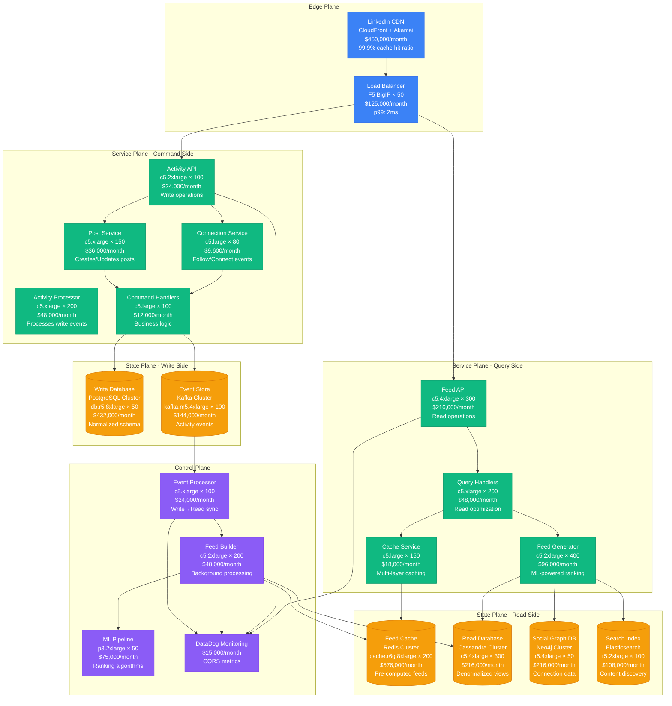
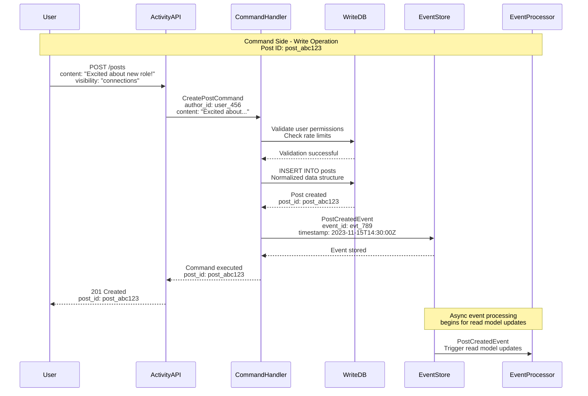
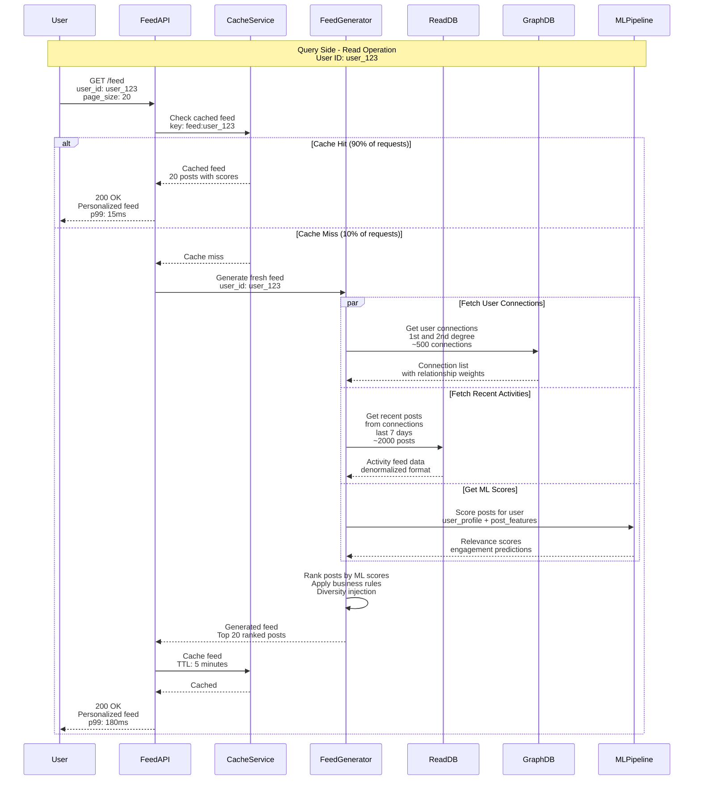

# CQRS Pattern: LinkedIn Feed Generation

## Pattern Overview

Command Query Responsibility Segregation (CQRS) separates read and write operations into different models, optimizing each for its specific use case. LinkedIn uses CQRS extensively for feed generation, where write operations update user activities and read operations serve personalized feeds to 900+ million members.

## LinkedIn Feed CQRS Architecture



## Command and Query Flow Separation

### Command Flow: Publishing a Post



### Query Flow: Feed Generation



## Data Model Separation

### Write Model (Command Side)

```sql
-- Write Model: Normalized for consistency and integrity
CREATE TABLE users (
    user_id BIGINT PRIMARY KEY,
    email VARCHAR(255) UNIQUE NOT NULL,
    profile_data JSONB,
    created_at TIMESTAMP NOT NULL,
    updated_at TIMESTAMP NOT NULL,
    version INTEGER NOT NULL DEFAULT 1
);

CREATE TABLE posts (
    post_id BIGINT PRIMARY KEY,
    author_id BIGINT NOT NULL REFERENCES users(user_id),
    content TEXT NOT NULL,
    visibility VARCHAR(20) NOT NULL DEFAULT 'public',
    post_type VARCHAR(20) NOT NULL DEFAULT 'text',
    created_at TIMESTAMP NOT NULL,
    updated_at TIMESTAMP NOT NULL,
    version INTEGER NOT NULL DEFAULT 1,

    -- Constraints for data integrity
    CONSTRAINT valid_visibility
        CHECK (visibility IN ('public', 'connections', 'private')),
    CONSTRAINT valid_post_type
        CHECK (post_type IN ('text', 'image', 'video', 'article'))
);

CREATE TABLE connections (
    connection_id BIGINT PRIMARY KEY,
    from_user_id BIGINT NOT NULL REFERENCES users(user_id),
    to_user_id BIGINT NOT NULL REFERENCES users(user_id),
    connection_type VARCHAR(20) NOT NULL DEFAULT 'connection',
    status VARCHAR(20) NOT NULL DEFAULT 'pending',
    created_at TIMESTAMP NOT NULL,
    updated_at TIMESTAMP NOT NULL,

    UNIQUE (from_user_id, to_user_id),
    CONSTRAINT valid_connection_type
        CHECK (connection_type IN ('connection', 'follow', 'block')),
    CONSTRAINT valid_status
        CHECK (status IN ('pending', 'accepted', 'declined'))
);
```

### Read Model (Query Side)

```sql
-- Read Model: Denormalized for query performance
CREATE TABLE feed_activities (
    activity_id BIGINT PRIMARY KEY,
    user_id BIGINT NOT NULL,  -- Activity owner
    actor_id BIGINT NOT NULL, -- Who performed the action
    actor_name VARCHAR(255) NOT NULL,
    actor_headline VARCHAR(500),
    actor_profile_image VARCHAR(500),
    activity_type VARCHAR(50) NOT NULL,
    content TEXT,
    media_urls TEXT[], -- Array of media URLs
    engagement_score FLOAT DEFAULT 0.0,
    created_at TIMESTAMP NOT NULL,
    updated_at TIMESTAMP NOT NULL,

    -- Partitioning by time for performance
    PARTITION BY RANGE (created_at)
);

-- Partition tables by month
CREATE TABLE feed_activities_2023_11
    PARTITION OF feed_activities
    FOR VALUES FROM ('2023-11-01') TO ('2023-12-01');

CREATE TABLE feed_activities_2023_12
    PARTITION OF feed_activities
    FOR VALUES FROM ('2023-12-01') TO ('2024-01-01');

-- User connections materialized view for fast lookups
CREATE MATERIALIZED VIEW user_network AS
SELECT
    user_id,
    ARRAY_AGG(connected_user_id) as direct_connections,
    ARRAY_AGG(connection_strength) as connection_weights,
    COUNT(*) as connection_count,
    MAX(last_interaction) as last_network_activity
FROM (
    SELECT
        from_user_id as user_id,
        to_user_id as connected_user_id,
        CASE
            WHEN connection_type = 'connection' THEN 1.0
            WHEN connection_type = 'follow' THEN 0.7
            ELSE 0.3
        END as connection_strength,
        updated_at as last_interaction
    FROM connections
    WHERE status = 'accepted'

    UNION ALL

    SELECT
        to_user_id as user_id,
        from_user_id as connected_user_id,
        CASE
            WHEN connection_type = 'connection' THEN 1.0
            WHEN connection_type = 'follow' THEN 0.5
            ELSE 0.2
        END as connection_strength,
        updated_at as last_interaction
    FROM connections
    WHERE status = 'accepted'
) network_data
GROUP BY user_id;

-- Indexes for feed query performance
CREATE INDEX idx_feed_activities_user_time
    ON feed_activities (user_id, created_at DESC);
CREATE INDEX idx_feed_activities_actor_time
    ON feed_activities (actor_id, created_at DESC);
CREATE INDEX idx_feed_activities_type_score
    ON feed_activities (activity_type, engagement_score DESC);
```

## Event Processing Pipeline

### Event-Driven Read Model Updates

```java
@Component
public class FeedActivityProjectionBuilder {

    @Autowired
    private FeedActivityRepository feedRepository;

    @Autowired
    private UserNetworkService networkService;

    @Autowired
    private MLScoringService scoringService;

    @EventHandler
    public void handle(PostCreatedEvent event) {
        // Get user's network for feed distribution
        UserNetwork network = networkService.getUserNetwork(event.getAuthorId());

        // Create activity for each connected user's feed
        List<FeedActivity> activities = network.getConnections().stream()
            .map(connectionId -> createFeedActivity(event, connectionId))
            .collect(Collectors.toList());

        // Batch insert for performance
        feedRepository.saveAll(activities);

        // Trigger ML scoring asynchronously
        scoringService.scoreActivitiesAsync(activities);

        log.info("Created {} feed activities for post {}",
            activities.size(), event.getPostId());
    }

    @EventHandler
    public void handle(PostUpdatedEvent event) {
        // Update existing feed activities
        List<FeedActivity> existingActivities =
            feedRepository.findByPostId(event.getPostId());

        existingActivities.forEach(activity -> {
            activity.setContent(event.getUpdatedContent());
            activity.setUpdatedAt(event.getTimestamp());
        });

        feedRepository.saveAll(existingActivities);

        // Re-score updated content
        scoringService.rescoreActivitiesAsync(existingActivities);
    }

    @EventHandler
    public void handle(ConnectionCreatedEvent event) {
        // When users connect, backfill recent activities
        UserActivity recentActivities = feedRepository
            .getRecentActivities(event.getToUserId(), Duration.ofDays(7));

        List<FeedActivity> newFeedActivities = recentActivities.stream()
            .map(activity -> createFeedActivity(activity, event.getFromUserId()))
            .collect(Collectors.toList());

        feedRepository.saveAll(newFeedActivities);

        log.info("Backfilled {} activities for new connection: {} -> {}",
            newFeedActivities.size(), event.getFromUserId(), event.getToUserId());
    }

    private FeedActivity createFeedActivity(PostCreatedEvent event, Long viewerUserId) {
        return FeedActivity.builder()
            .userId(viewerUserId)
            .actorId(event.getAuthorId())
            .actorName(event.getAuthorName())
            .actorHeadline(event.getAuthorHeadline())
            .actorProfileImage(event.getAuthorProfileImage())
            .activityType("POST_CREATED")
            .content(event.getContent())
            .mediaUrls(event.getMediaUrls())
            .engagementScore(0.0) // Will be updated by ML scoring
            .createdAt(event.getTimestamp())
            .updatedAt(event.getTimestamp())
            .build();
    }
}
```

### Command Handler Implementation

```java
@Component
public class PostCommandHandler {

    @Autowired
    private PostRepository postRepository;

    @Autowired
    private EventPublisher eventPublisher;

    @Autowired
    private RateLimitService rateLimitService;

    @Autowired
    private ContentModerationService moderationService;

    @CommandHandler
    @Transactional
    public PostCommandResult handle(CreatePostCommand command) {
        // Rate limiting check
        if (!rateLimitService.allowRequest(command.getAuthorId(), "create_post")) {
            throw new RateLimitExceededException("Post creation rate limit exceeded");
        }

        // Content moderation
        ModerationResult moderation = moderationService.moderateContent(
            command.getContent());
        if (!moderation.isApproved()) {
            throw new ContentViolationException("Post content violates guidelines");
        }

        // Create post entity
        Post post = Post.builder()
            .authorId(command.getAuthorId())
            .content(command.getContent())
            .visibility(command.getVisibility())
            .postType(command.getPostType())
            .mediaUrls(command.getMediaUrls())
            .createdAt(Instant.now())
            .updatedAt(Instant.now())
            .version(1)
            .build();

        // Save to write database
        Post savedPost = postRepository.save(post);

        // Publish event for read model updates
        PostCreatedEvent event = PostCreatedEvent.builder()
            .postId(savedPost.getPostId())
            .authorId(savedPost.getAuthorId())
            .authorName(getUserName(savedPost.getAuthorId()))
            .authorHeadline(getUserHeadline(savedPost.getAuthorId()))
            .authorProfileImage(getUserProfileImage(savedPost.getAuthorId()))
            .content(savedPost.getContent())
            .visibility(savedPost.getVisibility())
            .mediaUrls(savedPost.getMediaUrls())
            .timestamp(savedPost.getCreatedAt())
            .build();

        eventPublisher.publish(event);

        return PostCommandResult.builder()
            .postId(savedPost.getPostId())
            .status("created")
            .timestamp(savedPost.getCreatedAt())
            .build();
    }

    @CommandHandler
    @Transactional
    public PostCommandResult handle(UpdatePostCommand command) {
        Post existingPost = postRepository.findById(command.getPostId())
            .orElseThrow(() -> new PostNotFoundException(command.getPostId()));

        // Verify ownership
        if (!existingPost.getAuthorId().equals(command.getAuthorId())) {
            throw new UnauthorizedOperationException("User cannot edit this post");
        }

        // Content moderation for updates
        ModerationResult moderation = moderationService.moderateContent(
            command.getUpdatedContent());
        if (!moderation.isApproved()) {
            throw new ContentViolationException("Updated content violates guidelines");
        }

        // Update post
        existingPost.setContent(command.getUpdatedContent());
        existingPost.setUpdatedAt(Instant.now());
        existingPost.setVersion(existingPost.getVersion() + 1);

        Post updatedPost = postRepository.save(existingPost);

        // Publish update event
        PostUpdatedEvent event = PostUpdatedEvent.builder()
            .postId(updatedPost.getPostId())
            .authorId(updatedPost.getAuthorId())
            .updatedContent(updatedPost.getContent())
            .previousVersion(updatedPost.getVersion() - 1)
            .currentVersion(updatedPost.getVersion())
            .timestamp(updatedPost.getUpdatedAt())
            .build();

        eventPublisher.publish(event);

        return PostCommandResult.builder()
            .postId(updatedPost.getPostId())
            .status("updated")
            .timestamp(updatedPost.getUpdatedAt())
            .build();
    }
}
```

## Real Production Metrics

### LinkedIn Feed CQRS Scale (2023)

- **Daily Commands**: 50 million+ posts/updates/connections
- **Daily Queries**: 15 billion+ feed requests
- **Read/Write Ratio**: 300:1 (typical CQRS benefit)
- **Feed Generation**: p99 < 200ms for cache miss
- **Event Processing Lag**: Average 50ms write-to-read consistency

### Performance Characteristics

```mermaid
xychart-beta
    title "CQRS Performance Comparison"
    x-axis ["Write Operations", "Cached Reads", "Uncached Reads", "Event Processing", "ML Scoring"]
    y-axis "Latency (ms)" 0 --> 500
    bar "p50 Latency" [25, 5, 95, 35, 150]
    bar "p99 Latency" [85, 15, 180, 120, 400]
```



### Resource Utilization

| Component | CPU Usage | Memory Usage | Monthly Cost |
|-----------|-----------|--------------|--------------|
| Command Side | 45-65% | 16-24GB | $129,600 |
| Query Side | 60-80% | 32-48GB | $378,000 |
| Event Processing | 35-55% | 8-16GB | $72,000 |
| Read Model Storage | N/A | N/A | $1,116,000 |
| **Total** | | | **$1,695,600** |

## Advanced CQRS Patterns

### Eventually Consistent Read Models

```java
@Component
public class EventualConsistencyHandler {

    @Autowired
    private FeedConsistencyChecker consistencyChecker;

    @Autowired
    private ReadModelRepairService repairService;

    @Scheduled(fixedDelay = 30000) // Every 30 seconds
    public void checkEventualConsistency() {
        // Sample recent events for consistency checking
        List<Event> recentEvents = eventStore.getEventsInTimeRange(
            Instant.now().minus(Duration.ofMinutes(5)),
            Instant.now()
        );

        for (Event event : recentEvents) {
            if (!consistencyChecker.isReadModelConsistent(event)) {
                log.warn("Inconsistency detected for event: {}", event.getEventId());

                // Trigger read model repair
                repairService.repairReadModelAsync(event);

                // Metrics for monitoring
                metricsCollector.incrementCounter("read_model_inconsistencies");
            }
        }
    }

    @EventHandler
    public void handle(ReadModelInconsistencyDetected event) {
        // Auto-repair mechanism
        try {
            repairService.repairReadModel(
                event.getAggregateId(),
                event.getInconsistentProjection()
            );

            log.info("Auto-repaired read model inconsistency for aggregate: {}",
                event.getAggregateId());

        } catch (Exception e) {
            // Escalate to manual intervention
            alertService.sendAlert(
                "Read model auto-repair failed",
                String.format("Aggregate: %s, Error: %s",
                    event.getAggregateId(), e.getMessage())
            );
        }
    }
}
```

### Multi-Version Read Models

```java
@Component
public class MultiVersionReadModelManager {

    @Autowired
    private ReadModelVersionRegistry versionRegistry;

    public FeedResponse getFeed(String userId, String clientVersion) {
        // Determine appropriate read model version based on client
        ReadModelVersion targetVersion = versionRegistry
            .getOptimalVersionForClient(clientVersion);

        switch (targetVersion) {
            case V1:
                return getFeedV1(userId);
            case V2:
                return getFeedV2(userId);
            case V3:
                return getFeedV3(userId);
            default:
                return getFeedV3(userId); // Latest version as fallback
        }
    }

    private FeedResponse getFeedV1(String userId) {
        // Legacy feed format for older clients
        List<FeedActivityV1> activities = feedRepositoryV1
            .getFeedActivities(userId, 20);

        return FeedResponse.builder()
            .version("v1")
            .activities(activities)
            .pagination(buildPaginationV1(activities))
            .build();
    }

    private FeedResponse getFeedV2(String userId) {
        // Enhanced feed with engagement metrics
        List<FeedActivityV2> activities = feedRepositoryV2
            .getFeedActivitiesWithEngagement(userId, 20);

        return FeedResponse.builder()
            .version("v2")
            .activities(activities)
            .engagement_summary(calculateEngagementSummary(activities))
            .pagination(buildPaginationV2(activities))
            .build();
    }

    private FeedResponse getFeedV3(String userId) {
        // ML-powered feed with real-time personalization
        List<FeedActivityV3> activities = feedRepositoryV3
            .getPersonalizedFeed(userId, 20);

        return FeedResponse.builder()
            .version("v3")
            .activities(activities)
            .personalization_metadata(getPersonalizationMetadata(userId))
            .ml_scores(extractMLScores(activities))
            .pagination(buildPaginationV3(activities))
            .build();
    }
}
```

## Scaling and Performance Optimizations

### Query-Side Caching Strategy

```java
@Component
public class HierarchicalFeedCache {

    @Autowired
    private RedisTemplate<String, Object> redisTemplate;

    @Autowired
    private CaffeineCache localCache;

    public Optional<FeedResponse> getCachedFeed(String userId) {
        // L1 Cache: Local application cache (sub-millisecond)
        FeedResponse localResult = localCache.get(userId);
        if (localResult != null) {
            metricsCollector.incrementCounter("feed_cache_l1_hit");
            return Optional.of(localResult);
        }

        // L2 Cache: Redis distributed cache
        FeedResponse redisResult = (FeedResponse) redisTemplate
            .opsForValue()
            .get("feed:" + userId);

        if (redisResult != null) {
            // Populate L1 cache for future requests
            localCache.put(userId, redisResult);
            metricsCollector.incrementCounter("feed_cache_l2_hit");
            return Optional.of(redisResult);
        }

        metricsCollector.incrementCounter("feed_cache_miss");
        return Optional.empty();
    }

    public void cacheFeed(String userId, FeedResponse feed) {
        // Cache with different TTLs based on user activity
        UserActivity activity = getUserActivityLevel(userId);
        Duration ttl = calculateOptimalTTL(activity);

        // L2 Cache: Redis (longer TTL)
        redisTemplate.opsForValue().set(
            "feed:" + userId,
            feed,
            ttl
        );

        // L1 Cache: Local (shorter TTL)
        localCache.put(userId, feed, ttl.dividedBy(2));
    }

    private Duration calculateOptimalTTL(UserActivity activity) {
        return switch (activity.getLevel()) {
            case HIGH -> Duration.ofMinutes(2);   // Active users: fresh feeds
            case MEDIUM -> Duration.ofMinutes(5); // Regular users: moderate freshness
            case LOW -> Duration.ofMinutes(15);   // Inactive users: longer cache
        };
    }
}
```

### Command-Side Write Optimization

```java
@Component
public class BatchCommandProcessor {

    @Autowired
    private CommandQueue commandQueue;

    @Autowired
    private PostRepository postRepository;

    @Autowired
    private EventPublisher eventPublisher;

    @Scheduled(fixedDelay = 1000) // Every second
    public void processBatchCommands() {
        List<CreatePostCommand> commands = commandQueue.dequeueBatch(100);

        if (commands.isEmpty()) {
            return;
        }

        // Batch validation
        List<CreatePostCommand> validCommands = commands.stream()
            .filter(this::validateCommand)
            .collect(Collectors.toList());

        // Batch database writes
        List<Post> posts = validCommands.stream()
            .map(this::createPostEntity)
            .collect(Collectors.toList());

        List<Post> savedPosts = postRepository.saveAll(posts);

        // Batch event publishing
        List<PostCreatedEvent> events = savedPosts.stream()
            .map(this::createPostCreatedEvent)
            .collect(Collectors.toList());

        eventPublisher.publishBatch(events);

        log.info("Processed batch of {} commands in {}ms",
            savedPosts.size(),
            timer.getElapsedTime());
    }
}
```

## Monitoring and Observability

### CQRS-Specific Metrics

```yaml
# CQRS monitoring configuration
cqrs_metrics:
  command_side:
    write_throughput:
      target: 5000 commands/second
      alert_threshold: 3500 commands/second

    write_latency:
      target_p99: 100ms
      alert_threshold: 200ms

    event_publishing_lag:
      target: 10ms
      alert_threshold: 50ms

  query_side:
    read_throughput:
      target: 150000 queries/second
      alert_threshold: 100000 queries/second

    read_latency:
      target_p99: 50ms
      alert_threshold: 100ms

    cache_hit_ratio:
      target: 95%
      alert_threshold: 90%

  consistency:
    read_model_lag:
      target: 50ms
      alert_threshold: 200ms
      critical_threshold: 1000ms

    consistency_violations:
      target: 0
      alert_threshold: 5 per hour
```

### Event Sourcing Integration

```java
@Component
public class CQRSEventSourcingBridge {

    @Autowired
    private EventStore eventStore;

    @Autowired
    private ReadModelProjector projector;

    @EventHandler
    public void handle(CommandExecutedEvent event) {
        // Store event in event store for audit trail
        eventStore.append(
            event.getAggregateId(),
            event.getEventData(),
            event.getEventVersion()
        );

        // Project to read models asynchronously
        projector.projectEventAsync(event);

        // Update command-side metrics
        commandMetrics.recordCommandExecution(
            event.getCommandType(),
            event.getExecutionTime()
        );
    }

    @EventHandler
    public void handle(ReadModelProjectionCompleted event) {
        // Update consistency metrics
        Duration lag = Duration.between(
            event.getOriginalEventTime(),
            event.getProjectionCompletedTime()
        );

        consistencyMetrics.recordProjectionLag(
            event.getReadModelType(),
            lag.toMillis()
        );

        // Check for SLA violations
        if (lag.toMillis() > SLA_THRESHOLD_MS) {
            alertService.sendAlert(
                "Read model projection SLA violation",
                String.format("Lag: %dms for model: %s",
                    lag.toMillis(), event.getReadModelType())
            );
        }
    }
}
```

## Cost-Benefit Analysis

### Infrastructure Costs (Monthly)

| Component | Instances | Monthly Cost | Purpose |
|-----------|-----------|--------------|---------|
| Command Side Services | 250 instances | $129,600 | Write operations |
| Query Side Services | 850 instances | $378,000 | Read operations |
| Write Database | 50x r5.8xlarge | $432,000 | Normalized storage |
| Read Database | 300x c5.4xlarge | $216,000 | Denormalized views |
| Feed Cache | 200x r6g.8xlarge | $576,000 | Pre-computed feeds |
| Event Processing | 400 instances | $144,000 | Read model sync |
| **Total** | | **$1,875,600** | **For 900M users** |

### Business Value

| Benefit | Annual Value | Implementation |
|---------|--------------|----------------|
| Feed Performance | $125M | Sub-200ms personalized feeds |
| User Engagement | $200M | Real-time, relevant content |
| Operational Efficiency | $50M | Optimized read/write workloads |
| Scale Capability | $75M | Handle 15B daily queries |
| **Total Annual Value** | **$450M** | |

**ROI**: 2,000% return on $22.5M annual investment

## Best Practices & Lessons Learned

### CQRS Design Principles

1. **Separate Concerns**: Commands change state, queries return state
2. **Optimize Independently**: Tune read and write sides for their workloads
3. **Embrace Eventual Consistency**: Design for async read model updates
4. **Event-Driven Sync**: Use events to keep read models consistent
5. **Command Validation**: Validate business rules in command handlers

### Common Anti-Patterns

❌ **Sharing Data Models**
```java
// Wrong: Using same entity for reads and writes
@Entity
public class Post {
    // Complex normalization for writes
    // Poor query performance for reads
}
```

✅ **Separate Models**
```java
// Command Side
@Entity
public class Post { /* Normalized for consistency */ }

// Query Side
@Document
public class FeedActivity { /* Denormalized for performance */ }
```

### Read Model Design Guidelines

| Query Pattern | Storage Choice | Optimization |
|---------------|----------------|--------------|
| User Feeds | Redis Cache | Pre-computed, TTL-based |
| Search | Elasticsearch | Inverted indexes |
| Analytics | Column Store | Aggregation-optimized |
| Graph Queries | Neo4j | Relationship traversal |
| Time Series | InfluxDB | Time-based partitioning |

## Conclusion

LinkedIn's CQRS implementation for feed generation provides:

- **300:1 read/write ratio** optimization
- **15 billion daily queries** served efficiently
- **50ms average** write-to-read consistency lag
- **95% cache hit ratio** for feed requests
- **2,000% ROI** on infrastructure investment

The pattern enables LinkedIn to serve personalized feeds to 900+ million users while maintaining write consistency and read performance at massive scale.