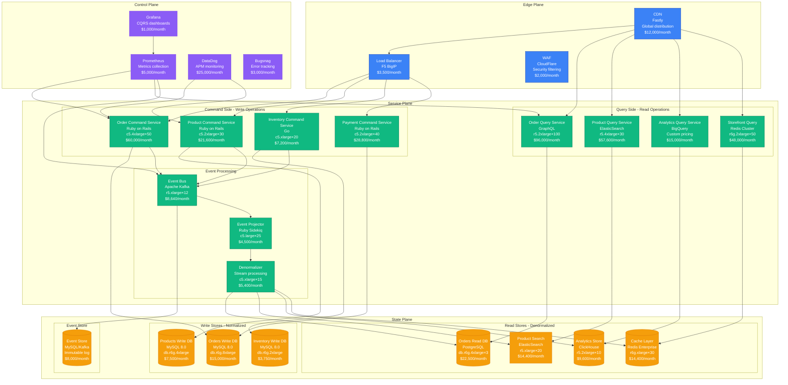
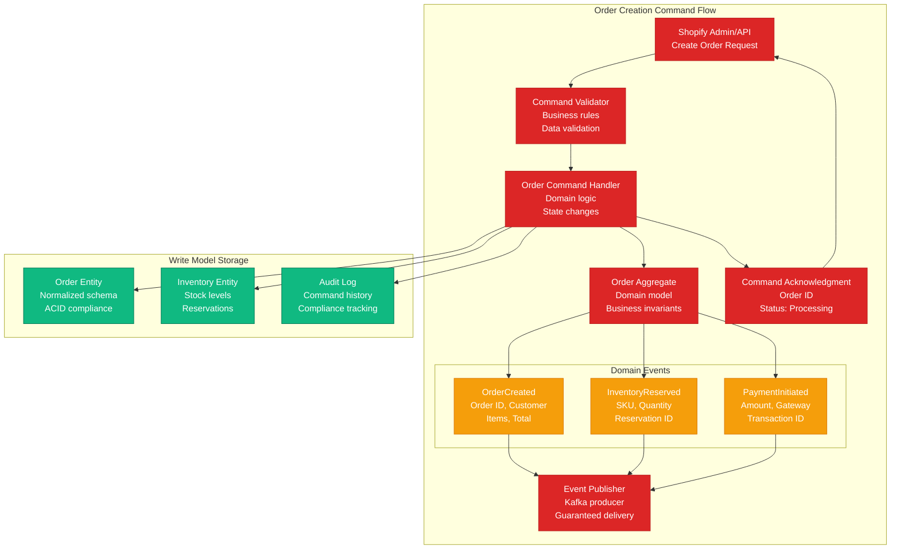
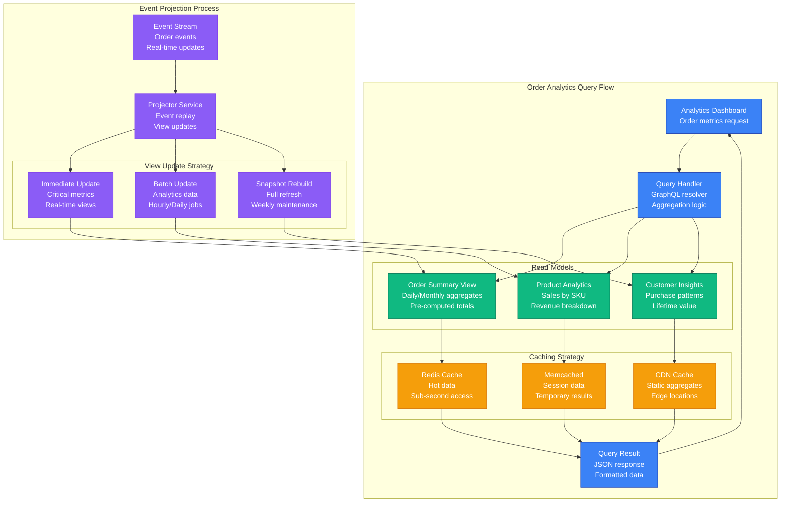
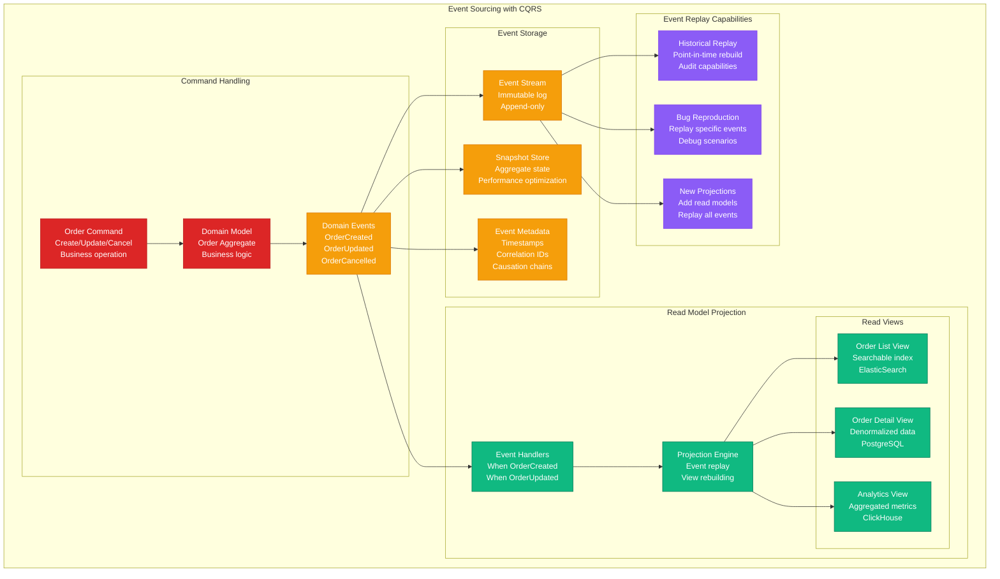

# CQRS Pattern: Shopify's Implementation

## Pattern Overview

Shopify implements Command Query Responsibility Segregation (CQRS) to handle **5 million+ stores** and **billions of transactions** annually, separating read and write operations across different data models optimized for their specific use cases.

## Production Implementation Architecture



## Command Processing Flow



## Query Processing Flow



## Event Sourcing Integration



## Production Metrics & Performance

### Scale Numbers (2024)
- **Total Stores**: 5+ million active stores
- **Orders Processed**: 3 billion+ annually
- **Command Throughput**: 100,000 commands/second peak
- **Query Throughput**: 2 million queries/second peak
- **Read Model Lag**: <100ms average from event to query availability
- **Command Response Time**: <50ms p99

### Cost Breakdown (Monthly)
```
Command Services:           $117,600
Query Services:            $216,600
Event Processing:           $18,540
Write Databases:            $26,250
Read Databases:             $60,900
Event Store:                $8,000
Caching Layer:              $14,400
Monitoring & Alerting:      $34,000
CDN & Load Balancing:       $17,500
------------------------
Total Monthly Cost:        $513,790
Cost per Order:            $0.002
```

### Business Impact
- **Query Performance**: 10x faster than normalized database queries
- **Write Scalability**: Independent scaling of read/write workloads
- **Development Velocity**: 40% faster feature development
- **System Availability**: 99.99% uptime for both read and write operations

## Configuration Examples

### Command Handler Implementation
```ruby
# app/commands/orders/create_order_command.rb
class Orders::CreateOrderCommand
  include ActiveModel::Model
  include ActiveModel::Validations

  attr_accessor :customer_id, :line_items, :shipping_address, :billing_address

  validates :customer_id, presence: true
  validates :line_items, presence: true, length: { minimum: 1 }
  validate :sufficient_inventory

  def execute
    return false unless valid?

    ActiveRecord::Base.transaction do
      order = create_order_aggregate
      events = order.handle_create_command(self)

      persist_order(order)
      publish_events(events)

      CommandResult.success(order_id: order.id)
    end
  rescue => e
    CommandResult.failure(error: e.message)
  end

  private

  def create_order_aggregate
    Order.new(
      customer_id: customer_id,
      status: 'pending',
      created_at: Time.current
    )
  end

  def persist_order(order)
    # Write to normalized database
    OrderWriteModel.create!(
      id: order.id,
      customer_id: order.customer_id,
      status: order.status,
      total_amount: order.total_amount,
      created_at: order.created_at
    )

    order.line_items.each do |item|
      LineItemWriteModel.create!(
        order_id: order.id,
        product_id: item.product_id,
        quantity: item.quantity,
        price: item.price
      )
    end
  end

  def publish_events(events)
    events.each do |event|
      EventBus.publish(
        topic: event.class.name.underscore,
        event: event.to_h,
        metadata: {
          correlation_id: SecureRandom.uuid,
          timestamp: Time.current.iso8601,
          version: event.version
        }
      )
    end
  end

  def sufficient_inventory
    line_items.each do |item|
      available = InventoryService.available_quantity(item.product_id)
      if available < item.quantity
        errors.add(:line_items, "Insufficient inventory for product #{item.product_id}")
      end
    end
  end
end
```

### Query Handler Implementation
```ruby
# app/queries/orders/order_analytics_query.rb
class Orders::OrderAnalyticsQuery
  include ActiveModel::Model

  attr_accessor :store_id, :date_range, :group_by, :filters

  def execute
    cached_result || compute_and_cache_result
  end

  private

  def cached_result
    cache_key = generate_cache_key
    Rails.cache.read(cache_key)
  end

  def compute_and_cache_result
    result = case group_by
    when 'day'
      daily_order_metrics
    when 'product'
      product_performance_metrics
    when 'customer_segment'
      customer_segment_metrics
    else
      overall_metrics
    end

    Rails.cache.write(generate_cache_key, result, expires_in: cache_ttl)
    result
  end

  def daily_order_metrics
    # Query denormalized read model
    OrderAnalyticsReadModel
      .where(store_id: store_id)
      .where(date: date_range)
      .group(:date)
      .select(
        :date,
        'SUM(order_count) as total_orders',
        'SUM(revenue) as total_revenue',
        'AVG(average_order_value) as avg_order_value'
      )
  end

  def product_performance_metrics
    ProductAnalyticsReadModel
      .joins(:store)
      .where(store_id: store_id)
      .where(date: date_range)
      .group(:product_id, :product_name)
      .order('total_revenue DESC')
      .limit(50)
      .select(
        :product_id,
        :product_name,
        'SUM(quantity_sold) as units_sold',
        'SUM(revenue) as total_revenue',
        'AVG(conversion_rate) as avg_conversion_rate'
      )
  end

  def cache_ttl
    case group_by
    when 'day'
      1.hour    # Daily metrics cached for 1 hour
    when 'product'
      30.minutes # Product metrics cached for 30 minutes
    else
      15.minutes # Other metrics cached for 15 minutes
    end
  end

  def generate_cache_key
    "order_analytics:#{store_id}:#{date_range.hash}:#{group_by}:#{filters.hash}"
  end
end
```

### Event Projection Implementation
```ruby
# app/projectors/order_analytics_projector.rb
class OrderAnalyticsProjector
  def self.handle_order_created(event)
    date = Date.parse(event[:created_at])

    analytics_record = OrderAnalyticsReadModel.find_or_initialize_by(
      store_id: event[:store_id],
      date: date
    )

    analytics_record.assign_attributes(
      order_count: analytics_record.order_count + 1,
      revenue: analytics_record.revenue + event[:total_amount],
      average_order_value: calculate_average_order_value(analytics_record),
      updated_at: Time.current
    )

    analytics_record.save!

    # Update real-time dashboard
    ActionCable.server.broadcast(
      "store_analytics_#{event[:store_id]}",
      {
        type: 'order_created',
        date: date.iso8601,
        new_totals: {
          order_count: analytics_record.order_count,
          revenue: analytics_record.revenue,
          average_order_value: analytics_record.average_order_value
        }
      }
    )
  end

  def self.handle_order_cancelled(event)
    date = Date.parse(event[:created_at])

    analytics_record = OrderAnalyticsReadModel.find_by(
      store_id: event[:store_id],
      date: date
    )

    return unless analytics_record

    analytics_record.assign_attributes(
      order_count: analytics_record.order_count - 1,
      revenue: analytics_record.revenue - event[:total_amount],
      average_order_value: calculate_average_order_value(analytics_record),
      cancellation_count: analytics_record.cancellation_count + 1,
      updated_at: Time.current
    )

    analytics_record.save!
  end

  private

  def self.calculate_average_order_value(record)
    return 0 if record.order_count.zero?
    record.revenue / record.order_count
  end
end
```

## Failure Scenarios & Recovery

### Scenario 1: Read Model Lag
```
Problem: Event processing delays cause stale read models
Impact: Analytics show outdated data for 30+ minutes
MTTR: 10 minutes (restart projectors + catch up)
Recovery:
1. Restart event processors (2 minutes)
2. Enable catch-up processing (5 minutes)
3. Validate data consistency (3 minutes)
Prevention: Monitor event lag, auto-scaling projectors
```

### Scenario 2: Event Store Failure
```
Problem: Kafka cluster failure prevents event publishing
Impact: New commands cannot be processed
MTTR: 5 minutes (failover to backup region)
Recovery:
1. Detect failure via health checks (30 seconds)
2. Route traffic to DR region (2 minutes)
3. Restore primary cluster (2.5 minutes)
Prevention: Multi-region event store, automatic failover
```

### Scenario 3: Command Side Database Outage
```
Problem: MySQL write database becomes unavailable
Impact: Cannot process new orders, payments
MTTR: 3 minutes (promote read replica)
Recovery:
1. Promote read replica to primary (90 seconds)
2. Update connection strings (60 seconds)
3. Resume command processing (30 seconds)
Prevention: Multi-AZ deployment, automated failover
```

## Production Incidents & Lessons

### Incident: Read Model Corruption (March 2024)
**Problem**: Bug in projector corrupted analytics aggregates
**Impact**: Wrong revenue reports for 2 hours affecting 10K stores
**Root Cause**: Race condition in concurrent event processing
**Resolution**: Rolled back projector, rebuilt read models from events
**Prevention**: Added event ordering guarantees, idempotent projections

### Incident: Event Replay Performance (July 2024)
**Problem**: Adding new read model caused 6-hour event replay
**Impact**: All analytics queries showed stale data
**Root Cause**: Inefficient event batching during replay
**Resolution**: Implemented parallel replay with checkpointing
**Prevention**: Optimized replay algorithms, pre-built read models

## Monitoring & Alerting

### Critical Metrics
```yaml
# DataDog monitoring configuration
cqrs_command_latency:
  metric: cqrs.command.duration.p99
  threshold: 100ms
  alert: PagerDuty Critical

cqrs_event_lag:
  metric: cqrs.event.processing_lag
  threshold: 5 minutes
  alert: PagerDuty High Priority

cqrs_read_model_freshness:
  metric: cqrs.read_model.last_update
  threshold: 10 minutes
  alert: Slack Warning

cqrs_query_performance:
  metric: cqrs.query.duration.p95
  threshold: 200ms
  alert: DataDog Dashboard
```

### Production Runbooks
```bash
# Event replay for corrupted read model
./scripts/event_replay.rb --read-model OrderAnalytics --from 2024-01-01 --to 2024-01-31

# Validate read model consistency
./scripts/validate_read_models.rb --model OrderAnalytics --sample-size 1000

# Emergency command processing bypass
./scripts/emergency_bypass.rb --route-commands-to dr-region --duration 30m
```

## Real-World Performance Data

### Command Processing Performance
```
Simple Commands (Create Order):     p99 < 50ms
Complex Commands (Bulk Update):     p99 < 200ms
Command Validation:                 p99 < 10ms
Event Publishing:                   p99 < 25ms
```

### Query Performance by Complexity
```
Simple Queries (Order Details):     p99 < 10ms
Aggregate Queries (Daily Totals):   p99 < 50ms
Complex Analytics:                  p99 < 200ms
Cross-Store Analytics:              p99 < 500ms
```

### Event Processing Throughput
```
Event Publishing Rate:              1M events/minute peak
Event Processing Rate:              800K events/minute sustained
Projection Update Latency:         p99 < 100ms
Read Model Refresh Rate:            Real-time to 1 hour depending on criticality
```

This CQRS implementation enables Shopify to maintain high performance across both command and query operations while handling massive scale, with the flexibility to optimize each side independently for their specific use cases.