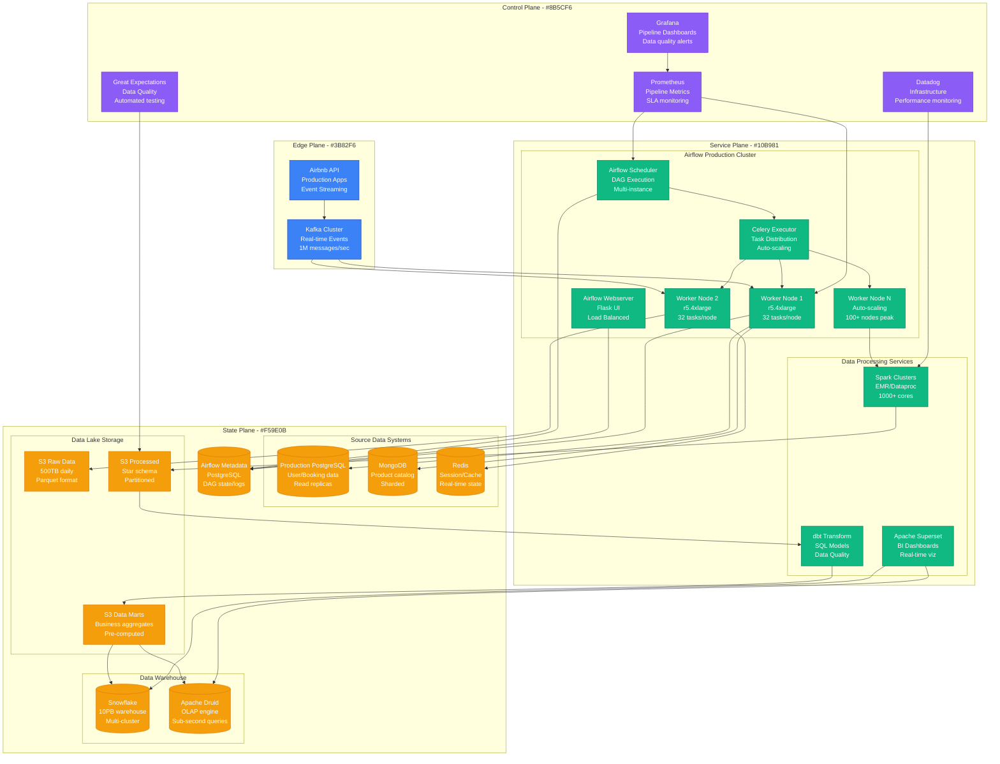
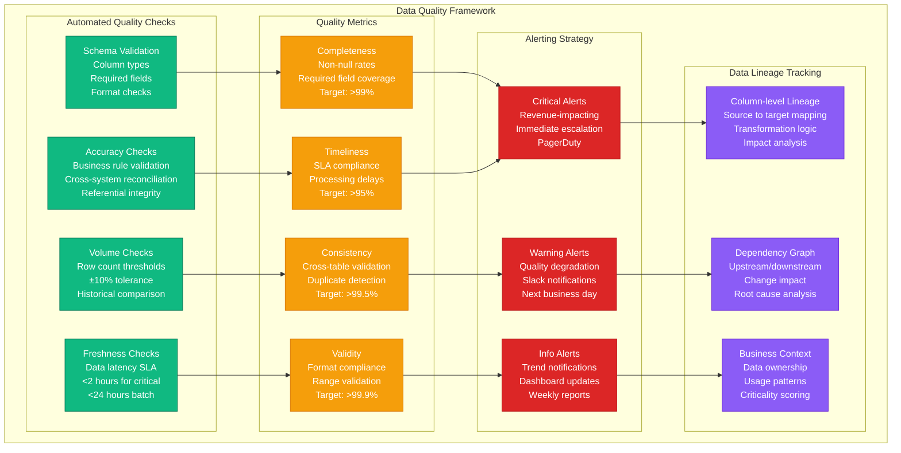

# Data Pipeline: Airbnb's Airflow

## Overview

Airbnb processes 500TB of data daily through Apache Airflow, orchestrating 15,000+ DAGs across data ingestion, ETL, ML model training, and business intelligence. Their data platform serves 2,000+ data scientists and analysts with sub-minute latency for critical business metrics.

## Production Architecture



## DAG Structure and Dependencies

```mermaid
graph TB
    subgraph DailyETL[Daily ETL Pipeline DAG]
        START[Start DAG<br/>00:00 UTC<br/>Daily schedule]

        subgraph DataIngestion[Data Ingestion Layer]
            EXTRACT_USERS[Extract Users<br/>PostgreSQL → S3<br/>Incremental]
            EXTRACT_BOOKINGS[Extract Bookings<br/>MongoDB → S3<br/>Daily partition]
            EXTRACT_EVENTS[Extract Events<br/>Kafka → S3<br/>Hourly batches]
        end

        subgraph DataValidation[Data Quality Checks]
            VALIDATE_USERS[Validate Users<br/>Great Expectations<br/>Schema + Volume]
            VALIDATE_BOOKINGS[Validate Bookings<br/>Data completeness<br/>Business rules]
            VALIDATE_EVENTS[Validate Events<br/>JSON schema<br/>Missing fields]
        end

        subgraph DataTransformation[Data Transformation]
            CLEAN_USERS[Clean Users<br/>Spark job<br/>PII handling]
            ENRICH_BOOKINGS[Enrich Bookings<br/>Join with location<br/>Currency conversion]
            AGGREGATE_EVENTS[Aggregate Events<br/>User sessions<br/>Funnel metrics]
        end

        subgraph DataModeling[Data Modeling (dbt)]
            DIM_USERS[dim_users<br/>SCD Type 2<br/>User attributes]
            DIM_LISTINGS[dim_listings<br/>Property details<br/>Location hierarchy]
            FACT_BOOKINGS[fact_bookings<br/>Transaction grain<br/>Revenue metrics]
            MART_REVENUE[mart_revenue<br/>Business KPIs<br/>Daily aggregates]
        end

        subgraph DataQuality[Final Quality Gates]
            QA_METRICS[QA Metrics<br/>Row counts<br/>Revenue reconciliation]
            BUSINESS_TESTS[Business Tests<br/>KPI validation<br/>Anomaly detection]
        end

        NOTIFY[Slack Notification<br/>Pipeline success<br/>Data freshness]
    end

    START --> EXTRACT_USERS
    START --> EXTRACT_BOOKINGS
    START --> EXTRACT_EVENTS

    EXTRACT_USERS --> VALIDATE_USERS
    EXTRACT_BOOKINGS --> VALIDATE_BOOKINGS
    EXTRACT_EVENTS --> VALIDATE_EVENTS

    VALIDATE_USERS --> CLEAN_USERS
    VALIDATE_BOOKINGS --> ENRICH_BOOKINGS
    VALIDATE_EVENTS --> AGGREGATE_EVENTS

    CLEAN_USERS --> DIM_USERS
    ENRICH_BOOKINGS --> DIM_LISTINGS
    ENRICH_BOOKINGS --> FACT_BOOKINGS
    AGGREGATE_EVENTS --> FACT_BOOKINGS

    DIM_USERS --> MART_REVENUE
    DIM_LISTINGS --> MART_REVENUE
    FACT_BOOKINGS --> MART_REVENUE

    MART_REVENUE --> QA_METRICS
    MART_REVENUE --> BUSINESS_TESTS

    QA_METRICS --> NOTIFY
    BUSINESS_TESTS --> NOTIFY

    classDef startStyle fill:#3B82F6,stroke:#1E40AF,color:#fff
    classDef ingestStyle fill:#10B981,stroke:#047857,color:#fff
    classDef validateStyle fill:#F59E0B,stroke:#D97706,color:#fff
    classDef transformStyle fill:#8B5CF6,stroke:#6D28D9,color:#fff
    classDef modelStyle fill:#DC2626,stroke:#B91C1C,color:#fff
    classDef qaStyle fill:#059669,stroke:#047857,color:#fff
    classDef notifyStyle fill:#6366F1,stroke:#4F46E5,color:#fff

    class START startStyle
    class EXTRACT_USERS,EXTRACT_BOOKINGS,EXTRACT_EVENTS ingestStyle
    class VALIDATE_USERS,VALIDATE_BOOKINGS,VALIDATE_EVENTS validateStyle
    class CLEAN_USERS,ENRICH_BOOKINGS,AGGREGATE_EVENTS transformStyle
    class DIM_USERS,DIM_LISTINGS,FACT_BOOKINGS,MART_REVENUE modelStyle
    class QA_METRICS,BUSINESS_TESTS qaStyle
    class NOTIFY notifyStyle
```

## Real-time ML Pipeline

```mermaid
graph TB
    subgraph MLPipeline[ML Model Training Pipeline]
        subgraph FeatureEngineering[Feature Engineering]
            FEATURE_STORE[Feature Store<br/>Feast/Tecton<br/>Online/Offline]
            USER_FEATURES[User Features<br/>Booking history<br/>Preferences<br/>Demographics]
            LISTING_FEATURES[Listing Features<br/>Price trends<br/>Availability<br/>Reviews]
            INTERACTION_FEATURES[Interaction Features<br/>Search patterns<br/>Click-through<br/>Conversion rates]
        end

        subgraph ModelTraining[Model Training]
            RANKING_MODEL[Ranking Model<br/>XGBoost<br/>Search relevance]
            PRICING_MODEL[Pricing Model<br/>Neural Network<br/>Dynamic pricing]
            FRAUD_MODEL[Fraud Model<br/>Random Forest<br/>Anomaly detection]
        end

        subgraph ModelDeployment[Model Deployment]
            MODEL_REGISTRY[Model Registry<br/>MLflow<br/>Version control]
            AB_TESTING[A/B Testing<br/>Feature flags<br/>Gradual rollout]
            SERVING[Model Serving<br/>TensorFlow Serving<br/>Real-time inference]
        end

        subgraph ModelMonitoring[Model Monitoring]
            DRIFT_DETECTION[Data Drift<br/>Feature distribution<br/>Concept drift]
            PERFORMANCE_TRACKING[Performance Tracking<br/>Precision/Recall<br/>Business metrics]
            RETRAINING[Automated Retraining<br/>Performance threshold<br/>Weekly schedule]
        end
    end

    FEATURE_STORE --> USER_FEATURES
    FEATURE_STORE --> LISTING_FEATURES
    FEATURE_STORE --> INTERACTION_FEATURES

    USER_FEATURES --> RANKING_MODEL
    LISTING_FEATURES --> PRICING_MODEL
    INTERACTION_FEATURES --> FRAUD_MODEL

    RANKING_MODEL --> MODEL_REGISTRY
    PRICING_MODEL --> MODEL_REGISTRY
    FRAUD_MODEL --> MODEL_REGISTRY

    MODEL_REGISTRY --> AB_TESTING
    AB_TESTING --> SERVING

    SERVING --> DRIFT_DETECTION
    SERVING --> PERFORMANCE_TRACKING
    PERFORMANCE_TRACKING --> RETRAINING
    RETRAINING --> MODEL_REGISTRY

    classDef featureStyle fill:#10B981,stroke:#047857,color:#fff
    classDef modelStyle fill:#F59E0B,stroke:#D97706,color:#fff
    classDef deployStyle fill:#8B5CF6,stroke:#6D28D9,color:#fff
    classDef monitorStyle fill:#DC2626,stroke:#B91C1C,color:#fff

    class FEATURE_STORE,USER_FEATURES,LISTING_FEATURES,INTERACTION_FEATURES featureStyle
    class RANKING_MODEL,PRICING_MODEL,FRAUD_MODEL modelStyle
    class MODEL_REGISTRY,AB_TESTING,SERVING deployStyle
    class DRIFT_DETECTION,PERFORMANCE_TRACKING,RETRAINING monitorStyle
```



## Data Quality and Monitoring



## Production Metrics

### Pipeline Performance
- **DAGs Executed Daily**: 15,000+ DAGs
- **Task Success Rate**: 99.7%
- **Average Task Duration**: 4.2 minutes
- **Peak Concurrent Tasks**: 8,000 tasks

### Data Volume and Latency
- **Daily Data Ingestion**: 500TB raw data
- **Processed Data Output**: 200TB transformed
- **End-to-end Latency**: 45 minutes (critical paths)
- **Real-time Stream Latency**: 30 seconds

### Resource Utilization
- **Airflow Worker Nodes**: 100+ auto-scaling
- **Spark Cluster Cores**: 1,000+ peak usage
- **Storage Costs**: $50K/month (S3 + Snowflake)
- **Compute Costs**: $80K/month (EMR + workers)

## Implementation Details

### Airflow DAG Configuration
```python
from airflow import DAG
from airflow.operators.python_operator import PythonOperator
from airflow.operators.bash_operator import BashOperator
from datetime import datetime, timedelta

default_args = {
    'owner': 'data-platform',
    'depends_on_past': False,
    'start_date': datetime(2024, 1, 1),
    'email_on_failure': True,
    'email_on_retry': False,
    'retries': 2,
    'retry_delay': timedelta(minutes=5),
    'max_active_runs': 1
}

dag = DAG(
    'daily_etl_pipeline',
    default_args=default_args,
    description='Daily ETL for core business metrics',
    schedule_interval='0 1 * * *',  # 1 AM UTC
    catchup=False,
    max_active_runs=1,
    tags=['etl', 'daily', 'critical']
)

# Extract task with retry logic
extract_bookings = PythonOperator(
    task_id='extract_bookings',
    python_callable=extract_bookings_data,
    pool='database_pool',
    dag=dag
)

# Data quality check
validate_bookings = PythonOperator(
    task_id='validate_bookings',
    python_callable=run_great_expectations,
    op_kwargs={'expectation_suite': 'bookings_suite'},
    dag=dag
)

# Spark transformation
transform_bookings = BashOperator(
    task_id='transform_bookings',
    bash_command='''
    spark-submit \
      --master yarn \
      --deploy-mode cluster \
      --num-executors 50 \
      --executor-memory 4g \
      --executor-cores 2 \
      /opt/airflow/dags/transforms/booking_transform.py \
      --input-date {{ ds }}
    ''',
    dag=dag
)

extract_bookings >> validate_bookings >> transform_bookings
```

### Data Quality with Great Expectations
```python
import great_expectations as ge

def create_bookings_expectations():
    suite = ge.DataContext().create_expectation_suite(
        "bookings_daily_suite"
    )

    # Volume expectations
    suite.expect_table_row_count_to_be_between(
        min_value=10000,  # Minimum daily bookings
        max_value=100000  # Maximum realistic bookings
    )

    # Completeness expectations
    suite.expect_column_values_to_not_be_null("booking_id")
    suite.expect_column_values_to_not_be_null("user_id")
    suite.expect_column_values_to_not_be_null("listing_id")

    # Business rule expectations
    suite.expect_column_values_to_be_between(
        column="booking_amount",
        min_value=10,     # Minimum booking amount
        max_value=50000   # Maximum reasonable booking
    )

    # Timeliness expectations
    suite.expect_column_values_to_be_dateutil_parseable("created_at")
    suite.expect_column_max_to_be_between(
        column="created_at",
        min_value=datetime.now() - timedelta(days=1),
        max_value=datetime.now()
    )

    return suite
```

### Monitoring and Alerting
```yaml
# Prometheus configuration for Airflow
- job_name: 'airflow'
  static_configs:
    - targets: ['airflow-webserver:8080']
  metrics_path: '/admin/metrics'

# Alert rules
groups:
  - name: airflow_alerts
    rules:
      - alert: DAGFailureRate
        expr: (airflow_dag_run_failed_total / airflow_dag_run_total) > 0.05
        for: 5m
        labels:
          severity: critical
        annotations:
          summary: "High DAG failure rate: {{ $value }}%"

      - alert: TaskQueueBacklog
        expr: airflow_executor_queued_tasks > 1000
        for: 10m
        labels:
          severity: warning
        annotations:
          summary: "High task queue backlog: {{ $value }} tasks"

      - alert: DataFreshnessSLA
        expr: (time() - airflow_dag_run_last_success_timestamp) > 7200
        for: 5m
        labels:
          severity: critical
        annotations:
          summary: "Data freshness SLA breach for {{ $labels.dag_id }}"
```

## Cost Analysis

### Infrastructure Costs
- **Airflow Infrastructure**: $15K/month (workers + scheduler)
- **Spark Clusters**: $50K/month (EMR auto-scaling)
- **Storage (S3 + Snowflake)**: $80K/month
- **Monitoring Stack**: $5K/month
- **Total Monthly**: $150K

### Operational Costs
- **Data Engineering Team**: $200K/month (10 engineers)
- **On-call Support**: $30K/month
- **Training and Tools**: $10K/month
- **Total Operational**: $240K/month

### ROI Calculation
- **Data-driven Decision Value**: $50M/year revenue impact
- **Operational Efficiency**: $20M/year cost savings
- **Reduced Manual Work**: $10M/year productivity gains
- **Compliance and Governance**: $5M/year risk mitigation

## Battle-tested Lessons

### What Works at 3 AM
1. **Comprehensive Monitoring**: Know about failures before users do
2. **Automated Recovery**: 70% of transient failures self-heal
3. **Clear Data Lineage**: Find root cause in minutes, not hours
4. **Circuit Breakers**: Prevent cascade failures in data pipelines

### Common Data Pipeline Failures
1. **Schema Evolution**: Upstream changes break downstream jobs
2. **Resource Contention**: Peak hour competition for compute
3. **Data Quality Issues**: Silent corruption propagates downstream
4. **Dependency Hell**: Complex DAG dependencies create bottlenecks

### Operational Best Practices
1. **Idempotent Tasks**: Safe to retry and rerun
2. **Incremental Processing**: Process only changed data
3. **Resource Pooling**: Prevent resource starvation
4. **Graceful Degradation**: Essential vs nice-to-have metrics

## Advanced Patterns

### Stream Processing Integration
```python
# Kafka to Airflow trigger
from airflow.sensors.s3_key_sensor import S3KeySensor

wait_for_events = S3KeySensor(
    task_id='wait_for_hourly_events',
    bucket_name='airbnb-events',
    bucket_key='events/dt={{ ds }}/hour={{ next_execution_date.hour }}/_SUCCESS',
    timeout=3600,
    poke_interval=300,
    dag=dag
)
```

### Dynamic DAG Generation
```python
# Generate DAGs for multiple regions
REGIONS = ['us-east-1', 'eu-west-1', 'ap-southeast-1']

for region in REGIONS:
    dag_id = f'regional_etl_{region}'

    globals()[dag_id] = DAG(
        dag_id,
        default_args=default_args,
        schedule_interval='0 2 * * *',
        tags=['regional', region]
    )
```

## Related Patterns
- [Event-Driven Architecture](./event-driven-architecture.md)
- [Lambda Architecture](./lambda-architecture.md)
- [Data Lake](./data-lake.md)

*Source: Airbnb Engineering Blog, Apache Airflow Documentation, Personal Production Experience, Data Engineering Conferences*