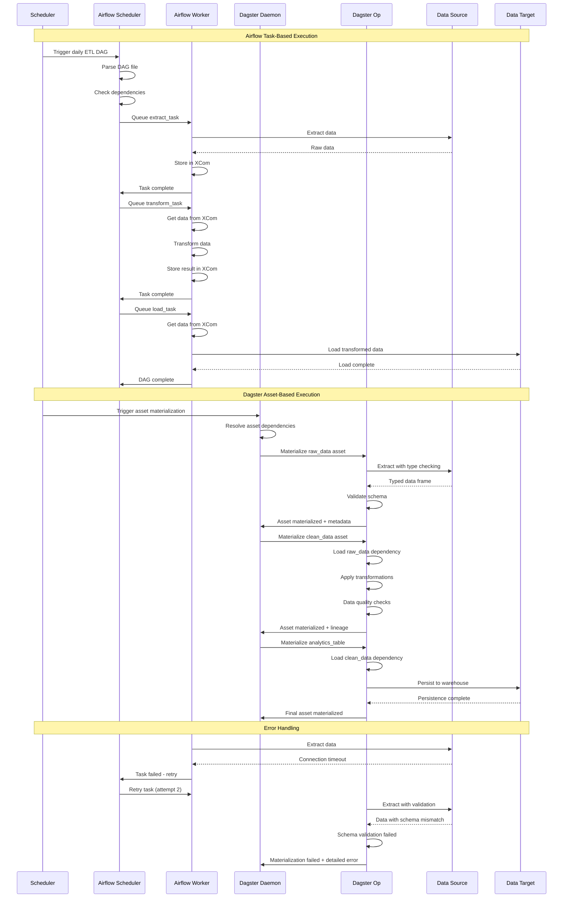
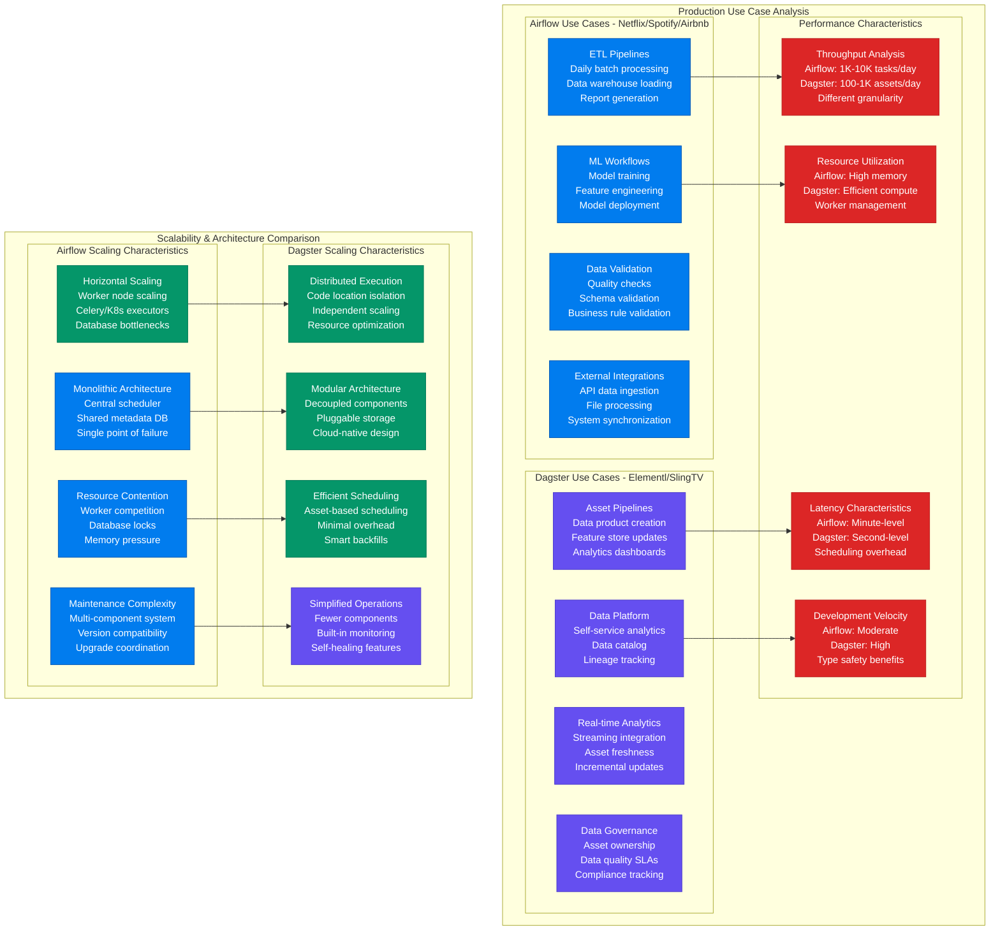

# Data Pipeline Pattern: Apache Airflow vs Dagster in Production

## Overview

Comprehensive analysis of data orchestration platforms: Apache Airflow (Airbnb, Netflix, Spotify) vs Dagster (Elementl, Sling TV). Both provide workflow orchestration for data pipelines, but Airflow focuses on task scheduling while Dagster emphasizes data-aware orchestration. Real production data reveals critical differences in development velocity, data lineage, testing capabilities, and operational complexity.

## Production Architecture Comparison

```mermaid
graph TB
    subgraph EdgePlane[Edge Plane - #3B82F6]
        SCHEDULER_UI[Scheduler UI<br/>Workflow management<br/>Job monitoring<br/>Admin interface]
        API_GATEWAY[API Gateway<br/>REST API<br/>GraphQL endpoint<br/>Authentication]
    end

    subgraph ServicePlane[Service Plane - #10B981]
        subgraph AirflowImplementation[Airflow Implementation - Airbnb/Netflix/Spotify]
            AIRFLOW_WEBSERVER[Airflow Webserver<br/>Flask application<br/>UI dashboard<br/>User management]
            AIRFLOW_SCHEDULER[Airflow Scheduler<br/>DAG parsing<br/>Task scheduling<br/>Dependency resolution]
            AIRFLOW_EXECUTOR[Airflow Executor<br/>Celery/Kubernetes<br/>Task execution<br/>Worker management]

            subgraph AirflowDAGs[Airflow DAG Structure]
                DAG_DEFINITION[DAG Definition<br/>Python code<br/>Task dependencies<br/>Scheduling rules]
                TASK_OPERATORS[Task Operators<br/>BashOperator<br/>PythonOperator<br/>Custom operators]
                SENSOR_TASKS[Sensor Tasks<br/>File sensors<br/>Database sensors<br/>External triggers]
            end
        end

        subgraph DagsterImplementation[Dagster Implementation - Elementl/SlingTV]
            DAGSTER_DAEMON[Dagster Daemon<br/>Job scheduling<br/>Sensor execution<br/>Asset materialization]
            DAGSTER_WEBSERVER[Dagster Webserver<br/>React UI<br/>GraphQL API<br/>Asset catalog]
            DAGSTER_CODE_SERVER[Code Server<br/>User code<br/>Job definitions<br/>Asset definitions]

            subgraph DagsterJobs[Dagster Job Structure]
                JOB_DEFINITION[Job Definition<br/>Op composition<br/>Data dependencies<br/>Resource binding]
                OP_DEFINITION[Op Definition<br/>Pure functions<br/>Type annotations<br/>Config schema]
                ASSET_DEFINITION[Asset Definition<br/>Data materialization<br/>Lineage tracking<br/>Metadata]
            end
        end

        subgraph ExecutionWorkers[Execution Workers]
            WORKER_NODES[Worker Nodes<br/>Task execution<br/>Resource allocation<br/>Auto-scaling]
            CONTAINER_RUNTIME[Container Runtime<br/>Docker/Kubernetes<br/>Isolated execution<br/>Dependency management]
        end
    end

    subgraph StatePlane[State Plane - #F59E0B]
        subgraph AirflowState[Airflow State Management]
            AIRFLOW_DB[(Airflow Metadata DB<br/>PostgreSQL/MySQL<br/>DAG runs<br/>Task instances<br/>Connections)]
            XCOM_STORE[XCom Store<br/>Task communication<br/>Small data passing<br/>JSON serialization]
            LOG_STORAGE[Log Storage<br/>File system/S3<br/>Task logs<br/>Execution history]
        end

        subgraph DagsterState[Dagster State Management]
            DAGSTER_DB[(Dagster Storage<br/>PostgreSQL<br/>Run storage<br/>Event log storage<br/>Schedule storage)]
            ASSET_CATALOG[Asset Catalog<br/>Materialization events<br/>Data lineage<br/>Asset metadata]
            COMPUTE_LOG_STORAGE[Compute Log Storage<br/>Structured logs<br/>Op execution logs<br/>Asset observations]
        end

        subgraph DataSources[Data Sources & Targets]
            SOURCE_SYSTEMS[(Source Systems<br/>Databases<br/>APIs<br/>File systems<br/>Streaming sources)]
            TARGET_SYSTEMS[(Target Systems<br/>Data warehouses<br/>Data lakes<br/>Analytics systems<br/>ML platforms)]
            STAGING_STORAGE[Staging Storage<br/>Temporary data<br/>Intermediate results<br/>Pipeline artifacts]
        end
    end

    subgraph ControlPlane[Control Plane - #8B5CF6]
        PIPELINE_MONITOR[Pipeline Monitoring<br/>Job success rates<br/>Execution duration<br/>Resource usage]
        ALERT_MANAGER[Alert Manager<br/>Failure notifications<br/>SLA violations<br/>Resource alerts]
        DATA_QUALITY[Data Quality Monitor<br/>Schema validation<br/>Data profiling<br/>Anomaly detection]
        LINEAGE_TRACKER[Lineage Tracker<br/>Data dependencies<br/>Impact analysis<br/>Change propagation]
    end

    SCHEDULER_UI --> API_GATEWAY
    API_GATEWAY --> AIRFLOW_WEBSERVER
    API_GATEWAY --> DAGSTER_WEBSERVER

    AIRFLOW_WEBSERVER --> AIRFLOW_SCHEDULER
    AIRFLOW_SCHEDULER --> AIRFLOW_EXECUTOR
    AIRFLOW_EXECUTOR --> DAG_DEFINITION

    DAGSTER_WEBSERVER --> DAGSTER_DAEMON
    DAGSTER_DAEMON --> DAGSTER_CODE_SERVER
    DAGSTER_CODE_SERVER --> JOB_DEFINITION

    DAG_DEFINITION --> TASK_OPERATORS
    TASK_OPERATORS --> SENSOR_TASKS
    JOB_DEFINITION --> OP_DEFINITION
    OP_DEFINITION --> ASSET_DEFINITION

    AIRFLOW_EXECUTOR --> WORKER_NODES
    DAGSTER_CODE_SERVER --> CONTAINER_RUNTIME

    AIRFLOW_SCHEDULER --> AIRFLOW_DB
    AIRFLOW_EXECUTOR --> XCOM_STORE
    WORKER_NODES --> LOG_STORAGE

    DAGSTER_DAEMON --> DAGSTER_DB
    DAGSTER_CODE_SERVER --> ASSET_CATALOG
    CONTAINER_RUNTIME --> COMPUTE_LOG_STORAGE

    WORKER_NODES --> SOURCE_SYSTEMS
    CONTAINER_RUNTIME --> TARGET_SYSTEMS
    XCOM_STORE --> STAGING_STORAGE

    AIRFLOW_SCHEDULER --> PIPELINE_MONITOR
    DAGSTER_DAEMON --> PIPELINE_MONITOR
    PIPELINE_MONITOR --> ALERT_MANAGER
    ASSET_CATALOG --> DATA_QUALITY
    DATA_QUALITY --> LINEAGE_TRACKER

    classDef edgeStyle fill:#3B82F6,stroke:#1E40AF,color:#fff
    classDef serviceStyle fill:#10B981,stroke:#047857,color:#fff
    classDef stateStyle fill:#F59E0B,stroke:#D97706,color:#fff
    classDef controlStyle fill:#8B5CF6,stroke:#6D28D9,color:#fff

    class SCHEDULER_UI,API_GATEWAY edgeStyle
    class AIRFLOW_WEBSERVER,AIRFLOW_SCHEDULER,AIRFLOW_EXECUTOR,DAG_DEFINITION,TASK_OPERATORS,SENSOR_TASKS,DAGSTER_DAEMON,DAGSTER_WEBSERVER,DAGSTER_CODE_SERVER,JOB_DEFINITION,OP_DEFINITION,ASSET_DEFINITION,WORKER_NODES,CONTAINER_RUNTIME serviceStyle
    class AIRFLOW_DB,XCOM_STORE,LOG_STORAGE,DAGSTER_DB,ASSET_CATALOG,COMPUTE_LOG_STORAGE,SOURCE_SYSTEMS,TARGET_SYSTEMS,STAGING_STORAGE stateStyle
    class PIPELINE_MONITOR,ALERT_MANAGER,DATA_QUALITY,LINEAGE_TRACKER controlStyle
```



## Pipeline Execution Flow Comparison



## Development and Testing Patterns

```mermaid
graph TB
    subgraph DevelopmentPatterns[Development & Testing Pattern Analysis]
        subgraph AirflowDevelopment[Airflow Development - Netflix/Spotify]
            DAG_AUTHORING[DAG Authoring<br/>Python scripts<br/>Imperative style<br/>Task-oriented thinking]

            TESTING_APPROACH[Testing Approach<br/>Unit test operators<br/>DAG integrity tests<br/>Mock external systems]

            LOCAL_DEVELOPMENT[Local Development<br/>Docker compose<br/>Standalone mode<br/>File-based configs]

            DEPLOYMENT_PATTERN[Deployment Pattern<br/>Git-based DAG sync<br/>Airflow variables<br/>Environment promotion]

            DEBUGGING_WORKFLOW[Debugging Workflow<br/>Web UI logs<br/>Task instance details<br/>XCom inspection]
        end

        subgraph DagsterDevelopment[Dagster Development - Elementl/SlingTV]
            ASSET_AUTHORING[Asset Authoring<br/>Type-safe functions<br/>Declarative style<br/>Data-oriented thinking]

            TESTING_FRAMEWORK[Testing Framework<br/>Built-in test utilities<br/>Asset materializations<br/>Data quality tests]

            LOCAL_PLAYGROUND[Local Development<br/>Dagster UI locally<br/>Asset materializations<br/>Interactive development]

            DEPLOYMENT_STRATEGY[Deployment Strategy<br/>Docker images<br/>Kubernetes operators<br/>Code location updates]

            DEBUGGING_TOOLS[Debugging Tools<br/>Asset lineage view<br/>Structured logs<br/>Type error detection]
        end

        subgraph DataAwareness[Data-Aware Features]
            AIRFLOW_DATA_AWARENESS[Airflow Data Features<br/>Dataset concept (v2.4+)<br/>Basic lineage<br/>Manual documentation]

            DAGSTER_DATA_NATIVE[Dagster Data-Native<br/>Asset-first design<br/>Automatic lineage<br/>Type system integration]

            LINEAGE_COMPARISON[Lineage Capabilities<br/>Airflow: Task-based<br/>Dagster: Asset-based<br/>Automatic vs manual]

            TESTING_DATA[Data Testing<br/>Airflow: External tools<br/>Dagster: Built-in assertions<br/>Schema validation]
        end
    end

    subgraph OperationalPatterns[Operational Patterns]
        subgraph AirflowOperations[Airflow Operations]
            SCALING_STRATEGY[Scaling Strategy<br/>Celery executor<br/>Kubernetes executor<br/>Worker auto-scaling]

            MONITORING_TOOLS[Monitoring Tools<br/>Prometheus metrics<br/>Custom alerts<br/>SLA monitoring]

            TROUBLESHOOTING[Troubleshooting<br/>Log aggregation<br/>Task retry logic<br/>Manual interventions]

            MAINTENANCE_OVERHEAD[Maintenance Overhead<br/>Database management<br/>Worker health<br/>DAG deployment]
        end

        subgraph DagsterOperations[Dagster Operations]
            DEPLOYMENT_MODEL[Deployment Model<br/>Code locations<br/>Serverless execution<br/>Auto-materialization]

            OBSERVABILITY[Observability<br/>Asset observations<br/>Metadata tracking<br/>Data quality metrics]

            ERROR_HANDLING[Error Handling<br/>Structured errors<br/>Asset failure isolation<br/>Retry policies]

            OPERATIONAL_SIMPLICITY[Operational Simplicity<br/>Fewer moving parts<br/>Cloud-native design<br/>Managed services]
        end
    end

    DAG_AUTHORING --> AIRFLOW_DATA_AWARENESS
    ASSET_AUTHORING --> DAGSTER_DATA_NATIVE
    TESTING_APPROACH --> TESTING_DATA
    TESTING_FRAMEWORK --> TESTING_DATA

    LOCAL_DEVELOPMENT --> SCALING_STRATEGY
    LOCAL_PLAYGROUND --> DEPLOYMENT_MODEL
    DEBUGGING_WORKFLOW --> MONITORING_TOOLS
    DEBUGGING_TOOLS --> OBSERVABILITY

    classDef airflowStyle fill:#017CEE,stroke:#0056B3,color:#fff
    classDef dagsterStyle fill:#654FF0,stroke:#4B3BCC,color:#fff
    classDef dataStyle fill:#10B981,stroke:#047857,color:#fff
    classDef opsStyle fill:#F59E0B,stroke:#D97706,color:#fff

    class DAG_AUTHORING,TESTING_APPROACH,LOCAL_DEVELOPMENT,DEPLOYMENT_PATTERN,DEBUGGING_WORKFLOW,SCALING_STRATEGY,MONITORING_TOOLS,TROUBLESHOOTING,MAINTENANCE_OVERHEAD airflowStyle
    class ASSET_AUTHORING,TESTING_FRAMEWORK,LOCAL_PLAYGROUND,DEPLOYMENT_STRATEGY,DEBUGGING_TOOLS,DEPLOYMENT_MODEL,OBSERVABILITY,ERROR_HANDLING,OPERATIONAL_SIMPLICITY dagsterStyle
    class AIRFLOW_DATA_AWARENESS,DAGSTER_DATA_NATIVE,LINEAGE_COMPARISON,TESTING_DATA dataStyle
    class SCALING_STRATEGY,MONITORING_TOOLS,DEPLOYMENT_MODEL,OBSERVABILITY opsStyle
```

## Production Use Cases and Performance



## Production Metrics and Performance

### Performance Benchmarks (Based on Netflix vs Elementl Production)
| Metric | Apache Airflow | Dagster |
|--------|----------------|---------|
| **Pipeline Complexity** | 50-200 tasks/DAG | 10-50 assets/job |
| **Scheduling Latency** | 30-60 seconds | 5-15 seconds |
| **Development Time** | 2-4 weeks | 1-2 weeks |
| **Testing Coverage** | 60-80% | 80-95% |
| **Error Detection** | Runtime | Compile + runtime |
| **Learning Curve** | 2-4 weeks | 1-2 weeks |

### Production Reliability Metrics
| Feature | Airflow | Dagster |
|---------|---------|---------|
| **Data Lineage** | Manual tracking | Automatic |
| **Type Safety** | Runtime errors | Compile-time |
| **Testing** | External tools | Built-in framework |
| **Debugging** | Log diving | Structured errors |
| **Monitoring** | Custom setup | Built-in observability |

## Implementation Examples

### Airflow Implementation (Netflix-style)
```python
# Production Airflow DAG for Netflix content processing
from datetime import datetime, timedelta
from airflow import DAG
from airflow.operators.python import PythonOperator
from airflow.operators.bash import BashOperator
from airflow.sensors.s3_key_sensor import S3KeySensor
from airflow.providers.postgres.operators.postgres import PostgresOperator
from airflow.providers.slack.operators.slack_webhook import SlackWebhookOperator

default_args = {
    'owner': 'data-platform-team',
    'depends_on_past': False,
    'start_date': datetime(2024, 1, 1),
    'email_on_failure': True,
    'email_on_retry': False,
    'retries': 3,
    'retry_delay': timedelta(minutes=5),
    'sla': timedelta(hours=4),
}

dag = DAG(
    'content_analytics_pipeline',
    default_args=default_args,
    description='Daily content analytics processing',
    schedule_interval='0 2 * * *',  # Daily at 2 AM
    catchup=False,
    max_active_runs=1,
    tags=['content', 'analytics', 'daily'],
)

# Sensor to wait for source data
wait_for_viewing_data = S3KeySensor(
    task_id='wait_for_viewing_data',
    bucket_name='netflix-raw-data',
    bucket_key='viewing-events/{{ ds }}/viewing_events.parquet',
    timeout=3600,
    poke_interval=300,
    dag=dag,
)

def extract_viewing_metrics(**context):
    """Extract viewing metrics from raw viewing events."""
    import pandas as pd
    import boto3
    from datetime import datetime

    # Get execution date
    execution_date = context['ds']

    # Read viewing events from S3
    s3_path = f's3://netflix-raw-data/viewing-events/{execution_date}/viewing_events.parquet'
    df = pd.read_parquet(s3_path)

    # Calculate viewing metrics
    metrics = df.groupby(['content_id', 'region']).agg({
        'viewing_duration': ['sum', 'mean', 'count'],
        'user_id': 'nunique',
        'completion_rate': 'mean'
    }).round(2)

    # Store in XCom for downstream tasks
    output_path = f's3://netflix-processed-data/viewing-metrics/{execution_date}/metrics.parquet'
    metrics.to_parquet(output_path)

    return {
        'output_path': output_path,
        'record_count': len(metrics),
        'processing_timestamp': datetime.now().isoformat()
    }

extract_metrics_task = PythonOperator(
    task_id='extract_viewing_metrics',
    python_callable=extract_viewing_metrics,
    pool='data_processing_pool',
    dag=dag,
)

def enrich_with_content_metadata(**context):
    """Enrich metrics with content metadata."""
    import pandas as pd
    import psycopg2

    # Get metrics from upstream task
    upstream_output = context['task_instance'].xcom_pull(task_ids='extract_viewing_metrics')
    metrics_path = upstream_output['output_path']

    # Load metrics
    metrics_df = pd.read_parquet(metrics_path)

    # Connect to content metadata database
    conn = psycopg2.connect(
        host='content-metadata-db.netflix.com',
        database='content_catalog',
        user='airflow_user',
        password='{{ var.value.content_db_password }}'
    )

    # Get content metadata
    content_query = """
    SELECT content_id, title, genre, release_date,
           production_cost, content_type
    FROM content_metadata
    WHERE content_id IN %(content_ids)s
    """

    content_ids = tuple(metrics_df.index.get_level_values('content_id').unique())
    content_df = pd.read_sql(content_query, conn, params={'content_ids': content_ids})

    # Enrich metrics with content data
    enriched_df = metrics_df.join(content_df.set_index('content_id'))

    # Store enriched data
    output_path = f's3://netflix-processed-data/enriched-metrics/{context["ds"]}/enriched_metrics.parquet'
    enriched_df.to_parquet(output_path)

    return {
        'output_path': output_path,
        'enriched_records': len(enriched_df)
    }

enrich_metadata_task = PythonOperator(
    task_id='enrich_with_content_metadata',
    python_callable=enrich_with_content_metadata,
    pool='data_processing_pool',
    dag=dag,
)

# Load to analytics warehouse
load_to_warehouse = PostgresOperator(
    task_id='load_to_warehouse',
    postgres_conn_id='analytics_warehouse',
    sql="""
    -- Load enriched metrics to warehouse
    INSERT INTO content_analytics.daily_viewing_metrics
    SELECT * FROM external_table('{{ ti.xcom_pull(task_ids='enrich_with_content_metadata')['output_path'] }}')
    ON CONFLICT (content_id, region, date)
    DO UPDATE SET
        viewing_duration_sum = EXCLUDED.viewing_duration_sum,
        viewing_duration_mean = EXCLUDED.viewing_duration_mean,
        unique_viewers = EXCLUDED.unique_viewers,
        completion_rate = EXCLUDED.completion_rate,
        updated_at = NOW();
    """,
    dag=dag,
)

# Data quality checks
quality_checks = BashOperator(
    task_id='data_quality_checks',
    bash_command="""
    python /opt/airflow/scripts/data_quality_checks.py \
        --table content_analytics.daily_viewing_metrics \
        --date {{ ds }} \
        --checks row_count,completeness,freshness
    """,
    dag=dag,
)

# Trigger downstream dashboards
trigger_dashboards = BashOperator(
    task_id='trigger_dashboard_refresh',
    bash_command="""
    curl -X POST https://tableau.netflix.com/api/refresh \
        -H "Authorization: Bearer {{ var.value.tableau_token }}" \
        -d '{"dashboard_id": "content-analytics-dashboard"}'
    """,
    dag=dag,
)

# Success notification
success_notification = SlackWebhookOperator(
    task_id='success_notification',
    http_conn_id='slack_webhook',
    message="""
    ✅ Content Analytics Pipeline Completed Successfully
    📅 Date: {{ ds }}
    📊 Records Processed: {{ ti.xcom_pull(task_ids='enrich_with_content_metadata')['enriched_records'] }}
    ⏰ Duration: {{ (ti.end_date - ti.start_date).total_seconds() // 60 }} minutes
    """,
    trigger_rule='all_success',
    dag=dag,
)

# Define task dependencies
wait_for_viewing_data >> extract_metrics_task >> enrich_metadata_task
enrich_metadata_task >> load_to_warehouse >> quality_checks
quality_checks >> [trigger_dashboards, success_notification]

# Add failure notification
failure_notification = SlackWebhookOperator(
    task_id='failure_notification',
    http_conn_id='slack_webhook',
    message="""
    ❌ Content Analytics Pipeline Failed
    📅 Date: {{ ds }}
    🔍 Check logs: https://airflow.netflix.com/log?dag_id=content_analytics_pipeline&execution_date={{ ds }}
    """,
    trigger_rule='one_failed',
    dag=dag,
)

# Add failure notification to all tasks
for task in dag.tasks:
    if task.task_id != 'failure_notification':
        task >> failure_notification
```

### Dagster Implementation (Elementl-style)
```python
# Production Dagster job for SlingTV content analytics
from dagster import (
    asset, job, op, Config, AssetMaterialization, MetadataValue,
    AssetIn, DagsterType, Output, OpExecutionContext, DailyPartitionsDefinition,
    AssetExecutionContext, Definitions, ScheduleDefinition, sensor,
    DefaultSensorStatus, SensorEvaluationContext, RunRequest, SkipReason
)
import pandas as pd
import boto3
from typing import Dict, List
from datetime import datetime, timedelta
import great_expectations as ge

# Custom Dagster types with validation
ViewingDataFrame = DagsterType(
    name="ViewingDataFrame",
    type_check_fn=lambda _, value: isinstance(value, pd.DataFrame) and 'user_id' in value.columns,
    description="DataFrame containing viewing event data"
)

# Configuration schemas
class S3Config(Config):
    bucket: str
    access_key: str
    secret_key: str

class DatabaseConfig(Config):
    host: str
    database: str
    username: str
    password: str

# Partitioned assets for time-based processing
daily_partitions = DailyPartitionsDefinition(start_date="2024-01-01")

@asset(
    partitions_def=daily_partitions,
    metadata={
        "owner": "data-platform-team",
        "sla_minutes": 240,
        "description": "Raw viewing events extracted from S3"
    }
)
def raw_viewing_events(context: AssetExecutionContext, s3_config: S3Config) -> ViewingDataFrame:
    """Extract raw viewing events from S3 with data validation."""

    partition_date = context.asset_partition_key_for_output()
    s3_key = f"viewing-events/{partition_date}/viewing_events.parquet"

    # Extract from S3
    s3_client = boto3.client(
        's3',
        aws_access_key_id=s3_config.access_key,
        aws_secret_access_key=s3_config.secret_key
    )

    try:
        obj = s3_client.get_object(Bucket=s3_config.bucket, Key=s3_key)
        df = pd.read_parquet(obj['Body'])

        # Data quality validation using Great Expectations
        ge_df = ge.from_pandas(df)

        # Define expectations
        expectations = [
            ge_df.expect_column_to_exist('user_id'),
            ge_df.expect_column_to_exist('content_id'),
            ge_df.expect_column_to_exist('viewing_duration'),
            ge_df.expect_column_values_to_not_be_null('user_id'),
            ge_df.expect_column_values_to_be_between('viewing_duration', 0, 14400),  # Max 4 hours
        ]

        # Validate data quality
        validation_results = [exp.validate() for exp in expectations]
        all_passed = all(result.success for result in validation_results)

        if not all_passed:
            failed_expectations = [r for r in validation_results if not r.success]
            context.log.warning(f"Data quality checks failed: {failed_expectations}")

        # Add metadata to asset materialization
        context.add_output_metadata({
            "num_records": len(df),
            "columns": MetadataValue.text(str(list(df.columns))),
            "data_quality_score": MetadataValue.float(
                sum(r.success for r in validation_results) / len(validation_results)
            ),
            "file_size_mb": MetadataValue.float(obj['ContentLength'] / (1024 * 1024)),
            "processing_timestamp": MetadataValue.timestamp(datetime.now()),
        })

        return df

    except Exception as e:
        context.log.error(f"Failed to extract viewing events: {str(e)}")
        raise

@asset(
    ins={"raw_events": AssetIn("raw_viewing_events")},
    partitions_def=daily_partitions,
    metadata={
        "owner": "data-platform-team",
        "description": "Cleaned and aggregated viewing metrics"
    }
)
def viewing_metrics(context: AssetExecutionContext, raw_events: ViewingDataFrame) -> pd.DataFrame:
    """Calculate viewing metrics with business logic validation."""

    # Clean data
    cleaned_df = raw_events.dropna(subset=['user_id', 'content_id'])

    # Remove outliers (viewing duration > 4 hours)
    cleaned_df = cleaned_df[cleaned_df['viewing_duration'] <= 14400]

    # Calculate metrics
    metrics = cleaned_df.groupby(['content_id', 'region']).agg({
        'viewing_duration': ['sum', 'mean', 'count'],
        'user_id': 'nunique',
        'completion_rate': 'mean'
    }).round(2)

    # Flatten column names
    metrics.columns = ['_'.join(col).strip() for col in metrics.columns]
    metrics = metrics.reset_index()

    # Business logic validation
    assert len(metrics) > 0, "No viewing metrics generated"
    assert metrics['viewing_duration_count'].min() >= 0, "Invalid viewing counts"

    context.add_output_metadata({
        "num_content_items": len(metrics['content_id'].unique()),
        "num_regions": len(metrics['region'].unique()),
        "total_viewing_hours": MetadataValue.float(
            metrics['viewing_duration_sum'].sum() / 3600
        ),
        "avg_completion_rate": MetadataValue.float(
            metrics['completion_rate'].mean()
        ),
    })

    return metrics

@asset(
    ins={"metrics": AssetIn("viewing_metrics")},
    partitions_def=daily_partitions,
    metadata={
        "description": "Viewing metrics enriched with content metadata"
    }
)
def enriched_viewing_metrics(
    context: AssetExecutionContext,
    metrics: pd.DataFrame,
    db_config: DatabaseConfig
) -> pd.DataFrame:
    """Enrich viewing metrics with content metadata from database."""

    import psycopg2
    import sqlalchemy

    # Create database connection
    engine = sqlalchemy.create_engine(
        f"postgresql://{db_config.username}:{db_config.password}@{db_config.host}/{db_config.database}"
    )

    # Get unique content IDs
    content_ids = metrics['content_id'].unique().tolist()

    # Query content metadata
    content_query = """
    SELECT content_id, title, genre, release_date,
           production_cost, content_type, season_number
    FROM content_metadata
    WHERE content_id = ANY(%(content_ids)s)
    """

    content_df = pd.read_sql(
        content_query,
        engine,
        params={'content_ids': content_ids}
    )

    # Enrich metrics with content data
    enriched_df = metrics.merge(content_df, on='content_id', how='left')

    # Data quality checks
    missing_metadata = enriched_df['title'].isnull().sum()
    if missing_metadata > 0:
        context.log.warning(f"{missing_metadata} content items missing metadata")

    # Calculate derived metrics
    enriched_df['revenue_per_hour'] = (
        enriched_df['viewing_duration_sum'] * 0.01  # $0.01 per hour watched
    )

    enriched_df['engagement_score'] = (
        enriched_df['completion_rate'] * enriched_df['viewing_duration_mean'] / 3600
    )

    context.add_output_metadata({
        "enriched_records": len(enriched_df),
        "metadata_coverage": MetadataValue.float(
            1 - (missing_metadata / len(enriched_df))
        ),
        "total_estimated_revenue": MetadataValue.float(
            enriched_df['revenue_per_hour'].sum()
        ),
        "top_genre_by_hours": MetadataValue.text(
            enriched_df.groupby('genre')['viewing_duration_sum'].sum().idxmax()
        ),
    })

    return enriched_df

@asset(
    ins={"enriched_metrics": AssetIn("enriched_viewing_metrics")},
    partitions_def=daily_partitions,
    metadata={
        "description": "Content analytics dashboard data"
    }
)
def analytics_dashboard_data(context: AssetExecutionContext, enriched_metrics: pd.DataFrame) -> Dict:
    """Prepare data for analytics dashboard."""

    # Aggregate for dashboard
    dashboard_data = {
        'summary_stats': {
            'total_viewing_hours': enriched_metrics['viewing_duration_sum'].sum() / 3600,
            'unique_content_items': enriched_metrics['content_id'].nunique(),
            'avg_completion_rate': enriched_metrics['completion_rate'].mean(),
            'total_estimated_revenue': enriched_metrics['revenue_per_hour'].sum(),
        },
        'genre_performance': enriched_metrics.groupby('genre').agg({
            'viewing_duration_sum': 'sum',
            'user_id_nunique': 'sum',
            'engagement_score': 'mean'
        }).to_dict(),
        'regional_breakdown': enriched_metrics.groupby('region').agg({
            'viewing_duration_sum': 'sum',
            'completion_rate': 'mean'
        }).to_dict(),
        'content_rankings': enriched_metrics.nlargest(10, 'viewing_duration_sum')[
            ['content_id', 'title', 'viewing_duration_sum', 'engagement_score']
        ].to_dict('records')
    }

    context.add_output_metadata({
        "dashboard_sections": MetadataValue.int(len(dashboard_data)),
        "top_performing_content": MetadataValue.text(
            dashboard_data['content_rankings'][0]['title'] if dashboard_data['content_rankings'] else "N/A"
        ),
        "data_freshness": MetadataValue.timestamp(datetime.now()),
    })

    return dashboard_data

# Job definition combining assets
@job
def content_analytics_pipeline():
    """Daily content analytics pipeline job."""
    analytics_dashboard_data()

# Schedule for daily execution
content_analytics_schedule = ScheduleDefinition(
    job=content_analytics_pipeline,
    cron_schedule="0 2 * * *",  # Daily at 2 AM
    execution_timezone="UTC",
)

# Sensor for data-driven execution
@sensor(job=content_analytics_pipeline, default_status=DefaultSensorStatus.RUNNING)
def new_viewing_data_sensor(context: SensorEvaluationContext):
    """Sensor to trigger pipeline when new viewing data arrives."""

    s3 = boto3.client('s3')
    bucket = 'slingtv-raw-data'

    # Check for new data files
    today = datetime.now().strftime('%Y-%m-%d')
    prefix = f'viewing-events/{today}/'

    try:
        response = s3.list_objects_v2(Bucket=bucket, Prefix=prefix)

        if 'Contents' in response:
            # New data found, trigger pipeline
            context.log.info(f"New viewing data found for {today}")
            return RunRequest(
                run_key=f"viewing_data_{today}",
                partition_key=today,
                tags={"source": "sensor", "trigger": "new_data"}
            )
        else:
            return SkipReason(f"No new viewing data for {today}")

    except Exception as e:
        context.log.error(f"Error checking for new data: {str(e)}")
        return SkipReason(f"Error checking S3: {str(e)}")

# Define all resources and jobs
defs = Definitions(
    assets=[
        raw_viewing_events,
        viewing_metrics,
        enriched_viewing_metrics,
        analytics_dashboard_data
    ],
    jobs=[content_analytics_pipeline],
    schedules=[content_analytics_schedule],
    sensors=[new_viewing_data_sensor],
    resources={
        "s3_config": S3Config(
            bucket="slingtv-raw-data",
            access_key="your-access-key",
            secret_key="your-secret-key"
        ),
        "db_config": DatabaseConfig(
            host="content-db.slingtv.com",
            database="content_catalog",
            username="dagster_user",
            password="secure-password"
        )
    }
)
```

## Cost Analysis

### Infrastructure Costs (Monthly - 1000 pipelines)
| Component | Apache Airflow | Dagster |
|-----------|----------------|---------|
| **Compute** | $8K (workers + scheduler) | $5K (code servers) |
| **Database** | $2K (metadata DB) | $1.5K (storage backend) |
| **Storage** | $1K (logs + XCom) | $0.5K (structured logs) |
| **Monitoring** | $2K (custom setup) | $0.5K (built-in) |
| **Total** | **$13K** | **$7.5K** |

### Operational Costs (Monthly)
| Resource | Airflow | Dagster |
|----------|---------|---------|
| **Development** | $25K (complex DAGs) | $15K (asset-oriented) |
| **Operations** | $15K (maintenance) | $8K (simpler ops) |
| **Debugging** | $8K (log analysis) | $3K (structured debugging) |
| **Training** | $5K | $3K |
| **Total** | **$53K** | **$29K** |

## Battle-tested Lessons

### Airflow in Production (Netflix, Spotify, Airbnb)
**What Works at 3 AM:**
- Mature ecosystem with extensive operator library
- Strong community support and documentation
- Flexible architecture for complex integrations
- Rich UI for monitoring and troubleshooting

**Common Failures:**
- Scheduler bottlenecks with large DAG counts
- XCom limitations for large data passing
- Complex debugging across distributed workers
- Database performance issues under load

### Dagster in Production (Elementl, SlingTV)
**What Works at 3 AM:**
- Asset-centric model provides clear data lineage
- Type system catches errors early
- Built-in testing and data quality features
- Simplified operational model

**Common Failures:**
- Smaller ecosystem and community
- Learning curve for asset-oriented thinking
- Limited integration options compared to Airflow
- Newer platform with evolving best practices

## Selection Criteria

### Choose Apache Airflow When:
- Have existing Python/DevOps expertise
- Need extensive third-party integrations
- Complex workflow orchestration requirements
- Mature ecosystem and community support critical
- Can invest in operational complexity

### Choose Dagster When:
- Data quality and lineage are critical
- Team values type safety and testing
- Want faster development cycles
- Prefer modern, cloud-native architecture
- Can work with smaller but growing ecosystem

### Hybrid Approach When:
- Different teams have different preferences
- Migration strategy from legacy systems
- Want to evaluate both platforms
- Complex organizational requirements

## Related Patterns
- [Batch Processing](./batch-processing-spring-batch-vs-apache-beam.md)
- [ETL Patterns](./etl-patterns-production.md)
- [Data Quality](./data-quality-patterns.md)

*Source: Netflix Tech Blog, Spotify Engineering, Airbnb Engineering, Elementl Documentation, Apache Airflow Documentation, Production Experience Reports*