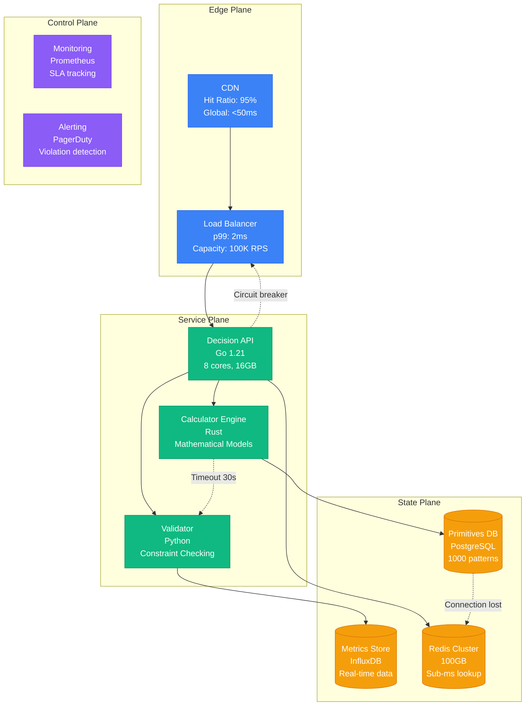
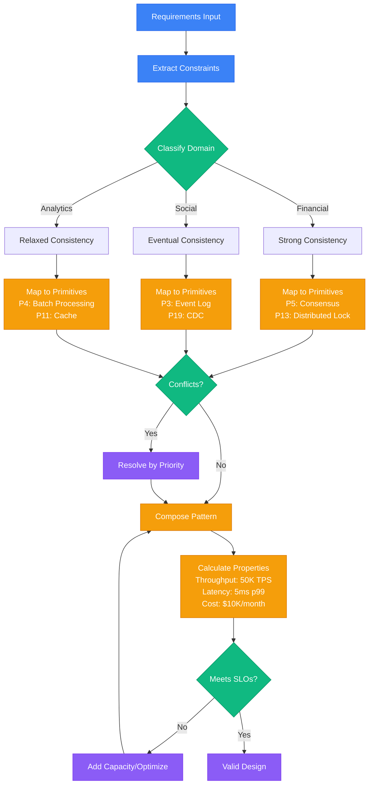
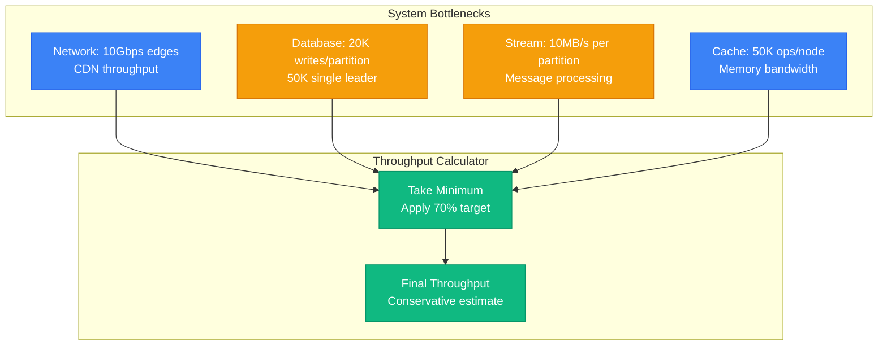
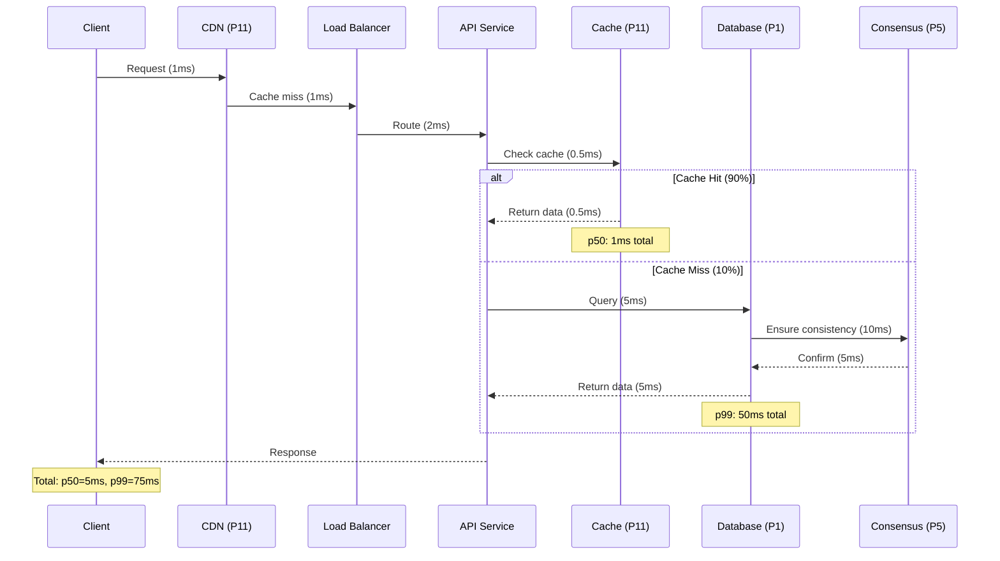
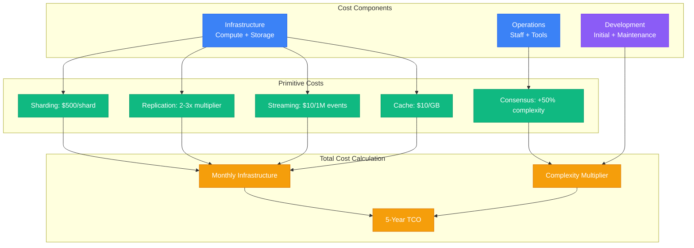
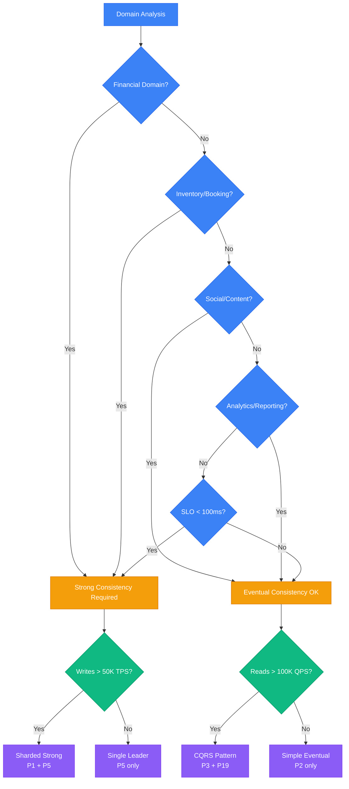
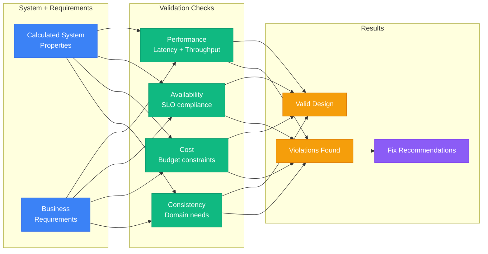

# Part II: The Decision Engine

The Decision Engine transforms system design from intuition to mathematical models. It provides quantitative frameworks for selecting patterns, calculating capacity, and validating architectures.

## Complete Decision Engine Architecture



## Cache Selection Decision Matrix

| Data Size | Technology | Cost/Month | Latency p99 | Use Cases | Configuration |
|-----------|------------|------------|-------------|-----------|---------------|
| <100MB | Local Memory | $0 | 0.01ms | Single server, Static data | HashMap, 50MB heap |
| 100MB-10GB | Redis Single | $50 | 1ms | Multi-server, Sessions | r6g.large, 16GB |
| 10GB-1TB | Redis Cluster | $500 | 2ms | Sharded data, HA required | 6 nodes, r6g.xlarge |
| >1TB | CDN + Tiered | $5000 | 10ms | Global users, Media files | CloudFront + S3 |

## System Design Decision Flow



## Master Algorithm Components

| Step | Component | Purpose | Input | Output | SLO |
|------|-----------|---------|--------|--------|-----|
| 1 | Constraint Extractor | Parse requirements | Domain, scale, budget | Hard constraints | <1ms |
| 2 | Capability Mapper | Map constraints to needs | Constraints | Required capabilities | <5ms |
| 3 | Primitive Selector | Choose implementation | Capabilities | Primitive set | <10ms |
| 4 | Conflict Resolver | Remove incompatibilities | Primitives | Valid primitive set | <5ms |
| 5 | Pattern Composer | Combine into patterns | Primitives | Complete pattern | <20ms |
| 6 | Property Calculator | Calculate system metrics | Pattern + requirements | System properties | <50ms |
| 7 | Constraint Validator | Check SLO compliance | Properties vs constraints | Pass/fail + gaps | <10ms |

## Throughput Calculation Model



## Capacity Planning Tables

### Throughput Limits by Component

| Component | Primitive | Limit per Unit | Scale Factor | Max Throughput | Cost per Unit |
|-----------|-----------|----------------|--------------|----------------|--------------|
| CDN Edge | P11 | 100K RPS | Linear | 10M RPS | $1000/edge |
| Database Partition | P1 | 20K writes/sec | Linear | 1M writes/sec | $500/partition |
| Single Leader | None | 50K writes/sec | None | 50K writes/sec | $2000/instance |
| Stream Partition | P3 | 10MB/s | Linear | 1GB/s | $100/partition |
| Cache Node | P11 | 50K ops/sec | Linear | 5M ops/sec | $200/node |

### Partition Calculation

| Target Throughput | Required Partitions | Monthly Cost | Latency Impact | Complexity |
|-------------------|---------------------|--------------|----------------|-----------|
| 10K TPS | 1 | $500 | +0ms | Low |
| 50K TPS | 3 | $1500 | +2ms | Medium |
| 100K TPS | 8 | $4000 | +5ms | High |
| 500K TPS | 36 | $18000 | +10ms | Very High |

## Availability Model

```mermaid
graph LR
    subgraph Factors[Availability Factors]
        REP[Replication Factor<br/>2x or 3x redundancy]
        COMPLEX[System Complexity<br/>Failure modes]
        PARTITION[Network Partitions<br/>CAP theorem impact]
    end

    subgraph Calculator[Availability Calculator]
        BASE[Base: 99.5% per node]
        REDUNDANCY[Apply redundancy<br/>1 - (1-0.995)^N]
        PENALTY[Subtract complexity<br/>0.01% per primitive]
        FINAL[Final Availability]
    end

    REP --> REDUNDANCY
    COMPLEX --> PENALTY
    PARTITION --> PENALTY
    BASE --> REDUNDANCY
    REDUNDANCY --> PENALTY
    PENALTY --> FINAL

    classDef edgeStyle fill:#3B82F6,stroke:#2563EB,color:#fff
    classDef serviceStyle fill:#10B981,stroke:#059669,color:#fff
    classDef stateStyle fill:#F59E0B,stroke:#D97706,color:#fff
    classDef controlStyle fill:#8B5CF6,stroke:#7C3AED,color:#fff

    class REP,PARTITION edgeStyle
    class BASE,REDUNDANCY,PENALTY,FINAL serviceStyle
    class COMPLEX stateStyle
```

### Availability by Architecture

| Architecture | Primitives | Replication | Availability | Downtime/Year | SLO Budget |
|--------------|------------|-------------|--------------|---------------|-----------|
| Single Node | None | 1x | 99.0% | 3.65 days | Not production |
| Active-Passive | P2 | 2x | 99.9% | 8.77 hours | $500K revenue loss |
| Active-Active | P2, P5 | 3x | 99.95% | 4.38 hours | $250K revenue loss |
| Multi-Region | P2, P5, P6 | 5x | 99.99% | 52.6 minutes | $50K revenue loss |
| Global | P2, P5, P6, P11 | 10x | 99.999% | 5.26 minutes | $5K revenue loss |

### Downtime Budget Calculation

| Availability | Yearly Downtime | Monthly Budget | Weekly Budget | Daily Budget |
|--------------|-----------------|----------------|---------------|--------------|
| 99.0% | 3.65 days | 7.3 hours | 1.7 hours | 14.4 minutes |
| 99.9% | 8.77 hours | 44 minutes | 10 minutes | 1.4 minutes |
| 99.95% | 4.38 hours | 22 minutes | 5 minutes | 43 seconds |
| 99.99% | 52.6 minutes | 4.4 minutes | 1 minute | 8.6 seconds |
| 99.999% | 5.26 minutes | 26 seconds | 6 seconds | 0.86 seconds |

## Latency Composition Model



### Latency Budget by Component

| Component | Primitive | p50 Latency | p99 Latency | Timeout | Failure Mode |
|-----------|-----------|-------------|-------------|---------|-------------|
| CDN | P11 | 1ms | 5ms | 30s | Origin fallback |
| Cache Hit | P11 | 0.5ms | 1ms | 5s | Database fallback |
| Cache Miss | P11 | 50ms | 100ms | 5s | Database direct |
| Database Read | P1 | 5ms | 20ms | 30s | Replica fallback |
| Database Write | P1 | 10ms | 50ms | 30s | Retry with backoff |
| Consensus | P5 | 10ms | 50ms | 5s | Majority timeout |
| Network Hop | Various | 1ms | 5ms | 30s | Circuit breaker |

### Latency Validation Matrix

| Budget Type | p50 Budget | p99 Budget | Violations | Recommendations |
|-------------|------------|------------|------------|----------------|
| Interactive | 100ms | 500ms | None | Add caching, CDN |
| API | 50ms | 200ms | p99 over budget | Reduce hops, optimize queries |
| Real-time | 10ms | 50ms | Both over budget | In-memory only, remove consensus |
| Batch | 1000ms | 5000ms | None | Current architecture sufficient |

## Cost Optimization Model



### Cost Breakdown by Scale

| Scale | Throughput | Infrastructure | Operations | Development | Monthly Total | 5-Year TCO |
|-------|------------|----------------|------------|-------------|---------------|------------|
| Startup | 1K TPS | $2K | $15K | $150K | $17K | $1.17M |
| Growth | 10K TPS | $10K | $30K | $300K | $40K | $2.7M |
| Scale | 100K TPS | $50K | $60K | $600K | $110K | $7.2M |
| Hyperscale | 1M TPS | $250K | $120K | $1.2M | $370K | $23.4M |

### Primitive Cost Impact

| Primitive | Use Case | Base Cost | Multiplier | Operational Overhead | Complexity Factor |
|-----------|----------|-----------|------------|---------------------|------------------|
| P1 (Sharding) | >20K TPS | $500/shard | Linear | +$2K/month | 1.2x |
| P2 (Replication) | HA required | 2-3x base | Fixed | +$1K/month | 1.1x |
| P3 (Event Log) | Event-driven | $10/1M events | Linear | +$3K/month | 1.3x |
| P5 (Consensus) | Strong consistency | +50% latency | Fixed | +$5K/month | 1.5x |
| P11 (Cache) | <100ms reads | $10/GB | Linear | +$1K/month | 1.1x |

## Consistency Decision Tree



## Domain Classification

| Domain | Keywords | Consistency Need | Recommended Pattern | Justification |
|--------|----------|------------------|---------------------|---------------|
| Financial | payment, billing, money, accounting | Strong | Single Leader or Sharded Strong | Zero tolerance for inconsistency |
| Inventory | booking, reservation, tickets | Strong | Escrow with Sharding | Prevent overbooking |
| Social | feed, timeline, content, news | Eventual | CQRS or Simple Eventual | User experience over perfect consistency |
| Analytics | reporting, dashboard, metrics | Eventual | Batch Processing | Stale data acceptable for insights |
| Gaming | leaderboard, scores, matches | Strong | Consensus with Partitioning | Fair play requires consistency |
| IoT | sensors, telemetry, monitoring | Eventual | Time Series with Batching | Volume over perfect order |

## Technology Selection Matrix

### Database Selection

| Throughput | Consistency | Primitives | Technology | Rationale | Monthly Cost |
|------------|-------------|------------|------------|-----------|-------------|
| <10K TPS | Any | None | PostgreSQL | Simple, proven | $500 |
| 10-50K TPS | Strong | P5 | PostgreSQL + Consensus | Single leader with HA | $1500 |
| >50K TPS | Strong | P1 + P5 | CockroachDB | Distributed strong consistency | $5000 |
| >50K TPS | Eventual | P1 | Cassandra | AP system, horizontal scale | $3000 |
| <1K TPS | Strong | P13 | SQLite + Replication | Embedded with backup | $100 |

### Cache Selection

| Cache Size | Hit Ratio | Latency Requirement | Technology | Configuration | Cost |
|------------|-----------|---------------------|------------|---------------|------|
| <1GB | >90% | <1ms | In-Memory HashMap | JVM heap, single instance | $0 |
| 1-10GB | >85% | <5ms | Redis Single | r6g.large, single AZ | $200 |
| 10-100GB | >80% | <10ms | Redis Cluster | 6 nodes, r6g.xlarge | $1200 |
| >100GB | >75% | <50ms | Redis + CDN | Global distribution | $5000 |

### Streaming Platform Selection

| Events/Sec | Consistency | Serverless | Technology | Reasoning | Cost Model |
|------------|-------------|------------|------------|-----------|------------|
| <1K | Any | Yes | AWS Kinesis | Serverless, pay-per-use | $0.014/shard-hour |
| 1-10K | Any | No | Apache Kafka | Industry standard | $500/month |
| >10K | Exactly-once | No | Apache Kafka | Transaction support | $2000/month |
| >100K | Any | No | Apache Kafka | Proven at scale | $10000/month |
| >1M | Any | No | Apache Pulsar | Multi-tenant, geo-replication | $50000/month |

## Validation Framework



## Validation Rules

| Violation Type | Detection Rule | Automatic Fix | Manual Fix Required |
|----------------|----------------|---------------|--------------------|
| Latency Budget | p99 > budget | Add caching (P11) | Reduce hops, optimize queries |
| Throughput | capacity < peak_load | Add partitioning (P1) | Scale vertically first |
| Availability | calculated < SLO | Add replication (P2) | Multi-region deployment |
| Cost Overrun | monthly > budget | Serverless pattern | Optimize resource allocation |
| Consistency Mismatch | strong needed, eventual provided | Add consensus (P5) | Relax business requirements |

## Recommendation Engine

| Problem Pattern | Root Cause | Primary Fix | Alternative Fix | Prevention |
|-----------------|------------|-------------|-----------------|------------|
| High Latency | Too many hops | Add CDN/Cache | Reduce service calls | API consolidation |
| Low Throughput | Single bottleneck | Horizontal scaling | Vertical scaling | Load testing |
| Poor Availability | Single points of failure | Add redundancy | Multi-region | Chaos engineering |
| Cost Explosion | Over-provisioning | Right-sizing | Reserved instances | Cost monitoring |
| Consistency Issues | Wrong pattern choice | Stronger guarantees | Relaxed requirements | Domain analysis |

The Decision Engine transforms system design from intuition to mathematical certainty, providing repeatable validation of complex architectural decisions with quantified trade-offs.