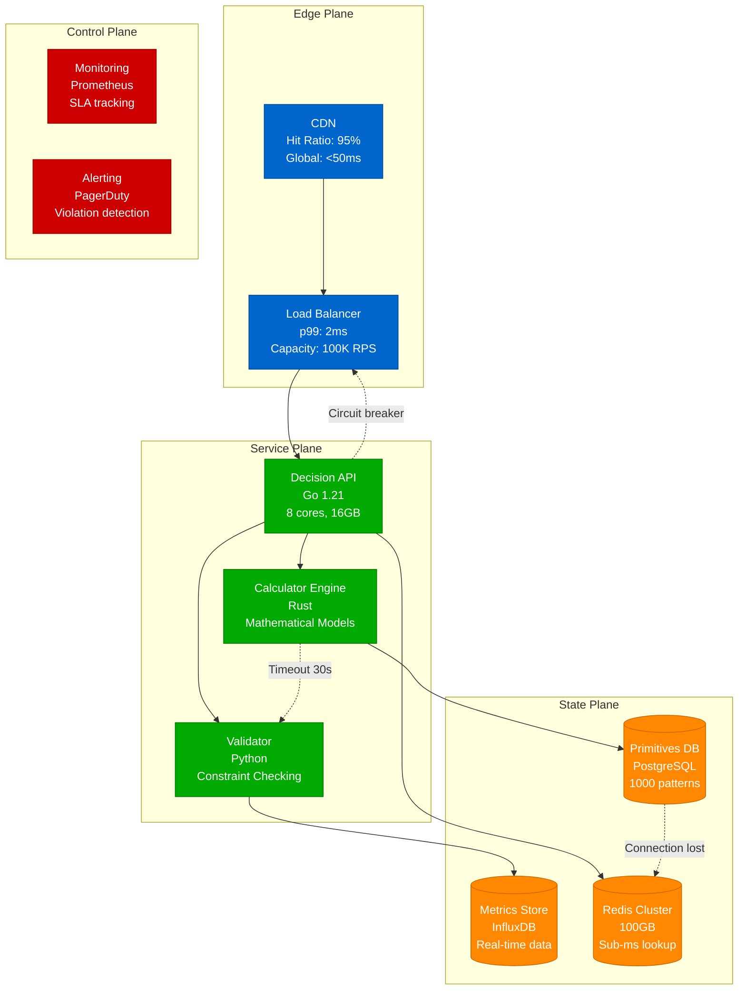

# Part II: The Decision Engine

The Decision Engine transforms system design from intuition to mathematical models. It provides quantitative frameworks for selecting patterns, calculating capacity, and validating architectures.

## Complete Decision Engine Architecture



## Cache Selection Decision Matrix

| Data Size | Technology | Cost/Month | Latency p99 | Use Cases | Configuration |
|-----------|------------|------------|-------------|-----------|---------------|
| <100MB | Local Memory | $0 | 0.01ms | Single server, Static data | HashMap, 50MB heap |
| 100MB-10GB | Redis Single | $50 | 1ms | Multi-server, Sessions | r6g.large, 16GB |
| 10GB-1TB | Redis Cluster | $500 | 2ms | Sharded data, HA required | 6 nodes, r6g.xlarge |
| >1TB | CDN + Tiered | $5000 | 10ms | Global users, Media files | CloudFront + S3 |

## The Master Algorithm

```python
def design_system(requirements):
    """
    Complete algorithm for system design with proofs
    """
    # Step 1: Extract hard constraints
    constraints = {
        'consistency': classify_consistency_need(requirements),
        'availability': requirements.availability_slo,
        'latency_p99': requirements.latency_budget,
        'throughput': requirements.peak_load,
        'durability': requirements.data_criticality,
        'cost_limit': requirements.budget
    }
    
    # Step 2: Map to capability requirements
    capabilities_needed = set()
    if constraints['consistency'] == 'financial':
        capabilities_needed.update(['LinearizableWrite', 'SerializableTransaction'])
    elif constraints['consistency'] == 'social':
        capabilities_needed.update(['EventualConsistency', 'PerKeyOrder'])
    
    if constraints['availability'] >= 0.9999:
        capabilities_needed.update(['HighAvailability', 'FaultTolerance'])
    
    if constraints['latency_p99'] < 100:
        capabilities_needed.update(['SubMillisecondRead', 'PredictableTail'])
    
    # Step 3: Select primitives that provide capabilities
    primitives = set()
    for capability in capabilities_needed:
        providing_primitives = CAPABILITY_TO_PRIMITIVES[capability]
        
        # Choose based on triggers
        for primitive in providing_primitives:
            if primitive.trigger_met(requirements):
                primitives.add(primitive)
    
    # Step 4: Validate no conflicting primitives
    for p1, p2 in itertools.combinations(primitives, 2):
        if p2 in p1.incompatible:
            # Resolve conflict
            if p1.priority > p2.priority:
                primitives.remove(p2)
            else:
                primitives.remove(p1)
    
    # Step 5: Compose into patterns
    pattern = None
    if 'CQRS' in detect_patterns(primitives):
        pattern = CQRS_PATTERN
    elif 'EventSourcing' in detect_patterns(primitives):
        pattern = EVENT_SOURCING_PATTERN
    # ... other patterns
    
    # Step 6: Calculate system properties
    system = {
        'pattern': pattern,
        'primitives': primitives,
        'capabilities': capabilities_needed,
        
        # Capacity
        'throughput': calculate_throughput(primitives),
        'storage': calculate_storage(primitives, requirements),
        
        # Performance  
        'latency_p50': sum(p.latency_p50 for p in primitives),
        'latency_p99': sum(p.latency_p99 for p in primitives) * 1.5,
        
        # Reliability
        'availability': calculate_availability(primitives),
        'durability': calculate_durability(primitives),
        
        # Cost
        'monthly_cost': sum(p.monthly_cost(requirements) for p in primitives),
        
        # Proofs required
        'proof_obligations': generate_proofs(capabilities_needed)
    }
    
    # Step 7: Verify constraints are met
    assert system['latency_p99'] <= constraints['latency_p99']
    assert system['availability'] >= constraints['availability']
    assert system['monthly_cost'] <= constraints['cost_limit']
    
    return system
```

## Quantitative Models

### Throughput Calculation

```python
def calculate_throughput(primitives):
    """
    System throughput = minimum of all bottlenecks
    """
    bottlenecks = []
    
    # Network bandwidth
    if 'P11' in primitives:  # CDN
        bottlenecks.append(CDN_EDGES * 10_000_000_000 / AVG_REQUEST_SIZE)  # 10Gbps edges
    
    # Database writes
    if 'P1' in primitives:  # Partitioning
        bottlenecks.append(NUM_PARTITIONS * 20_000)  # 20K writes/partition
    else:
        bottlenecks.append(50_000)  # Single leader limit
    
    # Stream processing
    if 'P3' in primitives:  # Durable log
        bottlenecks.append(NUM_PARTITIONS * 10_000_000 / AVG_MESSAGE_SIZE)  # 10MB/s per partition
    
    # Cache capacity
    if 'P11' in primitives:
        bottlenecks.append(CACHE_NODES * 50_000)  # 50K ops/node
    
    return min(bottlenecks) * 0.7  # 70% utilization target

def calculate_required_partitions(target_throughput):
    """Calculate minimum partitions needed for target throughput"""
    writes_per_partition = 20_000  # Conservative estimate
    return math.ceil(target_throughput / (writes_per_partition * 0.7))

def calculate_required_cache_nodes(target_qps, hit_ratio):
    """Calculate cache nodes needed for target QPS"""
    cache_requests = target_qps * hit_ratio
    ops_per_node = 50_000  # Conservative estimate
    return math.ceil(cache_requests / (ops_per_node * 0.7))
```

### Availability Calculation

```python
def calculate_availability(primitives):
    """
    Availability = 1 - P(system failure)
    With redundancy: P(fail) = P(single fail)^N
    """
    if 'P2' not in primitives:  # No replication
        return 0.99  # Single node
    
    replication_factor = 3 if 'P5' in primitives else 2  # Consensus needs odd number
    single_node_availability = 0.995  # Typical
    
    # Calculate based on redundancy
    p_all_fail = (1 - single_node_availability) ** replication_factor
    availability = 1 - p_all_fail
    
    # Adjust for complexity - each primitive adds failure modes
    complexity_penalty = len(primitives) * 0.0001
    
    # Network partition impact
    if 'P5' in primitives:  # Consensus
        # During partition, minority side unavailable
        partition_probability = 0.001  # 0.1% yearly
        partition_duration = 30 / (365 * 24 * 60)  # 30 minutes in year fraction
        partition_impact = partition_probability * partition_duration * 0.5  # 50% nodes affected
        availability -= partition_impact
    
    return max(0.5, availability - complexity_penalty)  # Floor at 50%

def calculate_slo_budget(availability_target):
    """Calculate downtime budget for availability target"""
    uptime = availability_target
    downtime_per_year = (1 - uptime) * 365 * 24 * 60  # minutes per year
    downtime_per_month = downtime_per_year / 12
    downtime_per_week = downtime_per_year / 52
    
    return {
        'yearly_minutes': downtime_per_year,
        'monthly_minutes': downtime_per_month,
        'weekly_minutes': downtime_per_week,
        'daily_seconds': (1 - uptime) * 24 * 60 * 60
    }
```

### Latency Modeling

```python
def calculate_latency_percentiles(primitives, request_flow):
    """
    Calculate latency percentiles based on request flow through primitives
    """
    latencies = []
    
    for step in request_flow:
        primitive = step['primitive']
        
        if primitive == 'P11':  # Cache
            latencies.append({
                'p50': 0.5,    # 0.5ms cache hit
                'p95': 1.0,    # 1ms cache hit
                'p99': 50.0    # 50ms cache miss + DB
            })
        elif primitive == 'P5':  # Consensus
            latencies.append({
                'p50': 2.0,    # 2ms consensus
                'p95': 5.0,    # 5ms consensus
                'p99': 20.0    # 20ms consensus timeout
            })
        elif primitive == 'P1':  # Database
            latencies.append({
                'p50': 1.0,    # 1ms DB read
                'p95': 5.0,    # 5ms DB read
                'p99': 50.0    # 50ms DB timeout
            })
    
    # Sum latencies for sequential operations
    total_latency = {
        'p50': sum(l['p50'] for l in latencies),
        'p95': sum(l['p95'] for l in latencies),
        'p99': max(l['p99'] for l in latencies) * 1.5  # Tail amplification
    }
    
    return total_latency

def validate_latency_budget(calculated_latency, budget):
    """Validate that calculated latency meets budget"""
    violations = []
    
    if calculated_latency['p50'] > budget.get('p50', float('inf')):
        violations.append(f"P50 {calculated_latency['p50']}ms > budget {budget['p50']}ms")
    
    if calculated_latency['p99'] > budget.get('p99', float('inf')):
        violations.append(f"P99 {calculated_latency['p99']}ms > budget {budget['p99']}ms")
    
    return violations
```

### Cost Modeling

```python
def calculate_monthly_cost(primitives, requirements):
    """
    Total cost = Infrastructure + Operations + Development
    """
    cost = 0
    
    # Infrastructure costs
    if 'P1' in primitives:  # Sharding
        shards = math.ceil(requirements.throughput / 20_000)
        cost += shards * 500  # $500/shard/month
    
    if 'P2' in primitives:  # Replication
        replication_factor = 3 if 'P5' in primitives else 2
        cost *= replication_factor
    
    if 'P11' in primitives:  # Cache
        cache_size_gb = requirements.working_set * 1.5  # 50% overhead
        cost += cache_size_gb * 10  # $10/GB/month
    
    if 'P3' in primitives:  # Event streaming
        events_per_month = requirements.throughput * 30 * 24 * 60 * 60
        cost += events_per_month * 0.00001  # $10/1M events
    
    # Operational overhead
    num_services = len([p for p in primitives if p.requires_operation])
    cost += num_services * 1000  # $1000/service/month operational overhead
    
    # Development complexity multiplier
    complexity_multiplier = 1 + 0.1 * len(primitives)
    cost *= complexity_multiplier
    
    return cost

def calculate_tco_5_years(primitives, requirements):
    """Calculate 5-year total cost of ownership"""
    monthly_infra = calculate_monthly_cost(primitives, requirements)
    
    # Development costs (one-time)
    development_months = estimate_development_time(primitives)
    developer_cost_per_month = 15000  # $15K/month loaded cost
    development_cost = development_months * developer_cost_per_month
    
    # Operational costs (ongoing)
    ops_engineers = math.ceil(len(primitives) / 5)  # 1 ops engineer per 5 services
    ops_cost_monthly = ops_engineers * 12000  # $12K/month loaded cost
    
    # Total 5-year cost
    total_5_year = (
        development_cost +
        (monthly_infra + ops_cost_monthly) * 60  # 5 years * 12 months
    )
    
    return {
        'development': development_cost,
        'infrastructure_5_year': monthly_infra * 60,
        'operations_5_year': ops_cost_monthly * 60,
        'total_5_year': total_5_year,
        'monthly_run_rate': monthly_infra + ops_cost_monthly
    }
```

## Decision Trees

### Consistency Requirements

```python
def classify_consistency_need(requirements):
    """
    Classify consistency requirements based on domain and use case
    """
    if any(keyword in requirements.domain.lower() for keyword in 
           ['financial', 'payment', 'billing', 'accounting', 'money']):
        return 'strong'  # Financial accuracy required
    
    if any(keyword in requirements.domain.lower() for keyword in
           ['inventory', 'booking', 'reservation', 'ticket']):
        return 'strong'  # No overbooking allowed
    
    if any(keyword in requirements.domain.lower() for keyword in
           ['social', 'feed', 'timeline', 'news', 'content']):
        return 'eventual'  # Eventual consistency acceptable
    
    if any(keyword in requirements.domain.lower() for keyword in
           ['analytics', 'reporting', 'dashboard', 'metrics']):
        return 'eventual'  # Stale data acceptable
    
    if requirements.consistency_slo:
        if requirements.consistency_slo < 100:  # <100ms
            return 'strong'
        else:
            return 'eventual'
    
    return 'eventual'  # Default to eventual consistency

def select_consistency_pattern(consistency_need, scale_requirements):
    """Select appropriate consistency pattern"""
    if consistency_need == 'strong':
        if scale_requirements.writes_per_second > 50_000:
            return 'sharded_strong'  # Partitioned strong consistency
        else:
            return 'single_leader'   # Simple strong consistency
    else:
        if scale_requirements.reads_per_second > 100_000:
            return 'cqrs'           # CQRS for read scaling
        else:
            return 'eventual'       # Simple eventual consistency
```

### Technology Selection

```python
def select_database(requirements, primitives):
    """Select appropriate database technology"""
    if 'P5' in primitives:  # Consensus required
        if requirements.throughput > 50_000:
            return 'CockroachDB'  # Distributed consensus
        else:
            return 'PostgreSQL'   # Single node with consensus for metadata
    
    if 'P1' in primitives:  # Partitioning required
        if requirements.consistency == 'eventual':
            return 'Cassandra'    # AP system
        else:
            return 'CockroachDB'  # CP system
    
    if requirements.throughput < 10_000:
        return 'PostgreSQL'       # Single node sufficient
    
    return 'PostgreSQL'           # Default choice

def select_caching_layer(requirements):
    """Select appropriate caching technology"""
    if requirements.cache_size_gb > 100:
        return 'Redis Cluster'
    elif requirements.cache_hit_ratio > 0.95:
        return 'Redis'
    elif requirements.latency_p99 < 10:
        return 'In-Memory Cache'
    else:
        return 'Redis'

def select_streaming_platform(requirements):
    """Select appropriate streaming platform"""
    if requirements.events_per_second > 100_000:
        return 'Apache Kafka'
    elif requirements.exactly_once_required:
        return 'Apache Kafka'
    elif requirements.serverless_preferred:
        return 'AWS Kinesis'
    else:
        return 'Apache Kafka'
```

## Validation Framework

```python
def validate_system_design(system, requirements):
    """
    Comprehensive validation of system design against requirements
    """
    violations = []
    
    # Performance validation
    if system['latency_p99'] > requirements.latency_budget:
        violations.append(f"Latency P99 {system['latency_p99']}ms exceeds budget {requirements.latency_budget}ms")
    
    if system['throughput'] < requirements.peak_load:
        violations.append(f"Throughput {system['throughput']} below required {requirements.peak_load}")
    
    # Availability validation
    if system['availability'] < requirements.availability_slo:
        violations.append(f"Availability {system['availability']} below SLO {requirements.availability_slo}")
    
    # Cost validation
    if system['monthly_cost'] > requirements.budget:
        violations.append(f"Cost ${system['monthly_cost']} exceeds budget ${requirements.budget}")
    
    # Consistency validation
    required_consistency = classify_consistency_need(requirements)
    provided_consistency = determine_consistency_level(system['primitives'])
    
    if not consistency_compatible(required_consistency, provided_consistency):
        violations.append(f"Consistency mismatch: need {required_consistency}, provides {provided_consistency}")
    
    return violations

def generate_recommendations(violations, system):
    """Generate recommendations to fix violations"""
    recommendations = []
    
    for violation in violations:
        if 'Latency' in violation:
            recommendations.append("Consider adding caching (P11) or reducing hops")
        elif 'Throughput' in violation:
            recommendations.append("Consider adding partitioning (P1) or scaling nodes")
        elif 'Availability' in violation:
            recommendations.append("Consider adding replication (P2) or redundancy")
        elif 'Cost' in violation:
            recommendations.append("Consider serverless pattern or resource optimization")
        elif 'Consistency' in violation:
            recommendations.append("Consider stronger consistency primitives or relaxing requirements")
    
    return recommendations
```

The Decision Engine transforms system design from art to science, providing repeatable, validated approaches to complex architectural decisions.