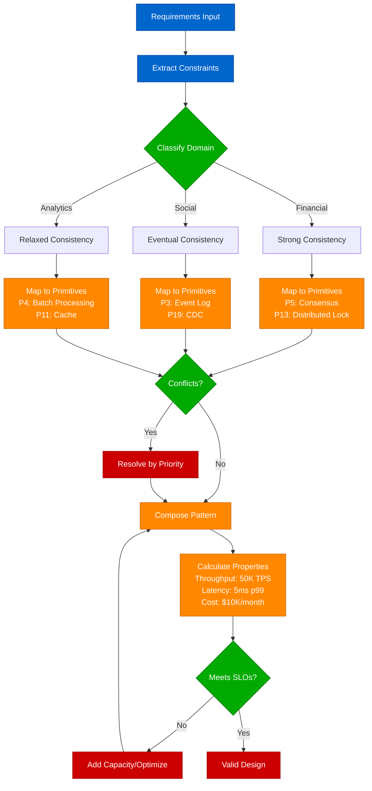
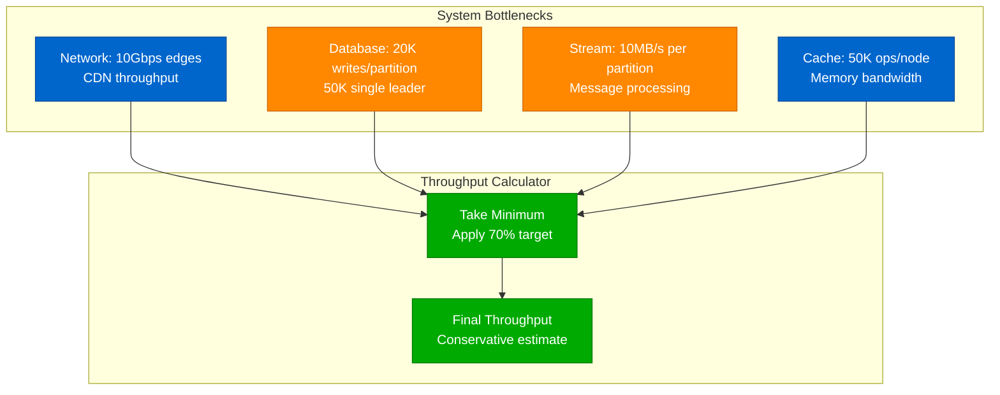
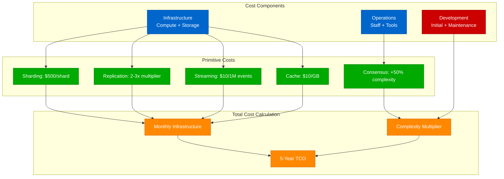

# Part II: The Decision Engine

The Decision Engine transforms system design from intuition to mathematical models. It provides quantitative frameworks for selecting patterns, calculating capacity, and validating architectures.

## Complete Decision Engine Architecture


## Cache Selection Decision Matrix

| Data Size | Technology | Cost/Month | Latency p99 | Use Cases | Configuration |
|-----------|------------|------------|-------------|-----------|---------------|
| <100MB | Local Memory | $0 | 0.01ms | Single server, Static data | HashMap, 50MB heap |
| 100MB-10GB | Redis Single | $50 | 1ms | Multi-server, Sessions | r6g.large, 16GB |
| 10GB-1TB | Redis Cluster | $500 | 2ms | Sharded data, HA required | 6 nodes, r6g.xlarge |
| >1TB | CDN + Tiered | $5000 | 10ms | Global users, Media files | CloudFront + S3 |

## System Design Decision Flow



## Master Algorithm Components

| Step | Component | Purpose | Input | Output | SLO |
|------|-----------|---------|--------|--------|-----|
| 1 | Constraint Extractor | Parse requirements | Domain, scale, budget | Hard constraints | <1ms |
| 2 | Capability Mapper | Map constraints to needs | Constraints | Required capabilities | <5ms |
| 3 | Primitive Selector | Choose implementation | Capabilities | Primitive set | <10ms |
| 4 | Conflict Resolver | Remove incompatibilities | Primitives | Valid primitive set | <5ms |
| 5 | Pattern Composer | Combine into patterns | Primitives | Complete pattern | <20ms |
| 6 | Property Calculator | Calculate system metrics | Pattern + requirements | System properties | <50ms |
| 7 | Constraint Validator | Check SLO compliance | Properties vs constraints | Pass/fail + gaps | <10ms |

## Throughput Calculation Model



## Capacity Planning Tables

### Throughput Limits by Component

| Component | Primitive | Limit per Unit | Scale Factor | Max Throughput | Cost per Unit |
|-----------|-----------|----------------|--------------|----------------|--------------|
| CDN Edge | P11 | 100K RPS | Linear | 10M RPS | $1000/edge |
| Database Partition | P1 | 20K writes/sec | Linear | 1M writes/sec | $500/partition |
| Single Leader | None | 50K writes/sec | None | 50K writes/sec | $2000/instance |
| Stream Partition | P3 | 10MB/s | Linear | 1GB/s | $100/partition |
| Cache Node | P11 | 50K ops/sec | Linear | 5M ops/sec | $200/node |

### Partition Calculation

| Target Throughput | Required Partitions | Monthly Cost | Latency Impact | Complexity |
|-------------------|---------------------|--------------|----------------|-----------|
| 10K TPS | 1 | $500 | +0ms | Low |
| 50K TPS | 3 | $1500 | +2ms | Medium |
| 100K TPS | 8 | $4000 | +5ms | High |
| 500K TPS | 36 | $18000 | +10ms | Very High |

## Availability Model

```mermaid
graph LR
    subgraph Factors[Availability Factors]
        REP[Replication Factor<br/>2x or 3x redundancy]
        COMPLEX[System Complexity<br/>Failure modes]
        PARTITION[Network Partitions<br/>CAP theorem impact]
    end

    subgraph Calculator[Availability Calculator]
        BASE[Base: 99.5% per node]
        REDUNDANCY[Apply redundancy<br/>1 - (1-0.995)^N]
        PENALTY[Subtract complexity<br/>0.01% per primitive]
        FINAL[Final Availability]
    end

    REP --> REDUNDANCY
    COMPLEX --> PENALTY
    PARTITION --> PENALTY
    BASE --> REDUNDANCY
    REDUNDANCY --> PENALTY
    PENALTY --> FINAL

    classDef edgeStyle fill:#0066CC,stroke:#004499,color:#fff
    classDef serviceStyle fill:#00AA00,stroke:#007700,color:#fff
    classDef stateStyle fill:#FF8800,stroke:#CC6600,color:#fff
    classDef controlStyle fill:#CC0000,stroke:#990000,color:#fff

    class REP,PARTITION edgeStyle
    class BASE,REDUNDANCY,PENALTY,FINAL serviceStyle
    class COMPLEX stateStyle
```

### Availability by Architecture

| Architecture | Primitives | Replication | Availability | Downtime/Year | SLO Budget |
|--------------|------------|-------------|--------------|---------------|-----------|
| Single Node | None | 1x | 99.0% | 3.65 days | Not production |
| Active-Passive | P2 | 2x | 99.9% | 8.77 hours | $500K revenue loss |
| Active-Active | P2, P5 | 3x | 99.95% | 4.38 hours | $250K revenue loss |
| Multi-Region | P2, P5, P6 | 5x | 99.99% | 52.6 minutes | $50K revenue loss |
| Global | P2, P5, P6, P11 | 10x | 99.999% | 5.26 minutes | $5K revenue loss |

### Downtime Budget Calculation

| Availability | Yearly Downtime | Monthly Budget | Weekly Budget | Daily Budget |
|--------------|-----------------|----------------|---------------|--------------|
| 99.0% | 3.65 days | 7.3 hours | 1.7 hours | 14.4 minutes |
| 99.9% | 8.77 hours | 44 minutes | 10 minutes | 1.4 minutes |
| 99.95% | 4.38 hours | 22 minutes | 5 minutes | 43 seconds |
| 99.99% | 52.6 minutes | 4.4 minutes | 1 minute | 8.6 seconds |
| 99.999% | 5.26 minutes | 26 seconds | 6 seconds | 0.86 seconds |

## Latency Composition Model


### Latency Budget by Component

| Component | Primitive | p50 Latency | p99 Latency | Timeout | Failure Mode |
|-----------|-----------|-------------|-------------|---------|-------------|
| CDN | P11 | 1ms | 5ms | 30s | Origin fallback |
| Cache Hit | P11 | 0.5ms | 1ms | 5s | Database fallback |
| Cache Miss | P11 | 50ms | 100ms | 5s | Database direct |
| Database Read | P1 | 5ms | 20ms | 30s | Replica fallback |
| Database Write | P1 | 10ms | 50ms | 30s | Retry with backoff |
| Consensus | P5 | 10ms | 50ms | 5s | Majority timeout |
| Network Hop | Various | 1ms | 5ms | 30s | Circuit breaker |

### Latency Validation Matrix

| Budget Type | p50 Budget | p99 Budget | Violations | Recommendations |
|-------------|------------|------------|------------|----------------|
| Interactive | 100ms | 500ms | None | Add caching, CDN |
| API | 50ms | 200ms | p99 over budget | Reduce hops, optimize queries |
| Real-time | 10ms | 50ms | Both over budget | In-memory only, remove consensus |
| Batch | 1000ms | 5000ms | None | Current architecture sufficient |

## Cost Optimization Model



### Cost Breakdown by Scale

| Scale | Throughput | Infrastructure | Operations | Development | Monthly Total | 5-Year TCO |
|-------|------------|----------------|------------|-------------|---------------|------------|
| Startup | 1K TPS | $2K | $15K | $150K | $17K | $1.17M |
| Growth | 10K TPS | $10K | $30K | $300K | $40K | $2.7M |
| Scale | 100K TPS | $50K | $60K | $600K | $110K | $7.2M |
| Hyperscale | 1M TPS | $250K | $120K | $1.2M | $370K | $23.4M |

### Primitive Cost Impact

| Primitive | Use Case | Base Cost | Multiplier | Operational Overhead | Complexity Factor |
|-----------|----------|-----------|------------|---------------------|------------------|
| P1 (Sharding) | >20K TPS | $500/shard | Linear | +$2K/month | 1.2x |
| P2 (Replication) | HA required | 2-3x base | Fixed | +$1K/month | 1.1x |
| P3 (Event Log) | Event-driven | $10/1M events | Linear | +$3K/month | 1.3x |
| P5 (Consensus) | Strong consistency | +50% latency | Fixed | +$5K/month | 1.5x |
| P11 (Cache) | <100ms reads | $10/GB | Linear | +$1K/month | 1.1x |

## Decision Trees

### Consistency Requirements

```python
def classify_consistency_need(requirements):
    """
    Classify consistency requirements based on domain and use case
    """
    if any(keyword in requirements.domain.lower() for keyword in 
           ['financial', 'payment', 'billing', 'accounting', 'money']):
        return 'strong'  # Financial accuracy required
    
    if any(keyword in requirements.domain.lower() for keyword in
           ['inventory', 'booking', 'reservation', 'ticket']):
        return 'strong'  # No overbooking allowed
    
    if any(keyword in requirements.domain.lower() for keyword in
           ['social', 'feed', 'timeline', 'news', 'content']):
        return 'eventual'  # Eventual consistency acceptable
    
    if any(keyword in requirements.domain.lower() for keyword in
           ['analytics', 'reporting', 'dashboard', 'metrics']):
        return 'eventual'  # Stale data acceptable
    
    if requirements.consistency_slo:
        if requirements.consistency_slo < 100:  # <100ms
            return 'strong'
        else:
            return 'eventual'
    
    return 'eventual'  # Default to eventual consistency

def select_consistency_pattern(consistency_need, scale_requirements):
    """Select appropriate consistency pattern"""
    if consistency_need == 'strong':
        if scale_requirements.writes_per_second > 50_000:
            return 'sharded_strong'  # Partitioned strong consistency
        else:
            return 'single_leader'   # Simple strong consistency
    else:
        if scale_requirements.reads_per_second > 100_000:
            return 'cqrs'           # CQRS for read scaling
        else:
            return 'eventual'       # Simple eventual consistency
```

### Technology Selection

```python
def select_database(requirements, primitives):
    """Select appropriate database technology"""
    if 'P5' in primitives:  # Consensus required
        if requirements.throughput > 50_000:
            return 'CockroachDB'  # Distributed consensus
        else:
            return 'PostgreSQL'   # Single node with consensus for metadata
    
    if 'P1' in primitives:  # Partitioning required
        if requirements.consistency == 'eventual':
            return 'Cassandra'    # AP system
        else:
            return 'CockroachDB'  # CP system
    
    if requirements.throughput < 10_000:
        return 'PostgreSQL'       # Single node sufficient
    
    return 'PostgreSQL'           # Default choice

def select_caching_layer(requirements):
    """Select appropriate caching technology"""
    if requirements.cache_size_gb > 100:
        return 'Redis Cluster'
    elif requirements.cache_hit_ratio > 0.95:
        return 'Redis'
    elif requirements.latency_p99 < 10:
        return 'In-Memory Cache'
    else:
        return 'Redis'

def select_streaming_platform(requirements):
    """Select appropriate streaming platform"""
    if requirements.events_per_second > 100_000:
        return 'Apache Kafka'
    elif requirements.exactly_once_required:
        return 'Apache Kafka'
    elif requirements.serverless_preferred:
        return 'AWS Kinesis'
    else:
        return 'Apache Kafka'
```

## Validation Framework

```python
def validate_system_design(system, requirements):
    """
    Comprehensive validation of system design against requirements
    """
    violations = []
    
    # Performance validation
    if system['latency_p99'] > requirements.latency_budget:
        violations.append(f"Latency P99 {system['latency_p99']}ms exceeds budget {requirements.latency_budget}ms")
    
    if system['throughput'] < requirements.peak_load:
        violations.append(f"Throughput {system['throughput']} below required {requirements.peak_load}")
    
    # Availability validation
    if system['availability'] < requirements.availability_slo:
        violations.append(f"Availability {system['availability']} below SLO {requirements.availability_slo}")
    
    # Cost validation
    if system['monthly_cost'] > requirements.budget:
        violations.append(f"Cost ${system['monthly_cost']} exceeds budget ${requirements.budget}")
    
    # Consistency validation
    required_consistency = classify_consistency_need(requirements)
    provided_consistency = determine_consistency_level(system['primitives'])
    
    if not consistency_compatible(required_consistency, provided_consistency):
        violations.append(f"Consistency mismatch: need {required_consistency}, provides {provided_consistency}")
    
    return violations

def generate_recommendations(violations, system):
    """Generate recommendations to fix violations"""
    recommendations = []
    
    for violation in violations:
        if 'Latency' in violation:
            recommendations.append("Consider adding caching (P11) or reducing hops")
        elif 'Throughput' in violation:
            recommendations.append("Consider adding partitioning (P1) or scaling nodes")
        elif 'Availability' in violation:
            recommendations.append("Consider adding replication (P2) or redundancy")
        elif 'Cost' in violation:
            recommendations.append("Consider serverless pattern or resource optimization")
        elif 'Consistency' in violation:
            recommendations.append("Consider stronger consistency primitives or relaxing requirements")
    
    return recommendations
```

The Decision Engine transforms system design from art to science, providing repeatable, validated approaches to complex architectural decisions.