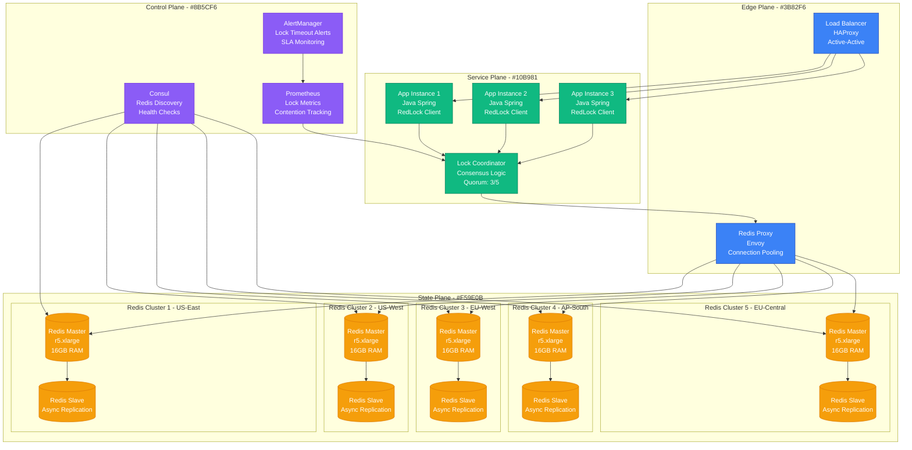
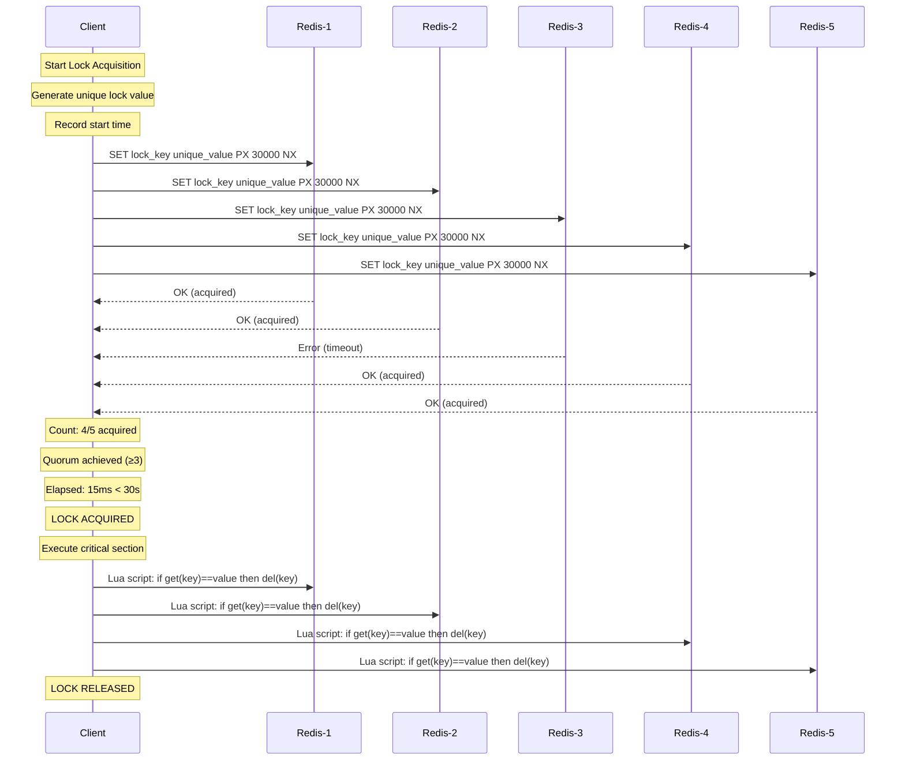
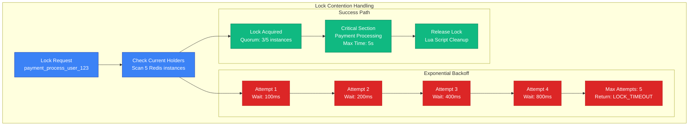
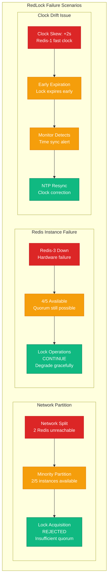

# Distributed Lock: Redis RedLock

## Overview

Redis RedLock provides distributed mutual exclusion across multiple Redis instances, preventing race conditions in distributed systems. Used by companies like GitLab and Shopify for critical sections like payment processing and inventory updates, it guarantees safety even during network partitions and Redis failures.

## Production Architecture



## RedLock Algorithm Flow



## Lock Contention and Backoff



## Failure Scenarios and Recovery



## Production Metrics

### Lock Performance
- **Acquisition Latency**: p50: 5ms, p99: 25ms, p999: 100ms
- **Success Rate**: 99.97% under normal conditions
- **Contention Rate**: 2-5% of lock attempts experience contention
- **Timeout Rate**: 0.03% (mostly during network issues)

### Redis Cluster Health
- **Instance Availability**: 99.99% per instance SLA
- **Network Latency**: <10ms between regions
- **Memory Usage**: 60-70% of 16GB per instance
- **Connection Pools**: 200 connections per app instance

## Implementation Details

### Java RedLock Client
```java
public class RedLockManager {
    private static final int QUORUM_SIZE = 3;
    private static final int LOCK_TTL_MS = 30000;
    private static final int RETRY_DELAY_MS = 100;

    private List<JedisPool> redisPools;

    public boolean acquireLock(String lockKey, String clientId) {
        long startTime = System.currentTimeMillis();
        String lockValue = clientId + ":" + UUID.randomUUID();

        int successCount = 0;
        List<Jedis> successfulInstances = new ArrayList<>();

        for (JedisPool pool : redisPools) {
            try (Jedis jedis = pool.getResource()) {
                String result = jedis.set(lockKey, lockValue,
                    SetParams.setParams().px(LOCK_TTL_MS).nx());

                if ("OK".equals(result)) {
                    successCount++;
                    successfulInstances.add(jedis);
                }
            } catch (Exception e) {
                // Log and continue to next instance
            }
        }

        long elapsedTime = System.currentTimeMillis() - startTime;
        boolean lockAcquired = successCount >= QUORUM_SIZE &&
                              elapsedTime < LOCK_TTL_MS;

        if (!lockAcquired) {
            // Release any acquired locks
            releaseLock(lockKey, lockValue, successfulInstances);
        }

        return lockAcquired;
    }
}
```

### Monitoring and Alerting
```yaml
# Prometheus alerts for RedLock
groups:
  - name: redlock_alerts
    rules:
      - alert: RedLockHighContention
        expr: redlock_contention_rate > 0.1
        for: 5m
        labels:
          severity: warning
        annotations:
          summary: "High lock contention detected"

      - alert: RedLockQuorumLoss
        expr: redis_instances_available < 3
        for: 1m
        labels:
          severity: critical
        annotations:
          summary: "RedLock quorum lost"
```

## Cost Analysis

### Infrastructure Costs
- **5 Redis Instances**: $2,400/month (r5.xlarge × 5 regions)
- **Network Transfer**: $300/month (inter-region traffic)
- **Monitoring**: $150/month (Prometheus + AlertManager)
- **Total Monthly**: $2,850

### Performance Trade-offs
- **Latency Overhead**: 15-30ms vs single Redis instance
- **Network Dependency**: Requires stable inter-region connectivity
- **Complexity Cost**: 3x operational overhead vs simple locking

## Battle-tested Lessons

### What Works at 3 AM
1. **5-Instance Quorum**: Survives 2 simultaneous failures
2. **Short TTL Values**: 30-second max prevents stuck locks
3. **Unique Lock Values**: Prevents accidental unlock by wrong client
4. **Lua Script Release**: Atomic check-and-delete prevents race conditions

### Common Pitfalls
1. **Clock Skew**: NTP sync is critical for TTL accuracy
2. **Network Timeouts**: Must be shorter than lock TTL
3. **GC Pauses**: Can cause false lock timeouts in JVM apps
4. **Cascading Failures**: Lock timeouts can trigger application timeouts

## Use Cases in Production

### Payment Processing (Shopify)
- **Lock Scope**: Per-customer payment processing
- **TTL**: 10 seconds (payment API timeout)
- **Contention**: 0.1% (rare simultaneous payments)

### Inventory Updates (E-commerce)
- **Lock Scope**: Per-SKU inventory modifications
- **TTL**: 5 seconds (database transaction timeout)
- **Contention**: 2-5% (flash sales, popular items)

### Deploy Coordination (GitLab)
- **Lock Scope**: Per-environment deployment
- **TTL**: 300 seconds (maximum deploy time)
- **Contention**: <0.01% (controlled by CI/CD)

## Related Patterns
- [Consensus Algorithms](./consensus-algorithms.md)
- [Circuit Breaker](./circuit-breaker.md)
- [Leader Election](./leader-election.md)

*Source: Redis Documentation, Shopify Engineering Blog, GitLab Engineering, Personal Production Experience*