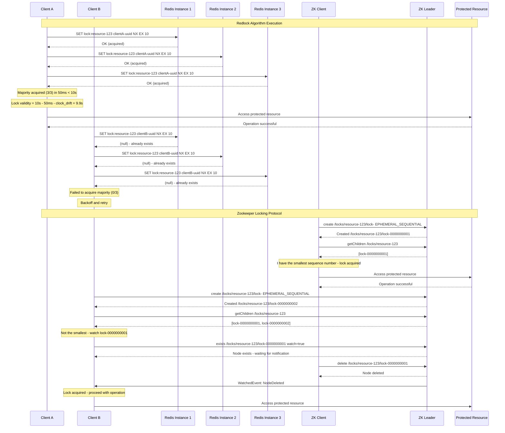

# Distributed Locking Pattern: Redlock vs Zookeeper in Production

## Overview

Comprehensive analysis of distributed locking implementations: Redis Redlock algorithm (used by GitHub, Shopify) vs Apache Zookeeper locks (Netflix, LinkedIn). Both provide distributed coordination primitives, but with fundamentally different consistency guarantees, performance characteristics, and failure modes. Real production data shows critical trade-offs between performance, correctness, and operational complexity.

## Production Architecture Comparison

```mermaid
graph TB
    subgraph EdgePlane[Edge Plane - #3B82F6]
        LB[Load Balancer<br/>Application layer<br/>Lock-aware routing<br/>Session affinity]
        API_GATEWAY[API Gateway<br/>Request deduplication<br/>Lock coordination<br/>Timeout management]
    end

    subgraph ServicePlane[Service Plane - #10B981]
        subgraph RedlockImplementation[Redlock Implementation - GitHub/Shopify]
            LOCK_CLIENT_REDIS[Redlock Client<br/>Multi-Redis coordination<br/>Majority consensus<br/>Clock drift protection]

            subgraph RedlockCluster[Redis Cluster (Odd Number)]
                REDIS_1[Redis Master 1<br/>Independent instance<br/>No replication<br/>Memory-based]
                REDIS_2[Redis Master 2<br/>Different AZ<br/>Isolated failure<br/>SET NX EX commands]
                REDIS_3[Redis Master 3<br/>Separate region<br/>Network partition<br/>Clock synchronization]
            end
        end

        subgraph ZookeeperImplementation[Zookeeper Implementation - Netflix/LinkedIn]
            ZK_CLIENT[Zookeeper Client<br/>Session management<br/>Watcher registration<br/>Sequential nodes]

            subgraph ZkEnsemble[Zookeeper Ensemble]
                ZK_LEADER[ZK Leader<br/>Write coordination<br/>Transaction log<br/>Follower sync]
                ZK_FOLLOWER_1[ZK Follower 1<br/>Read replicas<br/>Leader election<br/>Consensus voting]
                ZK_FOLLOWER_2[ZK Follower 2<br/>Backup leader<br/>Quorum member<br/>State replication]
            end
        end

        subgraph Applications[Application Services]
            SERVICE_A[Service A<br/>Critical section<br/>Resource coordination<br/>Mutual exclusion]
            SERVICE_B[Service B<br/>Batch processing<br/>Leader election<br/>Work distribution]
            SERVICE_C[Service C<br/>Configuration update<br/>Schema migration<br/>Atomic operations]
        end
    end

    subgraph StatePlane[State Plane - #F59E0B]
        subgraph RedlockState[Redlock State Management]
            REDIS_MEMORY[Redis Memory<br/>Lock keys with TTL<br/>Automatic expiration<br/>Memory optimization]
            CLOCK_SYNC[Clock Synchronization<br/>NTP configuration<br/>Clock drift monitoring<br/>Time-based safety]
        end

        subgraph ZookeeperState[Zookeeper State Management]
            ZK_ZNODES[Znode Hierarchy<br/>/locks/resource-id<br/>Sequential ephemeral<br/>PERSISTENT structure]
            ZK_SESSIONS[ZK Sessions<br/>Heartbeat mechanism<br/>Session timeout<br/>Automatic cleanup]
            ZK_WAL[Write-Ahead Log<br/>Transaction durability<br/>Leader failover<br/>State recovery]
        end

        subgraph SharedResources[Protected Resources]
            DATABASE[(Critical Database<br/>Transaction isolation<br/>Row-level locks<br/>Deadlock detection)]
            FILE_SYSTEM[Shared File System<br/>File locking<br/>Concurrent access<br/>Atomic operations]
            EXTERNAL_API[External API<br/>Rate limit coordination<br/>Request deduplication<br/>Token bucket sharing]
        end
    end

    subgraph ControlPlane[Control Plane - #8B5CF6]
        LOCK_MONITOR[Lock Monitoring<br/>Lock acquisition metrics<br/>Hold time tracking<br/>Contention analysis]
        DEADLOCK_DETECTION[Deadlock Detection<br/>Lock dependency graph<br/>Cycle detection<br/>Automatic resolution]
        PERFORMANCE_ANALYSIS[Performance Analysis<br/>Lock throughput<br/>Latency percentiles<br/>Bottleneck identification]
        ALERTING[Lock Alerting<br/>Lock timeouts<br/>High contention<br/>Split-brain detection]
    end

    LB --> API_GATEWAY
    API_GATEWAY --> LOCK_CLIENT_REDIS
    API_GATEWAY --> ZK_CLIENT

    LOCK_CLIENT_REDIS --> REDIS_1
    LOCK_CLIENT_REDIS --> REDIS_2
    LOCK_CLIENT_REDIS --> REDIS_3

    ZK_CLIENT --> ZK_LEADER
    ZK_CLIENT --> ZK_FOLLOWER_1
    ZK_CLIENT --> ZK_FOLLOWER_2

    LOCK_CLIENT_REDIS --> SERVICE_A
    ZK_CLIENT --> SERVICE_B
    LOCK_CLIENT_REDIS --> SERVICE_C

    REDIS_1 --> REDIS_MEMORY
    REDIS_2 --> CLOCK_SYNC
    ZK_LEADER --> ZK_ZNODES
    ZK_LEADER --> ZK_SESSIONS
    ZK_LEADER --> ZK_WAL

    SERVICE_A --> DATABASE
    SERVICE_B --> FILE_SYSTEM
    SERVICE_C --> EXTERNAL_API

    LOCK_CLIENT_REDIS --> LOCK_MONITOR
    ZK_CLIENT --> LOCK_MONITOR
    LOCK_MONITOR --> DEADLOCK_DETECTION
    LOCK_MONITOR --> PERFORMANCE_ANALYSIS
    PERFORMANCE_ANALYSIS --> ALERTING

    classDef edgeStyle fill:#3B82F6,stroke:#1E40AF,color:#fff
    classDef serviceStyle fill:#10B981,stroke:#047857,color:#fff
    classDef stateStyle fill:#F59E0B,stroke:#D97706,color:#fff
    classDef controlStyle fill:#8B5CF6,stroke:#6D28D9,color:#fff

    class LB,API_GATEWAY edgeStyle
    class LOCK_CLIENT_REDIS,REDIS_1,REDIS_2,REDIS_3,ZK_CLIENT,ZK_LEADER,ZK_FOLLOWER_1,ZK_FOLLOWER_2,SERVICE_A,SERVICE_B,SERVICE_C serviceStyle
    class REDIS_MEMORY,CLOCK_SYNC,ZK_ZNODES,ZK_SESSIONS,ZK_WAL,DATABASE,FILE_SYSTEM,EXTERNAL_API stateStyle
    class LOCK_MONITOR,DEADLOCK_DETECTION,PERFORMANCE_ANALYSIS,ALERTING controlStyle
```

## Lock Acquisition Flow Comparison



## Lock Algorithm Deep Dive

```mermaid
graph TB
    subgraph LockAlgorithms[Distributed Lock Algorithm Analysis]
        subgraph RedlockAlgorithm[Redlock Algorithm - Production Implementation]
            REDLOCK_STEPS[Redlock Steps<br/>1. Get current time<br/>2. Acquire N/2+1 locks<br/>3. Calculate remaining TTL<br/>4. Use lock if valid<br/>5. Release all locks]

            REDLOCK_SAFETY[Safety Properties<br/>Mutual exclusion<br/>Deadlock-free<br/>Fault tolerance<br/>Clock drift protection]

            REDLOCK_PERFORMANCE[Performance Characteristics<br/>Low latency (1-5ms)<br/>High throughput<br/>Network partition handling<br/>Memory efficiency]

            REDLOCK_GUARANTEES[Correctness Guarantees<br/>Bounded clock drift<br/>Majority availability<br/>Network delay < TTL<br/>Process pause < TTL]
        end

        subgraph ZookeeperLocks[Zookeeper Lock Algorithm - Production Implementation]
            ZK_STEPS[ZK Lock Steps<br/>1. Create ephemeral sequential<br/>2. Get all children<br/>3. Check if smallest<br/>4. Watch predecessor<br/>5. Wait for notification]

            ZK_SAFETY[Safety Properties<br/>Linearizable operations<br/>Strong consistency<br/>Session-based cleanup<br/>Automatic failover]

            ZK_PERFORMANCE[Performance Characteristics<br/>Higher latency (10-50ms)<br/>Moderate throughput<br/>CP system guarantees<br/>Persistent storage]

            ZK_GUARANTEES[Correctness Guarantees<br/>Sequential consistency<br/>Atomic operations<br/>Session timeout cleanup<br/>Leader election safety]
        end

        subgraph FailureScenarios[Production Failure Scenarios]
            NETWORK_PARTITION[Network Partition<br/>Split-brain potential<br/>CAP theorem trade-offs<br/>Recovery procedures]

            CLOCK_DRIFT[Clock Drift Issues<br/>Time synchronization<br/>NTP configuration<br/>Monotonic clocks]

            PROCESS_PAUSE[Process Pause/GC<br/>Stop-the-world GC<br/>Container scheduling<br/>OS scheduling delays]

            CASCADING_FAILURE[Cascading Failures<br/>Dependency chains<br/>Timeout propagation<br/>Circuit breaker integration]
        end
    end

    subgraph SafetyAnalysis[Safety and Liveness Analysis]
        subgraph RedlockSafety[Redlock Safety Analysis]
            REDLOCK_MUTEX[Mutual Exclusion<br/>Majority consensus<br/>Clock synchronization<br/>Bounded network delay]

            REDLOCK_LIVENESS[Liveness Guarantees<br/>TTL-based release<br/>Automatic expiration<br/>No permanent blocking]

            REDLOCK_FAULTS[Fault Tolerance<br/>Minority failure resilience<br/>Redis instance crashes<br/>Network partitions]
        end

        subgraph ZookeeperSafety[Zookeeper Safety Analysis]
            ZK_MUTEX[Mutual Exclusion<br/>Sequential node ordering<br/>Atomic operations<br/>Session-based ownership]

            ZK_LIVENESS[Liveness Guarantees<br/>Session timeout cleanup<br/>Leader election<br/>Watcher notifications]

            ZK_FAULTS[Fault Tolerance<br/>Majority quorum required<br/>Leader failover<br/>Split-brain prevention]
        end
    end

    REDLOCK_STEPS --> REDLOCK_SAFETY
    REDLOCK_SAFETY --> REDLOCK_PERFORMANCE
    REDLOCK_PERFORMANCE --> REDLOCK_GUARANTEES

    ZK_STEPS --> ZK_SAFETY
    ZK_SAFETY --> ZK_PERFORMANCE
    ZK_PERFORMANCE --> ZK_GUARANTEES

    REDLOCK_GUARANTEES --> NETWORK_PARTITION
    ZK_GUARANTEES --> CLOCK_DRIFT
    NETWORK_PARTITION --> PROCESS_PAUSE
    CLOCK_DRIFT --> CASCADING_FAILURE

    REDLOCK_SAFETY --> REDLOCK_MUTEX
    REDLOCK_MUTEX --> REDLOCK_LIVENESS
    REDLOCK_LIVENESS --> REDLOCK_FAULTS

    ZK_SAFETY --> ZK_MUTEX
    ZK_MUTEX --> ZK_LIVENESS
    ZK_LIVENESS --> ZK_FAULTS

    classDef redlockStyle fill:#DC2626,stroke:#B91C1C,color:#fff
    classDef zkStyle fill:#059669,stroke:#047857,color:#fff
    classDef failureStyle fill:#F59E0B,stroke:#D97706,color:#fff
    classDef safetyStyle fill:#8B5CF6,stroke:#6D28D9,color:#fff

    class REDLOCK_STEPS,REDLOCK_SAFETY,REDLOCK_PERFORMANCE,REDLOCK_GUARANTEES,REDLOCK_MUTEX,REDLOCK_LIVENESS,REDLOCK_FAULTS redlockStyle
    class ZK_STEPS,ZK_SAFETY,ZK_PERFORMANCE,ZK_GUARANTEES,ZK_MUTEX,ZK_LIVENESS,ZK_FAULTS zkStyle
    class NETWORK_PARTITION,CLOCK_DRIFT,PROCESS_PAUSE,CASCADING_FAILURE failureStyle
    class REDLOCK_MUTEX,REDLOCK_LIVENESS,ZK_MUTEX,ZK_LIVENESS safetyStyle
```

## Production Use Cases and Patterns

```mermaid
graph TB
    subgraph UseCasePatterns[Production Use Case Patterns]
        subgraph HighFrequencyLocks[High-Frequency Lock Patterns - GitHub/Shopify]
            RATE_LIMITING[API Rate Limiting<br/>Token bucket coordination<br/>Per-user quotas<br/>Burst handling]

            CACHE_WARMING[Cache Warming<br/>Prevent thundering herd<br/>Single warm-up process<br/>TTL-based coordination]

            RESOURCE_ALLOCATION[Resource Allocation<br/>Database connections<br/>Worker thread pools<br/>Memory segments]

            BATCH_COORDINATION[Batch Job Coordination<br/>Single instance execution<br/>Work partitioning<br/>Progress checkpointing]
        end

        subgraph CriticalOperations[Critical Operation Patterns - Netflix/LinkedIn]
            SCHEMA_MIGRATION[Schema Migration<br/>Database DDL operations<br/>Zero-downtime deployment<br/>Rollback coordination]

            CONFIG_UPDATE[Configuration Update<br/>Feature flag changes<br/>Service configuration<br/>Coordinated deployment]

            LEADER_ELECTION[Leader Election<br/>Master-slave coordination<br/>Active-passive failover<br/>Split-brain prevention]

            DISTRIBUTED_TRANSACTION[Distributed Transactions<br/>Two-phase commit<br/>Saga coordination<br/>Compensating actions]
        end

        subgraph LockGranularity[Lock Granularity Strategies]
            FINE_GRAINED[Fine-grained Locks<br/>Resource-specific<br/>Low contention<br/>High concurrency]

            COARSE_GRAINED[Coarse-grained Locks<br/>Service-level locks<br/>Simple coordination<br/>Reduced complexity]

            HIERARCHICAL[Hierarchical Locks<br/>Lock ordering<br/>Deadlock prevention<br/>Nested resources]

            TIMEOUT_BASED[Timeout-based Locks<br/>TTL coordination<br/>Automatic cleanup<br/>Failure recovery]
        end
    end

    subgraph LockOptimization[Lock Optimization Strategies]
        subgraph RedlockOptimizations[Redlock Optimizations]
            REDIS_PIPELINE[Redis Pipelining<br/>Batch lock requests<br/>Network optimization<br/>Latency reduction]

            CLOCK_SKEW_HANDLING[Clock Skew Handling<br/>NTP synchronization<br/>Monotonic timestamps<br/>Drift compensation]

            RETRY_STRATEGIES[Retry Strategies<br/>Exponential backoff<br/>Jittered delays<br/>Circuit breaker integration]

            TTL_OPTIMIZATION[TTL Optimization<br/>Dynamic TTL calculation<br/>Operation time estimation<br/>Safety margins]
        end

        subgraph ZookeeperOptimizations[Zookeeper Optimizations]
            SESSION_OPTIMIZATION[Session Optimization<br/>Heartbeat tuning<br/>Timeout configuration<br/>Connection pooling]

            WATCHER_EFFICIENCY[Watcher Efficiency<br/>Event filtering<br/>Batch notifications<br/>Memory management]

            LOCK_QUEUING[Lock Queuing<br/>Fair queuing<br/>Priority handling<br/>Starvation prevention]

            ENSEMBLE_TUNING[Ensemble Tuning<br/>Quorum sizing<br/>Network optimization<br/>Storage configuration]
        end
    end

    RATE_LIMITING --> FINE_GRAINED
    CACHE_WARMING --> TIMEOUT_BASED
    SCHEMA_MIGRATION --> COARSE_GRAINED
    LEADER_ELECTION --> HIERARCHICAL

    FINE_GRAINED --> REDIS_PIPELINE
    TIMEOUT_BASED --> TTL_OPTIMIZATION
    COARSE_GRAINED --> SESSION_OPTIMIZATION
    HIERARCHICAL --> LOCK_QUEUING

    classDef usecaseStyle fill:#3B82F6,stroke:#1E40AF,color:#fff
    classDef criticalStyle fill:#DC2626,stroke:#B91C1C,color:#fff
    classDef granularityStyle fill:#059669,stroke:#047857,color:#fff
    classDef optimizationStyle fill:#F59E0B,stroke:#D97706,color:#fff

    class RATE_LIMITING,CACHE_WARMING,RESOURCE_ALLOCATION,BATCH_COORDINATION usecaseStyle
    class SCHEMA_MIGRATION,CONFIG_UPDATE,LEADER_ELECTION,DISTRIBUTED_TRANSACTION criticalStyle
    class FINE_GRAINED,COARSE_GRAINED,HIERARCHICAL,TIMEOUT_BASED granularityStyle
    class REDIS_PIPELINE,CLOCK_SKEW_HANDLING,RETRY_STRATEGIES,TTL_OPTIMIZATION,SESSION_OPTIMIZATION,WATCHER_EFFICIENCY,LOCK_QUEUING,ENSEMBLE_TUNING optimizationStyle
```



## Production Metrics and Performance

### Lock Performance Comparison (Based on GitHub vs Netflix Production)
| Metric | Redlock (Redis) | Zookeeper Locks |
|--------|-----------------|------------------|
| **Acquisition Latency** | 1-5ms p99 | 10-50ms p99 |
| **Throughput** | 10K ops/sec | 1K ops/sec |
| **Lock Duration** | Seconds to minutes | Minutes to hours |
| **Fault Tolerance** | N/2+1 Redis failures | N/2+1 ZK failures |
| **Memory Usage** | 1KB per lock | 10KB per lock |
| **Network Overhead** | 3x Redis calls | 2-3x ZK calls |

### Production Reliability Metrics
| Failure Mode | Redlock Impact | Zookeeper Impact |
|--------------|----------------|------------------|
| **Network Partition** | Potential split-brain | Strong consistency maintained |
| **Clock Drift** | Lock safety compromised | No impact on correctness |
| **Node Failure** | Graceful degradation | Leader election delay |
| **Process Pause** | Lock may expire early | Session timeout handling |

## Implementation Examples

### Redlock Implementation (GitHub-style)
```java
// Production Redlock implementation with proper error handling
@Component
public class RedlockDistributedLock {

    private final List<JedisPool> redisPools;
    private final int quorum;
    private final long clockDriftFactor = 2; // milliseconds
    private final long retryDelay = 200; // milliseconds
    private final int retryCount = 3;

    public RedlockDistributedLock(List<String> redisEndpoints) {
        this.redisPools = redisEndpoints.stream()
                .map(endpoint -> new JedisPool(new JedisPoolConfig(), endpoint))
                .collect(Collectors.toList());
        this.quorum = (redisPools.size() / 2) + 1;
    }

    public LockResult acquireLock(String resource, String clientId, long ttlMs) {
        for (int attempt = 0; attempt < retryCount; attempt++) {
            long startTime = System.currentTimeMillis();
            int locksAcquired = 0;
            List<String> lockedInstances = new ArrayList<>();

            // Try to acquire lock on each Redis instance
            for (int i = 0; i < redisPools.size(); i++) {
                if (acquireLockOnInstance(i, resource, clientId, ttlMs)) {
                    locksAcquired++;
                    lockedInstances.add(String.valueOf(i));
                }
            }

            long acquisitionTime = System.currentTimeMillis() - startTime;
            long validityTime = ttlMs - acquisitionTime - clockDriftFactor;

            // Check if we acquired majority and lock is still valid
            if (locksAcquired >= quorum && validityTime > 0) {
                return new LockResult(true, clientId, validityTime, lockedInstances);
            } else {
                // Release any acquired locks
                releaseLock(resource, clientId);

                // Wait before retry
                try {
                    Thread.sleep(new Random().nextInt((int) retryDelay));
                } catch (InterruptedException e) {
                    Thread.currentThread().interrupt();
                    break;
                }
            }
        }

        return new LockResult(false, null, 0, Collections.emptyList());
    }

    private boolean acquireLockOnInstance(int instanceIndex, String resource,
                                        String clientId, long ttlMs) {
        try (Jedis jedis = redisPools.get(instanceIndex).getResource()) {
            String lockKey = "lock:" + resource;
            String lockValue = clientId + ":" + System.currentTimeMillis();

            String result = jedis.set(lockKey, lockValue,
                SetParams.setParams().nx().ex((int) (ttlMs / 1000)));

            return "OK".equals(result);
        } catch (Exception e) {
            log.warn("Failed to acquire lock on Redis instance {}: {}",
                    instanceIndex, e.getMessage());
            return false;
        }
    }

    public boolean releaseLock(String resource, String clientId) {
        String script =
            "if redis.call('get', KEYS[1]) == ARGV[1] then " +
            "return redis.call('del', KEYS[1]) " +
            "else " +
            "return 0 " +
            "end";

        int releasedCount = 0;
        for (JedisPool pool : redisPools) {
            try (Jedis jedis = pool.getResource()) {
                String lockKey = "lock:" + resource;
                Object result = jedis.eval(script,
                    Collections.singletonList(lockKey),
                    Collections.singletonList(clientId));

                if (result.equals(1L)) {
                    releasedCount++;
                }
            } catch (Exception e) {
                log.warn("Failed to release lock: {}", e.getMessage());
            }
        }

        return releasedCount >= quorum;
    }

    @Data
    @AllArgsConstructor
    public static class LockResult {
        private final boolean acquired;
        private final String lockId;
        private final long validityTimeMs;
        private final List<String> lockedInstances;
    }
}
```

### Zookeeper Lock Implementation (Netflix-style)
```java
// Production Zookeeper lock with proper session management
@Component
public class ZookeeperDistributedLock {

    private final CuratorFramework client;
    private final String lockBasePath;
    private final RetryPolicy retryPolicy;

    public ZookeeperDistributedLock(String connectString, String lockBasePath) {
        this.lockBasePath = lockBasePath;
        this.retryPolicy = new ExponentialBackoffRetry(1000, 3);

        this.client = CuratorFrameworkFactory.newClient(connectString, retryPolicy);
        this.client.start();

        try {
            // Ensure base path exists
            client.blockUntilConnected(30, TimeUnit.SECONDS);
            if (client.checkExists().forPath(lockBasePath) == null) {
                client.create()
                    .creatingParentsIfNeeded()
                    .withMode(CreateMode.PERSISTENT)
                    .forPath(lockBasePath);
            }
        } catch (Exception e) {
            throw new RuntimeException("Failed to initialize Zookeeper lock", e);
        }
    }

    public DistributedLockResult acquireLock(String resource, long timeoutMs) {
        String lockPath = lockBasePath + "/" + resource;
        InterProcessMutex mutex = new InterProcessMutex(client, lockPath);

        try {
            boolean acquired = mutex.acquire(timeoutMs, TimeUnit.MILLISECONDS);
            if (acquired) {
                return new DistributedLockResult(true, mutex, lockPath);
            } else {
                return new DistributedLockResult(false, null, null);
            }
        } catch (Exception e) {
            log.error("Failed to acquire Zookeeper lock for resource: {}", resource, e);
            return new DistributedLockResult(false, null, null);
        }
    }

    public boolean releaseLock(DistributedLockResult lockResult) {
        if (!lockResult.isAcquired() || lockResult.getMutex() == null) {
            return false;
        }

        try {
            lockResult.getMutex().release();
            return true;
        } catch (Exception e) {
            log.error("Failed to release Zookeeper lock: {}", lockResult.getLockPath(), e);
            return false;
        }
    }

    // Leader election implementation
    public LeaderLatch createLeaderLatch(String latchPath, String participantId) {
        LeaderLatch leaderLatch = new LeaderLatch(client, latchPath, participantId);

        leaderLatch.addListener(new LeaderLatchListener() {
            @Override
            public void isLeader() {
                log.info("Participant {} became leader for {}", participantId, latchPath);
                // Implement leader-specific logic
            }

            @Override
            public void notLeader() {
                log.info("Participant {} is no longer leader for {}", participantId, latchPath);
                // Implement follower-specific logic
            }
        });

        try {
            leaderLatch.start();
        } catch (Exception e) {
            log.error("Failed to start leader latch for {}", latchPath, e);
        }

        return leaderLatch;
    }

    @Data
    @AllArgsConstructor
    public static class DistributedLockResult {
        private final boolean acquired;
        private final InterProcessMutex mutex;
        private final String lockPath;
    }
}
```

### Production Lock Monitoring
```java
// Lock monitoring and metrics collection
@Component
public class LockMonitoringService {

    private final MeterRegistry meterRegistry;
    private final Timer lockAcquisitionTimer;
    private final Counter lockFailureCounter;
    private final Gauge lockHoldTimeGauge;

    public LockMonitoringService(MeterRegistry meterRegistry) {
        this.meterRegistry = meterRegistry;
        this.lockAcquisitionTimer = Timer.builder("lock.acquisition.time")
            .description("Time taken to acquire distributed lock")
            .register(meterRegistry);

        this.lockFailureCounter = Counter.builder("lock.acquisition.failures")
            .description("Number of failed lock acquisitions")
            .register(meterRegistry);

        this.lockHoldTimeGauge = Gauge.builder("lock.hold.time")
            .description("Current lock hold time")
            .register(meterRegistry, this, LockMonitoringService::getCurrentLockHoldTime);
    }

    public <T> T withDistributedLock(String resource, String lockType,
                                   long timeoutMs, Supplier<T> operation) {
        Timer.Sample sample = Timer.start(meterRegistry);

        try {
            boolean lockAcquired = false;

            if ("redlock".equals(lockType)) {
                // Redlock implementation
                lockAcquired = acquireRedlock(resource, timeoutMs);
            } else if ("zookeeper".equals(lockType)) {
                // Zookeeper implementation
                lockAcquired = acquireZookeeperLock(resource, timeoutMs);
            }

            if (!lockAcquired) {
                lockFailureCounter.increment(Tags.of("resource", resource, "type", lockType));
                throw new LockAcquisitionException("Failed to acquire lock: " + resource);
            }

            sample.stop(lockAcquisitionTimer.withTags("resource", resource, "type", lockType));

            // Execute protected operation
            long operationStart = System.currentTimeMillis();
            T result = operation.get();
            long operationTime = System.currentTimeMillis() - operationStart;

            // Record lock hold time
            meterRegistry.timer("lock.hold.time", "resource", resource, "type", lockType)
                .record(operationTime, TimeUnit.MILLISECONDS);

            return result;

        } catch (Exception e) {
            lockFailureCounter.increment(Tags.of("resource", resource, "type", lockType, "error", e.getClass().getSimpleName()));
            throw e;
        } finally {
            // Always attempt to release lock
            releaseLock(resource, lockType);
        }
    }

    private double getCurrentLockHoldTime() {
        // Implementation to track current lock hold times
        return 0.0; // Placeholder
    }
}
```

## Cost Analysis

### Infrastructure Costs (Monthly - 1000 locks/day)
| Component | Redlock (Redis) | Zookeeper |
|-----------|-----------------|-----------|
| **Compute** | $3K (3 Redis instances) | $2K (3 ZK instances) |
| **Memory** | $1K (Redis memory) | $0.5K (ZK memory) |
| **Storage** | $0.1K (minimal) | $0.5K (transaction logs) |
| **Network** | $0.5K | $0.3K |
| **Monitoring** | $1K | $1K |
| **Total** | **$5.6K** | **$4.3K** |

### Operational Costs (Monthly)
| Resource | Redlock | Zookeeper |
|----------|---------|-----------|
| **Development** | $8K (complex implementation) | $5K (library-based) |
| **Operations** | $5K (Redis management) | $8K (ZK ensemble management) |
| **Debugging** | $3K (timing issues) | $2K (deterministic) |
| **Total** | **$16K** | **$15K** |

## Battle-tested Lessons

### Redlock in Production (GitHub, Shopify)
**What Works at 3 AM:**
- Fast lock acquisition for high-frequency operations
- Automatic expiration prevents deadlocks
- Independent Redis instances provide fault tolerance
- Simple implementation for basic use cases

**Common Failures:**
- Clock drift causes premature lock expiration
- Network partitions lead to split-brain scenarios
- Redis memory pressure affects lock availability
- TTL tuning requires careful consideration of operation time

### Zookeeper Locks in Production (Netflix, LinkedIn)
**What Works at 3 AM:**
- Strong consistency guarantees prevent split-brain
- Session-based cleanup handles process failures
- Built-in leader election for coordination
- Hierarchical namespace for complex locking

**Common Failures:**
- Leader election delays during failover
- Session timeout tuning affects availability
- ZAB protocol latency impacts performance
- Ensemble configuration complexity

## Selection Criteria

### Choose Redlock When:
- Need low-latency lock acquisition
- High-frequency locking operations
- Can tolerate eventual consistency
- Clock synchronization is manageable
- Performance over correctness

### Choose Zookeeper When:
- Need strong consistency guarantees
- Complex coordination requirements
- Long-running critical operations
- Can accept higher latency
- Correctness over performance

### Hybrid Approach When:
- Different use cases require different guarantees
- Migration from one system to another
- Want to compare performance characteristics
- Need fallback mechanisms

## Related Patterns
- [Leader Election](./leader-election-consul-etcd.md)
- [Circuit Breaker](./circuit-breaker-production.md)
- [Consensus Protocols](./consensus-raft-vs-paxos.md)

*Source: GitHub Engineering Blog, Netflix Tech Blog, Shopify Engineering, Redis Documentation, Apache Zookeeper Documentation, Martin Kleppmann's Research, Production Experience Reports*