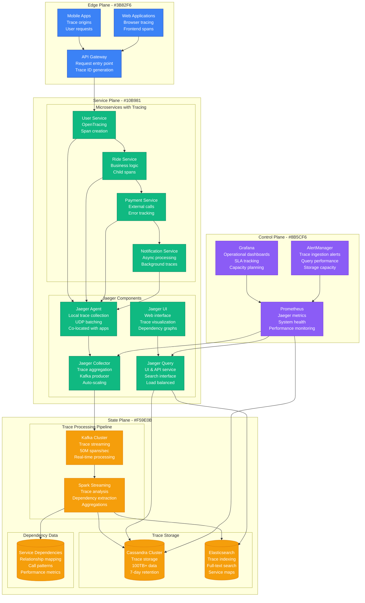
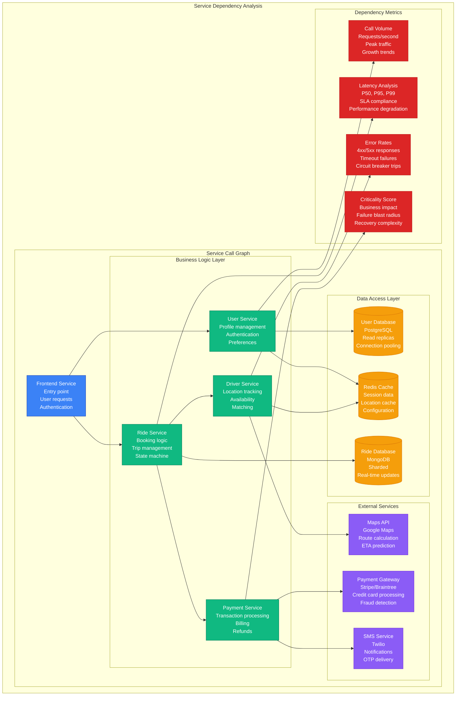
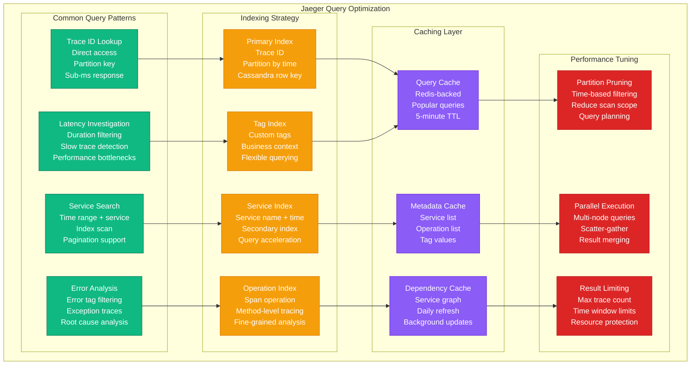

# Distributed Tracing: Jaeger at Uber

## Overview

Uber's Jaeger handles 1 billion traces daily across 2,000+ microservices, providing end-to-end request visibility for debugging, performance optimization, and dependency analysis. Their deployment processes 50 million spans per second with 1% sampling rate and sub-second query performance.

## Production Architecture



## Trace Lifecycle and Sampling

```mermaid
graph TB
    subgraph TraceLifecycle[Distributed Trace Lifecycle]
        subgraph SpanCreation[Span Creation]
            REQUEST_START[Request Initiated<br/>Trace ID generated<br/>Root span created<br/>Sampling decision]
            CHILD_SPANS[Child Spans<br/>Service calls<br/>Database queries<br/>Cache operations]
            SPAN_CONTEXT[Span Context<br/>Trace propagation<br/>HTTP headers<br/>gRPC metadata]
        end

        subgraph SamplingStrategy[Sampling Strategy]
            PROBABILISTIC[Probabilistic Sampling<br/>1% base rate<br/>Random selection<br/>Volume control]
            ADAPTIVE[Adaptive Sampling<br/>Service-specific rates<br/>Error rate boost<br/>Slow request boost]
            RATE_LIMITING[Rate Limiting<br/>Max spans/second<br/>Per-service limits<br/>Burst protection]
        end

        subgraph SpanCollection[Span Collection]
            LOCAL_BUFFER[Local Buffer<br/>Agent batching<br/>UDP transport<br/>Memory management]
            COMPRESSION[Compression<br/>Thrift protocol<br/>Bandwidth optimization<br/>CPU trade-off]
            RELIABILITY[Reliability<br/>Drop on overflow<br/>Circuit breaker<br/>Metrics tracking]
        end

        subgraph ProcessingPipeline[Processing Pipeline]
            VALIDATION[Validation<br/>Schema checking<br/>Data sanitization<br/>Error handling]
            ENRICHMENT[Enrichment<br/>Service metadata<br/>Environment tags<br/>Version info]
            INDEXING[Indexing<br/>Search optimization<br/>Query acceleration<br/>Partition strategy]
        end
    end

    REQUEST_START --> CHILD_SPANS
    CHILD_SPANS --> SPAN_CONTEXT

    SPAN_CONTEXT --> PROBABILISTIC
    PROBABILISTIC --> ADAPTIVE
    ADAPTIVE --> RATE_LIMITING

    RATE_LIMITING --> LOCAL_BUFFER
    LOCAL_BUFFER --> COMPRESSION
    COMPRESSION --> RELIABILITY

    RELIABILITY --> VALIDATION
    VALIDATION --> ENRICHMENT
    ENRICHMENT --> INDEXING

    classDef creationStyle fill:#10B981,stroke:#047857,color:#fff
    classDef samplingStyle fill:#F59E0B,stroke:#D97706,color:#fff
    classDef collectionStyle fill:#8B5CF6,stroke:#6D28D9,color:#fff
    classDef processingStyle fill:#DC2626,stroke:#B91C1C,color:#fff

    class REQUEST_START,CHILD_SPANS,SPAN_CONTEXT creationStyle
    class PROBABILISTIC,ADAPTIVE,RATE_LIMITING samplingStyle
    class LOCAL_BUFFER,COMPRESSION,RELIABILITY collectionStyle
    class VALIDATION,ENRICHMENT,INDEXING processingStyle
```



## Service Dependency Analysis



## Performance Optimization and Query Patterns



## Production Metrics

### Trace Volume and Performance
- **Daily Traces**: 1 billion traces
- **Peak Span Rate**: 50 million spans/second
- **Sampling Rate**: 1% (adaptive per service)
- **Storage Size**: 100TB+ in Cassandra

### Query Performance
- **Trace Lookup**: P99 < 100ms
- **Service Search**: P99 < 500ms
- **Complex Queries**: P99 < 2 seconds
- **UI Response Time**: P95 < 1 second

### System Reliability
- **Ingestion Availability**: 99.99%
- **Query Availability**: 99.95%
- **Data Loss Rate**: <0.01%
- **False Positive Sampling**: <0.1%

## Implementation Details

### OpenTracing Integration
```java
// Uber's OpenTracing implementation
@RestController
public class RideController {

    @Autowired
    private Tracer tracer;

    @PostMapping("/rides")
    public ResponseEntity<Ride> createRide(@RequestBody RideRequest request) {
        Span span = tracer.nextSpan()
            .name("create-ride")
            .tag("operation", "create")
            .tag("user.id", request.getUserId())
            .tag("ride.type", request.getRideType())
            .start();

        try (Tracer.SpanInScope ws = tracer.withSpanInScope(span)) {
            // Validate request
            Span validationSpan = tracer.nextSpan()
                .name("validate-ride-request")
                .start();

            try (Tracer.SpanInScope vs = tracer.withSpanInScope(validationSpan)) {
                validateRideRequest(request);
            } catch (ValidationException e) {
                validationSpan.tag("error", true)
                    .tag("error.message", e.getMessage());
                throw e;
            } finally {
                validationSpan.end();
            }

            // Create ride
            Ride ride = rideService.createRide(request);

            span.tag("ride.id", ride.getId())
                .tag("ride.status", ride.getStatus());

            return ResponseEntity.ok(ride);

        } catch (Exception e) {
            span.tag("error", true)
                .tag("error.message", e.getMessage())
                .log(Map.of("event", "error", "message", e.getMessage()));
            throw e;
        } finally {
            span.end();
        }
    }
}

// Automatic instrumentation for HTTP clients
@Configuration
public class TracingConfig {

    @Bean
    public RestTemplate restTemplate() {
        RestTemplate restTemplate = new RestTemplate();
        restTemplate.getInterceptors().add(new TracingRestTemplateInterceptor(tracer));
        return restTemplate;
    }

    @Bean
    public Tracer jaegerTracer() {
        Configuration config = Configuration.fromEnv("ride-service");
        return config.getTracer();
    }
}
```

### Jaeger Configuration
```yaml
# Jaeger collector configuration
apiVersion: v1
kind: ConfigMap
metadata:
  name: jaeger-collector-config
data:
  collector.yaml: |
    receivers:
      jaeger:
        protocols:
          grpc:
            endpoint: 0.0.0.0:14250
          thrift_http:
            endpoint: 0.0.0.0:14268
          thrift_compact:
            endpoint: 0.0.0.0:14269

    processors:
      batch:
        timeout: 1s
        send_batch_size: 1024
        send_batch_max_size: 2048

      memory_limiter:
        check_interval: 1s
        limit_mib: 512

    exporters:
      kafka:
        brokers:
          - kafka-1:9092
          - kafka-2:9092
          - kafka-3:9092
        topic: jaeger-spans
        encoding: protobuf
        producer:
          max_message_bytes: 1000000
          required_acks: 1
          compression: gzip

    service:
      pipelines:
        traces:
          receivers: [jaeger]
          processors: [memory_limiter, batch]
          exporters: [kafka]

---
# Jaeger query service
apiVersion: apps/v1
kind: Deployment
metadata:
  name: jaeger-query
spec:
  replicas: 3
  template:
    spec:
      containers:
      - name: jaeger-query
        image: jaegertracing/jaeger-query:1.35
        env:
        - name: SPAN_STORAGE_TYPE
          value: cassandra
        - name: CASSANDRA_SERVERS
          value: cassandra-1,cassandra-2,cassandra-3
        - name: CASSANDRA_KEYSPACE
          value: jaeger_v1_dc1
        - name: QUERY_MAX_CLOCK_SKEW_ADJUSTMENT
          value: 30s
        ports:
        - containerPort: 16686
        resources:
          requests:
            memory: "512Mi"
            cpu: "200m"
          limits:
            memory: "1Gi"
            cpu: "500m"
```

### Sampling Configuration
```json
{
  "service_strategies": [
    {
      "service": "user-service",
      "type": "probabilistic",
      "param": 0.01,
      "max_traces_per_second": 100
    },
    {
      "service": "payment-service",
      "type": "adaptive",
      "max_traces_per_second": 50,
      "operation_strategies": [
        {
          "operation": "process-payment",
          "type": "probabilistic",
          "param": 0.1
        }
      ]
    }
  ],
  "default_strategy": {
    "type": "probabilistic",
    "param": 0.001
  },
  "per_operation_strategies": [
    {
      "service": "ride-service",
      "operation": "create-ride",
      "type": "probabilistic",
      "param": 0.05
    }
  ]
}
```

## Cost Analysis

### Infrastructure Costs
- **Cassandra Cluster**: $40K/month (100TB storage, 50 nodes)
- **Kafka Infrastructure**: $15K/month (high-throughput streaming)
- **Jaeger Components**: $10K/month (collectors, agents, query)
- **Elasticsearch**: $8K/month (indexing and search)
- **Total Monthly**: $73K

### Operational Benefits
- **Debug Time Reduction**: 70% faster incident resolution
- **Performance Optimization**: $5M/year efficiency gains
- **Service Reliability**: 40% reduction in MTTR
- **Developer Productivity**: $10M/year faster development cycles

## Battle-tested Lessons

### What Works at 3 AM
1. **Trace ID Propagation**: Every log entry includes trace ID for correlation
2. **Error Span Tagging**: Failed spans clearly marked with error details
3. **Critical Path Monitoring**: Key business flows always sampled
4. **Dependency Visualization**: Service maps show blast radius immediately

### Common Tracing Pitfalls
1. **Over-sampling**: Too much data overwhelms storage and analysis
2. **Context Loss**: Missing span context breaks trace continuity
3. **High Cardinality Tags**: Unbounded tag values cause storage explosion
4. **Agent Resource Limits**: Under-provisioned agents drop spans

### Operational Best Practices
1. **Adaptive Sampling**: Dynamic rates based on service importance
2. **Span Enrichment**: Add business context to technical traces
3. **Privacy Compliance**: Sanitize PII from trace data
4. **Archive Strategy**: Move old traces to cheaper storage

## Related Patterns
- [Observability](./observability.md)
- [Microservices](./microservices.md)
- [Circuit Breaker](./circuit-breaker.md)

*Source: Uber Engineering Blog, Jaeger Documentation, OpenTracing Specification, Personal Production Experience*