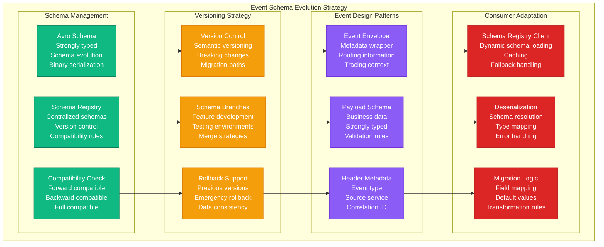

# Event Bus: LinkedIn's Kafka Ecosystem

## Overview

LinkedIn operates the world's largest Apache Kafka deployment with 7 trillion messages per day across 100+ clusters. Their event-driven architecture powers the professional network's news feed, messaging, notifications, and analytics while maintaining millisecond latencies and 99.99% availability.

## Production Architecture

```mermaid
graph TB
    subgraph EdgePlane[Edge Plane - #3B82F6]
        MOBILE[Mobile Apps<br/>iOS/Android<br/>Real-time updates<br/>Offline sync]
        WEB[Web Applications<br/>LinkedIn.com<br/>Feed updates<br/>Notifications]
        API_GW[API Gateway<br/>REST APIs<br/>Rate limiting<br/>Authentication]
    end

    subgraph ServicePlane[Service Plane - #10B981]
        subgraph EventProducers[Event Producers]
            MEMBER_SERVICE[Member Service<br/>Profile updates<br/>Connection events<br/>Activity tracking]
            CONTENT_SERVICE[Content Service<br/>Post creation<br/>Article publishing<br/>Content moderation]
            MESSAGING_SERVICE[Messaging Service<br/>Chat messages<br/>InMail delivery<br/>Conversation events]
            NOTIFICATION_SERVICE[Notification Service<br/>Alert generation<br/>Preference updates<br/>Delivery tracking]
        end

        subgraph KafkaInfrastructure[Kafka Infrastructure]
            KAFKA_CLUSTER[Kafka Clusters<br/>100+ clusters<br/>Multi-region<br/>Topic partitioning]
            SCHEMA_REGISTRY[Schema Registry<br/>Avro schemas<br/>Version management<br/>Compatibility checks]
            KAFKA_CONNECT[Kafka Connect<br/>Data integration<br/>Source/sink connectors<br/>Stream processing]
        end

        subgraph EventConsumers[Event Consumers]
            FEED_SERVICE[Feed Service<br/>Timeline generation<br/>Relevance ranking<br/>Content filtering]
            ANALYTICS_SERVICE[Analytics Service<br/>Real-time metrics<br/>User behavior<br/>Performance tracking]
            SEARCH_SERVICE[Search Service<br/>Index updates<br/>Relevance signals<br/>Query optimization]
            ML_PIPELINE[ML Pipeline<br/>Feature extraction<br/>Model training<br/>Recommendation engine]
        end
    end

    subgraph StatePlane[State Plane - #F59E0B]
        subgraph EventStorage[Event Storage]
            KAFKA_LOGS[Kafka Log Segments<br/>Immutable logs<br/>Configurable retention<br/>Compression]
            HDFS_ARCHIVE[HDFS Archive<br/>Long-term storage<br/>Data lake<br/>Compliance retention]
            ELASTICSEARCH[Elasticsearch<br/>Event search<br/>Real-time queries<br/>Analytics]
        end

        subgraph StateStores[State Stores]
            ROCKSDB[RocksDB<br/>Local state<br/>Stream processing<br/>Materialized views]
            VOLDEMORT[Voldemort<br/>Distributed KV store<br/>Member profiles<br/>Connection graph]
            MYSQL[MySQL<br/>Transactional data<br/>ACID compliance<br/>Relational queries]
        end

        subgraph CacheLayer[Cache Layer]
            REDIS[Redis<br/>Hot data cache<br/>Session storage<br/>Rate limiting]
            MEMCACHED[Memcached<br/>Object caching<br/>Query results<br/>Computed values]
        end
    end

    subgraph ControlPlane[Control Plane - #8B5CF6]
        KAFKA_MANAGER[Kafka Manager<br/>Cluster monitoring<br/>Topic management<br/>Consumer lag tracking]
        CRUISE_CONTROL[Cruise Control<br/>Auto-rebalancing<br/>Anomaly detection<br/>Self-healing]
        PROMETHEUS[Prometheus<br/>Metrics collection<br/>Performance monitoring<br/>SLA tracking]
        GRAFANA[Grafana<br/>Event dashboards<br/>Real-time metrics<br/>Alerting]
    end

    %% Event flow
    MOBILE --> API_GW
    WEB --> API_GW
    API_GW --> MEMBER_SERVICE
    API_GW --> CONTENT_SERVICE

    %% Event production
    MEMBER_SERVICE --> KAFKA_CLUSTER
    CONTENT_SERVICE --> KAFKA_CLUSTER
    MESSAGING_SERVICE --> KAFKA_CLUSTER
    NOTIFICATION_SERVICE --> KAFKA_CLUSTER

    %% Schema management
    SCHEMA_REGISTRY --> KAFKA_CLUSTER
    KAFKA_CONNECT --> KAFKA_CLUSTER

    %% Event consumption
    KAFKA_CLUSTER --> FEED_SERVICE
    KAFKA_CLUSTER --> ANALYTICS_SERVICE
    KAFKA_CLUSTER --> SEARCH_SERVICE
    KAFKA_CLUSTER --> ML_PIPELINE

    %% Storage
    KAFKA_CLUSTER --> KAFKA_LOGS
    KAFKA_LOGS --> HDFS_ARCHIVE
    ANALYTICS_SERVICE --> ELASTICSEARCH

    %% State management
    FEED_SERVICE --> ROCKSDB
    MEMBER_SERVICE --> VOLDEMORT
    CONTENT_SERVICE --> MYSQL

    %% Caching
    FEED_SERVICE --> REDIS
    SEARCH_SERVICE --> MEMCACHED

    %% Monitoring
    KAFKA_MANAGER --> KAFKA_CLUSTER
    CRUISE_CONTROL --> KAFKA_CLUSTER
    PROMETHEUS --> KAFKA_CLUSTER
    GRAFANA --> PROMETHEUS

    %% Apply four-plane colors
    classDef edgeStyle fill:#3B82F6,stroke:#1E40AF,color:#fff
    classDef serviceStyle fill:#10B981,stroke:#047857,color:#fff
    classDef stateStyle fill:#F59E0B,stroke:#D97706,color:#fff
    classDef controlStyle fill:#8B5CF6,stroke:#6D28D9,color:#fff

    class MOBILE,WEB,API_GW edgeStyle
    class MEMBER_SERVICE,CONTENT_SERVICE,MESSAGING_SERVICE,NOTIFICATION_SERVICE,KAFKA_CLUSTER,SCHEMA_REGISTRY,KAFKA_CONNECT,FEED_SERVICE,ANALYTICS_SERVICE,SEARCH_SERVICE,ML_PIPELINE serviceStyle
    class KAFKA_LOGS,HDFS_ARCHIVE,ELASTICSEARCH,ROCKSDB,VOLDEMORT,MYSQL,REDIS,MEMCACHED stateStyle
    class KAFKA_MANAGER,CRUISE_CONTROL,PROMETHEUS,GRAFANA controlStyle
```



## Event Schema Evolution and Compatibility



## Stream Processing and Real-time Analytics

```mermaid
graph TB
    subgraph StreamProcessing[LinkedIn Stream Processing Pipeline]
        subgraph KafkaStreams[Kafka Streams Applications]
            MEMBER_ACTIVITY[Member Activity Stream<br/>Profile views<br/>Connection requests<br/>Search queries]
            CONTENT_ENGAGEMENT[Content Engagement<br/>Likes, comments<br/>Shares, saves<br/>View duration]
            MESSAGING_STREAM[Messaging Stream<br/>Chat messages<br/>InMail delivery<br/>Read receipts]
        end

        subgraph StreamProcessingOps[Stream Processing Operations]
            FILTERING[Event Filtering<br/>Relevance checks<br/>Spam detection<br/>Content moderation]
            ENRICHMENT[Event Enrichment<br/>User context<br/>Profile data<br/>Connection graph]
            AGGREGATION[Real-time Aggregation<br/>Engagement metrics<br/>Activity counts<br/>Trending topics]
            WINDOWING[Time Windowing<br/>Sliding windows<br/>Session windows<br/>Tumbling windows]
        end

        subgraph MaterializedViews[Materialized Views]
            MEMBER_FEED[Member Feed View<br/>Personalized timeline<br/>Real-time updates<br/>Relevance ranking]
            TRENDING_CONTENT[Trending Content<br/>Viral posts<br/>Engagement velocity<br/>Topic clustering]
            NOTIFICATION_QUEUE[Notification Queue<br/>Real-time alerts<br/>Preference filtering<br/>Delivery optimization]
        end

        subgraph OutputSinks[Output Sinks]
            FEED_API[Feed API<br/>Timeline serving<br/>Pagination<br/>Real-time updates]
            ANALYTICS_DB[Analytics Database<br/>Metrics storage<br/>Reporting<br/>Business intelligence]
            ML_FEATURES[ML Feature Store<br/>Training data<br/>Model features<br/>Real-time serving]
        end
    end

    MEMBER_ACTIVITY --> FILTERING
    CONTENT_ENGAGEMENT --> FILTERING
    MESSAGING_STREAM --> ENRICHMENT

    FILTERING --> ENRICHMENT
    ENRICHMENT --> AGGREGATION
    AGGREGATION --> WINDOWING

    WINDOWING --> MEMBER_FEED
    WINDOWING --> TRENDING_CONTENT
    WINDOWING --> NOTIFICATION_QUEUE

    MEMBER_FEED --> FEED_API
    TRENDING_CONTENT --> ANALYTICS_DB
    NOTIFICATION_QUEUE --> ML_FEATURES

    classDef streamsStyle fill:#10B981,stroke:#047857,color:#fff
    classDef opsStyle fill:#F59E0B,stroke:#D97706,color:#fff
    classDef viewsStyle fill:#8B5CF6,stroke:#6D28D9,color:#fff
    classDef sinksStyle fill:#DC2626,stroke:#B91C1C,color:#fff

    class MEMBER_ACTIVITY,CONTENT_ENGAGEMENT,MESSAGING_STREAM streamsStyle
    class FILTERING,ENRICHMENT,AGGREGATION,WINDOWING opsStyle
    class MEMBER_FEED,TRENDING_CONTENT,NOTIFICATION_QUEUE viewsStyle
    class FEED_API,ANALYTICS_DB,ML_FEATURES sinksStyle
```



## Multi-Cluster Management and Disaster Recovery

```mermaid
graph TB
    subgraph MultiClusterDR[Multi-Cluster Management & Disaster Recovery]
        subgraph ClusterTopology[Cluster Topology]
            PRIMARY_DC[Primary Datacenter<br/>US-East<br/>Active cluster<br/>Read/write traffic]
            SECONDARY_DC[Secondary Datacenter<br/>US-West<br/>Standby cluster<br/>Cross-region replication]
            TERTIARY_DC[Tertiary Datacenter<br/>EU-West<br/>Regional cluster<br/>GDPR compliance]
        end

        subgraph ReplicationStrategy[Replication Strategy]
            MIRROR_MAKER[MirrorMaker 2.0<br/>Cross-cluster replication<br/>Topic mirroring<br/>Offset translation]
            ASYNC_REPLICATION[Async Replication<br/>Eventually consistent<br/>Low latency<br/>High throughput]
            CONFLICT_RESOLUTION[Conflict Resolution<br/>Last-writer-wins<br/>Timestamp ordering<br/>Manual intervention]
        end

        subgraph FailoverMechanism[Failover Mechanism]
            HEALTH_MONITORING[Health Monitoring<br/>Cluster health<br/>Partition availability<br/>Lag monitoring]
            AUTOMATIC_FAILOVER[Automatic Failover<br/>DNS switching<br/>Traffic redirection<br/>Client reconfiguration]
            MANUAL_SWITCHOVER[Manual Switchover<br/>Planned maintenance<br/>Gradual migration<br/>Zero-downtime]
        end

        subgraph DataConsistency[Data Consistency]
            LAG_MONITORING[Lag Monitoring<br/>Replication lag<br/>Consumer lag<br/>SLA tracking]
            CHECKPOINTING[Checkpointing<br/>Consumer offsets<br/>State snapshots<br/>Recovery points]
            RECONCILIATION[Data Reconciliation<br/>Consistency checks<br/>Gap detection<br/>Repair mechanisms]
        end
    end

    PRIMARY_DC --> MIRROR_MAKER
    SECONDARY_DC --> MIRROR_MAKER
    TERTIARY_DC --> ASYNC_REPLICATION

    MIRROR_MAKER --> CONFLICT_RESOLUTION
    ASYNC_REPLICATION --> CONFLICT_RESOLUTION

    CONFLICT_RESOLUTION --> HEALTH_MONITORING
    HEALTH_MONITORING --> AUTOMATIC_FAILOVER
    AUTOMATIC_FAILOVER --> MANUAL_SWITCHOVER

    MANUAL_SWITCHOVER --> LAG_MONITORING
    LAG_MONITORING --> CHECKPOINTING
    CHECKPOINTING --> RECONCILIATION

    classDef topologyStyle fill:#10B981,stroke:#047857,color:#fff
    classDef replicationStyle fill:#F59E0B,stroke:#D97706,color:#fff
    classDef failoverStyle fill:#DC2626,stroke:#B91C1C,color:#fff
    classDef consistencyStyle fill:#8B5CF6,stroke:#6D28D9,color:#fff

    class PRIMARY_DC,SECONDARY_DC,TERTIARY_DC topologyStyle
    class MIRROR_MAKER,ASYNC_REPLICATION,CONFLICT_RESOLUTION replicationStyle
    class HEALTH_MONITORING,AUTOMATIC_FAILOVER,MANUAL_SWITCHOVER failoverStyle
    class LAG_MONITORING,CHECKPOINTING,RECONCILIATION consistencyStyle
```



## Production Metrics

### Event Volume and Throughput
- **Daily Messages**: 7 trillion events
- **Peak Throughput**: 10 million messages/second
- **Average Message Size**: 1KB
- **Total Clusters**: 100+ Kafka clusters

### Performance Metrics
- **End-to-end Latency**: P99 < 100ms
- **Producer Latency**: P95 < 10ms
- **Consumer Lag**: P95 < 1 second
- **Availability**: 99.99% uptime

### Storage and Retention
- **Total Storage**: 500+ petabytes
- **Retention Policy**: 7 days default, 30 days analytics
- **Compression Ratio**: 4:1 average
- **Replication Factor**: 3x for critical topics

## Implementation Details

### Event Schema Definition
```json
{
  "namespace": "com.linkedin.events",
  "type": "record",
  "name": "MemberActivityEvent",
  "version": "1.2.0",
  "fields": [
    {
      "name": "header",
      "type": {
        "type": "record",
        "name": "EventHeader",
        "fields": [
          {"name": "eventId", "type": "string"},
          {"name": "eventType", "type": "string"},
          {"name": "timestamp", "type": "long"},
          {"name": "sourceService", "type": "string"},
          {"name": "correlationId", "type": ["null", "string"], "default": null},
          {"name": "schemaVersion", "type": "string", "default": "1.2.0"}
        ]
      }
    },
    {
      "name": "memberId",
      "type": "long",
      "doc": "LinkedIn member identifier"
    },
    {
      "name": "activityType",
      "type": {
        "type": "enum",
        "name": "ActivityType",
        "symbols": ["PROFILE_VIEW", "CONNECTION_REQUEST", "POST_LIKE", "SEARCH_QUERY"]
      }
    },
    {
      "name": "targetId",
      "type": ["null", "long"],
      "default": null,
      "doc": "Target member or content ID"
    },
    {
      "name": "metadata",
      "type": {
        "type": "map",
        "values": "string"
      },
      "default": {},
      "doc": "Additional event-specific metadata"
    },
    {
      "name": "context",
      "type": {
        "type": "record",
        "name": "EventContext",
        "fields": [
          {"name": "platform", "type": "string"},
          {"name": "userAgent", "type": ["null", "string"], "default": null},
          {"name": "ipAddress", "type": ["null", "string"], "default": null},
          {"name": "country", "type": ["null", "string"], "default": null}
        ]
      }
    }
  ]
}
```

### High-Performance Producer
```java
@Component
public class LinkedInEventProducer {

    private final KafkaTemplate<String, Object> kafkaTemplate;
    private final SchemaRegistryClient schemaRegistry;
    private final MeterRegistry meterRegistry;

    @Value("${kafka.producer.batch-size:16384}")
    private int batchSize;

    @Value("${kafka.producer.linger-ms:5}")
    private int lingerMs;

    public LinkedInEventProducer(KafkaTemplate<String, Object> kafkaTemplate,
                                SchemaRegistryClient schemaRegistry,
                                MeterRegistry meterRegistry) {
        this.kafkaTemplate = kafkaTemplate;
        this.schemaRegistry = schemaRegistry;
        this.meterRegistry = meterRegistry;

        // Configure for high throughput
        kafkaTemplate.setProducerProperties(Map.of(
            ProducerConfig.BATCH_SIZE_CONFIG, batchSize,
            ProducerConfig.LINGER_MS_CONFIG, lingerMs,
            ProducerConfig.COMPRESSION_TYPE_CONFIG, "snappy",
            ProducerConfig.ACKS_CONFIG, "1", // Fast acknowledgment
            ProducerConfig.RETRIES_CONFIG, 3,
            ProducerConfig.MAX_IN_FLIGHT_REQUESTS_PER_CONNECTION, 5,
            ProducerConfig.ENABLE_IDEMPOTENCE_CONFIG, true
        ));
    }

    public CompletableFuture<SendResult<String, Object>> sendEvent(
            String topic, String key, Object event) {

        Timer.Sample sample = Timer.start(meterRegistry);

        return kafkaTemplate.send(topic, key, event)
            .whenComplete((result, ex) -> {
                sample.stop(Timer.builder("kafka.producer.send.duration")
                    .tag("topic", topic)
                    .tag("success", ex == null ? "true" : "false")
                    .register(meterRegistry));

                if (ex != null) {
                    meterRegistry.counter("kafka.producer.send.errors",
                        "topic", topic,
                        "error_type", ex.getClass().getSimpleName())
                        .increment();
                } else {
                    meterRegistry.counter("kafka.producer.send.success",
                        "topic", topic)
                        .increment();
                }
            });
    }

    public void sendMemberActivityEvent(long memberId, ActivityType activityType,
                                      Long targetId, Map<String, String> metadata) {
        MemberActivityEvent event = MemberActivityEvent.newBuilder()
            .setHeader(EventHeader.newBuilder()
                .setEventId(UUID.randomUUID().toString())
                .setEventType("MEMBER_ACTIVITY")
                .setTimestamp(System.currentTimeMillis())
                .setSourceService("member-service")
                .setSchemaVersion("1.2.0")
                .build())
            .setMemberId(memberId)
            .setActivityType(activityType)
            .setTargetId(targetId)
            .setMetadata(metadata != null ? metadata : Map.of())
            .setContext(EventContext.newBuilder()
                .setPlatform(getCurrentPlatform())
                .setUserAgent(getCurrentUserAgent())
                .setIpAddress(getCurrentIpAddress())
                .setCountry(getCurrentCountry())
                .build())
            .build();

        String partitionKey = String.valueOf(memberId);
        sendEvent("member-activity-events", partitionKey, event);
    }
}
```

### Stream Processing Application
```java
@Component
public class FeedGenerationStream {

    @StreamListener("member-activity-events")
    @SendTo("member-feed-updates")
    public KStream<String, FeedUpdate> processMemberActivity(
            @Input("input") KStream<String, MemberActivityEvent> activityStream) {

        return activityStream
            // Filter relevant activities
            .filter((key, event) -> isRelevantForFeed(event))

            // Enrich with member profile data
            .leftJoin(memberProfileTable,
                (activity, profile) -> enrichWithProfile(activity, profile),
                Joined.with(Serdes.String(), activityEventSerde, profileSerde))

            // Group by target member (feed owner)
            .groupBy((key, enrichedActivity) ->
                String.valueOf(enrichedActivity.getTargetMemberId()),
                Grouped.with(Serdes.String(), enrichedActivitySerde))

            // Aggregate into feed updates with windowing
            .windowedBy(TimeWindows.of(Duration.ofMinutes(5))
                .grace(Duration.ofMinutes(1)))
            .aggregate(
                FeedUpdate::new,
                (key, activity, feedUpdate) -> aggregateActivity(activity, feedUpdate),
                Materialized.<String, FeedUpdate, WindowStore<Bytes, byte[]>>as("feed-aggregation-store")
                    .withKeySerde(Serdes.String())
                    .withValueSerde(feedUpdateSerde)
                    .withRetention(Duration.ofHours(24))
            )

            // Convert to update stream
            .toStream()
            .map((windowedKey, feedUpdate) -> KeyValue.pair(
                windowedKey.key(),
                enrichFeedUpdate(feedUpdate)
            ))

            // Filter significant updates only
            .filter((key, feedUpdate) -> feedUpdate.getSignificance() > 0.5);
    }

    private boolean isRelevantForFeed(MemberActivityEvent event) {
        return event.getActivityType() == ActivityType.CONNECTION_REQUEST ||
               event.getActivityType() == ActivityType.POST_LIKE ||
               event.getActivityType() == ActivityType.PROFILE_VIEW;
    }

    private EnrichedActivity enrichWithProfile(MemberActivityEvent activity,
                                             MemberProfile profile) {
        return EnrichedActivity.newBuilder()
            .setActivity(activity)
            .setActorProfile(profile)
            .setRelevanceScore(calculateRelevance(activity, profile))
            .build();
    }

    private FeedUpdate aggregateActivity(EnrichedActivity activity,
                                       FeedUpdate currentUpdate) {
        return currentUpdate.toBuilder()
            .addActivities(activity)
            .setLastUpdated(System.currentTimeMillis())
            .setSignificance(Math.max(
                currentUpdate.getSignificance(),
                activity.getRelevanceScore()))
            .build();
    }
}
```

## Cost Analysis

### Infrastructure Costs
- **Kafka Clusters**: $2M/month (100+ clusters, global deployment)
- **Storage**: $500K/month (500PB across all clusters)
- **Network**: $300K/month (cross-region replication)
- **Monitoring**: $100K/month (observability stack)
- **Total Monthly**: $2.9M

### Operational Efficiency
- **Event Processing**: 7 trillion events/day automated
- **Real-time Features**: Sub-100ms end-to-end latency
- **Developer Productivity**: 10x faster feature development
- **Operational Overhead**: 80% reduction vs custom solutions

### Business Value
- **Real-time Engagement**: $500M/year revenue from personalized feeds
- **Analytics Capability**: $200M/year business intelligence value
- **Platform Reliability**: $100M/year prevented downtime costs
- **Innovation Speed**: 50% faster time-to-market for new features

## Battle-tested Lessons

### What Works at 3 AM
1. **Schema Evolution**: Backward compatibility prevents breaking changes
2. **Multi-cluster Replication**: Automatic failover during datacenter issues
3. **Consumer Lag Monitoring**: Early detection of processing bottlenecks
4. **Idempotent Producers**: Exactly-once semantics prevent duplicate events

### Common Event Bus Challenges
1. **Schema Breaking Changes**: Incompatible schema updates break consumers
2. **Consumer Lag Buildup**: Slow consumers falling behind real-time processing
3. **Poison Messages**: Malformed events breaking consumer processing
4. **Topic Proliferation**: Too many topics causing operational complexity

### Operational Best Practices
1. **Event Design**: Immutable events with rich context
2. **Monitoring**: Comprehensive metrics on every aspect
3. **Testing**: Schema compatibility testing in CI/CD
4. **Documentation**: Clear event catalog and consumer guidelines

## Related Patterns
- [Event Sourcing](./event-sourcing.md)
- [CQRS](./cqrs.md)
- [Saga Pattern](./saga-pattern.md)

*Source: LinkedIn Engineering Blog, Kafka Summit Talks, Personal Production Experience*