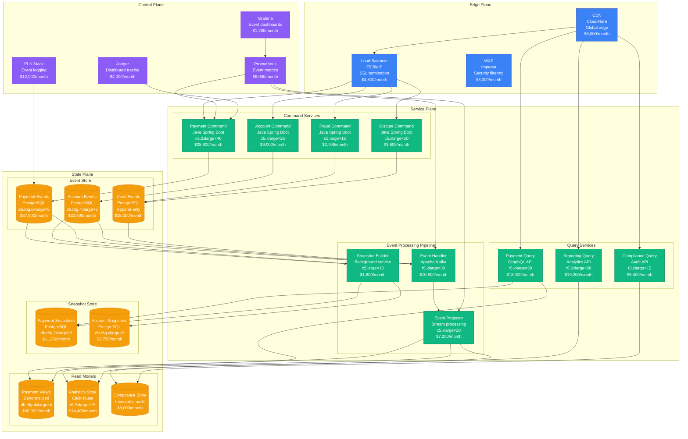
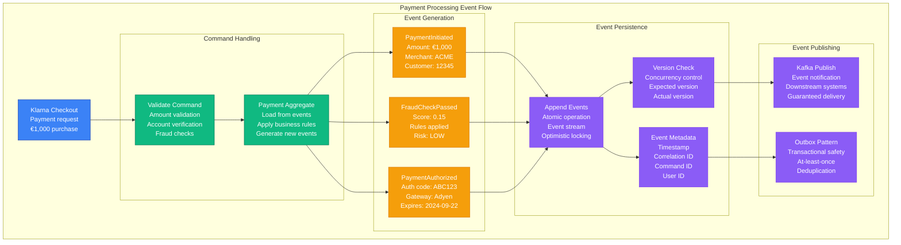
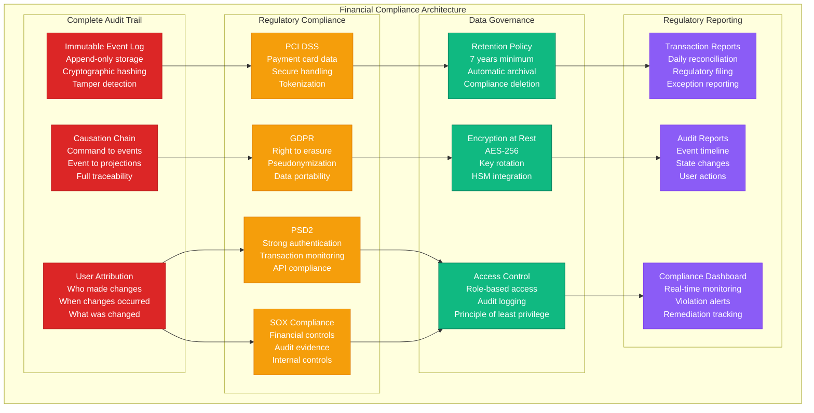

# Event Sourcing Pattern: Klarna's Implementation

## Pattern Overview

Klarna implements Event Sourcing to handle **250 million+ payment transactions** annually with complete audit trails, supporting **150+ million consumers** across **45 countries** with immutable financial records and point-in-time reconstruction capabilities.

## Production Implementation Architecture



## Event Sourcing Workflow



## Event Store Schema & Replay

```mermaid
graph TB
    subgraph EventStoreStructure[Event Store Schema Design]
        subgraph EventTable[events Table]
            EVENT_ID[event_id<br/>UUID<br/>Primary key]
            AGGREGATE_ID[aggregate_id<br/>UUID<br/>Payment/Account ID]
            EVENT_TYPE[event_type<br/>VARCHAR<br/>PaymentInitiated]
            EVENT_DATA[event_data<br/>JSONB<br/>Event payload]
            EVENT_VERSION[event_version<br/>INTEGER<br/>Aggregate version]
            TIMESTAMP[timestamp<br/>TIMESTAMP<br/>Event occurrence]
            CORRELATION_ID[correlation_id<br/>UUID<br/>Request tracking]
        end

        subgraph Partitioning[Partitioning Strategy]
            TIME_PARTITION[Time-based<br/>Monthly partitions<br/>Improved performance]
            AGGREGATE_PARTITION[Aggregate-based<br/>Shard by ID<br/>Parallel processing]
            RETENTION[Retention Policy<br/>7 years financial<br/>Compliance requirement]
        end

        subgraph Indexing[Indexing Strategy]
            AGGREGATE_INDEX[Index on aggregate_id<br/>Fast event loading<br/>Version ordering]
            TIME_INDEX[Index on timestamp<br/>Time-range queries<br/>Audit reporting]
            TYPE_INDEX[Index on event_type<br/>Event filtering<br/>Projection building]
        end
    end

    subgraph EventReplay[Event Replay Capabilities]
        subgraph ReplayTypes[Replay Types]
            AGGREGATE_REPLAY[Aggregate Replay<br/>Single payment<br/>State reconstruction]
            PROJECTION_REPLAY[Projection Replay<br/>Read model rebuild<br/>New view creation]
            TEMPORAL_REPLAY[Temporal Replay<br/>Point-in-time<br/>Historical analysis]
        end

        subgraph ReplayOptimization[Replay Optimization]
            SNAPSHOT_USAGE[Snapshot Usage<br/>Every 100 events<br/>Faster loading]
            PARALLEL_REPLAY[Parallel Replay<br/>Multiple aggregates<br/>Concurrent processing]
            INCREMENTAL_REPLAY[Incremental Replay<br/>Delta updates<br/>Efficient refresh]
        end

        subgraph ReplayMonitoring[Replay Monitoring]
            PROGRESS_TRACKING[Progress Tracking<br/>Events processed<br/>ETA calculation]
            ERROR_HANDLING[Error Handling<br/>Failed events<br/>Retry strategy]
            PERFORMANCE_METRICS[Performance Metrics<br/>Events per second<br/>Memory usage]
        end
    end

    EVENT_ID --> TIME_PARTITION
    AGGREGATE_ID --> AGGREGATE_PARTITION
    TIMESTAMP --> RETENTION

    AGGREGATE_INDEX --> AGGREGATE_REPLAY
    TIME_INDEX --> TEMPORAL_REPLAY
    TYPE_INDEX --> PROJECTION_REPLAY

    SNAPSHOT_USAGE --> PARALLEL_REPLAY
    PARALLEL_REPLAY --> INCREMENTAL_REPLAY

    PROGRESS_TRACKING --> ERROR_HANDLING
    ERROR_HANDLING --> PERFORMANCE_METRICS

    classDef schemaStyle fill:#10B981,stroke:#047857,color:#fff
    classDef partitionStyle fill:#F59E0B,stroke:#D97706,color:#fff
    classDef replayStyle fill:#8B5CF6,stroke:#7C3AED,color:#fff
    classDef monitorStyle fill:#DC2626,stroke:#B91C1C,color:#fff

    class EVENT_ID,AGGREGATE_ID,EVENT_TYPE,EVENT_DATA,EVENT_VERSION,TIMESTAMP,CORRELATION_ID,AGGREGATE_INDEX,TIME_INDEX,TYPE_INDEX schemaStyle
    class TIME_PARTITION,AGGREGATE_PARTITION,RETENTION partitionStyle
    class AGGREGATE_REPLAY,PROJECTION_REPLAY,TEMPORAL_REPLAY,SNAPSHOT_USAGE,PARALLEL_REPLAY,INCREMENTAL_REPLAY replayStyle
    class PROGRESS_TRACKING,ERROR_HANDLING,PERFORMANCE_METRICS monitorStyle
```



## Compliance & Audit Capabilities



## Production Metrics & Performance

### Scale Numbers (2024)
- **Payment Transactions**: 250+ million annually
- **Events Generated**: 2+ billion events/year
- **Active Accounts**: 150+ million consumers
- **Countries Served**: 45 countries
- **Event Write Throughput**: 50,000 events/second peak
- **Event Read Throughput**: 200,000 events/second
- **Aggregate Reconstruction**: <100ms for 1000 events

### Cost Breakdown (Monthly)
```
Command Services:            $44,100
Query Services:              $42,600
Event Processing:            $19,800
Event Store (PostgreSQL):    $75,000
Snapshots:                   $15,000
Read Models:                 $52,400
Monitoring & Logging:        $23,200
CDN & Load Balancing:        $15,500
------------------------
Total Monthly Cost:         $287,600
Cost per Transaction:       $0.014
```

### Performance Metrics
- **Event Append Latency**: p99 < 10ms
- **Aggregate Load Time**: p99 < 50ms (with snapshots)
- **Projection Update Lag**: p99 < 200ms
- **Snapshot Creation**: Every 100 events or 1 hour
- **Event Store Availability**: 99.99%

## Configuration Examples

### Event Store Implementation
```java
// Event Store implementation in Java
@Entity
@Table(name = "events",
       indexes = {
           @Index(name = "idx_aggregate_id_version", columnList = "aggregate_id, event_version"),
           @Index(name = "idx_timestamp", columnList = "timestamp"),
           @Index(name = "idx_event_type", columnList = "event_type")
       })
public class EventRecord {
    @Id
    private UUID eventId;

    @Column(nullable = false)
    private UUID aggregateId;

    @Column(nullable = false)
    private String eventType;

    @Column(columnDefinition = "jsonb", nullable = false)
    @Type(type = "jsonb")
    private String eventData;

    @Column(nullable = false)
    private Long eventVersion;

    @Column(nullable = false)
    private Instant timestamp;

    @Column(nullable = false)
    private UUID correlationId;

    @Column
    private UUID causationId;

    @Column(nullable = false)
    private String userId;

    // Constructors, getters, setters
}

@Repository
public class EventStore {

    @Autowired
    private EventRecordRepository eventRepository;

    @Transactional
    public void appendEvents(UUID aggregateId, long expectedVersion,
                           List<DomainEvent> events, CommandMetadata metadata) {

        // Optimistic concurrency check
        long currentVersion = getCurrentVersion(aggregateId);
        if (currentVersion != expectedVersion) {
            throw new ConcurrencyException(
                String.format("Expected version %d, but was %d", expectedVersion, currentVersion)
            );
        }

        // Convert domain events to event records
        List<EventRecord> eventRecords = new ArrayList<>();
        for (int i = 0; i < events.size(); i++) {
            DomainEvent event = events.get(i);
            EventRecord record = new EventRecord(
                UUID.randomUUID(),
                aggregateId,
                event.getClass().getSimpleName(),
                serializeEvent(event),
                expectedVersion + i + 1,
                Instant.now(),
                metadata.getCorrelationId(),
                metadata.getCausationId(),
                metadata.getUserId()
            );
            eventRecords.add(record);
        }

        // Atomic append
        eventRepository.saveAll(eventRecords);

        // Publish events to message bus
        publishEvents(eventRecords);
    }

    public List<DomainEvent> getEvents(UUID aggregateId, long fromVersion) {
        List<EventRecord> records = eventRepository
            .findByAggregateIdAndEventVersionGreaterThanOrderByEventVersion(
                aggregateId, fromVersion);

        return records.stream()
            .map(this::deserializeEvent)
            .collect(Collectors.toList());
    }

    public List<DomainEvent> getEvents(UUID aggregateId) {
        return getEvents(aggregateId, 0L);
    }

    private long getCurrentVersion(UUID aggregateId) {
        return eventRepository
            .findMaxVersionByAggregateId(aggregateId)
            .orElse(0L);
    }

    private String serializeEvent(DomainEvent event) {
        try {
            return objectMapper.writeValueAsString(event);
        } catch (JsonProcessingException e) {
            throw new SerializationException("Failed to serialize event", e);
        }
    }

    private DomainEvent deserializeEvent(EventRecord record) {
        try {
            Class<?> eventClass = Class.forName("com.klarna.events." + record.getEventType());
            return (DomainEvent) objectMapper.readValue(record.getEventData(), eventClass);
        } catch (Exception e) {
            throw new DeserializationException("Failed to deserialize event", e);
        }
    }
}
```

### Aggregate Root with Event Sourcing
```java
// Payment aggregate with event sourcing
public class Payment extends AggregateRoot {
    private UUID paymentId;
    private UUID customerId;
    private UUID merchantId;
    private Money amount;
    private PaymentStatus status;
    private Instant createdAt;
    private List<PaymentEvent> pendingEvents = new ArrayList<>();

    // Private constructor for reconstitution
    private Payment() {}

    // Factory method for new payments
    public static Payment initiate(UUID paymentId, UUID customerId,
                                 UUID merchantId, Money amount, UUID correlationId) {
        Payment payment = new Payment();

        PaymentInitiated event = new PaymentInitiated(
            paymentId, customerId, merchantId, amount, Instant.now()
        );

        payment.apply(event);
        payment.markNew(event);

        return payment;
    }

    // Business method
    public void authorize(String authorizationCode, Instant expiresAt) {
        if (status != PaymentStatus.INITIATED) {
            throw new IllegalStateException("Payment must be initiated to authorize");
        }

        PaymentAuthorized event = new PaymentAuthorized(
            paymentId, authorizationCode, expiresAt, Instant.now()
        );

        apply(event);
        markNew(event);
    }

    public void capture(Money captureAmount) {
        if (status != PaymentStatus.AUTHORIZED) {
            throw new IllegalStateException("Payment must be authorized to capture");
        }

        if (captureAmount.isGreaterThan(amount)) {
            throw new IllegalArgumentException("Capture amount cannot exceed authorized amount");
        }

        PaymentCaptured event = new PaymentCaptured(
            paymentId, captureAmount, Instant.now()
        );

        apply(event);
        markNew(event);
    }

    // Event application methods
    private void apply(PaymentInitiated event) {
        this.paymentId = event.getPaymentId();
        this.customerId = event.getCustomerId();
        this.merchantId = event.getMerchantId();
        this.amount = event.getAmount();
        this.status = PaymentStatus.INITIATED;
        this.createdAt = event.getTimestamp();
    }

    private void apply(PaymentAuthorized event) {
        this.status = PaymentStatus.AUTHORIZED;
    }

    private void apply(PaymentCaptured event) {
        this.status = PaymentStatus.CAPTURED;
    }

    // Reconstitution from events
    public static Payment fromHistory(List<PaymentEvent> events) {
        Payment payment = new Payment();

        for (PaymentEvent event : events) {
            payment.apply(event);
        }

        payment.markOld();
        return payment;
    }

    private void apply(PaymentEvent event) {
        switch (event.getClass().getSimpleName()) {
            case "PaymentInitiated":
                apply((PaymentInitiated) event);
                break;
            case "PaymentAuthorized":
                apply((PaymentAuthorized) event);
                break;
            case "PaymentCaptured":
                apply((PaymentCaptured) event);
                break;
            default:
                throw new UnsupportedOperationException("Unknown event type: " + event.getClass());
        }
    }

    public List<PaymentEvent> getUncommittedEvents() {
        return new ArrayList<>(pendingEvents);
    }

    public void markEventsAsCommitted() {
        pendingEvents.clear();
    }

    private void markNew(PaymentEvent event) {
        pendingEvents.add(event);
    }
}
```

### Snapshot Strategy
```java
// Snapshot implementation for performance optimization
@Entity
@Table(name = "payment_snapshots")
public class PaymentSnapshot {
    @Id
    private UUID paymentId;

    @Column(columnDefinition = "jsonb")
    @Type(type = "jsonb")
    private String snapshotData;

    @Column
    private Long snapshotVersion;

    @Column
    private Instant snapshotTimestamp;

    // Constructors, getters, setters
}

@Service
public class SnapshotService {

    private static final int SNAPSHOT_FREQUENCY = 100; // Every 100 events

    @Autowired
    private SnapshotRepository snapshotRepository;

    @Autowired
    private EventStore eventStore;

    public Payment loadAggregate(UUID paymentId) {
        // Try to load from snapshot first
        Optional<PaymentSnapshot> snapshot = snapshotRepository.findByPaymentId(paymentId);

        if (snapshot.isPresent()) {
            Payment payment = deserializeSnapshot(snapshot.get());

            // Load events since snapshot
            List<PaymentEvent> eventsSinceSnapshot = eventStore.getEvents(
                paymentId, snapshot.get().getSnapshotVersion()
            );

            // Apply events since snapshot
            for (PaymentEvent event : eventsSinceSnapshot) {
                payment.apply(event);
            }

            return payment;
        } else {
            // Load from beginning
            List<PaymentEvent> allEvents = eventStore.getEvents(paymentId);
            return Payment.fromHistory(allEvents);
        }
    }

    public void saveSnapshot(Payment payment, long currentVersion) {
        // Only save snapshot at certain intervals
        if (currentVersion % SNAPSHOT_FREQUENCY == 0) {
            PaymentSnapshot snapshot = new PaymentSnapshot(
                payment.getPaymentId(),
                serializePayment(payment),
                currentVersion,
                Instant.now()
            );

            snapshotRepository.save(snapshot);
        }
    }

    private String serializePayment(Payment payment) {
        try {
            return objectMapper.writeValueAsString(payment);
        } catch (JsonProcessingException e) {
            throw new SerializationException("Failed to serialize payment snapshot", e);
        }
    }

    private Payment deserializeSnapshot(PaymentSnapshot snapshot) {
        try {
            return objectMapper.readValue(snapshot.getSnapshotData(), Payment.class);
        } catch (IOException e) {
            throw new DeserializationException("Failed to deserialize payment snapshot", e);
        }
    }
}
```

## Failure Scenarios & Recovery

### Scenario 1: Event Store Corruption
```
Problem: Database corruption affects event integrity
Impact: Cannot reconstruct aggregates reliably
MTTR: 4 hours (restore from backup + replay)
Recovery:
1. Switch to read-only mode (immediate)
2. Restore database from latest backup (2 hours)
3. Replay events from message broker (2 hours)
4. Validate data integrity (30 minutes)
Prevention: Regular backup testing, checksums, replication
```

### Scenario 2: Projection Lag
```
Problem: Read model projections fall behind event stream
Impact: Stale data in customer dashboards
MTTR: 15 minutes (restart projectors)
Recovery:
1. Detect lag via monitoring (2 minutes)
2. Restart projection services (5 minutes)
3. Enable catch-up processing (8 minutes)
Prevention: Auto-scaling projectors, parallel processing
```

### Scenario 3: Snapshot Corruption
```
Problem: Corrupted snapshots cause incorrect state loading
Impact: Business logic errors, financial discrepancies
MTTR: 30 minutes (disable snapshots + rebuild)
Recovery:
1. Disable snapshot loading (immediate)
2. Load aggregates from events only (ongoing)
3. Rebuild snapshots from scratch (1 hour background)
Prevention: Snapshot validation, integrity checks
```

## Real-World Performance Data

### Event Processing Performance
```
Event Append Rate:          50,000 events/second sustained
Event Read Rate:           200,000 events/second peak
Aggregate Reconstruction:   <100ms for 1000 events (with snapshots)
Aggregate Reconstruction:   <500ms for 1000 events (without snapshots)
```

### Storage Performance
```
Event Store Size:          15TB (2 billion events)
Average Event Size:        2KB
Snapshot Store Size:       500GB
Query Performance:         p99 < 50ms for recent events
```

### Financial Compliance Performance
```
Audit Query Response:      p99 < 200ms
Historical Reconstruction: <5 seconds for complex payment flows
Regulatory Report Generation: <30 minutes for monthly reports
Data Retention Compliance: 100% (7+ years maintained)
```

This Event Sourcing implementation enables Klarna to maintain complete financial audit trails while supporting massive scale and regulatory compliance across multiple jurisdictions.