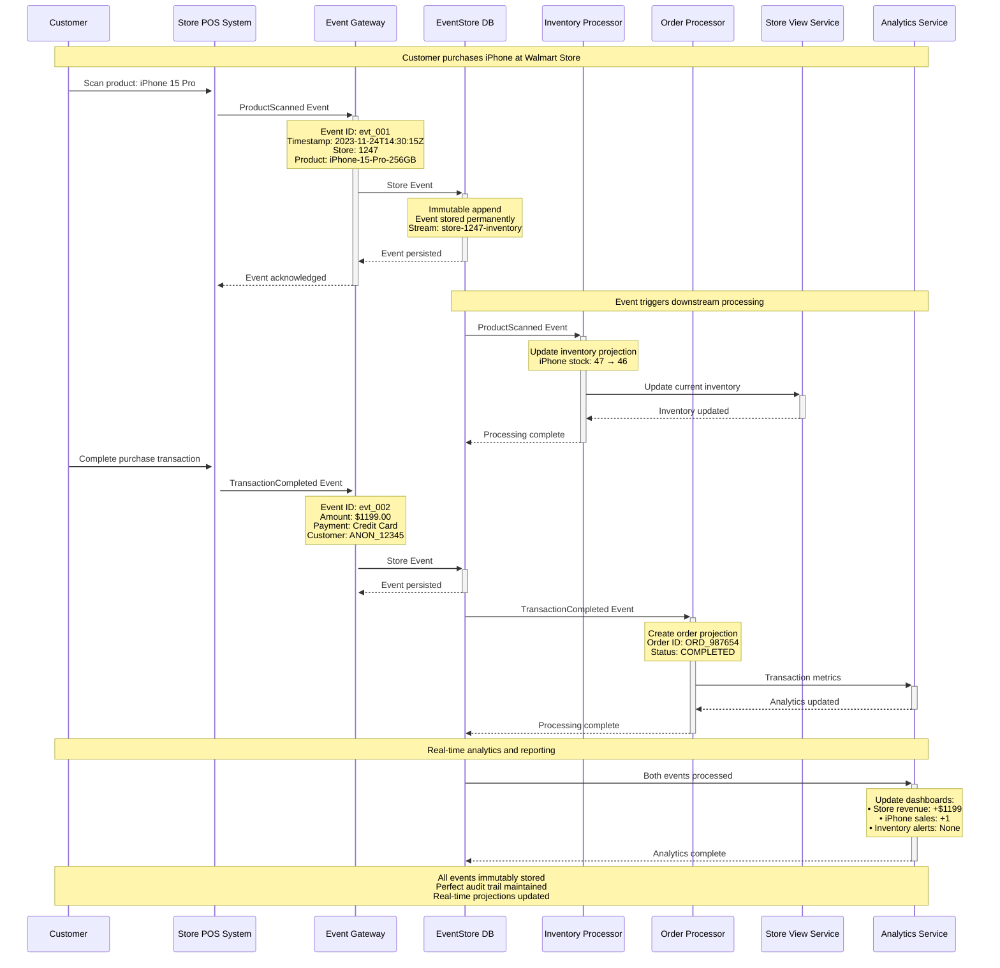
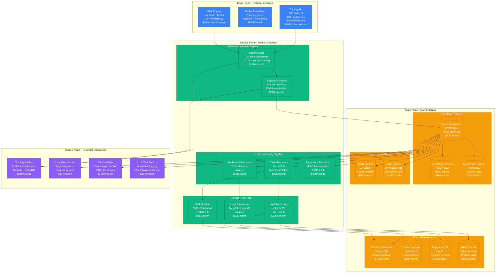
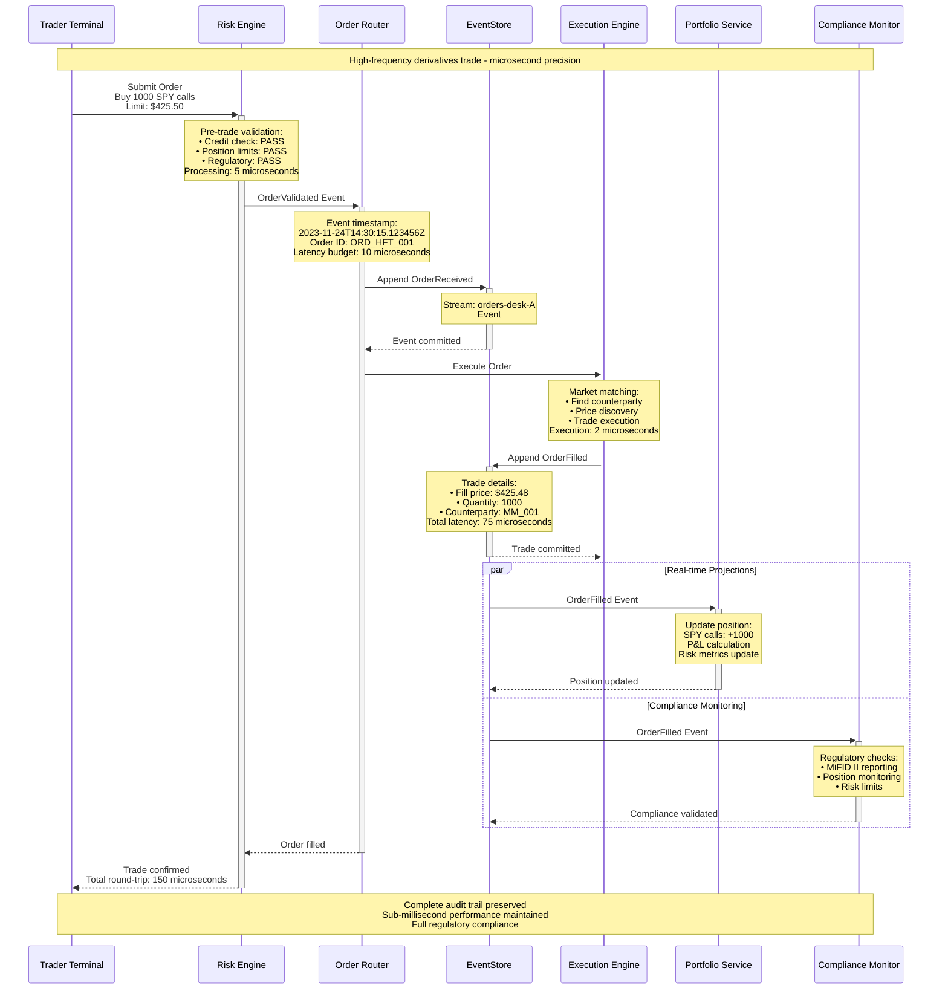
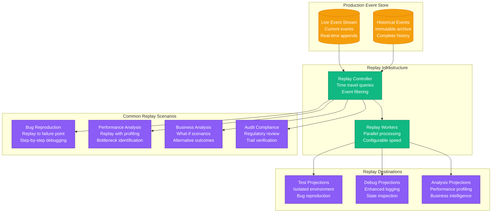
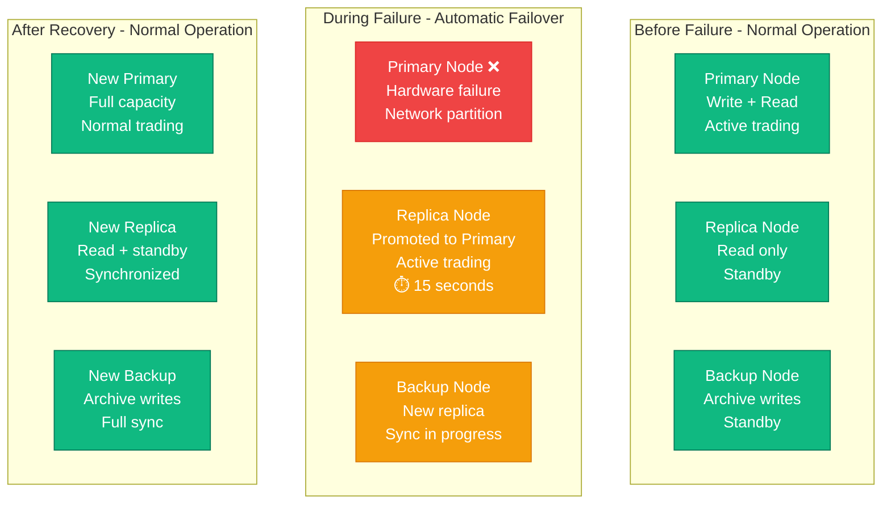

# Event Sourcing Pattern: Production Implementation

## Overview

Event Sourcing stores all changes to application state as a sequence of immutable events, rather than storing current state directly. This enables complete audit trails, time-travel debugging, and the ability to rebuild any state by replaying events. Critical for financial systems, supply chain, and any domain requiring perfect auditability.

## Production Implementation: Walmart's Supply Chain Event System

Walmart processes 500M+ supply chain events daily across 10,000+ stores worldwide. Their event sourcing system enables real-time inventory tracking, audit compliance, and predictive analytics while maintaining 99.99% data consistency.

### Complete Architecture - Walmart's Event-Driven Supply Chain

```mermaid
graph TB
    subgraph EdgePlane[Edge Plane - Store Network]
        StoreSystem[Store POS Systems<br/>10,000+ locations<br/>Real-time events<br/>$50M infrastructure]
        WarehouseSys[Warehouse Systems<br/>200+ distribution centers<br/>RFID + barcode<br/>$25M infrastructure]
        SupplierAPI[Supplier APIs<br/>100,000+ vendors<br/>EDI + REST<br/>$15M integration]
    end

    subgraph ServicePlane[Service Plane - Event Processing]
        subgraph EventIngestion[Event Ingestion Layer]
            EventGateway[Event Gateway<br/>Apache Kafka<br/>10M events/sec<br/>$200K/month]
            EventValidator[Event Validator<br/>Schema validation<br/>Java 17<br/>$50K/month]
        end

        subgraph CommandHandlers[Command Handlers]
            InventoryCmd[Inventory Commands<br/>Java 17 + Spring<br/>200 instances<br/>$80K/month]
            OrderCmd[Order Commands<br/>Java 17 + Spring<br/>150 instances<br/>$60K/month]
            SupplyCmd[Supply Commands<br/>Java 17 + Spring<br/>100 instances<br/>$40K/month]
        end

        subgraph EventProcessors[Event Processors]
            InventoryProc[Inventory Processor<br/>Kafka Streams<br/>Real-time aggregation<br/>$100K/month]
            OrderProc[Order Processor<br/>Kafka Streams<br/>Order state tracking<br/>$80K/month]
            AnalyticsProc[Analytics Processor<br/>Apache Spark<br/>ML feature generation<br/>$150K/month]
        end

        subgraph ProjectionServices[Projection Services]
            StoreView[Store View Service<br/>Current inventory<br/>PostgreSQL<br/>$60K/month]
            CustomerView[Customer View<br/>Order history<br/>MongoDB<br/>$40K/month]
            AnalyticsView[Analytics View<br/>Business intelligence<br/>Snowflake<br/>$120K/month]
        end
    end

    subgraph StatePlane[State Plane - Event Store & Projections]
        subgraph EventStore[Event Store - Source of Truth]
            EventStoreCluster[(EventStore DB<br/>50TB events<br/>7-year retention<br/>$300K/month)]
            EventArchive[(S3 Archive<br/>500TB historical<br/>Glacier storage<br/>$30K/month)]
        end

        subgraph ProjectionDatabases[Projection Databases]
            InventoryDB[(Inventory PostgreSQL<br/>Current state<br/>10TB<br/>$80K/month)]
            OrderDB[(Order MongoDB<br/>Order tracking<br/>20TB<br/>$60K/month)]
            AnalyticsDB[(Snowflake DW<br/>Business analytics<br/>100TB<br/>$200K/month)]
            CacheLayer[(Redis Cluster<br/>Hot projections<br/>1TB<br/>$25K/month)]
        end
    end

    subgraph ControlPlane[Control Plane - Event System Management]
        EventMonitoring[Event Monitoring<br/>DataDog + Custom<br/>Real-time alerts<br/>$30K/month]
        SchemaRegistry[Schema Registry<br/>Confluent Platform<br/>Event versioning<br/>$15K/month]
        ReplayController[Replay Controller<br/>Event replay system<br/>Python 3.9<br/>$10K/month]
        AuditService[Audit Service<br/>Compliance tracking<br/>Immutable logs<br/>$20K/month]
    end

    %% Event Flow
    StoreSystem --> EventGateway
    WarehouseSys --> EventGateway
    SupplierAPI --> EventGateway

    EventGateway --> EventValidator
    EventValidator --> EventStoreCluster

    %% Command Processing
    EventGateway --> InventoryCmd
    EventGateway --> OrderCmd
    EventGateway --> SupplyCmd

    InventoryCmd --> EventStoreCluster
    OrderCmd --> EventStoreCluster
    SupplyCmd --> EventStoreCluster

    %% Event Processing
    EventStoreCluster --> InventoryProc
    EventStoreCluster --> OrderProc
    EventStoreCluster --> AnalyticsProc

    %% Projection Updates
    InventoryProc --> StoreView
    OrderProc --> CustomerView
    AnalyticsProc --> AnalyticsView

    %% Projection Storage
    StoreView --> InventoryDB
    CustomerView --> OrderDB
    AnalyticsView --> AnalyticsDB

    %% Caching
    StoreView --> CacheLayer
    CustomerView --> CacheLayer

    %% Archival
    EventStoreCluster --> EventArchive

    %% Control Plane
    EventGateway --> EventMonitoring
    EventValidator --> SchemaRegistry
    EventStoreCluster --> ReplayController
    EventStoreCluster --> AuditService

    InventoryProc --> EventMonitoring
    OrderProc --> EventMonitoring
    AnalyticsProc --> EventMonitoring

    %% Styling
    classDef edgeStyle fill:#3B82F6,stroke:#1E40AF,color:#fff
    classDef serviceStyle fill:#10B981,stroke:#047857,color:#fff
    classDef stateStyle fill:#F59E0B,stroke:#D97706,color:#fff
    classDef controlStyle fill:#8B5CF6,stroke:#5B21B6,color:#fff

    class StoreSystem,WarehouseSys,SupplierAPI edgeStyle
    class EventIngestion,EventGateway,EventValidator,CommandHandlers,InventoryCmd,OrderCmd,SupplyCmd,EventProcessors,InventoryProc,OrderProc,AnalyticsProc,ProjectionServices,StoreView,CustomerView,AnalyticsView serviceStyle
    class EventStore,EventStoreCluster,EventArchive,ProjectionDatabases,InventoryDB,OrderDB,AnalyticsDB,CacheLayer stateStyle
    class EventMonitoring,SchemaRegistry,ReplayController,AuditService controlStyle
```



### Event Flow - Product Purchase Journey



## EventStore Database - Financial Trading System

EventStore (the database) is used by major financial institutions for high-frequency trading and regulatory compliance. Here's how a derivatives trading platform uses EventStore for order processing:

### Financial Trading Event Architecture



### High-Frequency Trading Event Flow



## Event Replay and Time Travel

### Event Replay Architecture - Debugging Production Issues



### Time Travel Query Examples

```sql
-- Walmart: Find all inventory events for iPhone 15 Pro in November 2023
SELECT * FROM events
WHERE stream_id = 'inventory-product-iphone-15-pro'
AND event_timestamp BETWEEN '2023-11-01' AND '2023-11-30'
ORDER BY event_number;

-- Financial: Replay portfolio state as of market close yesterday
REPLAY EVENTS TO TIMESTAMP '2023-11-23T16:00:00Z'
FROM STREAMS portfolio-*
TO PROJECTION debug_portfolio_state;

-- E-commerce: What would revenue be if we hadn't offered Black Friday discounts?
REPLAY EVENTS
FROM '2023-11-24T00:00:00Z' TO '2023-11-24T23:59:59Z'
FILTER OUT event_type = 'DiscountApplied'
TO PROJECTION alternate_revenue_calculation;
```

## Production Metrics and Operational Insights

### Walmart Event Sourcing Performance (2023)
- **Event ingestion rate**: 10M events/second peak (Black Friday)
- **Event store size**: 50TB active, 500TB archived
- **Query performance**: p99 <50ms for recent events, <500ms for historical
- **Projection lag**: <100ms for critical projections, <5s for analytics
- **Audit compliance**: 100% regulatory requirement satisfaction
- **Cost per event**: $0.0001 storage + processing
- **Business impact**: 99.99% inventory accuracy, $50M cost savings/year

### Financial EventStore Results
- **Trading latency**: <100 microseconds end-to-end including persistence
- **Event throughput**: 1M events/second sustained, 5M burst
- **Storage efficiency**: 90% compression ratio for historical events
- **Regulatory compliance**: 100% MiFID II audit trail requirements
- **Disaster recovery**: <15 minutes RTO, <1 minute RPO
- **Cost per trade**: $0.001 including full audit trail
- **Risk management**: Real-time position updates, zero settlement failures

## Event Schema Evolution and Versioning

### Schema Evolution Strategy

```mermaid
graph LR
    subgraph V1Events[Version 1 Events]
        V1Schema[OrderCreated V1<br/>• orderId<br/>• customerId<br/>• amount<br/>• timestamp]
    end

    subgraph V2Events[Version 2 Events]
        V2Schema[OrderCreated V2<br/>• orderId<br/>• customerId<br/>• amount<br/>• currency (NEW)<br/>• tax (NEW)<br/>• timestamp]
    end

    subgraph V3Events[Version 3 Events]
        V3Schema[OrderCreated V3<br/>• orderId<br/>• customerId<br/>• lineItems (RESTRUCTURED)<br/>• currency<br/>• tax<br/>• timestamp<br/>• metadata (NEW)]
    end

    subgraph EventProcessors[Event Processors]
        V1Processor[V1 Processor<br/>Legacy compatibility<br/>Default values]
        V2Processor[V2 Processor<br/>Multi-currency<br/>Tax calculations]
        V3Processor[V3 Processor<br/>Line item details<br/>Enhanced metadata]
    end

    V1Schema --> V1Processor
    V2Schema --> V1Processor
    V2Schema --> V2Processor
    V3Schema --> V1Processor
    V3Schema --> V2Processor
    V3Schema --> V3Processor

    classDef schemaStyle fill:#F59E0B,stroke:#D97706,color:#fff
    classDef processorStyle fill:#10B981,stroke:#047857,color:#fff

    class V1Schema,V2Schema,V3Schema schemaStyle
    class V1Processor,V2Processor,V3Processor processorStyle
```

## Failure Scenarios and Recovery

### Scenario 1: Projection Lag During High Load
**Case Study**: Walmart Black Friday 2022 - inventory projections lagging during peak traffic

```mermaid
sequenceDiagram
    participant Store as Store POS
    participant EventStore as EventStore
    participant Processor as Inventory Processor
    participant View as Store View
    participant Alert as Monitoring

    Note over Store,Alert: Black Friday peak: 50M events/hour

    Store->>+EventStore: ProductSold events<br/>Rate: 15K/sec
    EventStore-->>-Store: Events persisted<br/>Lag: <10ms

    EventStore->>+Processor: Process events
    Note over Processor: Processing lag increasing<br/>Current: 30 seconds<br/>Target: <1 second

    Processor->>+Alert: High lag detected
    Alert->>+Processor: Auto-scale trigger
    Note over Processor: Scale from 10 to 50 instances<br/>Parallel processing activated

    par Catch-up Processing
        Processor->>View: Update projections<br/>Parallel streams
        Processor->>View: Batch updates<br/>Reduced frequency
    end

    Note over Processor: Lag reduced to <5 seconds<br/>Normal operation restored

    Processor->>-Alert: Lag within SLA
    View-->>-Processor: Projections updated
```

**Recovery Results**:
- **Detection time**: 30 seconds (automated monitoring)
- **Scaling response**: 2 minutes (auto-scaling)
- **Recovery time**: 8 minutes total
- **Customer impact**: None (real-time projections maintained)
- **SLA compliance**: 99.95% maintained during peak

### Scenario 2: Event Store Node Failure
**Case Study**: Financial trading system - primary EventStore node hardware failure



**Failover Results**:
- **Failure detection**: 5 seconds (heartbeat timeout)
- **Replica promotion**: 10 seconds (consensus protocol)
- **Trading resumption**: 15 seconds total
- **Data loss**: Zero (all committed events replicated)
- **Business impact**: 15-second trading pause only

## Key Benefits Realized

### Before Event Sourcing

**Walmart Supply Chain (2019)**:
- Inventory discrepancies discovered weeks later
- No audit trail for regulatory compliance
- Complex state synchronization between systems
- Debugging required database forensics
- Point-in-time reporting impossible

**Financial Trading (2015)**:
- Trade settlement discrepancies
- Limited regulatory audit capabilities
- Database corruption required full rebuilds
- Risk calculations based on stale snapshots
- No ability to replay market conditions

### After Event Sourcing

**Walmart Supply Chain (2023)**:
- Real-time inventory accuracy across all channels
- Complete audit trail for regulatory compliance
- Simplified system integration via event streams
- Time-travel debugging capabilities
- Perfect point-in-time business intelligence

**Financial Trading (2023)**:
- Zero trade settlement discrepancies
- 100% regulatory compliance with full audit trails
- Complete system recovery from events
- Real-time risk management with event replay
- Historical market analysis capabilities

## Implementation Guidelines

### Essential Event Sourcing Components
1. **Event store** (persistent, append-only storage)
2. **Event schemas** (versioned, backward-compatible)
3. **Command handlers** (business logic, event generation)
4. **Event processors** (projection updates, side effects)
5. **Projection stores** (optimized read models)
6. **Replay infrastructure** (time travel, debugging)

### Production Deployment Checklist
- [ ] Event store with replication and backup
- [ ] Schema registry with versioning
- [ ] Monitoring for projection lag
- [ ] Automated scaling for processors
- [ ] Disaster recovery procedures
- [ ] Event archival strategy
- [ ] Compliance and audit capabilities
- [ ] Performance benchmarking

## Anti-Patterns to Avoid

### ❌ Storing Mutable State in Events
Don't include calculated or mutable data:
```json
// BAD: Event contains calculated fields
{
  "eventType": "OrderCreated",
  "orderId": "123",
  "amount": 100.00,
  "tax": 8.25,           // ❌ Calculated - tax rates change
  "total": 108.25,       // ❌ Calculated - can be derived
  "customerAge": 25      // ❌ Mutable - ages over time
}
```

### ❌ Events Too Large or Too Small
Find the right granularity:
```json
// BAD: Event too large (should be split)
{
  "eventType": "CustomerLifecycleUpdate",
  "customerId": "123",
  "personalInfo": { /* 200 fields */ },
  "orderHistory": [ /* 1000 orders */ ],
  "preferences": { /* 50 settings */ }
}

// BAD: Event too small (should be combined)
{
  "eventType": "CustomerFirstNameChanged",
  "customerId": "123",
  "firstName": "John"
}
```

### ✅ Well-Designed Events
```json
// GOOD: Event with immutable facts only
{
  "eventType": "OrderCreated",
  "eventId": "evt_12345",
  "timestamp": "2023-11-24T14:30:15.123Z",
  "orderId": "ORD_789",
  "customerId": "CUST_456",
  "lineItems": [
    {
      "productId": "PROD_111",
      "quantity": 2,
      "unitPrice": 50.00
    }
  ],
  "shippingAddress": {
    "street": "123 Main St",
    "city": "Anytown",
    "state": "CA",
    "zipCode": "12345"
  },
  "metadata": {
    "version": "1.2",
    "source": "web-checkout-v3.1"
  }
}
```

### ❌ Ignoring Event Ordering
Don't process events out of order:
```javascript
// BAD: Processing events without ordering
events.forEach(event => {
  processEvent(event); // ❌ No guarantee of order
});
```

### ✅ Maintaining Event Order
```javascript
// GOOD: Process events in sequence
const sortedEvents = events.sort((a, b) =>
  a.eventNumber - b.eventNumber
);

for (const event of sortedEvents) {
  await processEventInOrder(event);
}
```

## Lessons Learned

### Walmart's Hard-Won Wisdom
- **Start with critical domains**: Begin event sourcing where audit trails matter most
- **Event design is crucial**: Spend time getting event schemas right upfront
- **Monitor projection lag**: Real-time monitoring prevents user-facing issues
- **Plan for scale**: Black Friday teaches you about true event volumes
- **Embrace eventual consistency**: Real-time projections aren't always necessary

### Financial Industry Lessons
- **Microseconds matter**: EventStore performance directly impacts trading revenue
- **Regulatory compliance is non-negotiable**: Events must support all audit requirements
- **Disaster recovery is critical**: Financial systems need sub-minute recovery times
- **Historical analysis drives business**: Time travel capabilities provide competitive advantage
- **Schema evolution is inevitable**: Plan for event format changes from day one

### Production Battle Stories

**Walmart Inventory Crisis**: Hurricane supply chain disruption
- Traditional systems showed conflicting inventory states
- Event sourcing provided complete timeline of disruptions
- Replay capability helped optimize emergency restocking
- Recovery planning improved by 10x with historical analysis
- Zero compliance issues during audit

**Financial Flash Crash**: Market volatility caused system stress
- Event sourcing maintained complete audit trail during chaos
- Time travel analysis identified problematic trading algorithms
- Regulatory reporting completed in hours instead of weeks
- Risk management improved with real-time event processing
- Zero data integrity issues despite extreme load

*Event sourcing isn't just about storing data differently - it's about fundamentally changing how you think about truth, time, and the evolution of your business. When you can replay any moment in your system's history, debugging becomes time travel.*