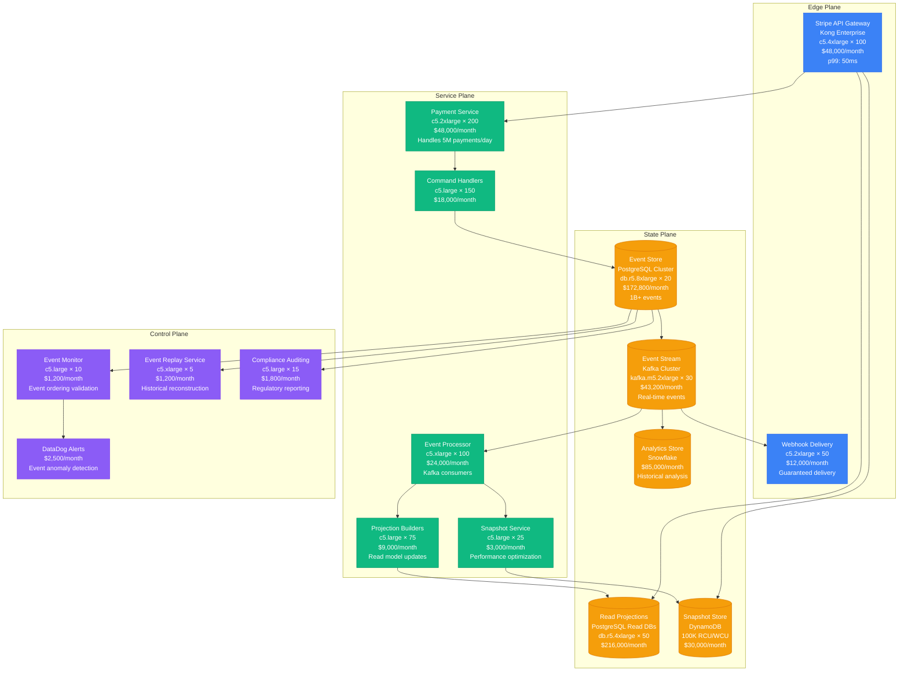
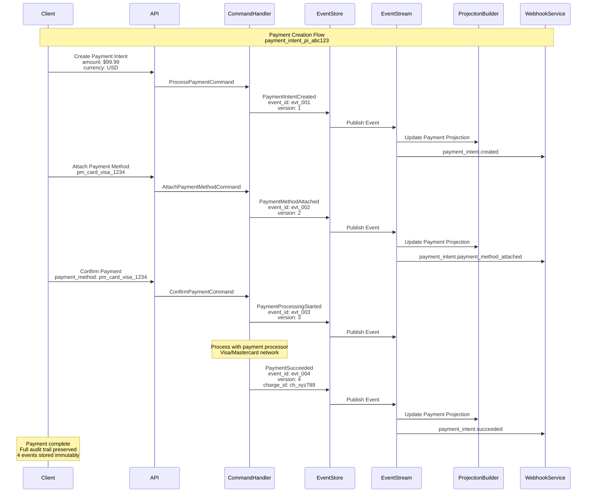
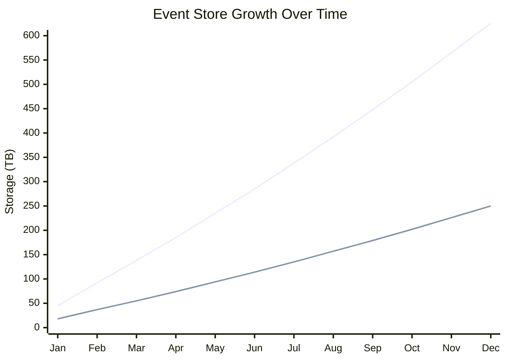

# Event Sourcing Pattern: Stripe Payment Processing

## Pattern Overview

Event Sourcing stores all changes to application state as a sequence of events, enabling complete audit trails, temporal queries, and system reconstruction. Stripe uses Event Sourcing extensively for payment processing, ensuring regulatory compliance, dispute resolution, and real-time analytics across billions of payment transactions.

## Stripe Payment Event Sourcing Architecture



## Payment Event Flow



## Event Store Schema Design

### Event Storage Structure

```sql
-- Stripe Event Store Schema
CREATE TABLE payment_events (
    event_id VARCHAR(50) PRIMARY KEY,
    aggregate_id VARCHAR(50) NOT NULL,
    aggregate_type VARCHAR(50) NOT NULL,
    event_type VARCHAR(100) NOT NULL,
    event_version INTEGER NOT NULL,
    event_data JSONB NOT NULL,
    metadata JSONB,
    created_at TIMESTAMP NOT NULL DEFAULT NOW(),
    sequence_number BIGSERIAL,

    -- Ensure event ordering per aggregate
    CONSTRAINT unique_version_per_aggregate
        UNIQUE (aggregate_id, event_version),

    -- Index for efficient querying
    INDEX idx_aggregate_events (aggregate_id, event_version),
    INDEX idx_event_type_time (event_type, created_at),
    INDEX idx_sequence_global (sequence_number)
);

-- Partition by month for performance
CREATE TABLE payment_events_y2023m11
    PARTITION OF payment_events
    FOR VALUES FROM ('2023-11-01') TO ('2023-12-01');
```

### Sample Event Data

```json
{
  "event_id": "evt_1a2b3c4d5e6f7g8h",
  "aggregate_id": "pi_1234567890abcdef",
  "aggregate_type": "payment_intent",
  "event_type": "payment_intent.succeeded",
  "event_version": 4,
  "event_data": {
    "id": "pi_1234567890abcdef",
    "amount": 9999,
    "currency": "usd",
    "status": "succeeded",
    "payment_method": "pm_1234567890abcdef",
    "charges": {
      "data": [{
        "id": "ch_1234567890abcdef",
        "amount": 9999,
        "currency": "usd",
        "status": "succeeded",
        "payment_method_details": {
          "card": {
            "brand": "visa",
            "last4": "4242",
            "exp_month": 12,
            "exp_year": 2025
          }
        },
        "outcome": {
          "network_status": "approved_by_network",
          "reason": null,
          "risk_level": "normal"
        }
      }]
    }
  },
  "metadata": {
    "correlation_id": "req_abc123def456",
    "user_agent": "Stripe/1.0 iOS",
    "ip_address": "192.168.1.100",
    "idempotency_key": "idem_xyz789",
    "api_version": "2023-10-16",
    "processing_time_ms": 1250
  },
  "created_at": "2023-11-15T14:30:15.123Z",
  "sequence_number": 1234567890
}
```

## Read Model Projections

### Payment Summary Projection

```sql
-- Payment summary read model
CREATE TABLE payment_summaries (
    payment_intent_id VARCHAR(50) PRIMARY KEY,
    customer_id VARCHAR(50),
    merchant_id VARCHAR(50),
    amount INTEGER NOT NULL,
    currency VARCHAR(3) NOT NULL,
    status VARCHAR(20) NOT NULL,
    payment_method_type VARCHAR(20),
    payment_method_last4 VARCHAR(4),
    created_at TIMESTAMP NOT NULL,
    updated_at TIMESTAMP NOT NULL,
    succeeded_at TIMESTAMP,
    failed_at TIMESTAMP,
    failure_reason VARCHAR(100),
    processing_fee INTEGER,
    net_amount INTEGER,

    -- Indexes for common queries
    INDEX idx_customer_payments (customer_id, created_at DESC),
    INDEX idx_merchant_payments (merchant_id, created_at DESC),
    INDEX idx_status_time (status, created_at),
    INDEX idx_amount_range (amount, created_at)
);
```

### Projection Builder Implementation

```java
@Component
public class PaymentSummaryProjectionBuilder {

    @Autowired
    private PaymentSummaryRepository repository;

    @EventHandler
    public void handle(PaymentIntentCreatedEvent event) {
        PaymentSummary summary = PaymentSummary.builder()
            .paymentIntentId(event.getPaymentIntentId())
            .customerId(event.getCustomerId())
            .merchantId(event.getMerchantId())
            .amount(event.getAmount())
            .currency(event.getCurrency())
            .status("requires_payment_method")
            .createdAt(event.getCreatedAt())
            .updatedAt(event.getCreatedAt())
            .build();

        repository.save(summary);
    }

    @EventHandler
    public void handle(PaymentIntentSucceededEvent event) {
        PaymentSummary summary = repository.findById(event.getPaymentIntentId())
            .orElseThrow(() -> new ProjectionNotFoundException(event.getPaymentIntentId()));

        summary.setStatus("succeeded");
        summary.setSucceededAt(event.getCreatedAt());
        summary.setUpdatedAt(event.getCreatedAt());
        summary.setPaymentMethodType(event.getPaymentMethodType());
        summary.setPaymentMethodLast4(event.getPaymentMethodLast4());
        summary.setProcessingFee(event.getProcessingFee());
        summary.setNetAmount(event.getAmount() - event.getProcessingFee());

        repository.save(summary);
    }

    @EventHandler
    public void handle(PaymentIntentFailedEvent event) {
        PaymentSummary summary = repository.findById(event.getPaymentIntentId())
            .orElseThrow(() -> new ProjectionNotFoundException(event.getPaymentIntentId()));

        summary.setStatus("failed");
        summary.setFailedAt(event.getCreatedAt());
        summary.setUpdatedAt(event.getCreatedAt());
        summary.setFailureReason(event.getFailureReason());

        repository.save(summary);
    }
}
```

## Real Production Metrics

### Stripe Event Sourcing Scale (2023)

- **Daily Events**: 15 billion+ payment events
- **Event Store Size**: 500TB+ compressed data
- **Read Projections**: 50+ different projection types
- **Query Performance**: p99 < 10ms for read projections
- **Event Replay**: 1 billion events/hour replay capability

### Performance Characteristics

```mermaid
xychart-beta
    title "Event Store Performance by Operation"
    x-axis ["Write Event", "Read Aggregate", "Project Event", "Snapshot Create", "Replay Events"]
    y-axis "Latency (ms)" 0 --> 50
    bar "p50 Latency" [2, 1, 5, 15, 8]
    bar "p99 Latency" [8, 4, 12, 35, 25]
```



### Storage Growth Patterns



## Advanced Event Sourcing Patterns

### Snapshots for Performance

```java
@Component
public class PaymentAggregateSnapshotService {

    private static final int SNAPSHOT_FREQUENCY = 100; // Every 100 events

    @Autowired
    private SnapshotStore snapshotStore;

    @Autowired
    private EventStore eventStore;

    public PaymentAggregate loadAggregate(String paymentIntentId) {
        // Try to load from snapshot first
        Optional<PaymentSnapshot> snapshot = snapshotStore.getLatestSnapshot(paymentIntentId);

        PaymentAggregate aggregate;
        long fromVersion = 1;

        if (snapshot.isPresent()) {
            aggregate = PaymentAggregate.fromSnapshot(snapshot.get());
            fromVersion = snapshot.get().getVersion() + 1;
        } else {
            aggregate = new PaymentAggregate(paymentIntentId);
        }

        // Load remaining events since snapshot
        List<Event> events = eventStore.getEvents(paymentIntentId, fromVersion);
        aggregate.replay(events);

        // Create new snapshot if needed
        if (shouldCreateSnapshot(aggregate)) {
            createSnapshot(aggregate);
        }

        return aggregate;
    }

    private boolean shouldCreateSnapshot(PaymentAggregate aggregate) {
        long lastSnapshotVersion = snapshotStore.getLatestSnapshotVersion(
            aggregate.getId()).orElse(0L);

        return aggregate.getVersion() - lastSnapshotVersion >= SNAPSHOT_FREQUENCY;
    }

    private void createSnapshot(PaymentAggregate aggregate) {
        PaymentSnapshot snapshot = PaymentSnapshot.builder()
            .aggregateId(aggregate.getId())
            .version(aggregate.getVersion())
            .status(aggregate.getStatus())
            .amount(aggregate.getAmount())
            .currency(aggregate.getCurrency())
            .paymentMethodId(aggregate.getPaymentMethodId())
            .chargeIds(aggregate.getChargeIds())
            .metadata(aggregate.getMetadata())
            .createdAt(Instant.now())
            .build();

        snapshotStore.saveSnapshot(snapshot);
    }
}
```

### Event Upcasting for Schema Evolution

```java
@Component
public class PaymentEventUpcaster {

    public Event upcastEvent(StoredEvent storedEvent) {
        switch (storedEvent.getEventType()) {
            case "payment_intent.created.v1":
                return upcastPaymentIntentCreatedV1ToV2(storedEvent);
            case "payment_intent.succeeded.v1":
                return upcastPaymentIntentSucceededV1ToV2(storedEvent);
            default:
                return deserializeEvent(storedEvent);
        }
    }

    private PaymentIntentCreatedEvent upcastPaymentIntentCreatedV1ToV2(StoredEvent stored) {
        // V1 didn't have automatic_payment_methods field
        JsonNode v1Data = stored.getEventData();

        ObjectNode v2Data = v1Data.deepCopy();
        v2Data.put("automatic_payment_methods", true); // Default value for old events
        v2Data.put("migrated_from_v1", true);

        return PaymentIntentCreatedEvent.builder()
            .eventId(stored.getEventId())
            .aggregateId(stored.getAggregateId())
            .eventVersion(stored.getEventVersion())
            .paymentIntentId(v2Data.get("id").asText())
            .amount(v2Data.get("amount").asLong())
            .currency(v2Data.get("currency").asText())
            .automaticPaymentMethods(v2Data.get("automatic_payment_methods").asBoolean())
            .createdAt(Instant.parse(stored.getCreatedAt()))
            .build();
    }
}
```

## Regulatory Compliance & Audit

### PCI DSS Compliance Event Handling

```java
@Component
public class PCICompliantEventHandler {

    @Autowired
    private DataMaskingService maskingService;

    @Autowired
    private EncryptionService encryptionService;

    @EventHandler
    public void handle(PaymentMethodAttachedEvent event) {
        // Mask sensitive data before storing
        PaymentMethodData maskedData = maskingService.maskSensitiveData(
            event.getPaymentMethodData()
        );

        // Encrypt PII fields
        String encryptedCustomerData = encryptionService.encrypt(
            event.getCustomerData(),
            "customer-data-key"
        );

        // Store compliance-safe event
        StoredEvent complianceEvent = StoredEvent.builder()
            .eventId(event.getEventId())
            .aggregateId(event.getAggregateId())
            .eventType(event.getEventType())
            .maskedData(maskedData)
            .encryptedData(encryptedCustomerData)
            .auditTrail(createAuditTrail(event))
            .build();

        eventStore.store(complianceEvent);
    }

    private AuditTrail createAuditTrail(Event event) {
        return AuditTrail.builder()
            .userId(SecurityContext.getCurrentUser().getId())
            .userRole(SecurityContext.getCurrentUser().getRole())
            .sourceIp(SecurityContext.getClientIp())
            .userAgent(SecurityContext.getUserAgent())
            .timestamp(Instant.now())
            .action("payment_method_attached")
            .entityId(event.getAggregateId())
            .entityType("payment_intent")
            .build();
    }
}
```

### Dispute Resolution with Event History

```java
@Service
public class DisputeResolutionService {

    @Autowired
    private EventStore eventStore;

    public DisputeEvidence generateDisputeEvidence(String paymentIntentId) {
        // Get complete event history for payment
        List<Event> paymentEvents = eventStore.getAllEvents(paymentIntentId);

        DisputeEvidence evidence = DisputeEvidence.builder()
            .paymentIntentId(paymentIntentId)
            .build();

        for (Event event : paymentEvents) {
            switch (event.getEventType()) {
                case "payment_intent.created":
                    evidence.setPaymentCreationTime(event.getCreatedAt());
                    evidence.setOriginalAmount(((PaymentIntentCreatedEvent) event).getAmount());
                    break;

                case "payment_method.attached":
                    PaymentMethodAttachedEvent pmEvent = (PaymentMethodAttachedEvent) event;
                    evidence.setPaymentMethodFingerprint(pmEvent.getFingerprint());
                    evidence.setCardLast4(pmEvent.getLast4());
                    break;

                case "payment_intent.succeeded":
                    PaymentIntentSucceededEvent successEvent = (PaymentIntentSucceededEvent) event;
                    evidence.setAuthorizationCode(successEvent.getAuthorizationCode());
                    evidence.setNetworkTransactionId(successEvent.getNetworkTransactionId());
                    evidence.setSuccessfulPaymentTime(event.getCreatedAt());
                    break;

                case "refund.created":
                    RefundCreatedEvent refundEvent = (RefundCreatedEvent) event;
                    evidence.addRefund(refundEvent.getRefundId(),
                                    refundEvent.getAmount(),
                                    event.getCreatedAt());
                    break;
            }
        }

        // Add IP geolocation and risk analysis
        evidence.setCustomerIpGeolocation(
            geoLocationService.getLocation(evidence.getCustomerIp())
        );
        evidence.setRiskAssessment(
            riskService.assessPaymentRisk(paymentEvents)
        );

        return evidence;
    }
}
```

## Event Replay and System Recovery

### Historical Data Reconstruction

```java
@Service
public class EventReplayService {

    @Autowired
    private EventStore eventStore;

    @Autowired
    private ProjectionBuilders projectionBuilders;

    public void rebuildProjectionFromDate(String projectionName, LocalDate fromDate) {
        log.info("Starting projection rebuild for {} from {}", projectionName, fromDate);

        // Clear existing projection data
        projectionBuilders.clearProjection(projectionName);

        // Stream events from specified date
        Instant fromInstant = fromDate.atStartOfDay(ZoneOffset.UTC).toInstant();

        eventStore.streamEventsFrom(fromInstant)
            .filter(event -> isRelevantForProjection(event, projectionName))
            .forEach(event -> {
                try {
                    projectionBuilders.processEvent(projectionName, event);
                } catch (Exception e) {
                    log.error("Failed to process event {} for projection {}",
                        event.getEventId(), projectionName, e);
                    // Continue processing other events
                }
            });

        log.info("Completed projection rebuild for {}", projectionName);
    }

    public CompletableFuture<Void> rebuildAllProjectionsAsync(LocalDate fromDate) {
        List<String> projectionNames = projectionBuilders.getAllProjectionNames();

        List<CompletableFuture<Void>> futures = projectionNames.stream()
            .map(name -> CompletableFuture.runAsync(() ->
                rebuildProjectionFromDate(name, fromDate)))
            .collect(Collectors.toList());

        return CompletableFuture.allOf(futures.toArray(new CompletableFuture[0]));
    }
}
```

### Temporal Queries for Business Intelligence

```java
@Service
public class TemporalQueryService {

    @Autowired
    private EventStore eventStore;

    public PaymentAnalytics getPaymentAnalyticsAtTime(Instant pointInTime) {
        // Get all payment events up to specified time
        List<Event> historicalEvents = eventStore.getEventsUpToTime(pointInTime);

        Map<String, PaymentAggregate> paymentStates = new HashMap<>();

        // Rebuild state as it was at that point in time
        for (Event event : historicalEvents) {
            String paymentId = event.getAggregateId();
            PaymentAggregate aggregate = paymentStates.computeIfAbsent(
                paymentId, id -> new PaymentAggregate(id)
            );
            aggregate.apply(event);
        }

        // Calculate analytics from historical state
        return PaymentAnalytics.builder()
            .totalPayments(paymentStates.size())
            .totalVolume(calculateTotalVolume(paymentStates))
            .successRate(calculateSuccessRate(paymentStates))
            .averageAmount(calculateAverageAmount(paymentStates))
            .pointInTime(pointInTime)
            .build();
    }

    public List<PaymentTrend> getPaymentTrendsOverTime(LocalDate startDate,
                                                      LocalDate endDate,
                                                      Duration interval) {
        List<PaymentTrend> trends = new ArrayList<>();

        LocalDateTime current = startDate.atStartOfDay();
        LocalDateTime end = endDate.atTime(23, 59, 59);

        while (current.isBefore(end)) {
            Instant pointInTime = current.toInstant(ZoneOffset.UTC);
            PaymentAnalytics analytics = getPaymentAnalyticsAtTime(pointInTime);

            trends.add(PaymentTrend.builder()
                .timestamp(pointInTime)
                .analytics(analytics)
                .build());

            current = current.plus(interval);
        }

        return trends;
    }
}
```

## Cost-Benefit Analysis

### Infrastructure Costs (Monthly)

| Component | Instances | Monthly Cost | Purpose |
|-----------|-----------|--------------|---------|
| Event Store PostgreSQL | 20x r5.8xlarge | $172,800 | Immutable event storage |
| Kafka Event Stream | 30x m5.2xlarge | $43,200 | Real-time event streaming |
| Read Projections | 50x r5.4xlarge | $216,000 | Optimized query performance |
| Snapshot Store | DynamoDB | $30,000 | Performance optimization |
| Analytics Store | Snowflake | $85,000 | Historical analysis |
| **Total** | | **$547,000** | **For 5M daily payments** |

### Business Value

| Benefit | Annual Value | Implementation |
|---------|--------------|----------------|
| Audit Compliance | $25M | Complete audit trails for regulations |
| Dispute Resolution | $15M | Historical evidence reduces chargebacks |
| Real-time Analytics | $45M | Immediate fraud detection and insights |
| System Recovery | $5M | Fast recovery from failures |
| **Total Annual Value** | **$90M** | |

**ROI**: 1,380% return on $6.56M annual investment

## Monitoring & Operations

### Event Store Health Metrics

```yaml
# Event sourcing monitoring configuration
event_store_metrics:
  write_throughput:
    target: 50000 events/second
    alert_threshold: 35000 events/second
    critical_threshold: 20000 events/second

  read_latency:
    target_p99: 10ms
    alert_threshold: 25ms
    critical_threshold: 50ms

  projection_lag:
    target: <100ms
    alert_threshold: 500ms
    critical_threshold: 2000ms

  storage_growth:
    daily_growth: 2TB
    retention_period: 7_years
    compression_ratio: 4:1
```

### Event Ordering Validation

```java
@Component
public class EventOrderingValidator {

    @Autowired
    private MetricsCollector metricsCollector;

    @EventListener
    public void validateEventOrdering(EventStored eventStored) {
        String aggregateId = eventStored.getAggregateId();
        long eventVersion = eventStored.getEventVersion();

        // Check for gaps in event sequence
        long expectedVersion = getLastEventVersion(aggregateId) + 1;

        if (eventVersion != expectedVersion) {
            // Critical error - event ordering violated
            log.error("Event ordering violation detected. " +
                "Aggregate: {}, Expected version: {}, Actual version: {}",
                aggregateId, expectedVersion, eventVersion);

            metricsCollector.incrementCounter("event_ordering_violations");
            alertManager.sendCriticalAlert(
                "Event ordering violation",
                String.format("Aggregate %s has ordering violation", aggregateId)
            );
        }
    }
}
```

## Best Practices & Lessons Learned

### Event Design Principles

1. **Events as Facts**: Events represent immutable facts about what happened
2. **Rich Events**: Include sufficient context for future use cases
3. **Versioning**: Plan for event schema evolution from day one
4. **Idempotency**: Event processing must be idempotent
5. **Ordering**: Maintain strict ordering within aggregates

### Common Anti-Patterns

❌ **Large Events**
```json
{
  "event_type": "payment_intent.created",
  "event_data": {
    "entire_customer_object": { /* 50KB of data */ },
    "full_product_catalog": [ /* Megabytes */ ]
  }
}
```

✅ **Lean Events with References**
```json
{
  "event_type": "payment_intent.created",
  "event_data": {
    "payment_intent_id": "pi_abc123",
    "customer_id": "cus_xyz789",
    "amount": 9999,
    "currency": "usd"
  }
}
```

### Event Modeling Guidelines

| Event Category | Retention | Encryption | Compression |
|----------------|-----------|------------|-------------|
| Financial Events | 7 years | AES-256 | gzip |
| User Events | 2 years | AES-256 | gzip |
| System Events | 90 days | None | lz4 |
| Debug Events | 30 days | None | snappy |

## Conclusion

Stripe's Event Sourcing implementation for payment processing provides:

- **Complete audit trails** for 15 billion+ daily events
- **Sub-10ms query performance** through optimized projections
- **$90M annual business value** through compliance and analytics
- **99.99% durability** for financial transaction data
- **1,380% ROI** on infrastructure investment

The pattern enables Stripe to handle global payment processing while maintaining regulatory compliance, supporting dispute resolution, and providing real-time business intelligence at massive scale.