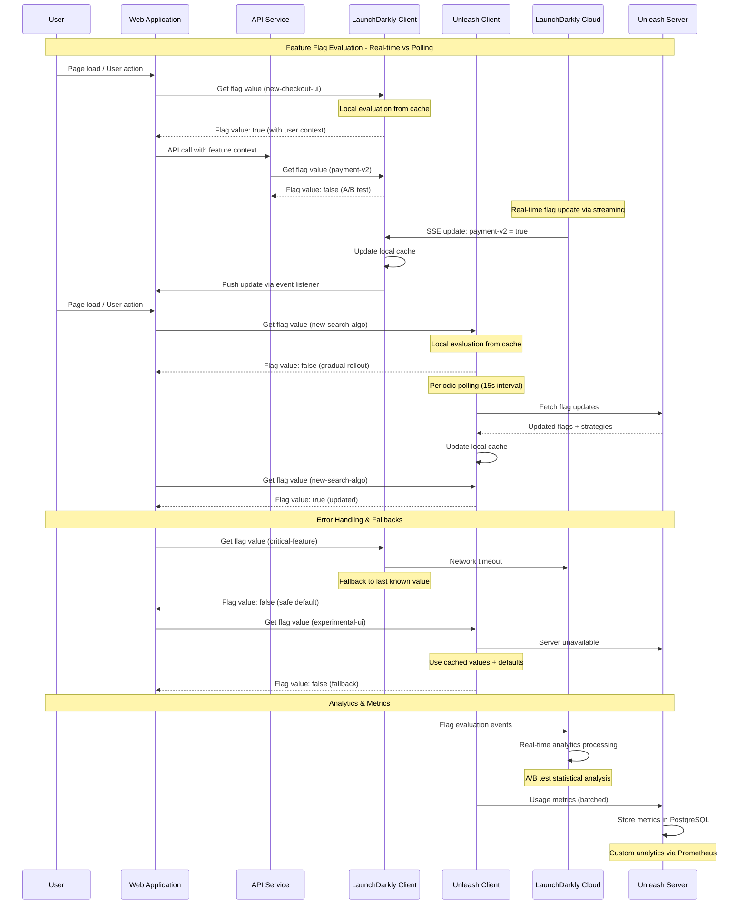

# Feature Toggle Pattern: LaunchDarkly vs Unleash in Production

## Overview

Comprehensive analysis of feature flag platforms: LaunchDarkly (Netflix, Microsoft, Atlassian) vs Unleash (Spotify, GitHub, Finn.no). Both provide feature toggle management but with different approaches: LaunchDarkly as a comprehensive SaaS platform vs Unleash as an open-source, self-hosted solution. Real production data shows critical trade-offs in cost, control, latency, and operational complexity.

## Production Architecture Comparison

```mermaid
graph TB
    subgraph EdgePlane[Edge Plane - #3B82F6]
        CDN[CDN Layer<br/>Edge caching<br/>Geographic distribution<br/>Flag resolution caching]
        LB[Load Balancer<br/>Traffic distribution<br/>Health checks<br/>SSL termination]
    end

    subgraph ServicePlane[Service Plane - #10B981]
        subgraph LaunchDarklyImplementation[LaunchDarkly Implementation - Netflix/Microsoft]
            LD_SDK[LaunchDarkly SDKs<br/>Client-side evaluation<br/>Local flag cache<br/>Real-time updates]

            subgraph LDComponents[LaunchDarkly Components]
                LD_CLIENT[LD Client SDK<br/>JavaScript/React<br/>Mobile SDKs<br/>Real-time streaming]
                LD_SERVER[LD Server SDK<br/>Java/Python/Go<br/>Local evaluation<br/>Flag streaming]
                LD_RELAY[LD Relay Proxy<br/>Edge evaluation<br/>Offline capability<br/>Custom deployment]
            end

            LD_ANALYTICS[LD Analytics<br/>Flag usage metrics<br/>Experimentation<br/>Performance tracking]
        end

        subgraph UnleashImplementation[Unleash Implementation - Spotify/GitHub]
            UNLEASH_SDK[Unleash SDKs<br/>Client libraries<br/>Polling-based updates<br/>Local evaluation]

            subgraph UnleashComponents[Unleash Components]
                UNLEASH_ADMIN[Unleash Admin UI<br/>React application<br/>Feature management<br/>Strategy configuration]
                UNLEASH_API[Unleash API Server<br/>Node.js/Java<br/>PostgreSQL backend<br/>REST/GraphQL]
                UNLEASH_PROXY[Unleash Proxy<br/>Frontend evaluation<br/>CORS handling<br/>API key management]
            end

            UNLEASH_METRICS[Unleash Metrics<br/>Prometheus integration<br/>Custom dashboards<br/>Usage analytics]
        end

        subgraph ApplicationServices[Application Services]
            WEB_APP[Web Application<br/>React/Angular<br/>Client-side flags<br/>Real-time updates]
            API_SERVICES[API Services<br/>Microservices<br/>Server-side flags<br/>Business logic]
            MOBILE_APPS[Mobile Applications<br/>iOS/Android<br/>Offline-first<br/>Background sync]
        end
    end

    subgraph StatePlane[State Plane - #F59E0B]
        subgraph LaunchDarklyState[LaunchDarkly State - SaaS]
            LD_CLOUD[LaunchDarkly Cloud<br/>Global infrastructure<br/>Multi-region<br/>99.99% SLA]
            LD_FLAG_STORE[Flag Configuration<br/>Managed storage<br/>Real-time sync<br/>Version control]
            LD_USER_STORE[User Context Store<br/>Targeting rules<br/>Segment definitions<br/>A/B test configs]
        end

        subgraph UnleashState[Unleash State - Self-hosted]
            UNLEASH_DB[(PostgreSQL Database<br/>Flag definitions<br/>Toggle states<br/>Strategy configurations)]
            UNLEASH_REDIS[(Redis Cache<br/>Session storage<br/>Rate limiting<br/>Real-time updates)]
            UNLEASH_METRICS_DB[(Metrics Database<br/>Usage statistics<br/>Feature analytics<br/>Performance data)]
        end

        subgraph ApplicationState[Application State]
            LOCAL_CACHE[Local Flag Cache<br/>In-memory storage<br/>Fast evaluation<br/>Fallback values]
            USER_CONTEXT[User Context<br/>Session data<br/>Targeting attributes<br/>Experiment assignments]
            FEATURE_STATE[Feature State<br/>Toggle status<br/>Rollout percentage<br/>Override settings]
        end
    end

    subgraph ControlPlane[Control Plane - #8B5CF6]
        FLAG_MANAGEMENT[Flag Management<br/>Admin dashboard<br/>Approval workflows<br/>Environment promotion]
        MONITORING[Flag Monitoring<br/>Usage analytics<br/>Performance metrics<br/>Error tracking]
        EXPERIMENTATION[A/B Testing<br/>Experiment design<br/>Statistical analysis<br/>Results tracking]
        ALERTING[Alert System<br/>Flag failures<br/>Performance issues<br/>Rollout monitoring]
    end

    CDN --> LB
    LB --> LD_SDK
    LB --> UNLEASH_SDK

    LD_SDK --> LD_CLIENT
    LD_SDK --> LD_SERVER
    LD_SDK --> LD_RELAY

    UNLEASH_SDK --> UNLEASH_ADMIN
    UNLEASH_SDK --> UNLEASH_API
    UNLEASH_SDK --> UNLEASH_PROXY

    LD_CLIENT --> WEB_APP
    LD_SERVER --> API_SERVICES
    UNLEASH_API --> MOBILE_APPS

    LD_RELAY --> LD_CLOUD
    LD_SERVER --> LD_FLAG_STORE
    LD_ANALYTICS --> LD_USER_STORE

    UNLEASH_API --> UNLEASH_DB
    UNLEASH_PROXY --> UNLEASH_REDIS
    UNLEASH_METRICS --> UNLEASH_METRICS_DB

    WEB_APP --> LOCAL_CACHE
    API_SERVICES --> USER_CONTEXT
    MOBILE_APPS --> FEATURE_STATE

    LD_ANALYTICS --> FLAG_MANAGEMENT
    UNLEASH_ADMIN --> FLAG_MANAGEMENT
    FLAG_MANAGEMENT --> MONITORING
    MONITORING --> EXPERIMENTATION
    EXPERIMENTATION --> ALERTING

    classDef edgeStyle fill:#3B82F6,stroke:#1E40AF,color:#fff
    classDef serviceStyle fill:#10B981,stroke:#047857,color:#fff
    classDef stateStyle fill:#F59E0B,stroke:#D97706,color:#fff
    classDef controlStyle fill:#8B5CF6,stroke:#6D28D9,color:#fff

    class CDN,LB edgeStyle
    class LD_SDK,LD_CLIENT,LD_SERVER,LD_RELAY,LD_ANALYTICS,UNLEASH_SDK,UNLEASH_ADMIN,UNLEASH_API,UNLEASH_PROXY,UNLEASH_METRICS,WEB_APP,API_SERVICES,MOBILE_APPS serviceStyle
    class LD_CLOUD,LD_FLAG_STORE,LD_USER_STORE,UNLEASH_DB,UNLEASH_REDIS,UNLEASH_METRICS_DB,LOCAL_CACHE,USER_CONTEXT,FEATURE_STATE stateStyle
    class FLAG_MANAGEMENT,MONITORING,EXPERIMENTATION,ALERTING controlStyle
```



## Feature Flag Evaluation Flow



## Feature Toggle Strategy Patterns

```mermaid
graph TB
    subgraph ToggleStrategies[Feature Toggle Strategy Patterns]
        subgraph LaunchDarklyStrategies[LaunchDarkly Strategies - Netflix/Microsoft]
            LD_TARGETING[Advanced Targeting<br/>User attributes<br/>Custom rules<br/>Segment-based<br/>Geographic targeting]

            LD_EXPERIMENTS[Experimentation<br/>A/B testing<br/>Multivariate tests<br/>Statistical significance<br/>Conversion tracking]

            LD_PERCENTAGE[Percentage Rollouts<br/>Gradual rollouts<br/>User sticky flags<br/>Rollback capabilities<br/>Canary releases]

            LD_PREREQUISITES[Prerequisites<br/>Flag dependencies<br/>Conditional logic<br/>Complex workflows<br/>Safety checks]

            LD_ENVIRONMENTS[Environment Management<br/>Dev/stage/prod<br/>Promotion workflows<br/>Approval processes<br/>Audit trails]
        end

        subgraph UnleashStrategies[Unleash Strategies - Spotify/GitHub]
            UNLEASH_STANDARD[Standard Strategies<br/>Default strategy<br/>UserID strategy<br/>Gradual rollout<br/>Remote address]

            UNLEASH_CUSTOM[Custom Strategies<br/>User-defined logic<br/>Business rules<br/>Context-aware<br/>Plugin system]

            UNLEASH_VARIANTS[Feature Variants<br/>Multiple variations<br/>Weighted distribution<br/>Payload support<br/>Dynamic configs]

            UNLEASH_CONSTRAINTS[Strategy Constraints<br/>Context validation<br/>Date/time constraints<br/>User property filters<br/>Environment gates]

            UNLEASH_PROJECTS[Project Isolation<br/>Multi-tenancy<br/>Team boundaries<br/>Access control<br/>Namespace separation]
        end

        subgraph ImplementationPatterns[Implementation Patterns]
            RELEASE_TOGGLES[Release Toggles<br/>Feature deployment<br/>Dark launches<br/>Blue-green switching<br/>Risk mitigation]

            EXPERIMENT_TOGGLES[Experiment Toggles<br/>A/B testing<br/>Hypothesis validation<br/>Performance testing<br/>User behavior analysis]

            OPS_TOGGLES[Operations Toggles<br/>Circuit breakers<br/>Load balancing<br/>Maintenance mode<br/>Performance tuning]

            PERMISSION_TOGGLES[Permission Toggles<br/>Access control<br/>Feature entitlements<br/>Premium features<br/>Role-based access]
        end
    end

    subgraph EvaluationPatterns[Evaluation & Performance Patterns]
        subgraph ClientSideEvaluation[Client-side Evaluation]
            LOCAL_EVALUATION[Local Evaluation<br/>Fast response times<br/>Offline capability<br/>Reduced network calls<br/>Battery efficiency]

            CACHE_STRATEGIES[Cache Strategies<br/>Memory caching<br/>TTL management<br/>Cache invalidation<br/>Fallback handling]

            REAL_TIME_UPDATES[Real-time Updates<br/>WebSocket/SSE<br/>Push notifications<br/>Event-driven<br/>Low latency]
        end

        subgraph ServerSideEvaluation[Server-side Evaluation]
            BULK_EVALUATION[Bulk Evaluation<br/>Batch processing<br/>Request optimization<br/>Database efficiency<br/>Cost reduction]

            CONTEXT_ENRICHMENT[Context Enrichment<br/>User data lookup<br/>Session information<br/>Request metadata<br/>Dynamic attributes]

            PERFORMANCE_OPTIMIZATION[Performance Optimization<br/>Response caching<br/>Database indexing<br/>Connection pooling<br/>Query optimization]
        end
    end

    LD_TARGETING --> RELEASE_TOGGLES
    UNLEASH_STANDARD --> EXPERIMENT_TOGGLES
    LD_EXPERIMENTS --> EXPERIMENT_TOGGLES
    UNLEASH_CUSTOM --> OPS_TOGGLES

    LD_PERCENTAGE --> LOCAL_EVALUATION
    UNLEASH_VARIANTS --> CACHE_STRATEGIES
    LD_PREREQUISITES --> REAL_TIME_UPDATES
    UNLEASH_CONSTRAINTS --> BULK_EVALUATION

    classDef ldStyle fill:#FF6B35,stroke:#E55A2B,color:#fff
    classDef unleashStyle fill:#6B46C1,stroke:#553C9A,color:#fff
    classDef patternStyle fill:#10B981,stroke:#047857,color:#fff
    classDef evalStyle fill:#3B82F6,stroke:#1E40AF,color:#fff

    class LD_TARGETING,LD_EXPERIMENTS,LD_PERCENTAGE,LD_PREREQUISITES,LD_ENVIRONMENTS ldStyle
    class UNLEASH_STANDARD,UNLEASH_CUSTOM,UNLEASH_VARIANTS,UNLEASH_CONSTRAINTS,UNLEASH_PROJECTS unleashStyle
    class RELEASE_TOGGLES,EXPERIMENT_TOGGLES,OPS_TOGGLES,PERMISSION_TOGGLES patternStyle
    class LOCAL_EVALUATION,CACHE_STRATEGIES,REAL_TIME_UPDATES,BULK_EVALUATION,CONTEXT_ENRICHMENT,PERFORMANCE_OPTIMIZATION evalStyle
```



## Production Use Cases and Performance

```mermaid
graph TB
    subgraph UseCaseAnalysis[Production Use Case Analysis]
        subgraph EnterpriseUseCases[Enterprise Use Cases - Netflix/Microsoft/Atlassian]
            FEATURE_RELEASES[Feature Releases<br/>Gradual rollouts<br/>Dark launches<br/>Canary deployments<br/>Risk mitigation]

            AB_TESTING[A/B Testing<br/>Conversion optimization<br/>Statistical significance<br/>Multi-armed bandits<br/>Revenue impact]

            OPERATIONAL_CONTROL[Operational Control<br/>Circuit breakers<br/>Load shedding<br/>Maintenance modes<br/>Emergency shutoffs]

            PERSONALIZATION[Personalization<br/>User segmentation<br/>Behavioral targeting<br/>Geographic customization<br/>Device-specific features]

            COMPLIANCE_GATING[Compliance Gating<br/>Regulatory features<br/>GDPR compliance<br/>Feature auditing<br/>Data governance]
        end

        subgraph OpenSourceUseCases[Open Source Use Cases - Spotify/GitHub/Finn.no]
            TEAM_AUTONOMY[Team Autonomy<br/>Independent deployments<br/>Feature ownership<br/>Self-service flags<br/>Decentralized control]

            COST_OPTIMIZATION[Cost Optimization<br/>Infrastructure control<br/>Data sovereignty<br/>Custom integrations<br/>No vendor lock-in]

            CUSTOM_WORKFLOWS[Custom Workflows<br/>GitOps integration<br/>CI/CD pipelines<br/>Custom approval flows<br/>Internal tooling]

            GRADUAL_MIGRATION[Gradual Migration<br/>System modernization<br/>Legacy system integration<br/>Feature parity<br/>Risk-free transitions]

            PERFORMANCE_TESTING[Performance Testing<br/>Load testing features<br/>Resource optimization<br/>Scalability validation<br/>Bottleneck identification]
        end

        subgraph PerformanceMetrics[Performance Characteristics]
            LATENCY_COMPARISON[Latency Comparison<br/>LaunchDarkly: <1ms (cached)<br/>Unleash: 1-5ms (polling)<br/>Network dependency]

            AVAILABILITY_SLA[Availability SLA<br/>LaunchDarkly: 99.99%<br/>Unleash: Self-managed<br/>Infrastructure dependency]

            SCALE_CHARACTERISTICS[Scale Characteristics<br/>LaunchDarkly: Global CDN<br/>Unleash: Horizontal scaling<br/>Cost implications]

            INTEGRATION_COMPLEXITY[Integration Complexity<br/>LaunchDarkly: SDK-first<br/>Unleash: API-first<br/>Development overhead]
        end
    end

    subgraph CostAnalysis[Cost & Operational Analysis]
        subgraph LaunchDarklyCosts[LaunchDarkly Cost Structure]
            LD_SUBSCRIPTION[Subscription Costs<br/>Per-seat pricing<br/>MAU-based billing<br/>Enterprise features<br/>Support tiers]

            LD_EVALUATION_COSTS[Evaluation Costs<br/>No per-evaluation fees<br/>Unlimited evaluations<br/>Global infrastructure<br/>CDN included]

            LD_OPERATIONAL[Operational Overhead<br/>Minimal maintenance<br/>SaaS management<br/>Automatic updates<br/>Support included]

            LD_VENDOR_LOCK[Vendor Lock-in Risk<br/>Proprietary APIs<br/>Migration complexity<br/>Data export options<br/>Contract dependencies]
        end

        subgraph UnleashCosts[Unleash Cost Structure]
            UNLEASH_INFRASTRUCTURE[Infrastructure Costs<br/>Self-hosted servers<br/>Database hosting<br/>Redis caching<br/>Monitoring stack]

            UNLEASH_OPERATIONAL_OVERHEAD[Operational Overhead<br/>DevOps maintenance<br/>Security updates<br/>Backup management<br/>Performance tuning]

            UNLEASH_DEVELOPMENT[Development Costs<br/>Custom integrations<br/>Feature development<br/>Bug fixes<br/>Security patches]

            UNLEASH_FLEXIBILITY[Flexibility Benefits<br/>Full control<br/>Custom features<br/>Data sovereignty<br/>No vendor lock-in]
        end
    end

    FEATURE_RELEASES --> LATENCY_COMPARISON
    TEAM_AUTONOMY --> AVAILABILITY_SLA
    AB_TESTING --> SCALE_CHARACTERISTICS
    CUSTOM_WORKFLOWS --> INTEGRATION_COMPLEXITY

    FEATURE_RELEASES --> LD_SUBSCRIPTION
    OPERATIONAL_CONTROL --> LD_EVALUATION_COSTS
    TEAM_AUTONOMY --> UNLEASH_INFRASTRUCTURE
    COST_OPTIMIZATION --> UNLEASH_OPERATIONAL_OVERHEAD

    classDef enterpriseStyle fill:#FF6B35,stroke:#E55A2B,color:#fff
    classDef openSourceStyle fill:#6B46C1,stroke:#553C9A,color:#fff
    classDef metricsStyle fill:#DC2626,stroke:#B91C1C,color:#fff
    classDef costStyle fill:#F59E0B,stroke:#D97706,color:#fff

    class FEATURE_RELEASES,AB_TESTING,OPERATIONAL_CONTROL,PERSONALIZATION,COMPLIANCE_GATING,LD_SUBSCRIPTION,LD_EVALUATION_COSTS,LD_OPERATIONAL,LD_VENDOR_LOCK enterpriseStyle
    class TEAM_AUTONOMY,COST_OPTIMIZATION,CUSTOM_WORKFLOWS,GRADUAL_MIGRATION,PERFORMANCE_TESTING,UNLEASH_INFRASTRUCTURE,UNLEASH_OPERATIONAL_OVERHEAD,UNLEASH_DEVELOPMENT,UNLEASH_FLEXIBILITY openSourceStyle
    class LATENCY_COMPARISON,AVAILABILITY_SLA,SCALE_CHARACTERISTICS,INTEGRATION_COMPLEXITY metricsStyle
    class LD_SUBSCRIPTION,UNLEASH_INFRASTRUCTURE,LD_OPERATIONAL,UNLEASH_OPERATIONAL_OVERHEAD costStyle
```

## Production Metrics and Performance

### Performance Benchmarks (Based on Netflix vs Spotify Production)
| Metric | LaunchDarkly | Unleash |
|--------|--------------|---------|
| **Flag Evaluation Latency** | <1ms (cached) | 1-5ms (local) |
| **Update Propagation** | Real-time (SSE) | 15-60s (polling) |
| **SDK Bundle Size** | 50-200KB | 30-100KB |
| **Offline Capability** | Full offline | Cached values |
| **Global Availability** | 99.99% SLA | Self-managed |
| **Setup Time** | <1 hour | 2-8 hours |

### Production Reliability Metrics
| Feature | LaunchDarkly | Unleash |
|---------|--------------|---------|
| **Fallback Handling** | Automatic | Manual config |
| **Error Recovery** | Built-in retry | Custom logic |
| **Monitoring** | Comprehensive | Custom setup |
| **Alerting** | Integrated | External tools |
| **Audit Trails** | Complete | Basic logging |

## Implementation Examples

### LaunchDarkly Implementation (Netflix-style)
```typescript
// Production LaunchDarkly integration for Netflix
import { LDClient, LDUser, LDFlagSet } from 'launchdarkly-js-client-sdk';
import { createContext, useContext, useEffect, useState, ReactNode } from 'react';

// LaunchDarkly configuration for production
const LD_CLIENT_SIDE_ID = process.env.REACT_APP_LD_CLIENT_ID!;

interface FeatureFlagContextType {
  ldClient: LDClient | null;
  flags: LDFlagSet;
  user: LDUser | null;
  isInitialized: boolean;
  updateUser: (user: LDUser) => Promise<void>;
  trackEvent: (eventName: string, data?: any) => void;
}

const FeatureFlagContext = createContext<FeatureFlagContextType>({
  ldClient: null,
  flags: {},
  user: null,
  isInitialized: false,
  updateUser: async () => {},
  trackEvent: () => {},
});

// Feature flag provider component
export const FeatureFlagProvider: React.FC<{ children: ReactNode }> = ({ children }) => {
  const [ldClient, setLdClient] = useState<LDClient | null>(null);
  const [flags, setFlags] = useState<LDFlagSet>({});
  const [user, setUser] = useState<LDUser | null>(null);
  const [isInitialized, setIsInitialized] = useState(false);

  useEffect(() => {
    const initializeLaunchDarkly = async () => {
      try {
        // Get user context from authentication
        const currentUser = await getCurrentUser();

        const ldUser: LDUser = {
          key: currentUser.id,
          email: currentUser.email,
          name: currentUser.name,
          custom: {
            subscriptionTier: currentUser.subscriptionTier,
            region: currentUser.region,
            deviceType: getDeviceType(),
            appVersion: process.env.REACT_APP_VERSION,
            joinDate: currentUser.joinDate,
          },
        };

        // Initialize LaunchDarkly client
        const client = LDClient.initialize(LD_CLIENT_SIDE_ID, ldUser, {
          bootstrap: 'localStorage',
          streaming: true,
          useReport: true,
          evaluationReasons: true,
          diagnosticOptOut: false,
          inspectors: [
            {
              type: 'flag-used',
              name: 'flag-usage-tracker',
              method: (flagKey: string, flagDetail: any) => {
                // Track flag usage for analytics
                trackFlagUsage(flagKey, flagDetail, ldUser);
              },
            },
          ],
        });

        // Wait for client initialization
        await client.waitForInitialization();

        // Set up real-time flag updates
        client.on('change', (changes: LDFlagSet) => {
          setFlags(client.allFlags());

          // Log flag changes for debugging
          Object.keys(changes).forEach(flagKey => {
            console.log(`Flag ${flagKey} changed to:`, changes[flagKey]);

            // Track flag changes for A/B test analysis
            trackFlagChange(flagKey, changes[flagKey], ldUser);
          });
        });

        // Handle connection status
        client.on('ready', () => {
          console.log('LaunchDarkly client is ready');
          setIsInitialized(true);
        });

        client.on('failed', (error: Error) => {
          console.error('LaunchDarkly initialization failed:', error);
          // Fall back to default flag values
          setFlags(getDefaultFlags());
          setIsInitialized(true);
        });

        setLdClient(client);
        setUser(ldUser);
        setFlags(client.allFlags());

      } catch (error) {
        console.error('Error initializing LaunchDarkly:', error);
        // Use default flags if initialization fails
        setFlags(getDefaultFlags());
        setIsInitialized(true);
      }
    };

    initializeLaunchDarkly();

    return () => {
      if (ldClient) {
        ldClient.close();
      }
    };
  }, []);

  const updateUser = async (newUser: LDUser) => {
    if (ldClient) {
      try {
        await ldClient.identify(newUser);
        setUser(newUser);
        setFlags(ldClient.allFlags());
      } catch (error) {
        console.error('Error updating user context:', error);
      }
    }
  };

  const trackEvent = (eventName: string, data?: any) => {
    if (ldClient && user) {
      ldClient.track(eventName, user, data);
    }
  };

  return (
    <FeatureFlagContext.Provider
      value={{
        ldClient,
        flags,
        user,
        isInitialized,
        updateUser,
        trackEvent,
      }}
    >
      {children}
    </FeatureFlagContext.Provider>
  );
};

// Custom hook for using feature flags
export const useFeatureFlag = (flagKey: string, defaultValue: boolean = false) => {
  const { ldClient, flags, isInitialized } = useContext(FeatureFlagContext);
  const [flagValue, setFlagValue] = useState<boolean>(defaultValue);
  const [flagDetail, setFlagDetail] = useState<any>(null);

  useEffect(() => {
    if (isInitialized && ldClient) {
      const detail = ldClient.variationDetail(flagKey, defaultValue);
      setFlagValue(detail.value);
      setFlagDetail(detail);

      // Log flag evaluation for debugging
      if (detail.reason?.kind === 'ERROR') {
        console.warn(`Feature flag ${flagKey} evaluation error:`, detail.reason);
      }
    }
  }, [flagKey, defaultValue, isInitialized, ldClient, flags]);

  return { flagValue, flagDetail, isInitialized };
};

// Production feature flag components
export const FeatureGate: React.FC<{
  flagKey: string;
  children: ReactNode;
  fallback?: ReactNode;
  defaultValue?: boolean;
}> = ({ flagKey, children, fallback = null, defaultValue = false }) => {
  const { flagValue, isInitialized } = useFeatureFlag(flagKey, defaultValue);

  if (!isInitialized) {
    return <>{fallback}</>;
  }

  return flagValue ? <>{children}</> : <>{fallback}</>;
};

// A/B test component with analytics
export const ABTest: React.FC<{
  flagKey: string;
  variations: {
    control: ReactNode;
    treatment: ReactNode;
  };
  trackingEvent?: string;
}> = ({ flagKey, variations, trackingEvent }) => {
  const { ldClient, flagValue, isInitialized } = useFeatureFlag(flagKey, false);
  const { trackEvent } = useContext(FeatureFlagContext);

  useEffect(() => {
    if (isInitialized && trackingEvent) {
      // Track experiment exposure
      trackEvent(trackingEvent, {
        flagKey,
        variation: flagValue ? 'treatment' : 'control',
        timestamp: new Date().toISOString(),
      });
    }
  }, [isInitialized, flagValue, trackingEvent, trackEvent, flagKey]);

  if (!isInitialized) {
    return <>{variations.control}</>;
  }

  return flagValue ? <>{variations.treatment}</> : <>{variations.control}</>;
};

// Server-side LaunchDarkly integration
import * as LaunchDarkly from 'launchdarkly-node-server-sdk';

class FeatureFlagService {
  private ldClient: LaunchDarkly.LDClient;

  constructor() {
    this.ldClient = LaunchDarkly.init(process.env.LD_SDK_KEY!, {
      offline: false,
      useLdd: false,
      sendEvents: true,
      logger: LaunchDarkly.createConsoleLogger('info'),
    });
  }

  async initialize(): Promise<void> {
    await this.ldClient.waitForInitialization();
  }

  async evaluateFlag(
    flagKey: string,
    user: LaunchDarkly.LDUser,
    defaultValue: any = false
  ): Promise<any> {
    try {
      const result = await this.ldClient.variationDetail(flagKey, user, defaultValue);

      // Log flag evaluation for audit
      console.log(`Flag ${flagKey} evaluated:`, {
        value: result.value,
        reason: result.reason,
        userId: user.key,
      });

      return result.value;
    } catch (error) {
      console.error(`Error evaluating flag ${flagKey}:`, error);
      return defaultValue;
    }
  }

  async evaluateAllFlags(user: LaunchDarkly.LDUser): Promise<LaunchDarkly.LDFlagSet> {
    try {
      return await this.ldClient.allFlagsState(user, {
        clientSideOnly: false,
        withReasons: true,
        detailsOnlyForTrackedFlags: false,
      });
    } catch (error) {
      console.error('Error evaluating all flags:', error);
      return {};
    }
  }

  trackEvent(eventName: string, user: LaunchDarkly.LDUser, data?: any): void {
    this.ldClient.track(eventName, user, data);
  }

  close(): void {
    this.ldClient.close();
  }
}

// Usage in Express.js middleware
export const featureFlagMiddleware = (req: Request, res: Response, next: NextFunction) => {
  const user: LaunchDarkly.LDUser = {
    key: req.user.id,
    email: req.user.email,
    custom: {
      subscriptionTier: req.user.subscriptionTier,
      requestPath: req.path,
      userAgent: req.get('User-Agent'),
    },
  };

  req.featureFlags = {
    evaluate: (flagKey: string, defaultValue: any) =>
      featureFlagService.evaluateFlag(flagKey, user, defaultValue),
    trackEvent: (eventName: string, data?: any) =>
      featureFlagService.trackEvent(eventName, user, data),
  };

  next();
};
```

### Unleash Implementation (Spotify-style)
```typescript
// Production Unleash integration for Spotify
import { initialize, isEnabled, getVariant, UnleashConfig, Context } from 'unleash-client';
import { createContext, useContext, useEffect, useState, ReactNode } from 'react';

// Unleash configuration for production
const UNLEASH_CONFIG: UnleashConfig = {
  url: process.env.REACT_APP_UNLEASH_API_URL!,
  clientKey: process.env.REACT_APP_UNLEASH_CLIENT_KEY!,
  appName: 'spotify-web-player',
  instanceId: `${process.env.REACT_APP_VERSION}-${Math.random().toString(36).substring(7)}`,
  refreshInterval: 15000, // 15 seconds
  metricsInterval: 60000, // 1 minute
  disableMetrics: false,
  storageProvider: {
    // Custom storage provider for better performance
    save: (name: string, data: any) => {
      try {
        localStorage.setItem(`unleash:${name}`, JSON.stringify(data));
      } catch (error) {
        console.warn('Failed to save to localStorage:', error);
      }
    },
    get: (name: string) => {
      try {
        const item = localStorage.getItem(`unleash:${name}`);
        return item ? JSON.parse(item) : undefined;
      } catch (error) {
        console.warn('Failed to read from localStorage:', error);
        return undefined;
      }
    },
  },
  bootstrap: [], // Can be populated with initial flag states
  bootstrapOverride: false,
};

interface UnleashContextType {
  isInitialized: boolean;
  context: Context;
  updateContext: (newContext: Partial<Context>) => void;
  isFeatureEnabled: (toggleName: string, fallback?: boolean) => boolean;
  getFeatureVariant: (toggleName: string) => any;
  trackEvent: (eventName: string, properties?: any) => void;
}

const UnleashContext = createContext<UnleashContextType>({
  isInitialized: false,
  context: {},
  updateContext: () => {},
  isFeatureEnabled: () => false,
  getFeatureVariant: () => ({ enabled: false }),
  trackEvent: () => {},
});

// Unleash provider component
export const UnleashProvider: React.FC<{ children: ReactNode }> = ({ children }) => {
  const [isInitialized, setIsInitialized] = useState(false);
  const [context, setContext] = useState<Context>({});

  useEffect(() => {
    const initializeUnleash = async () => {
      try {
        // Get user context
        const user = await getCurrentUser();

        const unleashContext: Context = {
          userId: user.id,
          email: user.email,
          properties: {
            subscriptionTier: user.subscriptionTier,
            region: user.region,
            deviceType: getDeviceType(),
            appVersion: process.env.REACT_APP_VERSION,
            userSegment: user.segment,
            joinDate: user.joinDate,
          },
        };

        setContext(unleashContext);

        // Initialize Unleash client
        const unleash = initialize(UNLEASH_CONFIG);

        unleash.on('initialized', () => {
          console.log('Unleash client initialized');
          setIsInitialized(true);
        });

        unleash.on('error', (error: Error) => {
          console.error('Unleash error:', error);
          // Continue with cached values
          setIsInitialized(true);
        });

        unleash.on('synchronized', () => {
          console.log('Unleash flags synchronized');
        });

        unleash.on('ready', () => {
          console.log('Unleash client ready');
        });

        // Set up periodic context updates
        const contextUpdateInterval = setInterval(() => {
          // Update dynamic context properties
          const updatedContext = {
            ...unleashContext,
            properties: {
              ...unleashContext.properties,
              currentTime: new Date().toISOString(),
              sessionDuration: getSessionDuration(),
            },
          };
          setContext(updatedContext);
        }, 60000); // Update every minute

        return () => {
          clearInterval(contextUpdateInterval);
          unleash.destroy();
        };

      } catch (error) {
        console.error('Error initializing Unleash:', error);
        setIsInitialized(true); // Continue with defaults
      }
    };

    initializeUnleash();
  }, []);

  const updateContext = (newContext: Partial<Context>) => {
    setContext(prevContext => ({
      ...prevContext,
      ...newContext,
      properties: {
        ...prevContext.properties,
        ...newContext.properties,
      },
    }));
  };

  const isFeatureEnabled = (toggleName: string, fallback: boolean = false): boolean => {
    try {
      return isEnabled(toggleName, context, fallback);
    } catch (error) {
      console.warn(`Error evaluating toggle ${toggleName}:`, error);
      return fallback;
    }
  };

  const getFeatureVariant = (toggleName: string) => {
    try {
      return getVariant(toggleName, context);
    } catch (error) {
      console.warn(`Error getting variant for ${toggleName}:`, error);
      return { name: 'disabled', enabled: false };
    }
  };

  const trackEvent = (eventName: string, properties?: any) => {
    // Custom analytics tracking
    if (window.analytics) {
      window.analytics.track(eventName, {
        ...properties,
        unleashContext: context,
        timestamp: new Date().toISOString(),
      });
    }
  };

  return (
    <UnleashContext.Provider
      value={{
        isInitialized,
        context,
        updateContext,
        isFeatureEnabled,
        getFeatureVariant,
        trackEvent,
      }}
    >
      {children}
    </UnleashContext.Provider>
  );
};

// Custom hook for using Unleash features
export const useUnleashFlag = (toggleName: string, fallback: boolean = false) => {
  const { isFeatureEnabled, isInitialized, trackEvent } = useContext(UnleashContext);
  const [flagValue, setFlagValue] = useState<boolean>(fallback);

  useEffect(() => {
    if (isInitialized) {
      const enabled = isFeatureEnabled(toggleName, fallback);
      setFlagValue(enabled);

      // Track flag usage
      trackEvent('feature_flag_evaluated', {
        flagName: toggleName,
        flagValue: enabled,
        fallbackUsed: !isInitialized,
      });
    }
  }, [toggleName, fallback, isInitialized, isFeatureEnabled, trackEvent]);

  return { flagValue, isInitialized };
};

// Feature gate component
export const UnleashFeatureGate: React.FC<{
  toggleName: string;
  children: ReactNode;
  fallback?: ReactNode;
  defaultValue?: boolean;
}> = ({ toggleName, children, fallback = null, defaultValue = false }) => {
  const { flagValue, isInitialized } = useUnleashFlag(toggleName, defaultValue);

  if (!isInitialized) {
    return <>{fallback}</>;
  }

  return flagValue ? <>{children}</> : <>{fallback}</>;
};

// Variant testing component
export const UnleashVariantTest: React.FC<{
  toggleName: string;
  variants: Record<string, ReactNode>;
  defaultVariant?: string;
}> = ({ toggleName, variants, defaultVariant = 'control' }) => {
  const { getFeatureVariant, isInitialized, trackEvent } = useContext(UnleashContext);
  const [currentVariant, setCurrentVariant] = useState<string>(defaultVariant);

  useEffect(() => {
    if (isInitialized) {
      const variant = getFeatureVariant(toggleName);
      const variantName = variant.enabled ? variant.name : defaultVariant;
      setCurrentVariant(variantName);

      // Track variant exposure
      trackEvent('variant_exposed', {
        toggleName,
        variantName,
        variantPayload: variant.payload,
      });
    }
  }, [toggleName, defaultVariant, isInitialized, getFeatureVariant, trackEvent]);

  const componentToRender = variants[currentVariant] || variants[defaultVariant];
  return <>{componentToRender}</>;
};

// Server-side Unleash integration
import { Unleash, Context as UnleashContext } from 'unleash-client';

class SpotifyFeatureFlagService {
  private unleash: Unleash;

  constructor() {
    this.unleash = new Unleash({
      url: process.env.UNLEASH_API_URL!,
      appName: 'spotify-api',
      instanceId: `api-${process.env.NODE_ENV}-${require('os').hostname()}`,
      customHeaders: {
        Authorization: process.env.UNLEASH_API_TOKEN!,
      },
      strategies: [
        // Custom strategy for Spotify user segments
        {
          name: 'spotifyUserSegment',
          isEnabled: (parameters: any, context: UnleashContext) => {
            const userSegment = context.properties?.userSegment;
            const allowedSegments = parameters.segments?.split(',') || [];
            return allowedSegments.includes(userSegment);
          },
        },
        // Custom strategy for subscription tiers
        {
          name: 'subscriptionTier',
          isEnabled: (parameters: any, context: UnleashContext) => {
            const userTier = context.properties?.subscriptionTier;
            const requiredTier = parameters.tier;
            const tierHierarchy = ['free', 'premium', 'family', 'duo'];

            const userTierIndex = tierHierarchy.indexOf(userTier);
            const requiredTierIndex = tierHierarchy.indexOf(requiredTier);

            return userTierIndex >= requiredTierIndex;
          },
        },
      ],
    });
  }

  async isFeatureEnabled(
    toggleName: string,
    context: UnleashContext,
    fallback: boolean = false
  ): Promise<boolean> {
    try {
      return this.unleash.isEnabled(toggleName, context, fallback);
    } catch (error) {
      console.error(`Error evaluating toggle ${toggleName}:`, error);
      return fallback;
    }
  }

  async getVariant(toggleName: string, context: UnleashContext) {
    try {
      return this.unleash.getVariant(toggleName, context);
    } catch (error) {
      console.error(`Error getting variant for ${toggleName}:`, error);
      return { name: 'disabled', enabled: false };
    }
  }

  destroy(): void {
    this.unleash.destroy();
  }
}

// Express.js middleware for Unleash
export const unleashMiddleware = (req: Request, res: Response, next: NextFunction) => {
  const context: UnleashContext = {
    userId: req.user?.id,
    sessionId: req.sessionID,
    remoteAddress: req.ip,
    properties: {
      subscriptionTier: req.user?.subscriptionTier,
      userAgent: req.get('User-Agent'),
      requestPath: req.path,
      method: req.method,
    },
  };

  req.featureFlags = {
    isEnabled: (toggleName: string, fallback: boolean = false) =>
      spotifyFeatureFlagService.isFeatureEnabled(toggleName, context, fallback),
    getVariant: (toggleName: string) =>
      spotifyFeatureFlagService.getVariant(toggleName, context),
  };

  next();
};
```

## Cost Analysis

### Infrastructure Costs (Monthly - 100K MAU)
| Component | LaunchDarkly | Unleash (Self-hosted) |
|-----------|--------------|----------------------|
| **Platform License** | $8K (Enterprise) | $0 (Open source) |
| **Infrastructure** | $0 (SaaS) | $2K (servers + DB) |
| **CDN/Networking** | $0 (included) | $500 (CDN + bandwidth) |
| **Monitoring** | $0 (included) | $800 (custom stack) |
| **Support** | $0 (included) | $2K (engineering time) |
| **Total** | **$8K** | **$5.3K** |

### Operational Costs (Monthly)
| Resource | LaunchDarkly | Unleash |
|----------|--------------|---------|
| **Implementation** | $5K (integration) | $15K (setup + config) |
| **Maintenance** | $1K (minimal) | $8K (updates + patches) |
| **Feature Development** | $2K (SDK usage) | $12K (custom features) |
| **Security** | $0 (managed) | $5K (security audits) |
| **Total** | **$8K** | **$40K** |

## Battle-tested Lessons

### LaunchDarkly in Production (Netflix, Microsoft, Atlassian)
**What Works at 3 AM:**
- Real-time flag updates via streaming connections
- Comprehensive analytics and experimentation tools
- Automatic fallback to cached values during outages
- Rich targeting and segmentation capabilities

**Common Failures:**
- High costs at scale with enterprise features
- Vendor lock-in concerns with proprietary APIs
- Limited customization for unique business logic
- Dependency on external SaaS for critical features

### Unleash in Production (Spotify, GitHub, Finn.no)
**What Works at 3 AM:**
- Full control over infrastructure and data
- Custom strategies for business-specific logic
- Cost-effective at large scale
- No vendor lock-in with open-source flexibility

**Common Failures:**
- Polling-based updates create delay in flag changes
- Higher operational overhead for maintenance
- Need to build custom analytics and monitoring
- Security and compliance responsibility

## Selection Criteria

### Choose LaunchDarkly When:
- Need comprehensive experimentation platform
- Want minimal operational overhead
- Require real-time flag updates
- Have budget for enterprise features
- Value extensive SDK ecosystem

### Choose Unleash When:
- Need full control over feature flag infrastructure
- Have strong DevOps capabilities
- Want to avoid vendor lock-in
- Need custom business logic in strategies
- Cost-sensitive at large scale

### Hybrid Approach When:
- Different teams have different requirements
- Want to compare platforms before committing
- Need gradual migration strategy
- Have complex compliance requirements

## Related Patterns
- [Blue-Green Deployment](./blue-green-deployment-kubernetes-vs-aws.md)
- [Canary Deployment](./canary-deployment-patterns.md)
- [A/B Testing](./ab-testing-patterns.md)

*Source: Netflix Tech Blog, Microsoft Engineering, Spotify Engineering, GitHub Engineering, LaunchDarkly Documentation, Unleash Documentation, Production Experience Reports*