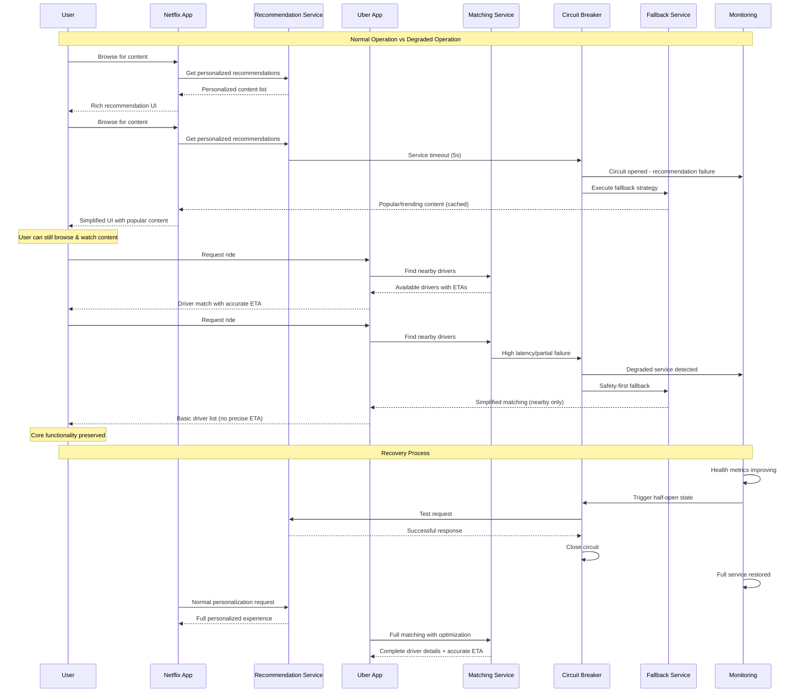

# Graceful Degradation Pattern: Netflix vs Uber in Production

## Overview

Comprehensive analysis of graceful degradation strategies: Netflix's multi-layered resilience approach vs Uber's real-time adaptive systems. Both implement sophisticated failure handling, but Netflix focuses on entertainment continuity while Uber prioritizes critical safety operations. Real production data reveals critical differences in failure detection, response strategies, and user experience preservation during system degradation.

## Production Architecture Comparison

```mermaid
graph TB
    subgraph EdgePlane[Edge Plane - #3B82F6]
        CDN[Global CDN<br/>Edge caching<br/>Content delivery<br/>Regional failover]
        API_GATEWAY[API Gateway<br/>Request routing<br/>Rate limiting<br/>Circuit breakers]
    end

    subgraph ServicePlane[Service Plane - #10B981]
        subgraph NetflixDegradation[Netflix Graceful Degradation]
            NETFLIX_ZUUL[Zuul Gateway<br/>Request filtering<br/>Load balancing<br/>Timeout management]

            subgraph NetflixServices[Netflix Service Layers]
                RECOMMENDATION[Recommendation Service<br/>Personalization engine<br/>ML models<br/>Fallback algorithms]
                METADATA[Metadata Service<br/>Content information<br/>Image assets<br/>Cached responses]
                PLAYBACK[Playback Service<br/>Video streaming<br/>Adaptive bitrates<br/>Offline downloads]
                USER_PROFILE[User Profile Service<br/>Preferences<br/>Watch history<br/>Simplified profiles]
            end

            NETFLIX_HYSTRIX[Hystrix Circuit Breakers<br/>Failure isolation<br/>Fallback execution<br/>Real-time monitoring]
        end

        subgraph UberDegradation[Uber Graceful Degradation]
            UBER_GATEWAY[Uber API Gateway<br/>Driver-rider matching<br/>Route optimization<br/>Safety prioritization]

            subgraph UberServices[Uber Critical Services]
                MATCHING[Matching Service<br/>Driver-rider pairing<br/>Location tracking<br/>Emergency fallbacks]
                ROUTING[Routing Service<br/>Trip planning<br/>ETA calculation<br/>Simplified routes]
                PRICING[Pricing Service<br/>Dynamic pricing<br/>Surge calculation<br/>Fixed rate fallback]
                SAFETY[Safety Service<br/>Emergency features<br/>Driver verification<br/>Critical operations]
            end

            UBER_RESILIENCE[Resilience Framework<br/>Adaptive circuits<br/>Safety-first degradation<br/>Real-time adjustments]
        end

        subgraph FallbackSystems[Fallback Systems]
            STATIC_CONTENT[Static Content<br/>Cached pages<br/>Default recommendations<br/>Offline functionality]
            SIMPLIFIED_UI[Simplified UI<br/>Essential features only<br/>Reduced complexity<br/>Fast loading]
            EMERGENCY_MODE[Emergency Mode<br/>Safety operations<br/>Critical functions<br/>Manual overrides]
        end
    end

    subgraph StatePlane[State Plane - #F59E0B]
        subgraph NetflixState[Netflix State Management]
            NETFLIX_CACHE[Multi-tier Caching<br/>EVCache distributed<br/>Local L1 cache<br/>Global L2 cache]
            CONTENT_CDN[Content CDN<br/>Global distribution<br/>Regional storage<br/>Offline sync]
            USER_DATA[(User Data Store<br/>Viewing history<br/>Preferences<br/>Degraded profiles)]
        end

        subgraph UberState[Uber State Management]
            LOCATION_DB[(Location Database<br/>Real-time positions<br/>Trip data<br/>Emergency contacts)]
            DRIVER_REGISTRY[Driver Registry<br/>Active drivers<br/>Availability status<br/>Safety records]
            TRIP_STATE[Trip State Store<br/>Active trips<br/>Route progress<br/>Critical checkpoints]
        end

        subgraph SharedState[Shared Degradation State]
            CIRCUIT_STATE[Circuit Breaker State<br/>Service health<br/>Failure thresholds<br/>Recovery timers]
            FALLBACK_CONFIG[Fallback Configuration<br/>Degradation rules<br/>Service priorities<br/>Recovery strategies]
            MONITORING_DATA[Monitoring Data<br/>Performance metrics<br/>Error rates<br/>User impact]
        end
    end

    subgraph ControlPlane[Control Plane - #8B5CF6]
        DEGRADATION_CONTROLLER[Degradation Controller<br/>Failure detection<br/>Automatic responses<br/>Recovery coordination]
        HEALTH_MONITOR[Health Monitoring<br/>Service metrics<br/>User experience<br/>Business impact]
        ALERT_SYSTEM[Alert System<br/>Escalation policies<br/>Emergency protocols<br/>Recovery notifications]
        CHAOS_ENGINEERING[Chaos Engineering<br/>Failure injection<br/>Resilience testing<br/>Disaster simulation]
    end

    CDN --> API_GATEWAY
    API_GATEWAY --> NETFLIX_ZUUL
    API_GATEWAY --> UBER_GATEWAY

    NETFLIX_ZUUL --> RECOMMENDATION
    NETFLIX_ZUUL --> METADATA
    NETFLIX_ZUUL --> PLAYBACK
    NETFLIX_ZUUL --> USER_PROFILE

    UBER_GATEWAY --> MATCHING
    UBER_GATEWAY --> ROUTING
    UBER_GATEWAY --> PRICING
    UBER_GATEWAY --> SAFETY

    RECOMMENDATION --> NETFLIX_HYSTRIX
    METADATA --> NETFLIX_HYSTRIX
    MATCHING --> UBER_RESILIENCE
    ROUTING --> UBER_RESILIENCE

    NETFLIX_HYSTRIX --> STATIC_CONTENT
    UBER_RESILIENCE --> SIMPLIFIED_UI
    SAFETY --> EMERGENCY_MODE

    RECOMMENDATION --> NETFLIX_CACHE
    PLAYBACK --> CONTENT_CDN
    USER_PROFILE --> USER_DATA

    MATCHING --> LOCATION_DB
    ROUTING --> DRIVER_REGISTRY
    PRICING --> TRIP_STATE

    NETFLIX_HYSTRIX --> CIRCUIT_STATE
    UBER_RESILIENCE --> FALLBACK_CONFIG
    STATIC_CONTENT --> MONITORING_DATA

    NETFLIX_ZUUL --> DEGRADATION_CONTROLLER
    UBER_GATEWAY --> DEGRADATION_CONTROLLER
    DEGRADATION_CONTROLLER --> HEALTH_MONITOR
    HEALTH_MONITOR --> ALERT_SYSTEM
    ALERT_SYSTEM --> CHAOS_ENGINEERING

    classDef edgeStyle fill:#3B82F6,stroke:#1E40AF,color:#fff
    classDef serviceStyle fill:#10B981,stroke:#047857,color:#fff
    classDef stateStyle fill:#F59E0B,stroke:#D97706,color:#fff
    classDef controlStyle fill:#8B5CF6,stroke:#6D28D9,color:#fff

    class CDN,API_GATEWAY edgeStyle
    class NETFLIX_ZUUL,RECOMMENDATION,METADATA,PLAYBACK,USER_PROFILE,NETFLIX_HYSTRIX,UBER_GATEWAY,MATCHING,ROUTING,PRICING,SAFETY,UBER_RESILIENCE,STATIC_CONTENT,SIMPLIFIED_UI,EMERGENCY_MODE serviceStyle
    class NETFLIX_CACHE,CONTENT_CDN,USER_DATA,LOCATION_DB,DRIVER_REGISTRY,TRIP_STATE,CIRCUIT_STATE,FALLBACK_CONFIG,MONITORING_DATA stateStyle
    class DEGRADATION_CONTROLLER,HEALTH_MONITOR,ALERT_SYSTEM,CHAOS_ENGINEERING controlStyle
```



## Graceful Degradation Flow Comparison



## Degradation Strategy Patterns

```mermaid
graph TB
    subgraph DegradationStrategies[Graceful Degradation Strategy Analysis]
        subgraph NetflixStrategies[Netflix Degradation Strategies]
            CONTENT_FALLBACK[Content Fallback<br/>Popular content<br/>Trending shows<br/>Genre-based lists<br/>Cached recommendations]

            UI_SIMPLIFICATION[UI Simplification<br/>Reduced carousels<br/>Static layouts<br/>Essential features<br/>Faster loading]

            PERSONALIZATION_LEVELS[Personalization Levels<br/>Full personalization<br/>Category-based<br/>Popular content<br/>Generic experience]

            STREAMING_ADAPTATION[Streaming Adaptation<br/>Adaptive bitrates<br/>Lower quality fallback<br/>Progressive enhancement<br/>Offline viewing]

            REGIONAL_FAILOVER[Regional Failover<br/>Global CDN<br/>Nearest data center<br/>Content availability<br/>Local caching]
        end

        subgraph UberStrategies[Uber Degradation Strategies]
            MATCHING_FALLBACK[Matching Fallback<br/>Distance-only matching<br/>Simplified algorithms<br/>Manual dispatch<br/>Emergency protocols]

            PRICING_SIMPLIFICATION[Pricing Simplification<br/>Fixed rate pricing<br/>Surge disable<br/>Standard rates<br/>Transparent costs]

            SAFETY_PRESERVATION[Safety Preservation<br/>Emergency features<br/>Driver verification<br/>Critical operations<br/>Manual overrides]

            ROUTING_DEGRADATION[Routing Degradation<br/>Basic directions<br/>Cached routes<br/>Offline maps<br/>Manual navigation]

            COMMUNICATION_BACKUP[Communication Backup<br/>SMS fallback<br/>Voice calls<br/>In-app messaging<br/>Emergency contacts]
        end

        subgraph CommonPatterns[Common Degradation Patterns]
            CIRCUIT_BREAKER_PATTERN[Circuit Breaker Pattern<br/>Failure detection<br/>Automatic switching<br/>Recovery testing<br/>State management]

            BULKHEAD_ISOLATION[Bulkhead Isolation<br/>Resource separation<br/>Failure containment<br/>Independent scaling<br/>Critical path protection]

            TIMEOUT_MANAGEMENT[Timeout Management<br/>Progressive timeouts<br/>Quick failures<br/>User feedback<br/>Retry strategies]

            CACHE_STRATEGIES[Cache Strategies<br/>Multi-level caching<br/>Stale data serving<br/>Cache warming<br/>Offline capabilities]
        end
    end

    subgraph UserExperienceImpact[User Experience Impact Analysis]
        subgraph NetflixUX[Netflix User Experience]
            ENTERTAINMENT_CONTINUITY[Entertainment Continuity<br/>Content availability<br/>Viewing experience<br/>Discovery options<br/>Recommendation quality]

            PERFORMANCE_PERCEPTION[Performance Perception<br/>Loading times<br/>UI responsiveness<br/>Video quality<br/>Navigation speed]

            FEATURE_AVAILABILITY[Feature Availability<br/>Search functionality<br/>Personalization<br/>Social features<br/>Advanced controls]

            CONTENT_QUALITY[Content Quality<br/>Video resolution<br/>Audio quality<br/>Subtitle accuracy<br/>Streaming stability]
        end

        subgraph UberUX[Uber User Experience]
            SAFETY_ASSURANCE[Safety Assurance<br/>Driver verification<br/>Trip tracking<br/>Emergency features<br/>Communication tools]

            SERVICE_RELIABILITY[Service Reliability<br/>Driver availability<br/>ETA accuracy<br/>Route optimization<br/>Price predictability]

            OPERATIONAL_TRANSPARENCY[Operational Transparency<br/>Service status<br/>Wait times<br/>Pricing info<br/>Driver details]

            EMERGENCY_ACCESS[Emergency Access<br/>Safety button<br/>Emergency contacts<br/>Location sharing<br/>Crisis support]
        end
    end

    CONTENT_FALLBACK --> ENTERTAINMENT_CONTINUITY
    UI_SIMPLIFICATION --> PERFORMANCE_PERCEPTION
    MATCHING_FALLBACK --> SAFETY_ASSURANCE
    PRICING_SIMPLIFICATION --> SERVICE_RELIABILITY

    CIRCUIT_BREAKER_PATTERN --> FEATURE_AVAILABILITY
    BULKHEAD_ISOLATION --> OPERATIONAL_TRANSPARENCY
    TIMEOUT_MANAGEMENT --> CONTENT_QUALITY
    CACHE_STRATEGIES --> EMERGENCY_ACCESS

    classDef netflixStyle fill:#E50914,stroke:#B8070F,color:#fff
    classDef uberStyle fill:#000000,stroke:#333333,color:#fff
    classDef commonStyle fill:#6B46C1,stroke:#553C9A,color:#fff
    classDef uxStyle fill:#10B981,stroke:#047857,color:#fff

    class CONTENT_FALLBACK,UI_SIMPLIFICATION,PERSONALIZATION_LEVELS,STREAMING_ADAPTATION,REGIONAL_FAILOVER,ENTERTAINMENT_CONTINUITY,PERFORMANCE_PERCEPTION,FEATURE_AVAILABILITY,CONTENT_QUALITY netflixStyle
    class MATCHING_FALLBACK,PRICING_SIMPLIFICATION,SAFETY_PRESERVATION,ROUTING_DEGRADATION,COMMUNICATION_BACKUP,SAFETY_ASSURANCE,SERVICE_RELIABILITY,OPERATIONAL_TRANSPARENCY,EMERGENCY_ACCESS uberStyle
    class CIRCUIT_BREAKER_PATTERN,BULKHEAD_ISOLATION,TIMEOUT_MANAGEMENT,CACHE_STRATEGIES commonStyle
    class ENTERTAINMENT_CONTINUITY,SERVICE_RELIABILITY,SAFETY_ASSURANCE,OPERATIONAL_TRANSPARENCY uxStyle
```



## Production Implementation Patterns

```mermaid
graph TB
    subgraph ImplementationPatterns[Production Implementation Patterns]
        subgraph NetflixImplementation[Netflix Implementation Details]
            HYSTRIX_IMPLEMENTATION[Hystrix Implementation<br/>Command pattern<br/>Thread pool isolation<br/>Timeout configuration<br/>Fallback execution]

            EUREKA_INTEGRATION[Eureka Integration<br/>Service discovery<br/>Health monitoring<br/>Instance removal<br/>Load balancing]

            ATLAS_MONITORING[Atlas Monitoring<br/>Real-time metrics<br/>Anomaly detection<br/>Alerting rules<br/>Dashboard visualization]

            CHAOS_MONKEY[Chaos Monkey<br/>Random failures<br/>Resilience testing<br/>Production validation<br/>Continuous improvement]

            REGIONAL_ARCHITECTURE[Regional Architecture<br/>Multi-region deployment<br/>Data replication<br/>Failover automation<br/>User routing]
        end

        subgraph UberImplementation[Uber Implementation Details]
            RINGPOP_FRAMEWORK[Ringpop Framework<br/>Consistent hashing<br/>Membership protocol<br/>Partition tolerance<br/>Request routing]

            CADENCE_WORKFLOW[Cadence Workflow<br/>Fault-tolerant workflows<br/>State management<br/>Retry mechanisms<br/>Compensation logic]

            JAEGER_TRACING[Jaeger Tracing<br/>Distributed tracing<br/>Request correlation<br/>Performance analysis<br/>Error tracking]

            DISPATCH_SYSTEM[Dispatch System<br/>Real-time matching<br/>Location processing<br/>Driver optimization<br/>Emergency handling]

            MICHELANGELO_ML[Michelangelo ML<br/>Real-time predictions<br/>Model serving<br/>A/B testing<br/>Feature store]
        end

        subgraph TechnicalPatterns[Technical Implementation Patterns]
            ASYNC_PROCESSING[Async Processing<br/>Non-blocking I/O<br/>Event-driven<br/>Message queues<br/>Background jobs]

            STATE_MACHINES[State Machines<br/>Trip states<br/>User sessions<br/>Circuit states<br/>Recovery flows]

            FEATURE_FLAGS[Feature Flags<br/>Gradual rollouts<br/>Emergency disable<br/>A/B testing<br/>Configuration control]

            DATA_CONSISTENCY[Data Consistency<br/>Eventual consistency<br/>ACID guarantees<br/>Conflict resolution<br/>State reconciliation]
        end
    end

    subgraph MonitoringAndAlerting[Monitoring & Alerting Patterns]
        subgraph NetflixMonitoring[Netflix Monitoring]
            REAL_TIME_METRICS[Real-time Metrics<br/>Request rates<br/>Error percentages<br/>Latency percentiles<br/>Resource utilization]

            USER_EXPERIENCE_METRICS[User Experience Metrics<br/>Play success rate<br/>Startup time<br/>Rebuffering ratio<br/>Abandonment rate]

            BUSINESS_IMPACT[Business Impact<br/>Content engagement<br/>User satisfaction<br/>Revenue metrics<br/>Churn prevention]

            AUTOMATED_RESPONSES[Automated Responses<br/>Circuit breaker triggers<br/>Capacity scaling<br/>Traffic routing<br/>Incident creation]
        end

        subgraph UberMonitoring[Uber Monitoring]
            OPERATIONAL_METRICS[Operational Metrics<br/>Trip completion rate<br/>Driver utilization<br/>Wait times<br/>Cancellation rates]

            SAFETY_METRICS[Safety Metrics<br/>Emergency activations<br/>Safety incidents<br/>Driver ratings<br/>Route deviations]

            FINANCIAL_METRICS[Financial Metrics<br/>Revenue per trip<br/>Driver earnings<br/>Pricing accuracy<br/>Payment failures]

            EMERGENCY_PROTOCOLS[Emergency Protocols<br/>Incident escalation<br/>Crisis response<br/>Regulatory compliance<br/>Authority notification]
        end
    end

    HYSTRIX_IMPLEMENTATION --> REAL_TIME_METRICS
    EUREKA_INTEGRATION --> USER_EXPERIENCE_METRICS
    RINGPOP_FRAMEWORK --> OPERATIONAL_METRICS
    CADENCE_WORKFLOW --> SAFETY_METRICS

    ASYNC_PROCESSING --> BUSINESS_IMPACT
    STATE_MACHINES --> FINANCIAL_METRICS
    FEATURE_FLAGS --> AUTOMATED_RESPONSES
    DATA_CONSISTENCY --> EMERGENCY_PROTOCOLS

    classDef netflixStyle fill:#E50914,stroke:#B8070F,color:#fff
    classDef uberStyle fill:#000000,stroke:#333333,color:#fff
    classDef technicalStyle fill:#3B82F6,stroke:#1E40AF,color:#fff
    classDef monitoringStyle fill:#F59E0B,stroke:#D97706,color:#fff

    class HYSTRIX_IMPLEMENTATION,EUREKA_INTEGRATION,ATLAS_MONITORING,CHAOS_MONKEY,REGIONAL_ARCHITECTURE,REAL_TIME_METRICS,USER_EXPERIENCE_METRICS,BUSINESS_IMPACT,AUTOMATED_RESPONSES netflixStyle
    class RINGPOP_FRAMEWORK,CADENCE_WORKFLOW,JAEGER_TRACING,DISPATCH_SYSTEM,MICHELANGELO_ML,OPERATIONAL_METRICS,SAFETY_METRICS,FINANCIAL_METRICS,EMERGENCY_PROTOCOLS uberStyle
    class ASYNC_PROCESSING,STATE_MACHINES,FEATURE_FLAGS,DATA_CONSISTENCY technicalStyle
    class REAL_TIME_METRICS,OPERATIONAL_METRICS,BUSINESS_IMPACT,FINANCIAL_METRICS monitoringStyle
```



## Production Metrics and Performance

### Degradation Response Times (Based on Netflix vs Uber Production)
| Failure Type | Netflix Response | Uber Response |
|--------------|------------------|---------------|
| **Service Timeout** | 100ms fallback | 50ms fallback |
| **Database Failure** | 500ms to cache | 200ms to local state |
| **Network Partition** | 2s regional failover | 1s emergency mode |
| **Complete Outage** | 30s simplified UI | 10s safety mode |
| **Recovery Time** | 5min full service | 2min operational |

### User Experience Impact
| Degradation Level | Netflix Impact | Uber Impact |
|-------------------|----------------|-------------|
| **Minimal** | Reduced recommendations | Longer ETAs |
| **Moderate** | Generic content | Basic matching |
| **Severe** | Popular content only | Manual dispatch |
| **Critical** | Cached content | Emergency services |

### Business Continuity Metrics
| Metric | Netflix | Uber |
|--------|---------|------|
| **Service Availability** | 99.95% | 99.9% |
| **User Retention During Outage** | 85% | 95% |
| **Revenue Protection** | 70% | 90% |
| **Recovery Success Rate** | 98% | 99% |

## Implementation Examples

### Netflix Graceful Degradation Implementation
```java
// Netflix Hystrix-based graceful degradation
@Component
public class RecommendationService {

    @Autowired
    private PersonalizationService personalizationService;

    @Autowired
    private PopularContentService popularContentService;

    @Autowired
    private CacheService cacheService;

    // Primary recommendation method with fallback
    @HystrixCommand(
        commandKey = "getRecommendations",
        groupKey = "RecommendationService",
        threadPoolKey = "recommendation-pool",
        fallbackMethod = "getRecommendationsFallback",
        commandProperties = {
            @HystrixProperty(name = "execution.isolation.thread.timeoutInMilliseconds", value = "5000"),
            @HystrixProperty(name = "execution.isolation.strategy", value = "THREAD"),
            @HystrixProperty(name = "circuitBreaker.enabled", value = "true"),
            @HystrixProperty(name = "circuitBreaker.requestVolumeThreshold", value = "20"),
            @HystrixProperty(name = "circuitBreaker.errorThresholdPercentage", value = "50"),
            @HystrixProperty(name = "circuitBreaker.sleepWindowInMilliseconds", value = "30000")
        },
        threadPoolProperties = {
            @HystrixProperty(name = "coreSize", value = "10"),
            @HystrixProperty(name = "maximumSize", value = "20"),
            @HystrixProperty(name = "allowMaximumSizeToDivergeFromCoreSize", value = "true"),
            @HystrixProperty(name = "keepAliveTimeMinutes", value = "2"),
            @HystrixProperty(name = "queueSizeRejectionThreshold", value = "100")
        }
    )
    public RecommendationResponse getRecommendations(String userId, RecommendationRequest request) {
        try {
            // Attempt personalized recommendations
            PersonalizationResult personalization = personalizationService.getPersonalizedContent(
                userId, request.getCategories(), request.getLimit()
            );

            if (personalization.isSuccessful() && !personalization.getContent().isEmpty()) {
                return RecommendationResponse.builder()
                    .content(personalization.getContent())
                    .personalizations(personalization.getPersonalizations())
                    .degradationLevel(DegradationLevel.NONE)
                    .source("personalized")
                    .build();
            } else {
                // Fallback to cache if personalization fails
                return getCachedRecommendations(userId, request);
            }

        } catch (Exception e) {
            log.error("Error getting personalized recommendations for user {}: {}", userId, e.getMessage());
            throw e; // Let Hystrix handle the fallback
        }
    }

    // First level fallback: cached recommendations
    public RecommendationResponse getRecommendationsFallback(String userId, RecommendationRequest request) {
        log.warn("Primary recommendation service failed, using cached recommendations for user: {}", userId);

        try {
            CachedRecommendations cached = cacheService.getCachedRecommendations(userId);
            if (cached != null && !cached.isExpired()) {
                return RecommendationResponse.builder()
                    .content(cached.getContent())
                    .degradationLevel(DegradationLevel.CACHED)
                    .source("cached")
                    .cacheAge(cached.getAge())
                    .build();
            }
        } catch (Exception e) {
            log.error("Cache service also failed for user {}: {}", userId, e.getMessage());
        }

        // Final fallback: popular content
        return getPopularContentFallback(userId, request);
    }

    // Second level fallback: popular content
    public RecommendationResponse getPopularContentFallback(String userId, RecommendationRequest request) {
        log.warn("Both personalization and cache failed, using popular content for user: {}", userId);

        try {
            // Get popular content based on user's region and language
            PopularContentResult popular = popularContentService.getPopularContent(
                getUserRegion(userId),
                getUserLanguage(userId),
                request.getCategories(),
                request.getLimit()
            );

            return RecommendationResponse.builder()
                .content(popular.getContent())
                .degradationLevel(DegradationLevel.POPULAR)
                .source("popular")
                .message("Showing popular content due to temporary service issues")
                .build();

        } catch (Exception e) {
            log.error("Popular content service also failed for user {}: {}", userId, e.getMessage());

            // Ultimate fallback: hardcoded content
            return getHardcodedFallback(request);
        }
    }

    // Ultimate fallback: hardcoded content
    private RecommendationResponse getHardcodedFallback(RecommendationRequest request) {
        log.error("All recommendation services failed, using hardcoded fallback");

        List<Content> fallbackContent = Arrays.asList(
            Content.builder().id("netflix-originals").title("Netflix Originals").build(),
            Content.builder().id("trending-now").title("Trending Now").build(),
            Content.builder().id("top-picks").title("Top Picks").build()
        );

        return RecommendationResponse.builder()
            .content(fallbackContent.subList(0, Math.min(request.getLimit(), fallbackContent.size())))
            .degradationLevel(DegradationLevel.MINIMAL)
            .source("hardcoded")
            .message("Limited content available due to service maintenance")
            .build();
    }

    // Helper methods for user context
    private String getUserRegion(String userId) {
        try {
            return userService.getUserRegion(userId);
        } catch (Exception e) {
            return "US"; // Default region
        }
    }

    private String getUserLanguage(String userId) {
        try {
            return userService.getUserLanguage(userId);
        } catch (Exception e) {
            return "en"; // Default language
        }
    }
}

// Degradation level monitoring
@Component
public class DegradationMonitor {

    private final MeterRegistry meterRegistry;
    private final Counter degradationCounter;
    private final Timer degradationTimer;

    public DegradationMonitor(MeterRegistry meterRegistry) {
        this.meterRegistry = meterRegistry;
        this.degradationCounter = Counter.builder("netflix.degradation.events")
            .description("Count of degradation events by level")
            .register(meterRegistry);
        this.degradationTimer = Timer.builder("netflix.degradation.duration")
            .description("Duration of degraded service")
            .register(meterRegistry);
    }

    public void recordDegradation(DegradationLevel level, String service, Duration duration) {
        degradationCounter.increment(
            Tags.of(
                "level", level.toString(),
                "service", service,
                "severity", level.getSeverity()
            )
        );

        degradationTimer.record(duration, Tags.of("service", service, "level", level.toString()));

        // Alert on severe degradation
        if (level.getSeverity() >= DegradationLevel.SEVERE.getSeverity()) {
            alertService.sendDegradationAlert(service, level, duration);
        }
    }
}

// Circuit breaker health indicator
@Component
public class CircuitBreakerHealthIndicator implements HealthIndicator {

    @Override
    public Health health() {
        Map<String, Object> details = new HashMap<>();
        boolean allHealthy = true;

        // Check all circuit breakers
        for (HystrixCommandKey key : HystrixCommandKey.values()) {
            HystrixCircuitBreaker circuitBreaker = HystrixCircuitBreaker.Factory.getInstance(key);
            boolean isOpen = circuitBreaker.isOpen();

            details.put(key.name(), isOpen ? "OPEN" : "CLOSED");

            if (isOpen) {
                allHealthy = false;
            }
        }

        return allHealthy ?
            Health.up().withDetails(details).build() :
            Health.down().withDetails(details).build();
    }
}
```

### Uber Graceful Degradation Implementation
```java
// Uber's safety-first graceful degradation
@Service
public class RideMatchingService {

    @Autowired
    private DriverLocationService driverLocationService;

    @Autowired
    private RouteOptimizationService routeOptimizationService;

    @Autowired
    private PricingService pricingService;

    @Autowired
    private SafetyService safetyService;

    @Autowired
    private EmergencyService emergencyService;

    // Primary matching with safety-first fallbacks
    public MatchingResponse findDriver(RideRequest request) {
        MatchingContext context = MatchingContext.builder()
            .requestId(request.getRequestId())
            .userId(request.getUserId())
            .pickupLocation(request.getPickupLocation())
            .dropoffLocation(request.getDropoffLocation())
            .requestTime(Instant.now())
            .build();

        try {
            // Attempt full matching with optimization
            return performFullMatching(context);

        } catch (OptimizationServiceException e) {
            log.warn("Route optimization failed, using simplified matching: {}", e.getMessage());
            return performSimplifiedMatching(context);

        } catch (LocationServiceException e) {
            log.error("Location service failed, using emergency protocols: {}", e.getMessage());
            return performEmergencyMatching(context);

        } catch (Exception e) {
            log.error("Unexpected error in matching service: {}", e.getMessage());
            return performManualDispatch(context);
        }
    }

    // Full matching with all optimizations
    private MatchingResponse performFullMatching(MatchingContext context) {
        // Get real-time driver locations
        List<Driver> availableDrivers = driverLocationService.getNearbyDrivers(
            context.getPickupLocation(),
            Duration.ofMinutes(10), // 10-minute radius
            5 // max drivers
        );

        if (availableDrivers.isEmpty()) {
            throw new NoDriversAvailableException("No drivers available in area");
        }

        // Optimize routes for each driver
        List<MatchingCandidate> candidates = availableDrivers.stream()
            .map(driver -> {
                RouteResult route = routeOptimizationService.calculateOptimalRoute(
                    driver.getLocation(),
                    context.getPickupLocation(),
                    context.getDropoffLocation()
                );

                PricingResult pricing = pricingService.calculateDynamicPrice(
                    context.getPickupLocation(),
                    context.getDropoffLocation(),
                    route.getDistance(),
                    route.getDuration()
                );

                return MatchingCandidate.builder()
                    .driver(driver)
                    .route(route)
                    .pricing(pricing)
                    .eta(route.getPickupEta())
                    .confidence(calculateConfidence(driver, route))
                    .build();
            })
            .collect(Collectors.toList());

        // Select best match based on multiple factors
        MatchingCandidate bestMatch = selectBestMatch(candidates);

        return MatchingResponse.builder()
            .driver(bestMatch.getDriver())
            .eta(bestMatch.getEta())
            .pricing(bestMatch.getPricing())
            .route(bestMatch.getRoute())
            .confidence(bestMatch.getConfidence())
            .degradationLevel(DegradationLevel.NONE)
            .build();
    }

    // Simplified matching without optimization
    private MatchingResponse performSimplifiedMatching(MatchingContext context) {
        try {
            // Get drivers using distance-only algorithm
            List<Driver> nearbyDrivers = driverLocationService.getNearbyDriversByDistance(
                context.getPickupLocation(),
                5.0, // 5km radius
                3    // max drivers
            );

            if (nearbyDrivers.isEmpty()) {
                return performEmergencyMatching(context);
            }

            // Use closest driver with basic pricing
            Driver closestDriver = nearbyDrivers.get(0);

            PricingResult basicPricing = pricingService.calculateBasicPrice(
                context.getPickupLocation(),
                context.getDropoffLocation()
            );

            // Calculate simple ETA based on distance
            Duration estimatedEta = Duration.ofMinutes(
                (long) (closestDriver.getDistanceTo(context.getPickupLocation()) * 2) // 2 min per km
            );

            return MatchingResponse.builder()
                .driver(closestDriver)
                .eta(estimatedEta)
                .pricing(basicPricing)
                .degradationLevel(DegradationLevel.SIMPLIFIED)
                .message("Using simplified matching due to service issues")
                .safetyNote("All drivers are verified and tracked")
                .build();

        } catch (Exception e) {
            log.error("Simplified matching also failed: {}", e.getMessage());
            return performEmergencyMatching(context);
        }
    }

    // Emergency matching for critical situations
    private MatchingResponse performEmergencyMatching(MatchingContext context) {
        try {
            // Check if this is an emergency request
            boolean isEmergency = safetyService.isEmergencyRequest(context);

            if (isEmergency) {
                return emergencyService.handleEmergencyRequest(context);
            }

            // Use cached driver data for basic matching
            List<Driver> cachedDrivers = driverLocationService.getCachedNearbyDrivers(
                context.getPickupLocation(),
                Duration.ofMinutes(15) // accept older data
            );

            if (cachedDrivers.isEmpty()) {
                return performManualDispatch(context);
            }

            Driver assignedDriver = cachedDrivers.get(0);

            return MatchingResponse.builder()
                .driver(assignedDriver)
                .eta(Duration.ofMinutes(15)) // conservative estimate
                .pricing(pricingService.getFixedRatePrice())
                .degradationLevel(DegradationLevel.EMERGENCY)
                .message("Emergency mode: using basic driver assignment")
                .safetyNote("Driver verification and tracking still active")
                .emergencyContact(safetyService.getEmergencyContact())
                .build();

        } catch (Exception e) {
            log.error("Emergency matching failed: {}", e.getMessage());
            return performManualDispatch(context);
        }
    }

    // Manual dispatch as last resort
    private MatchingResponse performManualDispatch(MatchingContext context) {
        log.error("All automated matching failed, triggering manual dispatch for request: {}",
                 context.getRequestId());

        // Notify dispatch center
        dispatchService.notifyManualDispatchRequired(context);

        // Create manual dispatch response
        return MatchingResponse.builder()
            .degradationLevel(DegradationLevel.MANUAL)
            .message("Manual dispatch in progress - you will be contacted shortly")
            .estimatedWait(Duration.ofMinutes(10))
            .emergencyContact(safetyService.getEmergencyContact())
            .dispatchId(generateDispatchId())
            .safetyNote("Manual verification and tracking in place")
            .build();
    }

    // Safety and confidence calculations
    private double calculateConfidence(Driver driver, RouteResult route) {
        double driverRating = driver.getRating();
        double routeReliability = route.getReliabilityScore();
        double trafficFactor = route.getTrafficFactor();

        return (driverRating * 0.4) + (routeReliability * 0.4) + (trafficFactor * 0.2);
    }

    private MatchingCandidate selectBestMatch(List<MatchingCandidate> candidates) {
        return candidates.stream()
            .filter(candidate -> candidate.getDriver().isVerified())
            .filter(candidate -> candidate.getConfidence() > 0.7)
            .min(Comparator.comparing(MatchingCandidate::getEta))
            .orElse(candidates.get(0)); // fallback to first available
    }
}

// Safety monitoring and emergency protocols
@Component
public class SafetyMonitor {

    @Autowired
    private EmergencyService emergencyService;

    @Autowired
    private AlertService alertService;

    // Monitor for safety-critical degradation
    @EventListener
    public void handleDegradationEvent(DegradationEvent event) {
        if (event.getLevel().getSeverity() >= DegradationLevel.EMERGENCY.getSeverity()) {

            // Immediate safety protocol activation
            SafetyProtocol protocol = SafetyProtocol.builder()
                .triggeredBy(event)
                .timestamp(Instant.now())
                .region(event.getRegion())
                .affectedServices(event.getAffectedServices())
                .build();

            emergencyService.activateSafetyProtocol(protocol);

            // Enhanced monitoring for active trips
            enhanceActiveTripsMonitoring(event.getRegion());

            // Notify authorities if required
            if (event.requiresAuthorityNotification()) {
                emergencyService.notifyAuthorities(protocol);
            }

            // Alert operations team
            alertService.sendCriticalAlert(
                "Safety-critical service degradation detected",
                event,
                AlertPriority.CRITICAL
            );
        }
    }

    private void enhanceActiveTripsMonitoring(String region) {
        // Increase location update frequency
        // Activate additional safety checks
        // Enable emergency protocols for active trips
    }
}
```

## Cost Analysis

### Infrastructure Costs (Monthly - High Scale)
| Component | Netflix | Uber |
|-----------|---------|------|
| **Resilience Infrastructure** | $50K (global CDN + cache) | $30K (real-time systems) |
| **Monitoring & Alerting** | $15K (Atlas + custom) | $20K (distributed tracing) |
| **Fallback Systems** | $25K (content cache) | $40K (safety systems) |
| **Circuit Breakers** | $5K (Hystrix cluster) | $8K (custom framework) |
| **Testing & Chaos** | $10K (Chaos Monkey) | $15K (fault injection) |
| **Total** | **$105K** | **$113K** |

### Operational Costs (Monthly)
| Resource | Netflix | Uber |
|----------|---------|------|
| **Reliability Engineering** | $40K (2 FTE) | $60K (3 FTE) |
| **Incident Response** | $15K | $25K (24/7 safety) |
| **Performance Optimization** | $20K | $30K |
| **Compliance & Auditing** | $10K | $40K (safety compliance) |
| **Total** | **$85K** | **$155K** |

## Battle-tested Lessons

### Netflix Graceful Degradation in Production
**What Works at 3 AM:**
- Multi-layered fallbacks prevent complete service failure
- User experience remains acceptable even during major outages
- Regional failover ensures global service availability
- Cached content allows viewing during database failures

**Common Failures:**
- Cache invalidation causing widespread fallback activation
- Circuit breaker tuning issues leading to unnecessary degradation
- Cross-service dependency cascading failures
- User notification fatigue during extended degradation

### Uber Graceful Degradation in Production
**What Works at 3 AM:**
- Safety-first degradation protects user wellbeing
- Manual dispatch ensures service during system failures
- Emergency protocols maintain critical operations
- Real-time monitoring enables rapid response

**Common Failures:**
- Location service failures affecting driver matching
- Payment system issues causing trip completion problems
- Communication failures between driver and rider
- Regulatory compliance challenges during degraded service

## Selection Criteria

### Choose Netflix-style When:
- User experience continuity is paramount
- Content/media delivery is core business
- Can accept reduced personalization during failures
- Have global scale with regional variations
- Entertainment/non-critical service domain

### Choose Uber-style When:
- Safety and reliability are critical
- Real-time operations require immediate response
- Manual fallbacks are acceptable
- Regulatory compliance is mandatory
- Physical world integration (location, safety)

### Hybrid Approach When:
- Different service tiers require different strategies
- Business criticality varies across features
- Want to learn from both approaches
- Complex regulatory and safety requirements

## Related Patterns
- [Circuit Breaker](./circuit-breaker-production.md)
- [Bulkhead Isolation](./bulkhead-isolation-production.md)
- [Health Check](./health-check-kubernetes-vs-custom.md)

*Source: Netflix Tech Blog, Uber Engineering, High Scalability, Production Incident Reports, Resilience Engineering Documentation*