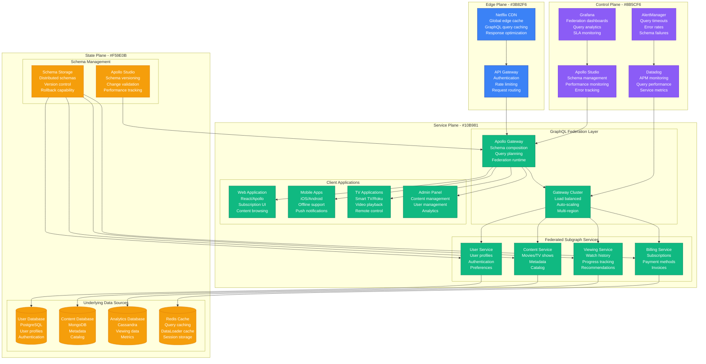
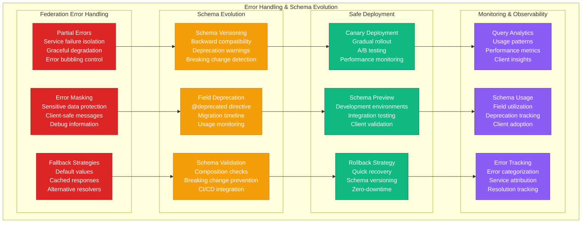

# GraphQL Federation: Netflix's Approach

## Overview

Netflix operates one of the largest GraphQL federation deployments with 200+ services exposing a unified graph to 50+ client applications. Their federated schema serves 10 billion GraphQL operations monthly while maintaining sub-100ms response times and 99.99% availability.

## Production Architecture



## Federated Schema Composition

```mermaid
graph TB
    subgraph SchemaFederation[GraphQL Schema Federation]
        subgraph UserSubgraph[User Subgraph]
            USER_TYPE[User Type<br/>id: ID! @key<br/>name: String<br/>email: String<br/>createdAt: DateTime]
            USER_RESOLVER[User Resolvers<br/>Query.user(id)<br/>User.profile<br/>User.preferences]
        end

        subgraph ContentSubgraph[Content Subgraph]
            CONTENT_TYPE[Content Type<br/>id: ID! @key<br/>title: String<br/>genre: [String]<br/>duration: Int]
            CONTENT_RESOLVER[Content Resolvers<br/>Query.content(id)<br/>Query.search<br/>Content.metadata]
            USER_EXTENSION[User Extension<br/>User.watchlist<br/>User.recommendations<br/>@extends type User]
        end

        subgraph ViewingSubgraph[Viewing Subgraph]
            VIEWING_TYPE[ViewingHistory Type<br/>id: ID! @key<br/>userId: ID!<br/>contentId: ID!<br/>watchedAt: DateTime]
            VIEWING_RESOLVER[Viewing Resolvers<br/>Query.viewingHistory<br/>ViewingHistory.user<br/>ViewingHistory.content]
            CONTENT_EXTENSION[Content Extension<br/>Content.viewCount<br/>Content.avgRating<br/>@extends type Content]
        end

        subgraph ComposedSchema[Composed Federated Schema]
            UNIFIED_SCHEMA[Unified Schema<br/>All types combined<br/>Cross-service references<br/>Type extensions merged]
            QUERY_PLANNER[Query Planner<br/>Query analysis<br/>Execution planning<br/>Service routing]
            FIELD_RESOLVER[Field Resolver<br/>Cross-service joins<br/>Entity resolution<br/>Data fetching]
        end
    end

    USER_TYPE --> USER_RESOLVER
    CONTENT_TYPE --> CONTENT_RESOLVER
    CONTENT_TYPE --> USER_EXTENSION
    VIEWING_TYPE --> VIEWING_RESOLVER
    VIEWING_TYPE --> CONTENT_EXTENSION

    USER_RESOLVER --> UNIFIED_SCHEMA
    CONTENT_RESOLVER --> UNIFIED_SCHEMA
    VIEWING_RESOLVER --> UNIFIED_SCHEMA
    USER_EXTENSION --> UNIFIED_SCHEMA
    CONTENT_EXTENSION --> UNIFIED_SCHEMA

    UNIFIED_SCHEMA --> QUERY_PLANNER
    QUERY_PLANNER --> FIELD_RESOLVER

    classDef userStyle fill:#10B981,stroke:#047857,color:#fff
    classDef contentStyle fill:#F59E0B,stroke:#D97706,color:#fff
    classDef viewingStyle fill:#8B5CF6,stroke:#6D28D9,color:#fff
    classDef composedStyle fill:#DC2626,stroke:#B91C1C,color:#fff

    class USER_TYPE,USER_RESOLVER userStyle
    class CONTENT_TYPE,CONTENT_RESOLVER,USER_EXTENSION contentStyle
    class VIEWING_TYPE,VIEWING_RESOLVER,CONTENT_EXTENSION viewingStyle
    class UNIFIED_SCHEMA,QUERY_PLANNER,FIELD_RESOLVER composedStyle
```

## Query Execution and Performance Optimization

```mermaid
graph TB
    subgraph QueryExecution[GraphQL Query Execution Flow]
        subgraph QueryPlanning[Query Planning Phase]
            QUERY_PARSE[Query Parsing<br/>AST generation<br/>Syntax validation<br/>Static analysis]
            QUERY_VALIDATION[Query Validation<br/>Schema validation<br/>Type checking<br/>Field availability]
            EXECUTION_PLAN[Execution Planning<br/>Service identification<br/>Dependency analysis<br/>Parallel execution]
        end

        subgraph DataFetching[Data Fetching Phase]
            ENTITY_RESOLUTION[Entity Resolution<br/>@key field fetching<br/>Cross-service references<br/>Entity caching]
            DATALOADER[DataLoader Pattern<br/>Request batching<br/>N+1 problem solution<br/>Caching layer]
            PARALLEL_EXECUTION[Parallel Execution<br/>Independent field fetching<br/>Service concurrency<br/>Response merging]
        end

        subgraph CachingStrategy[Caching Strategy]
            QUERY_CACHE[Query-level Cache<br/>Full query results<br/>Redis storage<br/>TTL-based expiration]
            FIELD_CACHE[Field-level Cache<br/>Individual field values<br/>Fine-grained caching<br/>Selective invalidation]
            ENTITY_CACHE[Entity Cache<br/>Complete entity objects<br/>Cross-query reuse<br/>Memory optimization]
        end

        subgraph PerformanceOptimization[Performance Optimization]
            QUERY_COMPLEXITY[Query Complexity<br/>Analysis scoring<br/>Depth limiting<br/>Cost analysis]
            PERSISTED_QUERIES[Persisted Queries<br/>Query whitelisting<br/>Reduced payload<br/>Security benefits]
            RESPONSE_COMPRESSION[Response Compression<br/>GZIP compression<br/>Bandwidth optimization<br/>CDN caching]
        end
    end

    QUERY_PARSE --> QUERY_VALIDATION
    QUERY_VALIDATION --> EXECUTION_PLAN

    EXECUTION_PLAN --> ENTITY_RESOLUTION
    ENTITY_RESOLUTION --> DATALOADER
    DATALOADER --> PARALLEL_EXECUTION

    PARALLEL_EXECUTION --> QUERY_CACHE
    QUERY_CACHE --> FIELD_CACHE
    FIELD_CACHE --> ENTITY_CACHE

    ENTITY_CACHE --> QUERY_COMPLEXITY
    QUERY_COMPLEXITY --> PERSISTED_QUERIES
    PERSISTED_QUERIES --> RESPONSE_COMPRESSION

    classDef planningStyle fill:#10B981,stroke:#047857,color:#fff
    classDef fetchingStyle fill:#F59E0B,stroke:#D97706,color:#fff
    classDef cachingStyle fill:#8B5CF6,stroke:#6D28D9,color:#fff
    classDef optimizationStyle fill:#DC2626,stroke:#B91C1C,color:#fff

    class QUERY_PARSE,QUERY_VALIDATION,EXECUTION_PLAN planningStyle
    class ENTITY_RESOLUTION,DATALOADER,PARALLEL_EXECUTION fetchingStyle
    class QUERY_CACHE,FIELD_CACHE,ENTITY_CACHE cachingStyle
    class QUERY_COMPLEXITY,PERSISTED_QUERIES,RESPONSE_COMPRESSION optimizationStyle
```



## Error Handling and Schema Evolution



## Production Metrics

### Federation Performance
- **Monthly Operations**: 10 billion GraphQL operations
- **Average Response Time**: P95 < 100ms
- **Gateway Throughput**: 50K requests/second
- **Schema Composition Time**: <5ms

### Query Analytics
- **Query Complexity**: Average depth 4, max depth 10
- **Field Usage**: 80% of schema fields actively used
- **Cache Hit Rate**: 70% query-level, 85% field-level
- **Error Rate**: <0.1% federation errors

### Schema Evolution
- **Active Subgraphs**: 200+ services
- **Schema Changes**: 500+ weekly deployments
- **Deprecation Timeline**: 90-day migration window
- **Breaking Changes**: <1% of schema updates

## Implementation Details

### Federation Gateway Configuration
```javascript
// Apollo Gateway configuration for Netflix
const { ApolloGateway, IntrospectAndCompose } = require('@apollo/gateway');
const { ApolloServer } = require('apollo-server-express');

const gateway = new ApolloGateway({
  supergraphSdl: new IntrospectAndCompose({
    subgraphs: [
      { name: 'user-service', url: 'https://user-service.netflix.internal/graphql' },
      { name: 'content-service', url: 'https://content-service.netflix.internal/graphql' },
      { name: 'viewing-service', url: 'https://viewing-service.netflix.internal/graphql' },
      { name: 'billing-service', url: 'https://billing-service.netflix.internal/graphql' }
    ],
    pollIntervalInMs: 30000, // Poll for schema changes every 30 seconds
  }),

  buildService({ name, url }) {
    return new RemoteGraphQLDataSource({
      url,
      willSendRequest({ request, context }) {
        // Forward authentication headers
        request.http.headers.set('authorization', context.authToken);
        request.http.headers.set('x-user-id', context.userId);
        request.http.headers.set('x-request-id', context.requestId);
      },
      didReceiveResponse({ response, request, context }) {
        // Log performance metrics
        console.log(JSON.stringify({
          service: name,
          operationName: request.operationName,
          duration: Date.now() - context.startTime,
          userId: context.userId,
          requestId: context.requestId
        }));
        return response;
      }
    });
  },

  experimental_pollInterval: 30000,
  debug: process.env.NODE_ENV !== 'production',

  // Error handling
  formatError: (err) => {
    // Log errors but mask sensitive information
    console.error('GraphQL Federation Error:', {
      message: err.message,
      path: err.path,
      source: err.source?.name,
      timestamp: new Date().toISOString()
    });

    // Return sanitized error to client
    return {
      message: err.message.includes('INTERNAL_ERROR')
        ? 'An internal error occurred'
        : err.message,
      path: err.path,
      extensions: {
        code: err.extensions?.code,
        serviceName: err.extensions?.serviceName
      }
    };
  }
});

const server = new ApolloServer({
  gateway,
  subscriptions: false,
  introspection: process.env.NODE_ENV !== 'production',
  playground: process.env.NODE_ENV !== 'production',

  context: ({ req }) => {
    return {
      authToken: req.headers.authorization,
      userId: req.headers['x-user-id'],
      requestId: req.headers['x-request-id'] || generateRequestId(),
      startTime: Date.now()
    };
  },

  plugins: [
    // Query complexity analysis
    {
      requestDidStart() {
        return {
          didResolveOperation({ request, document }) {
            const complexity = calculateQueryComplexity({
              estimators: [
                fieldExtensionsEstimator(),
                simpleEstimator({ maximumComplexity: 1000 })
              ],
              maximumComplexity: 1000,
              variables: request.variables,
              query: document
            });

            if (complexity > 1000) {
              throw new Error(`Query complexity ${complexity} exceeds maximum allowed complexity 1000`);
            }
          }
        };
      }
    },

    // Performance monitoring
    {
      requestDidStart() {
        return {
          willSendResponse({ response, context }) {
            const duration = Date.now() - context.startTime;

            // Send metrics to monitoring system
            metricsClient.histogram('graphql.request.duration', duration, {
              operation: context.request.operationName,
              userId: context.userId
            });

            metricsClient.increment('graphql.request.count', 1, {
              status: response.errors ? 'error' : 'success'
            });
          }
        };
      }
    }
  ]
});
```

### Subgraph Schema Definition
```graphql
# User Service Subgraph Schema
type User @key(fields: "id") {
  id: ID!
  name: String!
  email: String!
  createdAt: DateTime!
  profile: UserProfile
  preferences: UserPreferences
}

type UserProfile {
  avatar: String
  bio: String
  location: String
}

type UserPreferences {
  language: String!
  genres: [String!]!
  autoplay: Boolean!
  notifications: NotificationSettings!
}

type NotificationSettings {
  email: Boolean!
  push: Boolean!
  sms: Boolean!
}

extend type Query {
  user(id: ID!): User
  currentUser: User
  searchUsers(query: String!): [User!]!
}

extend type Mutation {
  updateUserProfile(input: UpdateUserProfileInput!): User!
  updateUserPreferences(input: UpdateUserPreferencesInput!): User!
}

# Content Service extends User type
extend type User @key(fields: "id") {
  id: ID! @external
  watchlist: [Content!]!
  recommendations: [Content!]!
  recentlyWatched: [Content!]!
}

type Content @key(fields: "id") {
  id: ID!
  title: String!
  description: String
  genre: [String!]!
  duration: Int!
  releaseDate: Date!
  rating: ContentRating!
  cast: [Person!]!
}

type ContentRating {
  average: Float!
  count: Int!
  distribution: RatingDistribution!
}

type RatingDistribution {
  one: Int!
  two: Int!
  three: Int!
  four: Int!
  five: Int!
}

extend type Query {
  content(id: ID!): Content
  searchContent(query: String!, filters: ContentFilters): [Content!]!
  trendingContent(limit: Int = 20): [Content!]!
}
```

### DataLoader Implementation
```javascript
// Optimized DataLoader for cross-service entity resolution
const DataLoader = require('dataloader');

class NetflixDataLoaders {
  constructor(context) {
    this.context = context;

    // User entity loader
    this.userLoader = new DataLoader(
      async (userIds) => {
        const users = await this.fetchUsersByIds(userIds);
        return userIds.map(id => users.find(user => user.id === id));
      },
      {
        maxBatchSize: 100,
        cache: true,
        cacheKeyFn: (key) => `user:${key}`,
        batchScheduleFn: (callback) => setTimeout(callback, 10)
      }
    );

    // Content entity loader with caching
    this.contentLoader = new DataLoader(
      async (contentIds) => {
        // Check Redis cache first
        const cached = await this.redis.mget(
          contentIds.map(id => `content:${id}`)
        );

        const uncachedIds = [];
        const results = contentIds.map((id, index) => {
          if (cached[index]) {
            return JSON.parse(cached[index]);
          } else {
            uncachedIds.push(id);
            return null;
          }
        });

        // Fetch uncached content
        if (uncachedIds.length > 0) {
          const freshContent = await this.fetchContentByIds(uncachedIds);

          // Cache results
          const cachePromises = freshContent.map(content =>
            this.redis.setex(`content:${content.id}`, 300, JSON.stringify(content))
          );
          await Promise.all(cachePromises);

          // Merge results
          uncachedIds.forEach((id, index) => {
            const content = freshContent.find(c => c.id === id);
            const originalIndex = contentIds.indexOf(id);
            results[originalIndex] = content;
          });
        }

        return results;
      },
      { maxBatchSize: 100, cache: true }
    );
  }

  async fetchUsersByIds(userIds) {
    const response = await fetch('https://user-service.netflix.internal/users/batch', {
      method: 'POST',
      headers: {
        'Content-Type': 'application/json',
        'Authorization': this.context.authToken
      },
      body: JSON.stringify({ ids: userIds })
    });
    return response.json();
  }

  async fetchContentByIds(contentIds) {
    const response = await fetch('https://content-service.netflix.internal/content/batch', {
      method: 'POST',
      headers: {
        'Content-Type': 'application/json',
        'Authorization': this.context.authToken
      },
      body: JSON.stringify({ ids: contentIds })
    });
    return response.json();
  }
}
```

## Cost Analysis

### Infrastructure Costs
- **Gateway Cluster**: $50K/month (auto-scaling fleet)
- **Schema Registry**: $5K/month (Apollo Studio)
- **Caching Layer**: $15K/month (Redis clusters)
- **Monitoring**: $10K/month (observability stack)
- **Total Monthly**: $80K

### Development Efficiency
- **API Development Speed**: 3x faster with federation
- **Client Development**: 50% reduction in API integration time
- **Schema Evolution**: Zero-downtime deployments
- **Cross-team Collaboration**: Unified API surface

### Business Value
- **Unified Data Access**: $20M/year development efficiency
- **Faster Feature Delivery**: 40% faster time-to-market
- **Improved User Experience**: Consistent API across all clients
- **Reduced Maintenance**: 60% reduction in API coordination overhead

## Battle-tested Lessons

### What Works at 3 AM
1. **Partial Error Handling**: Services fail independently without breaking entire queries
2. **Query Complexity Limits**: Prevent resource exhaustion from complex queries
3. **DataLoader Batching**: Eliminates N+1 query problems across services
4. **Schema Validation**: Catch breaking changes before deployment

### Common Federation Challenges
1. **Entity Key Design**: Poor @key selection causes performance issues
2. **Circular Dependencies**: Services referencing each other create complexity
3. **Schema Composition**: Breaking changes slip through without proper validation
4. **Cache Invalidation**: Stale data across federated services

### Operational Best Practices
1. **Schema First**: Design schema before implementation
2. **Gradual Migration**: Incremental adoption of federation
3. **Performance Monitoring**: Track query execution across all services
4. **Error Attribution**: Clear service ownership of errors

## Related Patterns
- [API Gateway](./api-gateway.md)
- [Microservices](./microservices.md)
- [Event-Driven Architecture](./event-driven-architecture.md)

*Source: Netflix Technology Blog, Apollo Federation Documentation, Personal Production Experience*