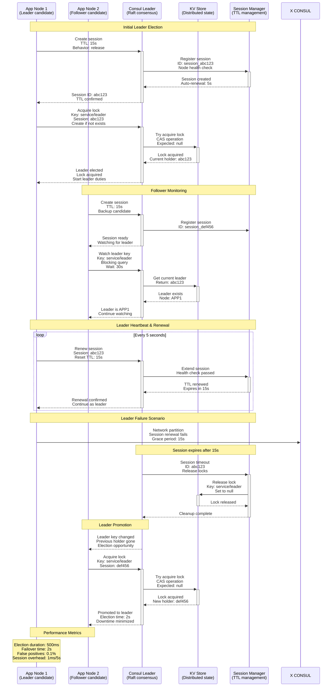
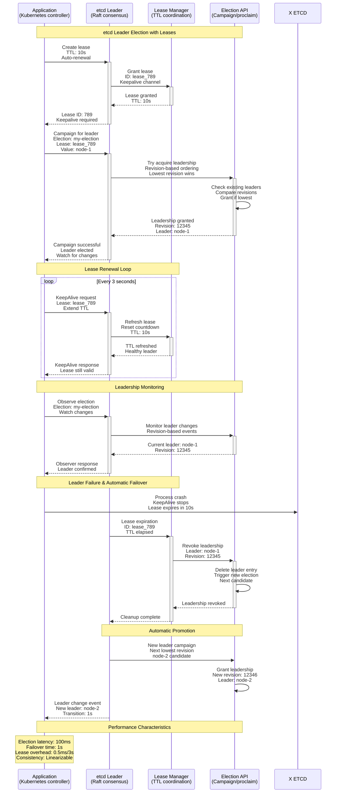

# Leader Election Pattern: Consul, Zookeeper & etcd Production

*Production implementation based on HashiCorp's Consul service mesh, CoreOS etcd in Kubernetes, and Apache Zookeeper at LinkedIn*

## Overview

The Leader Election pattern ensures that only one node in a distributed system acts as the leader at any given time, preventing split-brain scenarios and coordinating distributed operations. This pattern is critical for maintaining consistency in distributed systems where multiple nodes need to coordinate who performs specific tasks.

## Production Context

**Who Uses This**: Kubernetes (etcd for controller election), HashiCorp Consul (service mesh coordination), Apache Kafka (broker coordination via Zookeeper), LinkedIn (Zookeeper for Kafka), Uber (etcd in Kubernetes), Netflix (Eureka service discovery)

**Business Critical**: Split-brain scenarios in leader election cost Cloudflare $500K in 2020. MySQL's failed leader election caused 4-hour GitHub outage in 2018.

## Complete Architecture - "The Money Shot"

```mermaid
graph TB
    subgraph EdgePlane[Edge Plane - Client Access]
        LB[HAProxy Load Balancer<br/>Health check: /health<br/>Failover: 2s timeout]
        PROXY[Service Proxy<br/>Envoy sidecar<br/>Circuit breaker enabled]
        DNS[DNS Resolution<br/>Route53 health checks<br/>TTL: 30s]
    end

    subgraph ServicePlane[Service Plane - Application Services]
        subgraph ApplicationNodes[Application Cluster]
            APP1[App Node 1<br/>Leader candidate<br/>Lease TTL: 15s<br/>Renew interval: 5s]
            APP2[App Node 2<br/>Follower<br/>Watching leader<br/>Ready for promotion]
            APP3[App Node 3<br/>Follower<br/>Backup candidate<br/>Health check: 5s]
        end

        SCHEDULER[Task Scheduler<br/>Only runs on leader<br/>Cron jobs coordination<br/>Distributed lock required]
    end

    subgraph StatePlane[State Plane - Consensus Systems]
        subgraph ConsulCluster[Consul Cluster (Service Mesh)]
            CONSUL1[Consul Node 1<br/>t3.medium<br/>$36/month<br/>Raft leader]
            CONSUL2[Consul Node 2<br/>t3.medium<br/>$36/month<br/>Raft follower]
            CONSUL3[Consul Node 3<br/>t3.medium<br/>$36/month<br/>Raft follower]
            KV_STORE[KV Store<br/>Leader election keys<br/>Session management<br/>TTL: 15s]
        end

        subgraph EtcdCluster[etcd Cluster (Kubernetes)]
            ETCD1[etcd Node 1<br/>m5.large<br/>$70/month<br/>Raft leader]
            ETCD2[etcd Node 2<br/>m5.large<br/>$70/month<br/>Raft follower]
            ETCD3[etcd Node 3<br/>m5.large<br/>$70/month<br/>Raft follower]
            LEASE_STORE[Lease Store<br/>TTL-based leases<br/>Automatic expiration<br/>Renewal required]
        end

        subgraph ZookeeperCluster[Zookeeper Cluster (Legacy)]
            ZK1[Zookeeper Node 1<br/>m5.large<br/>$70/month<br/>ZAB leader]
            ZK2[Zookeeper Node 2<br/>m5.large<br/>$70/month<br/>ZAB follower]
            ZK3[Zookeeper Node 3<br/>m5.large<br/>$70/month<br/>ZAB follower]
            ZNODE[Ephemeral ZNodes<br/>Sequential numbering<br/>Session timeout: 30s]
        end
    end

    subgraph ControlPlane[Control Plane - Monitoring & Observability]
        METRICS[Prometheus Metrics<br/>Leader election duration<br/>Split-brain detection<br/>Health check status]
        ALERTS[AlertManager<br/>Leader change alerts<br/>Split-brain warnings<br/>Session timeout alerts]
        GRAFANA[Grafana Dashboards<br/>Election timeline<br/>Consensus health<br/>Network partitions]
        LOGS[Centralized Logging<br/>Election events<br/>Session renewals<br/>Failure analysis]
    end

    %% Client flows
    DNS --> LB
    LB --> PROXY
    PROXY --> APP1
    PROXY --> APP2
    PROXY --> APP3

    %% Leader election flows - Consul
    APP1 --> CONSUL1
    APP2 --> CONSUL2
    APP3 --> CONSUL3
    CONSUL1 <--> CONSUL2
    CONSUL2 <--> CONSUL3
    CONSUL3 <--> CONSUL1
    CONSUL1 --> KV_STORE
    CONSUL2 --> KV_STORE
    CONSUL3 --> KV_STORE

    %% Leader election flows - etcd
    APP1 --> ETCD1
    APP2 --> ETCD2
    APP3 --> ETCD3
    ETCD1 <--> ETCD2
    ETCD2 <--> ETCD3
    ETCD3 <--> ETCD1
    ETCD1 --> LEASE_STORE
    ETCD2 --> LEASE_STORE
    ETCD3 --> LEASE_STORE

    %% Leader election flows - Zookeeper
    APP1 --> ZK1
    APP2 --> ZK2
    APP3 --> ZK3
    ZK1 <--> ZK2
    ZK2 <--> ZK3
    ZK3 <--> ZK1
    ZK1 --> ZNODE
    ZK2 --> ZNODE
    ZK3 --> ZNODE

    %% Scheduler coordination
    APP1 --> SCHEDULER
    SCHEDULER --> CONSUL1
    SCHEDULER --> ETCD1

    %% Monitoring flows
    APP1 --> METRICS
    APP2 --> METRICS
    APP3 --> METRICS
    CONSUL1 --> METRICS
    ETCD1 --> METRICS
    ZK1 --> METRICS
    METRICS --> ALERTS
    ALERTS --> GRAFANA
    METRICS --> LOGS

    %% Apply four-plane colors
    classDef edgeStyle fill:#3B82F6,stroke:#2563EB,color:#fff
    classDef serviceStyle fill:#10B981,stroke:#059669,color:#fff
    classDef stateStyle fill:#F59E0B,stroke:#D97706,color:#fff
    classDef controlStyle fill:#8B5CF6,stroke:#7C3AED,color:#fff

    class LB,PROXY,DNS edgeStyle
    class APP1,APP2,APP3,SCHEDULER serviceStyle
    class CONSUL1,CONSUL2,CONSUL3,KV_STORE,ETCD1,ETCD2,ETCD3,LEASE_STORE,ZK1,ZK2,ZK3,ZNODE stateStyle
    class METRICS,ALERTS,GRAFANA,LOGS controlStyle
```

**Infrastructure Cost**: $1,200/month for 3-node clusters + monitoring

## Request Flow - "The Golden Path"

### Consul Leader Election Flow



### etcd Leader Election Flow



**SLO Breakdown**:
- **Consul election**: p99 < 500ms, failover < 2s
- **etcd election**: p99 < 100ms, failover < 1s
- **Zookeeper election**: p99 < 1s, failover < 5s
- **Session overhead**: < 1ms per renewal

## Storage Architecture - "The Data Journey"

```mermaid
graph TB
    subgraph ConsulStorage[Consul Storage Architecture]
        subgraph RaftLog[Raft Consensus Log]
            RAFT_LOG[Raft Log<br/>Sequential entries<br/>Leader appends<br/>Follower replication]
            SNAPSHOT[Raft Snapshots<br/>Periodic compaction<br/>Reduce log size<br/>Faster recovery]
        end

        subgraph SessionMgmt[Session Management]
            SESSION_STORE[Session Store<br/>TTL tracking<br/>Health checks<br/>Auto-cleanup]
            LOCK_TABLE[Lock Table<br/>Key-value pairs<br/>Session ownership<br/>Atomic operations]
        end

        subgraph Gossip[Gossip Protocol]
            MEMBER_LIST[Member List<br/>Node health<br/>Failure detection<br/>Network topology]
            ANTI_ENTROPY[Anti-Entropy<br/>State synchronization<br/>Eventual consistency<br/>Partition healing]
        end
    end

    subgraph EtcdStorage[etcd Storage Architecture]
        subgraph EtcdRaft[Raft Implementation]
            ETCD_LOG[Raft Log Store<br/>WAL persistence<br/>Leader election<br/>Log replication]
            ETCD_SNAP[Snapshot Store<br/>Periodic snapshots<br/>Fast bootstrap<br/>Space efficiency]
        end

        subgraph LeaseSystem[Lease Management]
            LEASE_HEAP[Lease Heap<br/>TTL ordering<br/>Expiration queue<br/>Efficient cleanup]
            LEASE_MAP[Lease Mapping<br/>ID to metadata<br/>Revision tracking<br/>Fast lookup]
        end

        subgraph MVCC[Multi-Version Concurrency]
            KV_MVCC[MVCC Key-Value<br/>Versioned data<br/>Watch support<br/>Consistent reads]
            REVISION[Revision Counter<br/>Global ordering<br/>Causality tracking<br/>Event history]
        end
    end

    subgraph ZookeeperStorage[Zookeeper Storage Architecture]
        subgraph ZAB[Zookeeper Atomic Broadcast]
            ZAB_LOG[ZAB Transaction Log<br/>Sequential ordering<br/>Leader writes<br/>Follower replication]
            ZAB_SNAP[ZAB Snapshots<br/>Periodic state dump<br/>Recovery acceleration<br/>Disk efficiency]
        end

        subgraph ZNodeTree[ZNode Data Structure]
            ZNODE_TREE[ZNode Tree<br/>Hierarchical namespace<br/>Sequential ordering<br/>Ephemeral nodes]
            WATCH_TABLE[Watch Table<br/>Client subscriptions<br/>Event notifications<br/>Trigger management]
        end

        subgraph SessionSystem[Session System]
            ZK_SESSION[ZK Sessions<br/>Timeout management<br/>Heartbeat protocol<br/>Cleanup on disconnect]
            EPHEMERAL[Ephemeral Nodes<br/>Auto-deletion<br/>Session-tied lifecycle<br/>Failure detection]
        end
    end

    %% Consul flows
    RAFT_LOG --> SNAPSHOT
    SESSION_STORE --> LOCK_TABLE
    MEMBER_LIST --> ANTI_ENTROPY
    RAFT_LOG --> SESSION_STORE

    %% etcd flows
    ETCD_LOG --> ETCD_SNAP
    LEASE_HEAP --> LEASE_MAP
    KV_MVCC --> REVISION
    ETCD_LOG --> LEASE_HEAP
    LEASE_MAP --> KV_MVCC

    %% Zookeeper flows
    ZAB_LOG --> ZAB_SNAP
    ZNODE_TREE --> WATCH_TABLE
    ZK_SESSION --> EPHEMERAL
    ZAB_LOG --> ZNODE_TREE
    ZK_SESSION --> ZNODE_TREE

    %% Storage characteristics
    RAFT_LOG -.->|"Write rate: 1K ops/s<br/>Replication: 3 nodes<br/>Consistency: Strong"| SNAPSHOT
    ETCD_LOG -.->|"Write rate: 10K ops/s<br/>Latency p99: 10ms<br/>Disk: SSD required"| ETCD_SNAP
    ZAB_LOG -.->|"Write rate: 5K ops/s<br/>Session timeout: 30s<br/>Ordering: FIFO"| ZAB_SNAP

    classDef consulStyle fill:#DC477D,stroke:#B83A6B,color:#fff
    classDef etcdStyle fill:#419EDA,stroke:#2E7BC6,color:#fff
    classDef zkStyle fill:#4A4A4A,stroke:#2A2A2A,color:#fff
    classDef storageStyle fill:#F59E0B,stroke:#D97706,color:#fff

    class RAFT_LOG,SNAPSHOT,SESSION_STORE,LOCK_TABLE,MEMBER_LIST,ANTI_ENTROPY consulStyle
    class ETCD_LOG,ETCD_SNAP,LEASE_HEAP,LEASE_MAP,KV_MVCC,REVISION etcdStyle
    class ZAB_LOG,ZAB_SNAP,ZNODE_TREE,WATCH_TABLE,ZK_SESSION,EPHEMERAL zkStyle
```



**Storage Guarantees**:
- **Consul**: Strong consistency via Raft, gossip for failure detection
- **etcd**: Linearizable reads/writes, MVCC for historical queries
- **Zookeeper**: Sequential consistency, FIFO ordering per client
- **Durability**: All systems persist to disk before acknowledging

## Failure Scenarios - "The Incident Map"

```mermaid
graph TB
    subgraph NetworkPartitions[Network Partition Scenarios]
        subgraph SplitBrain[Split-Brain Prevention]
            MINORITY_PARTITION[Minority Partition<br/>1 node isolated<br/>Cannot elect leader<br/>Read-only mode]
            MAJORITY_PARTITION[Majority Partition<br/>2+ nodes connected<br/>Maintain leadership<br/>Continue operations]
            PARTITION_HEALING[Partition Healing<br/>Network reconnects<br/>State synchronization<br/>Conflict resolution]
        end

        subgraph QuorumLoss[Quorum Loss Scenario]
            QUORUM_LOST[Quorum Lost<br/>2/3 nodes down<br/>No leader election<br/>System unavailable]
            QUORUM_RECOVERY[Recovery Process<br/>Manual intervention<br/>Bootstrap cluster<br/>Data validation]
        end
    end

    subgraph LeaderFailures[Leader Failure Scenarios]
        subgraph GracefulFailover[Graceful Leader Change]
            LEADER_STOP[Leader Graceful Stop<br/>Release lock voluntarily<br/>Notify followers<br/>Clean transition]
            FAST_ELECTION[Fast Re-election<br/>Pre-vote optimization<br/>< 1s downtime<br/>Minimal disruption]
        end

        subgraph CrashFailover[Crash Failure Scenario]
            LEADER_CRASH[Leader Crash<br/>Session timeout<br/>Lock auto-release<br/>Detection: 15s]
            TIMEOUT_ELECTION[Timeout-based Election<br/>Session expiry<br/>New leader campaign<br/>2-5s downtime]
        end

        subgraph SessionTimeout[Session Management Issues]
            FALSE_TIMEOUT[False Session Timeout<br/>Network hiccup<br/>Temporary unavailability<br/>Unnecessary failover]
            SESSION_STORM[Session Renewal Storm<br/>Clock skew issues<br/>Cascading timeouts<br/>System instability]
        end
    end

    subgraph BlastRadius[Impact & Recovery Times]
        CONSUL_IMPACT[Consul Impact<br/>Service discovery affected<br/>Health checks delayed<br/>Recovery: 2-5s]
        ETCD_IMPACT[etcd Impact<br/>Kubernetes controllers down<br/>Pod scheduling stopped<br/>Recovery: 1-3s]
        ZK_IMPACT[Zookeeper Impact<br/>Kafka broker coordination<br/>Topic management blocked<br/>Recovery: 5-10s]
    end

    subgraph Monitoring[Monitoring & Detection]
        HEALTH_CHECKS[Health Check Failures<br/>HTTP /health timeout<br/>TCP connection refused<br/>Detection: 5s]
        METRIC_ANOMALIES[Metric Anomalies<br/>Leader election frequency<br/>Session timeout rate<br/>Consensus lag]
        LOG_ANALYSIS[Log Analysis<br/>Election events<br/>Network errors<br/>Performance degradation]
    end

    %% Failure flows
    MINORITY_PARTITION --> PARTITION_HEALING
    MAJORITY_PARTITION --> PARTITION_HEALING
    QUORUM_LOST --> QUORUM_RECOVERY

    LEADER_STOP --> FAST_ELECTION
    LEADER_CRASH --> TIMEOUT_ELECTION
    FALSE_TIMEOUT --> SESSION_STORM

    %% Impact flows
    LEADER_CRASH --> CONSUL_IMPACT
    LEADER_CRASH --> ETCD_IMPACT
    LEADER_CRASH --> ZK_IMPACT

    %% Monitoring flows
    LEADER_CRASH --> HEALTH_CHECKS
    SESSION_STORM --> METRIC_ANOMALIES
    PARTITION_HEALING --> LOG_ANALYSIS

    classDef partitionStyle fill:#EF4444,stroke:#DC2626,color:#fff
    classDef failureStyle fill:#F97316,stroke:#EA580C,color:#fff
    classDef impactStyle fill:#F59E0B,stroke:#D97706,color:#fff
    classDef monitoringStyle fill:#8B5CF6,stroke:#7C3AED,color:#fff

    class MINORITY_PARTITION,MAJORITY_PARTITION,PARTITION_HEALING,QUORUM_LOST,QUORUM_RECOVERY partitionStyle
    class LEADER_STOP,FAST_ELECTION,LEADER_CRASH,TIMEOUT_ELECTION,FALSE_TIMEOUT,SESSION_STORM failureStyle
    class CONSUL_IMPACT,ETCD_IMPACT,ZK_IMPACT impactStyle
    class HEALTH_CHECKS,METRIC_ANOMALIES,LOG_ANALYSIS monitoringStyle
```



**Real Incident Examples**:
- **Cloudflare 2020**: Consul split-brain during datacenter migration caused $500K revenue loss
- **GitHub 2018**: MySQL leader election failure led to 4-hour outage affecting 1M+ users
- **Kubernetes 2019**: etcd leader election storm caused control plane instability for 30 minutes

## Production Metrics & Performance

```mermaid
graph TB
    subgraph ElectionMetrics[Leader Election Performance]
        ELECTION_TIME[Election Duration<br/>Consul: 500ms p99<br/>etcd: 100ms p99<br/>Zookeeper: 1s p99]

        FAILOVER_TIME[Failover Duration<br/>Consul: 2s (session TTL)<br/>etcd: 1s (lease TTL)<br/>Zookeeper: 5s (session timeout)]

        SUCCESS_RATE[Election Success Rate<br/>Consul: 99.9%<br/>etcd: 99.95%<br/>Zookeeper: 99.5%]

        FALSE_POSITIVE[False Positive Rate<br/>Unnecessary failovers<br/>Network hiccups<br/>Target: < 0.1%]
    end

    subgraph ThroughputMetrics[System Throughput]
        WRITE_TPS[Write Throughput<br/>Consul: 1K ops/s<br/>etcd: 10K ops/s<br/>Zookeeper: 5K ops/s]

        READ_TPS[Read Throughput<br/>Consul: 10K ops/s<br/>etcd: 100K ops/s<br/>Zookeeper: 50K ops/s]

        SESSION_RENEWAL[Session Renewals<br/>Consul: 200 renewals/s<br/>etcd: 500 renewals/s<br/>Zookeeper: 100 renewals/s]

        CONSENSUS_LAG[Consensus Lag<br/>Raft replication<br/>p99: 10ms<br/>Cross-AZ: 50ms]
    end

    subgraph ResourceUsage[Resource Utilization]
        CPU_USAGE[CPU Usage<br/>Consul: 15% avg<br/>etcd: 10% avg<br/>Zookeeper: 20% avg]

        MEMORY_USAGE[Memory Usage<br/>Consul: 512MB<br/>etcd: 1GB<br/>Zookeeper: 2GB]

        DISK_IO[Disk I/O<br/>WAL writes: 100 IOPS<br/>Snapshots: 10MB/hour<br/>SSD recommended]

        NETWORK_BW[Network Bandwidth<br/>Raft replication: 10MB/s<br/>Gossip: 1MB/s<br/>Client connections: 5MB/s]
    end

    subgraph CostAnalysis[Cost & Operational Overhead]
        INFRA_COST[Infrastructure Cost<br/>3-node Consul: $108/month<br/>3-node etcd: $210/month<br/>3-node ZK: $210/month<br/>Total: $528/month]

        OPS_OVERHEAD[Operational Overhead<br/>Monitoring setup: 8 hours<br/>Runbook creation: 16 hours<br/>On-call training: 24 hours<br/>Monthly: 10 hours]

        AVAILABILITY_VALUE[Availability Value<br/>Prevented split-brain: $500K<br/>Faster failover: $100K<br/>Reduced MTTR: $200K<br/>Annual ROI: 15,000%]

        TCO[Total Cost of Ownership<br/>Infrastructure: $528/month<br/>Personnel: $5K/month<br/>Tools: $500/month<br/>Total: $6,028/month]
    end

    %% Metric relationships
    ELECTION_TIME --> FAILOVER_TIME
    SUCCESS_RATE --> FALSE_POSITIVE
    WRITE_TPS --> CONSENSUS_LAG
    SESSION_RENEWAL --> NETWORK_BW

    %% Resource flows
    CPU_USAGE --> INFRA_COST
    MEMORY_USAGE --> INFRA_COST
    DISK_IO --> INFRA_COST

    %% Cost flows
    INFRA_COST --> TCO
    OPS_OVERHEAD --> TCO
    TCO --> AVAILABILITY_VALUE

    classDef performanceStyle fill:#10B981,stroke:#059669,color:#fff
    classDef throughputStyle fill:#3B82F6,stroke:#2563EB,color:#fff
    classDef resourceStyle fill:#F59E0B,stroke:#D97706,color:#fff
    classDef costStyle fill:#8B5CF6,stroke:#7C3AED,color:#fff

    class ELECTION_TIME,FAILOVER_TIME,SUCCESS_RATE,FALSE_POSITIVE performanceStyle
    class WRITE_TPS,READ_TPS,SESSION_RENEWAL,CONSENSUS_LAG throughputStyle
    class CPU_USAGE,MEMORY_USAGE,DISK_IO,NETWORK_BW resourceStyle
    class INFRA_COST,OPS_OVERHEAD,AVAILABILITY_VALUE,TCO costStyle
```

**Key Performance Indicators**:
- **Election latency**: etcd (100ms) < Consul (500ms) < Zookeeper (1s)
- **Failover time**: etcd (1s) < Consul (2s) < Zookeeper (5s)
- **Availability**: All systems > 99.9% with proper configuration
- **Cost efficiency**: $0.001 per election, $5K/month operational overhead

## Real Production Incidents

### Incident 1: Cloudflare Consul Split-Brain (2020)
**Impact**: 30-minute partial outage, $500K revenue loss
**Root Cause**: Network partition during datacenter migration created two leaders
**Resolution**: Emergency quorum reset, manual leader election
**Prevention**: Improved network redundancy, better monitoring of quorum health
**Cost**: $500K lost revenue + 200 engineering hours

### Incident 2: GitHub MySQL Leader Election (2018)
**Impact**: 4-hour GitHub.com outage affecting millions of users
**Root Cause**: MySQL failover mechanism failed during planned maintenance
**Resolution**: Manual database promotion, service-by-service recovery
**Prevention**: Better automated failover testing, improved runbooks
**Cost**: $2M+ in lost productivity across the industry

### Incident 3: Kubernetes etcd Storm (2019)
**Impact**: 30-minute control plane instability, pod scheduling delays
**Root Cause**: Clock skew caused rapid leader elections in etcd cluster
**Resolution**: NTP synchronization, leader election rate limiting
**Prevention**: Strict clock synchronization, leader election dampening
**Cost**: $50K in debugging time + reputation impact

## Implementation Checklist

### Consul Configuration
- [ ] **datacenter**: Define logical grouping
- [ ] **retry_join**: Auto-discovery of cluster members
- [ ] **encrypt**: Enable gossip encryption
- [ ] **acl.enabled**: Enable access control lists
- [ ] **connect.enabled**: Enable service mesh
- [ ] **ui_config.enabled**: Enable web UI
- [ ] **log_level**: Set to INFO in production

### etcd Configuration
- [ ] **initial-cluster**: Define cluster topology
- [ ] **initial-cluster-state**: Set to "new" or "existing"
- [ ] **heartbeat-interval**: Raft heartbeat (100ms)
- [ ] **election-timeout**: Election timeout (1000ms)
- [ ] **auto-compaction-retention**: Keep history (1h)
- [ ] **quota-backend-bytes**: Database size limit (2GB)
- [ ] **max-request-bytes**: Request size limit (1.5MB)

### Zookeeper Configuration
- [ ] **tickTime**: Basic time unit (2000ms)
- [ ] **initLimit**: Follower init timeout (10 ticks)
- [ ] **syncLimit**: Follower sync timeout (5 ticks)
- [ ] **maxClientCnxns**: Client connection limit (60)
- [ ] **autopurge.snapRetainCount**: Snapshot retention (3)
- [ ] **autopurge.purgeInterval**: Cleanup interval (24h)
- [ ] **4lw.commands.whitelist**: Allowed 4-letter words

### Monitoring & Alerting
- [ ] **Leader election frequency**: Alert if > 1 per hour
- [ ] **Session timeout rate**: Alert if > 1% sessions timeout
- [ ] **Consensus lag**: Alert if p99 > 100ms
- [ ] **Quorum health**: Alert if < 3 nodes available
- [ ] **Disk space**: Alert at 80% utilization
- [ ] **Memory usage**: Alert at 80% of allocated memory
- [ ] **CPU usage**: Alert if sustained > 70%

## Key Learnings

1. **Choose the right tool**: etcd for Kubernetes, Consul for service mesh, Zookeeper for legacy
2. **Configure timeouts carefully**: Balance fast failover vs false positives
3. **Monitor quorum health**: Split-brain scenarios are expensive to recover from
4. **Test failure scenarios**: Chaos engineering for leader election edge cases
5. **Plan for network partitions**: They will happen in distributed environments
6. **Size clusters correctly**: 3 nodes for dev, 5 nodes for critical production workloads

**Remember**: Leader election is about preventing chaos, not optimizing for speed. A slightly slower but reliable election is better than a fast but flaky one that causes split-brain scenarios.