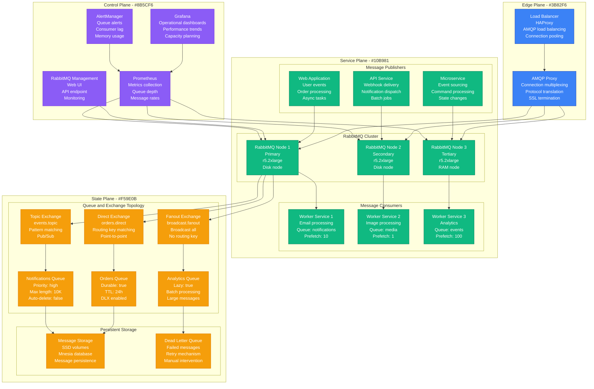
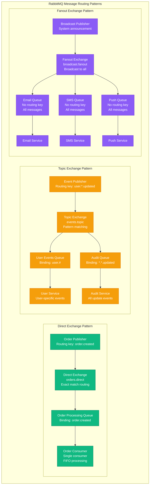
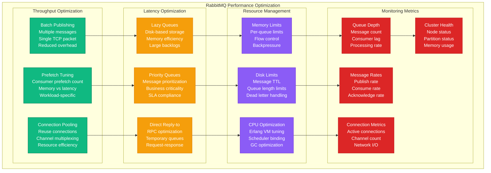

# Message Queue: RabbitMQ at CloudAMQP

## Overview

CloudAMQP operates the world's largest managed RabbitMQ service, processing 20 billion messages daily across 50,000+ customer deployments. Their platform handles everything from high-frequency trading to IoT telemetry with 99.99% availability and message durability guarantees.

## Production Architecture



## Message Flow and Routing Patterns



## High Availability and Disaster Recovery

```mermaid
graph TB
    subgraph HAConfiguration[RabbitMQ High Availability]
        subgraph ClusterMembership[Cluster Configuration]
            MASTER[Master Node<br/>Disk node<br/>Metadata storage<br/>Queue master]
            SLAVE1[Slave Node 1<br/>Disk node<br/>Queue mirror<br/>Failover ready]
            SLAVE2[Slave Node 2<br/>RAM node<br/>Performance<br/>Non-persistent]
        end

        subgraph QueueMirroring[Queue Mirroring]
            MIRROR_POLICY[Mirror Policy<br/>ha-mode: exactly<br/>ha-params: 2<br/>ha-sync-mode: automatic]
            QUEUE_MASTER[Queue Master<br/>Primary replica<br/>Write operations<br/>Consistent ordering]
            QUEUE_MIRROR1[Queue Mirror 1<br/>Synchronous replica<br/>Read operations<br/>Failover target]
            QUEUE_MIRROR2[Queue Mirror 2<br/>Asynchronous replica<br/>Geographic DR<br/>Cross-region]
        end

        subgraph FailoverMechanism[Failover Mechanism]
            FAILURE_DETECTION[Failure Detection<br/>Net tick time: 60s<br/>Partition handling: pause_minority<br/>Health checks]
            LEADER_ELECTION[Leader Election<br/>Automatic promotion<br/>Mirror → Master<br/>Client reconnection]
            SPLIT_BRAIN[Split-brain Prevention<br/>Pause minority<br/>Manual intervention<br/>Data consistency]
        end

        subgraph ClientResilience[Client Resilience]
            CONNECTION_RECOVERY[Connection Recovery<br/>Automatic reconnection<br/>Exponential backoff<br/>Circuit breaker]
            TOPOLOGY_RECOVERY[Topology Recovery<br/>Re-declare exchanges<br/>Re-declare queues<br/>Re-bind routing]
            CONFIRM_MODE[Publisher Confirms<br/>Message acknowledgment<br/>Delivery guarantee<br/>Retry logic]
        end
    end

    MASTER --> SLAVE1
    MASTER --> SLAVE2
    SLAVE1 --> SLAVE2

    MIRROR_POLICY --> QUEUE_MASTER
    QUEUE_MASTER --> QUEUE_MIRROR1
    QUEUE_MASTER --> QUEUE_MIRROR2

    FAILURE_DETECTION --> LEADER_ELECTION
    LEADER_ELECTION --> SPLIT_BRAIN

    CONNECTION_RECOVERY --> TOPOLOGY_RECOVERY
    TOPOLOGY_RECOVERY --> CONFIRM_MODE

    classDef clusterStyle fill:#10B981,stroke:#047857,color:#fff
    classDef mirrorStyle fill:#F59E0B,stroke:#D97706,color:#fff
    classDef failoverStyle fill:#DC2626,stroke:#B91C1C,color:#fff
    classDef clientStyle fill:#8B5CF6,stroke:#6D28D9,color:#fff

    class MASTER,SLAVE1,SLAVE2 clusterStyle
    class MIRROR_POLICY,QUEUE_MASTER,QUEUE_MIRROR1,QUEUE_MIRROR2 mirrorStyle
    class FAILURE_DETECTION,LEADER_ELECTION,SPLIT_BRAIN failoverStyle
    class CONNECTION_RECOVERY,TOPOLOGY_RECOVERY,CONFIRM_MODE clientStyle
```



## Performance Optimization and Monitoring



## Production Metrics

### Message Processing Volume
- **Daily Messages**: 20 billion messages
- **Peak Rate**: 500K messages/second
- **Average Latency**: P99 < 50ms
- **Throughput per Node**: 100K messages/second

### Queue Performance
- **Queue Depth**: Average < 1000 messages
- **Consumer Lag**: P95 < 5 seconds
- **Message Durability**: 99.999% persistence
- **Dead Letter Rate**: <0.01%

### Cluster Availability
- **Uptime**: 99.99% availability
- **Failover Time**: <30 seconds
- **Split-brain Events**: <0.1% of network partitions
- **Data Loss**: Zero tolerance with mirroring

## Implementation Details

### RabbitMQ Configuration
```erlang
%% RabbitMQ configuration
[
  {rabbit, [
    {cluster_formation, [
      {peer_discovery_backend, rabbit_peer_discovery_k8s},
      {k8s, [
        {host, "kubernetes.default.svc.cluster.local"},
        {port, 443},
        {scheme, "https"},
        {service_name, "rabbitmq"},
        {address_type, "hostname"}
      ]}
    ]},
    {cluster_partition_handling, pause_minority},
    {net_ticktime, 60},
    {vm_memory_high_watermark, 0.6},
    {disk_free_limit, "2GB"},
    {log_levels, [{connection, info}, {mirroring, info}]},
    {default_user_tags, [administrator]},
    {default_permissions, [<<".*">>, <<".*">>, <<".*">>]}
  ]},
  {rabbitmq_management, [
    {listener, [
      {port, 15672},
      {ssl, false}
    ]}
  ]},
  {rabbitmq_prometheus, [
    {return_per_object_metrics, true},
    {path, "/api/metrics"}
  ]}
].
```

### Queue Declaration and Policies
```bash
#!/bin/bash
# Queue and exchange setup

# Declare exchanges
rabbitmqctl declare exchange name=orders.direct type=direct durable=true
rabbitmqctl declare exchange name=events.topic type=topic durable=true
rabbitmqctl declare exchange name=broadcast.fanout type=fanout durable=true

# Declare queues with specific properties
rabbitmqctl declare queue name=orders.processing \
  durable=true \
  arguments='{"x-message-ttl":86400000,"x-dead-letter-exchange":"dlx"}'

rabbitmqctl declare queue name=notifications.priority \
  durable=true \
  arguments='{"x-max-priority":10,"x-max-length":10000}'

rabbitmqctl declare queue name=analytics.batch \
  durable=true \
  arguments='{"x-queue-mode":"lazy","x-max-length-bytes":1000000000}'

# Set up mirroring policies
rabbitmqctl set_policy ha-critical "^critical\." \
  '{"ha-mode":"exactly","ha-params":2,"ha-sync-mode":"automatic"}'

rabbitmqctl set_policy ha-all "^(?!temp).*" \
  '{"ha-mode":"all","ha-sync-mode":"automatic"}'

# Performance policies
rabbitmqctl set_policy lazy-queues "^large\." \
  '{"queue-mode":"lazy"}'
```

### Producer Implementation
```java
@Service
public class OrderPublisher {

    private final RabbitTemplate rabbitTemplate;
    private final ConnectionFactory connectionFactory;

    @Autowired
    public OrderPublisher(RabbitTemplate rabbitTemplate,
                         ConnectionFactory connectionFactory) {
        this.rabbitTemplate = rabbitTemplate;
        this.connectionFactory = connectionFactory;

        // Enable publisher confirms
        connectionFactory.setPublisherConfirms(true);
        connectionFactory.setPublisherReturns(true);

        // Configure retry template
        RetryTemplate retryTemplate = new RetryTemplate();
        retryTemplate.setRetryPolicy(new SimpleRetryPolicy(3));
        retryTemplate.setBackOffPolicy(
            new ExponentialBackOffPolicy());
        rabbitTemplate.setRetryTemplate(retryTemplate);
    }

    public void publishOrder(Order order) {
        try {
            // Set message properties
            MessageProperties props = new MessageProperties();
            props.setDeliveryMode(MessageDeliveryMode.PERSISTENT);
            props.setPriority(order.getPriority());
            props.setExpiration(String.valueOf(order.getTtlMs()));
            props.setMessageId(order.getId());
            props.setTimestamp(new Date());

            // Create message
            Message message = new Message(
                objectMapper.writeValueAsBytes(order), props);

            // Publish with confirm
            CorrelationData correlationData =
                new CorrelationData(order.getId());

            rabbitTemplate.send("orders.direct",
                order.getRoutingKey(), message, correlationData);

            log.info("Published order: {} with routing key: {}",
                order.getId(), order.getRoutingKey());

        } catch (Exception e) {
            log.error("Failed to publish order: {}", order.getId(), e);
            // Handle publish failure
            handlePublishFailure(order, e);
        }
    }

    @RabbitListener(queues = "orders.processing",
                   concurrency = "5-10",
                   ackMode = "MANUAL")
    public void processOrder(Order order,
                           @Header Map<String, Object> headers,
                           Channel channel,
                           @Header(AmqpHeaders.DELIVERY_TAG) long deliveryTag) {
        try {
            // Process the order
            orderService.processOrder(order);

            // Acknowledge successful processing
            channel.basicAck(deliveryTag, false);

            log.info("Successfully processed order: {}", order.getId());

        } catch (BusinessException e) {
            // Reject and requeue for business errors
            try {
                channel.basicNack(deliveryTag, false, true);
                log.warn("Business error processing order: {}, requeuing",
                    order.getId(), e);
            } catch (IOException ioException) {
                log.error("Failed to nack message", ioException);
            }

        } catch (Exception e) {
            // Reject without requeue for system errors
            try {
                channel.basicNack(deliveryTag, false, false);
                log.error("System error processing order: {}, sending to DLQ",
                    order.getId(), e);
            } catch (IOException ioException) {
                log.error("Failed to nack message", ioException);
            }
        }
    }
}
```

## Cost Analysis

### Infrastructure Costs
- **RabbitMQ Cluster**: $8K/month (3 r5.2xlarge nodes)
- **Storage**: $2K/month (SSD for message persistence)
- **Load Balancers**: $500/month
- **Monitoring**: $300/month
- **Total Monthly**: $10.8K

### Operational Costs
- **Message Broker Team**: $80K/month (3 engineers)
- **24/7 Support**: $15K/month
- **Training**: $3K/month
- **Total Operational**: $98K/month

### Business Value
- **Async Processing**: $20M/year scalability enablement
- **System Decoupling**: $10M/year maintenance reduction
- **Reliability**: $5M/year downtime prevention
- **Real-time Features**: $15M/year revenue enablement

## Battle-tested Lessons

### What Works at 3 AM
1. **Publisher Confirms**: Know when messages are safely stored
2. **Queue Mirroring**: Automatic failover without data loss
3. **Dead Letter Queues**: Failed messages don't disappear
4. **Connection Recovery**: Clients automatically reconnect

### Common RabbitMQ Issues
1. **Memory Pressure**: Queues consuming all available memory
2. **Disk Space**: Message persistence filling disk
3. **Network Partitions**: Split-brain causing data inconsistency
4. **Consumer Lag**: Slow consumers causing queue buildup

### Operational Best Practices
1. **Monitor Queue Depth**: Alert on excessive message buildup
2. **Set TTL**: Prevent infinite message accumulation
3. **Use Lazy Queues**: For large message volumes
4. **Plan Capacity**: Monitor resource usage trends

## Related Patterns
- [Event-Driven Architecture](./event-driven-architecture.md)
- [CQRS](./cqrs.md)
- [Saga Pattern](./saga-pattern.md)

*Source: CloudAMQP Documentation, RabbitMQ Manual, Personal Production Experience*