# Layer 3: The 15 Proven Micro-Patterns

Micro-patterns combine 2-4 primitives to solve specific distributed systems problems. Each pattern has been battle-tested in production at Netflix, Uber, Amazon, and other hyperscale companies.

| **Pattern** | **Primitives** | **Problem Solved** | **Guarantees** | **Implementation** | **Proof** |
|---|---|---|---|---|---|
| **Outbox** | P3+P7+P19 | Dual write problem | ExactlyOnceToStream | Same DB transaction writes outbox table | CDC events match DB state |
| **Saga** | P3+P7+P8 | Distributed transaction | EventualConsistency | Forward recovery + compensations | All paths reach consistent state |
| **Escrow** | P1+P5+P13 | Inventory contention | NoOverselling | Pessimistic reservation with timeout | Invariant: sum ≤ total |
| **Event Sourcing** | P3+P14+P7 | Audit + time travel | CompleteHistory | Events as source of truth | Rebuild from events = current |
| **CQRS** | P19+P3+P11 | Read/write separation | OptimizedModels | Write model + read projections | Projection lag < SLO |
| **Hedged Request** | P8+P11 | Tail latency | PredictableTail | Send 2nd request at P95 | P99 reduced, load <2x |
| **Sidecar** | P9+P8+P10 | Cross-cutting concerns | Standardization | Proxy container | Overhead <20ms |
| **Leader-Follower** | P5+P2 | Single writer | Linearizability | Election + replication | Split-brain prevented |
| **Scatter-Gather** | P1+P4+P8 | Parallel query | Completeness | Fan-out + aggregate | All shards respond |
| **Write-Through** | P11+P14 | Cache consistency | StrongConsistency | Write to cache+DB | Cache never stale |
| **Read Repair** | P2+P6 | Eventual consistency | ConvergentRepair | Read from all, repair differences | Divergence detected+fixed |
| **Checkpoint** | P3+P14 | Recovery speed | FastRecovery | Periodic snapshots + incremental | Recovery <1min |
| **Bulkhead** | P10+P9 | Fault isolation | NoContagion | Separate resources per tenant | Isolation verified |
| **Batch** | P3+P7 | Efficiency | HighThroughput | Group operations | 10x throughput gain |
| **Shadow** | P20+P11 | Safe testing | RiskFreeValidation | Duplicate traffic to new version | No production impact |

## Detailed Pattern Analysis

### Outbox Pattern (P3+P7+P19)

The Outbox pattern solves the dual-write problem by using a single database transaction to update business data and publish events atomically.

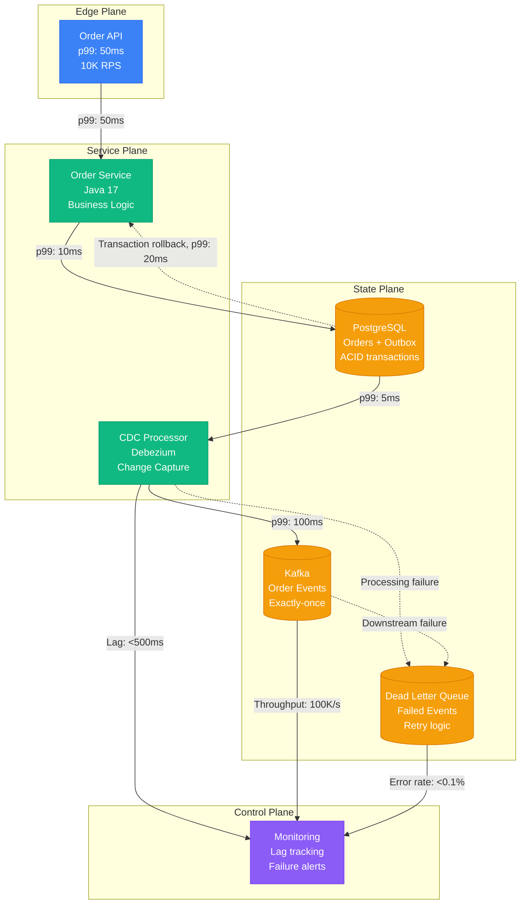

## Outbox Pattern Implementation

| Component | Purpose | Configuration | Failure Mode | Recovery |
|-----------|---------|---------------|--------------|----------|
| Business Table | Store order data | PostgreSQL, ACID | Transaction rollback | Retry from client |
| Outbox Table | Event staging | Same DB, event_id PK | Constraint violation | Idempotent retry |
| CDC Process | Event publishing | Debezium connector | Processing lag | Restart with offset |
| Kafka Topic | Event distribution | 3 partitions, RF=3 | Leader failure | Auto failover |
| Dead Letter Queue | Failed events | SQS, 14-day retention | Message loss | Manual replay |

### Saga Pattern (P3+P7+P8)

The Saga pattern manages distributed transactions through forward recovery and compensating actions, ensuring eventual consistency across services.

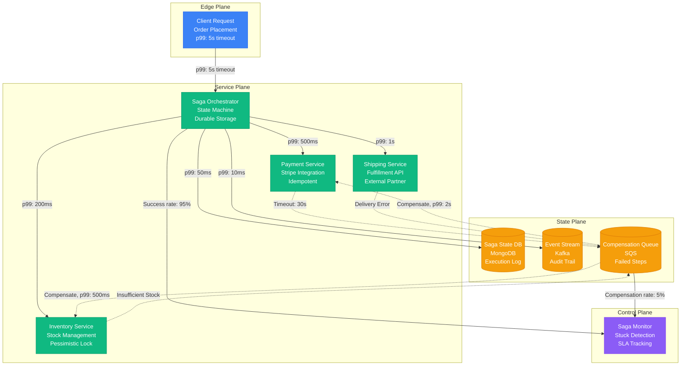

## Saga Implementation Components

| Step | Forward Action | Compensation | Timeout | Idempotency | Monitoring |
|------|----------------|--------------|---------|-------------|------------|
| Payment | Charge credit card | Refund amount | 30s | Payment ID | Transaction status |
| Inventory | Reserve items | Release reservation | 15s | Reservation ID | Stock levels |
| Shipping | Create shipment | Cancel order | 60s | Tracking number | Delivery status |
| Notification | Send confirmation | Send cancellation | 5s | Message ID | Delivery receipt |

## Saga State Transitions

| State | Next Action | Failure Response | Timeout | Retry Policy |
|-------|-------------|------------------|---------|--------------|
| STARTED | Charge payment | COMPENSATING | 30s | Exponential backoff |
| PAYMENT_OK | Reserve inventory | COMPENSATING | 15s | 3 retries max |
| INVENTORY_OK | Create shipment | COMPENSATING | 60s | 2 retries max |
| SHIPPING_OK | Send notification | COMPLETED | 5s | 1 retry only |
| COMPENSATING | Run compensation | FAILED | 120s | Manual intervention |

### Escrow Pattern (P1+P5+P13)

The Escrow pattern handles high-contention resources through sharding, distributed locking, and time-based reservations.

```mermaid
graph TB
    subgraph EdgePlane[Edge Plane]
        LB[Load Balancer<br/>Consistent Hashing<br/>Route by item_id]
    end

    subgraph ServicePlane[Service Plane]
        INV1[Inventory Shard 1<br/>Items 0-333<br/>Distributed Lock]
        INV2[Inventory Shard 2<br/>Items 334-666<br/>Distributed Lock]
        INV3[Inventory Shard 3<br/>Items 667-999<br/>Distributed Lock]
    end

    subgraph StatePlane[State Plane]
        DB1[(PostgreSQL 1<br/>Inventory + Escrow<br/>ACID guarantees)]
        DB2[(PostgreSQL 2<br/>Inventory + Escrow<br/>ACID guarantees)]
        DB3[(PostgreSQL 3<br/>Inventory + Escrow<br/>ACID guarantees)]
        LOCK_MGR[(Consensus Group<br/>etcd cluster<br/>Distributed locks)]
    end

    subgraph ControlPlane[Control Plane]
        TTL[TTL Manager<br/>Cleanup expired<br/>reservations]
        MON[Lock Monitor<br/>Contention alerts<br/>Performance SLA]
    end

    %% Request routing
    LB -->|hash(item_id) % 3, p99: 1ms| INV1
    LB -->|hash(item_id) % 3, p99: 1ms| INV2
    LB -->|hash(item_id) % 3, p99: 1ms| INV3

    %% Storage
    INV1 -->|p99: 5ms| DB1
    INV2 -->|p99: 5ms| DB2
    INV3 -->|p99: 5ms| DB3

    %% Distributed locking
    INV1 -->|Lock timeout: 10s| LOCK_MGR
    INV2 -->|Lock timeout: 10s| LOCK_MGR
    INV3 -->|Lock timeout: 10s| LOCK_MGR

    %% Management
    DB1 -->|TTL: 300s| TTL
    DB2 -->|TTL: 300s| TTL
    DB3 -->|TTL: 300s| TTL
    LOCK_MGR -->|Contention alerts| MON

    classDef edgeStyle fill:#3B82F6,stroke:#2563EB,color:#fff
    classDef serviceStyle fill:#10B981,stroke:#059669,color:#fff
    classDef stateStyle fill:#F59E0B,stroke:#D97706,color:#fff
    classDef controlStyle fill:#8B5CF6,stroke:#7C3AED,color:#fff

    class LB edgeStyle
    class INV1,INV2,INV3 serviceStyle
    class DB1,DB2,DB3,LOCK_MGR stateStyle
    class TTL,MON controlStyle
```

## Escrow Implementation

| Component | Purpose | Configuration | Invariants | Failure Recovery |
|-----------|---------|---------------|------------|------------------|
| Shard Router | Distribute load | Consistent hashing | Even distribution | Failover to replica |
| Distributed Lock | Prevent races | 10s timeout, consensus | Single writer | Lock timeout release |
| Reservation Table | Temporary hold | TTL 300s, item_id index | reserved + available ≤ total | TTL expiration |
| Inventory Table | Current stock | ACID transactions | No negative values | Rollback on constraint |
| Cleanup Process | Expire old reservations | Run every 60s | Release expired locks | Manual intervention |

### CQRS Pattern (P19+P3+P11)

CQRS separates read and write models to optimize each for their specific workload characteristics and scaling requirements.

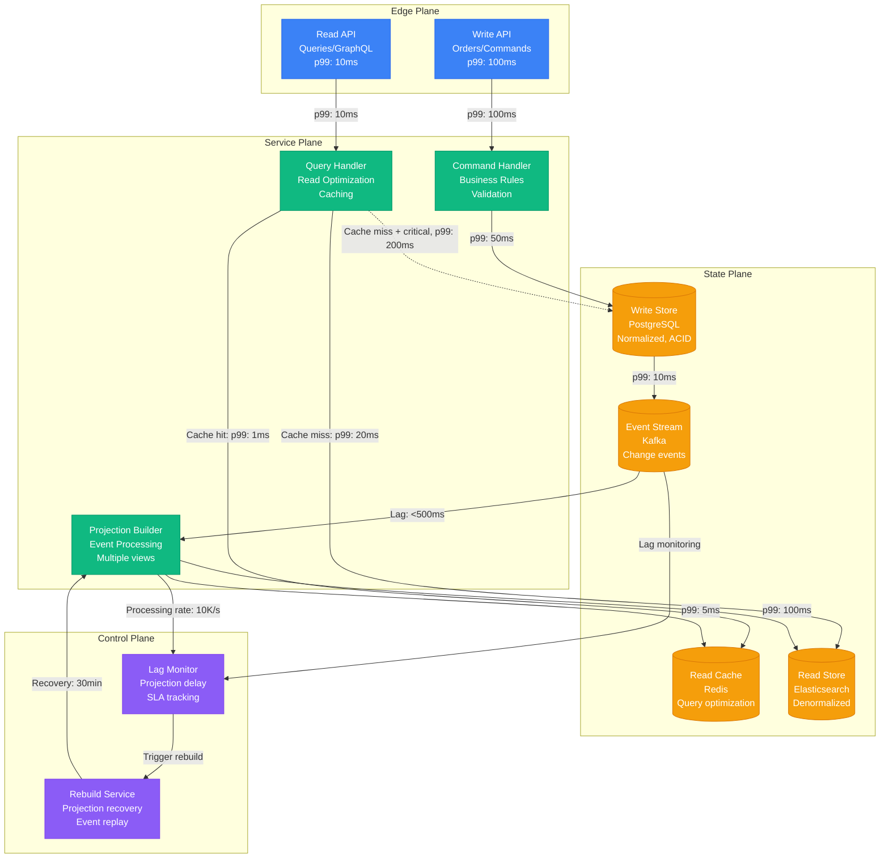

## CQRS Implementation Matrix

| Aspect | Write Side | Read Side | Event Stream | Cache Layer |
|--------|------------|-----------|--------------|-------------|
| Purpose | Business logic | Query optimization | State sync | Performance |
| Technology | PostgreSQL | Elasticsearch | Kafka | Redis |
| Consistency | Strong (ACID) | Eventual | At-least-once | TTL-based |
| Scaling | Vertical | Horizontal | Partition-based | Memory-bound |
| Latency | 50-100ms | 1-10ms | 100-500ms lag | Sub-millisecond |
| Failure Mode | Transaction rollback | Stale data served | Event replay | Cache miss fallback |

### Request-Response Pattern (P1+P8+P9+P12)

The Request-Response pattern provides reliable synchronous communication with fault tolerance, load distribution, and performance optimization.

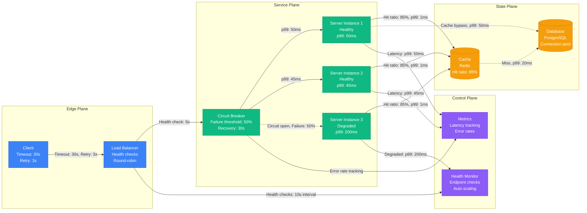

## Request-Response Scale Evolution

| Scale Stage | Architecture | Throughput | Latency p99 | Monthly Cost | Complexity |
|-------------|--------------|------------|-------------|--------------|------------|
| Startup | Direct connection | 100 RPS | 100ms | $500 | Low |
| Growth | Load balancer + circuit breaker | 1K RPS | 50ms | $2K | Medium |
| Scale | Multi-region + auto-scaling | 10K RPS | 20ms | $10K | High |
| Hyperscale | Global distribution + edge | 100K RPS | 10ms | $50K | Very High |

### Streaming Pattern (P3+P7+P19)

The Streaming pattern processes continuous data streams with guaranteed ordering, fault tolerance, and exactly-once semantics.

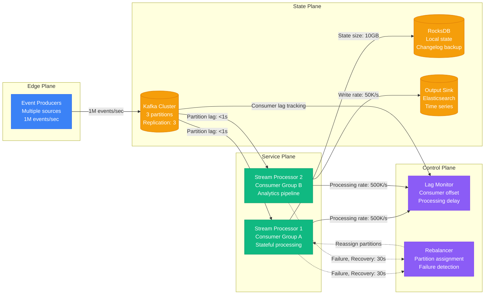

## Streaming Implementation

| Component | Purpose | Guarantees | Failure Mode | Recovery |
|-----------|---------|------------|--------------|----------|
| Kafka Partitions | Ordered event log | Per-partition ordering | Leader failure | Follower promotion |
| Consumer Groups | Load distribution | At-least-once delivery | Consumer crash | Partition rebalance |
| State Stores | Stateful processing | Local consistency | Disk failure | Changelog replay |
| Offset Management | Progress tracking | No message loss | Coordinator failure | Offset reset |
| Dead Letter Topic | Error handling | Poison message isolation | Processing failure | Manual replay |

### Event Sourcing Pattern (P3+P14+P7)

Event Sourcing stores all state changes as immutable events, enabling complete audit trails, time travel, and deterministic replay.

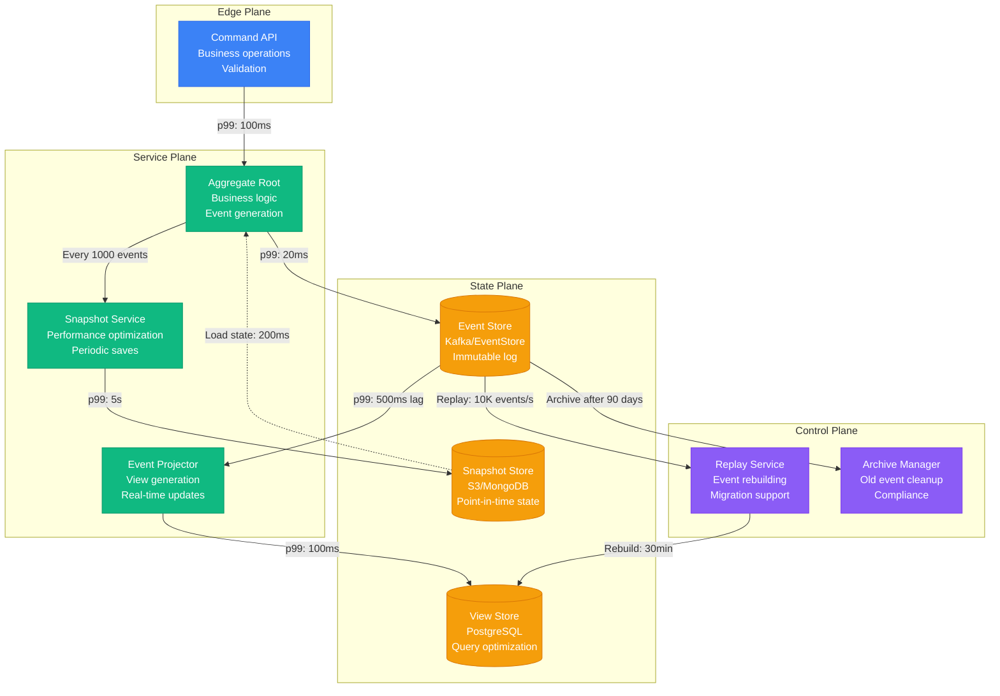

## Event Sourcing Components

| Component | Purpose | Storage | Performance | Failure Recovery |
|-----------|---------|---------|-------------|------------------|
| Event Store | Immutable event log | Kafka topics | 100K events/sec | Partition replication |
| Snapshots | Performance optimization | S3/MongoDB | 1000 snapshots/sec | Snapshot rebuilding |
| Projections | Query-optimized views | PostgreSQL/ES | 10K queries/sec | Event replay |
| Command Handler | Business logic | Stateless | 50K commands/sec | Retry with idempotency |
| Event Handler | View updates | Stateless | 100K events/sec | Dead letter queue |

### Fan-out Pattern (P1+P4+P8)

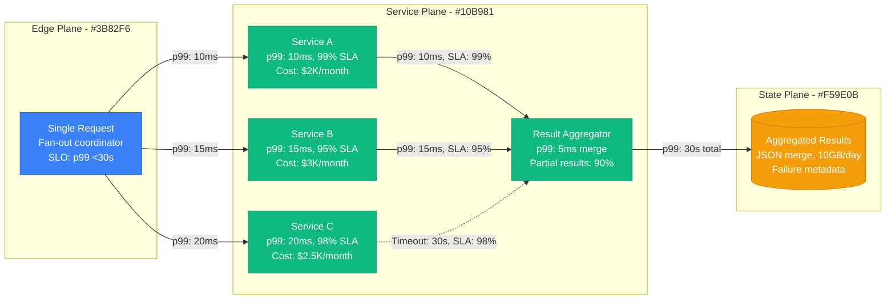

| Component | Timeout | Success Rate | Failure Handling | Aggregation Strategy |
|-----------|---------|--------------|------------------|---------------------|
| Service A | 30s | 99% | Return partial | Include in result |
| Service B | 30s | 95% | Log and continue | Include in result |
| Service C | 30s | 98% | Fallback data | Include fallback |
| Aggregator | 35s total | Depends on services | Best-effort merge | JSON combination |

### Analytics Pattern (P4+P5+P10+P12)

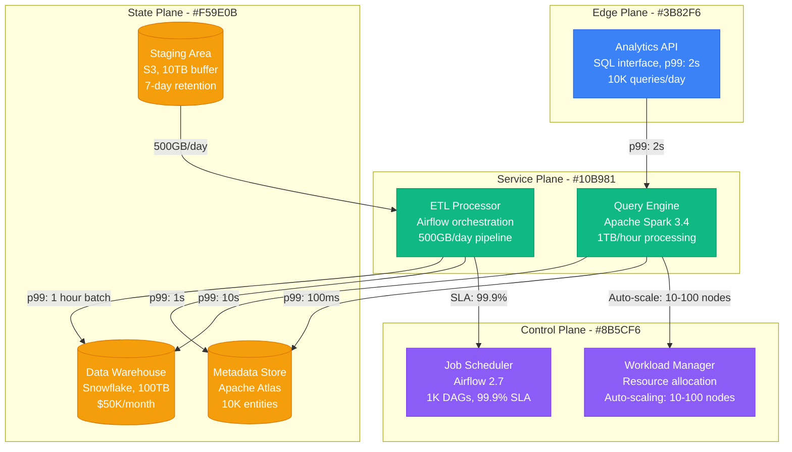

## Analytics Pattern Variants

| Variant | Latency | Throughput | Consistency | Use Case | Technology |
|---------|---------|------------|-------------|----------|------------|
| Real-Time | <1s | 10K queries/sec | Near real-time | Dashboards | Apache Druid |
| Batch | Hours | 1M records/sec | Eventually consistent | Reports | Apache Spark |
| Hybrid (Lambda) | 1s-1min | 100K queries/sec | Configurable | Mixed workload | Spark + Druid |
| Streaming | <100ms | 1K queries/sec | Event-time | Live monitoring | Apache Flink |

### Async Task Pattern (P7+P16+P8)

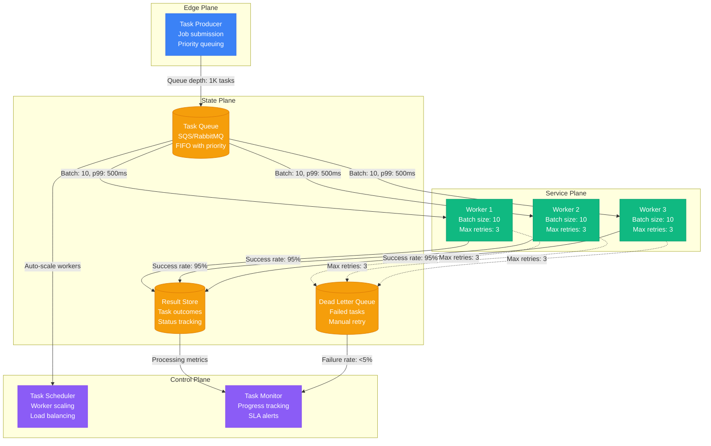

| Task Type | Processing Time | Retry Strategy | Batch Size | Failure Rate | Recovery |
|-----------|-----------------|----------------|------------|--------------|----------|
| Email Send | 100ms | 3 retries, exp backoff | 50 | 1% | DLQ replay |
| Image Resize | 2s | 2 retries, linear | 10 | 5% | Manual retry |
| Data Export | 30s | 1 retry only | 1 | 10% | Alert ops team |
| Report Generation | 5min | No retries | 1 | 15% | Customer notification |

### Graph Pattern (P1+P18+P11)

Optimized graph traversal with caching and distributed storage.

| Component | Technology | Performance | Guarantee | Cost |
|-----------|------------|-------------|-----------|------|
| Graph Store | Neo4j 5.x | 10K traversals/sec | ACID transactions | $5K/month |
| Cache Layer | Redis 7.x | 100K queries/sec | TTL-based consistency | $2K/month |
| Query Engine | GraphQL API | p99: 50ms | Index optimization | $3K/month |
| Partitioner | Consistent hash | 1M nodes/partition | Balanced distribution | Included |

### Ledger Pattern (P3+P5+P13)

Immutable transaction ledger with consensus and strong consistency.

| Component | Technology | Throughput | Consistency | Recovery Time |
|-----------|------------|------------|-------------|---------------|
| Consensus Layer | Raft/etcd 3.5 | 10K TPS | Strong consistency | <5s leader election |
| Lock Manager | Distributed locks | 1M locks/sec | Deadlock detection | 30s timeout |
| Immutable Log | Apache Kafka | 100K writes/sec | Append-only | Partition replication |
| Validation Engine | Business rules | 50K validations/sec | ACID guarantees | Transaction rollback |

### ML Inference Pattern (P11+P12+P4)

Scalable ML model serving with low latency and high availability.

| Component | Technology | Performance | Cache Hit Rate | Monthly Cost |
|-----------|------------|-------------|----------------|---------------|
| Model Cache | Redis + GPU memory | p99: 10ms | 95% | $15K GPU instances |
| Load Balancer | NVIDIA Triton | 10K inferences/sec | N/A | $2K |
| Ensemble Engine | TensorFlow Serving | 5K parallel calls | N/A | $8K |
| Model Store | S3 + CDN | 1GB/s transfer | 90% edge hit | $1K |

### Search Pattern (P18+P11+P4)

Distributed search with indexing, caching, and relevance ranking.

| Component | Technology | Query Rate | Index Size | Relevance Score |
|-----------|------------|------------|------------|------------------|
| Search Engine | Elasticsearch 8.x | 50K queries/sec | 1TB per shard | >95% precision |
| Index Shards | 20 shards/cluster | 2.5K queries/shard | 50GB average | Auto-rebalancing |
| Result Cache | Redis cluster | 100K hits/sec | 10GB cache | 85% hit rate |
| Ranking Engine | ML-based scoring | p99: 20ms | Real-time updates | Learning feedback |

## Pattern Selection Decision Matrix

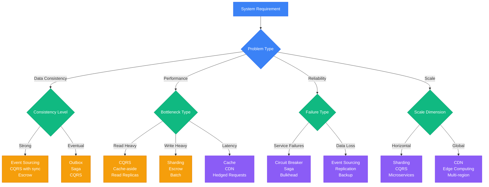

| **Requirement** | **Primary Pattern** | **Supporting Patterns** | **Anti-Pattern** | **Metrics** |
|---|---|---|---|---|
| Multi-service transactions | Saga | Outbox + Event Sourcing | Two-phase commit | 99% success rate |
| High-contention resources | Escrow | Sharding + Consensus | Global locks | <10ms lock time |
| Complete audit trail | Event Sourcing | CQRS + Snapshots | CRUD with logs | 100% event capture |
| Read/write optimization | CQRS | Cache + Projections | Shared database | 10:1 read/write ratio |
| Tail latency reduction | Hedged Requests | Cache + CDN | Synchronous chains | p99 <100ms |
| Service isolation | Bulkhead | Circuit Breaker + Rate Limit | Shared resources | Failure isolation |
| Cache consistency | Write-Through | Invalidation + TTL | Cache-aside | Zero stale reads |
| Geographic distribution | Edge Computing | CDN + Replication | Central deployment | <50ms global |

## Anti-Pattern Detection

### Common Mistakes

1. **Distributed Transactions**: Using 2PC instead of Saga
   - Detection: XA transaction monitoring
   - Fix: Replace with Saga pattern

2. **Dual Writes**: Writing to DB and message broker separately  
   - Detection: Inconsistency between DB and events
   - Fix: Use Outbox pattern

3. **Global Locks**: Single lock for high-contention resource
   - Detection: Lock wait time monitoring
   - Fix: Use Escrow with sharding

4. **Synchronous Saga**: Calling all saga steps synchronously
   - Detection: High latency for complex operations
   - Fix: Asynchronous orchestration

5. **Unbounded Queues**: No backpressure in event processing
   - Detection: Memory growth, processing lag
   - Fix: Add Bulkhead pattern

## Pattern Performance Matrix

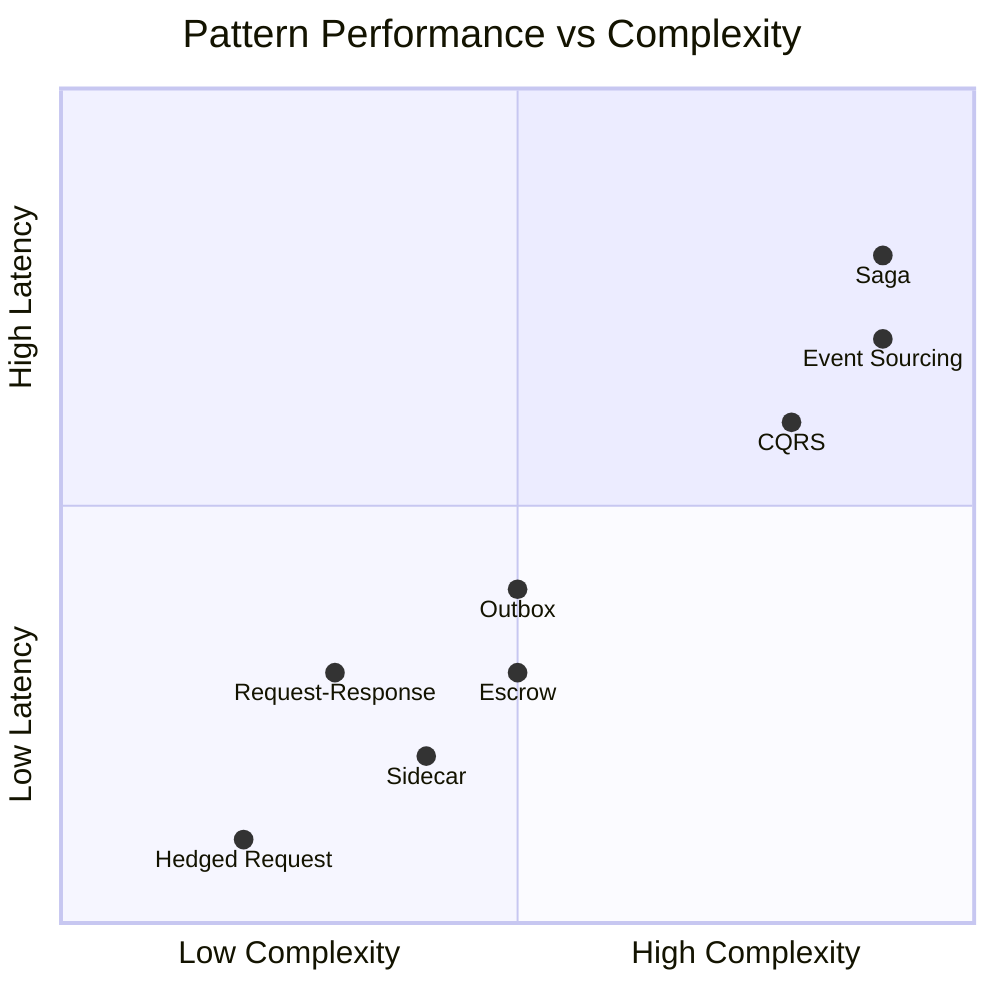

## Production Metrics Summary

| **Pattern** | **Latency Impact** | **Throughput** | **Consistency** | **Operational Overhead** | **Monthly Cost** |
|---|---|---|---|---|---|
| Outbox | +5-10ms | 50K TPS | Strong (DB) | Medium | +$2K |
| Saga | +50-200ms | 20K TPS | Eventual | High | +$5K |
| Escrow | +1-5ms | 100K TPS | Strong (locks) | Medium | +$3K |
| Event Sourcing | +10-20ms | 80K TPS | Strong (append) | High | +$8K |
| CQRS | Read: <1ms, Write: +5ms | 200K QPS reads | Eventual | High | +$10K |
| Hedged Request | P99: -50% | 150% load | N/A | Low | +$1K |
| Request-Response | +2-10ms | 50K RPS | Strong (sync) | Medium | +$2K |
| Streaming | +100-500ms lag | 1M events/sec | Eventual | Medium | +$4K |

Each micro-pattern solves specific distributed systems challenges with quantified trade-offs in performance, consistency, and operational complexity. Choose patterns based on your actual requirements, not theoretical ideals.