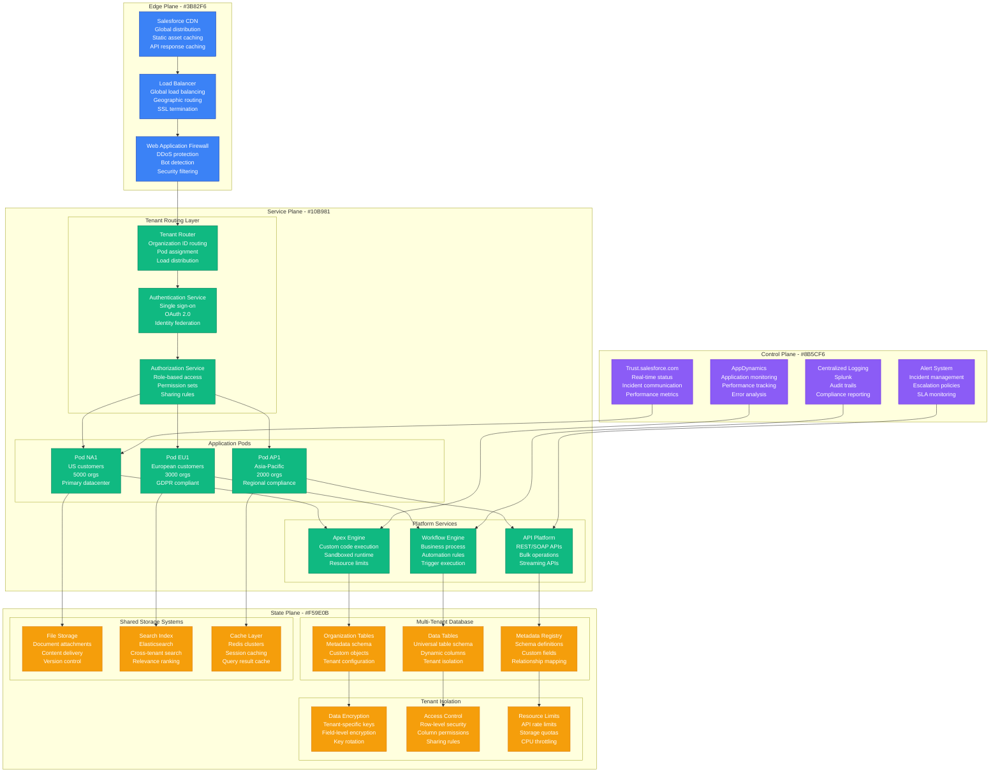
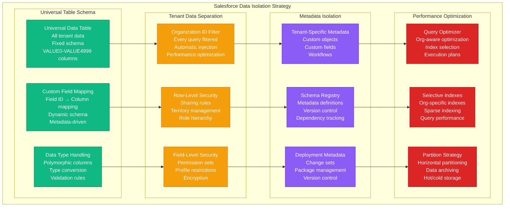
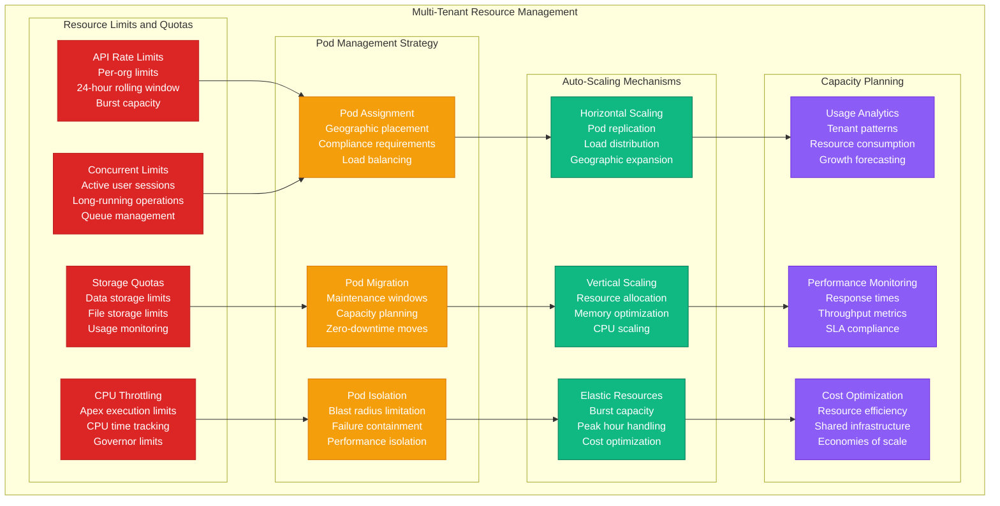
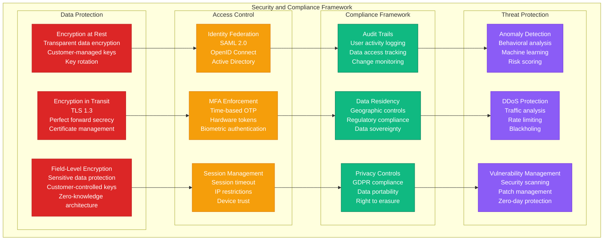

# Multi-Tenancy: Salesforce Architecture

## Overview

Salesforce operates the world's largest multi-tenant SaaS platform, serving 150,000+ customers and 9.3 million users on shared infrastructure. Their architecture achieves 99.9% uptime while maintaining strict data isolation, performance guarantees, and regulatory compliance across tenants.

## Production Architecture



## Data Isolation and Universal Table Schema



## Resource Management and Scaling



## Security and Compliance Framework



## Production Metrics

### Platform Scale
- **Active Customers**: 150,000+ organizations
- **Active Users**: 9.3 million daily users
- **Transactions**: 3+ billion transactions daily
- **API Calls**: 6+ billion API requests daily

### Performance Metrics
- **Response Time**: P95 < 300ms
- **Availability**: 99.9% uptime SLA
- **Data Processing**: 200+ billion records
- **Concurrent Users**: 500K+ peak concurrent

### Multi-Tenancy Efficiency
- **Tenant Density**: 5,000 orgs per pod
- **Resource Sharing**: 95% infrastructure shared
- **Cost per Tenant**: 80% reduction vs single-tenant
- **Deployment Efficiency**: 1 deployment serves all tenants

## Implementation Details

### Universal Table Schema Implementation
```sql
-- Salesforce Universal Data Table Structure
CREATE TABLE universal_data_table (
    id VARCHAR(18) PRIMARY KEY,
    organization_id VARCHAR(15) NOT NULL,
    entity_type VARCHAR(50) NOT NULL,
    created_date TIMESTAMP NOT NULL,
    last_modified_date TIMESTAMP NOT NULL,
    created_by_id VARCHAR(18) NOT NULL,
    last_modified_by_id VARCHAR(18) NOT NULL,

    -- Universal value columns for different data types
    value0 VARCHAR(4000),   -- Text fields
    value1 VARCHAR(4000),
    value2 NUMBER(18,6),    -- Numeric fields
    value3 NUMBER(18,6),
    value4 DATE,            -- Date fields
    value5 DATE,
    value6 CLOB,            -- Long text fields
    value7 CLOB,
    value8 NUMBER(1),       -- Boolean fields (0/1)
    value9 NUMBER(1),
    -- ... up to value4999

    -- Indexes for performance
    INDEX idx_org_entity (organization_id, entity_type),
    INDEX idx_org_created (organization_id, created_date),
    INDEX idx_values (organization_id, value0, value2, value4)
);

-- Custom field metadata mapping
CREATE TABLE custom_field_definitions (
    id VARCHAR(18) PRIMARY KEY,
    organization_id VARCHAR(15) NOT NULL,
    entity_type VARCHAR(50) NOT NULL,
    field_name VARCHAR(80) NOT NULL,
    column_name VARCHAR(20) NOT NULL,  -- maps to value0, value1, etc.
    data_type VARCHAR(20) NOT NULL,
    is_encrypted BOOLEAN DEFAULT FALSE,

    UNIQUE(organization_id, entity_type, field_name)
);
```

### Dynamic Query Generation
```java
// Salesforce Dynamic Query Builder
public class TenantAwareQueryBuilder {

    private final String organizationId;
    private final SecurityContext securityContext;

    public String buildQuery(String entityType, List<String> fields,
                           String whereClause, String orderBy) {

        StringBuilder query = new StringBuilder("SELECT ");

        // Map field names to universal columns
        List<String> mappedFields = mapFieldsToColumns(entityType, fields);
        query.append(String.join(", ", mappedFields));

        query.append(" FROM universal_data_table");

        // Always filter by organization ID for tenant isolation
        query.append(" WHERE organization_id = '").append(organizationId).append("'");
        query.append(" AND entity_type = '").append(entityType).append("'");

        // Apply field-level security
        String securityFilter = buildSecurityFilter(entityType);
        if (securityFilter != null) {
            query.append(" AND ").append(securityFilter);
        }

        // Add custom where clause
        if (whereClause != null && !whereClause.isEmpty()) {
            query.append(" AND (").append(whereClause).append(")");
        }

        // Add sharing rules
        String sharingFilter = buildSharingFilter(entityType);
        if (sharingFilter != null) {
            query.append(" AND ").append(sharingFilter);
        }

        if (orderBy != null && !orderBy.isEmpty()) {
            query.append(" ORDER BY ").append(orderBy);
        }

        return query.toString();
    }

    private List<String> mapFieldsToColumns(String entityType, List<String> fields) {
        List<String> mappedFields = new ArrayList<>();

        for (String field : fields) {
            CustomFieldDefinition fieldDef = getFieldDefinition(entityType, field);
            if (fieldDef != null && hasFieldAccess(fieldDef)) {
                if (fieldDef.isEncrypted() && !hasDecryptPermission(fieldDef)) {
                    mappedFields.add("'***PROTECTED***' as " + field);
                } else {
                    mappedFields.add(fieldDef.getColumnName() + " as " + field);
                }
            }
        }

        return mappedFields;
    }

    private String buildSecurityFilter(String entityType) {
        // Implement row-level security based on user permissions
        if (!hasReadAccess(entityType)) {
            return "1 = 0"; // No access
        }

        // Territory-based filtering
        if (isTerritoryManaged(entityType)) {
            return buildTerritoryFilter(entityType);
        }

        return null;
    }

    private String buildSharingFilter(String entityType) {
        // Implement sharing rules
        List<SharingRule> rules = getSharingRules(entityType);
        if (rules.isEmpty()) {
            return null;
        }

        StringBuilder filter = new StringBuilder("(");
        for (int i = 0; i < rules.size(); i++) {
            if (i > 0) filter.append(" OR ");
            filter.append(rules.get(i).toSqlFilter());
        }
        filter.append(")");

        return filter.toString();
    }
}
```

### Resource Limit Enforcement
```java
// Governor Limits Implementation
@Component
public class GovernorLimitsEnforcer {

    private final RedisTemplate<String, String> redis;
    private final MetricsService metrics;

    public void enforceApiLimits(String organizationId, String userId) {
        String key = "api_limits:" + organizationId + ":daily";
        String currentCount = redis.opsForValue().get(key);

        int count = currentCount != null ? Integer.parseInt(currentCount) : 0;
        int dailyLimit = getApiLimitForOrg(organizationId);

        if (count >= dailyLimit) {
            throw new ApiLimitExceededException(
                "Daily API limit of " + dailyLimit + " exceeded for organization " + organizationId
            );
        }

        // Increment counter with 24-hour expiration
        redis.opsForValue().increment(key);
        redis.expire(key, Duration.ofDays(1));

        // Track metrics
        metrics.gauge("api.usage.count", count, "org_id", organizationId);
        metrics.gauge("api.usage.percentage", (double) count / dailyLimit * 100, "org_id", organizationId);
    }

    public void enforceCpuLimits(String organizationId, ApexExecution execution) {
        long cpuTime = execution.getCpuTimeMs();
        long maxCpuTime = getCpuLimitForOrg(organizationId);

        if (cpuTime > maxCpuTime) {
            execution.terminate();
            throw new CpuLimitExceededException(
                "CPU time limit of " + maxCpuTime + "ms exceeded"
            );
        }
    }

    public void enforceStorageQuotas(String organizationId, long additionalStorage) {
        long currentUsage = getStorageUsage(organizationId);
        long storageLimit = getStorageLimitForOrg(organizationId);

        if (currentUsage + additionalStorage > storageLimit) {
            throw new StorageQuotaExceededException(
                "Storage quota of " + storageLimit + " bytes exceeded"
            );
        }
    }

    private int getApiLimitForOrg(String organizationId) {
        // Different limits based on org edition/license
        OrgEdition edition = getOrgEdition(organizationId);
        switch (edition) {
            case ENTERPRISE: return 1000000;
            case PROFESSIONAL: return 100000;
            case ESSENTIALS: return 25000;
            default: return 10000;
        }
    }
}
```

## Cost Analysis

### Infrastructure Efficiency
- **Shared Infrastructure**: 95% resource sharing across tenants
- **Cost per Tenant**: $2/tenant/month average
- **Economy of Scale**: 80% cost reduction vs single-tenant
- **Utilization**: 85% average resource utilization

### Operational Costs
- **Platform Operations**: $50M/year (300+ engineers)
- **Infrastructure**: $200M/year (global datacenters)
- **Security & Compliance**: $30M/year
- **R&D**: $150M/year (platform innovation)

### Business Value
- **Market Leadership**: $20B+ annual revenue
- **Customer Acquisition**: 40% lower cost vs competitors
- **Innovation Speed**: 3 major releases per year
- **Global Scale**: 99.9% availability across all regions

## Battle-tested Lessons

### What Works at 3 AM
1. **Automatic Tenant Isolation**: Organization ID filtering prevents data leakage
2. **Resource Limits**: Governor limits prevent tenant resource exhaustion
3. **Pod Isolation**: Blast radius contained to single pod
4. **Real-time Monitoring**: Trust.salesforce.com provides transparency

### Common Multi-Tenancy Challenges
1. **Noisy Neighbor**: Resource-intensive tenants affecting others
2. **Schema Evolution**: Changes must be backward compatible
3. **Data Skew**: Large tenants causing performance hotspots
4. **Compliance Complexity**: Different regions, different rules

### Operational Best Practices
1. **Gradual Rollouts**: New features deployed incrementally
2. **Capacity Planning**: Proactive scaling based on growth patterns
3. **Security First**: Default deny, explicit allow permissions
4. **Observability**: Tenant-aware monitoring and alerting

## Related Patterns
- [Database Per Tenant](./database-per-tenant.md)
- [Shared Database](./shared-database.md)
- [API Gateway](./api-gateway.md)

*Source: Salesforce Architecture Documentation, Multi-Tenant SaaS Best Practices, Personal Enterprise Experience*