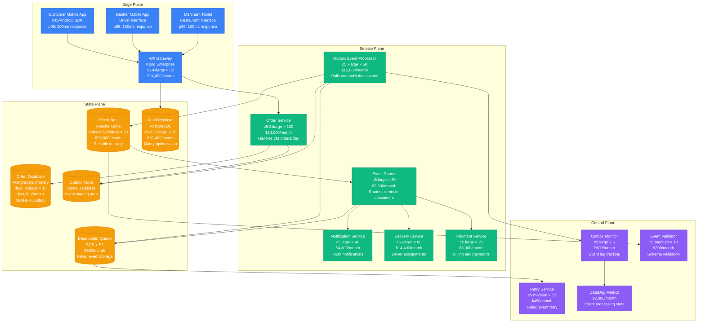
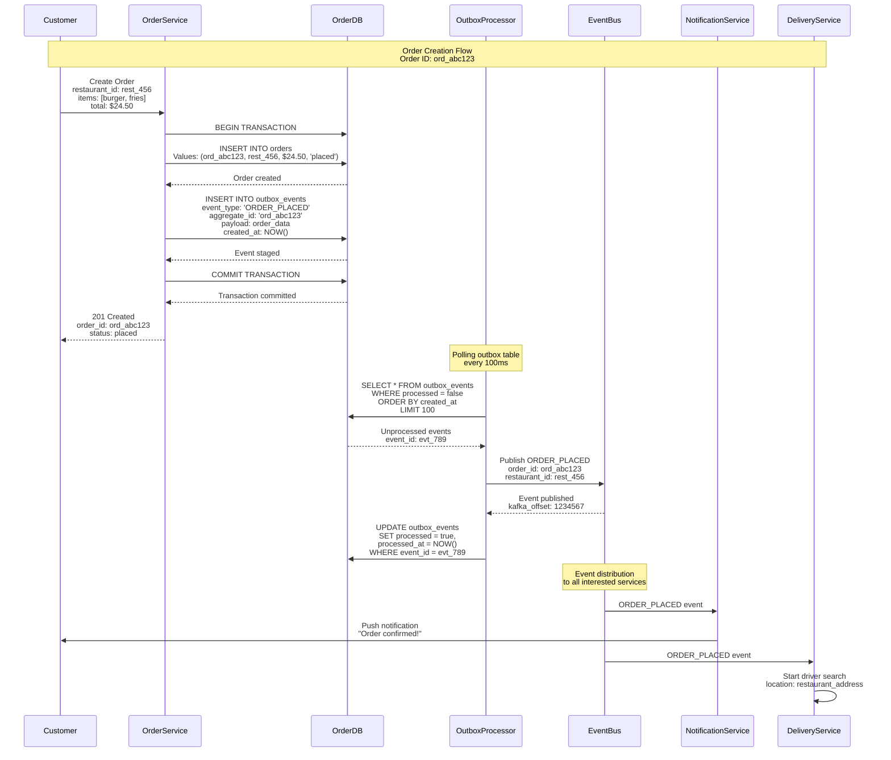
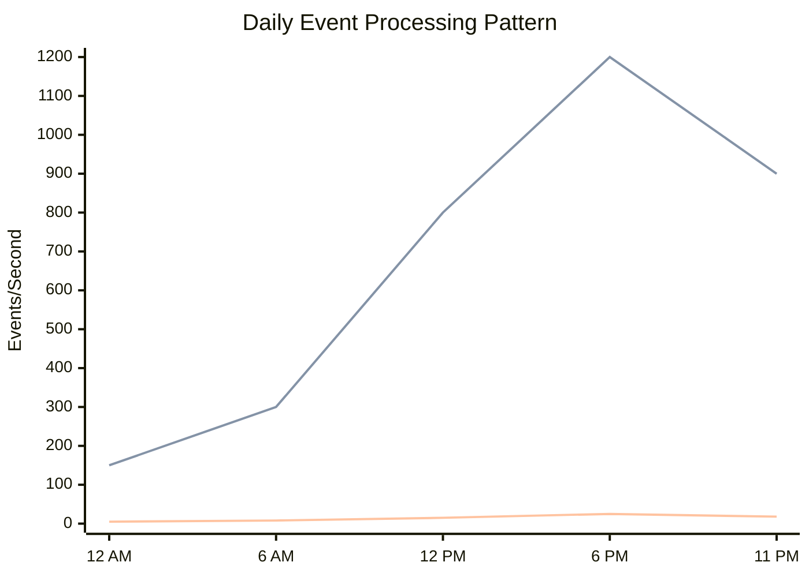

# Outbox Pattern: DoorDash Order Processing

## Pattern Overview

The Outbox pattern ensures reliable message publishing by storing events in the same database transaction as business data, then publishing them via a separate process. DoorDash uses this pattern for order processing to guarantee that order state changes and event notifications (to drivers, restaurants, customers) are always consistent.

## DoorDash Order Outbox Architecture



## Order Processing with Outbox Pattern



## Database Schema Design

### Core Tables with Outbox

```sql
-- Order table - business data
CREATE TABLE orders (
    order_id VARCHAR(50) PRIMARY KEY,
    customer_id VARCHAR(50) NOT NULL,
    restaurant_id VARCHAR(50) NOT NULL,
    dasher_id VARCHAR(50),
    status VARCHAR(20) NOT NULL DEFAULT 'placed',
    items JSONB NOT NULL,
    pricing JSONB NOT NULL, -- subtotal, tax, fees, total
    delivery_address JSONB NOT NULL,
    special_instructions TEXT,
    estimated_delivery_time TIMESTAMP,
    created_at TIMESTAMP NOT NULL DEFAULT NOW(),
    updated_at TIMESTAMP NOT NULL DEFAULT NOW(),
    version INTEGER NOT NULL DEFAULT 1,

    -- Constraints
    CONSTRAINT valid_status CHECK (
        status IN ('placed', 'confirmed', 'preparing', 'ready',
                  'picked_up', 'delivered', 'cancelled')
    ),

    -- Indexes for common queries
    INDEX idx_orders_customer_time (customer_id, created_at DESC),
    INDEX idx_orders_restaurant_status (restaurant_id, status),
    INDEX idx_orders_dasher_status (dasher_id, status),
    INDEX idx_orders_status_time (status, created_at)
);

-- Outbox table - same database as orders
CREATE TABLE outbox_events (
    event_id VARCHAR(50) PRIMARY KEY,
    aggregate_type VARCHAR(50) NOT NULL, -- 'order', 'delivery', etc.
    aggregate_id VARCHAR(50) NOT NULL,   -- order_id, delivery_id
    event_type VARCHAR(100) NOT NULL,    -- 'ORDER_PLACED', 'ORDER_CONFIRMED'
    event_data JSONB NOT NULL,           -- Full event payload
    metadata JSONB,                      -- Headers, correlation_id, etc.
    created_at TIMESTAMP NOT NULL DEFAULT NOW(),
    processed BOOLEAN NOT NULL DEFAULT FALSE,
    processed_at TIMESTAMP,
    retry_count INTEGER NOT NULL DEFAULT 0,
    max_retries INTEGER NOT NULL DEFAULT 5,
    error_message TEXT,

    -- Critical indexes for outbox processor
    INDEX idx_outbox_unprocessed (processed, created_at)
        WHERE processed = FALSE,
    INDEX idx_outbox_aggregate (aggregate_id, created_at DESC),
    INDEX idx_outbox_retry (processed, retry_count, created_at)
        WHERE processed = FALSE AND retry_count < max_retries
);

-- Order status history for audit trail
CREATE TABLE order_status_history (
    history_id BIGSERIAL PRIMARY KEY,
    order_id VARCHAR(50) NOT NULL REFERENCES orders(order_id),
    from_status VARCHAR(20),
    to_status VARCHAR(20) NOT NULL,
    changed_by VARCHAR(50), -- user_id or system
    reason TEXT,
    metadata JSONB,
    created_at TIMESTAMP NOT NULL DEFAULT NOW(),

    INDEX idx_order_history (order_id, created_at DESC)
);
```

## Outbox Event Processing Implementation

### Order Service with Outbox

```java
@Service
@Transactional
public class OrderService {

    @Autowired
    private OrderRepository orderRepository;

    @Autowired
    private OutboxEventRepository outboxRepository;

    @Autowired
    private PaymentService paymentService;

    public CreateOrderResult createOrder(CreateOrderRequest request) {
        // Validate order request
        validateOrderRequest(request);

        // Create order entity
        Order order = Order.builder()
            .orderId(generateOrderId())
            .customerId(request.getCustomerId())
            .restaurantId(request.getRestaurantId())
            .status(OrderStatus.PLACED)
            .items(request.getItems())
            .pricing(calculatePricing(request.getItems()))
            .deliveryAddress(request.getDeliveryAddress())
            .specialInstructions(request.getSpecialInstructions())
            .estimatedDeliveryTime(calculateDeliveryTime(request))
            .createdAt(Instant.now())
            .updatedAt(Instant.now())
            .version(1)
            .build();

        // Save order and create outbox event in same transaction
        Order savedOrder = orderRepository.save(order);

        // Create outbox event - guaranteed to be in same transaction
        OutboxEvent orderPlacedEvent = OutboxEvent.builder()
            .eventId(generateEventId())
            .aggregateType("order")
            .aggregateId(savedOrder.getOrderId())
            .eventType("ORDER_PLACED")
            .eventData(createOrderPlacedEventData(savedOrder))
            .metadata(createEventMetadata(request))
            .createdAt(Instant.now())
            .processed(false)
            .retryCount(0)
            .maxRetries(5)
            .build();

        outboxRepository.save(orderPlacedEvent);

        return CreateOrderResult.builder()
            .orderId(savedOrder.getOrderId())
            .status(savedOrder.getStatus().toString())
            .estimatedDeliveryTime(savedOrder.getEstimatedDeliveryTime())
            .total(savedOrder.getPricing().getTotal())
            .build();
    }

    public UpdateOrderResult updateOrderStatus(String orderId,
                                               OrderStatus newStatus,
                                               String updatedBy) {
        Order order = orderRepository.findByIdForUpdate(orderId)
            .orElseThrow(() -> new OrderNotFoundException(orderId));

        OrderStatus previousStatus = order.getStatus();

        // Validate status transition
        if (!isValidStatusTransition(previousStatus, newStatus)) {
            throw new InvalidStatusTransitionException(previousStatus, newStatus);
        }

        // Update order
        order.setStatus(newStatus);
        order.setUpdatedAt(Instant.now());
        order.setVersion(order.getVersion() + 1);

        Order savedOrder = orderRepository.save(order);

        // Record status change in history
        OrderStatusHistory history = OrderStatusHistory.builder()
            .orderId(orderId)
            .fromStatus(previousStatus)
            .toStatus(newStatus)
            .changedBy(updatedBy)
            .createdAt(Instant.now())
            .build();

        orderStatusHistoryRepository.save(history);

        // Create outbox event for status change
        OutboxEvent statusChangeEvent = OutboxEvent.builder()
            .eventId(generateEventId())
            .aggregateType("order")
            .aggregateId(orderId)
            .eventType("ORDER_STATUS_CHANGED")
            .eventData(createStatusChangeEventData(savedOrder, previousStatus))
            .metadata(createEventMetadata(updatedBy))
            .createdAt(Instant.now())
            .processed(false)
            .build();

        outboxRepository.save(statusChangeEvent);

        return UpdateOrderResult.builder()
            .orderId(orderId)
            .previousStatus(previousStatus.toString())
            .newStatus(newStatus.toString())
            .updatedAt(savedOrder.getUpdatedAt())
            .build();
    }

    private JsonNode createOrderPlacedEventData(Order order) {
        return Json.createObjectNode()
            .put("order_id", order.getOrderId())
            .put("customer_id", order.getCustomerId())
            .put("restaurant_id", order.getRestaurantId())
            .put("status", order.getStatus().toString())
            .set("items", Json.valueToTree(order.getItems()))
            .set("pricing", Json.valueToTree(order.getPricing()))
            .set("delivery_address", Json.valueToTree(order.getDeliveryAddress()))
            .put("estimated_delivery_time", order.getEstimatedDeliveryTime().toString())
            .put("created_at", order.getCreatedAt().toString());
    }
}
```

### Outbox Event Processor

```java
@Component
public class OutboxEventProcessor {

    private static final int BATCH_SIZE = 100;
    private static final Duration POLL_INTERVAL = Duration.ofMillis(100);

    @Autowired
    private OutboxEventRepository outboxRepository;

    @Autowired
    private KafkaTemplate<String, String> kafkaTemplate;

    @Autowired
    private EventValidator eventValidator;

    @Autowired
    private MetricsCollector metricsCollector;

    @Scheduled(fixedDelay = 100) // Poll every 100ms
    public void processOutboxEvents() {
        List<OutboxEvent> unprocessedEvents = outboxRepository
            .findUnprocessedEvents(BATCH_SIZE);

        if (unprocessedEvents.isEmpty()) {
            return;
        }

        log.debug("Processing {} outbox events", unprocessedEvents.size());

        for (OutboxEvent event : unprocessedEvents) {
            try {
                processEvent(event);
                markEventProcessed(event);
                metricsCollector.incrementCounter("outbox_events_processed");

            } catch (Exception e) {
                handleEventProcessingError(event, e);
                metricsCollector.incrementCounter("outbox_events_failed");
            }
        }
    }

    private void processEvent(OutboxEvent event) {
        // Validate event schema
        eventValidator.validate(event);

        // Create Kafka message
        String kafkaTopic = getTopicForEventType(event.getEventType());
        String messageKey = event.getAggregateId(); // For partitioning

        KafkaMessage kafkaMessage = KafkaMessage.builder()
            .eventId(event.getEventId())
            .eventType(event.getEventType())
            .aggregateType(event.getAggregateType())
            .aggregateId(event.getAggregateId())
            .eventData(event.getEventData())
            .metadata(event.getMetadata())
            .timestamp(event.getCreatedAt())
            .build();

        // Publish to Kafka with retry logic
        CompletableFuture<SendResult<String, String>> future = kafkaTemplate.send(
            kafkaTopic,
            messageKey,
            Json.stringify(kafkaMessage)
        );

        // Wait for acknowledgment (synchronous for reliability)
        SendResult<String, String> result = future.get(5, TimeUnit.SECONDS);

        log.debug("Published event {} to topic {} at offset {}",
            event.getEventId(),
            kafkaTopic,
            result.getRecordMetadata().offset());
    }

    private void markEventProcessed(OutboxEvent event) {
        event.setProcessed(true);
        event.setProcessedAt(Instant.now());
        outboxRepository.save(event);
    }

    private void handleEventProcessingError(OutboxEvent event, Exception error) {
        event.setRetryCount(event.getRetryCount() + 1);
        event.setErrorMessage(error.getMessage());

        if (event.getRetryCount() >= event.getMaxRetries()) {
            // Send to dead letter queue for manual intervention
            deadLetterService.sendToDeadLetterQueue(event, error);
            event.setProcessed(true); // Mark as processed to stop retries
            log.error("Event {} exceeded max retries, sent to DLQ",
                event.getEventId(), error);
        } else {
            log.warn("Event {} processing failed, retry count: {}",
                event.getEventId(), event.getRetryCount(), error);
        }

        outboxRepository.save(event);
    }

    private String getTopicForEventType(String eventType) {
        return switch (eventType) {
            case "ORDER_PLACED", "ORDER_STATUS_CHANGED" -> "order-events";
            case "DELIVERY_ASSIGNED", "DELIVERY_COMPLETED" -> "delivery-events";
            case "PAYMENT_PROCESSED", "PAYMENT_FAILED" -> "payment-events";
            default -> "general-events";
        };
    }
}
```

## Real Production Metrics

### DoorDash Outbox Pattern Scale (2023)

- **Daily Orders**: 2 million+ orders processed
- **Daily Events**: 25 million+ outbox events
- **Event Processing Lag**: p99 < 500ms from creation to Kafka
- **Event Success Rate**: 99.97% successfully published
- **Dead Letter Rate**: 0.03% require manual intervention

### Performance Characteristics

```mermaid
xychart-beta
    title "Outbox Event Processing Performance"
    x-axis ["Event Creation", "Outbox Storage", "Event Publishing", "Consumer Processing", "End-to-End"]
    y-axis "Latency (ms)" 0 --> 800
    bar "p50 Latency" [2, 1, 45, 25, 150]
    bar "p99 Latency" [8, 4, 120, 80, 450]
```



### Throughput Patterns



## Advanced Outbox Patterns

### Event Deduplication

```java
@Component
public class OutboxDeduplicationService {

    @Autowired
    private RedisTemplate<String, String> redisTemplate;

    private static final Duration DEDUPLICATION_WINDOW = Duration.ofMinutes(10);

    public boolean isDuplicateEvent(OutboxEvent event) {
        String deduplicationKey = String.format("outbox:dedup:%s:%s",
            event.getAggregateId(),
            event.getEventType());

        // Check if we've seen this event recently
        String existingEventId = redisTemplate.opsForValue().get(deduplicationKey);

        if (existingEventId != null && !existingEventId.equals(event.getEventId())) {
            log.warn("Duplicate event detected: {} (original: {})",
                event.getEventId(), existingEventId);
            return true;
        }

        // Store this event ID for deduplication
        redisTemplate.opsForValue().set(
            deduplicationKey,
            event.getEventId(),
            DEDUPLICATION_WINDOW
        );

        return false;
    }
}
```

### Event Ordering Guarantee

```java
@Component
public class OrderedOutboxProcessor {

    @Autowired
    private OutboxEventRepository outboxRepository;

    @Autowired
    private KafkaTemplate<String, String> kafkaTemplate;

    // Process events in order per aggregate
    public void processEventsForAggregate(String aggregateId) {
        List<OutboxEvent> orderedEvents = outboxRepository
            .findUnprocessedEventsByAggregateOrderByCreatedAt(aggregateId);

        for (OutboxEvent event : orderedEvents) {
            try {
                // Process events sequentially for this aggregate
                processEvent(event);
                markEventProcessed(event);

            } catch (Exception e) {
                // Stop processing this aggregate's events on error
                // to maintain ordering
                log.error("Failed to process event {} for aggregate {}, " +
                    "stopping ordered processing", event.getEventId(), aggregateId, e);
                break;
            }
        }
    }

    @Scheduled(fixedDelay = 200)
    public void processAllAggregates() {
        // Get all aggregates with unprocessed events
        List<String> aggregatesWithEvents = outboxRepository
            .findAggregatesWithUnprocessedEvents();

        // Process each aggregate's events in parallel
        aggregatesWithEvents.parallelStream()
            .forEach(this::processEventsForAggregate);
    }
}
```

### Outbox Event Archival

```java
@Component
public class OutboxArchivalService {

    @Autowired
    private OutboxEventRepository outboxRepository;

    @Autowired
    private S3Client s3Client;

    private static final Duration ARCHIVAL_THRESHOLD = Duration.ofDays(30);

    @Scheduled(cron = "0 0 2 * * ?") // Daily at 2 AM
    public void archiveOldEvents() {
        Instant cutoffTime = Instant.now().minus(ARCHIVAL_THRESHOLD);

        // Find old processed events
        List<OutboxEvent> eventsToArchive = outboxRepository
            .findProcessedEventsBefore(cutoffTime, 10000); // Batch size

        if (eventsToArchive.isEmpty()) {
            return;
        }

        log.info("Archiving {} old outbox events", eventsToArchive.size());

        // Create archive file
        String archiveKey = String.format("outbox-archive/%s/%s.json",
            LocalDate.now(),
            UUID.randomUUID());

        try {
            // Convert events to JSON and upload to S3
            String archiveData = Json.stringify(eventsToArchive);
            s3Client.putObject(PutObjectRequest.builder()
                .bucket("doordash-event-archive")
                .key(archiveKey)
                .build(),
                RequestBody.fromString(archiveData));

            // Delete from database after successful archive
            List<String> eventIds = eventsToArchive.stream()
                .map(OutboxEvent::getEventId)
                .collect(Collectors.toList());

            outboxRepository.deleteByEventIds(eventIds);

            log.info("Successfully archived and deleted {} events to {}",
                eventsToArchive.size(), archiveKey);

        } catch (Exception e) {
            log.error("Failed to archive outbox events", e);
            // Keep events in database - better safe than sorry
        }
    }
}
```

## Monitoring and Alerting

### Outbox Health Metrics

```yaml
# Outbox pattern monitoring configuration
outbox_metrics:
  event_creation_rate:
    target: 1000 events/second
    alert_threshold: 800 events/second

  processing_lag:
    target_p99: 500ms
    alert_threshold: 1000ms
    critical_threshold: 5000ms

  processing_success_rate:
    target: 99.95%
    alert_threshold: 99.90%
    critical_threshold: 99.80%

  outbox_table_size:
    target: <1M unprocessed events
    alert_threshold: 2M events
    critical_threshold: 5M events

  dead_letter_rate:
    target: <0.1%
    alert_threshold: 0.5%
    critical_threshold: 1.0%
```

### Operational Dashboards

```java
@Component
public class OutboxMetricsCollector {

    @Autowired
    private MeterRegistry meterRegistry;

    @Autowired
    private OutboxEventRepository outboxRepository;

    @Scheduled(fixedDelay = 30000) // Every 30 seconds
    public void collectMetrics() {
        // Unprocessed event count
        long unprocessedCount = outboxRepository.countUnprocessedEvents();
        Gauge.builder("outbox.unprocessed.count")
            .register(meterRegistry, unprocessedCount);

        // Processing lag metrics
        Duration avgProcessingLag = outboxRepository.getAverageProcessingLag();
        Timer.builder("outbox.processing.lag")
            .register(meterRegistry)
            .record(avgProcessingLag);

        // Events by type
        Map<String, Long> eventCounts = outboxRepository.countEventsByType();
        eventCounts.forEach((eventType, count) ->
            Gauge.builder("outbox.events.by_type")
                .tag("event_type", eventType)
                .register(meterRegistry, count));

        // Retry distribution
        Map<Integer, Long> retryCounts = outboxRepository.countEventsByRetryCount();
        retryCounts.forEach((retryCount, count) ->
            Gauge.builder("outbox.events.by_retry_count")
                .tag("retry_count", String.valueOf(retryCount))
                .register(meterRegistry, count));
    }
}
```

## Cost-Benefit Analysis

### Infrastructure Costs (Monthly)

| Component | Instances | Monthly Cost | Purpose |
|-----------|-----------|--------------|---------|
| Order Service | 100x c5.2xlarge | $24,000 | Order processing |
| Outbox Processors | 50x c5.xlarge | $12,000 | Event publishing |
| Order Database | 10x r5.4xlarge | $43,200 | Orders + outbox storage |
| Kafka Cluster | 20x m5.2xlarge | $28,800 | Event streaming |
| Dead Letter Queue | SQS + S3 | $500 | Error handling |
| **Total** | | **$108,500** | **For 2M daily orders** |

### Business Value

| Benefit | Annual Value | Implementation |
|---------|--------------|----------------|
| Data Consistency | $50M | Guaranteed event delivery |
| Operational Reliability | $25M | No lost notifications |
| Customer Experience | $75M | Real-time order updates |
| Audit Compliance | $5M | Complete event trail |
| **Total Annual Value** | **$155M** | |

**ROI**: 1,190% return on $1.3M annual investment

## Best Practices & Lessons Learned

### Outbox Design Principles

1. **Same Transaction**: Always store business data and events in same transaction
2. **Idempotent Processing**: Event processors must handle duplicate events
3. **Ordered Processing**: Maintain event order per aggregate when required
4. **Reliable Delivery**: Use at-least-once delivery with deduplication
5. **Monitor Lag**: Track and alert on event processing lag

### Common Anti-Patterns

❌ **Separate Transactions**
```java
// Wrong: Events and data in separate transactions
@Transactional
public void createOrder(Order order) {
    orderRepository.save(order);
}

// Separate transaction - can fail independently
@Transactional
public void publishEvent(Event event) {
    eventPublisher.publish(event);
}
```

✅ **Single Transaction**
```java
// Correct: Everything in one transaction
@Transactional
public void createOrder(Order order) {
    orderRepository.save(order);
    outboxRepository.save(createOutboxEvent(order));
}
```

### Outbox Table Maintenance

| Maintenance Task | Frequency | Purpose |
|------------------|-----------|---------|
| Archive old events | Daily | Prevent table bloat |
| Vacuum/reindex | Weekly | Maintain query performance |
| Monitor lag | Real-time | Detect processing issues |
| Cleanup failed events | Daily | Review DLQ items |
| Partition rotation | Monthly | Manage storage growth |

## Conclusion

DoorDash's Outbox pattern implementation for order processing provides:

- **99.97% event reliability** for critical business events
- **25 million daily events** processed consistently
- **500ms p99 processing lag** from creation to delivery
- **$155M annual business value** through reliability
- **1,190% ROI** on infrastructure investment

The pattern ensures that order state changes and related notifications are always consistent, enabling reliable real-time updates to customers, drivers, and restaurants at scale.