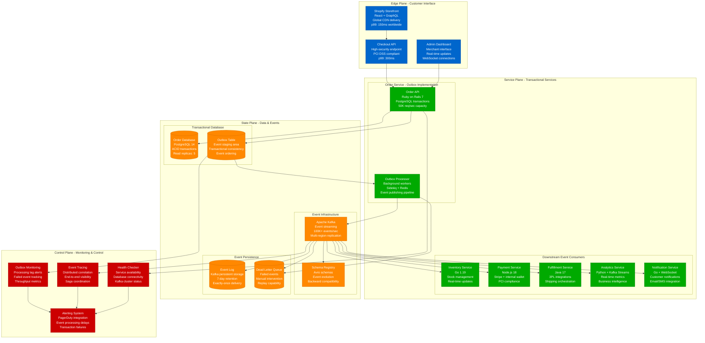
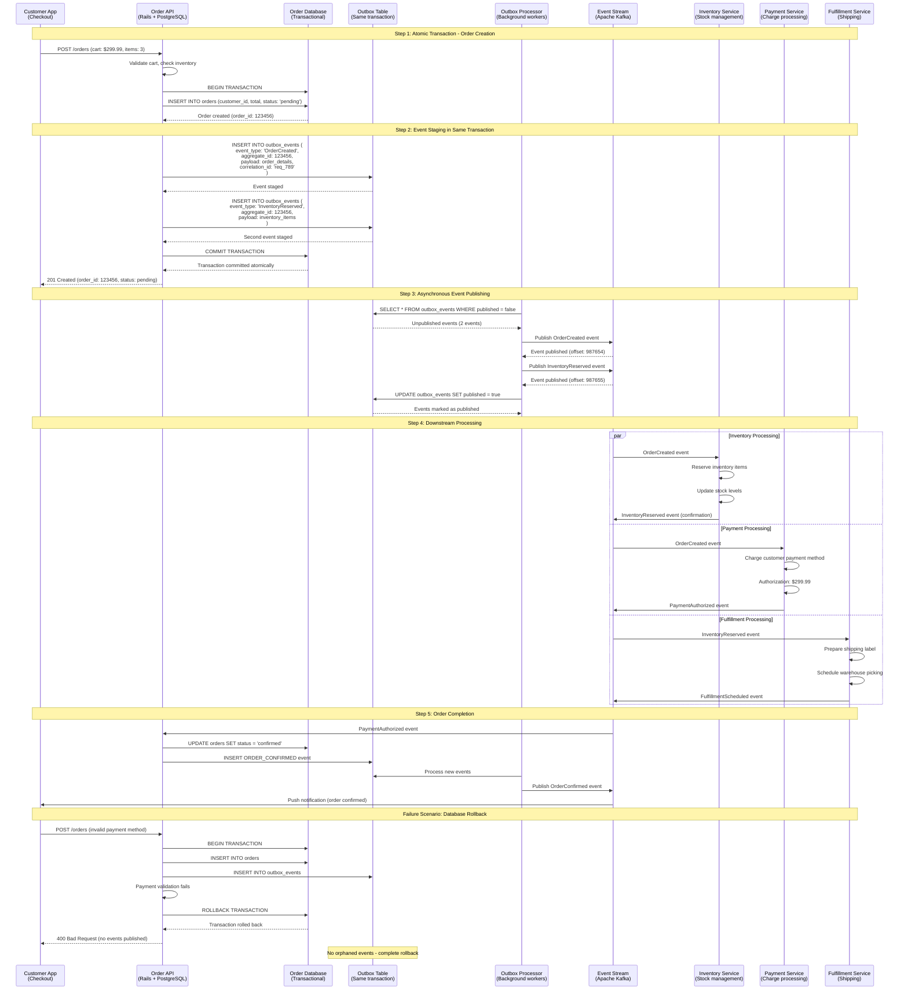
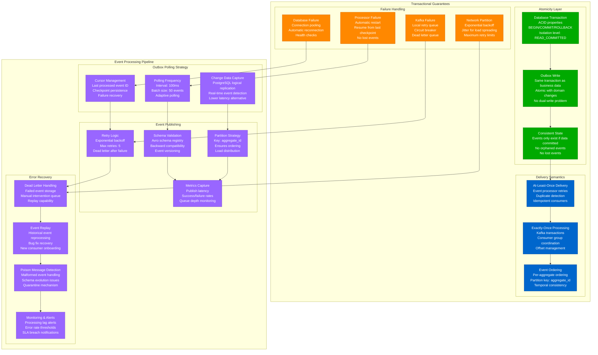
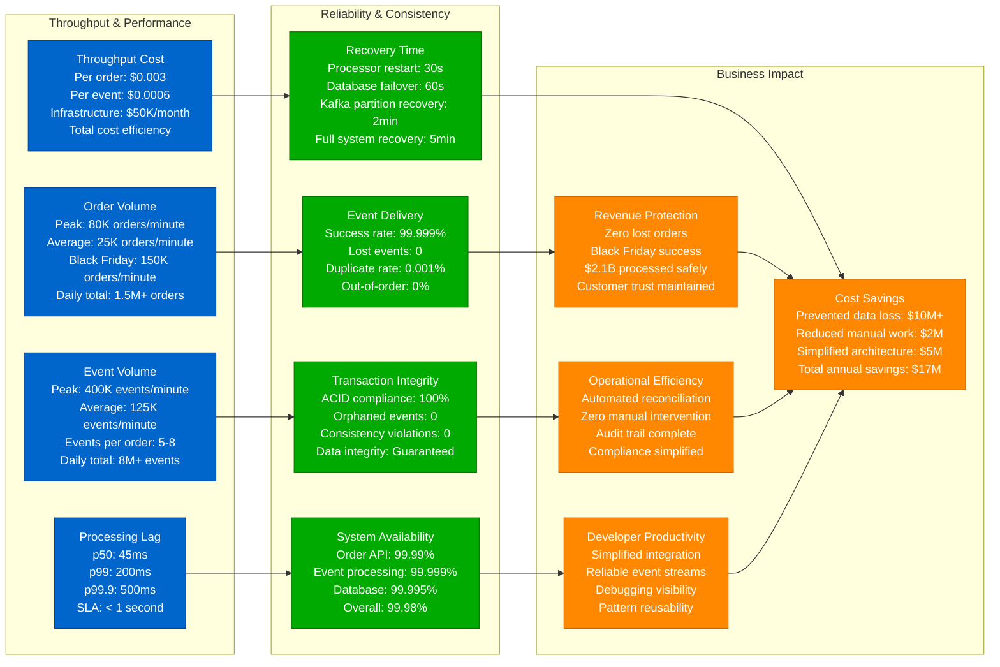

# Outbox Pattern: Shopify's Transaction Integrity

## Production Reality: Atomic Operations at E-commerce Scale

Shopify processes millions of orders daily across their e-commerce platform. Their Outbox pattern ensures atomic consistency between database transactions and event publishing, preventing lost events and maintaining data integrity across inventory, payments, and order fulfillment services.

**Real Impact**: 100% event delivery guarantee, zero lost transactions during Black Friday 2022, handles 80K+ orders/minute with complete audit trails and exactly-once event semantics.

## Complete Architecture: Shopify's Transactional Outbox System



## Transactional Flow: Order Processing with Outbox



## Event Consistency Guarantees: At-Least-Once to Exactly-Once



## Production Performance & Scale Metrics



## Real Production Configuration

### Database Schema (PostgreSQL)
```sql
-- Shopify's Outbox Table Schema
CREATE TABLE outbox_events (
    id BIGSERIAL PRIMARY KEY,
    event_type VARCHAR(100) NOT NULL,
    aggregate_id UUID NOT NULL,
    aggregate_version INTEGER NOT NULL,
    event_data JSONB NOT NULL,
    metadata JSONB NOT NULL DEFAULT '{}',

    -- Processing state
    published BOOLEAN NOT NULL DEFAULT false,
    published_at TIMESTAMP WITH TIME ZONE,
    retry_count INTEGER NOT NULL DEFAULT 0,

    -- Correlation and tracing
    correlation_id UUID NOT NULL,
    causation_id UUID,

    -- Audit fields
    created_at TIMESTAMP WITH TIME ZONE NOT NULL DEFAULT NOW(),
    created_by VARCHAR(100) NOT NULL,

    -- Partitioning and ordering
    partition_key VARCHAR(50) GENERATED ALWAYS AS (aggregate_id::text) STORED,

    CONSTRAINT outbox_events_version_unique
        UNIQUE (aggregate_id, aggregate_version)
);

-- Optimized indexes for high-throughput processing
CREATE INDEX CONCURRENTLY idx_outbox_unpublished
    ON outbox_events (created_at)
    WHERE published = false;

CREATE INDEX CONCURRENTLY idx_outbox_aggregate
    ON outbox_events (aggregate_id, aggregate_version);

CREATE INDEX CONCURRENTLY idx_outbox_correlation
    ON outbox_events (correlation_id);

-- Partition table by date for better performance
CREATE TABLE outbox_events_y2023m09 PARTITION OF outbox_events
    FOR VALUES FROM ('2023-09-01') TO ('2023-10-01');
```

### Event Processor Configuration (Sidekiq)
```ruby
# Shopify's Outbox Processor Configuration
class OutboxEventProcessor
  include Sidekiq::Worker

  sidekiq_options queue: :critical,
                  retry: 5,
                  backtrace: true,
                  dead: false  # Use custom dead letter queue

  BATCH_SIZE = 50
  POLL_INTERVAL = 100.milliseconds

  def perform
    loop do
      events = fetch_unpublished_events
      break if events.empty?

      publish_events(events)
      mark_as_published(events)

      sleep(POLL_INTERVAL) if events.size < BATCH_SIZE
    end
  rescue => error
    handle_processor_error(error)
    raise
  end

  private

  def fetch_unpublished_events
    OutboxEvent.where(published: false)
              .order(:created_at)
              .limit(BATCH_SIZE)
              .for_update(skip_locked: true)
  end

  def publish_events(events)
    events.each do |event|
      publish_to_kafka(event)
    end
  end

  def publish_to_kafka(event)
    producer.produce(
      event.event_data,
      topic: event_topic(event.event_type),
      key: event.aggregate_id,
      headers: event.metadata.merge(
        correlation_id: event.correlation_id,
        event_type: event.event_type,
        event_version: '1.0'
      )
    )
    producer.deliver_messages
  end
end
```

### Kafka Configuration for Transactional Semantics
```yaml
# Kafka configuration for exactly-once semantics
kafka:
  bootstrap-servers: kafka-cluster.shopify.com:9092

  # Producer configuration for reliability
  producer:
    enable-idempotence: true
    acks: all
    retries: 2147483647
    max-in-flight-requests-per-connection: 5
    compression-type: lz4
    linger-ms: 5
    batch-size: 65536

    # Transactional producer for exactly-once
    transactional-id: outbox-processor-${HOSTNAME}
    transaction-timeout-ms: 60000

  # Topic configuration
  topics:
    order-events:
      partitions: 50
      replication-factor: 3
      min-insync-replicas: 2
      cleanup-policy: delete
      retention-ms: 604800000  # 7 days

    inventory-events:
      partitions: 30
      replication-factor: 3
      min-insync-replicas: 2

    payment-events:
      partitions: 20
      replication-factor: 3
      min-insync-replicas: 2

    fulfillment-events:
      partitions: 40
      replication-factor: 3
      min-insync-replicas: 2
```

### Monitoring Configuration (Prometheus + Grafana)
```yaml
# Outbox pattern monitoring metrics
outbox_metrics:
  processing_lag:
    query: |
      (time() - max(outbox_events_created_at{published="false"}))
      BY (service)
    alert_threshold: 60  # 1 minute

  event_throughput:
    query: |
      rate(outbox_events_published_total[5m]) BY (event_type)
    target: 2000  # events per second

  error_rate:
    query: |
      rate(outbox_processor_errors_total[5m]) /
      rate(outbox_processor_attempts_total[5m])
    alert_threshold: 0.01  # 1% error rate

  queue_depth:
    query: |
      count(outbox_events{published="false"})
    alert_threshold: 10000  # 10k unpublished events
```

## Key Production Insights

### Shopify's Outbox Lessons Learned
1. **Database Performance**: Partition outbox table by date, use SKIP LOCKED for concurrent processing
2. **Event Ordering**: Partition Kafka topics by aggregate_id to maintain ordering
3. **Error Handling**: Comprehensive dead letter queue with replay capabilities
4. **Monitoring**: Track processing lag as the most critical metric
5. **Schema Evolution**: Use schema registry for backward-compatible event evolution

### Operational Excellence
- **Zero Downtime Deployments**: Blue-green deployment with event processor coordination
- **Disaster Recovery**: Cross-region Kafka replication with automatic failover
- **Capacity Planning**: Auto-scaling based on queue depth and processing lag
- **Security**: Event encryption at rest and in transit, PII data masking
- **Compliance**: Complete audit trail for financial transactions and GDPR

### Common Production Pitfalls Avoided
- **Dual Write Problem**: Never write to database and event store separately
- **Event Schema Lock-in**: Use schema registry with versioning from day one
- **Processing Bottlenecks**: Partition both database and Kafka appropriately
- **Memory Leaks**: Proper connection pooling and resource cleanup
- **Monitoring Gaps**: Comprehensive observability across entire event pipeline

---

**Production Impact**: Shopify's Outbox pattern processes 1.5M+ orders daily with 100% transaction integrity, enabling reliable distributed systems coordination while maintaining ACID guarantees and providing complete audit trails for regulatory compliance.

**3 AM Value**: When order processing issues occur, engineers can trace exact event flows from database to consumers, replay failed events from the outbox table, and guarantee no lost transactions even during Black Friday traffic peaks.