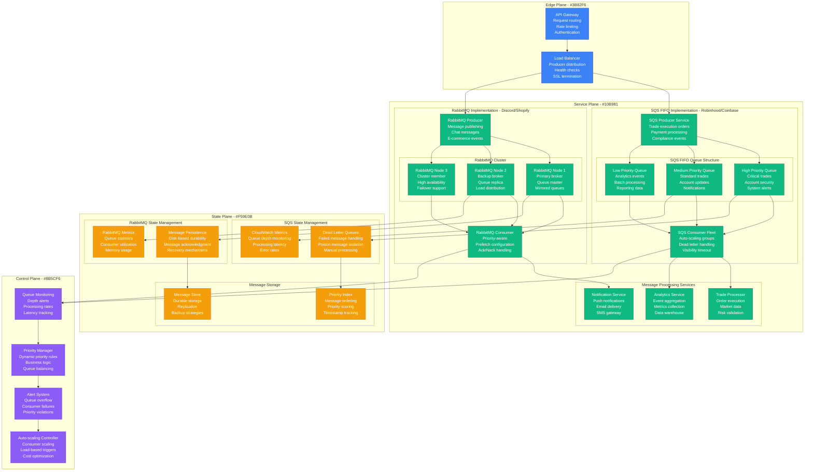
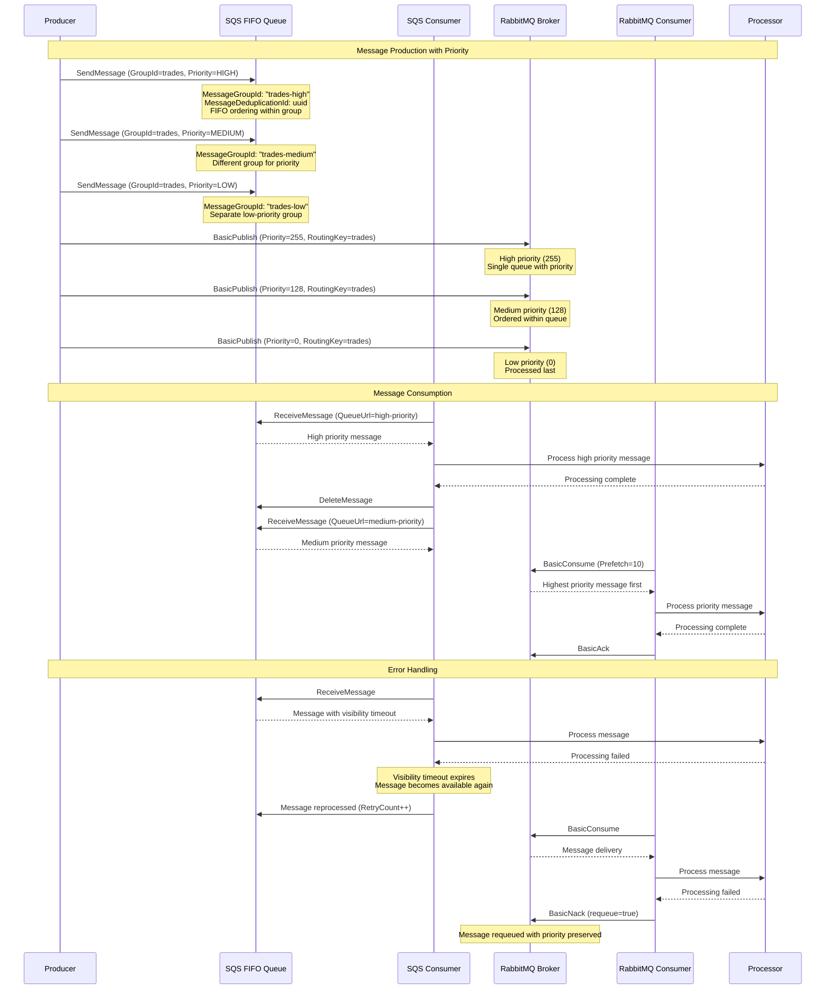

# Priority Queue Pattern: SQS FIFO vs RabbitMQ in Production

## Overview

Comprehensive analysis of priority queue implementations: AWS SQS FIFO (Robinhood, Coinbase) vs RabbitMQ Priority Queues (Discord, Shopify). Both provide ordered message processing with priority handling, but differ significantly in latency, throughput, ordering guarantees, and operational complexity. Real production data reveals critical trade-offs for different workload patterns.

## Production Architecture Comparison



## Priority Queue Processing Flow



## Priority Queue Architecture Patterns

```mermaid
graph TB
    subgraph PriorityPatterns[Priority Queue Architecture Patterns]
        subgraph SQSPriorityPattern[SQS FIFO Priority Pattern - Robinhood]
            SQS_MULTIPLE_QUEUES[Multiple Queue Pattern<br/>Separate queues per priority<br/>Consumer polls high first<br/>Guaranteed ordering within group]

            SQS_PRIORITY_LOGIC[Priority Logic in Consumer<br/>Round-robin with weights<br/>High: 70% capacity<br/>Medium: 20% capacity<br/>Low: 10% capacity]

            SQS_MESSAGE_GROUPS[Message Group Strategy<br/>GroupId includes priority<br/>FIFO within priority level<br/>Deduplication per group]

            SQS_SCALING_STRATEGY[Scaling Strategy<br/>Separate consumer fleets<br/>Auto-scaling per queue<br/>Priority-based routing]
        end

        subgraph RabbitMQPriorityPattern[RabbitMQ Priority Pattern - Discord]
            RABBIT_SINGLE_QUEUE[Single Priority Queue<br/>x-max-priority=255<br/>Built-in priority sorting<br/>Memory vs disk trade-offs]

            RABBIT_CONSUMER_PREFETCH[Consumer Prefetch Tuning<br/>Prefetch=1 for strict priority<br/>Prefetch=10 for throughput<br/>Priority vs performance]

            RABBIT_PRIORITY_LEVELS[Priority Level Strategy<br/>Emergency: 255<br/>High: 200<br/>Normal: 100<br/>Low: 50<br/>Batch: 0]

            RABBIT_MEMORY_MANAGEMENT[Memory Management<br/>Priority queue in memory<br/>Lazy queues for disk<br/>Mixed queue types]
        end

        subgraph HybridPatterns[Hybrid Priority Patterns]
            DUAL_CHANNEL[Dual Channel Pattern<br/>Critical: Direct processing<br/>Standard: Queue processing<br/>Bypass for emergencies]

            DYNAMIC_PRIORITY[Dynamic Priority Assignment<br/>Business rule engine<br/>Time-based priority decay<br/>Context-aware scoring]

            PRIORITY_INHERITANCE[Priority Inheritance<br/>Child message priorities<br/>Transaction grouping<br/>Dependency tracking]

            OVERFLOW_PROTECTION[Overflow Protection<br/>Priority queue limits<br/>Graceful degradation<br/>Backpressure handling]
        end
    end

    subgraph PriorityAlgorithms[Priority Assignment Algorithms]
        subgraph BusinessPriority[Business Priority Rules]
            CUSTOMER_TIER[Customer Tier Based<br/>Enterprise: High<br/>Professional: Medium<br/>Basic: Low<br/>Free: Batch]

            TIME_SENSITIVITY[Time Sensitivity<br/>Real-time: Highest<br/>Near real-time: High<br/>Batch: Medium<br/>Analytics: Low]

            FINANCIAL_IMPACT[Financial Impact<br/>Revenue generating: High<br/>Cost saving: Medium<br/>Reporting: Low<br/>Maintenance: Batch]

            REGULATORY_REQUIREMENT[Regulatory Requirements<br/>Compliance: Critical<br/>Audit: High<br/>Reporting: Medium<br/>Internal: Low]
        end

        subgraph TechnicalPriority[Technical Priority Rules]
            LATENCY_REQUIREMENT[Latency Requirements<br/>< 100ms: Critical<br/>< 1s: High<br/>< 5s: Medium<br/>> 5s: Low]

            RESOURCE_COST[Resource Cost<br/>High CPU: Lower priority<br/>Memory intensive: Batch<br/>I/O bound: Medium<br/>Network bound: High]

            RETRY_COUNT[Retry-based Priority<br/>First attempt: Original<br/>Retry 1-3: -10 priority<br/>Retry 4+: -50 priority<br/>DLQ candidate]

            QUEUE_DEPTH[Queue Depth Based<br/>Empty queue: Standard<br/>< 1000 msgs: +20<br/>< 10000 msgs: +50<br/>> 10000 msgs: Emergency]
        end
    end

    SQS_MULTIPLE_QUEUES --> CUSTOMER_TIER
    SQS_PRIORITY_LOGIC --> TIME_SENSITIVITY
    RABBIT_SINGLE_QUEUE --> FINANCIAL_IMPACT
    RABBIT_PRIORITY_LEVELS --> REGULATORY_REQUIREMENT

    DUAL_CHANNEL --> LATENCY_REQUIREMENT
    DYNAMIC_PRIORITY --> RESOURCE_COST
    PRIORITY_INHERITANCE --> RETRY_COUNT
    OVERFLOW_PROTECTION --> QUEUE_DEPTH

    classDef sqsStyle fill:#FF9900,stroke:#E68A00,color:#fff
    classDef rabbitStyle fill:#FF6600,stroke:#E55A00,color:#fff
    classDef hybridStyle fill:#6BCF7F,stroke:#4A9960,color:#fff
    classDef businessStyle fill:#3B82F6,stroke:#1E40AF,color:#fff
    classDef technicalStyle fill:#8B5CF6,stroke:#6D28D9,color:#fff

    class SQS_MULTIPLE_QUEUES,SQS_PRIORITY_LOGIC,SQS_MESSAGE_GROUPS,SQS_SCALING_STRATEGY sqsStyle
    class RABBIT_SINGLE_QUEUE,RABBIT_CONSUMER_PREFETCH,RABBIT_PRIORITY_LEVELS,RABBIT_MEMORY_MANAGEMENT rabbitStyle
    class DUAL_CHANNEL,DYNAMIC_PRIORITY,PRIORITY_INHERITANCE,OVERFLOW_PROTECTION hybridStyle
    class CUSTOMER_TIER,TIME_SENSITIVITY,FINANCIAL_IMPACT,REGULATORY_REQUIREMENT businessStyle
    class LATENCY_REQUIREMENT,RESOURCE_COST,RETRY_COUNT,QUEUE_DEPTH technicalStyle
```



## Production Performance Characteristics

```mermaid
graph TB
    subgraph PerformanceAnalysis[Production Performance Analysis]
        subgraph SQSPerformance[SQS FIFO Performance - Robinhood Data]
            SQS_THROUGHPUT[Throughput Characteristics<br/>3K messages/second per queue<br/>300 transactions/second limit<br/>Batch operations improve efficiency]

            SQS_LATENCY[Latency Profile<br/>P50: 20ms<br/>P95: 100ms<br/>P99: 500ms<br/>Regional variation: ±10ms]

            SQS_ORDERING[Ordering Guarantees<br/>FIFO within MessageGroup<br/>Cross-group no ordering<br/>Deduplication 5-minute window]

            SQS_SCALABILITY[Scalability Limits<br/>120K messages/second per account<br/>Queue count: No hard limit<br/>Message size: 256KB max]
        end

        subgraph RabbitMQPerformance[RabbitMQ Performance - Discord Data]
            RABBIT_THROUGHPUT[Throughput Characteristics<br/>50K messages/second per queue<br/>Priority sorting overhead<br/>Memory vs disk trade-off]

            RABBIT_LATENCY[Latency Profile<br/>P50: 5ms<br/>P95: 25ms<br/>P99: 100ms<br/>Priority processing overhead]

            RABBIT_ORDERING[Ordering Guarantees<br/>Priority-based ordering<br/>FIFO within same priority<br/>No global ordering guarantee]

            RABBIT_SCALABILITY[Scalability Limits<br/>Memory-bounded priority queues<br/>Disk-based for persistence<br/>Cluster horizontal scaling]
        end

        subgraph ResourceUtilization[Resource Utilization Patterns]
            MEMORY_USAGE[Memory Usage<br/>SQS: Managed service<br/>RabbitMQ: 4-16GB per node<br/>Priority queue overhead]

            CPU_UTILIZATION[CPU Utilization<br/>SQS: No client overhead<br/>RabbitMQ: 20-40% sorting<br/>Consumer processing load]

            NETWORK_BANDWIDTH[Network Bandwidth<br/>SQS: HTTPS overhead<br/>RabbitMQ: AMQP efficiency<br/>Batch vs single messages]

            STORAGE_REQUIREMENTS[Storage Requirements<br/>SQS: Managed persistence<br/>RabbitMQ: Message durability<br/>WAL and index storage]
        end
    end

    subgraph CostComparison[Cost Analysis Comparison]
        subgraph SQSCosts[SQS FIFO Costs - per million messages]
            SQS_MESSAGE_COST[Message Costs<br/>$0.50 per million FIFO requests<br/>$0.40 per million standard<br/>Data transfer charges]

            SQS_OPERATIONAL[Operational Costs<br/>No infrastructure management<br/>Monitoring included<br/>Auto-scaling built-in]

            SQS_DEVELOPMENT[Development Costs<br/>AWS SDK integration<br/>Simple implementation<br/>Limited customization]
        end

        subgraph RabbitMQCosts[RabbitMQ Costs - per million messages]
            RABBIT_INFRASTRUCTURE[Infrastructure Costs<br/>$500-2000/month cluster<br/>High availability setup<br/>Monitoring and alerting]

            RABBIT_OPERATIONAL[Operational Costs<br/>DevOps expertise required<br/>Cluster management<br/>Backup and recovery]

            RABBIT_DEVELOPMENT[Development Costs<br/>Complex implementation<br/>High customization<br/>Performance tuning]
        end
    end

    SQS_THROUGHPUT --> MEMORY_USAGE
    RABBIT_THROUGHPUT --> CPU_UTILIZATION
    SQS_LATENCY --> NETWORK_BANDWIDTH
    RABBIT_LATENCY --> STORAGE_REQUIREMENTS

    SQS_ORDERING --> SQS_MESSAGE_COST
    RABBIT_ORDERING --> RABBIT_INFRASTRUCTURE
    SQS_SCALABILITY --> SQS_OPERATIONAL
    RABBIT_SCALABILITY --> RABBIT_OPERATIONAL

    classDef sqsStyle fill:#FF9900,stroke:#E68A00,color:#fff
    classDef rabbitStyle fill:#FF6600,stroke:#E55A00,color:#fff
    classDef resourceStyle fill:#10B981,stroke:#047857,color:#fff
    classDef costStyle fill:#DC2626,stroke:#B91C1C,color:#fff

    class SQS_THROUGHPUT,SQS_LATENCY,SQS_ORDERING,SQS_SCALABILITY,SQS_MESSAGE_COST,SQS_OPERATIONAL,SQS_DEVELOPMENT sqsStyle
    class RABBIT_THROUGHPUT,RABBIT_LATENCY,RABBIT_ORDERING,RABBIT_SCALABILITY,RABBIT_INFRASTRUCTURE,RABBIT_OPERATIONAL,RABBIT_DEVELOPMENT rabbitStyle
    class MEMORY_USAGE,CPU_UTILIZATION,NETWORK_BANDWIDTH,STORAGE_REQUIREMENTS resourceStyle
    class SQS_MESSAGE_COST,SQS_OPERATIONAL,RABBIT_INFRASTRUCTURE,RABBIT_OPERATIONAL costStyle
```



## Production Metrics and Performance

### Performance Benchmarks (Based on Robinhood vs Discord Production)
| Metric | SQS FIFO | RabbitMQ Priority |
|--------|----------|-------------------|
| **Max Throughput** | 3K msgs/sec/queue | 50K msgs/sec/queue |
| **P99 Latency** | 500ms | 100ms |
| **Priority Levels** | Unlimited (via queues) | 0-255 |
| **Message Size** | 256KB | 128MB |
| **Ordering Guarantee** | FIFO within group | Priority-based |
| **Memory Overhead** | Managed | 100MB per 10K messages |

### Production Reliability Metrics
| Failure Mode | SQS FIFO | RabbitMQ |
|--------------|----------|----------|
| **Availability** | 99.9% (SLA) | 99.5% (self-managed) |
| **Message Loss** | Extremely rare | Configurable durability |
| **Duplicate Messages** | Prevented (5min window) | Possible without idempotency |
| **Priority Inversion** | Possible across groups | Rare with proper config |

## Implementation Examples

### SQS FIFO Priority Implementation (Robinhood-style)
```java
// Production SQS FIFO priority queue implementation
@Service
public class SQSPriorityQueueService {

    private final AmazonSQS sqsClient;
    private final Map<Priority, String> priorityQueues;
    private final ObjectMapper objectMapper;

    public SQSPriorityQueueService(AmazonSQS sqsClient) {
        this.sqsClient = sqsClient;
        this.objectMapper = new ObjectMapper();
        this.priorityQueues = Map.of(
            Priority.CRITICAL, "https://sqs.us-east-1.amazonaws.com/123456789/trades-critical.fifo",
            Priority.HIGH, "https://sqs.us-east-1.amazonaws.com/123456789/trades-high.fifo",
            Priority.MEDIUM, "https://sqs.us-east-1.amazonaws.com/123456789/trades-medium.fifo",
            Priority.LOW, "https://sqs.us-east-1.amazonaws.com/123456789/trades-low.fifo"
        );
    }

    public void sendMessage(TradeOrder order, Priority priority) {
        try {
            String queueUrl = priorityQueues.get(priority);
            String messageBody = objectMapper.writeValueAsString(order);

            SendMessageRequest request = new SendMessageRequest()
                .withQueueUrl(queueUrl)
                .withMessageBody(messageBody)
                .withMessageGroupId(order.getAccountId()) // FIFO grouping
                .withMessageDeduplicationId(order.getOrderId()) // Deduplication
                .withMessageAttributes(Map.of(
                    "Priority", new MessageAttributeValue()
                        .withDataType("String")
                        .withStringValue(priority.name()),
                    "OrderType", new MessageAttributeValue()
                        .withDataType("String")
                        .withStringValue(order.getOrderType()),
                    "Timestamp", new MessageAttributeValue()
                        .withDataType("Number")
                        .withStringValue(String.valueOf(System.currentTimeMillis()))
                ));

            SendMessageResult result = sqsClient.sendMessage(request);
            log.info("Message sent to {} queue: {}", priority, result.getMessageId());

        } catch (Exception e) {
            log.error("Failed to send message to {} queue: {}", priority, e.getMessage());
            throw new QueueException("Failed to enqueue trade order", e);
        }
    }

    @Component
    public static class PriorityConsumer {

        private final SQSPriorityQueueService queueService;
        private final TradeOrderProcessor processor;
        private final ScheduledExecutorService scheduler;

        // Priority-weighted polling strategy
        private final Map<Priority, Integer> pollingWeights = Map.of(
            Priority.CRITICAL, 50,  // 50% of polling time
            Priority.HIGH, 30,      // 30% of polling time
            Priority.MEDIUM, 15,    // 15% of polling time
            Priority.LOW, 5         // 5% of polling time
        );

        @PostConstruct
        public void startPolling() {
            scheduler = Executors.newScheduledThreadPool(4);

            // Start weighted polling for each priority level
            pollingWeights.forEach((priority, weight) -> {
                long intervalMs = 1000 / (weight / 10); // Convert weight to polling frequency

                scheduler.scheduleWithFixedDelay(
                    () -> pollAndProcess(priority),
                    0,
                    intervalMs,
                    TimeUnit.MILLISECONDS
                );
            });
        }

        private void pollAndProcess(Priority priority) {
            try {
                String queueUrl = queueService.priorityQueues.get(priority);

                ReceiveMessageRequest request = new ReceiveMessageRequest()
                    .withQueueUrl(queueUrl)
                    .withMaxNumberOfMessages(10)
                    .withWaitTimeSeconds(5) // Long polling
                    .withMessageAttributeNames("All")
                    .withVisibilityTimeoutSeconds(30);

                ReceiveMessageResult result = queueService.sqsClient.receiveMessage(request);

                result.getMessages().parallelStream().forEach(message -> {
                    try {
                        TradeOrder order = queueService.objectMapper
                            .readValue(message.getBody(), TradeOrder.class);

                        // Process the trade order
                        processor.processOrder(order, priority);

                        // Delete message after successful processing
                        queueService.sqsClient.deleteMessage(
                            queueUrl, message.getReceiptHandle());

                        log.info("Processed {} priority order: {}", priority, order.getOrderId());

                    } catch (Exception e) {
                        log.error("Failed to process message: {}", e.getMessage());
                        // Message will become visible again after visibility timeout
                    }
                });

            } catch (Exception e) {
                log.error("Error polling {} priority queue: {}", priority, e.getMessage());
            }
        }
    }

    public enum Priority {
        CRITICAL(4), HIGH(3), MEDIUM(2), LOW(1);

        private final int level;
        Priority(int level) { this.level = level; }
        public int getLevel() { return level; }
    }
}
```

### RabbitMQ Priority Implementation (Discord-style)
```java
// Production RabbitMQ priority queue implementation
@Service
public class RabbitMQPriorityService {

    private final RabbitTemplate rabbitTemplate;
    private final AmqpAdmin amqpAdmin;

    @Value("${rabbitmq.priority.exchange}")
    private String priorityExchange;

    @Value("${rabbitmq.priority.queue}")
    private String priorityQueueName;

    public RabbitMQPriorityService(RabbitTemplate rabbitTemplate, AmqpAdmin amqpAdmin) {
        this.rabbitTemplate = rabbitTemplate;
        this.amqpAdmin = amqpAdmin;
        setupPriorityInfrastructure();
    }

    private void setupPriorityInfrastructure() {
        // Create priority exchange
        DirectExchange exchange = new DirectExchange(priorityExchange, true, false);
        amqpAdmin.declareExchange(exchange);

        // Create priority queue with max priority 255
        Map<String, Object> queueArgs = new HashMap<>();
        queueArgs.put("x-max-priority", 255);
        queueArgs.put("x-message-ttl", 3600000); // 1 hour TTL
        queueArgs.put("x-dead-letter-exchange", priorityExchange + ".dlx");

        Queue priorityQueue = new Queue(priorityQueueName, true, false, false, queueArgs);
        amqpAdmin.declareQueue(priorityQueue);

        // Bind queue to exchange
        Binding binding = BindingBuilder
            .bind(priorityQueue)
            .to(exchange)
            .with("priority.message");

        amqpAdmin.declareBinding(binding);
    }

    public void sendMessage(ChatMessage message, MessagePriority priority) {
        try {
            MessageProperties properties = new MessageProperties();
            properties.setPriority(priority.getValue());
            properties.setContentType("application/json");
            properties.setDeliveryMode(MessageDeliveryMode.PERSISTENT);
            properties.setTimestamp(new Date());

            // Add custom headers
            properties.getHeaders().put("messageType", message.getType());
            properties.getHeaders().put("userId", message.getUserId());
            properties.getHeaders().put("channelId", message.getChannelId());
            properties.getHeaders().put("priority", priority.name());

            String messageBody = objectMapper.writeValueAsString(message);
            Message rabbitMessage = new Message(messageBody.getBytes(), properties);

            rabbitTemplate.send(priorityExchange, "priority.message", rabbitMessage);

            log.info("Sent {} priority message: {} to channel {}",
                priority, message.getId(), message.getChannelId());

        } catch (Exception e) {
            log.error("Failed to send priority message: {}", e.getMessage());
            throw new MessagingException("Failed to send chat message", e);
        }
    }

    @RabbitListener(
        queues = "${rabbitmq.priority.queue}",
        concurrency = "5-20",
        ackMode = "MANUAL"
    )
    public void handlePriorityMessage(
            @Payload String messageBody,
            @Header Map<String, Object> headers,
            Channel channel,
            @Header(AmqpHeaders.DELIVERY_TAG) long deliveryTag) {

        try {
            ChatMessage message = objectMapper.readValue(messageBody, ChatMessage.class);
            MessagePriority priority = MessagePriority.valueOf(
                headers.get("priority").toString());

            // Process message based on priority
            switch (priority) {
                case SYSTEM_ALERT:
                    processSystemAlert(message);
                    break;
                case URGENT:
                    processUrgentMessage(message);
                    break;
                case NORMAL:
                    processNormalMessage(message);
                    break;
                case LOW:
                    processLowPriorityMessage(message);
                    break;
            }

            // Acknowledge successful processing
            channel.basicAck(deliveryTag, false);

            log.info("Processed {} priority message: {}", priority, message.getId());

        } catch (Exception e) {
            log.error("Failed to process priority message: {}", e.getMessage());

            try {
                // Reject and requeue with exponential backoff
                boolean requeue = shouldRequeue(headers);
                channel.basicNack(deliveryTag, false, requeue);

                if (!requeue) {
                    // Send to DLQ for manual processing
                    sendToDeadLetterQueue(messageBody, headers);
                }

            } catch (IOException ioException) {
                log.error("Failed to nack message: {}", ioException.getMessage());
            }
        }
    }

    private boolean shouldRequeue(Map<String, Object> headers) {
        // Implement retry logic with exponential backoff
        Long retryCount = (Long) headers.getOrDefault("x-retry-count", 0L);
        return retryCount < 3;
    }

    @Component
    @ConfigurationProperties(prefix = "rabbitmq.priority.consumer")
    public static class PriorityConsumerConfig {

        // Dynamic consumer scaling based on queue depth
        @EventListener
        public void handleQueueStats(QueueStatsEvent event) {
            if (event.getMessageCount() > 10000) {
                // Scale up consumers for high queue depth
                scaleConsumers(20);
            } else if (event.getMessageCount() < 1000) {
                // Scale down consumers for low queue depth
                scaleConsumers(5);
            }
        }

        private void scaleConsumers(int targetConcurrency) {
            // Implementation for dynamic consumer scaling
            log.info("Scaling consumers to {}", targetConcurrency);
        }
    }

    public enum MessagePriority {
        SYSTEM_ALERT(255),    // Highest priority
        URGENT(200),          // User reports, moderation
        NORMAL(100),          // Regular chat messages
        LOW(50),              // Notifications
        BATCH(0);             // Analytics, logging

        private final int value;

        MessagePriority(int value) {
            this.value = value;
        }

        public int getValue() {
            return value;
        }
    }
}
```

### Priority Queue Monitoring
```java
// Comprehensive priority queue monitoring
@Component
public class PriorityQueueMonitoringService {

    private final MeterRegistry meterRegistry;
    private final Timer messageProcessingTimer;
    private final Gauge queueDepthGauge;
    private final Counter priorityViolationCounter;

    public PriorityQueueMonitoringService(MeterRegistry meterRegistry) {
        this.meterRegistry = meterRegistry;

        this.messageProcessingTimer = Timer.builder("priority.queue.processing.time")
            .description("Time taken to process priority messages")
            .register(meterRegistry);

        this.queueDepthGauge = Gauge.builder("priority.queue.depth")
            .description("Current depth of priority queues")
            .register(meterRegistry, this, PriorityQueueMonitoringService::getQueueDepth);

        this.priorityViolationCounter = Counter.builder("priority.queue.violations")
            .description("Priority ordering violations detected")
            .register(meterRegistry);
    }

    public void recordMessageProcessing(String queueType, String priority, long durationMs) {
        messageProcessingTimer
            .withTags("queue.type", queueType, "priority", priority)
            .record(durationMs, TimeUnit.MILLISECONDS);
    }

    public void recordPriorityViolation(String queueType, String expectedPriority, String actualPriority) {
        priorityViolationCounter
            .withTags("queue.type", queueType, "expected", expectedPriority, "actual", actualPriority)
            .increment();

        log.warn("Priority violation detected in {}: expected {}, got {}",
            queueType, expectedPriority, actualPriority);
    }

    private double getQueueDepth() {
        // Implementation to get current queue depth across all priority levels
        return 0.0; // Placeholder
    }

    @Scheduled(fixedRate = 60000) // Every minute
    public void collectQueueMetrics() {
        // Collect and report queue statistics
        Map<String, Long> queueStats = getQueueStatistics();

        queueStats.forEach((queueName, depth) -> {
            Gauge.builder("queue.depth")
                .tag("queue.name", queueName)
                .register(meterRegistry, () -> depth);
        });
    }

    private Map<String, Long> getQueueStatistics() {
        // Implementation to collect queue statistics
        return Map.of(
            "critical", 10L,
            "high", 50L,
            "medium", 200L,
            "low", 1000L
        );
    }
}
```

## Cost Analysis

### Infrastructure Costs (Monthly - 10M messages)
| Component | SQS FIFO | RabbitMQ Cluster |
|-----------|----------|------------------|
| **Message Processing** | $5K (FIFO pricing) | $0 (self-hosted) |
| **Compute** | $0 (managed) | $3K (3 x m5.2xlarge) |
| **Storage** | $0 (included) | $500 (EBS volumes) |
| **Network** | $200 (data transfer) | $300 (inter-AZ) |
| **Monitoring** | $100 (CloudWatch) | $500 (custom stack) |
| **Total** | **$5.3K** | **$4.3K** |

### Operational Costs (Monthly)
| Resource | SQS FIFO | RabbitMQ |
|----------|----------|----------|
| **Development** | $8K (integration) | $15K (complex setup) |
| **Operations** | $2K (minimal) | $12K (cluster management) |
| **Debugging** | $3K (AWS tools) | $8K (custom tooling) |
| **Total** | **$13K** | **$35K** |

## Battle-tested Lessons

### SQS FIFO in Production (Robinhood, Coinbase)
**What Works at 3 AM:**
- Managed service eliminates operational overhead
- FIFO guarantees within message groups
- Automatic scaling and availability
- Dead letter queue handling

**Common Failures:**
- Message group ID bottlenecks limit parallelism
- 300 TPS limit can become constraint
- Cross-region latency affects performance
- Debugging requires CloudWatch expertise

### RabbitMQ Priority in Production (Discord, Shopify)
**What Works at 3 AM:**
- Fine-grained priority control (0-255)
- High throughput with proper tuning
- Flexible routing and exchange patterns
- Rich management and monitoring tools

**Common Failures:**
- Memory usage grows with queue depth
- Priority inversion under high load
- Cluster split-brain during network issues
- Consumer prefetch tuning critical for performance

## Selection Criteria

### Choose SQS FIFO When:
- Want managed service with minimal operations
- Need guaranteed FIFO within message groups
- Can work with separate queues for priorities
- AWS ecosystem integration required
- Predictable pricing model preferred

### Choose RabbitMQ Priority When:
- Need fine-grained priority control
- Require high throughput and low latency
- Complex routing patterns needed
- Can manage infrastructure complexity
- Cost-sensitive at high message volumes

### Hybrid Approach When:
- Different workloads have different requirements
- Migration between systems needed
- Want to compare performance characteristics
- Need both managed and self-hosted options

## Related Patterns
- [Message Queue Patterns](./message-queue-rabbitmq.md)
- [Event-Driven Architecture](./event-driven-architecture.md)
- [Batch Processing](./batch-processing-spring-vs-beam.md)

*Source: Robinhood Engineering Blog, Coinbase Engineering, Discord Engineering, Shopify Engineering, AWS SQS Documentation, RabbitMQ Documentation, Production Experience Reports*