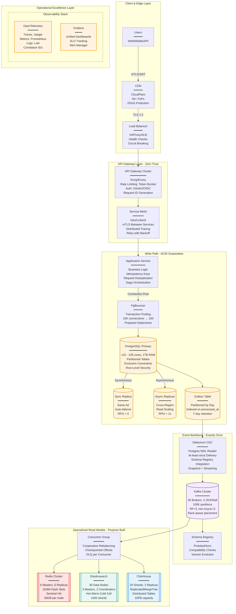

# Production Architecture Pattern

## Overview

This comprehensive production architecture demonstrates the complete Universal Stack with all necessary components for a production-ready distributed system.

## Complete Universal Stack - Production Excellence Architecture

## Key Architecture Components

### Write Path
- **PostgreSQL Primary**: Main transactional database with ACID guarantees
- **Synchronous Replica**: Zero data loss failover capability
- **Outbox Pattern**: Ensures reliable event publishing

### Event Backbone
- **Debezium CDC**: Captures all database changes reliably
- **Kafka Cluster**: Highly available event streaming platform
- **Schema Registry**: Ensures backward/forward compatibility

### Read Models
- **Redis**: Hot data and caching layer
- **Elasticsearch**: Full-text search and analytics
- **ClickHouse**: Large-scale analytics and time-series data

### Operational Excellence
- **OpenTelemetry**: Distributed tracing and metrics
- **Prometheus + Grafana**: Monitoring and visualization
- **Alert Manager**: Intelligent alerting and escalation

## Production Guarantees

| Aspect | Guarantee | Implementation |
|--------|-----------|----------------|
| **Availability** | 99.99% | Multi-region, auto-failover |
| **Durability** | 99.999999% | 3x replication, backup |
| **Latency** | P99 < 500ms | Caching, read replicas |
| **Throughput** | 100K req/sec | Horizontal scaling |
| **Consistency** | Strong (write), Eventual (read) | Synchronous replication, CDC |

## Deployment Considerations

1. **Infrastructure as Code**: Use Terraform/Pulumi for all infrastructure
2. **Container Orchestration**: Kubernetes with proper resource limits
3. **Service Mesh**: Istio/Linkerd for zero-trust networking
4. **Secrets Management**: HashiCorp Vault or AWS Secrets Manager
5. **Disaster Recovery**: Multi-region deployment with automated failover

## Related Patterns

- [System Patterns](./system-patterns.md) - Additional architectural patterns
- [Pattern Catalog](./pattern-catalog.md) - Complete pattern reference
- [Micro-Patterns](./micro-patterns.md) - Fine-grained patterns