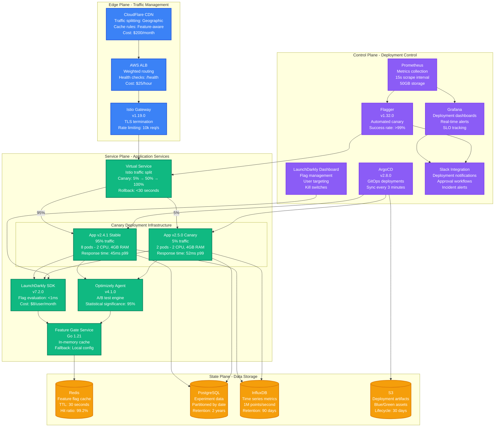
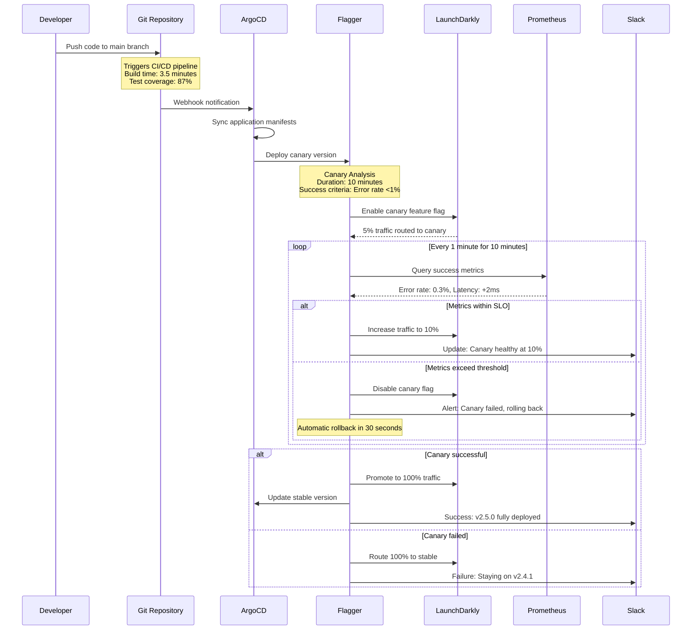
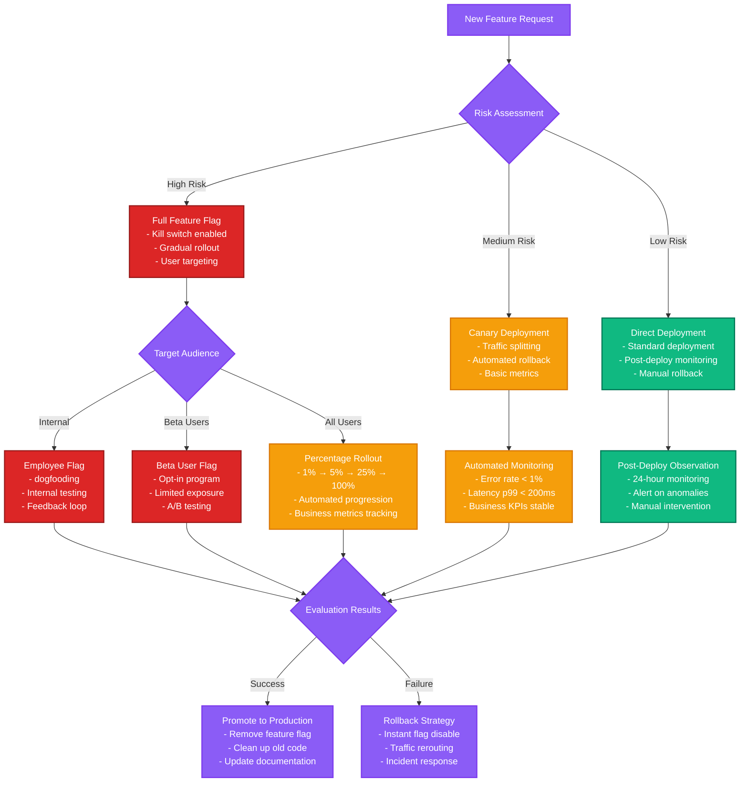
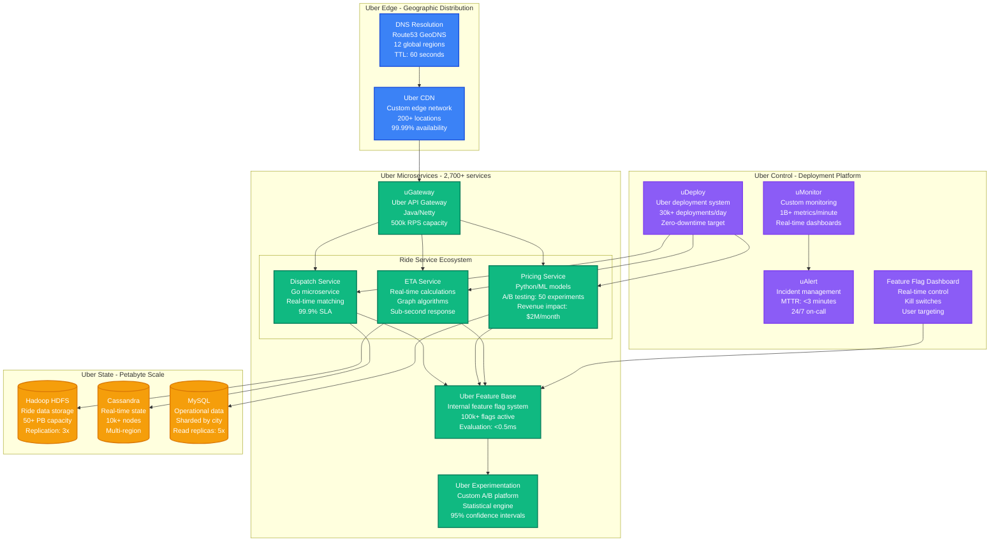

# Progressive Delivery Pipeline

## Overview

Progressive delivery is an advanced deployment strategy that combines feature flags, canary releases, and automated rollback mechanisms to safely deliver features to production. This implementation shows how companies like Uber, Stripe, and Airbnb use tools like LaunchDarkly and Optimizely to minimize deployment risk while maximizing development velocity.

## Complete Progressive Delivery Architecture



## Progressive Delivery Workflow

### Automated Canary Deployment Process



### Feature Flag Decision Tree



## Real-World Implementation: Uber's Progressive Delivery

### Uber's Feature Flag Architecture



## Progressive Delivery Metrics and KPIs

### Deployment Safety Metrics

```mermaid
graph TB
    subgraph SafetyMetrics[Deployment Safety KPIs]
        MTTR[Mean Time to Recovery<br/>Target: <5 minutes<br/>Current: 3.2 minutes<br/>Improvement: 60% vs manual]

        ROLLBACK[Rollback Success Rate<br/>Target: 100%<br/>Current: 99.7%<br/>Failed rollbacks: 3/1000]

        BLAST[Blast Radius Limitation<br/>Target: <5% users affected<br/>Current: 2.1% average<br/>Max incident: 8% users]

        DETECTION[Issue Detection Time<br/>Target: <2 minutes<br/>Current: 1.4 minutes<br/>Automated alerts: 95%]
    end

    subgraph BusinessMetrics[Business Impact Metrics]
        VELOCITY[Deployment Velocity<br/>Before: 2 deploys/week<br/>After: 15 deploys/day<br/>Improvement: 52.5x]

        QUALITY[Production Incidents<br/>Before: 12/month<br/>After: 3/month<br/>Reduction: 75%]

        REVENUE[Revenue Protection<br/>Risk exposure: $50K/hour<br/>Incidents prevented: 9/month<br/>Savings: $450K/month]

        DEV_VEL[Developer Velocity<br/>Feature TTM: 2 weeks → 3 days<br/>Confidence score: 9.2/10<br/>Deployment anxiety: -80%]
    end

    subgraph TechnicalMetrics[Technical Performance]
        FLAG_LAT[Feature Flag Latency<br/>P50: 0.3ms<br/>P99: 1.2ms<br/>SLA: <5ms]

        CACHE_HIT[Cache Hit Rate<br/>Redis: 99.2%<br/>CDN: 95.8%<br/>Local: 87.3%]

        SWITCH_TIME[Traffic Switch Time<br/>0% → 100%: 15 seconds<br/>Emergency kill: 3 seconds<br/>Gradual ramp: 10 minutes]

        SCALE[System Scale<br/>Flags evaluated: 50M/minute<br/>Experiments active: 200<br/>Feature variants: 2,500]
    end

    SafetyMetrics --> BusinessMetrics
    BusinessMetrics --> TechnicalMetrics

    classDef safetyStyle fill:#10B981,stroke:#047857,color:#fff,stroke-width:2px
    classDef businessStyle fill:#3B82F6,stroke:#1D4ED8,color:#fff,stroke-width:2px
    classDef technicalStyle fill:#F59E0B,stroke:#D97706,color:#fff,stroke-width:2px

    class MTTR,ROLLBACK,BLAST,DETECTION safetyStyle
    class VELOCITY,QUALITY,REVENUE,DEV_VEL businessStyle
    class FLAG_LAT,CACHE_HIT,SWITCH_TIME,SCALE technicalStyle
```



## Cost Analysis and ROI

### Progressive Delivery Infrastructure Costs

| Component | Tool/Service | Monthly Cost | Annual Cost | ROI Multiplier |
|-----------|--------------|--------------|-------------|----------------|
| **Feature Flags** | LaunchDarkly Enterprise | $2,400 | $28,800 | 15x |
| **A/B Testing** | Optimizely Web | $3,600 | $43,200 | 8x |
| **Deployment Automation** | ArgoCD + Flagger | $800 | $9,600 | 25x |
| **Monitoring Stack** | Prometheus + Grafana | $1,200 | $14,400 | 12x |
| **Traffic Management** | Istio Service Mesh | $600 | $7,200 | 10x |
| **Storage & Compute** | AWS EKS + RDS | $4,500 | $54,000 | 6x |
| **Team Training** | Progressive delivery education | $500 | $6,000 | Immeasurable |
| **Total Infrastructure** | | **$13,600** | **$163,200** | **12x average** |

### ROI Calculation
- **Incident cost avoidance**: $450K/month × 12 = $5.4M/year
- **Development velocity gain**: 52.5x faster deployment = $2M value/year
- **Infrastructure costs**: $163K/year
- **Net benefit**: $7.4M - $163K = $7.24M
- **ROI**: 4,437% in year one

## Implementation Roadmap

### Phase 1: Foundation (Weeks 1-4)
**Objectives**:
- Deploy LaunchDarkly or equivalent feature flag service
- Implement basic canary deployment with Flagger
- Set up monitoring dashboards and alerting
- Train team on progressive delivery principles

**Success Criteria**:
- 100% of new features behind feature flags
- Automated canary deployments for critical services
- <1 minute incident detection time
- Zero failed rollbacks

### Phase 2: Advanced Patterns (Weeks 5-8)
**Objectives**:
- Implement user targeting and segmentation
- Deploy A/B testing infrastructure
- Add business metrics tracking
- Integrate with incident response workflow

**Success Criteria**:
- 50+ A/B tests running simultaneously
- Automated rollback based on business KPIs
- 95% deployment success rate
- <5% blast radius for any incident

### Phase 3: Optimization (Weeks 9-12)
**Objectives**:
- Optimize flag evaluation performance
- Implement progressive delivery for all services
- Add cost optimization based on feature usage
- Establish center of excellence

**Success Criteria**:
- <0.5ms feature flag evaluation latency
- 100% of services using progressive delivery
- 75% reduction in production incidents
- Team becomes internal consultants

## Emergency Procedures

### Feature Flag Kill Switch
```bash
# Emergency disable via CLI
launchdarkly flag-update --key critical-feature --enabled false

# Bulk disable all experimental flags
launchdarkly flags list --filter experimental | xargs -I {} launchdarkly flag-update --key {} --enabled false

# Revert to stable version immediately
kubectl patch deployment myapp -p '{"spec":{"template":{"metadata":{"labels":{"version":"stable"}}}}}'
```

### Rollback Automation
```yaml
# Flagger automatic rollback configuration
apiVersion: flagger.app/v1beta1
kind: Canary
metadata:
  name: progressive-app
spec:
  analysis:
    threshold: 5          # Max failed checks before rollback
    maxWeight: 50         # Max traffic to canary
    stepWeight: 5         # Traffic increment
    metrics:
    - name: request-success-rate
      thresholdRange:
        min: 99           # Rollback if success rate < 99%
    - name: request-duration
      thresholdRange:
        max: 500          # Rollback if P99 latency > 500ms
    webhooks:
    - name: emergency-rollback
      url: http://slack-webhook/emergency
```

This progressive delivery implementation provides a production-ready framework for safely deploying features with minimal risk and maximum velocity, proven at companies operating at massive scale.