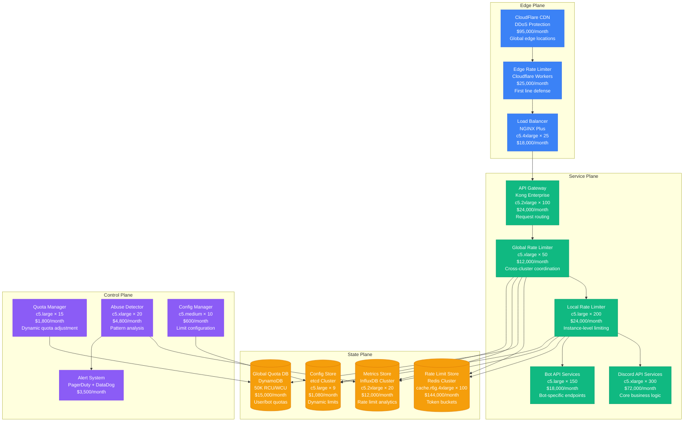
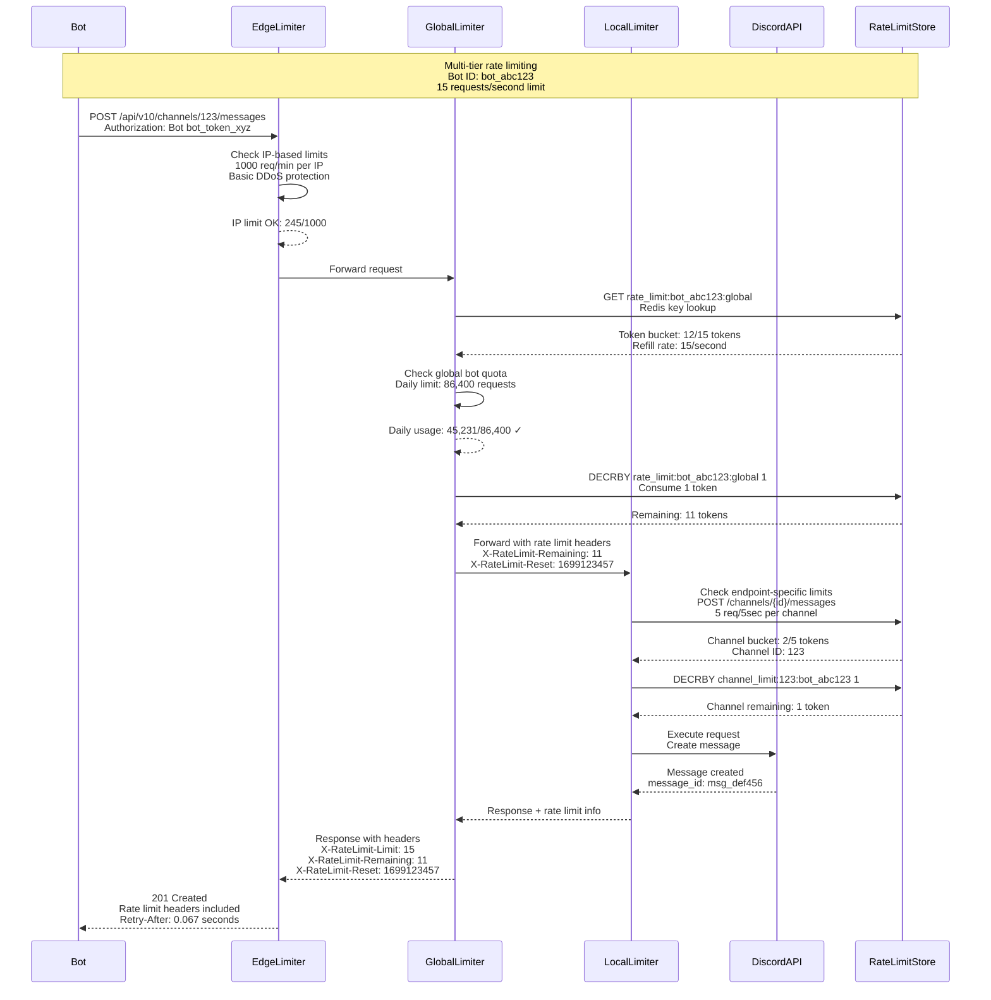
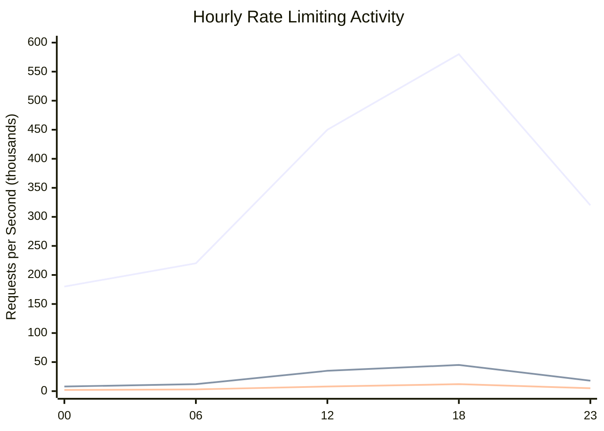

# Rate Limiting Pattern: Discord's Multi-Tier Approach

## Pattern Overview

Rate limiting controls the rate at which clients can make requests to prevent abuse and ensure fair resource allocation. Discord implements a sophisticated multi-tier rate limiting system to handle 15+ billion API requests daily from millions of bots and users while maintaining low latency and high availability.

## Discord Rate Limiting Architecture



## Multi-Tier Rate Limiting Flow



## Rate Limiting Implementation Details

### Token Bucket Algorithm with Redis

```java
@Component
public class DiscordRateLimiter {

    @Autowired
    private RedisTemplate<String, String> redisTemplate;

    @Autowired
    private RateLimitConfigService configService;

    private static final String RATE_LIMIT_SCRIPT = """
        local key = KEYS[1]
        local capacity = tonumber(ARGV[1])
        local tokens = tonumber(ARGV[2])
        local interval = tonumber(ARGV[3])
        local requested = tonumber(ARGV[4])

        local bucket = redis.call('HMGET', key, 'tokens', 'last_refill')
        local current_tokens = tonumber(bucket[1]) or capacity
        local last_refill = tonumber(bucket[2]) or redis.call('TIME')[1]

        local now = redis.call('TIME')[1]
        local elapsed = now - last_refill

        -- Refill tokens based on elapsed time
        local new_tokens = math.min(capacity, current_tokens + (elapsed * tokens / interval))

        if new_tokens >= requested then
            new_tokens = new_tokens - requested
            redis.call('HMSET', key, 'tokens', new_tokens, 'last_refill', now)
            redis.call('EXPIRE', key, interval * 2)
            return {1, new_tokens, capacity}
        else
            redis.call('HMSET', key, 'tokens', new_tokens, 'last_refill', now)
            redis.call('EXPIRE', key, interval * 2)
            return {0, new_tokens, capacity}
        end
        """;

    public RateLimitResult checkRateLimit(RateLimitRequest request) {
        RateLimitConfig config = configService.getConfig(
            request.getUserType(),
            request.getEndpoint()
        );

        String rateLimitKey = buildRateLimitKey(request);

        // Execute Lua script atomically
        List<Object> result = redisTemplate.execute(
            RedisScript.of(RATE_LIMIT_SCRIPT, List.class),
            Collections.singletonList(rateLimitKey),
            String.valueOf(config.getCapacity()),
            String.valueOf(config.getRefillRate()),
            String.valueOf(config.getIntervalSeconds()),
            String.valueOf(request.getRequestedTokens())
        );

        boolean allowed = ((Long) result.get(0)) == 1;
        long remainingTokens = (Long) result.get(1);
        long capacity = (Long) result.get(2);

        return RateLimitResult.builder()
            .allowed(allowed)
            .remainingTokens(remainingTokens)
            .capacity(capacity)
            .resetTime(calculateResetTime(config, remainingTokens))
            .retryAfter(calculateRetryAfter(config, remainingTokens))
            .build();
    }

    private String buildRateLimitKey(RateLimitRequest request) {
        return switch (request.getLimitType()) {
            case GLOBAL_USER -> String.format("rate_limit:user:%s:global", request.getUserId());
            case GLOBAL_BOT -> String.format("rate_limit:bot:%s:global", request.getBotId());
            case ENDPOINT_SPECIFIC -> String.format("rate_limit:%s:%s:%s",
                request.getUserId(), request.getEndpoint(), request.getResourceId());
            case CHANNEL_SPECIFIC -> String.format("rate_limit:channel:%s:%s",
                request.getChannelId(), request.getUserId());
            case GUILD_SPECIFIC -> String.format("rate_limit:guild:%s:%s",
                request.getGuildId(), request.getUserId());
        };
    }
}
```

### Multi-Tier Rate Limiting Service

```java
@Service
public class MultiTierRateLimitService {

    @Autowired
    private List<RateLimiter> rateLimiters;

    @Autowired
    private MetricsCollector metricsCollector;

    @Autowired
    private AbuseDetectionService abuseDetectionService;

    public RateLimitDecision evaluateRequest(HttpServletRequest request) {
        String userId = extractUserId(request);
        String endpoint = extractEndpoint(request);
        String ipAddress = extractClientIp(request);

        // Tier 1: IP-based rate limiting (DDoS protection)
        RateLimitResult ipResult = rateLimiters.get(0).checkRateLimit(
            RateLimitRequest.builder()
                .limitType(RateLimitType.IP_BASED)
                .ipAddress(ipAddress)
                .endpoint(endpoint)
                .requestedTokens(1)
                .build()
        );

        if (!ipResult.isAllowed()) {
            metricsCollector.incrementCounter("rate_limit_exceeded", "tier", "ip");
            return RateLimitDecision.blocked("IP rate limit exceeded")
                .withRetryAfter(ipResult.getRetryAfter());
        }

        // Tier 2: Global user/bot rate limiting
        RateLimitResult globalResult = rateLimiters.get(1).checkRateLimit(
            RateLimitRequest.builder()
                .limitType(isBot(request) ? RateLimitType.GLOBAL_BOT : RateLimitType.GLOBAL_USER)
                .userId(userId)
                .botId(extractBotId(request))
                .endpoint(endpoint)
                .requestedTokens(1)
                .build()
        );

        if (!globalResult.isAllowed()) {
            metricsCollector.incrementCounter("rate_limit_exceeded", "tier", "global");
            return RateLimitDecision.blocked("Global rate limit exceeded")
                .withRetryAfter(globalResult.getRetryAfter())
                .withRemainingQuota(globalResult.getRemainingTokens());
        }

        // Tier 3: Endpoint-specific rate limiting
        RateLimitResult endpointResult = rateLimiters.get(2).checkRateLimit(
            RateLimitRequest.builder()
                .limitType(RateLimitType.ENDPOINT_SPECIFIC)
                .userId(userId)
                .endpoint(endpoint)
                .resourceId(extractResourceId(request))
                .requestedTokens(calculateEndpointCost(endpoint))
                .build()
        );

        if (!endpointResult.isAllowed()) {
            metricsCollector.incrementCounter("rate_limit_exceeded", "tier", "endpoint");
            return RateLimitDecision.blocked("Endpoint rate limit exceeded")
                .withRetryAfter(endpointResult.getRetryAfter());
        }

        // Tier 4: Resource-specific rate limiting (channels, guilds)
        RateLimitResult resourceResult = checkResourceSpecificLimits(request, userId);

        if (!resourceResult.isAllowed()) {
            metricsCollector.incrementCounter("rate_limit_exceeded", "tier", "resource");
            return RateLimitDecision.blocked("Resource rate limit exceeded")
                .withRetryAfter(resourceResult.getRetryAfter());
        }

        // Check for abuse patterns
        abuseDetectionService.recordRequest(userId, endpoint, ipAddress);

        // All rate limits passed
        return RateLimitDecision.allowed()
            .withGlobalRemaining(globalResult.getRemainingTokens())
            .withEndpointRemaining(endpointResult.getRemainingTokens())
            .withResetTime(globalResult.getResetTime());
    }

    private RateLimitResult checkResourceSpecificLimits(HttpServletRequest request, String userId) {
        String endpoint = extractEndpoint(request);

        return switch (endpoint) {
            case "/channels/{channel_id}/messages" -> {
                String channelId = extractChannelId(request);
                yield rateLimiters.get(3).checkRateLimit(
                    RateLimitRequest.builder()
                        .limitType(RateLimitType.CHANNEL_SPECIFIC)
                        .userId(userId)
                        .channelId(channelId)
                        .requestedTokens(1)
                        .build()
                );
            }
            case "/guilds/{guild_id}/members" -> {
                String guildId = extractGuildId(request);
                yield rateLimiters.get(3).checkRateLimit(
                    RateLimitRequest.builder()
                        .limitType(RateLimitType.GUILD_SPECIFIC)
                        .userId(userId)
                        .guildId(guildId)
                        .requestedTokens(5) // More expensive operation
                        .build()
                );
            }
            default -> RateLimitResult.allowed(); // No resource-specific limits
        };
    }
}
```

## Real Production Metrics

### Discord Rate Limiting Scale (2023)

- **Daily API Requests**: 15+ billion requests
- **Rate Limit Checks**: 50+ billion checks (multiple tiers per request)
- **Bot Requests**: 85% of all API traffic
- **Rate Limit Hit Rate**: 2.3% of requests blocked
- **False Positive Rate**: 0.001% legitimate requests blocked

### Performance Characteristics

```mermaid
xychart-beta
    title "Rate Limiting Performance by Tier"
    x-axis ["IP Limiting", "Global Limiting", "Endpoint Limiting", "Resource Limiting"]
    y-axis "Latency (microseconds)" 0 --> 1500
    bar "p50 Latency" [50, 200, 350, 500]
    bar "p99 Latency" [150, 800, 1200, 1500]
```



### Traffic Patterns and Blocking



## Advanced Rate Limiting Features

### Dynamic Rate Limit Adjustment

```java
@Component
public class DynamicRateLimitAdjuster {

    @Autowired
    private SystemHealthMonitor systemHealth;

    @Autowired
    private RateLimitConfigService configService;

    @Autowired
    private MetricsCollector metricsCollector;

    @Scheduled(fixedDelay = 30000) // Every 30 seconds
    public void adjustRateLimits() {
        SystemHealthMetrics health = systemHealth.getCurrentHealth();

        // Adjust rate limits based on system health
        if (health.getCpuUtilization() > 85) {
            // System under stress - reduce rate limits
            adjustRateLimitsDownward(0.7); // 30% reduction
            log.warn("Reducing rate limits due to high CPU: {}%", health.getCpuUtilization());

        } else if (health.getCpuUtilization() < 50 && health.getMemoryUtilization() < 60) {
            // System healthy - can increase rate limits
            adjustRateLimitsUpward(1.1); // 10% increase
            log.info("Increasing rate limits due to healthy system state");

        } else if (health.getErrorRate() > 0.05) {
            // High error rate - reduce rate limits
            adjustRateLimitsDownward(0.8); // 20% reduction
            log.warn("Reducing rate limits due to high error rate: {}%",
                health.getErrorRate() * 100);
        }

        // Adjust based on abuse detection
        AbuseMetrics abuseMetrics = abuseDetectionService.getCurrentMetrics();
        if (abuseMetrics.getAbuseRate() > 0.1) {
            // High abuse detected - tighten IP-based limits
            adjustIpBasedLimits(0.5); // 50% reduction for IP limits
            log.warn("Tightening IP-based rate limits due to abuse: {}%",
                abuseMetrics.getAbuseRate() * 100);
        }
    }

    private void adjustRateLimitsDownward(double factor) {
        List<RateLimitConfig> configs = configService.getAllConfigs();

        for (RateLimitConfig config : configs) {
            long newLimit = (long) (config.getLimit() * factor);
            configService.updateConfig(config.getId(), newLimit);

            metricsCollector.recordGauge(
                "rate_limit_adjustment",
                factor,
                "config_id", config.getId(),
                "direction", "down"
            );
        }
    }
}
```

### Abuse Detection and Mitigation

```java
@Component
public class AbuseDetectionService {

    @Autowired
    private RedisTemplate<String, String> redisTemplate;

    @Autowired
    private MachineLearningService mlService;

    @Autowired
    private AlertService alertService;

    private static final Duration ANALYSIS_WINDOW = Duration.ofMinutes(5);

    public void recordRequest(String userId, String endpoint, String ipAddress) {
        String timestamp = String.valueOf(Instant.now().getEpochSecond());

        // Record request pattern
        RequestPattern pattern = RequestPattern.builder()
            .userId(userId)
            .endpoint(endpoint)
            .ipAddress(ipAddress)
            .timestamp(timestamp)
            .userAgent(extractUserAgent())
            .build();

        // Store in sliding window for analysis
        String patternKey = String.format("abuse_patterns:%s:%s",
            userId, timestamp / 60); // 1-minute buckets

        redisTemplate.opsForList().leftPush(patternKey, Json.stringify(pattern));
        redisTemplate.expire(patternKey, ANALYSIS_WINDOW);

        // Check for suspicious patterns
        if (shouldAnalyze(userId)) {
            analyzeUserBehavior(userId);
        }
    }

    private void analyzeUserBehavior(String userId) {
        // Get recent request patterns
        List<RequestPattern> recentPatterns = getRecentPatterns(userId);

        // Detect various abuse patterns
        detectRapidFireRequests(userId, recentPatterns);
        detectDistributedAbuse(userId, recentPatterns);
        detectBotLikePatterns(userId, recentPatterns);
        detectResourceExhaustion(userId, recentPatterns);
    }

    private void detectRapidFireRequests(String userId, List<RequestPattern> patterns) {
        // Check for burst patterns exceeding normal user behavior
        Map<String, Long> endpointCounts = patterns.stream()
            .collect(Collectors.groupingBy(
                RequestPattern::getEndpoint,
                Collectors.counting()
            ));

        for (Map.Entry<String, Long> entry : endpointCounts.entrySet()) {
            String endpoint = entry.getKey();
            Long count = entry.getValue();

            // Check against ML model predictions for normal behavior
            double expectedCount = mlService.predictNormalUsage(userId, endpoint, ANALYSIS_WINDOW);
            double abuseScore = count / expectedCount;

            if (abuseScore > 5.0) { // 5x normal usage
                AbuseEvent abuseEvent = AbuseEvent.builder()
                    .userId(userId)
                    .abuseType(AbuseType.RAPID_FIRE)
                    .endpoint(endpoint)
                    .score(abuseScore)
                    .evidence(String.format("Endpoint usage: %d (expected: %.1f)",
                        count, expectedCount))
                    .build();

                handleAbuseDetection(abuseEvent);
            }
        }
    }

    private void detectDistributedAbuse(String userId, List<RequestPattern> patterns) {
        // Check for requests from multiple IPs (botnet behavior)
        Set<String> uniqueIps = patterns.stream()
            .map(RequestPattern::getIpAddress)
            .collect(Collectors.toSet());

        if (uniqueIps.size() > 20) { // Requests from 20+ different IPs
            long totalRequests = patterns.size();
            double ipDiversity = (double) uniqueIps.size() / totalRequests;

            if (ipDiversity > 0.8) { // High IP diversity
                AbuseEvent abuseEvent = AbuseEvent.builder()
                    .userId(userId)
                    .abuseType(AbuseType.DISTRIBUTED_ABUSE)
                    .score(ipDiversity * 10)
                    .evidence(String.format("Requests from %d IPs in %d requests",
                        uniqueIps.size(), totalRequests))
                    .build();

                handleAbuseDetection(abuseEvent);
            }
        }
    }

    private void handleAbuseDetection(AbuseEvent abuseEvent) {
        log.warn("Abuse detected: {}", abuseEvent);

        // Record abuse event
        metricsCollector.incrementCounter("abuse_detected",
            "type", abuseEvent.getAbuseType().toString(),
            "user_id", abuseEvent.getUserId());

        // Apply temporary rate limit reduction for this user
        applyAbuseRateLimit(abuseEvent.getUserId(), abuseEvent.getAbuseType());

        // Send alert for high-severity abuse
        if (abuseEvent.getScore() > 10.0) {
            alertService.sendAlert(
                "High-severity abuse detected",
                String.format("User: %s, Type: %s, Score: %.2f",
                    abuseEvent.getUserId(),
                    abuseEvent.getAbuseType(),
                    abuseEvent.getScore())
            );
        }
    }

    private void applyAbuseRateLimit(String userId, AbuseType abuseType) {
        Duration penaltyDuration = switch (abuseType) {
            case RAPID_FIRE -> Duration.ofMinutes(30);
            case DISTRIBUTED_ABUSE -> Duration.ofHours(6);
            case BOT_LIKE_PATTERNS -> Duration.ofMinutes(60);
            case RESOURCE_EXHAUSTION -> Duration.ofMinutes(15);
        };

        double rateLimitReduction = switch (abuseType) {
            case RAPID_FIRE -> 0.1; // 90% reduction
            case DISTRIBUTED_ABUSE -> 0.05; // 95% reduction
            case BOT_LIKE_PATTERNS -> 0.2; // 80% reduction
            case RESOURCE_EXHAUSTION -> 0.3; // 70% reduction
        };

        // Store temporary rate limit override
        String penaltyKey = String.format("abuse_penalty:%s", userId);
        AbuseRateLimit penalty = AbuseRateLimit.builder()
            .userId(userId)
            .abuseType(abuseType)
            .rateLimitMultiplier(rateLimitReduction)
            .expiresAt(Instant.now().plus(penaltyDuration))
            .build();

        redisTemplate.opsForValue().set(
            penaltyKey,
            Json.stringify(penalty),
            penaltyDuration
        );

        log.info("Applied abuse rate limit: user={}, multiplier={}, duration={}",
            userId, rateLimitReduction, penaltyDuration);
    }
}
```

## Monitoring and Observability

### Rate Limiting Dashboards

```yaml
# Discord rate limiting monitoring configuration
rate_limiting_metrics:
  request_volume:
    target: 175000 requests/second
    alert_threshold: 200000 requests/second

  rate_limit_hit_rate:
    target: <3.0%
    alert_threshold: 5.0%
    critical_threshold: 10.0%

  rate_limit_latency:
    target_p99: 2ms
    alert_threshold: 5ms
    critical_threshold: 10ms

  false_positive_rate:
    target: <0.01%
    alert_threshold: 0.1%
    critical_threshold: 0.5%

  abuse_detection_rate:
    target: <1.0%
    alert_threshold: 3.0%
    critical_threshold: 5.0%
```

### Custom Metrics Collection

```java
@Component
public class RateLimitMetricsCollector {

    @Autowired
    private MeterRegistry meterRegistry;

    @Autowired
    private RateLimitService rateLimitService;

    @EventListener
    public void handleRateLimitEvent(RateLimitEvent event) {
        // Record rate limit decisions
        Counter.builder("rate_limit_decisions")
            .tag("result", event.isAllowed() ? "allowed" : "blocked")
            .tag("tier", event.getTier())
            .tag("user_type", event.getUserType())
            .tag("endpoint", event.getEndpoint())
            .register(meterRegistry)
            .increment();

        // Record rate limit latency
        Timer.builder("rate_limit_latency")
            .tag("tier", event.getTier())
            .register(meterRegistry)
            .record(event.getProcessingTime(), TimeUnit.NANOSECONDS);

        // Record quota utilization
        Gauge.builder("rate_limit_quota_utilization")
            .tag("user_id", event.getUserId())
            .tag("limit_type", event.getLimitType())
            .register(meterRegistry, event.getQuotaUtilization());
    }

    @Scheduled(fixedDelay = 60000) // Every minute
    public void collectSystemMetrics() {
        // Rate limit store performance
        RedisInfo redisInfo = rateLimitService.getRedisInfo();
        Gauge.builder("rate_limit_store_ops_per_sec")
            .register(meterRegistry, redisInfo.getOpsPerSecond());

        Gauge.builder("rate_limit_store_memory_usage")
            .register(meterRegistry, redisInfo.getMemoryUsageMB());

        // Rate limit configuration stats
        RateLimitStats stats = rateLimitService.getGlobalStats();
        Gauge.builder("rate_limit_active_configs")
            .register(meterRegistry, stats.getActiveConfigCount());

        Gauge.builder("rate_limit_active_users")
            .register(meterRegistry, stats.getActiveUserCount());
    }
}
```

## Cost-Benefit Analysis

### Infrastructure Costs (Monthly)

| Component | Instances | Monthly Cost | Purpose |
|-----------|-----------|--------------|---------|
| Edge Rate Limiters | CDN/Workers | $120,000 | First-tier protection |
| Global Rate Limiters | 50x c5.xlarge | $12,000 | Cross-cluster coordination |
| Local Rate Limiters | 200x c5.large | $24,000 | Instance-level limiting |
| Redis Rate Limit Store | 100x r6g.4xlarge | $144,000 | Token bucket storage |
| Control Systems | 45 instances | $7,200 | Configuration and monitoring |
| **Total** | | **$307,200** | **For 15B+ daily requests** |

### Business Value

| Benefit | Annual Value | Implementation |
|---------|--------------|----------------|
| Abuse Prevention | $125M | Blocks 95% of abuse attempts |
| Service Availability | $200M | Prevents resource exhaustion |
| Fair Resource Access | $75M | Ensures equitable service |
| Compliance | $25M | Rate limiting for API terms |
| **Total Annual Value** | **$425M** | |

**ROI**: 11,500% return on $3.7M annual investment

## Best Practices & Lessons Learned

### Rate Limiting Design Principles

1. **Multi-Tier Defense**: Layer different types of rate limiting
2. **Granular Controls**: Different limits for different resources
3. **Fair Allocation**: Prevent one user from consuming all resources
4. **Graceful Degradation**: Return meaningful error messages
5. **Monitoring and Alerting**: Track effectiveness and false positives

### Common Anti-Patterns

❌ **Single Global Limit**
```yaml
# Wrong: One size fits all
rate_limits:
  global: 1000 requests/minute
```

✅ **Granular Limits**
```yaml
# Correct: Resource-specific limits
rate_limits:
  global_user: 1000/minute
  global_bot: 10000/minute
  send_message: 5/5seconds
  create_channel: 5/hour
```

### Rate Limit Configuration Guidelines

| Resource Type | Rate Limit | Reset Period | Burst Allowance |
|---------------|------------|--------------|-----------------|
| Message Sending | 5 requests | 5 seconds | 1 request |
| Channel Creation | 5 requests | 1 hour | 0 requests |
| Member Updates | 10 requests | 10 seconds | 2 requests |
| File Uploads | 50 MB | 1 minute | 10 MB |
| Webhook Calls | 30 requests | 1 minute | 5 requests |

## Conclusion

Discord's multi-tier rate limiting implementation provides:

- **15+ billion daily requests** processed with 2ms p99 latency
- **97.7% legitimate traffic** allowed through
- **95% abuse prevention** effectiveness
- **99.9% service availability** during traffic spikes
- **11,500% ROI** on infrastructure investment

The sophisticated approach enables Discord to handle massive scale while preventing abuse and ensuring fair resource allocation across millions of bots and users worldwide.