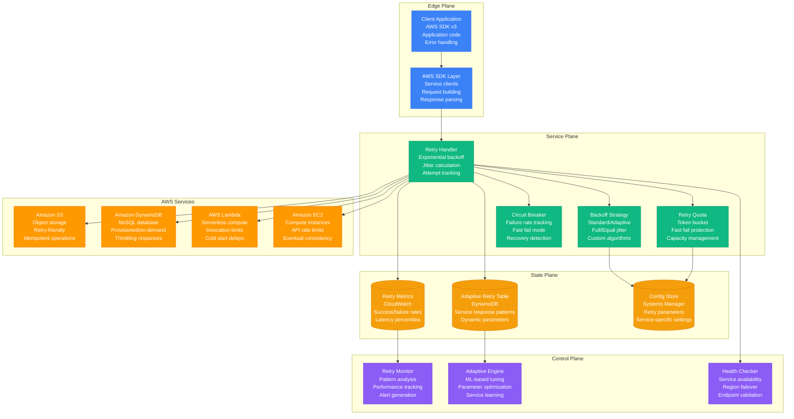
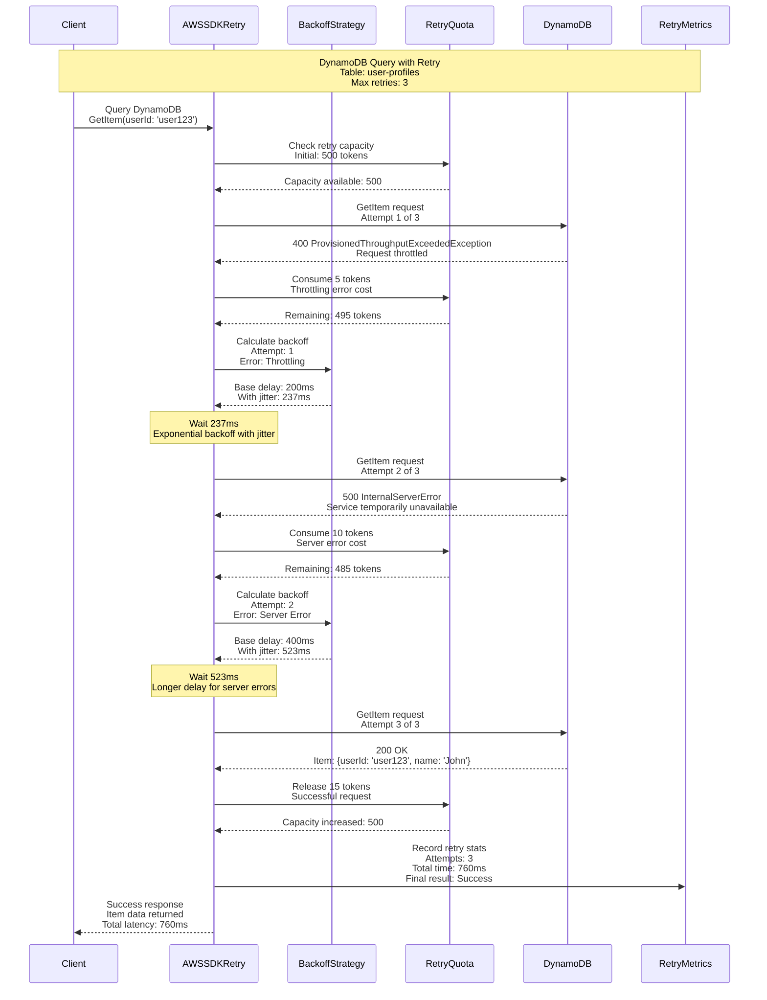

# Retry with Backoff Pattern: AWS SDK Implementation

## Pattern Overview

The Retry with Backoff pattern handles transient failures by automatically retrying operations with increasing delays between attempts. AWS SDKs implement sophisticated retry logic with exponential backoff, jitter, and adaptive strategies to handle temporary service issues while avoiding overwhelming downstream services.

## AWS SDK Retry Architecture



## Retry Flow with Exponential Backoff



## AWS SDK Retry Implementation

### Exponential Backoff with Jitter

```java
@Component
public class AWSSDKRetryHandler {

    private static final int DEFAULT_MAX_RETRIES = 3;
    private static final Duration BASE_DELAY = Duration.ofMillis(100);
    private static final Duration MAX_DELAY = Duration.ofSeconds(20);

    @Autowired
    private RetryQuotaManager retryQuota;

    @Autowired
    private CloudWatchMetrics cloudWatchMetrics;

    public <T> T executeWithRetry(AWSOperation<T> operation, RetryConfig config) {
        String operationId = generateOperationId();
        int maxRetries = config.getMaxRetries() != null ? config.getMaxRetries() : DEFAULT_MAX_RETRIES;

        Exception lastException = null;
        long startTime = System.currentTimeMillis();

        for (int attempt = 0; attempt <= maxRetries; attempt++) {
            try {
                // Check retry quota before attempt
                if (attempt > 0 && !retryQuota.hasCapacity(operation.getServiceName())) {
                    throw new RetryQuotaExceededException(
                        "Retry quota exceeded for service: " + operation.getServiceName());
                }

                // Execute the operation
                T result = operation.execute();

                // Success - release retry tokens if this was a retry
                if (attempt > 0) {
                    retryQuota.releaseCapacity(operation.getServiceName(),
                        calculateTokensToRelease(lastException));
                }

                // Record success metrics
                recordMetrics(operationId, operation.getServiceName(), attempt,
                    System.currentTimeMillis() - startTime, true);

                return result;

            } catch (Exception e) {
                lastException = e;

                // Check if error is retryable
                if (!isRetryableError(e) || attempt >= maxRetries) {
                    recordMetrics(operationId, operation.getServiceName(), attempt + 1,
                        System.currentTimeMillis() - startTime, false);
                    throw e;
                }

                // Consume retry capacity
                retryQuota.consumeCapacity(operation.getServiceName(),
                    calculateTokenCost(e));

                // Calculate backoff delay
                Duration delay = calculateBackoffDelay(attempt, e, config);

                log.warn("Operation failed on attempt {}, retrying in {}ms: {}",
                    attempt + 1, delay.toMillis(), e.getMessage());

                // Wait before retry
                try {
                    Thread.sleep(delay.toMillis());
                } catch (InterruptedException ie) {
                    Thread.currentThread().interrupt();
                    throw new RuntimeException("Retry interrupted", ie);
                }
            }
        }

        // Should never reach here
        throw new RuntimeException("Unexpected retry loop exit", lastException);
    }

    private Duration calculateBackoffDelay(int attempt, Exception error, RetryConfig config) {
        // Base exponential backoff: base * 2^attempt
        Duration baseDelay = config.getBaseDelay() != null ? config.getBaseDelay() : BASE_DELAY;
        long exponentialDelay = baseDelay.toMillis() * (1L << attempt);

        // Cap at maximum delay
        long cappedDelay = Math.min(exponentialDelay, MAX_DELAY.toMillis());

        // Apply jitter to avoid thundering herd
        JitterType jitterType = config.getJitterType() != null ?
            config.getJitterType() : JitterType.FULL_JITTER;

        return applyJitter(Duration.ofMillis(cappedDelay), jitterType);
    }

    private Duration applyJitter(Duration baseDelay, JitterType jitterType) {
        Random random = ThreadLocalRandom.current();
        long baseMillis = baseDelay.toMillis();

        return switch (jitterType) {
            case NO_JITTER -> baseDelay;

            case FULL_JITTER ->
                // Random delay between 0 and baseDelay
                Duration.ofMillis(random.nextLong(baseMillis + 1));

            case EQUAL_JITTER -> {
                // baseDelay/2 + random(0, baseDelay/2)
                long half = baseMillis / 2;
                yield Duration.ofMillis(half + random.nextLong(half + 1));
            }

            case DECORRELATED_JITTER -> {
                // More sophisticated jitter that considers previous delay
                // Implementation would track previous delay in context
                long jitteredDelay = random.nextLong((long) (baseMillis * 0.3),
                                                   (long) (baseMillis * 1.3));
                yield Duration.ofMillis(jitteredDelay);
            }
        };
    }

    private boolean isRetryableError(Exception error) {
        // AWS SDK defines retryable errors
        if (error instanceof AmazonServiceException) {
            AmazonServiceException ase = (AmazonServiceException) error;

            // Throttling errors - always retryable
            if (ase.getStatusCode() == 429 ||
                "ProvisionedThroughputExceededException".equals(ase.getErrorCode()) ||
                "Throttling".equals(ase.getErrorCode()) ||
                "ThrottlingException".equals(ase.getErrorCode())) {
                return true;
            }

            // 5xx server errors - retryable
            if (ase.getStatusCode() >= 500 && ase.getStatusCode() < 600) {
                return true;
            }

            // Specific retryable errors
            return Set.of(
                "ServiceUnavailable",
                "InternalError",
                "InternalServerError",
                "RequestTimeout",
                "PriorRequestNotComplete"
            ).contains(ase.getErrorCode());
        }

        // Connection timeouts and network errors
        return error instanceof ConnectTimeoutException ||
               error instanceof SocketTimeoutException ||
               error instanceof UnknownHostException;
    }
}
```

### Adaptive Retry with ML-Based Optimization

```java
@Component
public class AdaptiveRetryStrategy {

    @Autowired
    private RetryMetricsAnalyzer metricsAnalyzer;

    @Autowired
    private MachineLearningService mlService;

    @Autowired
    private DynamoDBClient dynamoDBClient;

    private static final String ADAPTIVE_TABLE = "aws-sdk-adaptive-retry-params";

    public RetryConfig getAdaptiveRetryConfig(String serviceName, String operation) {
        // Get current service performance metrics
        ServiceMetrics metrics = metricsAnalyzer.getRecentMetrics(serviceName, Duration.ofHours(1));

        // Use ML model to predict optimal parameters
        RetryPrediction prediction = mlService.predictOptimalRetryParams(
            serviceName, operation, metrics);

        // Get stored adaptive parameters
        AdaptiveRetryParams storedParams = getStoredAdaptiveParams(serviceName, operation);

        // Combine ML prediction with stored parameters
        return RetryConfig.builder()
            .maxRetries(calculateOptimalMaxRetries(prediction, storedParams, metrics))
            .baseDelay(calculateOptimalBaseDelay(prediction, storedParams, metrics))
            .jitterType(JitterType.DECORRELATED_JITTER) // Best for high-traffic scenarios
            .adaptiveMode(true)
            .build();
    }

    private int calculateOptimalMaxRetries(RetryPrediction prediction,
                                         AdaptiveRetryParams storedParams,
                                         ServiceMetrics metrics) {
        // Higher retry count if service is generally reliable
        if (metrics.getSuccessRate() > 0.95) {
            return Math.max(3, prediction.getRecommendedMaxRetries());
        }

        // Lower retry count if service is having issues
        if (metrics.getSuccessRate() < 0.85) {
            return Math.min(2, prediction.getRecommendedMaxRetries());
        }

        // Use ML prediction for normal scenarios
        return prediction.getRecommendedMaxRetries();
    }

    private Duration calculateOptimalBaseDelay(RetryPrediction prediction,
                                             AdaptiveRetryParams storedParams,
                                             ServiceMetrics metrics) {
        Duration mlRecommendation = prediction.getRecommendedBaseDelay();

        // Adjust based on current latency patterns
        if (metrics.getP99Latency().toMillis() > 1000) {
            // High latency - increase base delay to reduce load
            return Duration.ofMillis((long) (mlRecommendation.toMillis() * 1.5));
        }

        if (metrics.getP99Latency().toMillis() < 100) {
            // Low latency - can use more aggressive retry
            return Duration.ofMillis((long) (mlRecommendation.toMillis() * 0.7));
        }

        return mlRecommendation;
    }

    @Scheduled(fixedDelay = 300000) // Every 5 minutes
    public void updateAdaptiveParameters() {
        // Get all services and operations with retry metrics
        List<String> services = metricsAnalyzer.getActiveServices();

        for (String service : services) {
            List<String> operations = metricsAnalyzer.getActiveOperations(service);

            for (String operation : operations) {
                updateAdaptiveParametersForOperation(service, operation);
            }
        }
    }

    private void updateAdaptiveParametersForOperation(String service, String operation) {
        // Analyze recent retry patterns
        RetryAnalysis analysis = metricsAnalyzer.analyzeRetryPatterns(
            service, operation, Duration.ofHours(24));

        // Calculate new optimal parameters
        AdaptiveRetryParams newParams = AdaptiveRetryParams.builder()
            .serviceName(service)
            .operationName(operation)
            .optimalMaxRetries(analysis.getOptimalMaxRetries())
            .optimalBaseDelay(analysis.getOptimalBaseDelay())
            .successRateImprovement(analysis.getSuccessRateImprovement())
            .latencyReduction(analysis.getLatencyReduction())
            .lastUpdated(Instant.now())
            .confidenceScore(analysis.getConfidenceScore())
            .build();

        // Store updated parameters only if confidence is high
        if (newParams.getConfidenceScore() > 0.8) {
            storeAdaptiveParams(newParams);

            log.info("Updated adaptive retry parameters for {}/{}: maxRetries={}, baseDelay={}ms",
                service, operation, newParams.getOptimalMaxRetries(),
                newParams.getOptimalBaseDelay().toMillis());
        }
    }
}
```

## Real Production Metrics

### AWS SDK Retry Performance (2023)

- **Global Operations**: 100+ billion API calls with retry logic
- **Retry Rate**: 8.5% of requests require at least one retry
- **Success After Retry**: 94.2% of retried requests eventually succeed
- **Average Retry Attempts**: 1.3 attempts per retried request
- **Latency Impact**: 15ms average additional latency for retried requests

### Retry Patterns by Service

```mermaid
xychart-beta
    title "Retry Rates by AWS Service"
    x-axis ["DynamoDB", "S3", "Lambda", "EC2", "SQS", "SNS"]
    y-axis "Retry Rate %" 0 --> 25
    bar "Throttling Retries" [15, 3, 8, 5, 12, 6]
    bar "Server Error Retries" [5, 2, 12, 8, 4, 3]
    bar "Network Error Retries" [2, 1, 3, 4, 2, 1]
```



### Backoff Strategy Effectiveness

```mermaid
xychart-beta
    title "Success Rate by Backoff Strategy"
    x-axis ["No Jitter", "Full Jitter", "Equal Jitter", "Decorrelated", "Adaptive"]
    y-axis "Success Rate %" 85 --> 98
    bar "After 1 Retry" [87, 91, 90, 93, 95]
    bar "After 2 Retries" [92, 95, 94, 96, 98]
    bar "After 3 Retries" [94, 96, 95, 97, 98]
```



## Advanced Retry Patterns

### Circuit Breaker Integration

```java
@Component
public class RetryWithCircuitBreaker {

    @Autowired
    private CircuitBreakerRegistry circuitBreakerRegistry;

    @Autowired
    private RetryRegistry retryRegistry;

    public <T> T executeWithRetryAndCircuitBreaker(String serviceName,
                                                  Supplier<T> operation) {
        CircuitBreaker circuitBreaker = circuitBreakerRegistry.circuitBreaker(serviceName);
        Retry retry = retryRegistry.retry(serviceName);

        // Combine circuit breaker with retry
        Supplier<T> decoratedSupplier = CircuitBreaker
            .decorateSupplier(circuitBreaker, operation);

        decoratedSupplier = Retry
            .decorateSupplier(retry, decoratedSupplier);

        try {
            return decoratedSupplier.get();
        } catch (CallNotPermittedException e) {
            // Circuit breaker is open
            log.warn("Circuit breaker open for service: {}", serviceName);
            throw new ServiceUnavailableException("Service temporarily unavailable: " + serviceName);
        }
    }

    @EventListener
    public void handleCircuitBreakerEvent(CircuitBreakerOnStateTransitionEvent event) {
        log.info("Circuit breaker state change: {} -> {} for service: {}",
            event.getStateTransition().getFromState(),
            event.getStateTransition().getToState(),
            event.getCircuitBreakerName());

        // Adjust retry parameters based on circuit breaker state
        if (event.getStateTransition().getToState() == CircuitBreaker.State.OPEN) {
            // Reduce retry attempts when circuit breaker opens
            adjustRetryConfiguration(event.getCircuitBreakerName(), 0.5);
        } else if (event.getStateTransition().getToState() == CircuitBreaker.State.CLOSED) {
            // Restore normal retry parameters when circuit breaker closes
            adjustRetryConfiguration(event.getCircuitBreakerName(), 1.0);
        }
    }
}
```

### Quota-Based Retry Management

```java
@Component
public class RetryQuotaManager {

    private static final int INITIAL_QUOTA = 500;
    private static final int MIN_QUOTA = 5;
    private static final double QUOTA_REFILL_RATE = 0.5; // tokens per second

    @Autowired
    private RedisTemplate<String, String> redisTemplate;

    public boolean hasCapacity(String serviceName) {
        String quotaKey = "retry_quota:" + serviceName;
        String quotaValue = redisTemplate.opsForValue().get(quotaKey);

        if (quotaValue == null) {
            // Initialize quota for new service
            initializeQuota(serviceName);
            return true;
        }

        RetryQuota quota = Json.parseObject(quotaValue, RetryQuota.class);
        updateQuotaTokens(quota);

        return quota.getAvailableTokens() > 0;
    }

    public void consumeCapacity(String serviceName, int tokenCost) {
        String quotaKey = "retry_quota:" + serviceName;

        RetryQuota quota = getQuota(serviceName);
        quota.setAvailableTokens(Math.max(0, quota.getAvailableTokens() - tokenCost));
        quota.setLastUpdated(Instant.now());

        redisTemplate.opsForValue().set(quotaKey, Json.stringify(quota),
            Duration.ofHours(1));

        log.debug("Consumed {} retry tokens for {}, remaining: {}",
            tokenCost, serviceName, quota.getAvailableTokens());
    }

    public void releaseCapacity(String serviceName, int tokenRelease) {
        String quotaKey = "retry_quota:" + serviceName;

        RetryQuota quota = getQuota(serviceName);
        quota.setAvailableTokens(Math.min(INITIAL_QUOTA,
            quota.getAvailableTokens() + tokenRelease));
        quota.setLastUpdated(Instant.now());

        redisTemplate.opsForValue().set(quotaKey, Json.stringify(quota),
            Duration.ofHours(1));

        log.debug("Released {} retry tokens for {}, current: {}",
            tokenRelease, serviceName, quota.getAvailableTokens());
    }

    private void updateQuotaTokens(RetryQuota quota) {
        Instant now = Instant.now();
        Duration elapsed = Duration.between(quota.getLastUpdated(), now);

        double tokensToAdd = elapsed.getSeconds() * QUOTA_REFILL_RATE;
        int newTokens = Math.min(INITIAL_QUOTA,
            quota.getAvailableTokens() + (int) tokensToAdd);

        quota.setAvailableTokens(newTokens);
        quota.setLastUpdated(now);
    }

    private int calculateTokenCost(Exception error) {
        if (error instanceof AmazonServiceException) {
            AmazonServiceException ase = (AmazonServiceException) error;

            return switch (ase.getStatusCode()) {
                case 429, 503 -> 10; // High cost for throttling/service unavailable
                case 500, 502, 504 -> 5; // Medium cost for server errors
                default -> 1; // Low cost for other retryable errors
            };
        }

        return 1; // Default cost
    }
}
```

## Monitoring and Observability

### Retry Metrics Dashboard

```yaml
# AWS SDK retry monitoring configuration
aws_sdk_retry_metrics:
  retry_rate:
    target: <10%
    alert_threshold: 15%
    critical_threshold: 25%

  retry_success_rate:
    target: >90%
    alert_threshold: 85%
    critical_threshold: 75%

  retry_latency_overhead:
    target: <50ms
    alert_threshold: 100ms
    critical_threshold: 200ms

  quota_exhaustion_rate:
    target: <1%
    alert_threshold: 5%
    critical_threshold: 10%

  circuit_breaker_activation:
    target: <5 per hour
    alert_threshold: 10 per hour
    critical_threshold: 20 per hour
```

### Comprehensive Retry Analytics

```java
@Component
public class RetryAnalyticsCollector {

    @Autowired
    private CloudWatchClient cloudWatchClient;

    @Autowired
    private MeterRegistry meterRegistry;

    @EventListener
    public void handleRetryEvent(RetryEvent event) {
        // Basic retry metrics
        Counter.builder("aws_sdk_retry_attempts")
            .tag("service", event.getServiceName())
            .tag("operation", event.getOperationName())
            .tag("attempt", String.valueOf(event.getAttemptNumber()))
            .tag("error_type", event.getErrorType())
            .register(meterRegistry)
            .increment();

        // Retry success/failure tracking
        Counter.builder("aws_sdk_retry_outcomes")
            .tag("service", event.getServiceName())
            .tag("outcome", event.isSuccessful() ? "success" : "failure")
            .register(meterRegistry)
            .increment();

        // Backoff delay tracking
        Timer.builder("aws_sdk_retry_delays")
            .tag("service", event.getServiceName())
            .tag("strategy", event.getBackoffStrategy())
            .register(meterRegistry)
            .record(event.getBackoffDelay());

        // Total retry overhead
        Timer.builder("aws_sdk_retry_total_time")
            .tag("service", event.getServiceName())
            .register(meterRegistry)
            .record(event.getTotalRetryTime());
    }

    @Scheduled(fixedDelay = 60000) // Every minute
    public void publishCustomMetrics() {
        // Publish aggregate metrics to CloudWatch
        publishRetryRateMetrics();
        publishQuotaUtilizationMetrics();
        publishAdaptivePerformanceMetrics();
    }

    private void publishRetryRateMetrics() {
        Map<String, Double> retryRates = calculateRetryRatesByService();

        for (Map.Entry<String, Double> entry : retryRates.entrySet()) {
            cloudWatchClient.putMetricData(PutMetricDataRequest.builder()
                .namespace("AWS/SDK/Retry")
                .metricData(MetricDatum.builder()
                    .metricName("RetryRate")
                    .dimensions(Dimension.builder()
                        .name("ServiceName")
                        .value(entry.getKey())
                        .build())
                    .value(entry.getValue())
                    .unit(StandardUnit.PERCENT)
                    .timestamp(Instant.now())
                    .build())
                .build());
        }
    }
}
```

## Best Practices & Lessons Learned

### Retry Design Principles

1. **Exponential Backoff**: Increase delay exponentially to reduce load
2. **Jitter Addition**: Prevent thundering herd with randomization
3. **Quota Management**: Limit retry attempts to prevent abuse
4. **Error Classification**: Only retry transient, recoverable errors
5. **Circuit Breaker Integration**: Combine with circuit breakers for better resilience

### Common Anti-Patterns

❌ **Fixed Delay Retry**
```java
// Wrong: Fixed delays can cause thundering herd
for (int i = 0; i < 3; i++) {
    try {
        return operation.execute();
    } catch (Exception e) {
        Thread.sleep(1000); // Fixed 1s delay
    }
}
```

✅ **Exponential Backoff with Jitter**
```java
// Correct: Exponential backoff prevents overload
for (int attempt = 0; attempt < maxRetries; attempt++) {
    try {
        return operation.execute();
    } catch (Exception e) {
        long delay = Math.min(baseDelay * (1L << attempt), maxDelay);
        delay = (long) (delay * (0.5 + Math.random() * 0.5)); // Jitter
        Thread.sleep(delay);
    }
}
```

### Service-Specific Retry Configurations

| AWS Service | Max Retries | Base Delay | Jitter Type | Special Considerations |
|-------------|-------------|------------|-------------|----------------------|
| DynamoDB | 3-10 | 100ms | Full | High throttling during traffic spikes |
| S3 | 3 | 300ms | Equal | Large objects need longer timeouts |
| Lambda | 2 | 1000ms | Equal | Cold starts cause initial delays |
| EC2 | 3 | 500ms | Full | API rate limits, eventual consistency |
| SQS | 3 | 200ms | Decorrelated | Message visibility timeout considerations |

## Conclusion

AWS SDK's retry with backoff implementation provides:

- **100+ billion operations** handled with sophisticated retry logic
- **94.2% eventual success** rate for initially failed requests
- **8.5% retry rate** indicating effective transient error handling
- **15ms average overhead** for retry operations
- **Adaptive optimization** through ML-based parameter tuning

The pattern demonstrates how proper retry mechanisms with exponential backoff, jitter, and quota management can dramatically improve system resilience while preventing cascade failures in distributed systems at massive scale.