# Saga Pattern for Distributed Transactions - Production Implementation

## Pattern Overview

The Saga pattern manages long-running business processes that span multiple microservices without requiring distributed ACID transactions. This implementation shows how companies like Uber, Airbnb, and Amazon handle complex multi-step workflows with compensating actions for failure recovery.

**Key Characteristics**:
- **No Global ACID**: Each step is a local transaction
- **Compensating Actions**: Undo operations for rollback
- **Eventual Consistency**: Business process eventually reaches consistent state
- **Failure Isolation**: Failed steps don't block entire system

**Implementation Styles**:
- **Orchestration**: Central coordinator manages the saga
- **Choreography**: Services coordinate through events

## E-commerce Order Saga - Production Architecture

```mermaid
graph TB
    subgraph EdgePlane[Edge Plane - Customer Interface]
        CustomerApp[Customer Mobile App<br/>React Native 0.72<br/>Offline capability<br/>Order tracking UI<br/>Real-time updates]

        WebApp[Web Application<br/>Next.js 13.5<br/>Server-side rendering<br/>Progressive enhancement<br/>WebSocket connections]

        APIGateway[API Gateway<br/>Kong Enterprise 3.4<br/>Saga correlation ID<br/>Request routing<br/>Rate limiting: 1K req/min]

        LoadBalancer[Load Balancer<br/>AWS ALB<br/>Health checks<br/>Request distribution<br/>SSL termination]
    end

    subgraph ServicePlane[Service Plane - Saga Orchestration]
        subgraph SagaOrchestrator[Saga Orchestrator Layer]
            OrderSagaManager[Order Saga Manager<br/>Java 17 + Spring Boot 3.1<br/>Temporal.io workflow<br/>State persistence<br/>Compensation logic]

            SagaStateManager[Saga State Manager<br/>Redis Cluster 7.2<br/>Saga execution state<br/>Step completion tracking<br/>Timeout management]

            CompensationEngine[Compensation Engine<br/>Kotlin + Spring<br/>Rollback orchestration<br/>Partial failure handling<br/>Retry mechanisms]
        end

        subgraph BusinessServices[Business Services - Saga Participants]
            InventoryService[Inventory Service<br/>Go 1.21 + Fiber<br/>Stock reservation<br/>Compensation: release stock<br/>Timeout: 30 minutes]

            PaymentService[Payment Service<br/>Java 17 + Quarkus<br/>Payment authorization<br/>Compensation: refund<br/>PCI DSS compliant]

            ShippingService[Shipping Service<br/>Python 3.11 + FastAPI<br/>Shipping arrangement<br/>Compensation: cancel shipment<br/>Carrier integration]

            NotificationService[Notification Service<br/>Node.js 18 + Express<br/>Customer notifications<br/>Compensation: send cancellation<br/>Multi-channel support]

            LoyaltyService[Loyalty Service<br/>Scala 2.13 + Akka<br/>Points calculation<br/>Compensation: reverse points<br/>Async processing]
        end

        subgraph SagaCoordination[Saga Coordination Services]
            EventBus[Event Bus<br/>Apache Kafka 3.5<br/>Saga events<br/>Exactly-once delivery<br/>Event sourcing]

            SagaRegistry[Saga Registry<br/>Service discovery<br/>Health monitoring<br/>Circuit breaker integration<br/>Load balancing]

            TimeoutManager[Timeout Manager<br/>Saga timeouts<br/>Step deadlines<br/>Escalation policies<br/>Manual intervention]
        end
    end

    subgraph StatePlane[State Plane - Data & Event Storage]
        subgraph SagaStateStorage[Saga State Storage]
            SagaDB[Saga Database<br/>PostgreSQL 15.4<br/>Saga execution logs<br/>Step completion status<br/>Compensation history]

            EventStore[Event Store<br/>EventStoreDB 23.6<br/>Saga events<br/>Command/event log<br/>Replay capability]

            StateSnapshot[State Snapshots<br/>MongoDB 7.0<br/>Saga checkpoints<br/>Recovery points<br/>Performance optimization]
        end

        subgraph BusinessDataStores[Business Data Stores]
            InventoryDB[Inventory Database<br/>PostgreSQL 15.4<br/>Stock levels<br/>Reservations<br/>ACID transactions]

            PaymentDB[Payment Database<br/>PostgreSQL 15.4 (encrypted)<br/>Payment records<br/>Transaction history<br/>PCI compliance]

            OrderDB[Order Database<br/>MySQL 8.0.34<br/>Order details<br/>Customer information<br/>Sharding by customer]

            ShippingDB[Shipping Database<br/>MongoDB 7.0<br/>Shipment tracking<br/>Carrier information<br/>Document storage]
        end

        subgraph CacheComputeLayer[Cache & Compute Layer]
            RedisCluster[Redis Cluster 7.2<br/>Saga state cache<br/>Session management<br/>Real-time updates<br/>TTL: 1 hour]

            MemoryGrid[Hazelcast 5.3<br/>Distributed computing<br/>Saga coordination<br/>In-memory processing<br/>Fault tolerance]

            ProcessingQueue[Processing Queue<br/>AWS SQS FIFO<br/>Async saga steps<br/>Dead letter queues<br/>Visibility timeout: 30s]
        end

        subgraph ExternalIntegrations[External Service Integrations]
            PaymentGateway[Payment Gateway<br/>Stripe API v2023-08-16<br/>Authorization/capture<br/>Webhook callbacks<br/>Idempotency keys]

            ShippingCarriers[Shipping Carriers<br/>FedEx/UPS/DHL APIs<br/>Label generation<br/>Tracking updates<br/>Rate calculations]

            EmailProvider[Email Provider<br/>SendGrid v3 API<br/>Transactional emails<br/>Template management<br/>Delivery tracking]

            SMSProvider[SMS Provider<br/>Twilio API<br/>Order notifications<br/>Delivery updates<br/>Two-way messaging]
        end
    end

    subgraph ControlPlane[Control Plane - Monitoring & Management]
        subgraph SagaMonitoring[Saga Monitoring & Observability]
            SagaDashboard[Saga Dashboard<br/>Grafana 10.1<br/>Saga execution metrics<br/>Success/failure rates<br/>Compensation tracking]

            SagaTracing[Distributed Tracing<br/>Jaeger 1.49<br/>Saga step tracing<br/>Cross-service correlation<br/>Performance analysis]

            SagaMetrics[Saga Metrics<br/>Prometheus 2.46<br/>Custom saga metrics<br/>SLA monitoring<br/>Alert generation]
        end

        subgraph SagaManagement[Saga Management & Operations]
            SagaAdmin[Saga Admin Interface<br/>React Admin<br/>Manual intervention<br/>Saga state inspection<br/>Compensation triggers]

            WorkflowEngine[Workflow Engine<br/>Temporal.io<br/>Saga definitions<br/>Version management<br/>A/B testing]

            SagaDebugger[Saga Debugger<br/>Step-by-step execution<br/>State inspection<br/>Event replay<br/>Compensation simulation]
        end

        subgraph IncidentResponse[Incident Response & Recovery]
            AlertManager[Alert Manager<br/>Prometheus AlertManager<br/>Saga failure alerts<br/>Escalation policies<br/>Integration hooks]

            IncidentManagement[Incident Management<br/>PagerDuty<br/>On-call rotation<br/>Automated remediation<br/>Post-mortem tracking]

            RecoveryTools[Recovery Tools<br/>Custom tooling<br/>Saga replay<br/>State correction<br/>Bulk operations]
        end
    end

    %% Customer Interaction Flow
    CustomerApp --> LoadBalancer
    WebApp --> APIGateway
    LoadBalancer --> OrderSagaManager
    APIGateway --> OrderSagaManager

    %% Saga Orchestration Flow
    OrderSagaManager --> SagaStateManager
    OrderSagaManager --> CompensationEngine
    OrderSagaManager --> EventBus

    %% Business Service Coordination
    OrderSagaManager --> InventoryService
    OrderSagaManager --> PaymentService
    OrderSagaManager --> ShippingService
    OrderSagaManager --> NotificationService
    OrderSagaManager --> LoyaltyService

    %% Saga Infrastructure
    SagaStateManager --> SagaRegistry
    CompensationEngine --> TimeoutManager
    EventBus --> SagaRegistry

    %% Data Persistence
    OrderSagaManager --> SagaDB
    SagaStateManager --> EventStore
    CompensationEngine --> StateSnapshot

    %% Business Data Access
    InventoryService --> InventoryDB
    PaymentService --> PaymentDB
    OrderSagaManager --> OrderDB
    ShippingService --> ShippingDB

    %% Cache and Performance
    SagaStateManager --> RedisCluster
    OrderSagaManager --> MemoryGrid
    CompensationEngine --> ProcessingQueue

    %% External Service Integration
    PaymentService --> PaymentGateway
    ShippingService --> ShippingCarriers
    NotificationService --> EmailProvider
    NotificationService --> SMSProvider

    %% Monitoring and Management
    OrderSagaManager --> SagaDashboard
    SagaStateManager --> SagaTracing
    CompensationEngine --> SagaMetrics

    %% Administrative Functions
    SagaAdmin --> WorkflowEngine
    SagaDebugger --> SagaAdmin
    WorkflowEngine --> SagaDashboard

    %% Incident Response
    SagaMetrics --> AlertManager
    AlertManager --> IncidentManagement
    IncidentManagement --> RecoveryTools

    %% Apply four-plane colors
    classDef edgeStyle fill:#3B82F6,stroke:#2563EB,color:#fff
    classDef serviceStyle fill:#10B981,stroke:#059669,color:#fff
    classDef stateStyle fill:#F59E0B,stroke:#D97706,color:#fff
    classDef controlStyle fill:#8B5CF6,stroke:#7C3AED,color:#fff

    class CustomerApp,WebApp,APIGateway,LoadBalancer edgeStyle
    class OrderSagaManager,SagaStateManager,CompensationEngine,InventoryService,PaymentService,ShippingService,NotificationService,LoyaltyService,EventBus,SagaRegistry,TimeoutManager serviceStyle
    class SagaDB,EventStore,StateSnapshot,InventoryDB,PaymentDB,OrderDB,ShippingDB,RedisCluster,MemoryGrid,ProcessingQueue,PaymentGateway,ShippingCarriers,EmailProvider,SMSProvider stateStyle
    class SagaDashboard,SagaTracing,SagaMetrics,SagaAdmin,WorkflowEngine,SagaDebugger,AlertManager,IncidentManagement,RecoveryTools controlStyle
```

## Saga Execution Flow - Order Processing

```mermaid
sequenceDiagram
    participant C as Customer App
    participant SM as Saga Manager
    participant INV as Inventory Service
    participant PAY as Payment Service
    participant SHIP as Shipping Service
    participant NOT as Notification Service
    participant LOY as Loyalty Service
    participant EB as Event Bus

    Note over C,EB: Phase 1: Saga Initiation

    C->>SM: POST /orders<br/>{"items": [...], "customerId": "123"}
    SM->>SM: Create Saga Instance<br/>sagaId: "saga_789"
    SM->>EB: Publish SagaStarted event
    SM-->>C: Order accepted<br/>{"orderId": "ord_456", "sagaId": "saga_789"}

    Note over C,EB: Phase 2: Inventory Reservation (Step 1)

    SM->>INV: Reserve inventory<br/>POST /inventory/reserve<br/>{"sagaId": "saga_789", "items": [...]}
    INV->>INV: Check stock availability<br/>Lock inventory for 30 minutes

    alt Inventory Available
        INV->>EB: Publish InventoryReserved event
        INV-->>SM: {"status": "reserved", "reservationId": "res_123"}
        SM->>SM: Update saga state<br/>Step 1: COMPLETED
    else Insufficient Stock
        INV->>EB: Publish InventoryReservationFailed event
        INV-->>SM: {"status": "failed", "reason": "insufficient_stock"}
        SM->>SM: Mark saga as FAILED
        SM->>NOT: Send failure notification
        Note over SM: Saga terminates early
    end

    Note over C,EB: Phase 3: Payment Authorization (Step 2)

    SM->>PAY: Authorize payment<br/>POST /payments/authorize<br/>{"sagaId": "saga_789", "amount": 99.99}
    PAY->>PAY: Validate payment method<br/>Call Stripe API
    PAY->>PAY: Fraud detection checks<br/>ML-based scoring

    alt Payment Authorized
        PAY->>EB: Publish PaymentAuthorized event
        PAY-->>SM: {"status": "authorized", "authId": "auth_456"}
        SM->>SM: Update saga state<br/>Step 2: COMPLETED
    else Payment Failed
        PAY->>EB: Publish PaymentAuthorizationFailed event
        PAY-->>SM: {"status": "failed", "reason": "card_declined"}
        SM->>SM: Start compensation flow

        Note over SM: Compensation Step 1
        SM->>INV: Release inventory<br/>POST /inventory/release<br/>{"reservationId": "res_123"}
        INV->>INV: Remove reservation lock
        INV-->>SM: {"status": "released"}

        SM->>SM: Mark saga as COMPENSATED
        SM->>NOT: Send payment failure notification
    end

    Note over C,EB: Phase 4: Shipping Arrangement (Step 3)

    SM->>SHIP: Arrange shipping<br/>POST /shipping/arrange<br/>{"sagaId": "saga_789", "address": {...}}
    SHIP->>SHIP: Calculate shipping options<br/>Call carrier APIs (FedEx/UPS)
    SHIP->>SHIP: Create shipping label<br/>Generate tracking number

    alt Shipping Arranged
        SHIP->>EB: Publish ShippingArranged event
        SHIP-->>SM: {"status": "arranged", "trackingId": "track_789"}
        SM->>SM: Update saga state<br/>Step 3: COMPLETED
    else Shipping Failed
        SHIP->>EB: Publish ShippingArrangementFailed event
        SHIP-->>SM: {"status": "failed", "reason": "address_invalid"}
        SM->>SM: Start compensation flow

        Note over SM: Compensation Step 2 & 1
        SM->>PAY: Refund payment<br/>POST /payments/refund<br/>{"authId": "auth_456"}
        PAY->>PAY: Process refund via Stripe
        PAY-->>SM: {"status": "refunded"}

        SM->>INV: Release inventory<br/>POST /inventory/release<br/>{"reservationId": "res_123"}
        INV-->>SM: {"status": "released"}

        SM->>SM: Mark saga as COMPENSATED
        SM->>NOT: Send shipping failure notification
    end

    Note over C,EB: Phase 5: Customer Notification (Step 4)

    SM->>NOT: Send order confirmation<br/>POST /notifications/order-confirmed<br/>{"sagaId": "saga_789", "customerId": "123"}
    NOT->>NOT: Generate email template<br/>Personalized content
    NOT->>NOT: Send email via SendGrid<br/>Order confirmation details
    NOT->>NOT: Send SMS via Twilio<br/>Order tracking link

    NOT->>EB: Publish NotificationSent event
    NOT-->>SM: {"status": "sent", "channels": ["email", "sms"]}
    SM->>SM: Update saga state<br/>Step 4: COMPLETED

    Note over C,EB: Phase 6: Loyalty Points (Step 5)

    SM->>LOY: Add loyalty points<br/>POST /loyalty/add-points<br/>{"sagaId": "saga_789", "customerId": "123", "amount": 99.99}
    LOY->>LOY: Calculate points earned<br/>Based on purchase amount and tier
    LOY->>LOY: Update customer balance<br/>Add points to account

    LOY->>EB: Publish LoyaltyPointsAdded event
    LOY-->>SM: {"status": "added", "pointsEarned": 99}
    SM->>SM: Update saga state<br/>Step 5: COMPLETED

    Note over C,EB: Phase 7: Saga Completion

    SM->>SM: Mark saga as COMPLETED<br/>All steps successful
    SM->>EB: Publish SagaCompleted event
    SM->>PAY: Capture payment<br/>POST /payments/capture<br/>{"authId": "auth_456"}
    PAY->>PAY: Capture authorized amount<br/>Final payment processing
    PAY-->>SM: {"status": "captured"}

    SM->>NOT: Send order processing notification<br/>Order is being prepared
    SM-->>C: Order confirmed<br/>{"status": "confirmed", "estimatedDelivery": "2024-01-15"}
```



## Saga State Management & Compensation

### Saga State Transitions

```yaml
saga_states:
  STARTED:
    description: "Saga instance created"
    next_states: [STEP_1_RUNNING, FAILED]
    timeout: "5 minutes"

  STEP_1_RUNNING:
    description: "Inventory reservation in progress"
    next_states: [STEP_1_COMPLETED, STEP_1_FAILED]
    timeout: "30 seconds"
    compensation: "None (not started)"

  STEP_1_COMPLETED:
    description: "Inventory successfully reserved"
    next_states: [STEP_2_RUNNING]
    compensation: "Release inventory reservation"

  STEP_2_RUNNING:
    description: "Payment authorization in progress"
    next_states: [STEP_2_COMPLETED, STEP_2_FAILED]
    timeout: "10 seconds"
    compensation: "Release inventory reservation"

  STEP_2_COMPLETED:
    description: "Payment successfully authorized"
    next_states: [STEP_3_RUNNING]
    compensation: "Refund payment + release inventory"

  STEP_3_RUNNING:
    description: "Shipping arrangement in progress"
    next_states: [STEP_3_COMPLETED, STEP_3_FAILED]
    timeout: "60 seconds"
    compensation: "Refund payment + release inventory"

  STEP_3_COMPLETED:
    description: "Shipping successfully arranged"
    next_states: [STEP_4_RUNNING]
    compensation: "Cancel shipping + refund payment + release inventory"

  COMPLETED:
    description: "All steps completed successfully"
    final_state: true
    compensation: "Full order cancellation process"

  COMPENSATED:
    description: "Saga rolled back due to failure"
    final_state: true
    requires_manual_review: true

  FAILED:
    description: "Saga failed without compensation"
    final_state: true
    requires_immediate_attention: true
```

### Compensation Action Implementation

```java
@Component
public class OrderSagaCompensationHandler {

    @SagaOrchestrationStart
    public void handleOrderSagaCompensation(OrderSagaState sagaState) {
        log.info("Starting compensation for saga: {}", sagaState.getSagaId());

        // Compensation actions in reverse order
        if (sagaState.hasCompletedStep(SagaStep.LOYALTY_POINTS)) {
            compensateLoyaltyPoints(sagaState);
        }

        if (sagaState.hasCompletedStep(SagaStep.NOTIFICATION)) {
            compensateNotification(sagaState);
        }

        if (sagaState.hasCompletedStep(SagaStep.SHIPPING)) {
            compensateShipping(sagaState);
        }

        if (sagaState.hasCompletedStep(SagaStep.PAYMENT)) {
            compensatePayment(sagaState);
        }

        if (sagaState.hasCompletedStep(SagaStep.INVENTORY)) {
            compensateInventory(sagaState);
        }

        markSagaAsCompensated(sagaState);
    }

    @CompensationActivity
    public void compensateInventory(OrderSagaState sagaState) {
        try {
            inventoryService.releaseReservation(
                sagaState.getInventoryReservationId()
            );
            sagaState.markStepCompensated(SagaStep.INVENTORY);
        } catch (Exception e) {
            log.error("Failed to compensate inventory for saga: {}",
                     sagaState.getSagaId(), e);
            sagaState.markCompensationFailed(SagaStep.INVENTORY);
            alertingService.sendAlert("INVENTORY_COMPENSATION_FAILED", sagaState);
        }
    }

    @CompensationActivity
    public void compensatePayment(OrderSagaState sagaState) {
        try {
            RefundResult result = paymentService.refundPayment(
                sagaState.getPaymentAuthId(),
                sagaState.getOrderAmount(),
                "Order cancellation"
            );

            if (result.isSuccessful()) {
                sagaState.markStepCompensated(SagaStep.PAYMENT);
                sagaState.setRefundId(result.getRefundId());
            } else {
                throw new CompensationException("Refund failed: " + result.getErrorMessage());
            }
        } catch (Exception e) {
            log.error("Failed to compensate payment for saga: {}",
                     sagaState.getSagaId(), e);
            sagaState.markCompensationFailed(SagaStep.PAYMENT);
            // Critical: Payment compensation failure requires immediate attention
            alertingService.sendCriticalAlert("PAYMENT_COMPENSATION_FAILED", sagaState);
            incidentService.createIncident("Payment compensation failed", sagaState);
        }
    }
}
```

## Production Configuration & Performance

### Temporal.io Workflow Configuration

```yaml
temporal_workflow_config:
  namespace: "ecommerce-production"
  retention_period: "30 days"

  workflow_execution_timeout: "1 hour"
  workflow_run_timeout: "30 minutes"
  workflow_task_timeout: "10 seconds"

  activity_start_to_close_timeout: "30 seconds"
  activity_schedule_to_start_timeout: "5 seconds"
  activity_heartbeat_timeout: "10 seconds"

  retry_policy:
    initial_interval: "1 second"
    backoff_coefficient: 2.0
    maximum_interval: "60 seconds"
    maximum_attempts: 3
    non_retryable_error_types: ["InvalidArgumentError", "BusinessRuleViolation"]

worker_configuration:
  max_concurrent_workflow_executions: 1000
  max_concurrent_activity_executions: 2000
  worker_stop_timeout: "30 seconds"
  enable_session_worker: true
```

### Performance Metrics

| Metric | Value | Target | Alert Threshold |
|--------|-------|--------|-----------------|
| **Saga Success Rate** | 97.8% | >95% | <90% |
| **Average Completion Time** | 2.3 seconds | <5 seconds | >10 seconds |
| **P99 Completion Time** | 8.7 seconds | <15 seconds | >30 seconds |
| **Compensation Rate** | 2.2% | <5% | >10% |
| **Timeout Rate** | 0.3% | <1% | >2% |
| **Manual Intervention** | 0.1% | <0.5% | >1% |

### Scaling Characteristics

```yaml
production_scale:
  peak_orders_per_second: 2500
  concurrent_sagas: 15000
  daily_saga_executions: 180000
  saga_state_storage: "2.5 TB"
  event_storage_growth: "50 GB/day"

infrastructure_requirements:
  saga_manager_instances: 12
  worker_instances: 24
  database_connections: 500
  redis_memory: "128 GB"
  kafka_partitions: 64

cost_analysis:
  monthly_infrastructure: "$85,000"
  cost_per_saga: "$0.0047"
  storage_costs: "$12,000/month"
  monitoring_costs: "$8,000/month"
```

## Real Production Scenarios

### Scenario 1: Payment Gateway Outage

**Timeline**: Black Friday 2023 - Stripe API Degradation
- **11:45 AM**: Payment authorization started failing (15% failure rate)
- **11:47 AM**: Failure rate climbs to 60%, circuit breaker trips
- **11:47 AM - 12:30 PM**: All new orders queued for manual payment processing
- **12:30 PM**: Payment service restored, queued orders processed
- **Outcome**: 0 lost orders, 100% customer retention, $2.8M in orders preserved

**Saga Handling**:
```yaml
payment_outage_response:
  failed_sagas: 0
  queued_for_retry: 4,247
  automatic_recovery: 4,247
  manual_intervention: 0
  customer_impact: "Delayed confirmation emails only"
  revenue_impact: "$0 lost"
```

### Scenario 2: Inventory Service Deadlock

**Timeline**: Q4 2023 - Database Deadlock Incident
- **2:15 PM**: Inventory service experiencing database deadlocks
- **2:16 PM**: Saga timeouts for inventory reservation step
- **2:16-2:45 PM**: Automatic compensation triggered for 347 orders
- **2:45 PM**: Database deadlock resolved, normal operation resumed
- **Outcome**: Perfect compensation, no data inconsistency

**Compensation Results**:
```yaml
inventory_deadlock_compensation:
  affected_sagas: 347
  successful_compensations: 347
  compensation_failures: 0
  average_compensation_time: "1.2 seconds"
  customer_notifications: 347
  refund_processing_time: "avg 15 minutes"
```

### Scenario 3: Multi-Service Cascade Failure

**Timeline**: Q1 2024 - AWS Zone Outage
- **9:30 AM**: AWS us-east-1a availability zone starts experiencing issues
- **9:32 AM**: Shipping and notification services become unavailable
- **9:32-10:15 AM**: Sagas adapt by skipping optional steps, core flow continues
- **10:15 AM**: Services restored, pending notifications processed
- **Outcome**: Core order processing maintained, optional features degraded gracefully

**Graceful Degradation**:
```yaml
cascade_failure_response:
  core_order_flow_availability: "100%"
  optional_services_degraded: ["shipping_estimate", "loyalty_points", "email_notifications"]
  sagas_completed_with_degradation: 2,156
  sagas_requiring_post_restoration_processing: 2,156
  business_continuity: "Maintained"
  customer_experience_impact: "Minimal"
```

## Monitoring & Observability

### Key Metrics Dashboard

```promql
# Saga success rate
(
  rate(saga_completed_total[5m]) /
  rate(saga_started_total[5m])
) * 100

# Average saga duration
histogram_quantile(0.95,
  rate(saga_duration_seconds_bucket[5m])
)

# Compensation rate
(
  rate(saga_compensated_total[5m]) /
  rate(saga_started_total[5m])
) * 100

# Step failure rate by service
rate(saga_step_failed_total[5m]) by (service, step)

# Timeout rate
rate(saga_timeout_total[5m]) by (step)
```

### Alerting Rules

```yaml
groups:
- name: saga_alerts
  rules:
  - alert: HighSagaFailureRate
    expr: |
      (
        rate(saga_failed_total[5m]) /
        rate(saga_started_total[5m])
      ) > 0.05
    for: 2m
    labels:
      severity: critical
    annotations:
      summary: "High saga failure rate detected"
      description: "Saga failure rate is {{ $value | humanizePercentage }} over the last 5 minutes"

  - alert: SagaCompensationSpike
    expr: |
      (
        rate(saga_compensated_total[5m]) /
        rate(saga_started_total[5m])
      ) > 0.1
    for: 1m
    labels:
      severity: warning
    annotations:
      summary: "Saga compensation rate spike"
      description: "Compensation rate is {{ $value | humanizePercentage }}, indicating service issues"

  - alert: SagaTimeoutIncrease
    expr: |
      rate(saga_timeout_total[10m]) > 10
    for: 3m
    labels:
      severity: warning
    annotations:
      summary: "Saga timeouts increasing"
      description: "{{ $value }} saga timeouts in the last 10 minutes"
```

## Anti-Patterns & Best Practices

### ❌ Anti-Patterns to Avoid

1. **Synchronous Saga Steps**
   - Making all saga steps synchronous
   - Blocking the entire flow for slow operations
   - Not using timeouts appropriately

2. **Poor Compensation Logic**
   - Compensation actions that can fail
   - Missing compensation for completed steps
   - Not handling partial compensation failures

3. **Inadequate Error Handling**
   - No distinction between retryable and non-retryable errors
   - Missing dead letter queues for failed events
   - No manual intervention capabilities

4. **State Management Issues**
   - Storing saga state in memory only
   - No saga instance correlation
   - Missing saga execution history

### ✅ Best Practices

1. **Robust Compensation Design**
   - Idempotent compensation actions
   - Compensation actions that cannot fail
   - Clear compensation order (reverse of execution)

2. **Proper Timeout Management**
   - Step-level timeouts for quick failure detection
   - Saga-level timeouts for overall flow control
   - Escalation procedures for timeout handling

3. **Comprehensive Monitoring**
   - Real-time saga execution dashboards
   - Detailed step-by-step tracing
   - Business impact metrics tracking

4. **Operational Excellence**
   - Manual intervention capabilities
   - Saga replay and debugging tools
   - Comprehensive documentation and runbooks

This production implementation of the Saga pattern demonstrates how to manage complex distributed transactions while maintaining data consistency and providing excellent operational visibility. The pattern is essential for any system requiring long-running business processes across multiple services.