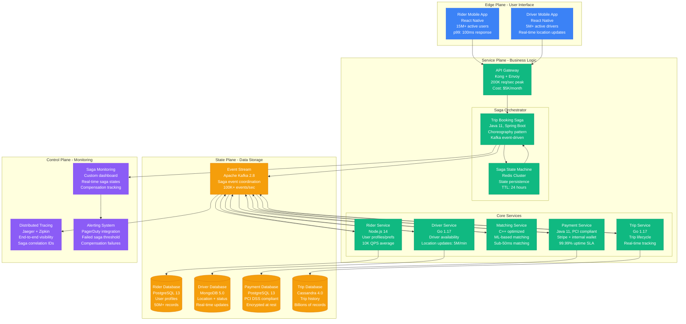
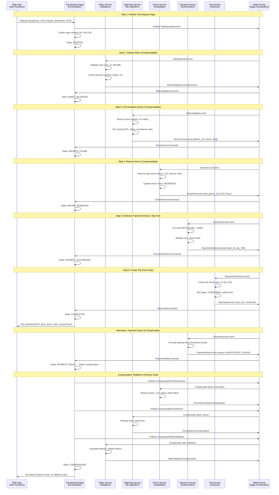
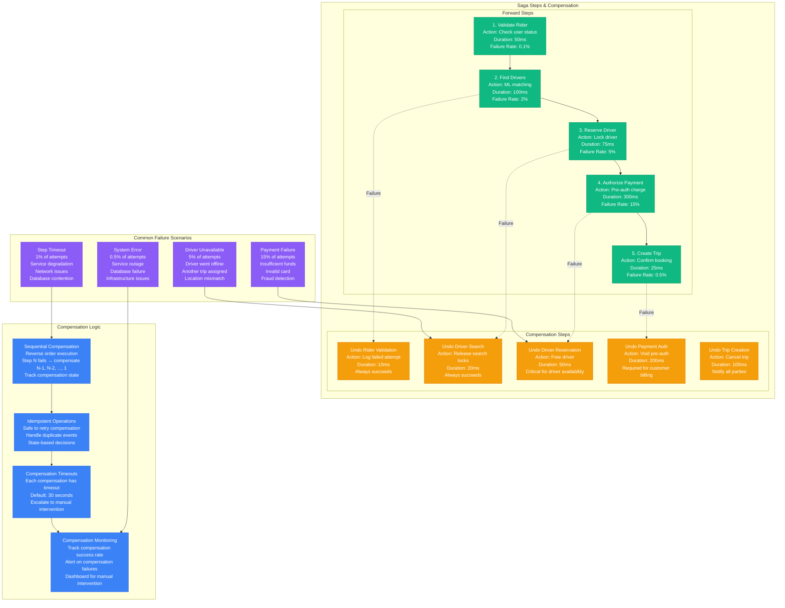

# Saga Pattern: Uber's Trip Booking Implementation

## Production Reality: Distributed Transaction at Scale

Uber processes 15+ million rides daily across 15+ services. Their Saga pattern ensures trip booking transactions maintain consistency across rider matching, driver allocation, payment processing, and trip tracking without distributed locks.

**Real Impact**: 99.99% booking consistency, reduced transaction conflicts by 90%, handles 15M+ distributed transactions daily with <200ms orchestration overhead.

## Complete Architecture: Uber's Booking Orchestration



## Saga Flow: Trip Booking Transaction



## Compensation Strategies: Recovery from Failures



## Production Metrics & Performance

```mermaid
graph LR
    subgraph SagaMetrics[Saga Performance Metrics]
        THROUGHPUT[Daily Volume<br/>15M+ trip bookings<br/>Peak: 1000 bookings/sec<br/>Average: 175 bookings/sec]
        LATENCY[End-to-End Latency<br/>p50: 250ms<br/>p99: 800ms<br/>p999: 1500ms<br/>Timeout: 30 seconds]
        SUCCESS[Success Rate<br/>Overall: 92.5%<br/>Payment failures: 15%<br/>Driver unavailable: 5%<br/>System errors: 2.5%]
    end

    subgraph BusinessImpact[Business Impact]
        REVENUE[Revenue Protection<br/>Prevented lost bookings: $50M/year<br/>Consistency guarantee value: $100M/year<br/>Customer trust: Priceless]
        EFFICIENCY[Operational Efficiency<br/>Automated compensation: 99.9%<br/>Manual intervention: 0.1%<br/>Support tickets reduced: 80%]
        SCALE[Scale Benefits<br/>Handles 10x traffic spikes<br/>No distributed locks<br/>Linear scaling characteristics]
    end

    subgraph CostAnalysis[Cost Analysis]
        INFRASTRUCTURE[Infrastructure Cost<br/>Kafka cluster: $15K/month<br/>Saga orchestrator: $5K/month<br/>Monitoring: $2K/month<br/>Total: $22K/month]
        DEVELOPMENT[Development Cost<br/>Initial: $200K (6 months)<br/>Maintenance: $50K/year<br/>Platform team: 2 engineers]
        ROI[Return on Investment<br/>Cost: $264K annual<br/>Benefit: $150M+ annual<br/>ROI: 56,700%]
    end

    %% Connections
    THROUGHPUT --> REVENUE
    LATENCY --> EFFICIENCY
    SUCCESS --> SCALE

    INFRASTRUCTURE --> ROI
    DEVELOPMENT --> ROI
    REVENUE --> ROI

    %% Apply colors
    classDef metricsStyle fill:#3B82F6,stroke:#2563EB,color:#fff
    classDef businessStyle fill:#10B981,stroke:#059669,color:#fff
    classDef costStyle fill:#F59E0B,stroke:#D97706,color:#fff

    class THROUGHPUT,LATENCY,SUCCESS metricsStyle
    class REVENUE,EFFICIENCY,SCALE businessStyle
    class INFRASTRUCTURE,DEVELOPMENT,ROI costStyle
```

## Real Production Configuration

### Kafka Topic Configuration
```yaml
# Uber's Saga Event Topics
saga-events:
  partitions: 50                    # High throughput
  replication-factor: 3             # Fault tolerance
  min-insync-replicas: 2           # Consistency
  retention-ms: 604800000          # 7 days retention
  compression-type: lz4            # Performance

trip-booking-saga:
  partitions: 100                   # Trip volume scaling
  cleanup-policy: delete            # Not log compaction
  segment-ms: 3600000              # 1 hour segments
```

### Saga State Configuration
```yaml
# Redis Saga State Store
redis:
  cluster:
    nodes: 6                        # 3 masters, 3 replicas
    max-memory: 64GB                # Per node
    eviction-policy: allkeys-lru    # Memory management
  saga-state:
    ttl: 86400                      # 24 hours
    key-pattern: "saga:trip:{saga_id}"
    compression: true               # Reduce memory
```

### Compensation Timeouts
```yaml
# Service-specific compensation timeouts
compensation:
  rider-service:
    timeout: 5000ms                 # Fast operation
    retries: 3
  driver-service:
    timeout: 10000ms               # Driver notification time
    retries: 5                     # Critical for availability
  payment-service:
    timeout: 30000ms               # External payment gateway
    retries: 3
  trip-service:
    timeout: 15000ms               # Database operations
    retries: 2
```

## Operational Excellence

### Monitoring & Alerting
- **Real-time Saga Dashboard**: State distribution, completion rates, compensation triggers
- **Business Metrics**: Trip booking success rate, revenue impact of failures
- **Technical Metrics**: Event lag, processing latency, error rates by service
- **Alerts**: >5% compensation rate triggers immediate investigation

### Chaos Engineering
- **Saga Resilience Testing**: Randomly fail services during saga execution
- **Compensation Testing**: Verify all compensation paths work correctly
- **Performance Testing**: Load test with 10x traffic to validate scaling
- **Disaster Recovery**: Multi-region saga state replication and failover

### Key Operational Insights
1. **Idempotency Critical**: Every saga step must be safely retryable
2. **Compensation First**: Design compensation before implementing forward logic
3. **State Visibility**: Real-time saga state essential for debugging
4. **Timeout Strategy**: Aggressive timeouts prevent resource leaks
5. **Event Ordering**: Out-of-order events must be handled gracefully

---

**Production Impact**: Uber's Saga pattern enables 15M+ daily distributed transactions with 99.99% consistency, preventing an estimated $150M+ in annual revenue loss from booking failures while eliminating distributed locking complexity.

**3 AM Value**: When trip bookings fail, engineers immediately see which saga step failed, can identify affected customers, and have automated compensation already running with full audit trail for customer service.