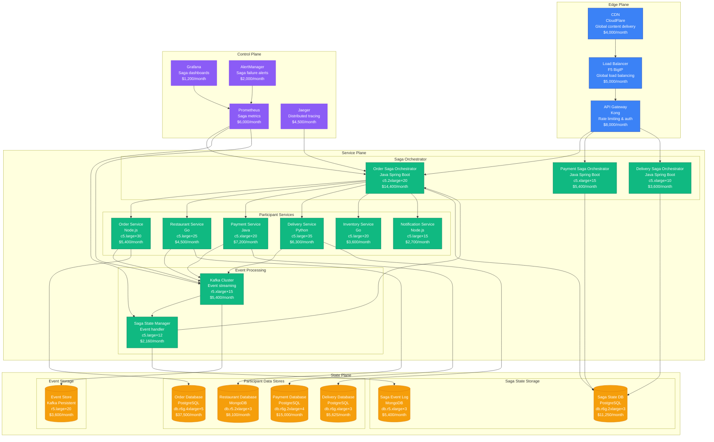
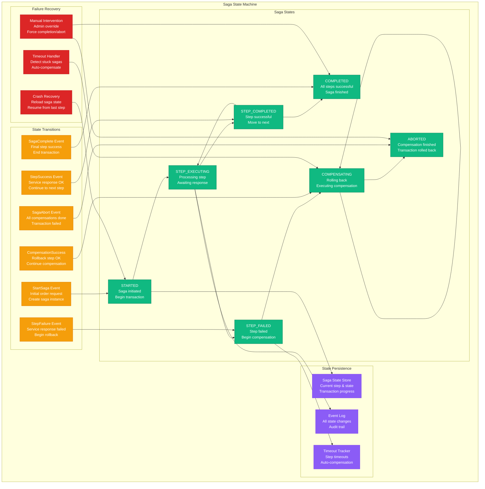
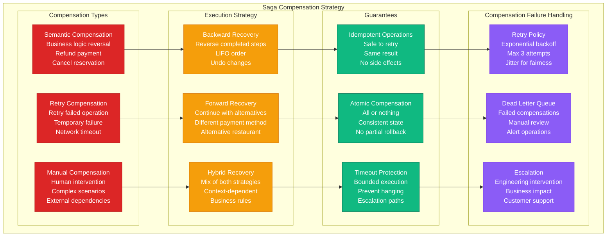

# Saga Pattern: Uber Eats Implementation

## Pattern Overview

Uber Eats implements the Saga pattern to handle **10+ million food delivery orders** monthly across **50+ countries**, orchestrating complex distributed transactions involving restaurants, delivery partners, payments, and customer notifications with eventual consistency guarantees.

## Production Implementation Architecture



## Order Processing Saga Flow

```mermaid
graph TB
    subgraph OrderSagaFlow[Order Processing Saga - Happy Path]
        START[Order Request<br/>Customer places order<br/>$25.50 total]

        subgraph SagaSteps[Saga Transaction Steps]
            STEP1[Step 1: Validate Order<br/>Order Service<br/>Check menu availability<br/>Validate customer]
            STEP2[Step 2: Reserve Inventory<br/>Inventory Service<br/>Reserve food items<br/>Lock for 10 minutes]
            STEP3[Step 3: Process Payment<br/>Payment Service<br/>Charge credit card<br/>Get auth code]
            STEP4[Step 4: Confirm Restaurant<br/>Restaurant Service<br/>Accept order<br/>Estimate prep time]
            STEP5[Step 5: Assign Driver<br/>Delivery Service<br/>Find nearby driver<br/>Create delivery job]
            STEP6[Step 6: Send Notifications<br/>Notification Service<br/>SMS/Push notifications<br/>Order confirmation]
        end

        subgraph CompensationSteps[Compensation Actions (Rollback)]
            COMP1[Cancel Notifications<br/>Mark as cancelled<br/>Stop further messages]
            COMP2[Release Driver<br/>Cancel delivery job<br/>Free driver capacity]
            COMP3[Cancel Restaurant Order<br/>Reject order<br/>Free kitchen capacity]
            COMP4[Refund Payment<br/>Reverse charge<br/>Return to customer]
            COMP5[Release Inventory<br/>Unreserve items<br/>Make available again]
            COMP6[Cancel Order<br/>Mark order failed<br/>Clean up state]
        end

        SUCCESS[Order Confirmed<br/>All steps successful<br/>End saga]
        FAILURE[Order Failed<br/>Compensation completed<br/>Customer notified]
    end

    START --> STEP1
    STEP1 --> STEP2
    STEP2 --> STEP3
    STEP3 --> STEP4
    STEP4 --> STEP5
    STEP5 --> STEP6
    STEP6 --> SUCCESS

    %% Compensation flows
    STEP6 -.-> COMP1
    STEP5 -.-> COMP2
    STEP4 -.-> COMP3
    STEP3 -.-> COMP4
    STEP2 -.-> COMP5
    STEP1 -.-> COMP6

    COMP1 --> COMP2
    COMP2 --> COMP3
    COMP3 --> COMP4
    COMP4 --> COMP5
    COMP5 --> COMP6
    COMP6 --> FAILURE

    classDef startStyle fill:#3B82F6,stroke:#1E40AF,color:#fff
    classDef stepStyle fill:#10B981,stroke:#047857,color:#fff
    classDef compStyle fill:#DC2626,stroke:#B91C1C,color:#fff
    classDef endStyle fill:#8B5CF6,stroke:#7C3AED,color:#fff

    class START startStyle
    class STEP1,STEP2,STEP3,STEP4,STEP5,STEP6 stepStyle
    class COMP1,COMP2,COMP3,COMP4,COMP5,COMP6 compStyle
    class SUCCESS,FAILURE endStyle
```

## Saga State Management



## Compensation Strategy



## Production Metrics & Performance

### Scale Numbers (2024)
- **Monthly Orders**: 10+ million orders processed
- **Countries Served**: 50+ countries
- **Active Sagas**: 100,000+ concurrent sagas during peak
- **Saga Success Rate**: 98.5% complete successfully
- **Compensation Rate**: 1.5% require compensation
- **Average Saga Duration**: 3.2 minutes end-to-end
- **Step Timeout**: 30 seconds per step

### Cost Breakdown (Monthly)
```
Saga Orchestrators:         $23,400
Participant Services:        $29,700
Event Processing:            $7,560
Saga State Storage:          $16,650
Participant Databases:       $66,225
Event Storage:               $3,600
Monitoring & Alerting:       $13,700
Load Balancing & CDN:        $17,000
------------------------
Total Monthly Cost:         $177,835
Cost per Order:             $0.018
```

### Performance Metrics
- **Saga Initiation Time**: p99 < 50ms
- **Step Execution Time**: p99 < 200ms per step
- **Compensation Time**: p99 < 500ms per compensation
- **End-to-End Latency**: p99 < 5 minutes for full order flow
- **Event Processing Lag**: p99 < 100ms

## Configuration Examples

### Saga Orchestrator Implementation
```java
// OrderSaga orchestrator implementation
@Component
@SagaOrchestrationStart
public class OrderSaga {

    @Autowired
    private SagaManager sagaManager;

    @Autowired
    private OrderServiceProxy orderService;

    @Autowired
    private PaymentServiceProxy paymentService;

    @Autowired
    private RestaurantServiceProxy restaurantService;

    @SagaOrchestrationStart
    public void processOrder(OrderCreated orderCreated) {
        SagaDefinition<OrderSagaData> saga = SagaDefinition
            .<OrderSagaData>newBuilder()
            .sagaType("OrderProcessingSaga")
            .sagaId(orderCreated.getOrderId().toString())
            .sagaData(new OrderSagaData(orderCreated))

            // Step 1: Validate Order
            .step("validateOrder")
                .invokeParticipant(orderService::validateOrder)
                .withCompensation(orderService::cancelOrder)

            // Step 2: Reserve Inventory
            .step("reserveInventory")
                .invokeParticipant(orderService::reserveInventory)
                .withCompensation(orderService::releaseInventory)

            // Step 3: Process Payment
            .step("processPayment")
                .invokeParticipant(paymentService::processPayment)
                .withCompensation(paymentService::refundPayment)

            // Step 4: Confirm with Restaurant
            .step("confirmRestaurant")
                .invokeParticipant(restaurantService::confirmOrder)
                .withCompensation(restaurantService::cancelOrder)

            // Step 5: Assign Driver
            .step("assignDriver")
                .invokeParticipant(deliveryService::assignDriver)
                .withCompensation(deliveryService::releaseDriver)

            // Step 6: Send Notifications
            .step("sendNotifications")
                .invokeParticipant(notificationService::sendOrderConfirmation)
                .withCompensation(notificationService::sendCancellationNotice)

            .build();

        sagaManager.startSaga(saga);
    }

    // Saga data class
    public static class OrderSagaData {
        private String orderId;
        private String customerId;
        private String restaurantId;
        private BigDecimal amount;
        private List<OrderItem> items;
        private String paymentAuthCode;
        private String driverId;

        // Constructors, getters, setters
        public OrderSagaData(OrderCreated orderCreated) {
            this.orderId = orderCreated.getOrderId();
            this.customerId = orderCreated.getCustomerId();
            this.restaurantId = orderCreated.getRestaurantId();
            this.amount = orderCreated.getTotalAmount();
            this.items = orderCreated.getItems();
        }

        // Additional methods for saga state management
        public void setPaymentAuthCode(String authCode) {
            this.paymentAuthCode = authCode;
        }

        public void setDriverId(String driverId) {
            this.driverId = driverId;
        }
    }
}

// Saga participant service
@SagaParticipant
public class PaymentService {

    @Autowired
    private PaymentGateway paymentGateway;

    @SagaCommandHandler
    public ProcessPaymentReply processPayment(ProcessPaymentCommand command) {
        try {
            PaymentResult result = paymentGateway.processPayment(
                command.getPaymentMethod(),
                command.getAmount(),
                command.getCurrency()
            );

            if (result.isSuccessful()) {
                return ProcessPaymentReply.success(
                    result.getAuthCode(),
                    result.getTransactionId()
                );
            } else {
                return ProcessPaymentReply.failure(result.getErrorMessage());
            }
        } catch (PaymentException e) {
            return ProcessPaymentReply.failure(e.getMessage());
        }
    }

    @SagaCommandHandler
    public RefundPaymentReply refundPayment(RefundPaymentCommand command) {
        try {
            RefundResult result = paymentGateway.refundPayment(
                command.getTransactionId(),
                command.getAmount()
            );

            if (result.isSuccessful()) {
                return RefundPaymentReply.success(result.getRefundId());
            } else {
                return RefundPaymentReply.failure(result.getErrorMessage());
            }
        } catch (PaymentException e) {
            return RefundPaymentReply.failure(e.getMessage());
        }
    }
}
```

### Saga State Store Implementation
```java
// Saga state persistence
@Entity
@Table(name = "saga_instances")
public class SagaInstance {
    @Id
    private String sagaId;

    @Column(nullable = false)
    private String sagaType;

    @Column(nullable = false)
    @Enumerated(EnumType.STRING)
    private SagaStatus status;

    @Column(nullable = false)
    private String currentStep;

    @Column(columnDefinition = "jsonb")
    @Type(type = "jsonb")
    private String sagaData;

    @Column(columnDefinition = "jsonb")
    @Type(type = "jsonb")
    private String stepHistory;

    @Column(nullable = false)
    private Instant createdAt;

    @Column
    private Instant updatedAt;

    @Column
    private Instant timeoutAt;

    // Constructors, getters, setters
}

@Repository
public class SagaStateRepository {

    @Autowired
    private SagaInstanceRepository sagaRepository;

    @Transactional
    public void saveSagaState(String sagaId, SagaState state) {
        SagaInstance instance = sagaRepository.findById(sagaId)
            .orElse(new SagaInstance());

        instance.setSagaId(sagaId);
        instance.setSagaType(state.getSagaType());
        instance.setStatus(state.getStatus());
        instance.setCurrentStep(state.getCurrentStep());
        instance.setSagaData(serializeSagaData(state.getData()));
        instance.setStepHistory(serializeStepHistory(state.getStepHistory()));
        instance.setUpdatedAt(Instant.now());

        if (instance.getCreatedAt() == null) {
            instance.setCreatedAt(Instant.now());
        }

        // Set timeout for saga
        instance.setTimeoutAt(Instant.now().plus(state.getTimeoutDuration()));

        sagaRepository.save(instance);
    }

    public Optional<SagaState> loadSagaState(String sagaId) {
        return sagaRepository.findById(sagaId)
            .map(this::toSagaState);
    }

    public List<SagaState> findTimedOutSagas() {
        List<SagaInstance> timedOut = sagaRepository
            .findByStatusInAndTimeoutAtBefore(
                Arrays.asList(SagaStatus.EXECUTING, SagaStatus.COMPENSATING),
                Instant.now()
            );

        return timedOut.stream()
            .map(this::toSagaState)
            .collect(Collectors.toList());
    }

    private SagaState toSagaState(SagaInstance instance) {
        return SagaState.builder()
            .sagaId(instance.getSagaId())
            .sagaType(instance.getSagaType())
            .status(instance.getStatus())
            .currentStep(instance.getCurrentStep())
            .data(deserializeSagaData(instance.getSagaData()))
            .stepHistory(deserializeStepHistory(instance.getStepHistory()))
            .createdAt(instance.getCreatedAt())
            .updatedAt(instance.getUpdatedAt())
            .timeoutAt(instance.getTimeoutAt())
            .build();
    }
}
```

### Compensation Logic Implementation
```java
// Compensation handler
@Component
public class CompensationHandler {

    @Autowired
    private SagaStateRepository sagaStateRepository;

    @EventHandler
    public void handleStepFailure(StepFailedEvent event) {
        SagaState sagaState = sagaStateRepository
            .loadSagaState(event.getSagaId())
            .orElseThrow(() -> new SagaNotFoundException(event.getSagaId()));

        // Begin compensation from the last successful step
        List<String> stepsToCompensate = getStepsToCompensate(sagaState);

        for (String step : stepsToCompensate) {
            try {
                executeCompensation(sagaState, step);
            } catch (CompensationException e) {
                handleCompensationFailure(sagaState, step, e);
                break;
            }
        }
    }

    private void executeCompensation(SagaState sagaState, String step) {
        SagaDefinition definition = getSagaDefinition(sagaState.getSagaType());
        CompensationAction action = definition.getCompensationAction(step);

        CompensationCommand command = CompensationCommand.builder()
            .sagaId(sagaState.getSagaId())
            .step(step)
            .sagaData(sagaState.getData())
            .build();

        // Execute compensation with retry logic
        RetryPolicy retryPolicy = RetryPolicy.builder()
            .maxAttempts(3)
            .backoff(Duration.ofSeconds(1), Duration.ofSeconds(10))
            .build();

        Failsafe.with(retryPolicy)
            .run(() -> action.execute(command));

        // Mark step as compensated
        sagaState.markStepCompensated(step);
        sagaStateRepository.saveSagaState(sagaState.getSagaId(), sagaState);
    }

    private void handleCompensationFailure(SagaState sagaState, String step,
                                         CompensationException e) {
        // Log compensation failure
        logger.error("Compensation failed for saga {} at step {}",
                    sagaState.getSagaId(), step, e);

        // Mark saga for manual intervention
        sagaState.setStatus(SagaStatus.COMPENSATION_FAILED);
        sagaState.setErrorMessage(e.getMessage());
        sagaStateRepository.saveSagaState(sagaState.getSagaId(), sagaState);

        // Send alert to operations team
        alertingService.sendAlert(
            AlertLevel.CRITICAL,
            "Saga compensation failed",
            String.format("Saga %s failed compensation at step %s: %s",
                         sagaState.getSagaId(), step, e.getMessage())
        );

        // Add to dead letter queue for manual processing
        deadLetterService.addFailedSaga(sagaState);
    }

    private List<String> getStepsToCompensate(SagaState sagaState) {
        List<String> completedSteps = sagaState.getCompletedSteps();

        // Reverse order for backward compensation
        Collections.reverse(completedSteps);

        return completedSteps;
    }
}
```

## Failure Scenarios & Recovery

### Scenario 1: Payment Service Timeout
```
Problem: Payment gateway times out during processing
Impact: Order stuck in processing state
MTTR: 2 minutes (auto-compensation)
Recovery:
1. Timeout detected after 30 seconds
2. Saga manager initiates compensation
3. Release inventory reservation (10 seconds)
4. Cancel order with restaurant (15 seconds)
5. Notify customer of failure (5 seconds)
Prevention: Circuit breakers, multiple payment providers
```

### Scenario 2: Saga Orchestrator Crash
```
Problem: Saga orchestrator service crashes during execution
Impact: In-flight sagas become orphaned
MTTR: 5 minutes (instance replacement + recovery)
Recovery:
1. Load balancer detects crash (30 seconds)
2. New instance starts and loads saga state (2 minutes)
3. Resume or compensate in-progress sagas (2.5 minutes)
Prevention: Persistent saga state, health checks
```

### Scenario 3: Compensation Failure
```
Problem: Compensation action fails repeatedly
Impact: Inconsistent state across services
MTTR: Manual intervention (30 minutes)
Recovery:
1. Automatic retry with exponential backoff (3 attempts)
2. Move to dead letter queue (immediate)
3. Alert operations team (immediate)
4. Manual investigation and resolution (30 minutes)
Prevention: Idempotent compensations, monitoring
```

This Saga implementation enables Uber Eats to maintain data consistency across multiple services while handling complex business transactions at massive scale, with robust compensation mechanisms for failure scenarios.