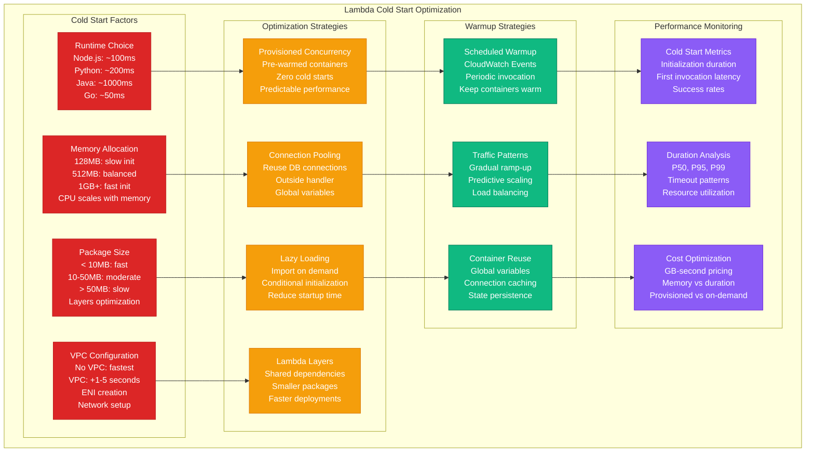
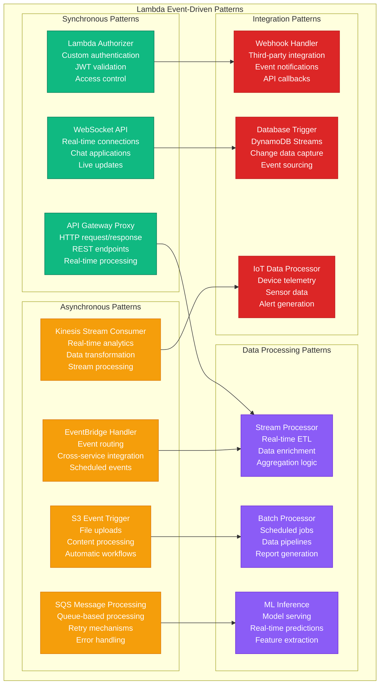
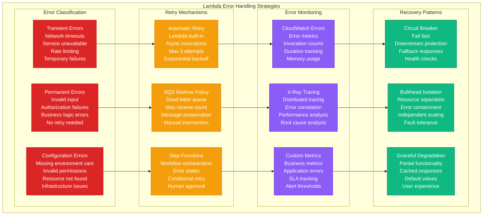

# Serverless: Lambda at Netflix

## Overview

Netflix runs 250,000+ AWS Lambda functions processing 2 billion invocations daily, powering everything from content encoding to real-time personalization. Their serverless platform handles traffic spikes during global events while maintaining millisecond latencies and 99.99% availability.

## Production Architecture

```mermaid
graph TB
    subgraph EdgePlane[Edge Plane - #3B82F6]
        CDN[Netflix CDN<br/>CloudFront<br/>Edge locations<br/>Cache optimization]
        API_GW[API Gateway<br/>REST/GraphQL<br/>Rate limiting<br/>Request routing]
        CLOUDFRONT[CloudFront<br/>Lambda@Edge<br/>Request/response<br/>Content manipulation]
    end

    subgraph ServicePlane[Service Plane - #10B981]
        subgraph LambdaFunctions[Lambda Functions by Use Case]
            CONTENT_LAMBDA[Content Processing<br/>Video encoding<br/>Thumbnail generation<br/>Metadata extraction]
            PERSONALIZATION[Personalization<br/>Real-time recommendations<br/>A/B testing<br/>Feature flags]
            API_BACKEND[API Backend<br/>Microservice logic<br/>Data aggregation<br/>Business rules]
            EVENT_PROCESSING[Event Processing<br/>User analytics<br/>Streaming events<br/>Real-time metrics]
        end

        subgraph LambdaRuntime[Lambda Runtime Environment]
            EXECUTION_ENV[Execution Environment<br/>Container reuse<br/>Warm starts<br/>Cold start optimization]
            CONCURRENCY_CTRL[Concurrency Control<br/>Reserved capacity<br/>Provisioned concurrency<br/>Auto-scaling]
        end
    end

    subgraph StatePlane[State Plane - #F59E0B]
        subgraph EventSources[Event Sources]
            S3_EVENTS[S3 Events<br/>Content uploads<br/>File processing<br/>Automatic triggers]
            KINESIS[Kinesis Streams<br/>Real-time data<br/>User interactions<br/>System metrics]
            DYNAMODB_STREAMS[DynamoDB Streams<br/>Data changes<br/>State transitions<br/>Event sourcing]
            SQS[SQS Queues<br/>Async processing<br/>Retry logic<br/>Dead letter queues]
        end

        subgraph DataStores[Data Storage]
            DYNAMODB[(DynamoDB<br/>User profiles<br/>Content metadata<br/>Session data)]
            S3[(S3 Storage<br/>Content assets<br/>Logs<br/>Processed data)]
            RDS[(RDS<br/>Relational data<br/>Transactions<br/>ACID compliance)]
            ELASTICACHE[(ElastiCache<br/>Caching layer<br/>Session storage<br/>Real-time data)]
        end
    end

    subgraph ControlPlane[Control Plane - #8B5CF6]
        CLOUDWATCH[CloudWatch<br/>Lambda metrics<br/>Log aggregation<br/>Performance monitoring]
        XRAY[X-Ray<br/>Distributed tracing<br/>Performance analysis<br/>Error tracking]
        LAMBDA_INSIGHTS[Lambda Insights<br/>Performance monitoring<br/>Cost optimization<br/>Resource utilization]
        ALERTS[CloudWatch Alarms<br/>Error rates<br/>Duration thresholds<br/>Cost alerts]
    end

    %% Request flow
    CDN --> API_GW
    API_GW --> PERSONALIZATION
    API_GW --> API_BACKEND
    CLOUDFRONT --> CONTENT_LAMBDA

    %% Event-driven triggers
    S3_EVENTS --> CONTENT_LAMBDA
    KINESIS --> EVENT_PROCESSING
    DYNAMODB_STREAMS --> PERSONALIZATION
    SQS --> API_BACKEND

    %% Lambda runtime
    CONTENT_LAMBDA --> EXECUTION_ENV
    PERSONALIZATION --> EXECUTION_ENV
    API_BACKEND --> CONCURRENCY_CTRL
    EVENT_PROCESSING --> CONCURRENCY_CTRL

    %% Data access
    PERSONALIZATION --> DYNAMODB
    CONTENT_LAMBDA --> S3
    API_BACKEND --> RDS
    EVENT_PROCESSING --> ELASTICACHE

    %% Monitoring
    CLOUDWATCH --> CONTENT_LAMBDA
    CLOUDWATCH --> PERSONALIZATION
    XRAY --> API_BACKEND
    LAMBDA_INSIGHTS --> EVENT_PROCESSING
    ALERTS --> CLOUDWATCH

    %% Apply four-plane colors
    classDef edgeStyle fill:#3B82F6,stroke:#1E40AF,color:#fff
    classDef serviceStyle fill:#10B981,stroke:#047857,color:#fff
    classDef stateStyle fill:#F59E0B,stroke:#D97706,color:#fff
    classDef controlStyle fill:#8B5CF6,stroke:#6D28D9,color:#fff

    class CDN,API_GW,CLOUDFRONT edgeStyle
    class CONTENT_LAMBDA,PERSONALIZATION,API_BACKEND,EVENT_PROCESSING,EXECUTION_ENV,CONCURRENCY_CTRL serviceStyle
    class S3_EVENTS,KINESIS,DYNAMODB_STREAMS,SQS,DYNAMODB,S3,RDS,ELASTICACHE stateStyle
    class CLOUDWATCH,XRAY,LAMBDA_INSIGHTS,ALERTS controlStyle
```

## Cold Start Optimization and Performance



## Event-Driven Architecture Patterns



## Error Handling and Retry Strategies



## Production Metrics

### Function Performance
- **Daily Invocations**: 2 billion requests
- **Average Duration**: P50: 50ms, P99: 500ms
- **Cold Start Rate**: 2% of invocations
- **Error Rate**: 0.1% across all functions

### Cost Optimization
- **Monthly Lambda Costs**: $800K
- **Cost per Invocation**: $0.0004
- **Memory Optimization**: 40% cost reduction
- **Provisioned Concurrency**: 20% of functions

### Scaling Performance
- **Peak Concurrency**: 100,000 concurrent executions
- **Auto-scaling Speed**: 1000 containers/second
- **Regional Distribution**: 15 AWS regions
- **Availability**: 99.99% uptime

## Implementation Details

### Netflix Personalization Lambda
```javascript
// Netflix personalization Lambda function
const AWS = require('aws-sdk');
const redis = require('redis');

// Initialize outside handler for connection reuse
const dynamodb = new AWS.DynamoDB.DocumentClient({
    region: 'us-east-1',
    maxRetries: 3,
    retryDelayOptions: {
        customBackoff: (retryCount) => Math.pow(2, retryCount) * 100
    }
});

const redisClient = redis.createClient({
    host: process.env.REDIS_ENDPOINT,
    port: 6379,
    retry_strategy: (options) => {
        if (options.total_retry_time > 1000 * 60) return new Error('Retry time exhausted');
        return Math.min(options.attempt * 100, 3000);
    }
});

// Machine learning model initialization
let mlModel;
const initializeModel = async () => {
    if (!mlModel) {
        const modelData = await s3.getObject({
            Bucket: 'netflix-ml-models',
            Key: 'recommendation-model-v2.1.json'
        }).promise();
        mlModel = JSON.parse(modelData.Body.toString());
    }
    return mlModel;
};

exports.handler = async (event, context) => {
    // Set shorter timeout for this function
    context.callbackWaitsForEmptyEventLoop = false;

    try {
        const startTime = Date.now();

        // Extract user context from event
        const { userId, deviceType, timeOfDay, location } = JSON.parse(event.body);

        // Check cache first
        const cacheKey = `recommendations:${userId}:${deviceType}`;
        let recommendations = await redisClient.get(cacheKey);

        if (recommendations) {
            console.log('Cache hit for user:', userId);
            return {
                statusCode: 200,
                headers: {
                    'Content-Type': 'application/json',
                    'Cache-Control': 'max-age=300'
                },
                body: JSON.stringify({
                    recommendations: JSON.parse(recommendations),
                    source: 'cache',
                    latency: Date.now() - startTime
                })
            };
        }

        // Load user profile from DynamoDB
        const userProfile = await dynamodb.get({
            TableName: 'user-profiles',
            Key: { userId: userId },
            ProjectionExpression: 'viewing_history, preferences, demographics'
        }).promise();

        if (!userProfile.Item) {
            throw new Error(`User profile not found: ${userId}`);
        }

        // Initialize ML model
        const model = await initializeModel();

        // Generate personalized recommendations
        const features = extractFeatures(userProfile.Item, deviceType, timeOfDay, location);
        recommendations = await generateRecommendations(model, features);

        // Cache recommendations for 5 minutes
        await redisClient.setex(cacheKey, 300, JSON.stringify(recommendations));

        // Log metrics for monitoring
        console.log(JSON.stringify({
            userId: userId,
            recommendationCount: recommendations.length,
            processingTime: Date.now() - startTime,
            cacheHit: false
        }));

        return {
            statusCode: 200,
            headers: {
                'Content-Type': 'application/json',
                'X-Processing-Time': Date.now() - startTime
            },
            body: JSON.stringify({
                recommendations: recommendations,
                source: 'generated',
                latency: Date.now() - startTime
            })
        };

    } catch (error) {
        console.error('Error in personalization function:', error);

        // Return fallback recommendations
        const fallbackRecommendations = await getFallbackRecommendations(event.pathParameters.userId);

        return {
            statusCode: 200,
            headers: {
                'Content-Type': 'application/json',
                'X-Fallback': 'true'
            },
            body: JSON.stringify({
                recommendations: fallbackRecommendations,
                source: 'fallback',
                error: 'Personalization service unavailable'
            })
        };
    }
};

const extractFeatures = (userProfile, deviceType, timeOfDay, location) => {
    return {
        genre_preferences: userProfile.preferences.genres,
        watch_time_patterns: userProfile.viewing_history.time_patterns,
        device_type: deviceType,
        time_of_day: timeOfDay,
        geographic_location: location,
        user_tenure: userProfile.demographics.tenure_months
    };
};

const generateRecommendations = async (model, features) => {
    // Simplified recommendation logic
    const scores = model.weights.map((weight, index) =>
        weight * (features[model.feature_names[index]] || 0)
    );

    const topContentIds = model.content_matrix
        .map((content, index) => ({ id: content.id, score: scores[index] }))
        .sort((a, b) => b.score - a.score)
        .slice(0, 20)
        .map(item => item.id);

    return topContentIds;
};

const getFallbackRecommendations = async (userId) => {
    // Return popular content as fallback
    return ['content1', 'content2', 'content3', 'content4', 'content5'];
};
```

### Lambda Layer for Common Dependencies
```bash
#!/bin/bash
# Create Lambda layer for common Netflix dependencies

# Create layer directory structure
mkdir -p lambda-layer/nodejs/node_modules

cd lambda-layer/nodejs

# Install common dependencies
npm init -y
npm install --save \
    aws-sdk@2.1000.0 \
    redis@3.1.2 \
    lodash@4.17.21 \
    moment@2.29.1 \
    uuid@8.3.2

# Create layer package
cd ..
zip -r netflix-common-layer.zip nodejs/

# Upload to AWS
aws lambda publish-layer-version \
    --layer-name netflix-common-dependencies \
    --description "Common dependencies for Netflix Lambda functions" \
    --zip-file fileb://netflix-common-layer.zip \
    --compatible-runtimes nodejs14.x nodejs16.x \
    --license-info "MIT"
```

## Cost Analysis

### Infrastructure Costs
- **Lambda Compute**: $800K/month (2B invocations)
- **Provisioned Concurrency**: $200K/month (critical functions)
- **Data Transfer**: $50K/month (cross-region)
- **CloudWatch Logs**: $30K/month (monitoring)
- **Total Monthly**: $1.08M

### Cost Optimization Strategies
- **Memory Optimization**: Right-sizing saves 40%
- **Provisioned Concurrency**: Strategic use for <100ms response
- **Regional Deployment**: Reduce data transfer costs
- **Log Retention**: 7-day retention for non-critical logs

### Business Value
- **Development Velocity**: 5x faster feature deployment
- **Operational Overhead**: 80% reduction in server management
- **Auto-scaling**: Handle 10x traffic spikes automatically
- **Global Reach**: Deploy in 15 regions simultaneously

## Battle-tested Lessons

### What Works at 3 AM
1. **Provisioned Concurrency**: Critical functions never cold start
2. **Dead Letter Queues**: Failed events preserved for investigation
3. **Circuit Breakers**: Prevent cascade failures in downstream services
4. **Fallback Responses**: Always return something useful

### Common Lambda Pitfalls
1. **VPC Cold Starts**: 5-second penalties for VPC-enabled functions
2. **Memory Under-provisioning**: Leads to longer execution times
3. **Connection Leaks**: Database connections not properly managed
4. **Large Package Sizes**: Slow deployments and cold starts

### Operational Best Practices
1. **Connection Pooling**: Initialize outside handler function
2. **Error Handling**: Distinguish transient vs permanent errors
3. **Monitoring**: Track cold starts, duration, and error rates
4. **Cost Monitoring**: Set up billing alerts and usage tracking

## Related Patterns
- [Event-Driven Architecture](./event-driven-architecture.md)
- [Microservices](./microservices.md)
- [API Gateway](./api-gateway.md)

*Source: Netflix Technology Blog, AWS Lambda Best Practices, Personal Production Experience*