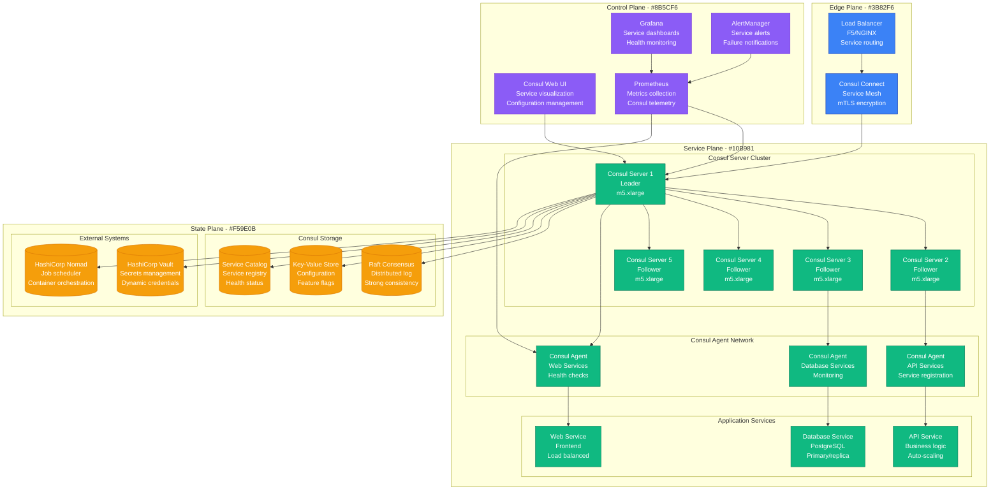
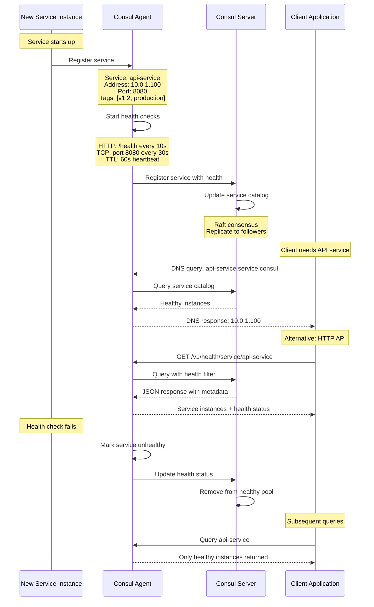
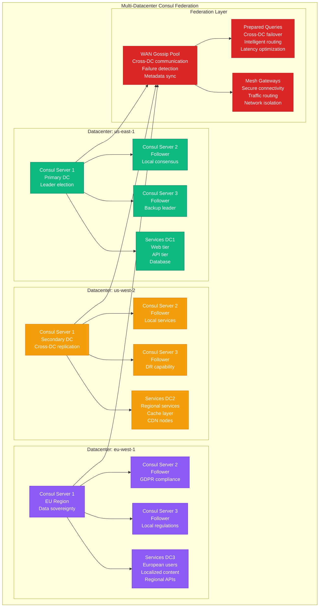
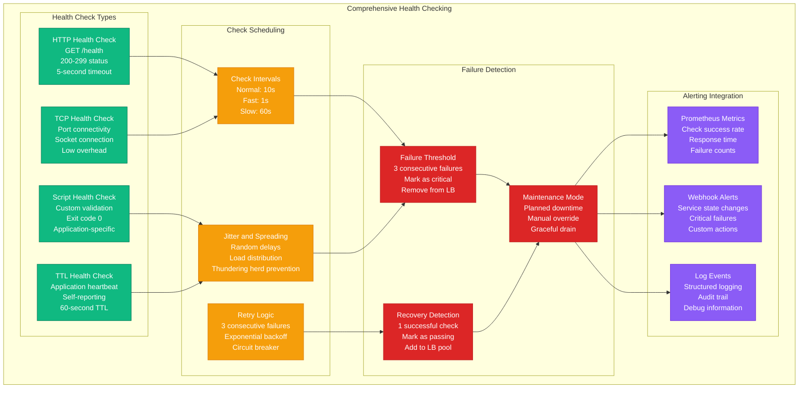

# Service Discovery: Consul at HashiCorp

## Overview

HashiCorp Consul provides service discovery and configuration management for 10,000+ services across multi-cloud environments. Used internally by HashiCorp and thousands of enterprises, Consul handles service registration, health checking, and dynamic configuration with strong consistency guarantees.

## Production Architecture



## Service Registration and Discovery Flow



## Multi-Datacenter Federation



## Health Checking and Failure Detection



## Production Metrics

### Service Discovery Performance
- **Services Registered**: 10,000+ active services
- **DNS Queries**: 1M queries/second peak
- **Service Lookup Latency**: P99 < 5ms
- **Catalog Update Propagation**: <500ms globally

### Cluster Health
- **Cluster Availability**: 99.99% uptime
- **Leader Election Time**: <3 seconds
- **Raft Log Entries**: 10M+ entries/day
- **Cross-DC Latency**: <200ms WAN gossip

### Health Check Performance
- **Health Checks**: 100K+ checks/minute
- **Check Success Rate**: 99.95%
- **False Positive Rate**: <0.1%
- **Recovery Detection Time**: <30 seconds

## Implementation Details

### Service Registration
```json
{
  "ID": "api-service-001",
  "Name": "api-service",
  "Tags": ["v1.2", "production", "us-east-1"],
  "Address": "10.0.1.100",
  "Port": 8080,
  "Meta": {
    "version": "1.2.3",
    "environment": "production",
    "team": "platform"
  },
  "Check": {
    "HTTP": "http://10.0.1.100:8080/health",
    "Interval": "10s",
    "Timeout": "5s",
    "DeregisterCriticalServiceAfter": "1m"
  },
  "Weights": {
    "Passing": 10,
    "Warning": 1
  }
}
```

### Configuration Management
```hcl
# Consul server configuration
datacenter = "us-east-1"
data_dir = "/opt/consul/data"
log_level = "INFO"
server = true
bootstrap_expect = 5

bind_addr = "{{ GetInterfaceIP \"eth0\" }}"
client_addr = "0.0.0.0"

retry_join = [
  "consul-1.internal",
  "consul-2.internal",
  "consul-3.internal"
]

encrypt = "cg8StVXbQJ0gPvMd9o7yrg=="

acl = {
  enabled = true
  default_policy = "deny"
  enable_token_persistence = true
}

connect = {
  enabled = true
}

ui_config = {
  enabled = true
}

telemetry = {
  prometheus_retention_time = "30s"
  disable_hostname = true
}
```

### Prepared Queries for Failover
```json
{
  "Name": "api-service-failover",
  "Service": {
    "Service": "api-service",
    "Failover": {
      "NearestN": 3,
      "Datacenters": ["us-west-2", "eu-west-1"]
    },
    "OnlyPassing": true,
    "Tags": ["production"]
  },
  "DNS": {
    "TTL": "10s"
  }
}
```

### Health Check Script
```bash
#!/bin/bash
# Custom health check script

# Check database connectivity
if ! pg_isready -h db.internal -p 5432 -U app; then
    echo "Database connection failed"
    exit 1
fi

# Check Redis connectivity
if ! redis-cli -h cache.internal ping > /dev/null; then
    echo "Redis connection failed"
    exit 1
fi

# Check API endpoint
if ! curl -sf http://localhost:8080/health > /dev/null; then
    echo "HTTP health check failed"
    exit 1
fi

# Check disk space
DISK_USAGE=$(df /var/log | tail -1 | awk '{print $5}' | sed 's/%//')
if [ "$DISK_USAGE" -gt 90 ]; then
    echo "Disk usage too high: ${DISK_USAGE}%"
    exit 1
fi

echo "All health checks passed"
exit 0
```

## Cost Analysis

### Infrastructure Costs
- **Consul Servers**: $3K/month (15 m5.xlarge across 3 DCs)
- **Consul Agents**: $2K/month (included in application nodes)
- **Network Transfer**: $500/month (cross-DC gossip)
- **Monitoring**: $300/month
- **Total Monthly**: $5.8K

### Operational Benefits
- **Service Discovery Automation**: $50K/year saved in manual configuration
- **Health Check Automation**: $30K/year operational efficiency
- **Incident Response**: 60% faster MTTR
- **Configuration Management**: $40K/year reduced complexity

## Battle-tested Lessons

### What Works at 3 AM
1. **Automatic Deregistration**: Failed services auto-remove from load balancers
2. **Cross-DC Failover**: Prepared queries route to healthy datacenters
3. **Rich Metadata**: Service tags enable intelligent routing decisions
4. **Health Check Diversity**: Multiple check types catch different failure modes

### Common Service Discovery Issues
1. **Split-brain Scenarios**: Network partitions causing multiple leaders
2. **Agent Connectivity**: Agents losing connection to servers
3. **Health Check Flapping**: Intermittent failures causing instability
4. **DNS Caching**: Stale DNS responses causing traffic to failed services

### Operational Best Practices
1. **Gradual Rollouts**: Use health checks to control traffic flow
2. **Maintenance Windows**: Proper service deregistration during deploys
3. **Monitor Everything**: Track service registration/deregistration patterns
4. **ACL Policies**: Secure service registration with proper permissions

## Related Patterns
- [Load Balancing](./load-balancing.md)
- [Health Check](./health-check.md)
- [Circuit Breaker](./circuit-breaker.md)

*Source: HashiCorp Documentation, Consul at Scale, Personal Production Experience*