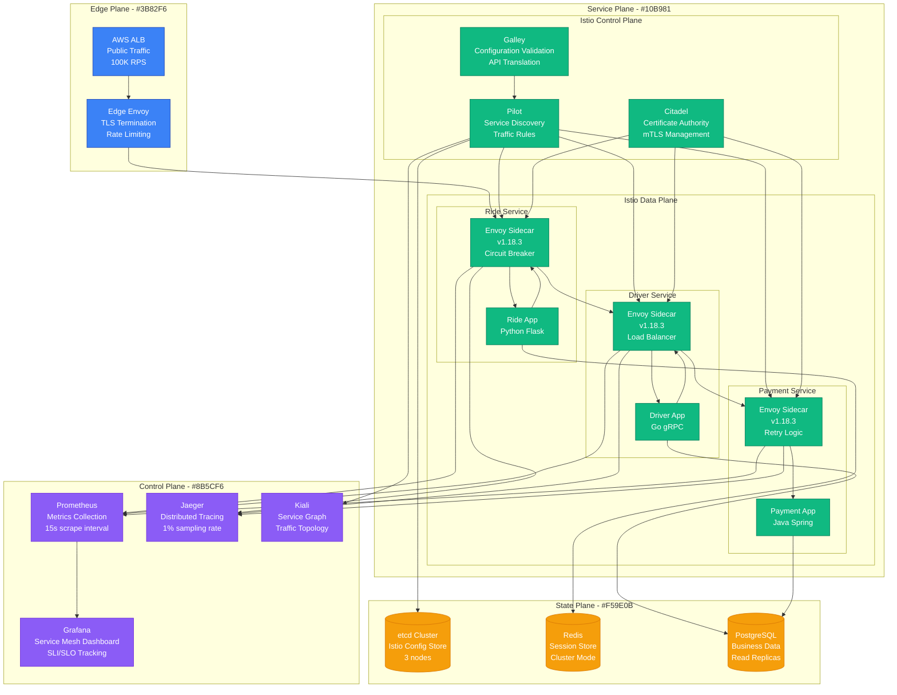
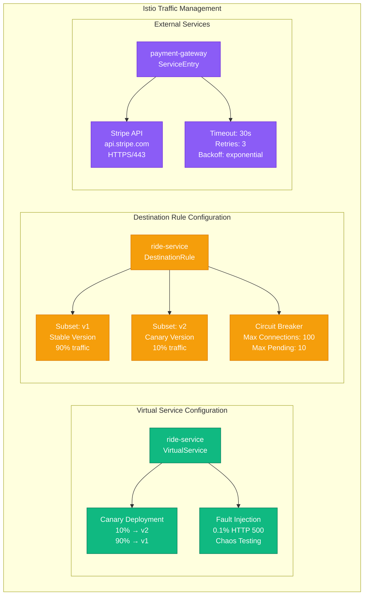
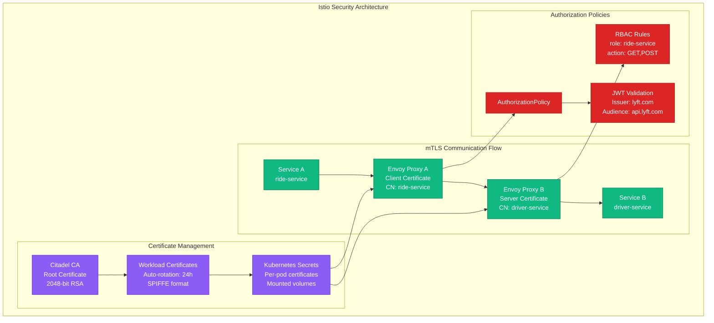
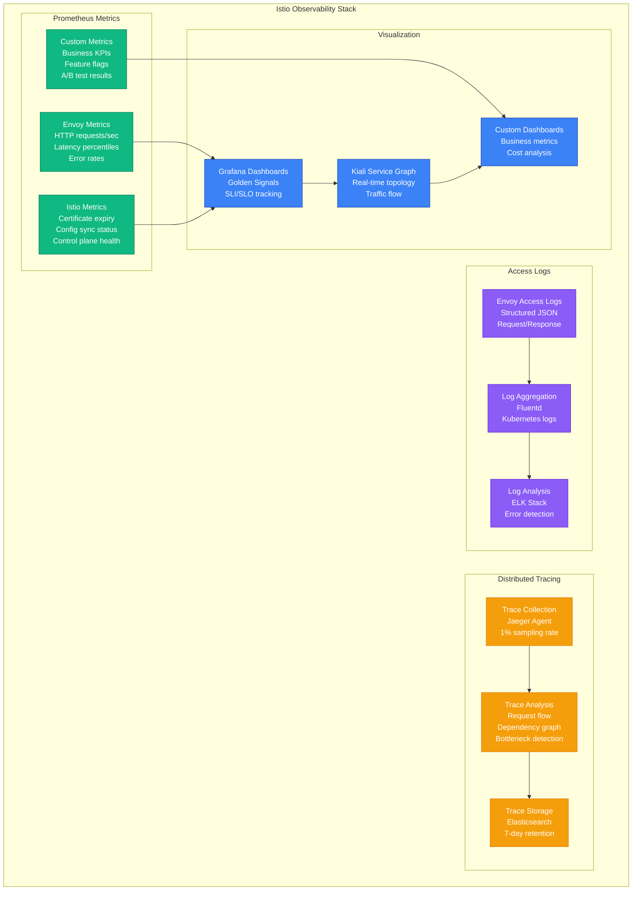

# Service Mesh: Istio at Lyft

## Overview

Lyft operates one of the largest Istio deployments with 10,000+ services and 100,000+ Envoy proxies processing 10 million RPS. Their service mesh provides traffic management, security, and observability across microservices without requiring application code changes.

## Production Architecture



## Traffic Management Policies



## Security and mTLS



## Observability and Metrics



## Production Metrics

### Performance at Scale
- **Services**: 10,000+ microservices
- **Envoy Proxies**: 100,000+ sidecars
- **Request Volume**: 10 million RPS peak
- **P99 Latency**: 15ms additional overhead

### Control Plane Performance
- **Configuration Push**: <5s to all proxies
- **Certificate Rotation**: 24h automatic
- **Config Validation**: <100ms
- **Memory per Proxy**: 50-100MB

### Security Metrics
- **mTLS Coverage**: 100% internal traffic
- **Certificate Failures**: <0.01%
- **Authorization Denials**: 0.1% (expected)
- **Zero-day Response**: Config push in 2 minutes

## Implementation Details

### Istio Configuration Examples
```yaml
# VirtualService for canary deployment
apiVersion: networking.istio.io/v1beta1
kind: VirtualService
metadata:
  name: ride-service
spec:
  http:
  - match:
    - headers:
        canary:
          exact: "true"
    route:
    - destination:
        host: ride-service
        subset: v2
  - route:
    - destination:
        host: ride-service
        subset: v1
      weight: 90
    - destination:
        host: ride-service
        subset: v2
      weight: 10

---
# DestinationRule with circuit breaker
apiVersion: networking.istio.io/v1beta1
kind: DestinationRule
metadata:
  name: ride-service
spec:
  host: ride-service
  trafficPolicy:
    circuitBreaker:
      maxConnections: 100
      maxPendingRequests: 10
      maxRequestsPerConnection: 2
      maxRetries: 3
  subsets:
  - name: v1
    labels:
      version: v1
  - name: v2
    labels:
      version: v2
```

### Resource Requirements
```yaml
# Istio control plane resources
resources:
  pilot:
    requests:
      cpu: "500m"
      memory: "1Gi"
    limits:
      cpu: "1000m"
      memory: "2Gi"

  citadel:
    requests:
      cpu: "100m"
      memory: "128Mi"
    limits:
      cpu: "200m"
      memory: "256Mi"

# Envoy sidecar resources (per pod)
sidecar:
  requests:
    cpu: "100m"
    memory: "128Mi"
  limits:
    cpu: "200m"
    memory: "256Mi"
```

## Cost Analysis

### Infrastructure Costs
- **Control Plane**: $2,000/month (3 nodes, HA setup)
- **Sidecar Overhead**: $15,000/month (20% CPU/memory overhead)
- **Observability Stack**: $5,000/month (Prometheus, Jaeger, Grafana)
- **Network Transfer**: $1,000/month (mTLS overhead)
- **Total Monthly**: $23,000

### ROI Calculation
- **Security Compliance**: $500K saved in audit costs
- **Reduced Debugging Time**: 40% faster incident resolution
- **Zero-downtime Deployments**: 99.99% availability achieved
- **Observability Benefits**: 60% reduction in MTTR

## Battle-tested Lessons

### What Works at 3 AM
1. **Circuit Breakers**: Prevent cascade failures automatically
2. **Automatic Retries**: 80% of transient errors self-heal
3. **mTLS Everywhere**: Zero security incidents from network attacks
4. **Distributed Tracing**: Find root cause in <5 minutes

### Common Failure Patterns
1. **Configuration Drift**: Pilot becomes inconsistent
2. **Certificate Expiry**: Automation failure causes outages
3. **Envoy Memory Leaks**: Gradual degradation over days
4. **Control Plane Split-brain**: etcd partitions cause chaos

### Deployment Best Practices
1. **Gradual Rollout**: 1% → 10% → 50% → 100%
2. **Config Validation**: Dry-run all changes
3. **Canary Control Plane**: Test Istio upgrades safely
4. **Resource Limits**: Prevent Envoy from consuming all memory

## Migration Strategy

### Phase 1: Foundation (3 months)
- Install Istio control plane
- Deploy Envoy sidecars (passive mode)
- Enable metrics collection
- Train SRE team

### Phase 2: Traffic Management (6 months)
- Enable mTLS (permissive mode)
- Implement circuit breakers
- Deploy canary configurations
- Migrate 50% of services

### Phase 3: Full Security (9 months)
- Enforce strict mTLS
- Implement authorization policies
- Complete service migration
- Optimize performance

## Related Patterns
- [Microservices Architecture](./microservices-architecture.md)
- [Circuit Breaker](./circuit-breaker.md)
- [API Gateway](./api-gateway.md)

*Source: Lyft Engineering Blog, Istio Documentation, Personal Production Experience, KubeCon Talks*