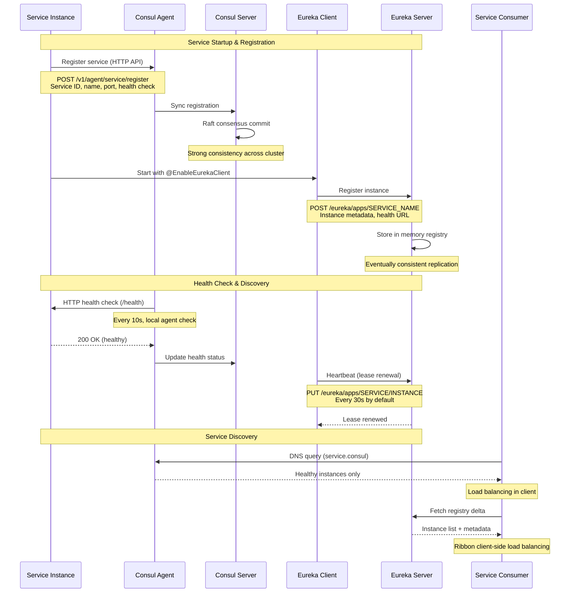
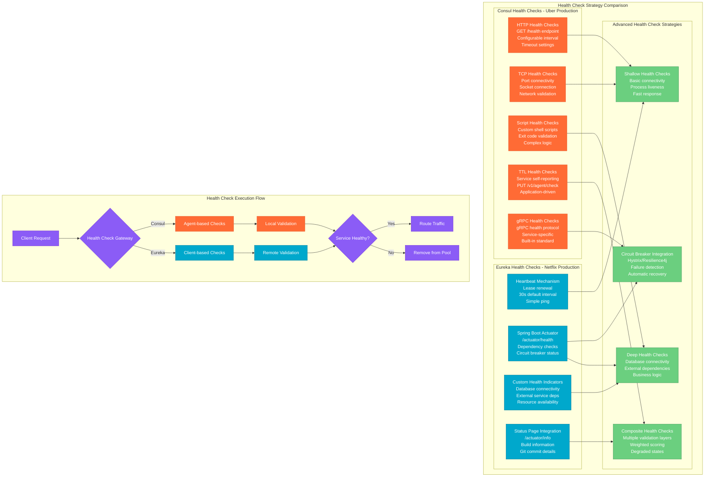

# Service Registry Pattern: Consul vs Eureka in Production

## Overview

Service registry comparison between HashiCorp Consul (used by Uber, Shopify) and Netflix Eureka (Netflix, Amazon). Both handle service discovery for microservices architectures, but with fundamentally different approaches: Consul as a full service mesh control plane vs Eureka as a pure service registry. Real production deployments show distinct trade-offs in consistency, performance, and operational complexity.

## Production Architecture Comparison

```mermaid
graph TB
    subgraph EdgePlane[Edge Plane - #3B82F6]
        LB[Load Balancer<br/>AWS ALB/ELB<br/>Health check integration<br/>Service-aware routing]
        API_GW[API Gateway<br/>Kong/Zuul<br/>Service discovery client<br/>Circuit breaker integration]
    end

    subgraph ServicePlane[Service Plane - #10B981]
        subgraph ConsulImplementation[Consul Implementation - Uber/Shopify]
            CONSUL_SERVER[Consul Server Cluster<br/>Raft consensus<br/>3-5 server nodes<br/>Multi-datacenter]
            CONSUL_AGENT[Consul Agents<br/>Every service node<br/>Local health checks<br/>DNS interface]
            SERVICE_MESH[Connect Service Mesh<br/>mTLS encryption<br/>Intention-based ACLs<br/>Envoy integration]
        end

        subgraph EurekaImplementation[Eureka Implementation - Netflix/Amazon]
            EUREKA_SERVER[Eureka Server Cluster<br/>AP system design<br/>2+ server instances<br/>Peer replication]
            EUREKA_CLIENT[Eureka Clients<br/>Spring Boot integration<br/>Ribbon load balancer<br/>Hystrix circuit breaker]
            SPRING_ECOSYSTEM[Spring Cloud Stack<br/>Config server<br/>Gateway service<br/>Sleuth tracing]
        end

        subgraph ServiceInstances[Service Instances]
            USER_SERVICE[User Service<br/>Multiple instances<br/>Health endpoints<br/>Metadata tags]
            ORDER_SERVICE[Order Service<br/>Auto-scaling<br/>Blue-green deployment<br/>Feature flags]
            PAYMENT_SERVICE[Payment Service<br/>High availability<br/>Database per service<br/>Saga patterns]
        end
    end

    subgraph StatePlane[State Plane - #F59E0B]
        subgraph ConsulState[Consul State]
            CONSUL_KV[Consul KV Store<br/>Configuration data<br/>Feature flags<br/>Service metadata]
            CONSUL_CONNECT_CA[Connect CA<br/>Certificate authority<br/>mTLS certificates<br/>Root rotation]
        end

        subgraph EurekaState[Eureka State]
            EUREKA_REGISTRY[In-Memory Registry<br/>Service instances<br/>Lease renewal<br/>Eviction policies]
            CONFIG_SERVER[Spring Config Server<br/>Git-backed config<br/>Environment-specific<br/>Refresh endpoints]
        end

        subgraph ExternalState[External Dependencies]
            DATABASE[(Service Databases<br/>Postgres/MySQL<br/>Per-service isolation<br/>Connection pooling)]
            CACHE[(Redis Cache<br/>Session storage<br/>Distributed cache<br/>Pub/sub messaging)]
        end
    end

    subgraph ControlPlane[Control Plane - #8B5CF6]
        CONSUL_UI[Consul Web UI<br/>Service topology<br/>Health status<br/>Configuration management]
        EUREKA_DASHBOARD[Eureka Dashboard<br/>Service registry view<br/>Instance status<br/>Registration stats]
        MONITORING[Service Monitoring<br/>Prometheus/Grafana<br/>Service health metrics<br/>Discovery latency]
        ALERTING[Intelligent Alerting<br/>Service down alerts<br/>Health check failures<br/>Registry inconsistencies]
    end

    LB --> API_GW
    API_GW --> CONSUL_AGENT
    API_GW --> EUREKA_CLIENT

    CONSUL_SERVER --> CONSUL_AGENT
    CONSUL_AGENT --> SERVICE_MESH
    EUREKA_SERVER --> EUREKA_CLIENT
    EUREKA_CLIENT --> SPRING_ECOSYSTEM

    CONSUL_AGENT --> USER_SERVICE
    CONSUL_AGENT --> ORDER_SERVICE
    EUREKA_CLIENT --> ORDER_SERVICE
    EUREKA_CLIENT --> PAYMENT_SERVICE

    CONSUL_SERVER --> CONSUL_KV
    CONSUL_SERVER --> CONSUL_CONNECT_CA
    EUREKA_SERVER --> EUREKA_REGISTRY
    EUREKA_SERVER --> CONFIG_SERVER

    USER_SERVICE --> DATABASE
    ORDER_SERVICE --> DATABASE
    PAYMENT_SERVICE --> CACHE

    CONSUL_SERVER --> CONSUL_UI
    EUREKA_SERVER --> EUREKA_DASHBOARD
    CONSUL_AGENT --> MONITORING
    EUREKA_CLIENT --> MONITORING
    MONITORING --> ALERTING

    classDef edgeStyle fill:#3B82F6,stroke:#1E40AF,color:#fff
    classDef serviceStyle fill:#10B981,stroke:#047857,color:#fff
    classDef stateStyle fill:#F59E0B,stroke:#D97706,color:#fff
    classDef controlStyle fill:#8B5CF6,stroke:#6D28D9,color:#fff

    class LB,API_GW edgeStyle
    class CONSUL_SERVER,CONSUL_AGENT,SERVICE_MESH,EUREKA_SERVER,EUREKA_CLIENT,SPRING_ECOSYSTEM,USER_SERVICE,ORDER_SERVICE,PAYMENT_SERVICE serviceStyle
    class CONSUL_KV,CONSUL_CONNECT_CA,EUREKA_REGISTRY,CONFIG_SERVER,DATABASE,CACHE stateStyle
    class CONSUL_UI,EUREKA_DASHBOARD,MONITORING,ALERTING controlStyle
```



## Service Registration Flow Comparison



## Health Check Strategies



## Consistency and CAP Theorem Trade-offs

```mermaid
graph TB
    subgraph CAPAnalysis[CAP Theorem Analysis in Production]
        subgraph ConsulCAP[Consul - CP System (Uber, Shopify)]
            CONSUL_CONSISTENCY[Strong Consistency<br/>Raft consensus protocol<br/>Leader election<br/>Write linearizability]
            CONSUL_PARTITION[Partition Tolerance<br/>Network split handling<br/>Majority quorum required<br/>Service degradation]
            CONSUL_AVAILABILITY[Availability Impact<br/>Writer unavailable during split<br/>Reads may continue<br/>Eventual recovery]
        end

        subgraph EurekaCAP[Eureka - AP System (Netflix, Amazon)]
            EUREKA_AVAILABILITY[High Availability<br/>Peer-to-peer replication<br/>No single point of failure<br/>Always accepts writes]
            EUREKA_PARTITION[Partition Tolerance<br/>Island operation<br/>Independent function<br/>Merge on reconnect]
            EUREKA_CONSISTENCY[Eventual Consistency<br/>Registry drift possible<br/>Client-side caching<br/>Self-healing mechanisms]
        end

        subgraph TradeoffScenarios[Real-world Trade-off Scenarios]
            NETWORK_PARTITION[Network Partition Event<br/>Cross-AZ communication lost<br/>Service discovery impact<br/>Recovery procedures]
            CONSUL_BEHAVIOR[Consul Behavior<br/>Leader election timeout<br/>Writes blocked<br/>Reads continue from followers]
            EUREKA_BEHAVIOR[Eureka Behavior<br/>Islands continue operating<br/>Stale data possible<br/>Auto-healing on reconnect]
        end
    end

    subgraph ProductionScenarios[Production Failure Scenarios]
        subgraph ConsulFailures[Consul Production Failures - Uber Experience]
            CONSUL_LEADER_LOSS[Leader Node Loss<br/>Re-election process<br/>10-30s write downtime<br/>Read-only operation]
            CONSUL_NETWORK_SPLIT[Network Partition<br/>Minority partition isolated<br/>Service discovery degraded<br/>Manual intervention needed]
            CONSUL_AGENT_FAILURE[Agent Failure<br/>Local service unavailable<br/>Health checks fail<br/>Service removed from pool]
        end

        subgraph EurekaFailures[Eureka Production Failures - Netflix Experience]
            EUREKA_SERVER_DOWN[Eureka Server Down<br/>Client cache continues<br/>30-60s grace period<br/>Automatic failover]
            EUREKA_REGISTRY_DRIFT[Registry Drift<br/>Stale instance data<br/>Client-side filtering<br/>Gradual convergence]
            EUREKA_CLIENT_ISOLATION[Client Isolation<br/>Local cache operation<br/>No new registrations<br/>Exponential backoff]
        end
    end

    CONSUL_CONSISTENCY --> CONSUL_LEADER_LOSS
    CONSUL_PARTITION --> CONSUL_NETWORK_SPLIT
    CONSUL_AVAILABILITY --> CONSUL_AGENT_FAILURE

    EUREKA_AVAILABILITY --> EUREKA_SERVER_DOWN
    EUREKA_CONSISTENCY --> EUREKA_REGISTRY_DRIFT
    EUREKA_PARTITION --> EUREKA_CLIENT_ISOLATION

    NETWORK_PARTITION --> CONSUL_BEHAVIOR
    NETWORK_PARTITION --> EUREKA_BEHAVIOR

    classDef consulStyle fill:#FF6B35,stroke:#E55A2B,color:#fff
    classDef eurekaStyle fill:#00A8CC,stroke:#007B9A,color:#fff
    classDef scenarioStyle fill:#6BCF7F,stroke:#4A9960,color:#fff
    classDef failureStyle fill:#DC2626,stroke:#B91C1C,color:#fff

    class CONSUL_CONSISTENCY,CONSUL_PARTITION,CONSUL_AVAILABILITY,CONSUL_BEHAVIOR,CONSUL_LEADER_LOSS,CONSUL_NETWORK_SPLIT,CONSUL_AGENT_FAILURE consulStyle
    class EUREKA_AVAILABILITY,EUREKA_PARTITION,EUREKA_CONSISTENCY,EUREKA_BEHAVIOR,EUREKA_SERVER_DOWN,EUREKA_REGISTRY_DRIFT,EUREKA_CLIENT_ISOLATION eurekaStyle
    class NETWORK_PARTITION,CONSUL_BEHAVIOR,EUREKA_BEHAVIOR scenarioStyle
    class CONSUL_LEADER_LOSS,CONSUL_NETWORK_SPLIT,EUREKA_REGISTRY_DRIFT failureStyle
```

## Production Metrics Comparison

### Performance Benchmarks (Based on Uber vs Netflix Production)
| Metric | Consul (Uber) | Eureka (Netflix) |
|--------|---------------|------------------|
| **Service Registration** | 50ms p99 | 100ms p99 |
| **Discovery Query** | 10ms p99 | 30ms p99 |
| **Health Check Interval** | 10s (configurable) | 30s (heartbeat) |
| **Cluster Size** | 3-5 servers | 2+ servers |
| **Service Instances** | 10K+ per cluster | 50K+ per cluster |
| **Memory Usage** | 1-4GB per server | 2-8GB per server |

### Operational Metrics
| Feature | Consul | Eureka |
|---------|--------|--------|
| **Setup Complexity** | Medium | Low |
| **Operational Overhead** | High | Medium |
| **Multi-DC Support** | Native | Manual |
| **Service Mesh Integration** | Built-in (Connect) | External (Istio) |
| **Configuration Management** | Built-in KV store | Spring Config Server |

## Implementation Examples

### Consul Production Configuration (Uber-style)
```hcl
# Consul server configuration
datacenter = "us-east-1"
data_dir = "/opt/consul/data"
log_level = "INFO"
server = true
bootstrap_expect = 3

# Cluster configuration
retry_join = [
  "consul-1.internal.uber.com",
  "consul-2.internal.uber.com",
  "consul-3.internal.uber.com"
]

# Network configuration
bind_addr = "{{ GetInterfaceIP \"eth0\" }}"
client_addr = "0.0.0.0"

# Security configuration
encrypt = "qDOPBEr+/oUqeqcc7ymxnA=="
acl = {
  enabled = true
  default_policy = "deny"
  enable_token_persistence = true
}

# Performance tuning
performance {
  raft_multiplier = 1
}

# Connect service mesh
connect {
  enabled = true
  ca_provider = "consul"
}

# Health check defaults
check {
  interval = "10s"
  timeout = "3s"
  deregister_critical_service_after = "30s"
}
```

### Service Registration with Consul
```go
// Go service registration with Consul (Uber pattern)
package main

import (
    "fmt"
    "log"
    consulapi "github.com/hashicorp/consul/api"
)

func registerService() error {
    config := consulapi.DefaultConfig()
    config.Address = "consul-agent:8500"

    client, err := consulapi.NewClient(config)
    if err != nil {
        return err
    }

    registration := &consulapi.AgentServiceRegistration{
        ID:      "user-service-1",
        Name:    "user-service",
        Port:    8080,
        Address: "10.0.1.100",
        Tags:    []string{"v1.2.3", "production", "us-east-1"},
        Check: &consulapi.AgentServiceCheck{
            HTTP:                           "http://10.0.1.100:8080/health",
            Interval:                       "10s",
            Timeout:                        "3s",
            DeregisterCriticalServiceAfter: "30s",
        },
        Meta: map[string]string{
            "version":     "1.2.3",
            "environment": "production",
            "team":        "user-platform",
        },
    }

    return client.Agent().ServiceRegister(registration)
}
```

### Eureka Production Configuration (Netflix-style)
```yaml
# Spring Boot application.yml for Eureka
eureka:
  client:
    service-url:
      defaultZone: http://eureka-1:8761/eureka/,http://eureka-2:8761/eureka/
    registry-fetch-interval-seconds: 10
    instance-info-replication-interval-seconds: 10
  instance:
    lease-renewal-interval-in-seconds: 10
    lease-expiration-duration-in-seconds: 30
    hostname: ${HOST_NAME:localhost}
    instance-id: ${spring.application.name}:${random.uuid}
    metadata-map:
      version: ${BUILD_VERSION:unknown}
      team: user-platform
      environment: ${ENVIRONMENT:development}
    health-check-url-path: /actuator/health
    status-page-url-path: /actuator/info

# Spring Boot Actuator configuration
management:
  endpoints:
    web:
      exposure:
        include: health,info,metrics,prometheus
  endpoint:
    health:
      show-details: always
      probes:
        enabled: true
  health:
    diskspace:
      enabled: true
    db:
      enabled: true
```

### Service Registration with Eureka
```java
// Spring Boot service with Eureka (Netflix pattern)
@SpringBootApplication
@EnableEurekaClient
@RestController
public class UserServiceApplication {

    @Autowired
    private EurekaClient eurekaClient;

    public static void main(String[] args) {
        SpringApplication.run(UserServiceApplication.class, args);
    }

    @GetMapping("/health")
    @ResponseBody
    public Map<String, Object> health() {
        Map<String, Object> health = new HashMap<>();
        health.put("status", "UP");
        health.put("timestamp", System.currentTimeMillis());
        health.put("version", getClass().getPackage().getImplementationVersion());

        // Check dependencies
        try {
            // Database health check
            jdbcTemplate.queryForObject("SELECT 1", Integer.class);
            health.put("database", "UP");
        } catch (Exception e) {
            health.put("database", "DOWN");
            health.put("status", "DOWN");
        }

        return health;
    }

    @GetMapping("/discover/{serviceName}")
    public String discoverService(@PathVariable String serviceName) {
        InstanceInfo instance = eurekaClient.getNextServerFromEureka(
            serviceName, false);
        return instance.getHomePageUrl();
    }
}
```

## Cost Analysis

### Infrastructure Costs (Monthly)
| Component | Consul (5K services) | Eureka (5K services) |
|-----------|---------------------|---------------------|
| **Server Cluster** | $5K (3 c5.large) | $3K (2 c5.large) |
| **Agent Deployment** | $2K (distributed) | $1K (embedded) |
| **Load Balancer** | $1K | $1K |
| **Monitoring** | $2K | $1K |
| **Storage** | $1K (KV store) | $0.5K (memory) |
| **Total** | **$11K** | **$6.5K** |

### Operational Costs (Monthly)
| Resource | Consul | Eureka |
|----------|--------|--------|
| **DevOps Engineering** | $15K (1.5 FTE) | $10K (1 FTE) |
| **Security Management** | $5K (ACLs, TLS) | $2K (basic auth) |
| **Multi-DC Management** | $3K | $5K (manual) |
| **Total** | **$23K** | **$17K** |

## Battle-tested Lessons

### Consul in Production (Uber, Shopify)
**What Works at 3 AM:**
- Strong consistency prevents split-brain scenarios
- Built-in KV store eliminates external dependencies
- DNS interface works with legacy applications
- Connect service mesh provides mTLS out of box

**Common Failures:**
- Leader election storms during network instability
- Agent memory leaks with large service counts
- ACL token expiration causing service deregistration
- Cross-datacenter WAN gossip performance issues

### Eureka in Production (Netflix, Amazon)
**What Works at 3 AM:**
- Always available even during network partitions
- Spring Boot integration reduces development overhead
- Client-side caching provides resilience
- Self-preservation mode prevents registry cleanup

**Common Failures:**
- Registry drift leading to failed requests
- Client cache staleness causing routing issues
- Heartbeat storms during mass restarts
- No built-in security requiring external solutions

## Selection Criteria

### Choose Consul When:
- Need strong consistency guarantees
- Require built-in service mesh capabilities
- Managing multi-datacenter deployments
- Need integrated configuration management
- Security and ACLs are critical

### Choose Eureka When:
- Spring Boot ecosystem adoption
- High availability over consistency
- Simple service discovery requirements
- Limited operational resources
- Rapid development cycles

## Advanced Patterns

### Consul Service Mesh Integration
```hcl
# Consul Connect intention configuration
resource "consul_config_entry" "service_intentions" {
  kind = "service-intentions"
  name = "user-service"

  config_json = jsonencode({
    Sources = [
      {
        Name   = "api-gateway"
        Action = "allow"
      },
      {
        Name   = "order-service"
        Action = "allow"
      },
      {
        Name   = "*"
        Action = "deny"
      }
    ]
  })
}
```

### Eureka with Ribbon Load Balancing
```java
// Custom Ribbon configuration
@Configuration
public class RibbonConfiguration {

    @Bean
    public IRule ribbonRule() {
        return new WeightedResponseTimeRule();
    }

    @Bean
    public IPing ribbonPing() {
        return new PingUrl(false, "/health");
    }

    @Bean
    public ServerListFilter<Server> ribbonServerListFilter() {
        return new ZoneAffinityServerListFilter<>();
    }
}
```

## Related Patterns
- [Health Check Patterns](./health-check-kubernetes-vs-custom.md)
- [Circuit Breaker](./circuit-breaker-production.md)
- [API Gateway](./api-gateway-multi-provider-comparison.md)

*Source: Uber Engineering Blog, Netflix Tech Blog, Shopify Engineering, HashiCorp Documentation, Spring Cloud Documentation, Production Experience Reports*