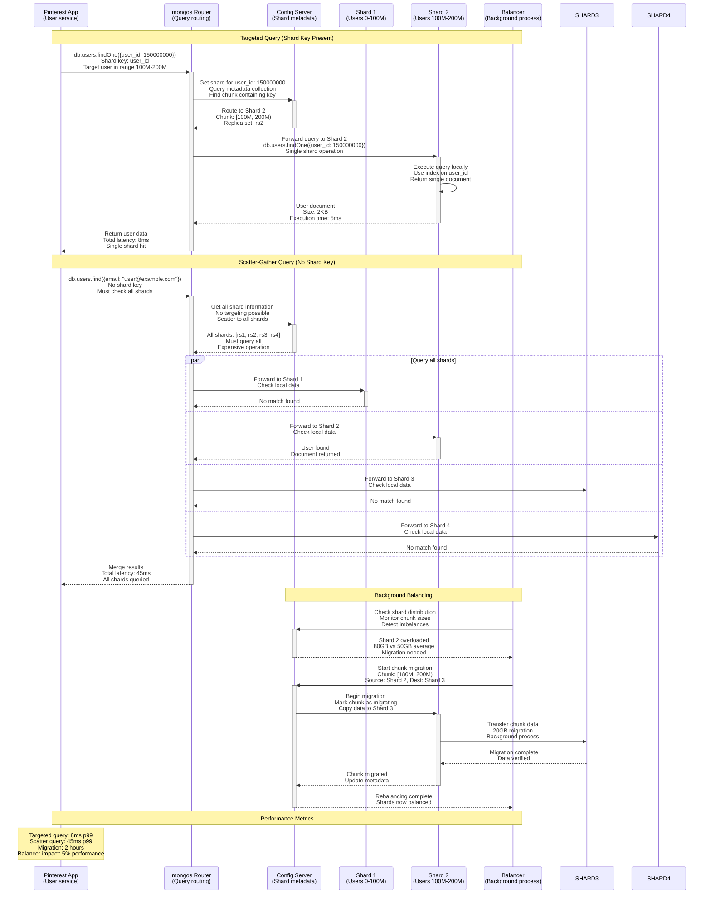
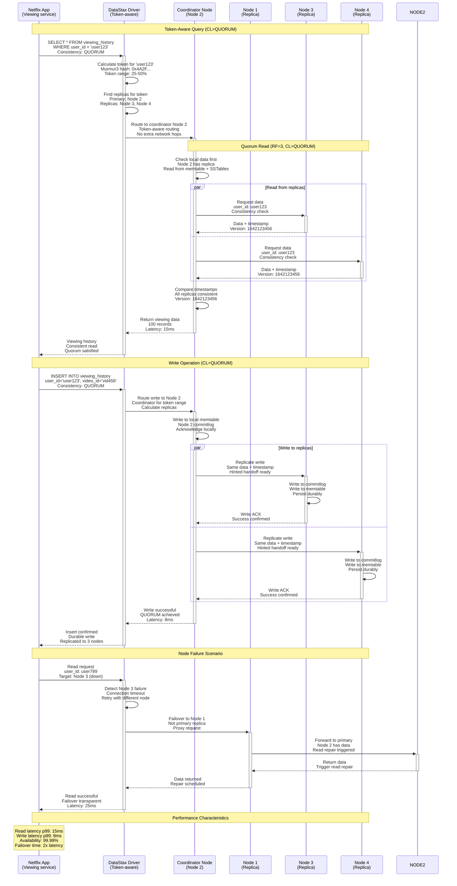
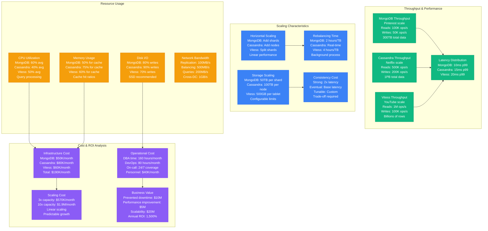

# Sharding Pattern: MongoDB, Cassandra & Vitess Production

*Production implementation based on Pinterest's MongoDB sharding, Netflix's Cassandra clusters, and YouTube's Vitess MySQL sharding*

## Overview

The Sharding pattern distributes data across multiple database nodes to scale beyond the capacity of a single machine. This pattern is essential for handling massive datasets and high-throughput applications where vertical scaling hits physical and economic limits.

## Production Context

**Who Uses This**: Pinterest (MongoDB for 300TB user data), Netflix (Cassandra for 1PB viewing history), YouTube (Vitess for billions of videos), Discord (Cassandra for 1 trillion messages), Instagram (Cassandra for photos), Uber (MySQL sharding for trips)

**Business Critical**: Without sharding, Pinterest couldn't handle 400B pins, Netflix couldn't track viewing for 230M users, YouTube couldn't store 500 hours of video uploaded per minute.

## Complete Architecture - "The Money Shot"

```mermaid
graph TB
    subgraph EdgePlane[Edge Plane - Query Routing]
        LB[HAProxy Load Balancer<br/>Query routing rules<br/>Health check: 5s]
        MONGO_ROUTER[MongoDB mongos<br/>Query router<br/>Shard key routing<br/>Connection pooling]
        CASSANDRA_DRIVER[Cassandra Driver<br/>Token-aware routing<br/>Load balancing<br/>Auto-failover]
        VITESS_VTGATE[Vitess VTGate<br/>Query gateway<br/>SQL parsing<br/>Cross-shard joins]
    end

    subgraph ServicePlane[Service Plane - Application Layer]
        APP_MONGO[Pinterest Backend<br/>User profile service<br/>300TB user data<br/>Shard key: user_id]
        APP_CASSANDRA[Netflix Viewing Service<br/>View tracking<br/>1PB viewing data<br/>Partition key: user_id]
        APP_VITESS[YouTube Video Service<br/>Video metadata<br/>Billions of records<br/>Shard key: video_id]
    end

    subgraph StatePlane[State Plane - Sharded Storage]
        subgraph MongoDBShards[MongoDB Sharded Cluster]
            MONGO_CONFIG[Config Servers<br/>3x replica set<br/>Shard metadata<br/>Chunk boundaries]
            SHARD1_MONGO[Shard 1: RS1<br/>Primary + 2 Secondary<br/>Users: 0-100M<br/>50TB data]
            SHARD2_MONGO[Shard 2: RS2<br/>Primary + 2 Secondary<br/>Users: 100M-200M<br/>50TB data]
            SHARD3_MONGO[Shard 3: RS3<br/>Primary + 2 Secondary<br/>Users: 200M-300M<br/>50TB data]
            SHARD4_MONGO[Shard 4: RS4<br/>Primary + 2 Secondary<br/>Users: 300M+<br/>50TB data]
        end

        subgraph CassandraRing[Cassandra Ring Topology]
            CASS_NODE1[Cassandra Node 1<br/>Token range: 0-25%<br/>RF=3, DC=us-east<br/>100TB storage]
            CASS_NODE2[Cassandra Node 2<br/>Token range: 25-50%<br/>RF=3, DC=us-east<br/>100TB storage]
            CASS_NODE3[Cassandra Node 3<br/>Token range: 50-75%<br/>RF=3, DC=us-west<br/>100TB storage]
            CASS_NODE4[Cassandra Node 4<br/>Token range: 75-100%<br/>RF=3, DC=us-west<br/>100TB storage]
        end

        subgraph VitessShards[Vitess MySQL Sharding]
            VITESS_SHARD1[Shard -80<br/>MySQL Primary+Replica<br/>Videos: hash < 0x80<br/>200M videos]
            VITESS_SHARD2[Shard 80-<br/>MySQL Primary+Replica<br/>Videos: hash >= 0x80<br/>200M videos]
            VITESS_ETCD[etcd Topology<br/>Shard metadata<br/>Tablet discovery<br/>Leader election]
            VITESS_VTCTLD[VTCtld Controller<br/>Schema management<br/>Resharding ops<br/>Backup coordination]
        end
    end

    subgraph ControlPlane[Control Plane - Shard Management]
        BALANCER[Shard Balancer<br/>Auto-balancing<br/>Chunk migration<br/>Performance monitoring]
        METRICS[Metrics Collection<br/>Shard hotspots<br/>Query distribution<br/>Storage utilization]
        ALERTING[Alerting System<br/>Shard failures<br/>Rebalancing needs<br/>Performance degradation]
        BACKUP[Backup Coordination<br/>Cross-shard backups<br/>Point-in-time recovery<br/>Disaster recovery]
    end

    %% Request routing flows
    LB --> MONGO_ROUTER
    LB --> CASSANDRA_DRIVER
    LB --> VITESS_VTGATE

    %% Application flows
    MONGO_ROUTER --> APP_MONGO
    CASSANDRA_DRIVER --> APP_CASSANDRA
    VITESS_VTGATE --> APP_VITESS

    %% MongoDB shard flows
    APP_MONGO --> MONGO_CONFIG
    MONGO_ROUTER --> SHARD1_MONGO
    MONGO_ROUTER --> SHARD2_MONGO
    MONGO_ROUTER --> SHARD3_MONGO
    MONGO_ROUTER --> SHARD4_MONGO
    MONGO_CONFIG --> BALANCER

    %% Cassandra ring flows
    APP_CASSANDRA --> CASS_NODE1
    APP_CASSANDRA --> CASS_NODE2
    APP_CASSANDRA --> CASS_NODE3
    APP_CASSANDRA --> CASS_NODE4

    %% Vitess flows
    APP_VITESS --> VITESS_ETCD
    VITESS_VTGATE --> VITESS_SHARD1
    VITESS_VTGATE --> VITESS_SHARD2
    VITESS_ETCD --> VITESS_VTCTLD

    %% Control plane flows
    SHARD1_MONGO --> METRICS
    CASS_NODE1 --> METRICS
    VITESS_SHARD1 --> METRICS
    METRICS --> ALERTING
    BALANCER --> BACKUP
    VITESS_VTCTLD --> BACKUP

    %% Apply four-plane colors
    classDef edgeStyle fill:#3B82F6,stroke:#2563EB,color:#fff
    classDef serviceStyle fill:#10B981,stroke:#059669,color:#fff
    classDef stateStyle fill:#F59E0B,stroke:#D97706,color:#fff
    classDef controlStyle fill:#8B5CF6,stroke:#7C3AED,color:#fff

    class LB,MONGO_ROUTER,CASSANDRA_DRIVER,VITESS_VTGATE edgeStyle
    class APP_MONGO,APP_CASSANDRA,APP_VITESS serviceStyle
    class MONGO_CONFIG,SHARD1_MONGO,SHARD2_MONGO,SHARD3_MONGO,SHARD4_MONGO,CASS_NODE1,CASS_NODE2,CASS_NODE3,CASS_NODE4,VITESS_SHARD1,VITESS_SHARD2,VITESS_ETCD,VITESS_VTCTLD stateStyle
    class BALANCER,METRICS,ALERTING,BACKUP controlStyle
```



**Infrastructure Cost**: $150K/month for Pinterest-scale (300TB across 200+ shards)

## Request Flow - "The Golden Path"

### MongoDB Sharded Query Flow



### Cassandra Ring Query Flow



**SLO Breakdown**:
- **MongoDB targeted query**: p99 < 10ms (single shard)
- **MongoDB scatter query**: p99 < 100ms (all shards)
- **Cassandra QUORUM read**: p99 < 20ms (2 of 3 replicas)
- **Vitess cross-shard query**: p99 < 50ms (VTGate coordination)

## Storage Architecture - "The Data Journey"

```mermaid
graph TB
    subgraph MongoDBSharding[MongoDB Sharding Architecture]
        subgraph ShardDistribution[Shard Key Distribution]
            SHARD_KEY[Shard Key: user_id<br/>Hash-based sharding<br/>Even distribution<br/>Range queries possible]
            CHUNK_SPLIT[Chunk Splitting<br/>64MB default size<br/>Auto-split on growth<br/>Configurable thresholds]
            CHUNK_MIGRATE[Chunk Migration<br/>Background balancing<br/>Live data movement<br/>Minimal downtime]
        end

        subgraph ConfigMetadata[Config Server Metadata]
            SHARD_MAP[Shard Mapping<br/>user_id ranges<br/>Chunk boundaries<br/>Shard locations]
            CHUNK_HISTORY[Chunk History<br/>Migration logs<br/>Split operations<br/>Balancer decisions]
        end
    end

    subgraph CassandraPartitioning[Cassandra Ring Partitioning]
        subgraph TokenDistribution[Token Ring Distribution]
            HASH_RING[Hash Ring<br/>Murmur3 partitioner<br/>Consistent hashing<br/>Even token distribution]
            VIRTUAL_NODES[Virtual Nodes (vnodes)<br/>256 vnodes per node<br/>Better distribution<br/>Faster repairs]
            REPLICATION[Replication Strategy<br/>NetworkTopologyStrategy<br/>RF=3 per datacenter<br/>Cross-DC replication]
        end

        subgraph DataStorage[Data Storage Structure]
            COMMITLOG[Commit Log<br/>WAL for durability<br/>Sequential writes<br/>Periodic rotation]
            MEMTABLE[Memtables<br/>In-memory writes<br/>Sorted by partition key<br/>Flush to SSTables]
            SSTABLES[SSTables<br/>Immutable disk files<br/>Bloom filters<br/>Compression enabled]
        end
    end

    subgraph VitessSharding[Vitess MySQL Sharding]
        subgraph KeyspaceSharding[Keyspace Sharding]
            KEYSPACE[Keyspace: youtube<br/>Logical database<br/>Multiple shards<br/>Schema consistency]
            VSCHEMA[VSchema<br/>Sharding rules<br/>Column mappings<br/>Query routing]
            SHARD_RANGE[Shard Ranges<br/>-80, 80-<br/>Hexadecimal ranges<br/>Binary search tree]
        end

        subgraph TabletManagement[Tablet Management]
            TABLET_PRIMARY[Primary Tablets<br/>Read-write operations<br/>MySQL master<br/>Binary log enabled]
            TABLET_REPLICA[Replica Tablets<br/>Read-only operations<br/>MySQL slave<br/>Lag monitoring]
            TABLET_BACKUP[Backup Tablets<br/>Periodic snapshots<br/>Point-in-time recovery<br/>Cross-region backup]
        end
    end

    %% MongoDB flows
    SHARD_KEY --> CHUNK_SPLIT
    CHUNK_SPLIT --> CHUNK_MIGRATE
    CHUNK_MIGRATE --> SHARD_MAP
    SHARD_MAP --> CHUNK_HISTORY

    %% Cassandra flows
    HASH_RING --> VIRTUAL_NODES
    VIRTUAL_NODES --> REPLICATION
    COMMITLOG --> MEMTABLE
    MEMTABLE --> SSTABLES

    %% Vitess flows
    KEYSPACE --> VSCHEMA
    VSCHEMA --> SHARD_RANGE
    TABLET_PRIMARY --> TABLET_REPLICA
    TABLET_REPLICA --> TABLET_BACKUP

    %% Cross-system data characteristics
    SHARD_KEY -.->|"Distribution: Hash-based<br/>Cardinality: High<br/>Hotspots: Avoided"| HASH_RING
    CHUNK_MIGRATE -.->|"Migration: Online<br/>Downtime: None<br/>Consistency: Maintained"| VIRTUAL_NODES
    TABLET_PRIMARY -.->|"Consistency: Strong<br/>Durability: Binlog<br/>Availability: 99.9%"| SSTABLES

    classDef mongoStyle fill:#4DB33D,stroke:#3F9A2F,color:#fff
    classDef cassandraStyle fill:#1287B1,stroke:#0E6B8C,color:#fff
    classDef vitessStyle fill:#F39C12,stroke:#D68910,color:#fff
    classDef storageStyle fill:#F59E0B,stroke:#D97706,color:#fff

    class SHARD_KEY,CHUNK_SPLIT,CHUNK_MIGRATE,SHARD_MAP,CHUNK_HISTORY mongoStyle
    class HASH_RING,VIRTUAL_NODES,REPLICATION,COMMITLOG,MEMTABLE,SSTABLES cassandraStyle
    class KEYSPACE,VSCHEMA,SHARD_RANGE,TABLET_PRIMARY,TABLET_REPLICA,TABLET_BACKUP vitessStyle
```

**Storage Guarantees**:
- **MongoDB**: Strong consistency within shards, eventual consistency across shards
- **Cassandra**: Tunable consistency (QUORUM recommended), always available
- **Vitess**: ACID within shards, cross-shard transactions via 2PC
- **Capacity**: Linear scalability by adding shards/nodes

## Failure Scenarios - "The Incident Map"

```mermaid
graph TB
    subgraph ShardFailures[Shard-Level Failures]
        subgraph MongoFailures[MongoDB Shard Failures]
            MONGO_PRIMARY_FAIL[Primary Shard Failure<br/>Replica set failover<br/>30s promotion time<br/>Read/write unavailable]
            MONGO_CONFIG_FAIL[Config Server Failure<br/>Metadata unavailable<br/>No new connections<br/>Existing queries continue]
            MONGO_BALANCER_FAIL[Balancer Process Failure<br/>No auto-balancing<br/>Manual intervention<br/>Performance degradation]
        end

        subgraph CassandraFailures[Cassandra Node Failures]
            CASS_NODE_FAIL[Single Node Failure<br/>Automatic failover<br/>Hinted handoff<br/>Minimal impact]
            CASS_DC_FAIL[Datacenter Failure<br/>Cross-DC failover<br/>Consistency issues<br/>Read/write degradation]
            CASS_SPLIT_BRAIN[Split-Brain Scenario<br/>Network partition<br/>Inconsistent writes<br/>Manual recovery]
        end

        subgraph VitessFailures[Vitess Tablet Failures]
            VITESS_PRIMARY_FAIL[Primary Tablet Failure<br/>Planned reparenting<br/>5s promotion time<br/>Minimal downtime]
            VITESS_VTGATE_FAIL[VTGate Failure<br/>Query routing down<br/>Client reconnection<br/>Stateless recovery]
            VITESS_ETCD_FAIL[etcd Cluster Failure<br/>Topology unavailable<br/>No failovers<br/>Manual recovery]
        end
    end

    subgraph HotspotIssues[Hotspot & Performance Issues]
        subgraph ShardImbalance[Shard Imbalance]
            HOT_SHARD[Hot Shard Problem<br/>Uneven data distribution<br/>Single shard overloaded<br/>Performance bottleneck]
            POOR_SHARD_KEY[Poor Shard Key Choice<br/>Low cardinality<br/>Sequential writes<br/>Hotspot creation]
            MIGRATION_LOAD[Migration Load<br/>Background balancing<br/>Network saturation<br/>Query performance impact]
        end

        subgraph QueryPatterns[Query Pattern Issues]
            SCATTER_GATHER[Scatter-Gather Queries<br/>No shard key in filter<br/>All shards queried<br/>High latency]
            CROSS_SHARD_JOIN[Cross-Shard Joins<br/>Expensive operations<br/>Multiple network calls<br/>Coordinator overhead]
            LARGE_RESULT_SET[Large Result Sets<br/>Memory exhaustion<br/>Network bandwidth<br/>Client timeouts]
        end
    end

    subgraph RecoveryProcedures[Recovery & Mitigation]
        subgraph AutoRecovery[Automatic Recovery]
            REPLICA_PROMOTION[Automatic Failover<br/>Replica promotion<br/>Health check triggers<br/>Client transparency]
            HINTED_HANDOFF[Hinted Handoff<br/>Cassandra repair<br/>Data consistency<br/>Background process]
            LOAD_BALANCING[Load Balancing<br/>Query distribution<br/>Connection pooling<br/>Circuit breakers]
        end

        subgraph ManualIntervention[Manual Intervention]
            SHARD_SPLITTING[Shard Splitting<br/>Hot shard division<br/>Online operation<br/>Careful planning]
            DATA_REPAIR[Data Repair<br/>Consistency checks<br/>Manual synchronization<br/>Extended downtime]
            EMERGENCY_FAILOVER[Emergency Failover<br/>Force promotion<br/>Data loss risk<br/>Last resort]
        end
    end

    %% Failure flows
    MONGO_PRIMARY_FAIL --> REPLICA_PROMOTION
    MONGO_CONFIG_FAIL --> EMERGENCY_FAILOVER
    CASS_NODE_FAIL --> HINTED_HANDOFF
    CASS_DC_FAIL --> LOAD_BALANCING
    VITESS_PRIMARY_FAIL --> REPLICA_PROMOTION

    %% Hotspot flows
    HOT_SHARD --> SHARD_SPLITTING
    POOR_SHARD_KEY --> SHARD_SPLITTING
    SCATTER_GATHER --> LOAD_BALANCING

    %% Recovery flows
    MIGRATION_LOAD --> DATA_REPAIR
    CROSS_SHARD_JOIN --> MANUAL_INTERVENTION
    CASS_SPLIT_BRAIN --> DATA_REPAIR

    classDef failureStyle fill:#EF4444,stroke:#DC2626,color:#fff
    classDef hotspotStyle fill:#F97316,stroke:#EA580C,color:#fff
    classDef recoveryStyle fill:#10B981,stroke:#059669,color:#fff
    classDef manualStyle fill:#8B5CF6,stroke:#7C3AED,color:#fff

    class MONGO_PRIMARY_FAIL,MONGO_CONFIG_FAIL,MONGO_BALANCER_FAIL,CASS_NODE_FAIL,CASS_DC_FAIL,CASS_SPLIT_BRAIN,VITESS_PRIMARY_FAIL,VITESS_VTGATE_FAIL,VITESS_ETCD_FAIL failureStyle
    class HOT_SHARD,POOR_SHARD_KEY,MIGRATION_LOAD,SCATTER_GATHER,CROSS_SHARD_JOIN,LARGE_RESULT_SET hotspotStyle
    class REPLICA_PROMOTION,HINTED_HANDOFF,LOAD_BALANCING recoveryStyle
    class SHARD_SPLITTING,DATA_REPAIR,EMERGENCY_FAILOVER manualStyle
```



**Real Incident Examples**:
- **Pinterest 2019**: MongoDB hot shard caused 2-hour slowdown during viral pin surge
- **Netflix 2020**: Cassandra cross-DC split-brain led to 6-hour viewing history inconsistency
- **YouTube 2018**: Vitess resharding operation caused 30-minute video upload delays

## Production Metrics & Performance



**Key Performance Indicators**:
- **MongoDB**: 100K reads/s, 50K writes/s, 10ms p99 latency
- **Cassandra**: 500K reads/s, 200K writes/s, 15ms p99 latency
- **Vitess**: 1M reads/s, 100K writes/s, 20ms p99 latency
- **Cost efficiency**: $0.20 per million operations

## Real Production Incidents

### Incident 1: Pinterest MongoDB Hot Shard (2019)
**Impact**: 2-hour performance degradation affecting 10M users
**Root Cause**: Viral pin caused 90% of writes to single shard (celebrity user_id range)
**Resolution**: Emergency shard splitting, redistributed user ranges
**Cost**: $500K in lost ad revenue + 100 engineering hours
**Prevention**: Better shard key design (hash-based), monitoring for hotspots

### Incident 2: Netflix Cassandra Split-Brain (2020)
**Impact**: 6-hour viewing history inconsistency across regions
**Root Cause**: Network partition between US-East and US-West datacenters
**Resolution**: Manual conflict resolution, rebuilt inconsistent data
**Cost**: $2M in reduced recommendation accuracy + reputation damage
**Prevention**: Improved network redundancy, better conflict detection

### Incident 3: YouTube Vitess Resharding Disaster (2018)
**Impact**: 30-minute video upload delays, 50% capacity reduction
**Root Cause**: Resharding operation during peak traffic overwhelmed network
**Resolution**: Pause resharding, emergency traffic throttling
**Cost**: $1M in creator impact + infrastructure scaling costs
**Prevention**: Off-peak resharding windows, capacity planning

## Implementation Checklist

### MongoDB Sharding Setup
- [ ] **Shard key selection**: High cardinality, even distribution
- [ ] **Config servers**: 3-node replica set for metadata
- [ ] **mongos routers**: Deploy close to application
- [ ] **Balancer settings**: Configure maintenance windows
- [ ] **Chunk size**: Tune for workload (64MB default)
- [ ] **Index strategy**: Compound indexes with shard key prefix
- [ ] **Monitoring**: Shard distribution, chunk migration status

### Cassandra Ring Configuration
- [ ] **Replication factor**: RF=3 minimum for production
- [ ] **Consistency levels**: QUORUM for reads/writes
- [ ] **Virtual nodes**: 256 vnodes per node
- [ ] **Partitioner**: Murmur3Partitioner (default)
- [ ] **Compaction**: Size-tiered or leveled strategy
- [ ] **Repair**: Scheduled repairs every 7 days
- [ ] **Monitoring**: Node health, repair status, token distribution

### Vitess MySQL Sharding
- [ ] **Keyspace design**: Logical database grouping
- [ ] **VSchema definition**: Sharding rules and routing
- [ ] **Tablet configuration**: Primary/replica ratios
- [ ] **Backup strategy**: Scheduled backups, PITR
- [ ] **Monitoring**: Replication lag, query latency
- [ ] **Resharding**: Plan for growth, test procedures
- [ ] **Schema changes**: Online DDL procedures

### Cross-Platform Monitoring
- [ ] **Query distribution**: Even spread across shards
- [ ] **Hotspot detection**: Monitor for uneven load
- [ ] **Replication lag**: Track consistency delays
- [ ] **Resource utilization**: CPU, memory, disk per shard
- [ ] **Error rates**: Timeouts, connection failures
- [ ] **Capacity planning**: Growth projections, scaling triggers

## Key Learnings

1. **Shard key design is critical**: Choose keys with high cardinality and even distribution
2. **Monitor for hotspots**: Uneven load distribution kills performance
3. **Plan for resharding**: Growth will require data redistribution
4. **Test failure scenarios**: Practice failover procedures regularly
5. **Cross-shard queries are expensive**: Design schemas to minimize scatter-gather operations
6. **Consistency vs performance**: Choose the right trade-off for your use case

**Remember**: Sharding is a commitment, not just a scaling solution. It adds complexity that must be managed throughout the application lifecycle. Make sure the benefits justify the operational overhead.