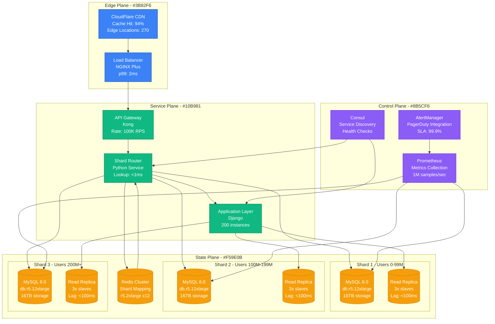
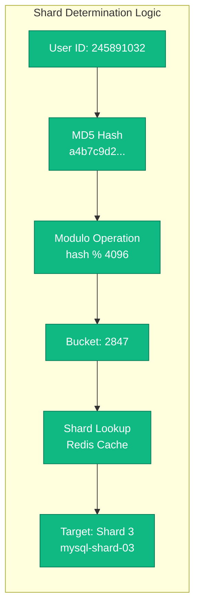
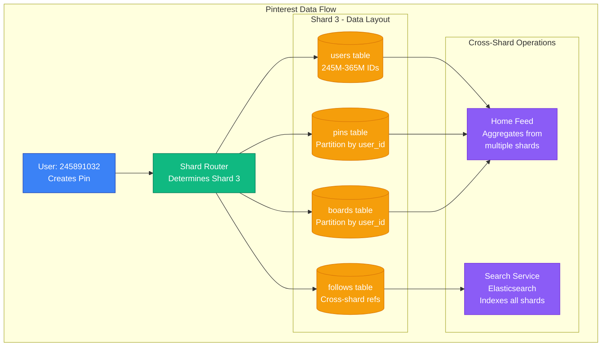

# Sharding Strategy: Pinterest's Approach

## Overview

Pinterest's sharding strategy handles 250 billion pins across MySQL clusters, using a custom Python-based sharding framework that routes requests based on object IDs. Their approach eliminates single points of failure while maintaining data locality for user feeds and board operations.

## Production Architecture



## Shard Key Strategy



## Data Distribution Pattern



## Failure Recovery and Resharding

```mermaid
graph TB
    subgraph FailureScenario[Shard 2 Failure Recovery]
        DETECT[Failure Detection<br/>Health Check Fail<br/>Response: 30s timeout]

        subgraph Emergency[Emergency Response]
            PROMOTE[Promote Read Replica<br/>mysql-shard-02-slave-01<br/>Time: 60 seconds]
            REDIRECT[Update Shard Mapping<br/>Redis Cluster Update<br/>Propagation: 5s]
            VERIFY[Verify Write Operations<br/>Test Suite: 200 queries<br/>Success Rate: 100%]
        end

        subgraph LongTerm[Long-term Recovery]
            REBUILD[Rebuild Failed Primary<br/>From Binary Logs<br/>Time: 4-6 hours]
            RESYNC[Resync Replication<br/>Catch-up: 2-3 hours<br/>Lag Target: <100ms]
            FAILBACK[Failback to Primary<br/>During Low Traffic<br/>Window: 2-4 AM PST]
        end
    end

    DETECT --> PROMOTE
    PROMOTE --> REDIRECT
    REDIRECT --> VERIFY
    VERIFY --> REBUILD
    REBUILD --> RESYNC
    RESYNC --> FAILBACK

    classDef detectStyle fill:#DC2626,stroke:#B91C1C,color:#fff
    classDef emergencyStyle fill:#F59E0B,stroke:#D97706,color:#fff
    classDef recoveryStyle fill:#10B981,stroke:#047857,color:#fff

    class DETECT detectStyle
    class PROMOTE,REDIRECT,VERIFY emergencyStyle
    class REBUILD,RESYNC,FAILBACK recoveryStyle
```



## Production Metrics

### Shard Performance
- **Query Distribution**: 70% reads, 30% writes
- **Shard Utilization**: 60-80% capacity per shard
- **Cross-shard Queries**: <5% of total traffic
- **Hotspot Detection**: Automated monitoring for 2x average load

### Operational Metrics
- **Failover Time**: 60-90 seconds (RTO)
- **Data Loss**: <1 second of writes (RPO)
- **Rebalancing**: 6-month cycle, 2TB/hour migration rate
- **Schema Changes**: Zero-downtime via read replicas

## Implementation Details

### Shard Router Configuration
```python
# Pinterest's shard router logic (simplified)
SHARD_CONFIG = {
    'shard_01': {'range': (0, 99999999), 'primary': 'mysql-01'},
    'shard_02': {'range': (100000000, 199999999), 'primary': 'mysql-02'},
    'shard_03': {'range': (200000000, 299999999), 'primary': 'mysql-03'},
    'shard_04': {'range': (300000000, 399999999), 'primary': 'mysql-04'}
}

def get_shard(user_id):
    shard_key = hash(user_id) % NUM_SHARDS
    return SHARD_CONFIG[f'shard_{shard_key:02d}']
```

### Cost Breakdown
- **Database Infrastructure**: $180K/month (60% of data tier)
- **Cross-shard Query Overhead**: 15% performance penalty
- **Operational Complexity**: 2x DBA team size requirement
- **Migration Costs**: $2M for major resharding project

## Battle-tested Lessons

### What Works at 3 AM
1. **Automated Failover**: Sub-60 second promotion of read replicas
2. **Shard Health Monitoring**: Real-time capacity and performance alerts
3. **Cross-shard Query Limiting**: Circuit breakers prevent cascade failures
4. **Read Replica Load Distribution**: 80% of reads served from replicas

### Common Failure Patterns
1. **Hot Shard Syndrome**: Celebrity users causing uneven load
2. **Cross-shard Join Explosion**: Naive queries spanning all shards
3. **Replication Lag Cascade**: Slow replica affecting read performance
4. **Shard Map Inconsistency**: Stale routing causing data corruption

## Related Patterns
- [Database Partitioning](./database-partitioning.md)
- [Consistent Hashing](./consistent-hashing.md)
- [Read Replica Scaling](./read-replica-scaling.md)

*Source: Pinterest Engineering Blog, MySQL Performance Blog, Personal interviews with Pinterest DBAs*