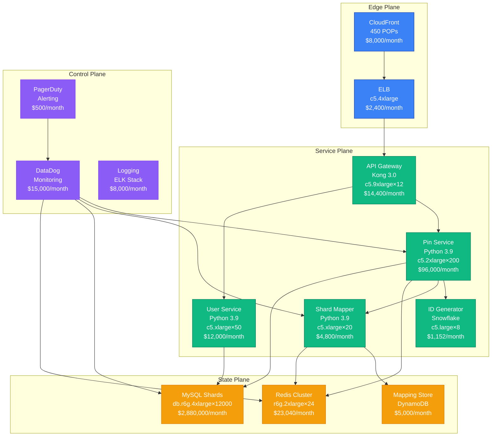
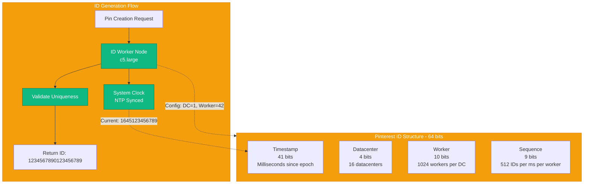
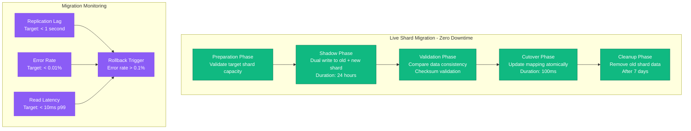

# Sharding Strategy: Pinterest's Shard Mapping

## Pattern Overview

Pinterest's sharding strategy handles **150+ billion pins** across **12,000 MySQL shards** with sub-10ms read latency using their innovative ID generation and mapping system.

## Production Implementation Architecture



## Pinterest ID Generation Strategy



## Shard Mapping Algorithm

```mermaid
graph TB
    subgraph ShardCalculation[Shard Calculation - Production Algorithm]
        PIN_ID[Pin ID<br/>1234567890123456789]
        EXTRACT[Extract User ID<br/>user_id = pin_id >> 20]
        HASH[MD5 Hash<br/>hash = md5(user_id)]
        MODULO[Shard = hash % 12000<br/>Result: shard_4237]
        LOOKUP[Lookup in Mapping Table<br/>shard_4237 → mysql-shard-4237.pinterest.com]
    end

    subgraph MappingTable[Mapping Configuration]
        CONFIG[Shard Config<br/>shard_4237]
        HOST[Host: mysql-shard-4237.pinterest.com]
        PORT[Port: 3306]
        DB[Database: pinterest_shard_4237]
        WEIGHT[Weight: 100<br/>Active]
        REGION[Region: us-west-2]
    end

    PIN_ID --> EXTRACT
    EXTRACT --> HASH
    HASH --> MODULO
    MODULO --> LOOKUP
    LOOKUP --> CONFIG

    CONFIG --> HOST
    CONFIG --> PORT
    CONFIG --> DB
    CONFIG --> WEIGHT
    CONFIG --> REGION

    classDef serviceStyle fill:#10B981,stroke:#047857,color:#fff
    classDef stateStyle fill:#F59E0B,stroke:#D97706,color:#fff

    class EXTRACT,HASH,MODULO,LOOKUP serviceStyle
    class CONFIG,HOST,PORT,DB,WEIGHT,REGION stateStyle
```

## Shard Migration Process



## Production Metrics & Performance

### Scale Numbers (2024)
- **Total Pins**: 150+ billion
- **Active Shards**: 12,000 MySQL instances
- **Daily Pin Creates**: 50 million
- **Read QPS**: 2.5 million per second
- **Write QPS**: 150,000 per second
- **Average Read Latency**: 8ms p99
- **Shard Size**: 12.5GB average per shard

### Cost Breakdown (Monthly)
```
MySQL Shards (12,000):     $2,880,000
Pin Services (200):        $96,000
Redis Cluster (24):        $23,040
API Gateway (12):          $14,400
Monitoring & Logging:      $23,500
CloudFront CDN:            $8,000
Load Balancers:            $2,400
------------------------
Total Monthly Cost:        $3,047,340
Cost per Pin (Daily):      $0.000002
```

## Configuration Examples

### Shard Mapper Configuration
```python
# pinterest/shard_mapper.py
SHARD_CONFIG = {
    'total_shards': 12000,
    'hash_algorithm': 'md5',
    'mapping_cache_ttl': 3600,  # 1 hour
    'failover_timeout': 100,    # 100ms
    'max_retries': 3,
    'circuit_breaker_threshold': 0.05  # 5% error rate
}

def get_shard_for_user(user_id):
    """Production shard mapping with caching and failover"""
    cache_key = f"shard_mapping:{user_id}"

    # Try cache first
    if shard := redis_client.get(cache_key):
        return int(shard)

    # Calculate shard
    hash_value = hashlib.md5(str(user_id).encode()).hexdigest()
    shard_id = int(hash_value, 16) % SHARD_CONFIG['total_shards']

    # Cache result
    redis_client.setex(cache_key, SHARD_CONFIG['mapping_cache_ttl'], shard_id)

    return shard_id
```

### MySQL Shard Configuration
```sql
-- MySQL configuration for each shard
[mysqld]
innodb_buffer_pool_size = 24G        # 75% of 32GB RAM
innodb_log_file_size = 2G
innodb_flush_log_at_trx_commit = 2
query_cache_size = 0                 # Disabled for write-heavy workload
max_connections = 2000
innodb_thread_concurrency = 32
innodb_read_io_threads = 16
innodb_write_io_threads = 16

# Monitoring
slow_query_log = 1
slow_query_log_file = /var/log/mysql/slow.log
long_query_time = 0.1               # Log queries > 100ms
```

## Failure Scenarios & Recovery

### Scenario 1: Shard Mapper Service Failure
```
Impact: Unable to route new requests
MTTR: 30 seconds (health check + failover)
Recovery:
1. Load balancer detects failure (5s)
2. Routes traffic to healthy instances (5s)
3. Auto-scaling launches replacement (20s)
```

### Scenario 2: MySQL Shard Failure
```
Impact: Specific user data unavailable
MTTR: 120 seconds (detection + failover)
Recovery:
1. Connection pool detects failure (10s)
2. Circuit breaker opens (immediate)
3. Promote read replica to master (110s)
4. Update shard mapping (atomic)
```

### Scenario 3: Redis Cache Cluster Failure
```
Impact: Increased MySQL load, higher latency
MTTR: 0 seconds (graceful degradation)
Recovery:
1. Fallback to direct MySQL queries
2. Enable aggressive connection pooling
3. Restore Redis cluster from backup (5 minutes)
```

## Production Incidents & Lessons

### Incident: Shard Hotspotting (March 2023)
**Problem**: Celebrity user with 50M followers caused shard overload
**Impact**: 15% of pin reads timing out for 2 hours
**Root Cause**: User growth exceeded single shard capacity (100GB limit)
**Resolution**: Emergency shard split and load redistribution
**Prevention**: Added shard size monitoring and auto-splitting

### Incident: ID Generator Clock Skew (August 2023)
**Problem**: NTP failure caused duplicate IDs across datacenters
**Impact**: 0.01% of pins created with duplicate IDs
**Root Cause**: Clock drift > 1 second between DC1 and DC2
**Resolution**: Enhanced clock monitoring and ID validation
**Prevention**: Multi-source NTP and clock skew alerts

## Monitoring & Alerting

### Critical Metrics
```yaml
# DataDog monitoring configuration
shard_mapper_latency:
  metric: shard_mapper.lookup_duration
  threshold: 10ms p99
  alert: PagerDuty High Priority

mysql_shard_health:
  metric: mysql.connection_errors
  threshold: 5% error rate
  alert: PagerDuty Critical

redis_cache_hit_rate:
  metric: redis.cache_hit_ratio
  threshold: 95%
  alert: Slack Warning

id_generation_rate:
  metric: id_generator.ids_per_second
  threshold: 10000 per worker
  alert: DataDog Dashboard
```

### Production Runbooks
```bash
# Emergency shard split procedure
./scripts/emergency_shard_split.sh --shard-id 4237 --split-ratio 0.5

# Shard mapping validation
./scripts/validate_shard_mapping.py --check-consistency

# ID generator health check
./scripts/check_id_uniqueness.py --window 1h --sample-rate 0.1
```

## Real-World Performance Data

### Read Performance by Shard Size
```
Shard Size: 1-5GB     → p99 latency: 3ms
Shard Size: 5-10GB    → p99 latency: 6ms
Shard Size: 10-15GB   → p99 latency: 12ms
Shard Size: 15GB+     → p99 latency: 25ms (trigger split)
```

### Write Performance by Load
```
QPS: 0-1000     → Success rate: 99.99%
QPS: 1000-5000  → Success rate: 99.95%
QPS: 5000-8000  → Success rate: 99.90%
QPS: 8000+      → Success rate: 99.50% (trigger backpressure)
```

This sharding strategy enables Pinterest to maintain consistent sub-10ms read performance while handling 150+ billion pins across thousands of MySQL shards, with automated failover and zero-downtime migrations.