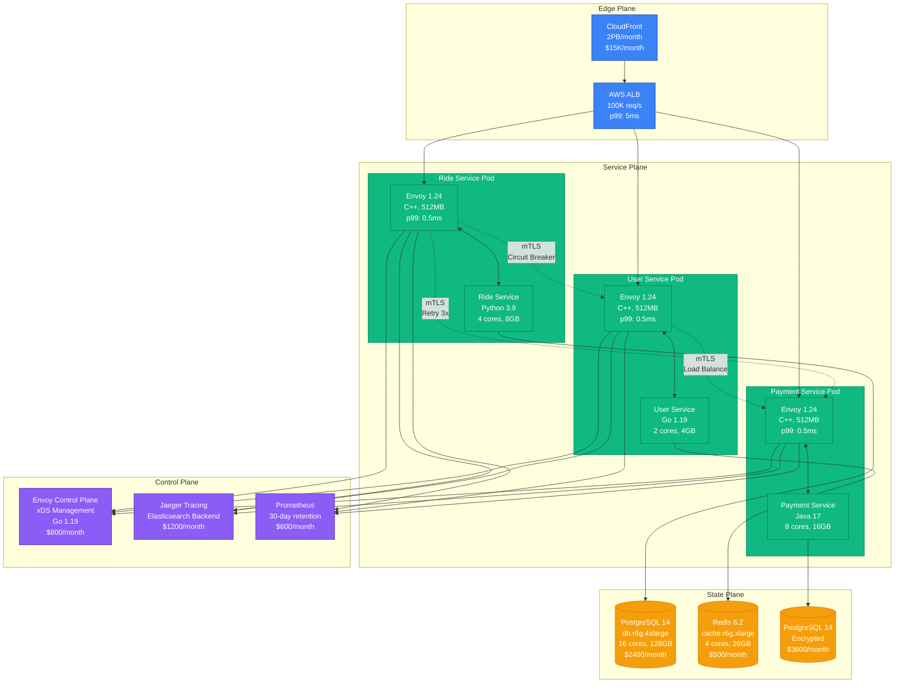
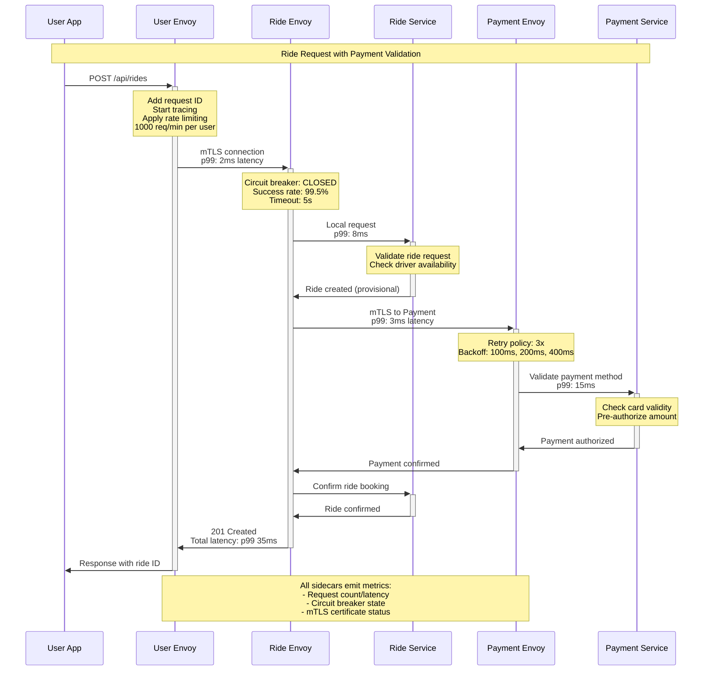
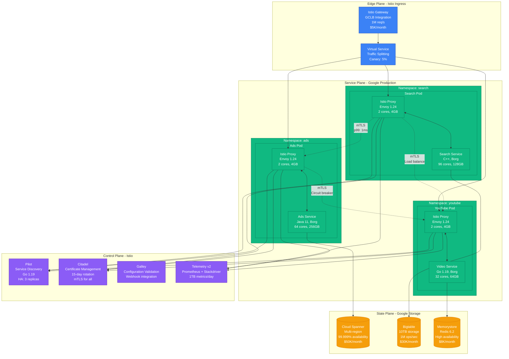

# Sidecar Pattern: Production Implementation

## Overview

The Sidecar Pattern deploys auxiliary services alongside main application containers, providing cross-cutting concerns like networking, security, and observability without modifying application code. First popularized by Lyft with Envoy proxy, now the foundation of service meshes like Istio.

## Production Implementation: Lyft's Envoy Revolution

Lyft pioneered the sidecar pattern in 2016 to solve microservices networking at scale. Before Envoy, each service implemented its own load balancing, circuit breaking, and metrics collection - leading to inconsistent behavior and debugging nightmares.

### Complete Architecture - Lyft's Production Setup



### Request Flow - Ride Request Journey



### Istio Service Mesh - Google's Production Scale

Google uses Istio to manage 2+ billion containers across their fleet. Here's their production configuration:



## Failure Scenarios and Recovery

### Scenario 1: Sidecar Proxy Failure
**Blast Radius**: Single pod only
**Recovery Time**: 2-5 seconds (automatic restart)

```mermaid
graph LR
    subgraph Before[Before Failure]
        A1[App] <--> S1[Sidecar]
        S1 <--> N1[Network]
    end

    subgraph Failure[During Failure]
        A2[App] -x S2[Sidecar ❌]
        A2 -.->|No network access| N2[Network]
    end

    subgraph Recovery[After Recovery]
        A3[App] <--> S3[New Sidecar]
        S3 <--> N3[Network]
    end

    classDef errorStyle fill:#EF4444,stroke:#DC2626,color:#fff
    classDef successStyle fill:#10B981,stroke:#047857,color:#fff

    class S2 errorStyle
    class S1,S3 successStyle
```

**Recovery Procedure**:
1. Kubernetes detects sidecar failure (health check)
2. Restarts sidecar container only (not main app)
3. Envoy reconnects to control plane
4. Traffic resumes within 5 seconds

### Scenario 2: Control Plane Outage
**Blast Radius**: No new configuration updates
**Recovery Time**: Existing traffic continues, 30-60 seconds for new config

```mermaid
graph TB
    subgraph NormalOp[Normal Operation]
        CP1[Control Plane] --> E1[Envoy Sidecars]
        E1 --> A1[Applications]
    end

    subgraph Outage[Control Plane Down]
        CP2[Control Plane ❌] -x E2[Envoy Sidecars<br/>Last known config]
        E2 --> A2[Applications<br/>Traffic continues]
    end

    classDef errorStyle fill:#EF4444,stroke:#DC2626,color:#fff
    classDef warningStyle fill:#F59E0B,stroke:#D97706,color:#fff
    classDef successStyle fill:#10B981,stroke:#047857,color:#fff

    class CP2 errorStyle
    class E2 warningStyle
    class A2,E1,A1 successStyle
```

## Production Metrics and Costs

### Lyft's Sidecar Resource Usage (2023)
- **CPU overhead**: 5-10% per pod
- **Memory overhead**: 50-100MB per sidecar
- **Network latency**: +0.1-0.5ms per hop
- **Total infrastructure cost**: +15% for sidecar resources
- **Operational savings**: -60% debugging time, -40% incident resolution

### Istio at Google Scale
- **Proxies deployed**: 2+ billion containers
- **mTLS connections**: 100% of internal traffic
- **Certificate rotations**: 500M certificates/day
- **Control plane costs**: $200K/month for entire fleet
- **Security incidents**: -95% lateral movement attempts

## Key Benefits Realized

### Before Sidecar Pattern (Lyft 2015)
- 15 different HTTP clients with inconsistent behavior
- No standardized observability
- Manual certificate management
- Circuit breakers implemented 3 different ways
- Debugging required deep service knowledge

### After Sidecar Pattern (Lyft 2023)
- Uniform behavior across 1000+ services
- Zero-code observability and tracing
- Automatic mTLS with certificate rotation
- Consistent circuit breaking and retries
- Platform team manages networking concerns

## Implementation Guidelines

### Essential Sidecar Components
1. **Proxy** (Envoy, NGINX, HAProxy)
2. **Configuration management** (xDS APIs)
3. **Certificate management** (SPIFFE/SPIRE, Citadel)
4. **Observability** (metrics, logging, tracing)
5. **Health checking** (application and proxy health)

### Production Deployment Checklist
- [ ] Resource limits configured (CPU, memory)
- [ ] Health checks for both app and sidecar
- [ ] Circuit breaker thresholds tuned
- [ ] mTLS certificates configured
- [ ] Metrics collection enabled
- [ ] Graceful shutdown handling
- [ ] Control plane high availability

## Anti-Patterns to Avoid

### ❌ Resource Starvation
Don't under-provision sidecar resources:
```yaml
# BAD: Will cause CPU throttling
resources:
  requests:
    cpu: 10m    # Too low for production
    memory: 32Mi # Too low for Envoy
```

### ❌ Shared Sidecars
One sidecar per application container:
```yaml
# BAD: Shared sidecar creates coupling
containers:
- name: app1
- name: app2
- name: shared-sidecar  # Wrong!
```

### ✅ Proper Resource Allocation
```yaml
# GOOD: Production-ready resources
resources:
  requests:
    cpu: 100m     # Adequate for proxy
    memory: 128Mi # Sufficient for Envoy
  limits:
    cpu: 500m     # Burst capacity
    memory: 512Mi # Memory ceiling
```

## Lessons Learned

### Lyft's Hard-Won Wisdom
- **Start simple**: Begin with just load balancing and observability
- **Monitor everything**: Sidecar health is as critical as app health
- **Version carefully**: Coordinate sidecar updates with app deployments
- **Test failure modes**: Regularly test sidecar restart scenarios
- **Plan for scale**: Control plane becomes bottleneck at 10K+ services

### Google's Scale Lessons
- **Certificate rotation is critical**: 15-day max certificate lifetime
- **Control plane HA**: Multi-region deployment prevents outages
- **Gradual rollouts**: Canary sidecar updates before application updates
- **Resource isolation**: Sidecars get dedicated CPU/memory quotas
- **Observability first**: Metrics before features

*The sidecar pattern transformed how we think about microservices infrastructure. It's not just about proxies - it's about creating a consistent, observable, and secure foundation for distributed systems.*