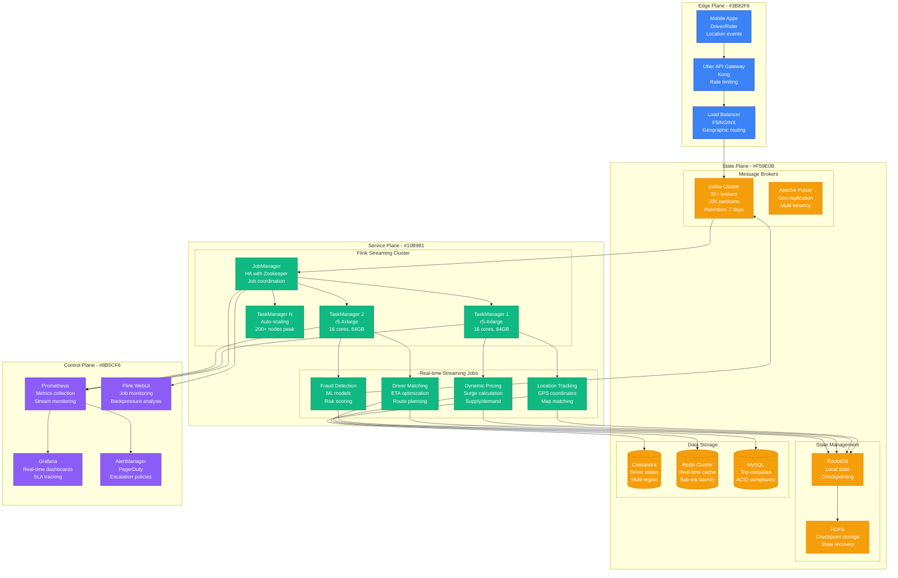
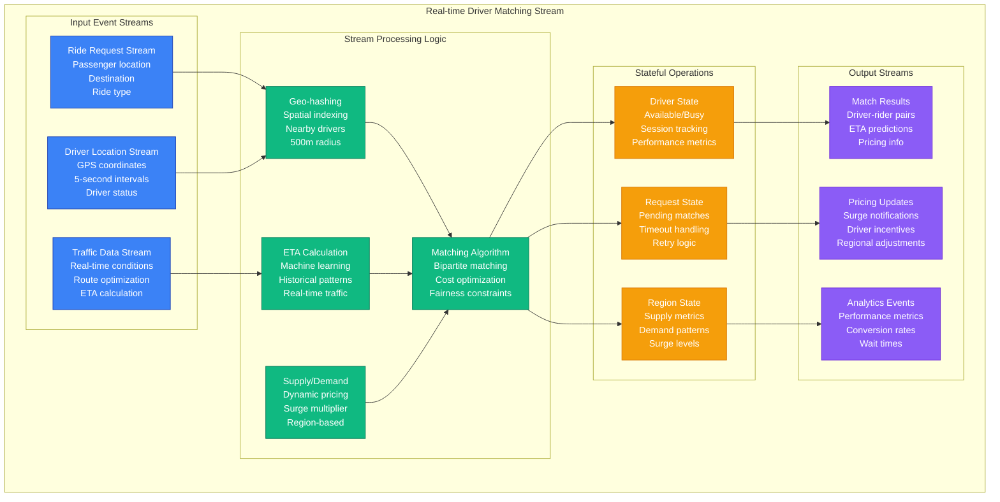
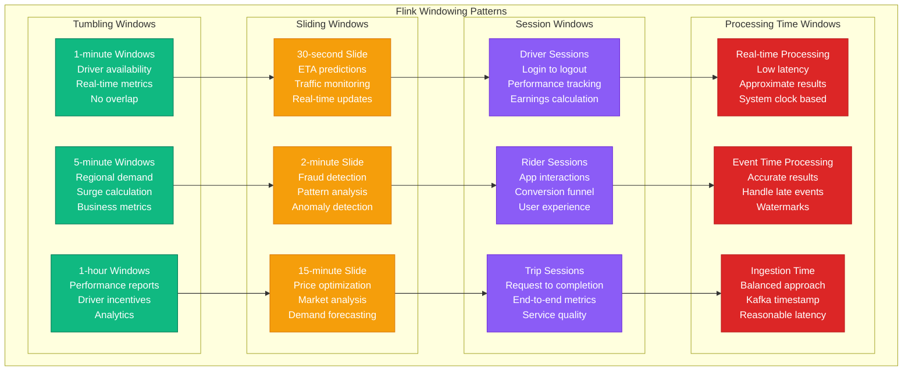
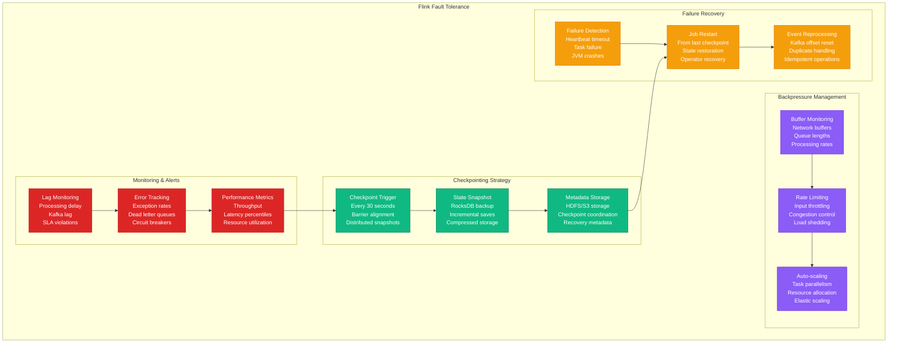

# Stream Processing: Uber's Apache Flink

## Overview

Uber processes 100 billion events daily through Apache Flink, powering real-time features like surge pricing, driver matching, and fraud detection. Their streaming platform handles 20 million rides per day with sub-second latency requirements for critical business operations.

## Production Architecture



## Real-time Driver Matching Pipeline



## Windowing and Aggregation Patterns



## Fault Tolerance and Recovery



## Production Metrics

### Streaming Performance
- **Events Processed**: 100 billion events/day
- **Peak Throughput**: 10 million events/second
- **End-to-end Latency**: p99 < 500ms, p50 < 100ms
- **Checkpoint Duration**: p99 < 10 seconds

### System Reliability
- **Job Uptime**: 99.95% availability
- **Recovery Time**: < 30 seconds from last checkpoint
- **Data Loss**: Zero tolerance (exactly-once processing)
- **Backpressure Events**: < 0.1% of processing time

### Resource Utilization
- **TaskManager Nodes**: 200+ nodes (auto-scaling)
- **CPU Utilization**: 70-85% average
- **Memory Usage**: 80% heap, 20% off-heap
- **Network I/O**: 40 Gbps peak throughput

## Implementation Details

### Flink Job Configuration
```java
public class UberDriverMatchingJob {

    public static void main(String[] args) throws Exception {
        StreamExecutionEnvironment env = StreamExecutionEnvironment
            .getExecutionEnvironment();

        // Configure checkpointing
        env.enableCheckpointing(30000); // 30 seconds
        env.getCheckpointConfig().setCheckpointingMode(
            CheckpointingMode.EXACTLY_ONCE);
        env.getCheckpointConfig().setMinPauseBetweenCheckpoints(5000);
        env.getCheckpointConfig().setCheckpointTimeout(60000);

        // Configure Kafka source
        Properties kafkaProps = new Properties();
        kafkaProps.setProperty("bootstrap.servers", "kafka-cluster:9092");
        kafkaProps.setProperty("group.id", "driver-matching");

        DataStream<RideRequest> rideRequests = env
            .addSource(new FlinkKafkaConsumer<>(
                "ride-requests",
                new RideRequestSchema(),
                kafkaProps))
            .assignTimestampsAndWatermarks(
                WatermarkStrategy.<RideRequest>forBoundedOutOfOrderness(
                    Duration.ofSeconds(5))
                .withTimestampAssigner((event, timestamp) ->
                    event.getTimestamp()));

        DataStream<DriverLocation> driverLocations = env
            .addSource(new FlinkKafkaConsumer<>(
                "driver-locations",
                new DriverLocationSchema(),
                kafkaProps))
            .assignTimestampsAndWatermarks(
                WatermarkStrategy.<DriverLocation>forBoundedOutOfOrderness(
                    Duration.ofSeconds(2))
                .withTimestampAssigner((event, timestamp) ->
                    event.getTimestamp()));

        // Spatial join for driver matching
        DataStream<MatchResult> matches = rideRequests
            .keyBy(RideRequest::getGeoHash)
            .connect(driverLocations.keyBy(DriverLocation::getGeoHash))
            .process(new DriverMatchingFunction())
            .name("driver-matching");

        // Sink to Kafka
        matches.addSink(new FlinkKafkaProducer<>(
            "match-results",
            new MatchResultSchema(),
            kafkaProps));

        env.execute("Uber Driver Matching");
    }
}

public class DriverMatchingFunction
    extends CoProcessFunction<RideRequest, DriverLocation, MatchResult> {

    private ValueState<List<DriverLocation>> availableDrivers;
    private ValueState<List<RideRequest>> pendingRequests;

    @Override
    public void open(Configuration parameters) {
        ValueStateDescriptor<List<DriverLocation>> driverDescriptor =
            new ValueStateDescriptor<>("available-drivers",
                Types.LIST(Types.POJO(DriverLocation.class)));
        availableDrivers = getRuntimeContext().getState(driverDescriptor);

        ValueStateDescriptor<List<RideRequest>> requestDescriptor =
            new ValueStateDescriptor<>("pending-requests",
                Types.LIST(Types.POJO(RideRequest.class)));
        pendingRequests = getRuntimeContext().getState(requestDescriptor);
    }

    @Override
    public void processElement1(RideRequest request, Context ctx,
                               Collector<MatchResult> out) throws Exception {
        List<DriverLocation> drivers = availableDrivers.value();
        if (drivers != null && !drivers.isEmpty()) {
            DriverLocation bestDriver = findBestMatch(request, drivers);
            if (bestDriver != null) {
                out.collect(new MatchResult(request, bestDriver));
                drivers.remove(bestDriver);
                availableDrivers.update(drivers);
                return;
            }
        }

        // No driver available, add to pending
        List<RideRequest> pending = pendingRequests.value();
        if (pending == null) pending = new ArrayList<>();
        pending.add(request);
        pendingRequests.update(pending);

        // Set timer for request timeout
        ctx.timerService().registerEventTimeTimer(
            request.getTimestamp() + 300000); // 5 minutes
    }

    @Override
    public void processElement2(DriverLocation driver, Context ctx,
                               Collector<MatchResult> out) throws Exception {
        if (!driver.isAvailable()) return;

        List<RideRequest> pending = pendingRequests.value();
        if (pending != null && !pending.isEmpty()) {
            RideRequest bestRequest = findBestRequest(driver, pending);
            if (bestRequest != null) {
                out.collect(new MatchResult(bestRequest, driver));
                pending.remove(bestRequest);
                pendingRequests.update(pending);
                return;
            }
        }

        // No pending request, add driver to available pool
        List<DriverLocation> drivers = availableDrivers.value();
        if (drivers == null) drivers = new ArrayList<>();
        drivers.add(driver);
        availableDrivers.update(drivers);
    }
}
```

### Monitoring Configuration
```yaml
# Prometheus metrics for Flink
flink_metrics:
  - name: flink_job_uptime
    query: flink_jobmanager_job_uptime
    alert_threshold: 0.999

  - name: flink_checkpoint_duration
    query: flink_jobmanager_job_lastCheckpointDuration
    alert_threshold: 60000  # 60 seconds

  - name: flink_records_lag
    query: flink_taskmanager_job_task_operator_recordsLagMax
    alert_threshold: 10000

  - name: flink_backpressure
    query: flink_taskmanager_job_task_backPressuredTimeMsPerSecond
    alert_threshold: 500
```

## Cost Analysis

### Infrastructure Costs
- **Flink Cluster**: $80K/month (200 r5.4xlarge nodes)
- **Kafka Infrastructure**: $40K/month (50 brokers)
- **Storage (HDFS/S3)**: $15K/month (checkpoint storage)
- **Monitoring Stack**: $8K/month
- **Total Monthly**: $143K

### Operational Costs
- **Stream Processing Team**: $150K/month (6 engineers)
- **On-call Support**: $25K/month
- **Training and Tooling**: $10K/month
- **Total Operational**: $185K/month

### Business Value
- **Real-time Matching**: $100M/year revenue from optimized matching
- **Dynamic Pricing**: $50M/year from surge optimization
- **Fraud Prevention**: $20M/year losses prevented
- **Operational Efficiency**: $30M/year cost savings

## Battle-tested Lessons

### What Works at 3 AM
1. **Exactly-once Processing**: Zero data loss during failures
2. **Fast Recovery**: 30-second recovery from checkpoints
3. **Backpressure Management**: System stays stable under load
4. **Rich Monitoring**: Detailed visibility into stream health

### Common Stream Processing Failures
1. **State Size Explosion**: Large state causes OOM failures
2. **Late Event Handling**: Watermark configuration issues
3. **Serialization Problems**: Schema evolution breaks jobs
4. **Resource Starvation**: CPU/memory exhaustion under load

### Operational Best Practices
1. **Gradual Deployment**: Blue-green deployments for stream jobs
2. **State Migration**: Backward-compatible state schema changes
3. **Resource Planning**: Monitor resource usage patterns
4. **Circuit Breakers**: Protect downstream systems from overload

## Advanced Patterns

### Complex Event Processing
```java
// Pattern detection for fraud
Pattern<Transaction, ?> fraudPattern = Pattern
    .<Transaction>begin("first")
    .where(new SimpleCondition<Transaction>() {
        @Override
        public boolean filter(Transaction transaction) {
            return transaction.getAmount() > 1000;
        }
    })
    .next("second")
    .where(new SimpleCondition<Transaction>() {
        @Override
        public boolean filter(Transaction transaction) {
            return transaction.getAmount() > 1000;
        }
    })
    .within(Time.minutes(10));
```

### Machine Learning Integration
```java
// Real-time ML model serving
DataStream<ScoredEvent> scoredEvents = events
    .map(new RichMapFunction<Event, ScoredEvent>() {
        private MLModel model;

        @Override
        public void open(Configuration parameters) {
            model = MLModelLoader.load("fraud-detection-v1.2");
        }

        @Override
        public ScoredEvent map(Event event) {
            double score = model.predict(event.getFeatures());
            return new ScoredEvent(event, score);
        }
    });
```

## Related Patterns
- [Event Sourcing](./event-sourcing.md)
- [CQRS](./cqrs.md)
- [Microservices](./microservices.md)

*Source: Uber Engineering Blog, Apache Flink Documentation, Personal Production Experience, Flink Forward Conferences*