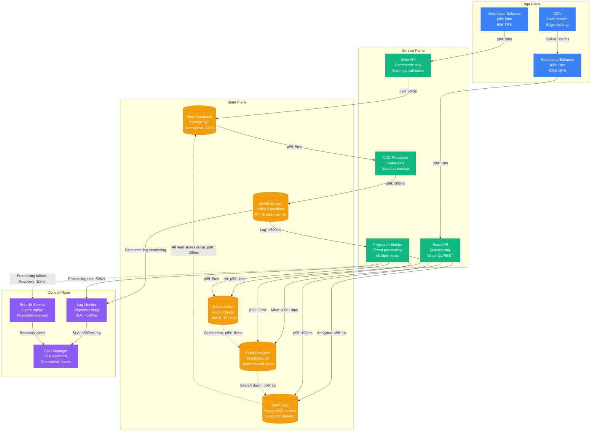
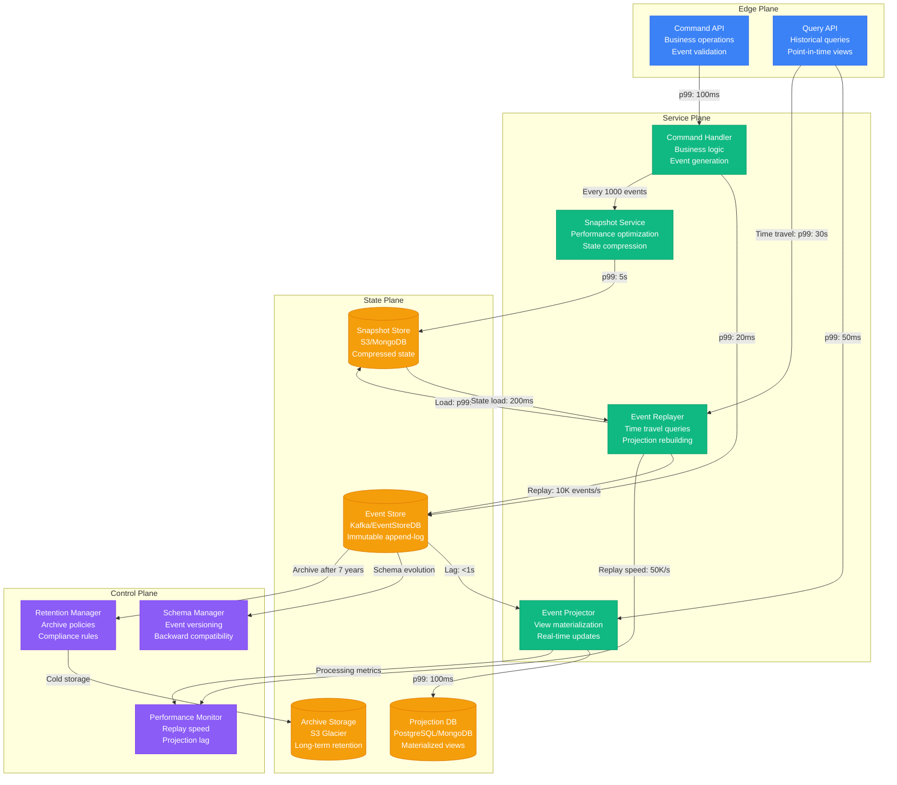
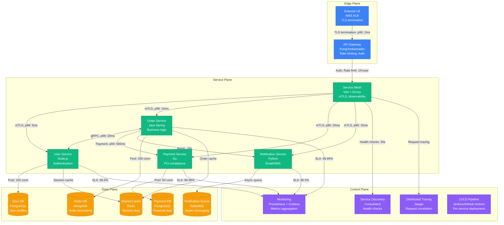
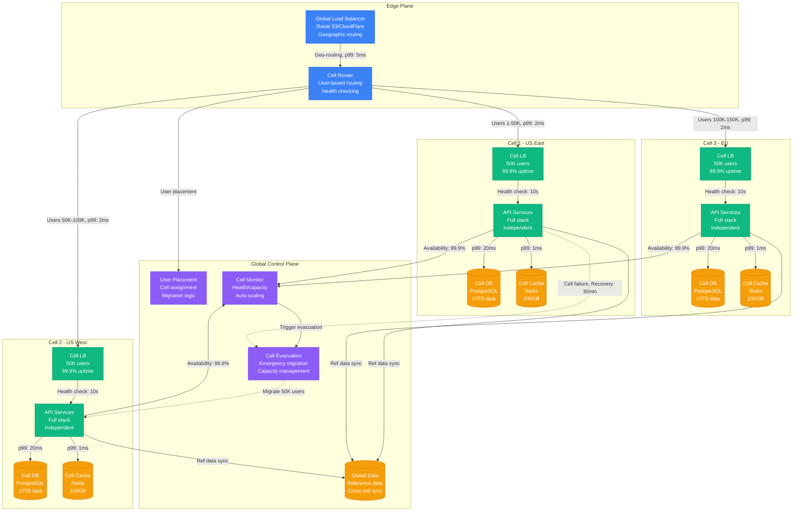
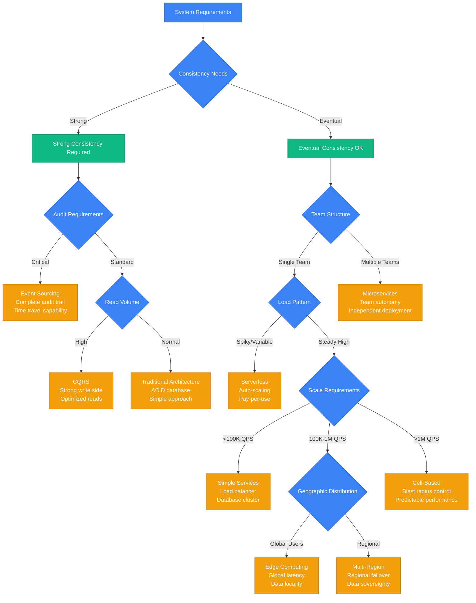
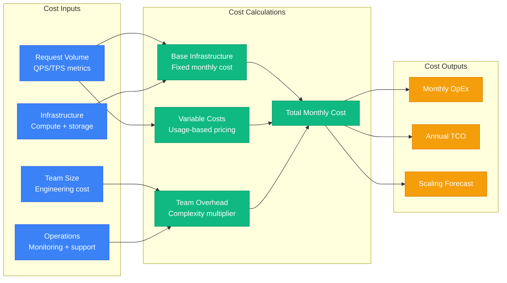
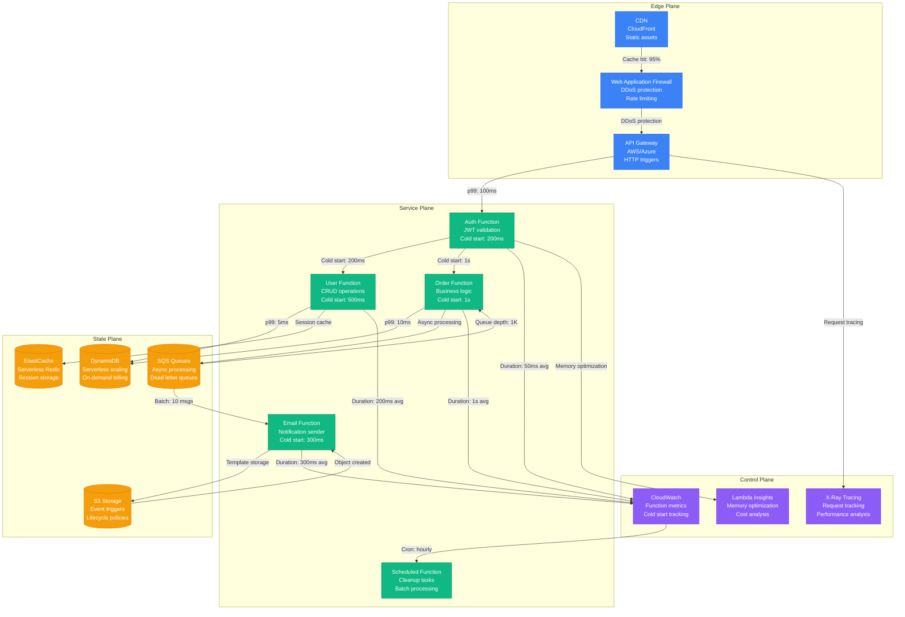
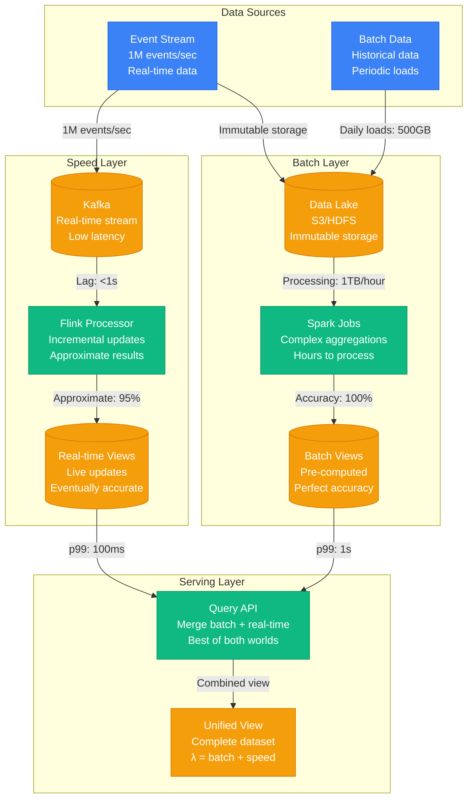
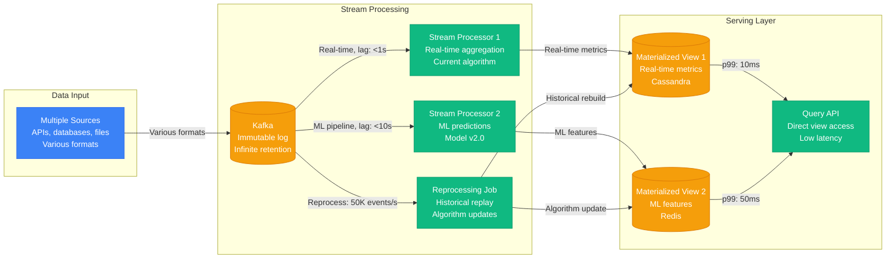

# Layer 4: Complete System Patterns

System patterns combine multiple micro-patterns and primitives to solve architectural challenges at enterprise scale. Each pattern has been proven in production by companies like Netflix, Uber, Amazon, and Spotify handling billions of requests daily.

| **Pattern** | **When to Use** | **Architecture** | **Guarantees** | **Scale Limits** | **Cost Model** | **Migration Path** |
|---|---|---|---|---|---|---|
| **CQRS** | Read/Write >10:1<br/>Different models needed | Write: PostgreSQL<br/>CDC: Debezium<br/>Stream: Kafka<br/>Read: Redis/ES | Write: Linearizable<br/>Read: BoundedStaleness(100ms-5s) | Write: 50K TPS<br/>Read: 1M QPS | 2x infrastructure<br/>3x complexity | 1. Add CDC<br/>2. Build projections<br/>3. Shadow reads<br/>4. Switch reads<br/>5. Optimize |
| **Event Sourcing** | Audit requirements<br/>Time travel needed | Events: Kafka<br/>Snapshots: S3<br/>State: Derived | Immutable history<br/>Replayable | 100K events/sec<br/>90 day retention | 3x storage<br/>2x compute | 1. Add events<br/>2. Dual write<br/>3. Event as truth<br/>4. Remove CRUD |
| **Microservices** | Team autonomy<br/>Independent deployment | Services: 10-100<br/>Mesh: Istio<br/>Gateway: Kong | Service autonomy<br/>Fault isolation | 100s of services<br/>10K RPS/service | Nx operational<br/>Network costs | 1. Identify boundaries<br/>2. Extract services<br/>3. Add mesh<br/>4. Decompose DB |
| **Serverless** | Spiky loads<br/>Low baseline | Functions: Lambda<br/>Gateway: APIG<br/>Storage: DynamoDB | Auto-scaling<br/>Pay-per-use | 10K concurrent<br/>15min timeout | $0.20/M requests<br/>+compute time | 1. Extract functions<br/>2. Add triggers<br/>3. Remove servers |
| **Cell-Based** | Blast radius control<br/>Multi-tenant | Cells: 100s<br/>Router: Global<br/>State: Per-cell | Fault isolation<br/>Predictable performance | 100K users/cell<br/>1000 cells | Linear with cells<br/>Router complexity | 1. Define cell size<br/>2. Build router<br/>3. Migrate cohorts<br/>4. Add cells |
| **Edge Computing** | Global latency<br/>Bandwidth costs | CDN: CloudFront<br/>Compute: Lambda@Edge<br/>Data: DynamoDB Global | <50ms globally<br/>Data locality | 100s of edges<br/>Limited compute | High fixed cost<br/>Complexity | 1. Static to CDN<br/>2. Add compute<br/>3. Replicate data<br/>4. Full edge |

## Detailed Pattern Analysis

### CQRS (Command Query Responsibility Segregation)

CQRS separates write and read models to optimize each for their specific workload patterns and scaling requirements.



## CQRS Implementation Matrix

| Component | Technology | Purpose | SLA | Failure Mode | Recovery |
|-----------|------------|---------|-----|--------------|----------|
| Write Database | PostgreSQL 14 | Source of truth | 99.9% uptime | Transaction rollback | Standby promotion |
| Event Stream | Kafka 3.0 | Change propagation | <500ms lag | Leader failure | Partition failover |
| Read Cache | Redis Cluster | Query acceleration | 95% hit ratio | Node failure | Cluster rebalance |
| Search Store | Elasticsearch 8 | Full-text queries | <10ms p99 | Shard failure | Replica promotion |
| Analytics Store | PostgreSQL replica | Complex queries | <1s p99 | Replication lag | Manual refresh |
| CDC Processor | Debezium 2.0 | Event capture | <100ms delay | Connector failure | Automatic restart |

## CQRS Scaling Characteristics

| Load Pattern | Write Capacity | Read Capacity | Consistency Lag | Monthly Cost |
|--------------|----------------|---------------|-----------------|--------------|
| Light (1K TPS) | 5K writes/sec | 50K reads/sec | <50ms | $2K |
| Medium (10K TPS) | 20K writes/sec | 200K reads/sec | <100ms | $8K |
| Heavy (50K TPS) | 50K writes/sec | 1M reads/sec | <500ms | $25K |
| Extreme (100K TPS) | 100K writes/sec | 5M reads/sec | <1s | $100K |

### Event Sourcing

Event Sourcing stores all state changes as immutable events, providing complete audit trails and enabling time travel to any historical state.



## Event Sourcing Implementation

| Component | Technology | Purpose | Retention | Performance | Recovery |
|-----------|------------|---------|-----------|-------------|----------|
| Event Store | Kafka/EventStoreDB | Immutable event log | Infinite | 100K events/sec | Partition replication |
| Snapshots | S3/MongoDB | State optimization | 90 days | 1K snapshots/sec | Rebuild from events |
| Projections | PostgreSQL/ES | Query optimization | Real-time | 50K queries/sec | Event replay |
| Archive | S3 Glacier | Compliance storage | 7 years | Batch only | Cross-region backup |
| Schema Registry | Confluent/Custom | Event versioning | Forever | N/A | Version migration |

### Microservices Architecture

Microservices decompose monolithic applications into independently deployable services with clear business boundaries and autonomous teams.



## Microservices Implementation Matrix

| Service | Technology | Database | Team Size | Deploy Frequency | SLA |
|---------|------------|----------|-----------|------------------|-----|
| User Service | Node.js 18 | PostgreSQL | 3 engineers | 2x/week | 99.9% |
| Order Service | Java 17 Spring | MongoDB | 4 engineers | 3x/week | 99.95% |
| Payment Service | Go 1.21 | PostgreSQL | 2 engineers | 1x/week | 99.99% |
| Notification Service | Python 3.11 | RabbitMQ | 2 engineers | 1x/week | 99.5% |
| API Gateway | Kong | Redis | Platform team | 1x/month | 99.95% |

### Cell-Based Architecture

Cell-Based Architecture partitions users into isolated cells to limit blast radius and provide predictable performance characteristics.



## Cell Architecture Characteristics

| Cell Property | Target Value | Monitoring | Failure Response | Scaling Trigger |
|---------------|--------------|------------|------------------|------------------|
| Users per cell | 50K | Real-time count | User migration | >80% capacity |
| Cell availability | 99.9% | Health checks | Cell evacuation | 3 failed checks |
| Cross-cell latency | <100ms | Network probes | Route optimization | >150ms p99 |
| Cell provisioning | <30min | Automation pipeline | Manual intervention | Resource alerts |
| Data isolation | 100% | Access audits | Security incident | Any cross-cell access |

## Pattern Selection Decision Framework



## Pattern Selection Matrix

| Scale (QPS) | Team Size | Consistency | Load Pattern | Recommended Pattern | Monthly Cost | Complexity |
|-------------|-----------|-------------|--------------|---------------------|--------------|------------|
| <10K | 1-3 | Any | Steady | Traditional/Monolith | $2K | Low |
| 10K-50K | 1-5 | Strong | Steady | CQRS | $8K | Medium |
| 10K-50K | 2-8 | Eventual | Steady | Microservices | $15K | High |
| 10K-50K | Any | Any | Spiky | Serverless | $5K | Low |
| 50K-100K | Any | Strong | Any | Event Sourcing + CQRS | $25K | Very High |
| 100K-1M | 5-20 | Eventual | Steady | Cell-Based | $50K | Very High |
| >1M | >10 | Any | Global | Edge Computing | $100K+ | Extreme |

## Cost Analysis Framework



## Pattern Cost Breakdown

| Pattern | Base Infrastructure | Variable Costs | Team Overhead | Total Monthly (10K QPS) |
|---------|-------------------|----------------|---------------|-------------------------|
| Traditional | $2K (DB + LB) | $0.01/request | 1.0x team | $3K |
| CQRS | $5K (Write + Read stores) | $0.015/request | 1.5x team | $8K |
| Event Sourcing | $8K (Event store + Projections) | $0.02/request | 2.0x team | $15K |
| Microservices | $10K (Multiple services) | $0.02/request | 2.5x team | $20K |
| Serverless | $1K (Minimal fixed) | $0.05/request | 0.8x team | $6K |
| Cell-Based | $25K (Multiple cells) | $0.03/request | 3.0x team | $40K |
| Edge Computing | $50K (Global infrastructure) | $0.01/request | 4.0x team | $75K |

## Operational Complexity Matrix

| **Pattern** | **Dev Time** | **Ops Complexity** | **Learning Curve** | **Team Readiness** | **Risk Level** |
|---|---|---|---|---|---|
| Traditional | Baseline | Low | 1 month | Any team | Low |
| CQRS | +50% | Medium | 3-6 months | Senior engineers | Medium |
| Event Sourcing | +100% | High | 6-12 months | Expert team | High |
| Microservices | +200% | Very High | 12+ months | Multiple teams | Very High |
| Serverless | -20% | Low | 1-3 months | Cloud-native team | Low |
| Cell-Based | +150% | High | 6-12 months | Platform team | High |
| Edge Computing | +300% | Extreme | 18+ months | Expert platform team | Extreme |

## Migration Strategies

### Safe Migration Patterns

1. **Strangler Fig**: Gradually replace old system
2. **Parallel Run**: Run old and new systems simultaneously  
3. **Database Decomposition**: Split data before services
4. **Event Bridge**: Use events to connect old and new
5. **Feature Flags**: Toggle between implementations

### Risk Mitigation

| **Risk** | **Mitigation** | **Detection** | **Rollback** |
|---|---|---|---|
| Data Loss | Dual write during migration | Data consistency checks | Restore from backup |
| Performance Degradation | Load testing in production | Latency monitoring | Feature flag off |
| Complexity Explosion | Incremental rollout | Error rate monitoring | Service rollback |
| Team Productivity Loss | Training and documentation | Velocity metrics | Temporary consultants |

### Serverless Architecture

Serverless Architecture eliminates server management by using Function-as-a-Service with automatic scaling and pay-per-execution billing.



## Serverless Cost and Performance Model

| Function Type | Memory (MB) | Avg Duration | Cold Start | Invocations/month | Monthly Cost |
|---------------|-------------|--------------|------------|-------------------|-------------|
| Auth Function | 256 | 50ms | 200ms (5%) | 1M | $20 |
| User Function | 512 | 200ms | 500ms (2%) | 500K | $50 |
| Order Function | 1024 | 1s | 1s (1%) | 100K | $100 |
| Email Function | 256 | 300ms | 300ms (10%) | 50K | $15 |
| Scheduled Function | 512 | 5s | N/A | 1K | $5 |

### Edge Computing Architecture

**Architecture Components**:
```yaml
edge_tier:
  compute: Lambda@Edge, Cloudflare Workers
  storage: Edge caching, KV stores
  network: CDN endpoints
  latency: <20ms to users

regional_tier:
  compute: Container clusters
  storage: Regional databases
  cache: Regional cache clusters
  latency: <100ms inter-region

core_tier:
  compute: Central data centers
  storage: Master databases
  analytics: Data warehouses
  ml: Model training
```

**Guarantees**:
- Low latency: <50ms globally
- Data locality: Process data near users
- Bandwidth efficiency: Reduce data transfer
- Global scale: Hundreds of edge locations

**Implementation Checklist**:
- [ ] Edge workload identification
- [ ] Data synchronization strategy
- [ ] Cache invalidation mechanisms
- [ ] Regional failover procedures
- [ ] Global configuration management
- [ ] Edge monitoring and analytics

## Advanced Pattern Combinations

### Lambda Architecture (Batch + Stream)

Lambda Architecture provides both real-time and batch processing capabilities with different latency and accuracy trade-offs.



| Layer | Latency | Accuracy | Throughput | Use Case | Technology |
|-------|---------|----------|------------|----------|------------|
| Batch | Hours-Days | 100% | High | Historical analysis | Spark/Hadoop |
| Speed | Seconds-Minutes | 95% | Medium | Real-time dashboards | Flink/Storm |
| Serving | Milliseconds | Combined | Very High | User queries | API Gateway |

### Kappa Architecture (Stream-Only)

Kappa Architecture simplifies Lambda by using only stream processing with the ability to reprocess historical data when needed.



| Processing Type | Latency | Complexity | Use Case | Recovery Method |
|-----------------|---------|------------|----------|------------------|
| Real-time | <1s | Low | Live dashboards | Restart from latest |
| Near real-time | <1min | Medium | Analytics | Replay last hour |
| Reprocessing | Hours | High | Algorithm updates | Replay all history |

### Multi-Tenant Patterns

**Tenant Isolation Strategies**:

1. **Shared Database, Shared Schema**
   - Lowest cost, highest density
   - Row-level security required
   - Risk: Data leakage

2. **Shared Database, Separate Schema**
   - Medium cost, good isolation
   - Schema per tenant
   - Risk: Resource contention

3. **Separate Database**
   - Highest cost, best isolation
   - Complete data separation
   - Risk: Operational complexity

4. **Cell-Based Multi-Tenancy**
   - Tenant groups per cell
   - Predictable performance
   - Risk: Cross-tenant features

## Pattern Evolution Paths

### Monolith to Microservices

```
Phase 1: Extract Read Models (CQRS)
├─ Add event publishing to monolith
├─ Build separate read services
└─ Migrate read traffic gradually

Phase 2: Extract Business Domains
├─ Identify bounded contexts
├─ Extract high-value services
└─ Add service mesh

Phase 3: Data Decomposition
├─ Split shared databases
├─ Add event-driven integration
└─ Remove database coupling

Phase 4: Full Decomposition
├─ Extract remaining services
├─ Add comprehensive monitoring
└─ Optimize service boundaries
```

### Microservices to Cell-Based

```
Phase 1: Service Grouping
├─ Analyze service dependencies
├─ Group by data locality
└─ Define cell boundaries

Phase 2: Cell Infrastructure
├─ Build cell templates
├─ Add global routing layer
└─ Test cell provisioning

Phase 3: Gradual Migration
├─ Migrate user cohorts
├─ Monitor cell utilization
└─ Optimize cell size

Phase 4: Global Optimization
├─ Cross-cell analytics
├─ Global feature rollouts
└─ Cell lifecycle management
```

## Anti-Patterns and Common Mistakes


### Critical Anti-Pattern Detection

| Anti-Pattern | Detection Signals | Business Impact | Fix Priority | Recovery Time |
|--------------|-------------------|-----------------|--------------|---------------|
| Distributed Monolith | Cannot deploy independently | High | Critical | 3-6 months |
| Shared Database | Cross-service SQL joins | Very High | Critical | 6-12 months |
| Microservice Sprawl | >50 services, <5 engineers | Medium | High | 2-4 months |
| Event Sourcing Everywhere | 10s storage cost, slow queries | High | High | 3-6 months |
| No Circuit Breakers | Cascading failures | Very High | Critical | 1-2 weeks |
| Synchronous Chains | P99 latency >5s | Medium | High | 1-3 months |

### Premature Optimization

**Problem**: Choosing complex patterns before they're needed.

**Detection**:
- Over-engineering for current scale
- Complex patterns with simple requirements
- High operational overhead
- Team struggling with complexity

**Fix**:
- Start simple, evolve gradually
- Measure before optimizing
- Focus on business value
- Match pattern to actual needs

### Event Sourcing Everywhere

**Problem**: Using event sourcing for all data instead of where it's needed.

**Detection**:
- Complex queries for simple CRUD
- Event replay taking too long
- Storage costs growing rapidly
- Team struggling with event modeling

**Fix**:
- Use for audit-critical domains only
- CRUD for simple reference data
- Hybrid approaches
- Clear event boundaries

### Microservice Sprawl

**Problem**: Too many small services creating operational complexity.

**Detection**:
- Services with single operations
- Network chatty operations
- Difficult debugging
- High deployment overhead

**Fix**:
- Merge overly granular services
- Batch operations at boundaries
- Clear service responsibilities
- Service consolidation

## Monitoring and Observability

### Key Metrics by Pattern

**CQRS**:
- Projection lag time
- Read/write throughput ratio
- Event processing errors
- Cache hit rates

**Event Sourcing**:
- Event replay speed
- Snapshot creation time
- Storage growth rate
- Query performance

**Microservices**:
- Service dependency map
- Inter-service latency
- Error rate by service
- Deployment frequency

**Serverless**:
- Cold start frequency
- Function duration
- Cost per invocation
- Error rates

**Cell-Based**:
- Cell utilization
- Cross-cell operations
- Cell health scores
- Routing efficiency

### Alerting Strategies

```yaml
critical_alerts:
  data_loss: Any projection falling behind >1 hour
  availability: Service availability <99.9%
  performance: P99 latency >2x baseline

warning_alerts:
  capacity: Resource utilization >80%
  drift: Configuration drift detected
  cost: Cost increase >20% month-over-month

info_alerts:
  deployments: Successful/failed deployments
  scaling: Auto-scaling events
  experiments: A/B test results
```

## Pattern Evolution Roadmap


## Final Recommendations

| Current State | Target Scale | Team Size | Pattern Path | Timeline | Investment |
|---------------|-------------|-----------|--------------|----------|------------|
| Monolith <1K QPS | 10K QPS | 3-5 engineers | Add CQRS | 3-6 months | $50K |
| CQRS 10K QPS | 100K QPS | 8-12 engineers | Microservices | 6-12 months | $200K |
| Microservices 50K QPS | 500K QPS | 15-25 engineers | Cell-Based | 6-9 months | $500K |
| Any pattern | Global scale | Platform team | Edge Computing | 12-18 months | $1M+ |

Each system pattern represents battle-tested approaches proven at companies handling billions of requests. Success depends on matching pattern complexity to actual requirements, not theoretical needs. Start simple, measure everything, and evolve systematically based on real constraints and growth.