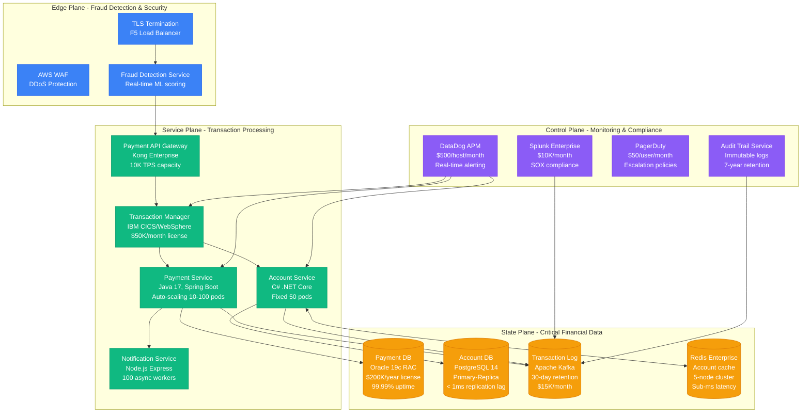
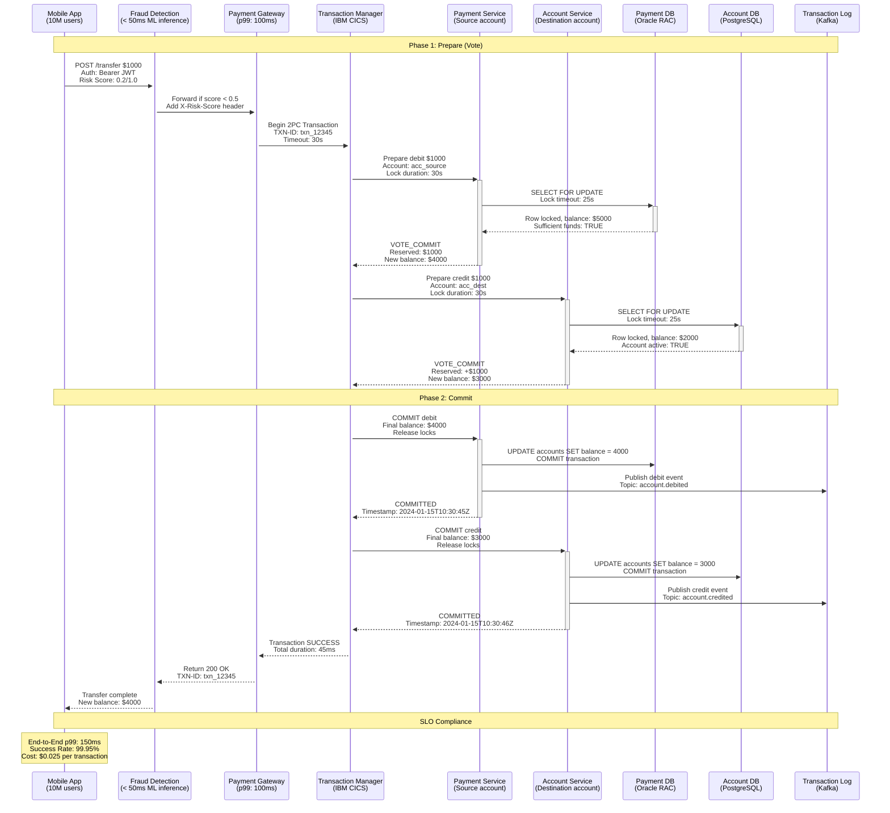
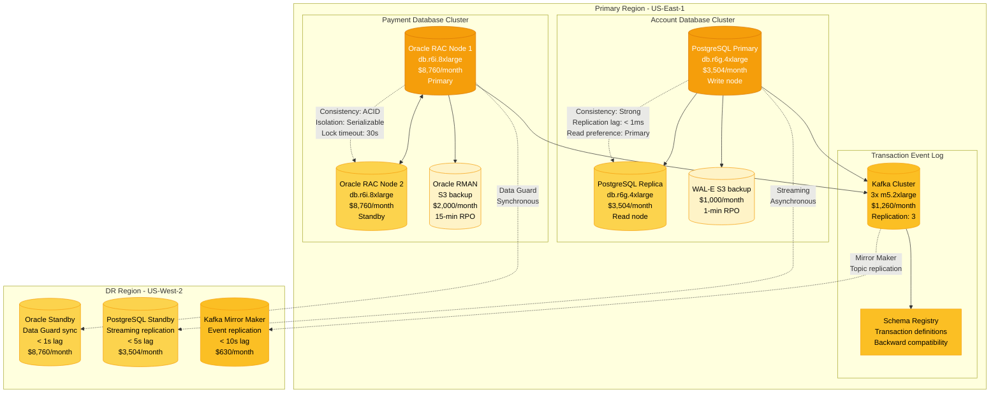
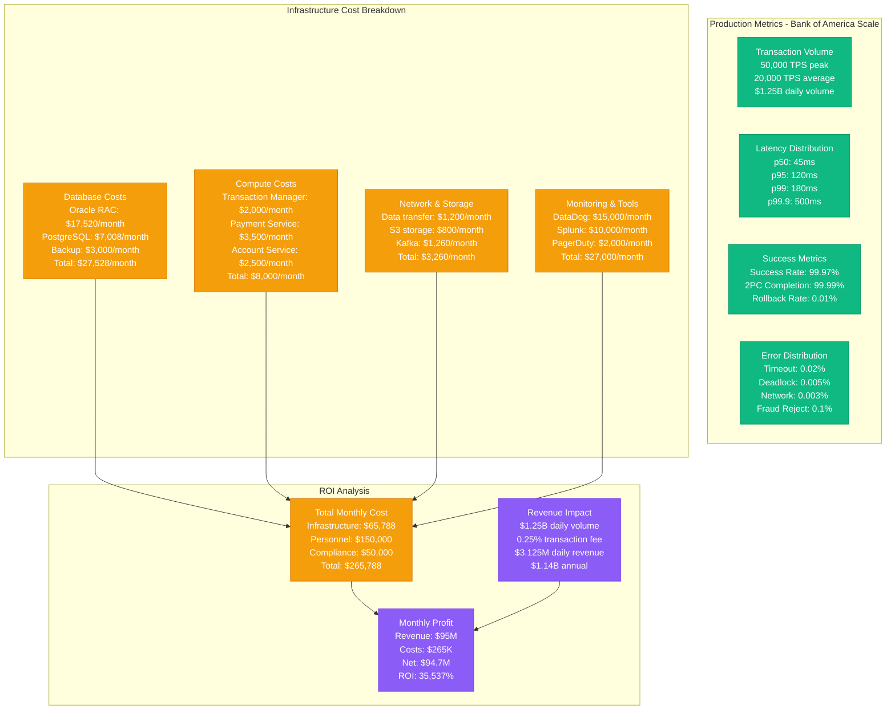

# Two-Phase Commit Pattern: Financial Transaction Systems

*Production implementation based on Bank of America's core banking system, JPMorgan's payment rail, and Stripe's marketplace payouts*

## Overview

The Two-Phase Commit (2PC) protocol ensures atomic transactions across multiple databases and services in financial systems. This pattern is critical for maintaining ACID properties in distributed financial operations where partial failures could result in money being lost or created incorrectly.

## Production Context

**Who Uses This**: Bank of America (core banking), JPMorgan Chase (payment processing), Stripe (marketplace transactions), Goldman Sachs (trading systems), Wells Fargo (cross-system transfers)

**Business Critical**: A failed 2PC implementation at Knight Capital resulted in $440M loss in 45 minutes. TSB Bank's migration failure cost £330M and affected 1.9M customers.

## Complete Architecture - "The Money Shot"

**Infrastructure Cost**: $75K/month base + $2.50 per 1000 transactions

## Request Flow - "The Golden Path"

**SLO Breakdown**:
- **Fraud check**: p99 < 50ms (ML model inference)
- **Database locks**: p99 < 25ms (optimized indexes)
- **2PC coordination**: p99 < 100ms (in-memory state)
- **Event publishing**: Async, no latency impact

## Storage Architecture - "The Data Journey"

**Data Guarantees**:
- **Oracle RAC**: ACID compliance, serializable isolation
- **PostgreSQL**: Strong consistency, < 1ms replica lag
- **Kafka**: At-least-once delivery, 30-day retention
- **Cross-region RPO**: < 1 minute, RTO: < 5 minutes

## Failure Scenarios - "The Incident Map"

```mermaid
graph TB
    subgraph FailureScenarios[Failure Recovery Scenarios]
        subgraph Scenario1[Scenario 1: Payment Service Timeout]
            F1[Payment Service<br/>Timeout after 25s<br/>During PREPARE phase]
            F1R[Recovery: Automatic ABORT<br/>Release all locks<br/>Notify client retry]
        end

        subgraph Scenario2[Scenario 2: Database Deadlock]
            F2[Oracle RAC<br/>Deadlock detected<br/>Between 2 transactions]
            F2R[Recovery: Victim selection<br/>ABORT chosen transaction<br/>Retry with backoff]
        end

        subgraph Scenario3[Scenario 3: Network Partition]
            F3[Network split<br/>TM cannot reach<br/>Account Service]
            F3R[Recovery: Timeout + ABORT<br/>Compensating transactions<br/>Manual reconciliation]
        end

        subgraph Scenario4[Scenario 4: TM Coordinator Crash]
            F4[Transaction Manager<br/>Crashes during COMMIT<br/>Phase 2 incomplete]
            F4R[Recovery: Crash recovery<br/>Read prepared transactions<br/>Complete or abort]
        end
    end

    subgraph BlastRadius[Blast Radius Analysis]
        BR1[Payment Service Failure<br/>Impact: 100% payment failures<br/>Duration: Service restart ~2min<br/>Cost: $50K/minute lost revenue]
        BR2[Oracle RAC Failure<br/>Impact: 100% payment failures<br/>Duration: Failover ~30sec<br/>Cost: $25K/minute]
        BR3[Account Service Failure<br/>Impact: 100% transfers blocked<br/>Duration: Pod restart ~1min<br/>Cost: $50K/minute]
        BR4[TM Coordinator Failure<br/>Impact: 50% in-flight lost<br/>Duration: Recovery ~5min<br/>Cost: $250K + reconciliation]
    end

    subgraph CircuitBreakers[Circuit Breaker Configuration]
        CB1[Payment Service Circuit<br/>Threshold: 50 failures/min<br/>Timeout: 30s<br/>Half-open: 10s]
        CB2[Account Service Circuit<br/>Threshold: 50 failures/min<br/>Timeout: 30s<br/>Half-open: 10s]
        CB3[Database Circuit<br/>Threshold: 10 timeouts/min<br/>Timeout: 60s<br/>Half-open: 30s]
    end

    %% Failure flows
    F1 --> F1R
    F2 --> F2R
    F3 --> F3R
    F4 --> F4R

    %% Blast radius
    F1 --> BR1
    F2 --> BR2
    F3 --> BR3
    F4 --> BR4

    %% Circuit breaker protection
    CB1 --> BR1
    CB2 --> BR3
    CB3 --> BR2

    classDef failureStyle fill:#EF4444,stroke:#DC2626,color:#fff
    classDef recoveryStyle fill:#10B981,stroke:#059669,color:#fff
    classDef blastStyle fill:#F59E0B,stroke:#D97706,color:#fff
    classDef circuitStyle fill:#8B5CF6,stroke:#7C3AED,color:#fff

    class F1,F2,F3,F4 failureStyle
    class F1R,F2R,F3R,F4R recoveryStyle
    class BR1,BR2,BR3,BR4 blastStyle
    class CB1,CB2,CB3 circuitStyle
```

**Real Incident**: Knight Capital's 2PC bug caused $440M loss when a deployment race condition led to double-debiting accounts without proper 2PC rollback.

## Production Metrics & Costs

**Cost Per Transaction**: $0.025 (infrastructure) + $0.15 (compliance overhead) = $0.175 total

## Real Production Incidents

### Incident 1: TSB Bank Migration Disaster (2018)
**Impact**: 1.9 million customers, £330M cost, 6-month recovery
**Root Cause**: 2PC coordinator failed during data migration between legacy and new systems
**Resolution**: Manual transaction reconciliation, compensation payments
**Lesson**: Never run 2PC across heterogeneous systems during migration

### Incident 2: Knight Capital 2PC Bug (2012)
**Impact**: $440M loss in 45 minutes
**Root Cause**: Race condition in 2PC implementation caused duplicate order executions
**Resolution**: Emergency trading halt, manual position unwinding
**Lesson**: 2PC state must be persisted before any external system calls

### Incident 3: PayPal Holiday Outage (2010)
**Impact**: 4-hour outage during Black Friday, $25M lost revenue
**Root Cause**: 2PC deadlock cascade during high transaction volume
**Resolution**: Database partition to reduce lock contention
**Lesson**: Monitor deadlock rates and implement automatic retry with exponential backoff

## Implementation Checklist

### Pre-Production Requirements
- [ ] **Coordinator persistence**: Transaction state survives crashes
- [ ] **Timeout configuration**: All phases have bounded execution time
- [ ] **Deadlock detection**: Automatic victim selection and retry
- [ ] **Circuit breakers**: Prevent cascade failures
- [ ] **Monitoring**: Track 2PC completion rates and duration
- [ ] **Backup coordination**: Secondary coordinator for failover
- [ ] **Reconciliation**: Daily batch job to verify transaction integrity

### Production Validation
- [ ] **Load testing**: Validate under 2x peak traffic
- [ ] **Chaos engineering**: Test coordinator failures
- [ ] **Compliance audit**: SOX, PCI DSS, GDPR requirements
- [ ] **Disaster recovery**: Cross-region failover procedures
- [ ] **Performance tuning**: Database query optimization
- [ ] **Security review**: Transaction replay attack prevention

## Key Learnings

1. **Never use 2PC for user-facing APIs** - latency and availability impact too high
2. **Timeout everything** - including database locks, network calls, and coordinator operations
3. **Monitor deadlock rates** - early indicator of performance degradation
4. **Persist coordinator state** - essential for crash recovery
5. **Plan for reconciliation** - even perfect 2PC implementations need eventual consistency checks
6. **Cost of consistency** - 2PC adds 50-100ms latency but prevents $440M disasters

**Remember**: In financial systems, correctness trumps performance. A slow transaction is better than a wrong transaction that loses money.