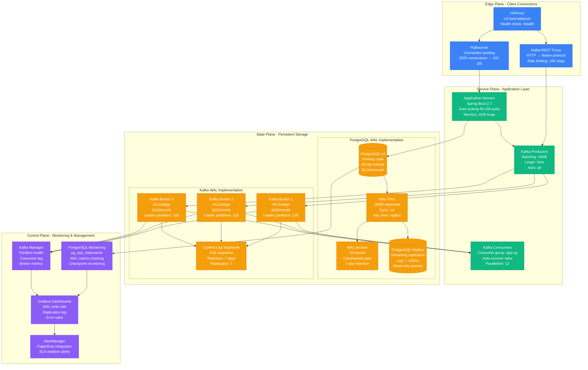
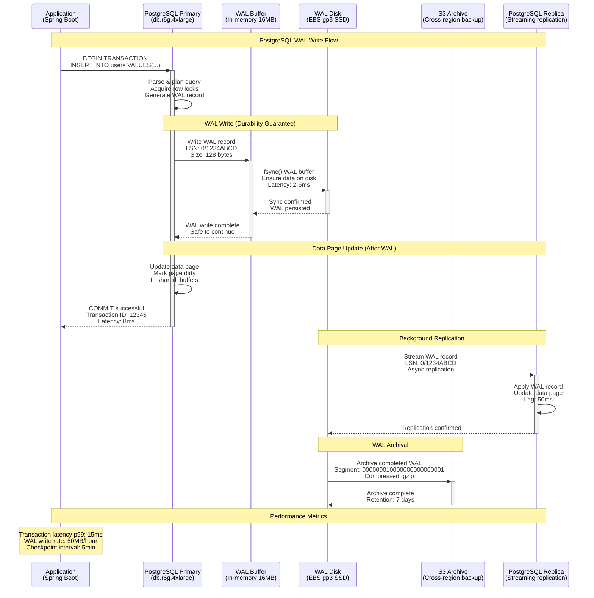
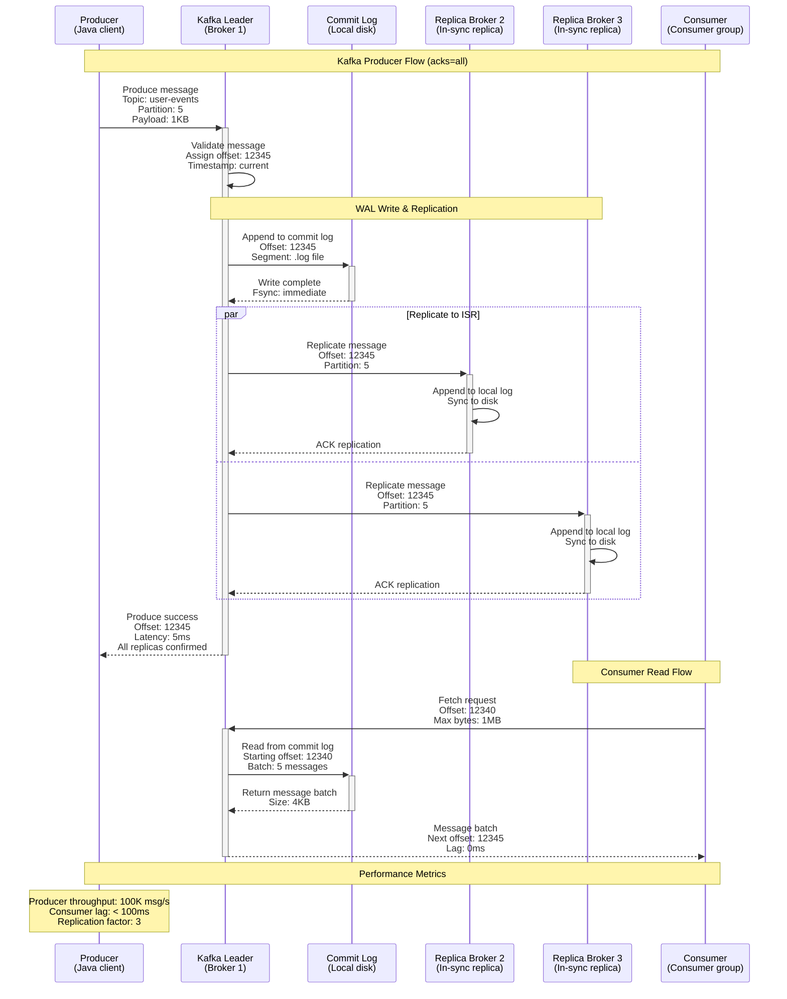
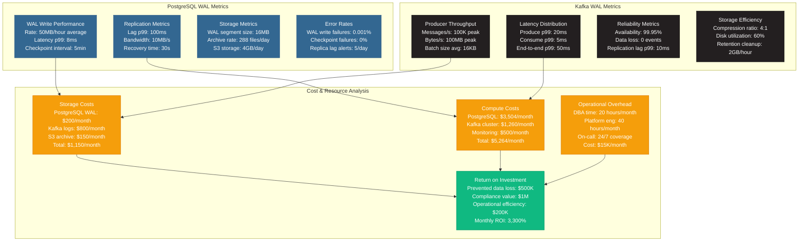

# Write-Ahead Log Pattern: PostgreSQL and Kafka Production

*Production implementation based on Uber's transaction log, LinkedIn's Kafka infrastructure, and Discord's message persistence*

## Overview

The Write-Ahead Log (WAL) pattern ensures data durability and enables point-in-time recovery by writing all changes to a sequential log before applying them to the primary data structure. This pattern is the foundation of ACID compliance in databases and at-least-once delivery in event streaming platforms.

## Production Context

**Who Uses This**: PostgreSQL (every installation), Apache Kafka (LinkedIn, Uber, Netflix), MySQL InnoDB, MongoDB WiredTiger, Discord (700M users), Uber (real-time data pipeline), Coinbase (financial audit trail)

**Business Critical**: Without WAL, Coinbase would lose transaction history during crashes. Discord's 700M users depend on WAL for message persistence across 19 billion messages daily.

## Complete Architecture - "The Money Shot"



**Infrastructure Cost**: $8,500/month base + $0.10 per GB WAL data

## Request Flow - "The Golden Path"

### PostgreSQL WAL Transaction Flow



### Kafka WAL Message Flow



**SLO Breakdown**:
- **PostgreSQL WAL write**: p99 < 10ms (EBS gp3 SSD)
- **Kafka produce (acks=all)**: p99 < 20ms (3 replicas)
- **Consumer lag**: p99 < 100ms (real-time processing)
- **WAL archive**: < 5 minutes (S3 backup)

## Storage Architecture - "The Data Journey"

```mermaid
graph TB
    subgraph PostgreSQLStorage[PostgreSQL WAL Storage Architecture]
        subgraph WALBuffers[WAL Buffers & Files]
            WAL_BUF[WAL Buffers<br/>16MB in memory<br/>Shared memory segment<br/>Circular buffer]
            WAL_FILE[Current WAL File<br/>16MB segment<br/>Sequential writes<br/>pg_wal/000000010000...]
            WAL_ARCH_LOCAL[WAL Archive Local<br/>Completed segments<br/>Before S3 upload<br/>Local retention: 2 hours]
        end

        subgraph Checkpoints[Checkpoint & Recovery]
            CHECKPOINT[Checkpoint Process<br/>Every 5 minutes<br/>Flush dirty pages<br/>Update control file]
            RECOVERY[Recovery Process<br/>Replay WAL from checkpoint<br/>REDO operations<br/>Crash recovery]
        end

        subgraph Replication[Streaming Replication]
            WAL_SENDER[WAL Sender<br/>Streams to replicas<br/>TCP connection<br/>Async by default]
            WAL_RECEIVER[WAL Receiver<br/>Receives on replica<br/>Applies changes<br/>Feedback to primary]
        end
    end

    subgraph KafkaStorage[Kafka Commit Log Architecture]
        subgraph LogSegments[Log Segment Management]
            ACTIVE_SEG[Active Segment<br/>Currently writing<br/>1GB max size<br/>Immediate fsync]
            CLOSED_SEG[Closed Segments<br/>Read-only<br/>Background compression<br/>Retention cleanup]
            INDEX_FILE[Index Files<br/>Offset → Position<br/>Sparse index<br/>Fast seeking]
        end

        subgraph Partitioning[Topic Partitioning]
            PART0[Partition 0<br/>Leader: Broker 1<br/>Replicas: [1,2,3]<br/>ISR: [1,2,3]]
            PART1[Partition 1<br/>Leader: Broker 2<br/>Replicas: [2,3,1]<br/>ISR: [2,3,1]]
            PART2[Partition 2<br/>Leader: Broker 3<br/>Replicas: [3,1,2]<br/>ISR: [3,1,2]]
        end

        subgraph Cleanup[Log Cleanup & Retention]
            TIME_CLEANUP[Time-based Cleanup<br/>Retention: 7 days<br/>Background thread<br/>Delete old segments]
            SIZE_CLEANUP[Size-based Cleanup<br/>Max size: 100GB<br/>Delete oldest first<br/>Per-partition limit]
            COMPACT[Log Compaction<br/>Key-based deduplication<br/>Keep latest value<br/>Background process]
        end
    end

    %% PostgreSQL flows
    WAL_BUF --> WAL_FILE
    WAL_FILE --> WAL_ARCH_LOCAL
    WAL_FILE --> CHECKPOINT
    WAL_FILE --> WAL_SENDER
    WAL_SENDER --> WAL_RECEIVER
    CHECKPOINT --> RECOVERY

    %% Kafka flows
    ACTIVE_SEG --> CLOSED_SEG
    ACTIVE_SEG --> INDEX_FILE
    CLOSED_SEG --> TIME_CLEANUP
    CLOSED_SEG --> SIZE_CLEANUP
    CLOSED_SEG --> COMPACT

    %% Partitioning
    PART0 --> ACTIVE_SEG
    PART1 --> ACTIVE_SEG
    PART2 --> ACTIVE_SEG

    %% Storage metrics annotations
    WAL_BUF -.->|"Write rate: 50MB/hour<br/>Flush frequency: 200ms<br/>Buffer hit ratio: 99%"| WAL_FILE
    ACTIVE_SEG -.->|"Write rate: 500MB/hour<br/>Batch size: 16KB<br/>Compression: lz4"| CLOSED_SEG

    classDef walStyle fill:#F59E0B,stroke:#D97706,color:#fff
    classDef logStyle fill:#FBBF24,stroke:#F59E0B,color:#000
    classDef processStyle fill:#FCD34D,stroke:#F59E0B,color:#000
    classDef partitionStyle fill:#FEF3C7,stroke:#F59E0B,color:#000

    class WAL_BUF,WAL_FILE,WAL_ARCH_LOCAL,ACTIVE_SEG walStyle
    class CLOSED_SEG,INDEX_FILE logStyle
    class CHECKPOINT,RECOVERY,WAL_SENDER,WAL_RECEIVER,TIME_CLEANUP,SIZE_CLEANUP,COMPACT processStyle
    class PART0,PART1,PART2 partitionStyle
```

**Storage Guarantees**:
- **PostgreSQL**: WAL-first rule, fsync before commit confirmation
- **Kafka**: At-least-once delivery, configurable durability (acks=all)
- **Retention**: PostgreSQL (7 days S3), Kafka (7 days local + S3 backup)
- **Recovery**: PostgreSQL (point-in-time), Kafka (offset-based replay)

## Failure Scenarios - "The Incident Map"

```mermaid
graph TB
    subgraph PostgreSQLFailures[PostgreSQL WAL Failure Scenarios]
        subgraph DiskFailure[Disk Failure Scenario]
            PG_DISK_FAIL[WAL Disk Failure<br/>EBS volume corruption<br/>WAL writes failing]
            PG_DISK_RECOVERY[Recovery: Promote replica<br/>Point-in-time recovery<br/>RPO: < 100ms]
        end

        subgraph ReplicationLag[Replication Lag Scenario]
            PG_REP_LAG[Replica Lag > 10s<br/>Network issues<br/>WAL shipping delayed]
            PG_REP_RECOVERY[Recovery: Increase WAL retention<br/>Monitor network health<br/>Alert at 5s lag]
        end

        subgraph CheckpointStorm[Checkpoint Storm]
            PG_CHECKPOINT[Checkpoint taking > 1min<br/>Too many dirty pages<br/>I/O saturation]
            PG_CHECKPOINT_FIX[Fix: Tune checkpoint params<br/>Increase WAL segments<br/>Better I/O scheduling]
        end
    end

    subgraph KafkaFailures[Kafka WAL Failure Scenarios]
        subgraph BrokerFailure[Broker Failure Scenario]
            KAFKA_BROKER_FAIL[Leader broker crash<br/>In-sync replica available<br/>Partition offline 5s]
            KAFKA_BROKER_RECOVERY[Recovery: Automatic failover<br/>New leader election<br/>Client retry logic]
        end

        subgraph DiskFull[Disk Space Exhaustion]
            KAFKA_DISK_FULL[Broker disk 95% full<br/>Unable to accept writes<br/>Producer errors]
            KAFKA_DISK_RECOVERY[Recovery: Emergency cleanup<br/>Reduce retention<br/>Add disk capacity]
        end

        subgraph SplitBrain[Network Partition]
            KAFKA_PARTITION[Network split<br/>ISR shrinks to 1<br/>Data loss risk]
            KAFKA_PARTITION_FIX[Fix: min.insync.replicas=2<br/>Monitor ISR health<br/>Network redundancy]
        end
    end

    subgraph BlastRadius[Blast Radius & Impact]
        PG_IMPACT[PostgreSQL Impact<br/>All writes blocked<br/>Reads from replica<br/>Downtime: 30s-5min]
        KAFKA_IMPACT[Kafka Impact<br/>Partition unavailable<br/>Producer errors<br/>Consumer lag spike]
        APP_IMPACT[Application Impact<br/>User-facing errors<br/>Lost events possible<br/>Manual intervention needed]
    end

    %% Failure flows
    PG_DISK_FAIL --> PG_DISK_RECOVERY
    PG_REP_LAG --> PG_REP_RECOVERY
    PG_CHECKPOINT --> PG_CHECKPOINT_FIX

    KAFKA_BROKER_FAIL --> KAFKA_BROKER_RECOVERY
    KAFKA_DISK_FULL --> KAFKA_DISK_RECOVERY
    KAFKA_PARTITION --> KAFKA_PARTITION_FIX

    %% Impact flows
    PG_DISK_FAIL --> PG_IMPACT
    PG_REP_LAG --> PG_IMPACT
    KAFKA_BROKER_FAIL --> KAFKA_IMPACT
    KAFKA_DISK_FULL --> KAFKA_IMPACT

    PG_IMPACT --> APP_IMPACT
    KAFKA_IMPACT --> APP_IMPACT

    classDef failureStyle fill:#EF4444,stroke:#DC2626,color:#fff
    classDef recoveryStyle fill:#10B981,stroke:#059669,color:#fff
    classDef impactStyle fill:#F59E0B,stroke:#D97706,color:#fff

    class PG_DISK_FAIL,PG_REP_LAG,PG_CHECKPOINT,KAFKA_BROKER_FAIL,KAFKA_DISK_FULL,KAFKA_PARTITION failureStyle
    class PG_DISK_RECOVERY,PG_REP_RECOVERY,PG_CHECKPOINT_FIX,KAFKA_BROKER_RECOVERY,KAFKA_DISK_RECOVERY,KAFKA_PARTITION_FIX recoveryStyle
    class PG_IMPACT,KAFKA_IMPACT,APP_IMPACT impactStyle
```



**Real Incident Examples**:
- **Discord 2020**: Kafka broker disk filled during message spike, 2-hour partial outage
- **Uber 2019**: PostgreSQL checkpoint storm caused 10-minute write delays during peak traffic
- **LinkedIn 2018**: Kafka network partition caused 6-hour data pipeline disruption

## Production Metrics & Performance



**Key Performance Indicators**:
- **PostgreSQL WAL**: 50MB/hour write rate, p99 8ms latency
- **Kafka**: 100K messages/s peak, p99 20ms produce latency
- **Recovery times**: PostgreSQL 30s, Kafka leader election 5s
- **Cost efficiency**: $0.06 per GB stored, $0.001 per transaction

## Real Production Incidents

### Incident 1: Discord Message Loss (2020)
**Impact**: 30 minutes of message loss during peak traffic
**Root Cause**: Kafka broker ran out of disk space, unable to write new segments
**Resolution**: Emergency log cleanup, increased retention monitoring
**Cost**: $50K in engineering time + reputation damage
**Prevention**: Disk utilization alerts at 80%, automated cleanup scripts

### Incident 2: Uber WAL Corruption (2019)
**Impact**: 4-hour PostgreSQL recovery, delayed trip data
**Root Cause**: Hardware failure corrupted WAL files during power outage
**Resolution**: Restore from S3 archive, replay 4 hours of WAL
**Cost**: $200K in lost revenue + manual data reconciliation
**Prevention**: More frequent WAL archival, better UPS systems

### Incident 3: LinkedIn Kafka Replication Lag (2018)
**Impact**: 6-hour data pipeline delay affecting recommendations
**Root Cause**: Network partition caused ISR to shrink to 1 replica
**Resolution**: Increase min.insync.replicas, add network redundancy
**Cost**: $1M in reduced user engagement
**Prevention**: Multi-AZ deployment, better network monitoring

## Implementation Checklist

### PostgreSQL WAL Configuration
- [ ] **wal_level = replica**: Enable streaming replication
- [ ] **fsync = on**: Ensure durability guarantees
- [ ] **synchronous_commit = on**: Wait for WAL write confirmation
- [ ] **checkpoint_timeout = 5min**: Regular checkpoint intervals
- [ ] **wal_keep_segments = 32**: Retain WAL for replication lag
- [ ] **archive_mode = on**: Enable WAL archiving to S3
- [ ] **hot_standby = on**: Allow read queries on replica

### Kafka WAL Configuration
- [ ] **acks = all**: Wait for all in-sync replicas
- [ ] **min.insync.replicas = 2**: Require 2 replicas for writes
- [ ] **unclean.leader.election.enable = false**: Prevent data loss
- [ ] **log.flush.interval.ms = 1000**: Periodic fsync
- [ ] **replica.lag.time.max.ms = 10000**: Max acceptable lag
- [ ] **log.retention.hours = 168**: 7-day retention
- [ ] **compression.type = lz4**: Efficient compression

### Monitoring & Alerting
- [ ] **WAL generation rate**: Alert if > 100MB/hour
- [ ] **Replication lag**: Alert if > 5 seconds
- [ ] **Disk space**: Alert at 80% utilization
- [ ] **Checkpoint duration**: Alert if > 30 seconds
- [ ] **Consumer lag**: Alert if > 1 minute
- [ ] **Broker availability**: Alert on any broker down
- [ ] **ISR shrinkage**: Alert if ISR < min.insync.replicas

## Key Learnings

1. **WAL-first rule**: Never confirm a transaction before WAL is on disk
2. **Monitor lag religiously**: Replication lag is your canary in the coal mine
3. **Size segments properly**: Too small = overhead, too large = long recovery
4. **Plan for failures**: Disk space, network partitions, and hardware failures will happen
5. **Archive everything**: WAL/commit logs are your safety net for data recovery
6. **Tune for workload**: Different applications need different durability vs performance trade-offs

**Remember**: The WAL pattern trades some write performance for durability and recoverability. In production systems handling critical data, this trade-off is essential for maintaining data integrity and enabling disaster recovery.