# Cassandra Performance Profile

## Overview

Apache Cassandra performance characteristics in production environments, covering compaction strategies, consistency levels, token ring rebalancing, and time-series optimization. Based on Netflix's implementation achieving 1M writes/sec and other high-scale deployments.

## Compaction Strategies Comparison

### Size-Tiered Compaction Strategy (STCS)

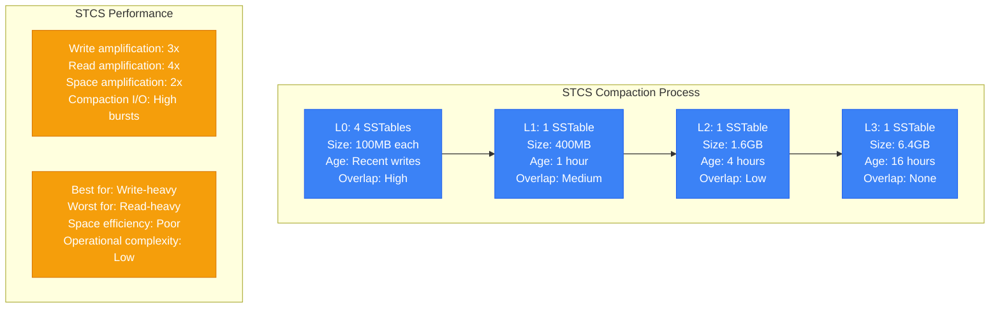

### Leveled Compaction Strategy (LCS)

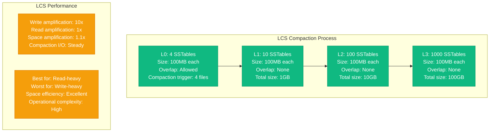

### Time-Window Compaction Strategy (TWCS)

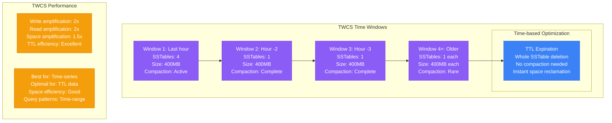

### Compaction Strategy Performance Comparison

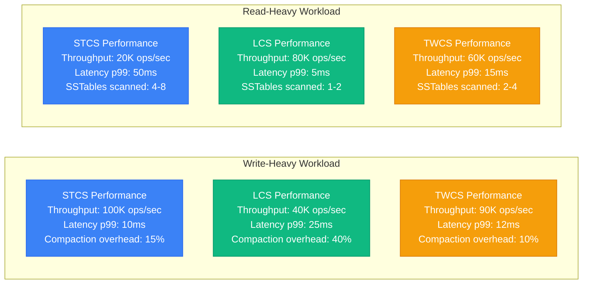

## Consistency Level Trade-offs

### Consistency Level Performance Impact

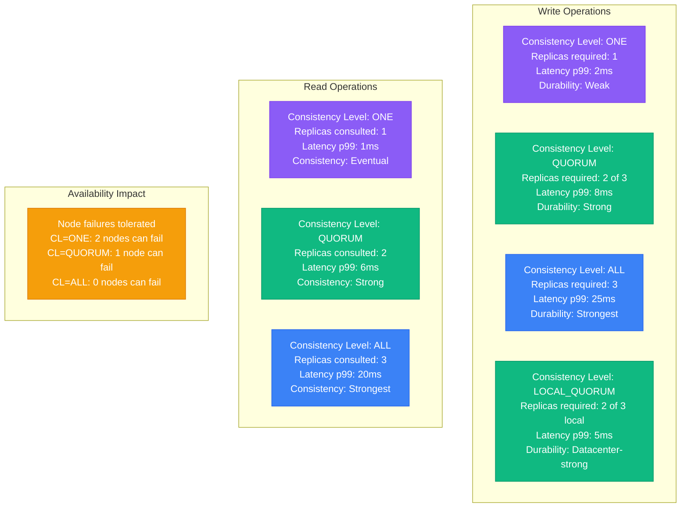

### Read Repair and Anti-Entropy

```mermaid
graph TB
    subgraph Read_Repair_Process[Read Repair Process]
        RR1[Client read request<br/>CL = QUORUM<br/>2 replicas consulted<br/>Timestamp comparison]

        RR2[Replica A response<br/>Value: user_email = old@example.com<br/>Timestamp: 1000]

        RR3[Replica B response<br/>Value: user_email = new@example.com<br/>Timestamp: 2000]

        RR4[Read repair triggered<br/>Background write to A<br/>Consistency restored<br/>Client gets new value]

        RR1 --> RR2
        RR1 --> RR3
        RR2 --> RR4
        RR3 --> RR4
    end

    subgraph Anti_Entropy__Repair[Anti-Entropy (Repair)]
        AE1[Scheduled repair<br/>Frequency: Weekly<br/>Resource intensive<br/>Cluster-wide operation]

        AE2[Incremental repair<br/>Only changed data<br/>Reduced I/O impact<br/>Faster completion]

        AE3[Performance impact<br/>CPU usage: +30%<br/>Network usage: +50%<br/>Duration: 4-8 hours]

        AE1 --> AE2 --> AE3
    end

    classDef readRepairStyle fill:#10B981,stroke:#059669,color:#fff
    classDef antiEntropyStyle fill:#3B82F6,stroke:#2563EB,color:#fff
    classDef perfImpactStyle fill:#8B5CF6,stroke:#7C3AED,color:#fff

    class RR1,RR2,RR3,RR4 readRepairStyle
    class AE1,AE2 antiEntropyStyle
    class AE3 perfImpactStyle
```

## Token Ring Rebalancing Cost

### Token Ring Architecture

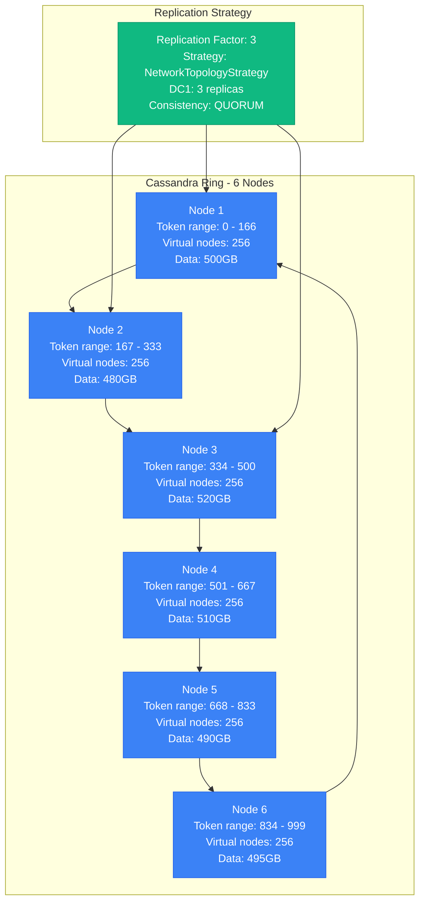

### Node Addition Rebalancing

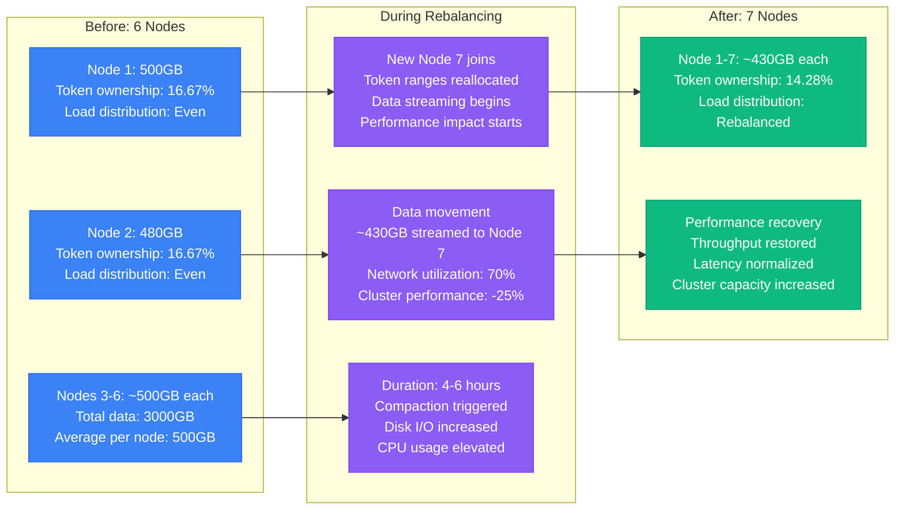

### Virtual Nodes (vnodes) Performance Impact

```mermaid
graph TB
    subgraph Traditional_Token_Assignment[Traditional Token Assignment]
        T1[1 token per node<br/>Manual token assignment<br/>Uneven data distribution<br/>Hotspots common]

        T2[Rebalancing challenges<br/>Manual intervention<br/>Longer streaming times<br/>Complex operations]
    end

    subgraph Virtual_Nodes__vnodes[Virtual Nodes (vnodes)]
        V1[256 vnodes per node<br/>Automatic token assignment<br/>Even data distribution<br/>Reduced hotspots]

        V2[Rebalancing benefits<br/>Faster convergence<br/>Better load distribution<br/>Automatic optimization]
    end

    subgraph Performance_Comparison[Performance Comparison]
        P1[Traditional approach<br/>Rebalance time: 8-12 hours<br/>Manual intervention: Required<br/>Data distribution: ±20%]

        P2[vnodes approach<br/>Rebalance time: 4-6 hours<br/>Manual intervention: None<br/>Data distribution: ±5%]
    end

    T1 --> P1
    V1 --> P2
    T2 --> P1
    V2 --> P2

    classDef traditionalStyle fill:#8B5CF6,stroke:#7C3AED,color:#fff
    classDef vnodesStyle fill:#10B981,stroke:#059669,color:#fff
    classDef perfStyle fill:#3B82F6,stroke:#2563EB,color:#fff

    class T1,T2 traditionalStyle
    class V1,V2 vnodesStyle
    class P1,P2 perfStyle
```

## Time-Series Optimization

### Time-Series Data Modeling

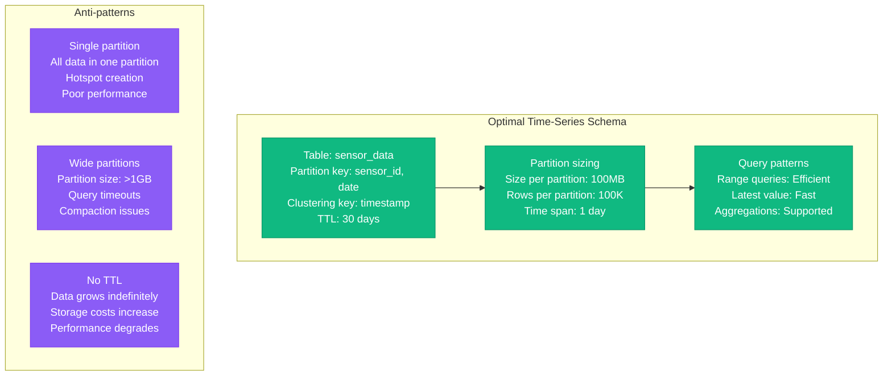

### Time-Series Query Performance

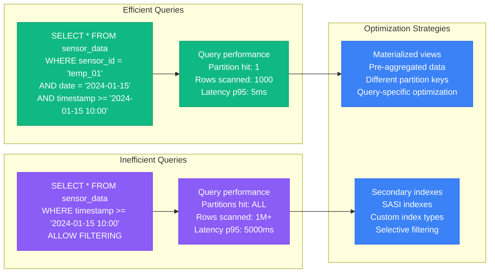

## Netflix's 1M Writes/sec Achievement

### Netflix's Cassandra Architecture

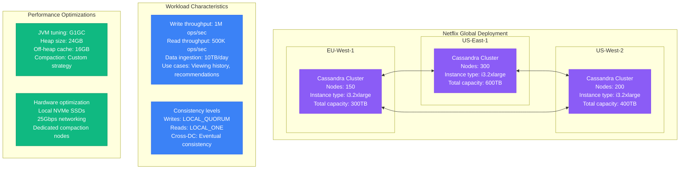

### Critical Configuration for Scale

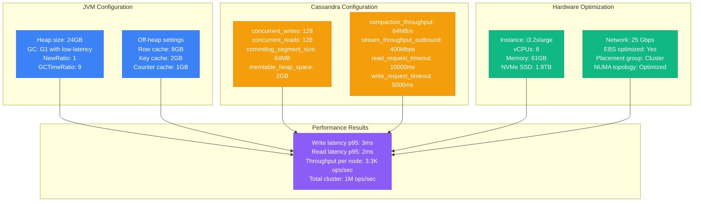

### Scaling Timeline and Lessons

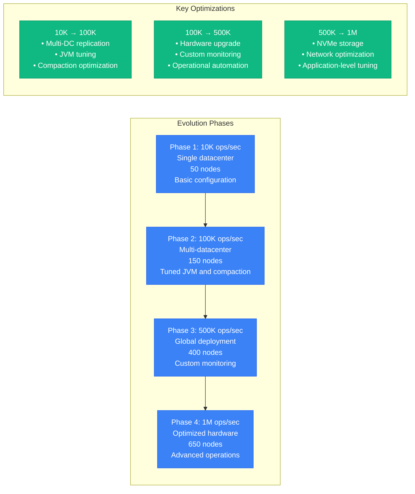

## Production Lessons Learned

### Critical Performance Factors

1. **Compaction Strategy Selection**: STCS for writes, LCS for reads, TWCS for time-series
2. **Consistency Level Tuning**: LOCAL_QUORUM provides best balance of performance and consistency
3. **Token Ring Management**: vnodes essential for operational simplicity and performance
4. **JVM Tuning**: G1GC with proper heap sizing critical for low-latency operations
5. **Hardware Selection**: Local NVMe SSDs provide 10x better performance than EBS

### Performance Optimization Checklist

| Component | Small Scale | Medium Scale | Large Scale | Critical Settings |
|-----------|-------------|--------------|-------------|-------------------|
| Heap Size | 8GB | 16GB | 24-32GB | Max 50% of RAM |
| Compaction | STCS | LCS/TWCS | Custom | Workload dependent |
| Consistency | QUORUM | LOCAL_QUORUM | LOCAL_QUORUM | Balance perf/consistency |
| Concurrent Ops | 32/32 | 64/64 | 128/128 | CPU core dependent |
| Network | 1 Gbps | 10 Gbps | 25 Gbps | Inter-node communication |

### Common Pitfalls

1. **Under-tuned JVM**: Default settings inadequate for production loads
2. **Wrong compaction strategy**: STCS for read-heavy workloads causes high latency
3. **Large partitions**: >100MB partitions cause performance degradation
4. **No monitoring**: Performance issues discovered too late
5. **Insufficient hardware**: CPU and network bottlenecks limit scalability

**Source**: Based on Netflix, Apple, and Instagram Cassandra implementations