# Cassandra Performance Profile

## Overview

Apache Cassandra performance characteristics in production environments, covering compaction strategies, consistency levels, token ring rebalancing, and time-series optimization. Based on Netflix's implementation achieving 1M writes/sec and other high-scale deployments.

## Compaction Strategies Comparison

### Size-Tiered Compaction Strategy (STCS)

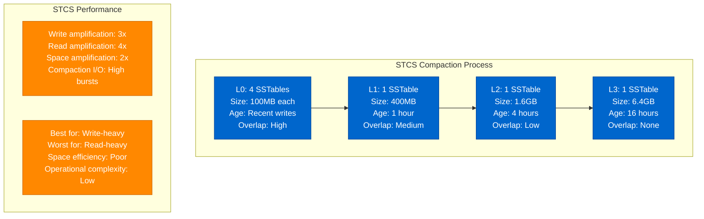

### Leveled Compaction Strategy (LCS)

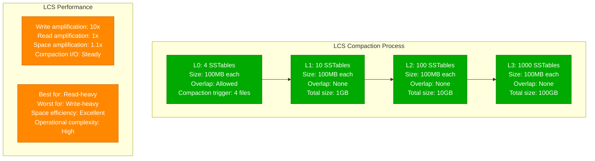

### Time-Window Compaction Strategy (TWCS)

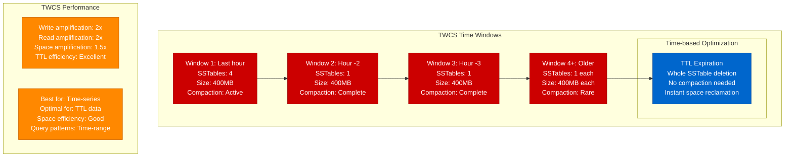

### Compaction Strategy Performance Comparison

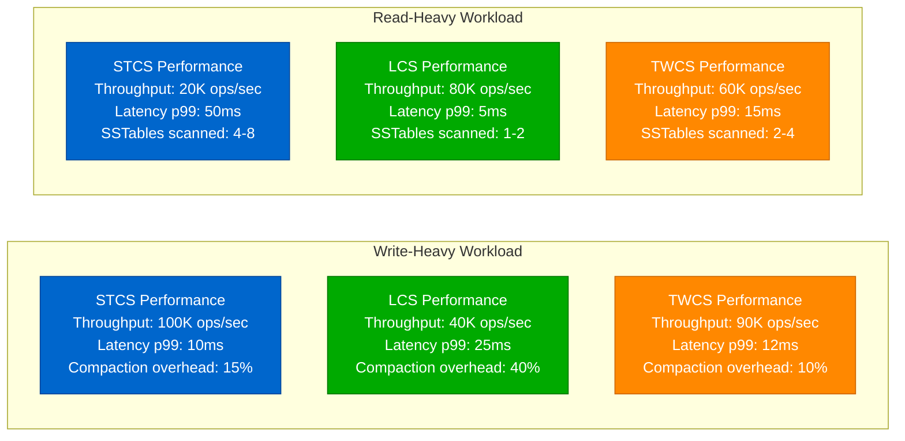

## Consistency Level Trade-offs

### Consistency Level Performance Impact

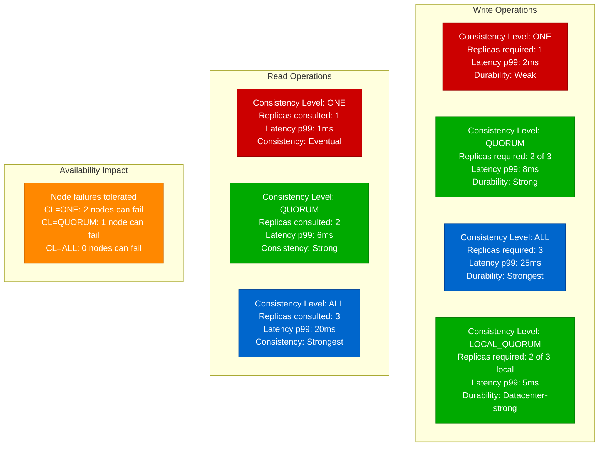

### Read Repair and Anti-Entropy

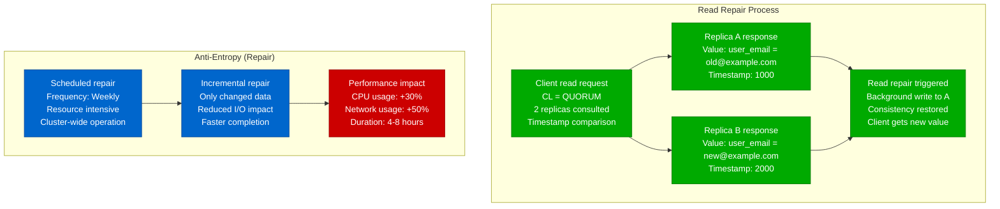

## Token Ring Rebalancing Cost

### Token Ring Architecture

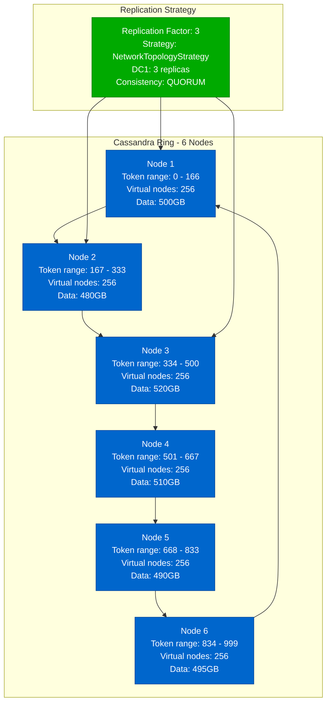

### Node Addition Rebalancing

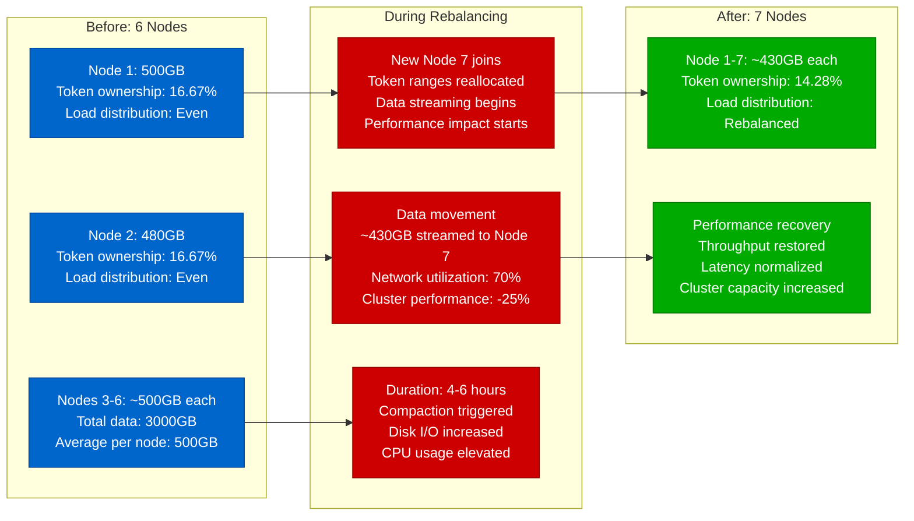

### Virtual Nodes (vnodes) Performance Impact

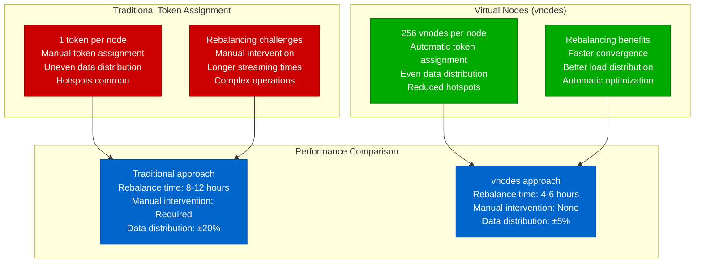

## Time-Series Optimization

### Time-Series Data Modeling

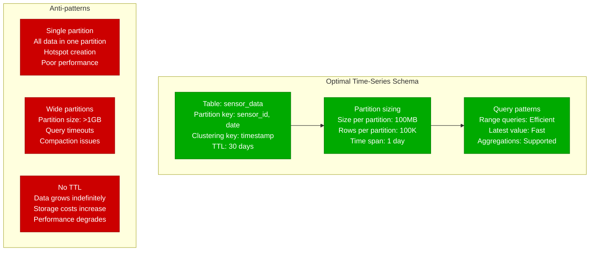

### Time-Series Query Performance

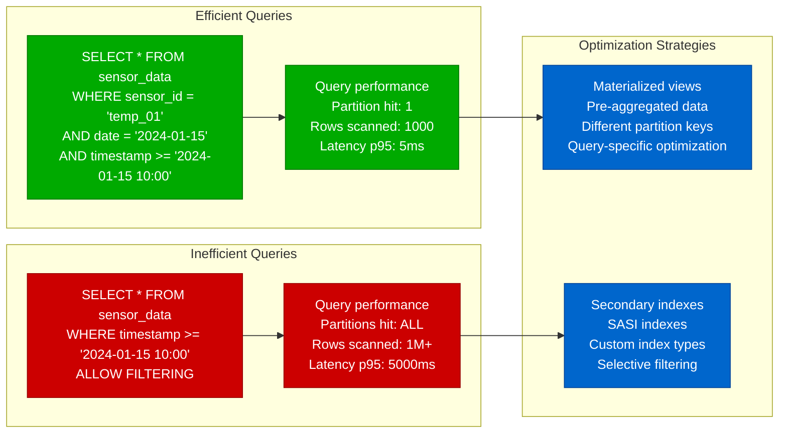

## Netflix's 1M Writes/sec Achievement

### Netflix's Cassandra Architecture

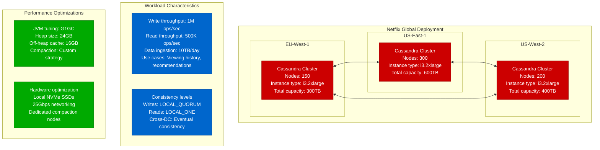

### Critical Configuration for Scale

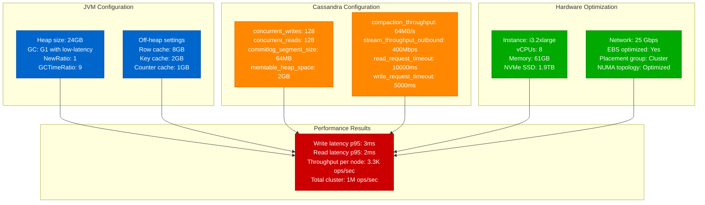

### Scaling Timeline and Lessons

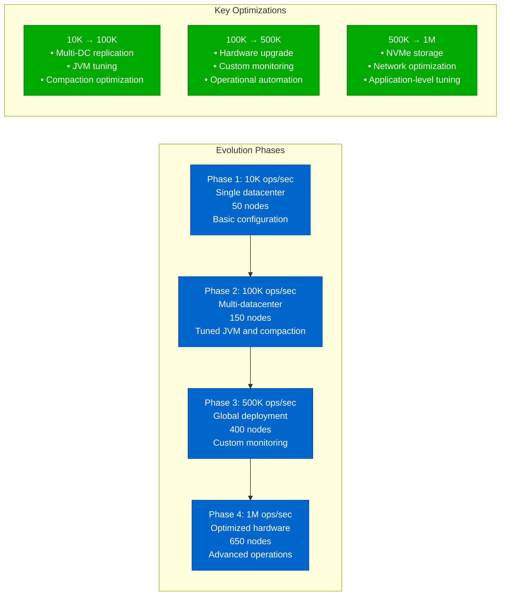

## Production Lessons Learned

### Critical Performance Factors

1. **Compaction Strategy Selection**: STCS for writes, LCS for reads, TWCS for time-series
2. **Consistency Level Tuning**: LOCAL_QUORUM provides best balance of performance and consistency
3. **Token Ring Management**: vnodes essential for operational simplicity and performance
4. **JVM Tuning**: G1GC with proper heap sizing critical for low-latency operations
5. **Hardware Selection**: Local NVMe SSDs provide 10x better performance than EBS

### Performance Optimization Checklist

| Component | Small Scale | Medium Scale | Large Scale | Critical Settings |
|-----------|-------------|--------------|-------------|-------------------|
| Heap Size | 8GB | 16GB | 24-32GB | Max 50% of RAM |
| Compaction | STCS | LCS/TWCS | Custom | Workload dependent |
| Consistency | QUORUM | LOCAL_QUORUM | LOCAL_QUORUM | Balance perf/consistency |
| Concurrent Ops | 32/32 | 64/64 | 128/128 | CPU core dependent |
| Network | 1 Gbps | 10 Gbps | 25 Gbps | Inter-node communication |

### Common Pitfalls

1. **Under-tuned JVM**: Default settings inadequate for production loads
2. **Wrong compaction strategy**: STCS for read-heavy workloads causes high latency
3. **Large partitions**: >100MB partitions cause performance degradation
4. **No monitoring**: Performance issues discovered too late
5. **Insufficient hardware**: CPU and network bottlenecks limit scalability

**Source**: Based on Netflix, Apple, and Instagram Cassandra implementations