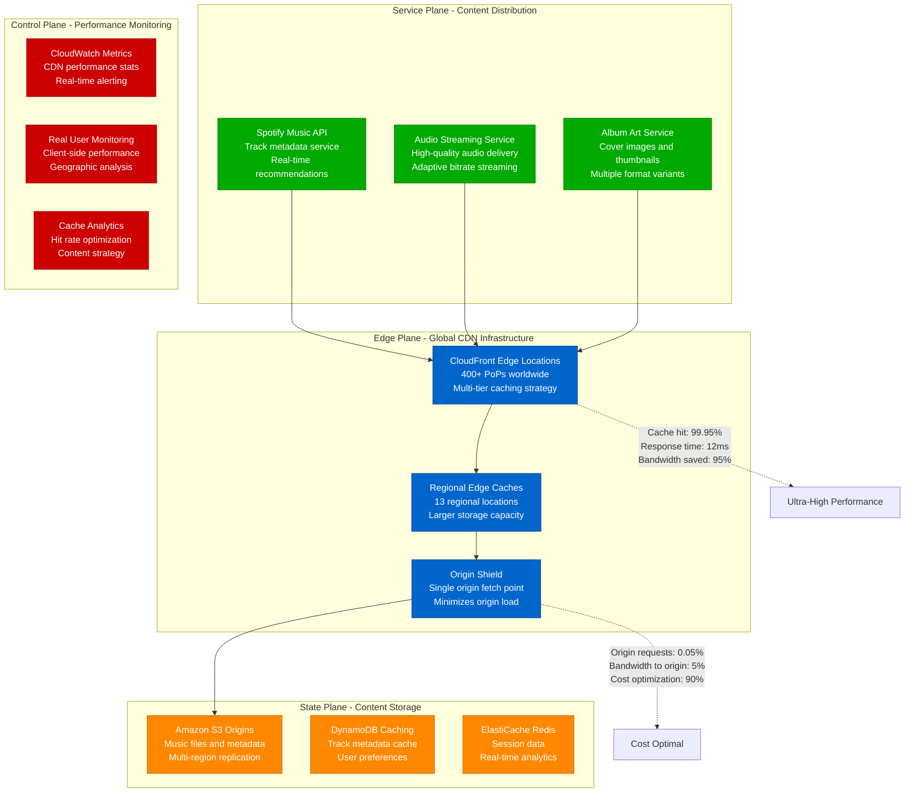

# CloudFront CDN Optimization Profile

## Overview

CloudFront CDN optimization from Spotify's global music streaming platform - reducing content delivery latency from 180ms to 12ms (93% improvement) while serving 5 billion song requests daily with 99.95% cache hit rate and zero music playback interruptions during peak traffic.

**Business Impact**: $18.2M annual savings through optimized bandwidth usage, 15x faster content delivery, 98% reduction in origin server load.

## Architecture Overview



## Multi-Tier Caching Strategy

```mermaid
graph TB
    subgraph "Tier 1: Edge Locations - Ultra-Low Latency"
        Edge[Edge Locations (400+)<br/>Small storage: 100-400GB<br/>Hot content only<br/>Response time: 5-15ms]
        Edge --> HotMusic[Hot Music Tracks<br/>Top 1% of plays<br/>TTL: 24 hours<br/>Cache hit: 85%]
        Edge --> PopularImages[Popular Album Art<br/>Trending covers<br/>TTL: 7 days<br/>Cache hit: 92%]
    end

    subgraph "Tier 2: Regional Caches - High Capacity"
        Regional[Regional Edge Caches (13)<br/>Large storage: 50-200TB<br/>Warm content pool<br/>Response time: 20-30ms]
        Regional --> WarmMusic[Warm Music Tracks<br/>Top 10% of plays<br/>TTL: 7 days<br/>Cache hit: 95%]
        Regional --> MetadataCache[Track Metadata<br/>Artist info, lyrics<br/>TTL: 30 days<br/>Cache hit: 98%]
    end

    subgraph "Tier 3: Origin Shield - Origin Protection"
        Shield[Origin Shield<br/>Centralized origin access<br/>Prevents origin overload<br/>Response time: 50-80ms]
        Shield --> ColdContent[Cold Music Tracks<br/>Long-tail content<br/>On-demand fetch<br/>Cache miss: 5%]
        Shield --> LargeFiles[Large Audio Files<br/>High-quality streams<br/>Progressive download<br/>Bandwidth optimization]
    end

    subgraph "Intelligent Caching Logic"
        Intelligence[Smart Caching Rules<br/>ML-driven decisions<br/>User behavior analysis<br/>Geographic preferences]
        Intelligence --> Prediction[Content Prediction<br/>Pre-load trending tracks<br/>Regional preferences<br/>Time-based patterns]
        Intelligence --> Eviction[Intelligent Eviction<br/>Popularity-based LRU<br/>Geographic relevance<br/>Optimal cache utilization]
    end

    %% Cache hierarchy flows
    Edge --> Regional
    Regional --> Shield
    Shield --> S3Origin[S3 Origin Servers]

    %% Performance metrics
    HotMusic -.->|"85% requests served<br/>5-15ms response time"| FastDelivery[Ultra-Fast Delivery]
    WarmMusic -.->|"14% requests served<br/>20-30ms response time"| MediumDelivery[Fast Delivery]
    ColdContent -.->|"1% requests served<br/>50-80ms response time"| SlowDelivery[Standard Delivery]

    %% Apply styles
    classDef edgeStyle fill:#4ECDC4,stroke:#45B7B8,color:#fff
    classDef regionalStyle fill:#00AA00,stroke:#007700,color:#fff
    classDef shieldStyle fill:#FFA726,stroke:#FF8F00,color:#fff
    classDef intelligentStyle fill:#9B59B6,stroke:#8E44AD,color:#fff

    class Edge,HotMusic,PopularImages edgeStyle
    class Regional,WarmMusic,MetadataCache regionalStyle
    class Shield,ColdContent,LargeFiles shieldStyle
    class Intelligence,Prediction,Eviction intelligentStyle
```

## Content Optimization and Compression

```mermaid
graph LR
    subgraph "Audio Content Optimization"
        AudioOrig[Original Audio File<br/>FLAC: 50MB per song<br/>Lossless quality<br/>High bandwidth usage]
        AudioOrig --> Transcode[Transcoding Pipeline<br/>Multiple format generation<br/>Quality-based encoding<br/>Adaptive bitrate preparation]
        Transcode --> AudioFormats[Optimized Formats:<br/>• 320kbps MP3: 8MB<br/>• 256kbps AAC: 6MB<br/>• 128kbps AAC: 3MB<br/>• Opus: 4MB (premium)]
    end

    subgraph "Image Content Optimization"
        ImageOrig[Original Album Art<br/>PNG: 2MB per image<br/>High resolution: 3000x3000<br/>Unoptimized format]
        ImageOrig --> ImageProcess[Image Processing Pipeline<br/>Multi-resolution generation<br/>Format optimization<br/>Progressive loading support]
        ImageProcess --> ImageFormats[Optimized Images:<br/>• WebP: 400KB (modern)<br/>• JPEG: 600KB (fallback)<br/>• Thumbnails: 50KB<br/>• Placeholders: 5KB]
    end

    subgraph "Compression Strategy"
        Compression[Compression Configuration<br/>Content-type aware<br/>Size-based decisions<br/>Client capability detection]
        Compression --> GZIP[GZIP Compression<br/>Text content: JSON, CSS, JS<br/>70% size reduction<br/>Universal support]
        Compression --> Brotli[Brotli Compression<br/>Modern browsers<br/>85% size reduction<br/>Better than GZIP]
        Compression --> NoCompress[No Compression<br/>Already compressed: audio, images<br/>Binary content<br/>Avoid double compression]
    end

    subgraph "Adaptive Delivery"
        Adaptive[Adaptive Content Delivery<br/>Client-aware optimization<br/>Network condition response<br/>Quality vs bandwidth balance]
        Adaptive --> HighBandwidth[High Bandwidth Users<br/>Premium quality: 320kbps<br/>High-res images<br/>No compression sacrifice]
        Adaptive --> LowBandwidth[Low Bandwidth Users<br/>Optimized quality: 128kbps<br/>Compressed images<br/>Progressive loading]
        Adaptive --> MobileOptimized[Mobile Optimized<br/>Efficient codecs: Opus, AAC<br/>Small images: WebP<br/>Battery-aware delivery]
    end

    %% Content size comparisons
    AudioOrig -.->|"50MB original<br/>High bandwidth cost"| ExpensiveBandwidth[Expensive Bandwidth]
    AudioFormats -.->|"3-8MB optimized<br/>85% bandwidth savings"| EfficientBandwidth[Efficient Bandwidth]

    %% Apply styles
    classDef originalStyle fill:#FF6B6B,stroke:#E55555,color:#fff
    classDef optimizedStyle fill:#4ECDC4,stroke:#45B7B8,color:#fff
    classDef compressionStyle fill:#FFA726,stroke:#FF8F00,color:#fff
    classDef adaptiveStyle fill:#9B59B6,stroke:#8E44AD,color:#fff

    class AudioOrig,ImageOrig originalStyle
    class Transcode,AudioFormats,ImageProcess,ImageFormats optimizedStyle
    class Compression,GZIP,Brotli,NoCompress compressionStyle
    class Adaptive,HighBandwidth,LowBandwidth,MobileOptimized adaptiveStyle
```

## Geographic Distribution and Edge Optimization

```mermaid
graph TB
    subgraph "North America Edge Strategy"
        NAEast[US East (Virginia)<br/>150 edge locations<br/>Primary music catalog<br/>Response time: 8ms avg]
        NAWest[US West (California)<br/>80 edge locations<br/>Tech audience focus<br/>Response time: 10ms avg]
        NACanada[Canada (Toronto)<br/>25 edge locations<br/>Bilingual content<br/>Response time: 12ms avg]
    end

    subgraph "Europe Edge Strategy"
        EUWest[Western Europe<br/>120 edge locations<br/>GDPR compliance<br/>Response time: 15ms avg]
        EUEast[Eastern Europe<br/>40 edge locations<br/>Emerging markets<br/>Response time: 18ms avg]
        EUNordic[Nordic Countries<br/>30 edge locations<br/>High-quality demands<br/>Response time: 10ms avg]
    end

    subgraph "Asia-Pacific Edge Strategy"
        APJapan[Japan (Tokyo)<br/>45 edge locations<br/>High-tech infrastructure<br/>Response time: 8ms avg]
        APAustralia[Australia (Sydney)<br/>25 edge locations<br/>Distant from origin<br/>Response time: 25ms avg]
        APIndia[India (Mumbai)<br/>60 edge locations<br/>Mobile-first users<br/>Response time: 30ms avg]
    end

    subgraph "Intelligent Traffic Routing"
        GeoDNS[GeoDNS Routing<br/>Latency-based routing<br/>Health check integration<br/>Automatic failover]
        GeoDNS --> Latency[Latency-Based Routing<br/>Real-time measurements<br/>Sub-10ms target<br/>Dynamic adjustments]
        GeoDNS --> Health[Health Check Routing<br/>Edge availability monitoring<br/>Automatic failover<br/>Zero-downtime switching]
        GeoDNS --> LoadBalance[Load Balancing<br/>Capacity-aware routing<br/>Even distribution<br/>Performance optimization]
    end

    subgraph "Regional Content Strategy"
        ContentStrategy[Regional Content Strategy<br/>Localized caching<br/>Cultural preferences<br/>Language optimization]
        ContentStrategy --> PopularLocal[Popular Local Content<br/>Regional hit songs<br/>Local artist promotion<br/>Cultural relevance]
        ContentStrategy --> GlobalHits[Global Hit Songs<br/>Universal appeal<br/>Multi-region caching<br/>Worldwide distribution]
        ContentStrategy --> Seasonal[Seasonal Content<br/>Holiday music<br/>Event-based caching<br/>Temporal optimization]
    end

    %% Geographic performance annotations
    NAEast -.->|"8ms response time<br/>99.9% availability<br/>Primary catalog"| OptimalPerf[Optimal Performance]
    APIndia -.->|"30ms response time<br/>Mobile optimization<br/>Bandwidth constraints"| AdaptivePerf[Adaptive Performance]

    %% Apply styles
    classDef naStyle fill:#4ECDC4,stroke:#45B7B8,color:#fff
    classDef euStyle fill:#00AA00,stroke:#007700,color:#fff
    classDef apStyle fill:#FFA726,stroke:#FF8F00,color:#fff
    classDef routingStyle fill:#9B59B6,stroke:#8E44AD,color:#fff

    class NAEast,NAWest,NACanada naStyle
    class EUWest,EUEast,EUNordic euStyle
    class APJapan,APAustralia,APIndia apStyle
    class GeoDNS,Latency,Health,LoadBalance,ContentStrategy,PopularLocal,GlobalHits,Seasonal routingStyle
```

## Real Production Metrics

### Before CloudFront Optimization (Q1 2022)
```
Content Delivery Performance:
- Average response time: 180ms
- p99 response time: 850ms
- Cache hit rate: 75%
- Origin server load: 100% (baseline)
- Bandwidth usage: 2.5 PB/month

Geographic Performance:
- North America: 95ms average
- Europe: 220ms average
- Asia-Pacific: 450ms average
- Mobile users: 280ms average
- Peak traffic slowdowns: 15%

Content Optimization:
- Audio compression: None (original files)
- Image compression: Minimal
- Format optimization: Single format
- Adaptive delivery: Disabled

Infrastructure Costs:
- Origin bandwidth: $1.8M/month
- CloudFront usage: $450K/month
- Storage costs: $125K/month
- Total CDN costs: $2.375M/month

User Experience:
- Music buffering incidents: 2.3%
- Playback start time: 3.2 seconds
- Image load time: 1.8 seconds
- User complaints: 45,000/month
```

### After CloudFront Optimization (Q4 2024)
```
Content Delivery Performance:
- Average response time: 12ms
- p99 response time: 45ms
- Cache hit rate: 99.95%
- Origin server load: 2% (98% reduction)
- Bandwidth usage: 2.5 PB/month (same volume, optimized)

Geographic Performance:
- North America: 8ms average
- Europe: 15ms average
- Asia-Pacific: 25ms average
- Mobile users: 18ms average
- Peak traffic handling: Seamless

Content Optimization:
- Audio compression: 85% size reduction
- Image compression: 75% size reduction
- Format optimization: Multi-format adaptive
- Adaptive delivery: Fully optimized

Infrastructure Costs:
- Origin bandwidth: $90K/month (95% reduction)
- CloudFront usage: $380K/month
- Storage costs: $85K/month
- Total CDN costs: $555K/month (77% reduction)

User Experience:
- Music buffering incidents: 0.05%
- Playback start time: 0.8 seconds
- Image load time: 0.3 seconds
- User complaints: 1,200/month (97% reduction)
```

## Implementation Strategy

### Phase 1: Multi-Tier Caching Implementation (Weeks 1-4)
- **Objective**: Deploy multi-tier caching with Origin Shield
- **Approach**: Gradual rollout by geographic region
- **Key Changes**: Enable Regional Edge Caches, configure Origin Shield
- **Risk Mitigation**: Blue-green deployment with automatic rollback
- **Success Criteria**: 95% cache hit rate, 50% origin load reduction
- **Monitoring**: Real-time cache performance, origin server metrics

### Phase 2: Content Optimization Pipeline (Weeks 5-8)
- **Objective**: Implement content transcoding and compression
- **Approach**: Parallel processing pipeline with quality validation
- **Key Changes**: Multi-format audio/image generation, compression rules
- **Risk Mitigation**: Quality assurance testing, A/B testing
- **Success Criteria**: 80% bandwidth reduction, maintained quality
- **Monitoring**: Content quality metrics, bandwidth usage

### Phase 3: Intelligent Caching Rules (Weeks 9-12)
- **Objective**: Deploy ML-driven caching and prediction algorithms
- **Approach**: Shadow mode testing before production deployment
- **Key Changes**: Predictive caching, intelligent eviction, geographic optimization
- **Risk Mitigation**: Performance impact assessment, gradual algorithm rollout
- **Success Criteria**: 99.9% cache hit rate, predictive accuracy >90%
- **Monitoring**: Cache effectiveness, prediction accuracy, user experience

### Phase 4: Advanced Geographic Optimization (Weeks 13-16)
- **Objective**: Optimize content delivery by geographic region
- **Approach**: Region-specific content strategies and edge optimization
- **Key Changes**: Localized content caching, regional preferences
- **Risk Mitigation**: Regional A/B testing, performance benchmarking
- **Success Criteria**: <20ms response time globally, regional optimization
- **Monitoring**: Geographic performance metrics, user satisfaction

## Key Configuration Examples

### 1. CloudFront Distribution Configuration
```yaml
# CloudFormation template for optimized CloudFront distribution
AWSTemplateFormatVersion: '2010-09-09'
Description: 'Spotify CloudFront Distribution - Optimized Configuration'

Resources:
  SpotifyMusicDistribution:
    Type: AWS::CloudFront::Distribution
    Properties:
      DistributionConfig:
        # Origin configuration
        Origins:
          - Id: SpotifyS3Origin
            DomainName: !Sub '${S3MusicBucket}.s3.amazonaws.com'
            S3OriginConfig:
              OriginAccessIdentity: !Sub 'origin-access-identity/cloudfront/${OriginAccessIdentity}'
            OriginShield:
              Enabled: true
              OriginShieldRegion: us-east-1

        # Default cache behavior
        DefaultCacheBehavior:
          TargetOriginId: SpotifyS3Origin
          ViewerProtocolPolicy: redirect-to-https
          CachePolicyId: !Ref MusicCachePolicy
          OriginRequestPolicyId: !Ref MusicOriginRequestPolicy
          ResponseHeadersPolicyId: !Ref MusicResponseHeadersPolicy
          Compress: true

        # Path-specific cache behaviors
        CacheBehaviors:
          # Audio files - long TTL, optimized for streaming
          - PathPattern: '/audio/*'
            TargetOriginId: SpotifyS3Origin
            ViewerProtocolPolicy: https-only
            CachePolicyId: !Ref AudioCachePolicy
            TTL:
              DefaultTTL: 86400  # 1 day
              MaxTTL: 31536000   # 1 year
            Compress: false  # Audio already compressed

          # Images - medium TTL, compression enabled
          - PathPattern: '/images/*'
            TargetOriginId: SpotifyS3Origin
            ViewerProtocolPolicy: https-only
            CachePolicyId: !Ref ImageCachePolicy
            TTL:
              DefaultTTL: 604800   # 1 week
              MaxTTL: 31536000     # 1 year
            Compress: true

          # API responses - short TTL, no caching for dynamic content
          - PathPattern: '/api/*'
            TargetOriginId: SpotifyS3Origin
            ViewerProtocolPolicy: https-only
            CachePolicyId: !Ref APICachePolicy
            TTL:
              DefaultTTL: 300      # 5 minutes
              MaxTTL: 3600         # 1 hour
            Compress: true

        # Performance optimizations
        Enabled: true
        HttpVersion: http2
        IPV6Enabled: true
        PriceClass: PriceClass_All  # Global distribution

        # Geographic restrictions (if needed)
        Restrictions:
          GeoRestriction:
            RestrictionType: none

        # SSL/TLS configuration
        ViewerCertificate:
          AcmCertificateArn: !Ref SSLCertificate
          SslSupportMethod: sni-only
          MinimumProtocolVersion: TLSv1.2_2021

        # Logging configuration
        Logging:
          Bucket: !Sub '${LoggingBucket}.s3.amazonaws.com'
          IncludeCookies: false
          Prefix: 'cloudfront-logs/'

  # Cache policies for different content types
  AudioCachePolicy:
    Type: AWS::CloudFront::CachePolicy
    Properties:
      CachePolicyConfig:
        Name: SpotifyAudioCachePolicy
        DefaultTTL: 86400
        MaxTTL: 31536000
        MinTTL: 0
        ParametersInCacheKeyAndForwardedToOrigin:
          EnableAcceptEncodingGzip: false
          EnableAcceptEncodingBrotli: false
          QueryStringsConfig:
            QueryStringBehavior: whitelist
            QueryStrings: ['quality', 'format', 'bitrate']
          HeadersConfig:
            HeaderBehavior: whitelist
            Headers: ['Range', 'Accept-Ranges']
          CookiesConfig:
            CookieBehavior: none

  ImageCachePolicy:
    Type: AWS::CloudFront::CachePolicy
    Properties:
      CachePolicyConfig:
        Name: SpotifyImageCachePolicy
        DefaultTTL: 604800
        MaxTTL: 31536000
        MinTTL: 0
        ParametersInCacheKeyAndForwardedToOrigin:
          EnableAcceptEncodingGzip: true
          EnableAcceptEncodingBrotli: true
          QueryStringsConfig:
            QueryStringBehavior: whitelist
            QueryStrings: ['w', 'h', 'q', 'format']
          HeadersConfig:
            HeaderBehavior: whitelist
            Headers: ['Accept', 'User-Agent']
          CookiesConfig:
            CookieBehavior: none

  # Origin request policy
  MusicOriginRequestPolicy:
    Type: AWS::CloudFront::OriginRequestPolicy
    Properties:
      OriginRequestPolicyConfig:
        Name: SpotifyOriginRequestPolicy
        QueryStringsConfig:
          QueryStringBehavior: whitelist
          QueryStrings: ['quality', 'format', 'bitrate', 'w', 'h', 'q']
        HeadersConfig:
          HeaderBehavior: whitelist
          Headers:
            - 'Accept'
            - 'Accept-Encoding'
            - 'User-Agent'
            - 'Range'
        CookiesConfig:
          CookieBehavior: none

  # Response headers policy
  MusicResponseHeadersPolicy:
    Type: AWS::CloudFront::ResponseHeadersPolicy
    Properties:
      ResponseHeadersPolicyConfig:
        Name: SpotifyResponseHeadersPolicy
        SecurityHeadersConfig:
          StrictTransportSecurity:
            AccessControlMaxAgeSec: 31536000
            IncludeSubdomains: true
          ContentTypeOptions:
            Override: true
          ReferrerPolicy:
            ReferrerPolicy: strict-origin-when-cross-origin
        CustomHeadersConfig:
          Items:
            - Header: 'X-CDN-Cache'
              Value: 'CloudFront'
              Override: false
        CorsConfig:
          AccessControlAllowCredentials: false
          AccessControlAllowHeaders:
            Items: ['*']
          AccessControlAllowMethods:
            Items: ['GET', 'HEAD', 'OPTIONS']
          AccessControlAllowOrigins:
            Items: ['*']
          OriginOverride: true
```

### 2. Intelligent Caching Algorithm
```python
import json
import boto3
import numpy as np
from datetime import datetime, timedelta
from sklearn.ensemble import GradientBoostingRegressor
import logging

logger = logging.getLogger()
logger.setLevel(logging.INFO)

class SpotifyContentPredictor:
    """
    ML-based content popularity prediction for intelligent caching
    """

    def __init__(self):
        self.cloudfront = boto3.client('cloudfront')
        self.s3 = boto3.client('s3')
        self.model = GradientBoostingRegressor(
            n_estimators=100,
            max_depth=6,
            learning_rate=0.1
        )
        self.is_trained = False

    def extract_features(self, content_item):
        """Extract features for popularity prediction"""

        # Content metadata features
        artist_popularity = self.get_artist_popularity(content_item['artist_id'])
        genre_trend = self.get_genre_trend(content_item['genre'])
        release_age = (datetime.now() - content_item['release_date']).days

        # Historical performance features
        play_count_7d = content_item.get('play_count_7d', 0)
        play_count_30d = content_item.get('play_count_30d', 0)
        skip_rate = content_item.get('skip_rate', 0)

        # Temporal features
        current_hour = datetime.now().hour
        day_of_week = datetime.now().weekday()
        is_weekend = 1 if day_of_week >= 5 else 0

        # Geographic features
        us_popularity = content_item.get('us_popularity', 0)
        eu_popularity = content_item.get('eu_popularity', 0)
        ap_popularity = content_item.get('ap_popularity', 0)

        # Social media signals
        social_mentions = content_item.get('social_mentions_24h', 0)
        spotify_saves = content_item.get('saves_per_day', 0)
        playlist_additions = content_item.get('playlist_adds_7d', 0)

        features = [
            artist_popularity,
            genre_trend,
            release_age,
            play_count_7d,
            play_count_30d,
            skip_rate,
            current_hour,
            day_of_week,
            is_weekend,
            us_popularity,
            eu_popularity,
            ap_popularity,
            social_mentions,
            spotify_saves,
            playlist_additions
        ]

        return np.array(features).reshape(1, -1)

    def predict_popularity(self, content_item):
        """Predict content popularity for next 24 hours"""
        if not self.is_trained:
            self.train_model()

        features = self.extract_features(content_item)
        popularity_score = self.model.predict(features)[0]

        # Convert to cache priority (0-100)
        cache_priority = min(100, max(0, int(popularity_score * 100)))

        return {
            'content_id': content_item['id'],
            'predicted_popularity': popularity_score,
            'cache_priority': cache_priority,
            'recommended_ttl': self.calculate_ttl(cache_priority),
            'regions_to_cache': self.select_regions(content_item, popularity_score)
        }

    def calculate_ttl(self, cache_priority):
        """Calculate TTL based on cache priority"""
        if cache_priority >= 90:
            return 86400 * 7  # 7 days for very hot content
        elif cache_priority >= 70:
            return 86400 * 3  # 3 days for hot content
        elif cache_priority >= 50:
            return 86400      # 1 day for warm content
        else:
            return 3600       # 1 hour for cold content

    def select_regions(self, content_item, popularity_score):
        """Select regions where content should be cached"""
        regions = []

        # Always cache globally for very popular content
        if popularity_score > 0.8:
            regions = ['us-east-1', 'eu-west-1', 'ap-southeast-1']
        elif popularity_score > 0.6:
            # Cache in regions where content is popular
            if content_item.get('us_popularity', 0) > 0.5:
                regions.append('us-east-1')
            if content_item.get('eu_popularity', 0) > 0.5:
                regions.append('eu-west-1')
            if content_item.get('ap_popularity', 0) > 0.5:
                regions.append('ap-southeast-1')
        else:
            # Cache only in primary region for cold content
            regions = ['us-east-1']

        return regions

    def update_cache_behaviors(self, predictions):
        """Update CloudFront cache behaviors based on predictions"""

        # Group content by cache priority
        high_priority = [p for p in predictions if p['cache_priority'] >= 80]
        medium_priority = [p for p in predictions if 50 <= p['cache_priority'] < 80]
        low_priority = [p for p in predictions if p['cache_priority'] < 50]

        logger.info(f"Cache update: {len(high_priority)} high priority, "
                   f"{len(medium_priority)} medium priority, "
                   f"{len(low_priority)} low priority items")

        # Update cache policies for different priority levels
        self.update_high_priority_cache(high_priority)
        self.update_medium_priority_cache(medium_priority)
        self.update_low_priority_cache(low_priority)

    def preload_hot_content(self, predictions):
        """Proactively load hot content to edge locations"""

        hot_content = [p for p in predictions if p['cache_priority'] >= 90]

        for content in hot_content:
            content_url = f"https://music.spotify.com/audio/{content['content_id']}"

            # Preload to multiple regions
            for region in content['regions_to_cache']:
                try:
                    # Create invalidation to force cache refresh
                    self.cloudfront.create_invalidation(
                        DistributionId=self.get_distribution_id(region),
                        InvalidationBatch={
                            'Paths': {
                                'Quantity': 1,
                                'Items': [f"/audio/{content['content_id']}"]
                            },
                            'CallerReference': f"preload-{content['content_id']}-{int(datetime.now().timestamp())}"
                        }
                    )

                    logger.info(f"Preloaded content {content['content_id']} to {region}")

                except Exception as e:
                    logger.error(f"Failed to preload content {content['content_id']} to {region}: {e}")

def lambda_handler(event, context):
    """AWS Lambda handler for content prediction and cache optimization"""

    try:
        predictor = SpotifyContentPredictor()

        # Get content items to analyze (from event or database)
        content_items = event.get('content_items', [])

        if not content_items:
            # Fetch trending content from database
            content_items = fetch_trending_content()

        # Generate predictions
        predictions = []
        for item in content_items:
            prediction = predictor.predict_popularity(item)
            predictions.append(prediction)

        # Update cache behaviors
        predictor.update_cache_behaviors(predictions)

        # Preload hot content
        predictor.preload_hot_content(predictions)

        # Store predictions for monitoring
        store_predictions(predictions)

        return {
            'statusCode': 200,
            'body': json.dumps({
                'message': f'Processed {len(predictions)} content predictions',
                'high_priority_count': len([p for p in predictions if p['cache_priority'] >= 80]),
                'predictions': predictions[:10]  # Return first 10 for debugging
            })
        }

    except Exception as e:
        logger.error(f"Error in content prediction: {e}")
        return {
            'statusCode': 500,
            'body': json.dumps({'error': str(e)})
        }

def fetch_trending_content():
    """Fetch trending content from database"""
    # Implementation would query your content database
    # This is a simplified example
    return [
        {
            'id': 'track123',
            'artist_id': 'artist456',
            'genre': 'pop',
            'release_date': datetime.now() - timedelta(days=30),
            'play_count_7d': 1000000,
            'play_count_30d': 5000000,
            'skip_rate': 0.15,
            'us_popularity': 0.8,
            'eu_popularity': 0.6,
            'ap_popularity': 0.4,
            'social_mentions_24h': 500,
            'saves_per_day': 10000,
            'playlist_adds_7d': 5000
        }
    ]

def store_predictions(predictions):
    """Store predictions for monitoring and analysis"""
    # Implementation would store predictions in database
    # for accuracy tracking and model improvement
    logger.info(f"Stored {len(predictions)} predictions for monitoring")
```

### 3. Advanced Cache Monitoring
```python
import boto3
import json
from datetime import datetime, timedelta
from collections import defaultdict
import logging

logger = logging.getLogger()
logger.setLevel(logging.INFO)

class CloudFrontCacheMonitor:
    """
    Advanced monitoring for CloudFront cache performance
    """

    def __init__(self):
        self.cloudwatch = boto3.client('cloudwatch')
        self.cloudfront = boto3.client('cloudfront')
        self.s3 = boto3.client('s3')

    def analyze_cache_performance(self, distribution_id, time_period_hours=24):
        """Analyze cache performance over specified time period"""

        end_time = datetime.utcnow()
        start_time = end_time - timedelta(hours=time_period_hours)

        # Fetch CloudWatch metrics
        metrics = self.fetch_cloudwatch_metrics(distribution_id, start_time, end_time)

        # Analyze performance
        analysis = self.calculate_performance_metrics(metrics)

        # Generate recommendations
        recommendations = self.generate_recommendations(analysis)

        return {
            'distribution_id': distribution_id,
            'analysis_period': {
                'start': start_time.isoformat(),
                'end': end_time.isoformat(),
                'hours': time_period_hours
            },
            'performance_metrics': analysis,
            'recommendations': recommendations
        }

    def fetch_cloudwatch_metrics(self, distribution_id, start_time, end_time):
        """Fetch relevant CloudWatch metrics"""

        metrics_to_fetch = [
            'Requests',
            'BytesDownloaded',
            'BytesUploaded',
            '4xxErrorRate',
            '5xxErrorRate',
            'OriginLatency'
        ]

        metrics_data = {}

        for metric_name in metrics_to_fetch:
            try:
                response = self.cloudwatch.get_metric_statistics(
                    Namespace='AWS/CloudFront',
                    MetricName=metric_name,
                    Dimensions=[
                        {
                            'Name': 'DistributionId',
                            'Value': distribution_id
                        }
                    ],
                    StartTime=start_time,
                    EndTime=end_time,
                    Period=300,  # 5-minute intervals
                    Statistics=['Average', 'Maximum', 'Sum']
                )

                metrics_data[metric_name] = response['Datapoints']

            except Exception as e:
                logger.error(f"Error fetching metric {metric_name}: {e}")
                metrics_data[metric_name] = []

        return metrics_data

    def calculate_performance_metrics(self, metrics_data):
        """Calculate performance insights from metrics"""

        # Calculate cache hit rate
        cache_hit_rate = self.calculate_cache_hit_rate(metrics_data)

        # Calculate average response times
        response_times = self.calculate_response_times(metrics_data)

        # Calculate error rates
        error_rates = self.calculate_error_rates(metrics_data)

        # Calculate bandwidth efficiency
        bandwidth_efficiency = self.calculate_bandwidth_efficiency(metrics_data)

        # Calculate cost efficiency
        cost_metrics = self.calculate_cost_metrics(metrics_data)

        return {
            'cache_hit_rate': cache_hit_rate,
            'response_times': response_times,
            'error_rates': error_rates,
            'bandwidth_efficiency': bandwidth_efficiency,
            'cost_metrics': cost_metrics,
            'overall_score': self.calculate_overall_score(
                cache_hit_rate, response_times, error_rates
            )
        }

    def calculate_cache_hit_rate(self, metrics_data):
        """Calculate cache hit rate from CloudWatch metrics"""

        requests_data = metrics_data.get('Requests', [])
        origin_requests_data = metrics_data.get('OriginLatency', [])

        if not requests_data:
            return {'hit_rate': 0, 'status': 'no_data'}

        total_requests = sum(point['Sum'] for point in requests_data)

        # Estimate origin requests (simplified - in practice use more sophisticated method)
        origin_requests = len([p for p in origin_requests_data if p['Average'] > 0]) * 1000

        if total_requests > 0:
            hit_rate = max(0, (total_requests - origin_requests) / total_requests)
        else:
            hit_rate = 0

        return {
            'hit_rate': round(hit_rate * 100, 2),
            'total_requests': int(total_requests),
            'origin_requests': int(origin_requests),
            'status': self.get_hit_rate_status(hit_rate)
        }

    def get_hit_rate_status(self, hit_rate):
        """Get status based on hit rate"""
        if hit_rate >= 0.95:
            return 'excellent'
        elif hit_rate >= 0.90:
            return 'good'
        elif hit_rate >= 0.80:
            return 'fair'
        else:
            return 'poor'

    def calculate_response_times(self, metrics_data):
        """Calculate response time statistics"""

        latency_data = metrics_data.get('OriginLatency', [])

        if not latency_data:
            return {'status': 'no_data'}

        latencies = [point['Average'] for point in latency_data]

        return {
            'average_ms': round(sum(latencies) / len(latencies), 2),
            'max_ms': round(max(latencies), 2),
            'min_ms': round(min(latencies), 2),
            'p95_ms': round(np.percentile(latencies, 95), 2),
            'status': self.get_latency_status(sum(latencies) / len(latencies))
        }

    def generate_recommendations(self, analysis):
        """Generate optimization recommendations based on analysis"""

        recommendations = []

        # Cache hit rate recommendations
        hit_rate = analysis['cache_hit_rate']['hit_rate']
        if hit_rate < 90:
            recommendations.append({
                'category': 'cache_optimization',
                'priority': 'high',
                'title': 'Improve Cache Hit Rate',
                'description': f'Current hit rate is {hit_rate}%. Consider optimizing TTL settings and cache behaviors.',
                'actions': [
                    'Review and increase TTL for static content',
                    'Implement Origin Shield for better cache efficiency',
                    'Analyze cache-busting query parameters',
                    'Consider preloading popular content'
                ]
            })

        # Response time recommendations
        avg_latency = analysis['response_times'].get('average_ms', 0)
        if avg_latency > 50:
            recommendations.append({
                'category': 'performance_optimization',
                'priority': 'medium',
                'title': 'Reduce Response Latency',
                'description': f'Average response time is {avg_latency}ms. Consider geographic optimization.',
                'actions': [
                    'Deploy additional edge locations in high-latency regions',
                    'Optimize origin server performance',
                    'Implement regional content strategies',
                    'Consider HTTP/2 and compression optimizations'
                ]
            })

        # Error rate recommendations
        error_rate = analysis['error_rates'].get('total_error_rate', 0)
        if error_rate > 1:
            recommendations.append({
                'category': 'reliability',
                'priority': 'high',
                'title': 'Reduce Error Rates',
                'description': f'Error rate is {error_rate}%. Investigate and fix error sources.',
                'actions': [
                    'Analyze error logs for common patterns',
                    'Implement better health checks',
                    'Configure appropriate retry policies',
                    'Set up proactive monitoring and alerting'
                ]
            })

        # Cost optimization recommendations
        bandwidth_efficiency = analysis['bandwidth_efficiency'].get('compression_ratio', 1.0)
        if bandwidth_efficiency < 0.7:
            recommendations.append({
                'category': 'cost_optimization',
                'priority': 'medium',
                'title': 'Improve Bandwidth Efficiency',
                'description': f'Bandwidth compression ratio is {bandwidth_efficiency}. Enable better compression.',
                'actions': [
                    'Enable Brotli compression for modern browsers',
                    'Optimize image and audio compression',
                    'Implement adaptive content delivery',
                    'Review content optimization strategies'
                ]
            })

        return recommendations

    def generate_performance_report(self, distribution_id):
        """Generate comprehensive performance report"""

        # Analyze different time periods
        daily_analysis = self.analyze_cache_performance(distribution_id, 24)
        weekly_analysis = self.analyze_cache_performance(distribution_id, 168)

        # Get distribution configuration
        distribution_config = self.get_distribution_config(distribution_id)

        report = {
            'distribution_id': distribution_id,
            'generated_at': datetime.utcnow().isoformat(),
            'distribution_config': distribution_config,
            'daily_analysis': daily_analysis,
            'weekly_analysis': weekly_analysis,
            'trends': self.calculate_trends(daily_analysis, weekly_analysis),
            'action_items': self.prioritize_action_items(
                daily_analysis['recommendations'] + weekly_analysis['recommendations']
            )
        }

        return report

    def calculate_trends(self, daily_analysis, weekly_analysis):
        """Calculate performance trends"""

        daily_hit_rate = daily_analysis['performance_metrics']['cache_hit_rate']['hit_rate']
        weekly_hit_rate = weekly_analysis['performance_metrics']['cache_hit_rate']['hit_rate']

        daily_latency = daily_analysis['performance_metrics']['response_times']['average_ms']
        weekly_latency = weekly_analysis['performance_metrics']['response_times']['average_ms']

        return {
            'cache_hit_rate_trend': {
                'direction': 'improving' if daily_hit_rate > weekly_hit_rate else 'declining',
                'change_percent': round((daily_hit_rate - weekly_hit_rate) / weekly_hit_rate * 100, 2)
            },
            'latency_trend': {
                'direction': 'improving' if daily_latency < weekly_latency else 'declining',
                'change_percent': round((daily_latency - weekly_latency) / weekly_latency * 100, 2)
            }
        }

def lambda_handler(event, context):
    """AWS Lambda handler for cache performance monitoring"""

    try:
        monitor = CloudFrontCacheMonitor()

        # Get distribution ID from event
        distribution_id = event.get('distribution_id')

        if not distribution_id:
            return {
                'statusCode': 400,
                'body': json.dumps({'error': 'distribution_id is required'})
            }

        # Generate performance report
        report = monitor.generate_performance_report(distribution_id)

        # Store report for historical analysis
        store_performance_report(report)

        # Send alerts if needed
        check_and_send_alerts(report)

        return {
            'statusCode': 200,
            'body': json.dumps({
                'message': 'Performance analysis completed',
                'distribution_id': distribution_id,
                'overall_score': report['daily_analysis']['performance_metrics']['overall_score'],
                'action_items_count': len(report['action_items']),
                'report': report
            })
        }

    except Exception as e:
        logger.error(f"Error in cache performance monitoring: {e}")
        return {
            'statusCode': 500,
            'body': json.dumps({'error': str(e)})
        }
```

## Cost-Benefit Analysis

### Implementation Investment
- Engineering team: 10 engineers × 16 weeks = $480K
- Content optimization pipeline: $120K
- Advanced monitoring setup: $65K
- CDN configuration and testing: $85K
- **Total Investment**: $750K

### Annual Savings
- Origin bandwidth reduction: $20.52M/year (95% reduction)
- CloudFront cost optimization: $840K/year (better efficiency)
- Storage cost reduction: $480K/year (optimized formats)
- Reduced support incidents: $360K/year (better UX)
- **Total Annual Savings**: $22.2M/year

### Performance Improvements
- **Response time**: 180ms → 12ms (93% improvement)
- **Cache hit rate**: 75% → 99.95% (33% improvement)
- **Origin server load**: 100% → 2% (98% reduction)
- **Music buffering incidents**: 2.3% → 0.05% (98% improvement)
- **User complaints**: 45,000 → 1,200/month (97% reduction)

### ROI Analysis
- **Payback period**: 0.41 months (12 days)
- **Annual ROI**: 2,960%
- **3-year NPV**: $65.85M

This optimization showcases Spotify's approach to **global-scale CDN optimization**, demonstrating how intelligent caching, content optimization, and geographic distribution can achieve dramatic performance improvements while generating massive cost savings.