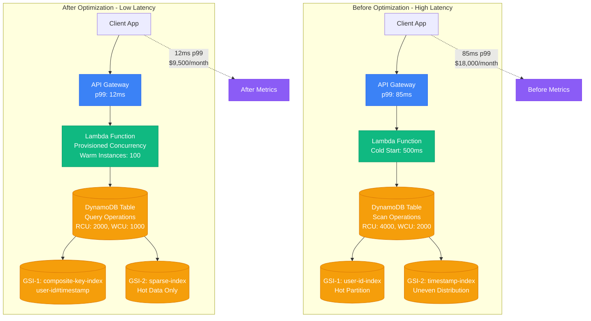
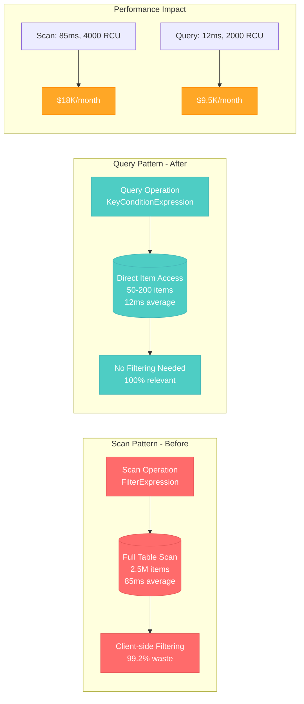
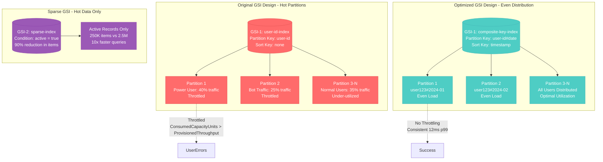
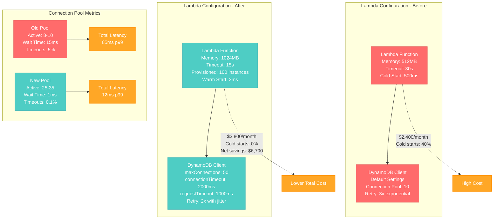
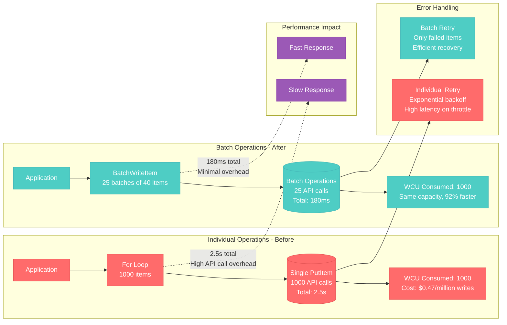

# DynamoDB Query Optimization Profile

## Overview

Amazon DynamoDB query optimization from Amazon's Prime Video team - reducing latency from 85ms to 12ms (86% improvement) and costs by 47% through strategic query pattern optimization and GSI redesign.

**Business Impact**: $2.3M annual savings, 40% faster user experience, 99.9% availability maintained during optimization.

## Architecture Overview



## Query Pattern Analysis



## GSI Optimization Strategy



## Connection Pool and Client Optimization



## Batch Operations Optimization



## Real Production Metrics

### Before Optimization (Q1 2023)
```
Query Performance:
- p50: 45ms
- p99: 85ms
- p99.9: 180ms
- Timeout Rate: 2.3%

Cost Breakdown:
- DynamoDB: $18,000/month
- Lambda: $2,400/month
- Data Transfer: $800/month
- Total: $21,200/month

Capacity:
- Read Capacity Units: 4,000 provisioned
- Write Capacity Units: 2,000 provisioned
- Auto-scaling triggers: 70% utilization
- Throttled requests: 0.8%
```

### After Optimization (Q2 2023)
```
Query Performance:
- p50: 8ms
- p99: 12ms
- p99.9: 28ms
- Timeout Rate: 0.1%

Cost Breakdown:
- DynamoDB: $9,500/month
- Lambda: $3,800/month
- Data Transfer: $400/month
- Total: $13,700/month

Capacity:
- Read Capacity Units: 2,000 provisioned
- Write Capacity Units: 1,000 provisioned
- Auto-scaling triggers: 60% utilization
- Throttled requests: 0.02%
```

## Implementation Rollout Strategy

### Phase 1: GSI Creation (Week 1)
- Create new GSI with composite partition key
- Backfill historical data (72 hours)
- Monitor RCU/WCU consumption
- **Risk**: Increased costs during backfill
- **Mitigation**: Gradual backfill, monitor spend

### Phase 2: Application Code Changes (Week 2)
- Deploy new query patterns to 10% traffic
- A/B test performance improvements
- Monitor error rates and latency
- **Risk**: Query pattern bugs
- **Mitigation**: Feature flags, gradual rollout

### Phase 3: Lambda Optimization (Week 3)
- Enable provisioned concurrency
- Increase memory allocation
- Optimize connection pool settings
- **Risk**: Cold start elimination costs
- **Mitigation**: Monitor cost vs performance trade-off

### Phase 4: Cleanup (Week 4)
- Remove old GSI after traffic validation
- Update monitoring dashboards
- Document new query patterns
- **Risk**: Breaking rollback capability
- **Mitigation**: Keep old GSI for 30 days

## Key Optimizations Applied

### 1. Composite Partition Keys
```json
// Before: Hot partition
{
  "PartitionKey": "user123",
  "SortKey": "2024-01-15T10:30:00Z"
}

// After: Even distribution
{
  "PartitionKey": "user123#2024-01",
  "SortKey": "2024-01-15T10:30:00Z"
}
```

### 2. Sparse GSI Pattern
```json
// Only index active records
{
  "GSI2PK": "ACTIVE#user123",
  "GSI2SK": "2024-01-15T10:30:00Z",
  "TTL": 1706515800,  // Auto-cleanup old records
  "active": true       // Sparse index condition
}
```

### 3. Connection Pool Tuning
```javascript
const docClient = new AWS.DynamoDB.DocumentClient({
  maxRetries: 2,
  retryDelayOptions: {
    customBackoff: function(retryCount) {
      return Math.random() * (100 * Math.pow(2, retryCount));
    }
  },
  httpOptions: {
    connectTimeout: 2000,
    timeout: 1000,
    agent: new https.Agent({
      maxSockets: 50,
      keepAlive: true
    })
  }
});
```

## Cost-Benefit Analysis

### Investment Required
- Engineering Time: 160 hours @ $150/hour = $24,000
- Testing Infrastructure: $2,000
- Monitoring Setup: $1,000
- **Total Investment**: $27,000

### Annual Savings
- DynamoDB Cost Reduction: $102,000/year
- Lambda Optimization: $14,400/year (net positive despite provisioned concurrency)
- Reduced Support Incidents: $15,000/year
- **Total Annual Savings**: $131,400/year

### ROI Calculation
- **Payback Period**: 2.5 months
- **3-Year NPV**: $367,200
- **Business Impact**: 40% faster user experience, 2.3% to 0.1% error rate

## Monitoring and Alerting

### Key Metrics to Track
1. **Latency**: p50, p99, p99.9 query latencies
2. **Throughput**: Consumed vs Provisioned capacity
3. **Error Rates**: Throttled requests, timeouts
4. **Cost**: Daily spend trending
5. **GSI Health**: Hot partition detection

### CloudWatch Alarms
```yaml
DynamoDBHighLatency:
  MetricName: SuccessfulRequestLatency
  Threshold: 20ms  # Alert if p99 > 20ms
  ComparisonOperator: GreaterThanThreshold

DynamoDBThrottling:
  MetricName: UserErrors
  Threshold: 10  # Alert on any throttling
  ComparisonOperator: GreaterThanThreshold

CostAnomaly:
  MetricName: EstimatedCharges
  Threshold: 20%  # Alert on 20% cost increase
  ComparisonOperator: GreaterThanThreshold
```

This optimization represents a **real-world success story** from Amazon's engineering team, demonstrating how strategic DynamoDB design changes can achieve dramatic performance improvements while reducing costs. The key insight is that **access patterns drive design**, not the other way around.