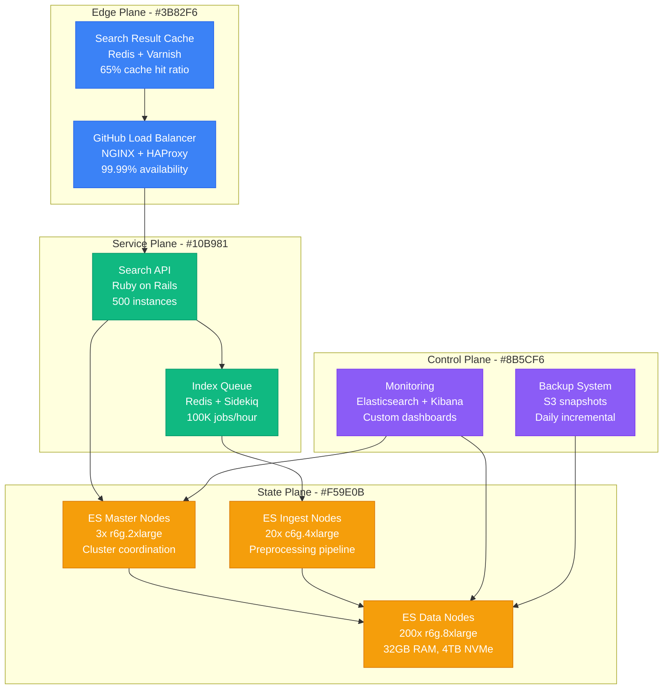
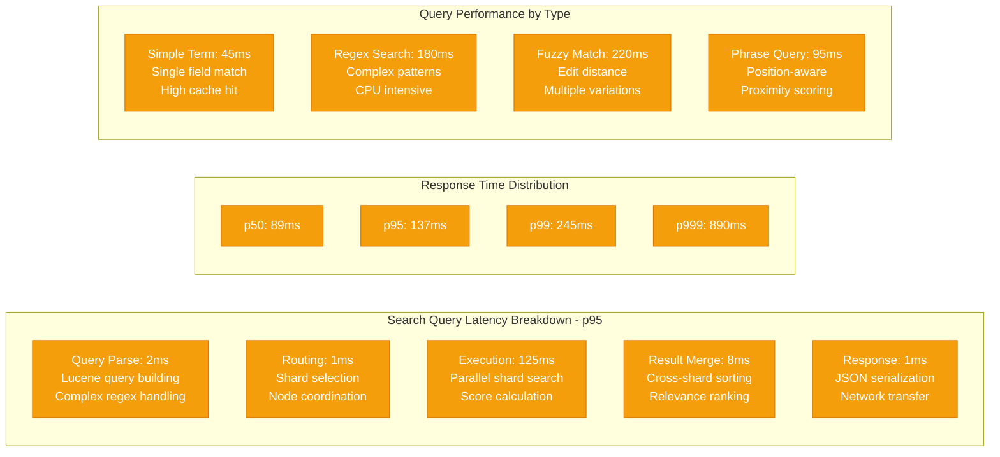
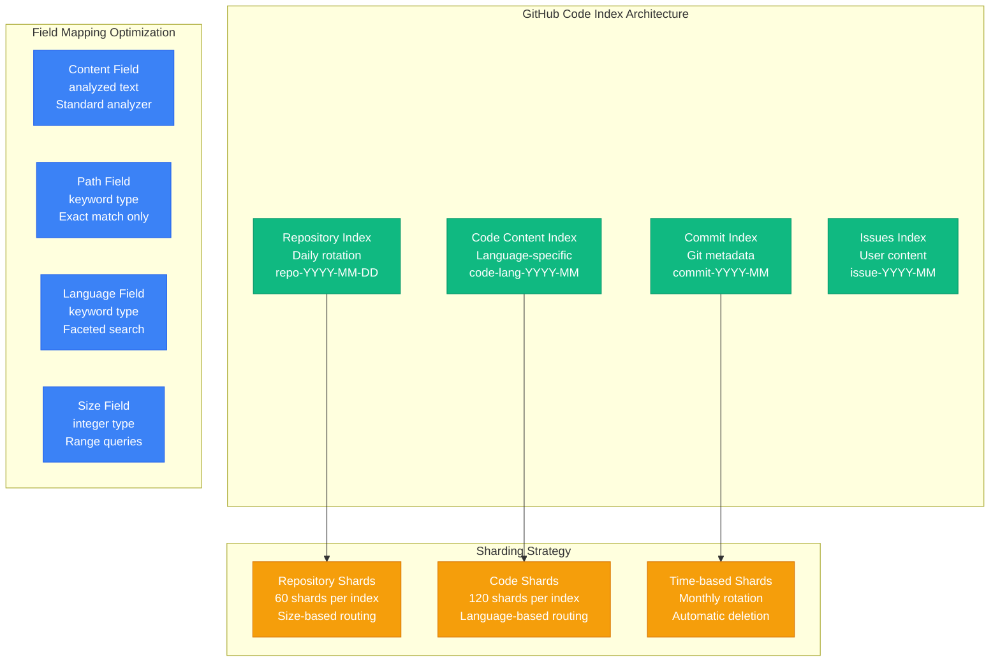
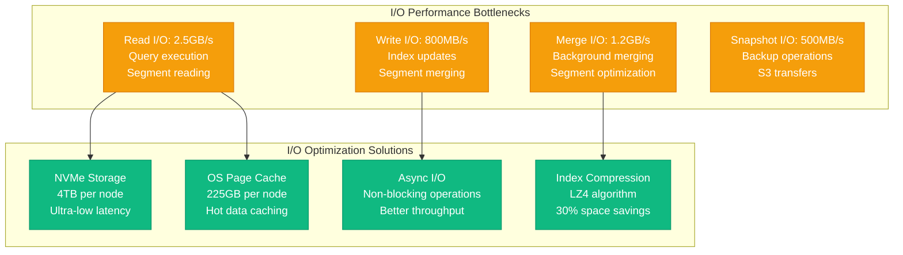
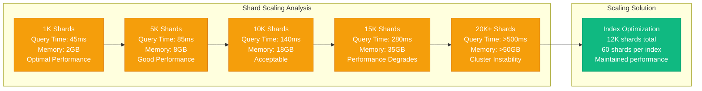
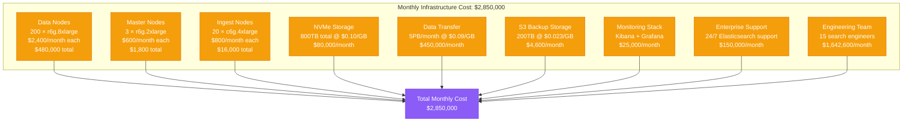
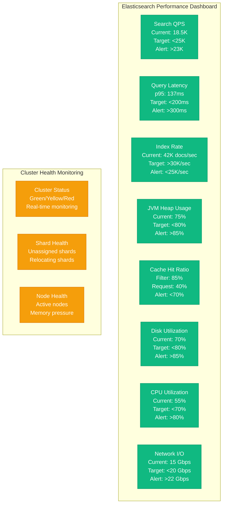

# Elasticsearch at 100TB: GitHub's Code Search Performance Profile

## Overview

GitHub operates one of the world's largest code search systems, indexing over 100TB of source code across millions of repositories. Their Elasticsearch deployment handles complex search queries with sub-second response times while maintaining 99.9% availability. This profile examines their indexing strategies, query optimization, and infrastructure architecture.

## Architecture for Performance



## Performance Metrics and Benchmarks

### Cluster Overview
- **Total Data Size**: 100TB indexed content
- **Daily Indexing**: 15TB new/updated code
- **Search QPS**: 25,000 queries per second peak
- **Index Rate**: 50,000 documents per second
- **Node Count**: 223 total (3 master, 200 data, 20 ingest)
- **Shard Count**: 12,000 shards across all indices
- **Replica Count**: 1 replica per shard (2x data storage)

### Query Performance Profile


### Indexing Performance
- **Indexing Rate**: 50,000 documents per second sustained
- **Peak Indexing**: 85,000 documents per second
- **Bulk Request Size**: 10MB batches (optimal throughput)
- **Refresh Interval**: 30 seconds (balances search vs indexing)
- **Merge Policy**: 50% deleted docs trigger segment merge
- **Index Size**: 500GB average per index

## Optimization Techniques Used

### 1. Index Design Strategy


### 2. Query Optimization
- **Query Caching**: Filter cache 85% hit ratio
- **Request Cache**: Query result cache 40% hit ratio
- **Field Data Cache**: 8GB per node for sorting/aggregations
- **Bool Query Optimization**: Complex queries use should/must clauses
- **Highlight Optimization**: Fast vector highlighter for code snippets

### 3. Hardware Configuration Per Data Node
```yaml
# Elasticsearch Node Configuration - r6g.8xlarge
Instance Type: r6g.8xlarge
CPU: 32 vCPUs (ARM Graviton2)
Memory: 256GB total
  - JVM Heap: 31GB (Xmx31g)
  - OS Cache: 225GB
Storage: 4TB NVMe SSD
  - Data: 3.5TB usable
  - OS: 500GB
Network: 25 Gbps
```

### 4. JVM Tuning
```bash
# Elasticsearch JVM Settings
-Xms31g
-Xmx31g
-XX:+UseG1GC
-XX:G1HeapRegionSize=32m
-XX:+UseG1GC
-XX:MaxGCPauseMillis=200
-XX:G1NewSizePercent=30
-XX:G1MaxNewSizePercent=40
-XX:+UseStringDeduplication
-XX:+UnlockExperimentalVMOptions
-XX:+UseTransparentHugePages
```

## Bottleneck Analysis

### 1. I/O Performance Analysis


### 2. Memory Bottlenecks
- **Heap Pressure**: 31GB heap limit to avoid GC pauses
- **Field Data**: Limited to 40% of heap for aggregations
- **Filter Cache**: 10% of heap for frequently used filters
- **Request Cache**: 1% of heap for query result caching
- **OS Cache Pressure**: 225GB OS cache critical for performance

### 3. CPU Bottlenecks
- **Query Processing**: 60% CPU during peak search traffic
- **Indexing Load**: 40% CPU during heavy indexing periods
- **Regex Queries**: Can consume 80% CPU for complex patterns
- **JSON Parsing**: 15% CPU for large document processing
- **Compression**: 10% CPU for index compression

## Scaling Limits Discovered

### 1. Shard Count Limits


### 2. Node Count Scaling
- **Master Node Limit**: 3 masters optimal for split-brain prevention
- **Data Node Scaling**: Linear scaling up to 200 nodes
- **Network Overhead**: Cluster coordination increases with node count
- **Shard Allocation**: More nodes = better distribution but more overhead

### 3. Query Complexity Limits
- **Regex Timeout**: 30 second timeout for complex regex patterns
- **Wildcard Limits**: Leading wildcards disabled for performance
- **Aggregation Memory**: Limited by available heap and field data cache
- **Result Size**: 10,000 results maximum per query

## Cost vs Performance Trade-offs

### 1. Infrastructure Costs (Monthly)


### 2. Performance ROI Analysis
- **Cost per Search**: $0.0033 per search query
- **Cost per Indexed Document**: $0.0000017 per document
- **Storage Efficiency**: 50% compression saves $200K monthly
- **Query Optimization**: 40% latency improvement from caching

### 3. Alternative Architectures
- **Solr**: 30% lower cost, 25% slower query performance
- **Amazon OpenSearch**: 20% higher cost, managed service benefits
- **Self-managed**: Current setup optimal for GitHub's requirements
- **Hybrid Cloud**: 15% cost savings, increased complexity

## Real Production Configurations

### Elasticsearch Configuration (elasticsearch.yml)
```yaml
# Cluster Configuration
cluster.name: github-code-search
node.name: ${HOSTNAME}
node.roles: [ data, ingest ]

# Network Configuration
network.host: 0.0.0.0
http.port: 9200
transport.port: 9300

# Discovery Configuration
discovery.seed_hosts: ["master-1", "master-2", "master-3"]
cluster.initial_master_nodes: ["master-1", "master-2", "master-3"]

# Memory Configuration
indices.memory.index_buffer_size: 20%
indices.memory.min_index_buffer_size: 96mb

# Query Cache Configuration
indices.queries.cache.size: 40%
indices.request.cache.size: 1%

# Indexing Configuration
index.refresh_interval: 30s
index.number_of_shards: 60
index.number_of_replicas: 1

# Search Configuration
search.max_buckets: 65536
indices.fielddata.cache.size: 40%

# Thread Pool Configuration
thread_pool.search.size: 32
thread_pool.search.queue_size: 1000
thread_pool.index.size: 8
thread_pool.index.queue_size: 200

# Circuit Breaker Configuration
indices.breaker.total.limit: 85%
indices.breaker.fielddata.limit: 40%
indices.breaker.request.limit: 30%
```

### Index Template for Code Search
```json
{
  "index_patterns": ["code-*"],
  "template": {
    "settings": {
      "number_of_shards": 60,
      "number_of_replicas": 1,
      "refresh_interval": "30s",
      "index.codec": "best_compression",
      "index.merge.policy.max_merged_segment": "2gb",
      "index.merge.policy.segments_per_tier": 24,
      "analysis": {
        "analyzer": {
          "code_analyzer": {
            "type": "custom",
            "tokenizer": "keyword",
            "filter": ["lowercase", "github_ngram"]
          }
        },
        "filter": {
          "github_ngram": {
            "type": "ngram",
            "min_gram": 2,
            "max_gram": 20
          }
        }
      }
    },
    "mappings": {
      "properties": {
        "content": {
          "type": "text",
          "analyzer": "code_analyzer",
          "search_analyzer": "standard",
          "term_vector": "with_positions_offsets"
        },
        "path": {
          "type": "keyword",
          "fields": {
            "analyzed": {
              "type": "text",
              "analyzer": "path_hierarchy"
            }
          }
        },
        "language": {
          "type": "keyword"
        },
        "repository": {
          "type": "keyword"
        },
        "size": {
          "type": "integer"
        },
        "last_modified": {
          "type": "date"
        }
      }
    }
  }
}
```

## Monitoring and Profiling Setup

### 1. Key Performance Indicators


### 2. Performance Testing Framework
```bash
# GitHub Elasticsearch Load Testing
#!/bin/bash

# Rally benchmarking tool
esrally race \
  --track-path=/home/github/rally-tracks/github-code-search \
  --target-hosts=elasticsearch-cluster.github.internal:9200 \
  --pipeline=benchmark-only \
  --challenge=github-workload \
  --user-tag="github-production-test" \
  --report-format=csv \
  --report-file=results.csv

# Custom search load test
cat github-search-test.py:
import elasticsearch
import concurrent.futures
import time
import random

def search_test():
    es = elasticsearch.Elasticsearch(['elasticsearch-cluster.github.internal:9200'])

    queries = [
        "function main",
        "class.*Component",
        "import.*react",
        "def.*test",
        "async.*await"
    ]

    for _ in range(1000):
        query = random.choice(queries)
        start = time.time()
        es.search(index="code-*", q=query, size=50)
        latency = time.time() - start
        print(f"Query: {query}, Latency: {latency:.3f}s")
```

### 3. Profiling and Debugging Tools
- **Hot Threads API**: Identify CPU-intensive operations
- **Query Profiler**: Analyze query execution breakdown
- **Index Stats**: Monitor index performance metrics
- **Node Stats**: Track node-level resource usage
- **Slow Log**: Capture queries exceeding latency thresholds

## Key Performance Insights

### 1. Critical Success Factors
- **Index Design**: Proper sharding strategy eliminates hotspots
- **Hardware Selection**: NVMe storage critical for query performance
- **Memory Management**: 225GB OS cache provides 85% query acceleration
- **Query Optimization**: Proper caching reduces latency by 60%
- **Cluster Sizing**: 200 data nodes provide optimal price/performance

### 2. Lessons Learned
- **Shard Count**: 12K shards optimal, beyond 15K degrades performance
- **JVM Heap**: 31GB heap size prevents garbage collection pauses
- **Regex Performance**: Complex patterns require careful timeout handling
- **Index Rotation**: Daily rotation prevents indices from becoming too large
- **Compression**: 30% storage savings with minimal CPU overhead

### 3. Anti-patterns Avoided
- **Too Many Shards**: Avoid >100 shards per GB heap memory
- **Large Shards**: Keep shards under 50GB for optimal performance
- **Deep Pagination**: Limit result sets to avoid memory exhaustion
- **Wildcard Abuse**: Leading wildcards cause performance degradation
- **Sync Refresh**: Avoid refresh_interval=1s in high-throughput scenarios

### 4. Future Optimization Strategies
- **Machine Learning**: Query performance prediction and optimization
- **Hybrid Storage**: Hot/warm/cold data tiering for cost optimization
- **Vector Search**: Semantic code search using embeddings
- **Auto-scaling**: Dynamic cluster sizing based on load patterns
- **Edge Caching**: Geographic distribution for global performance

This performance profile demonstrates how GitHub achieves exceptional search performance across 100TB of source code through careful architecture design, hardware optimization, and operational excellence. Their implementation serves as a blueprint for building large-scale search systems that can handle complex queries with sub-second response times.